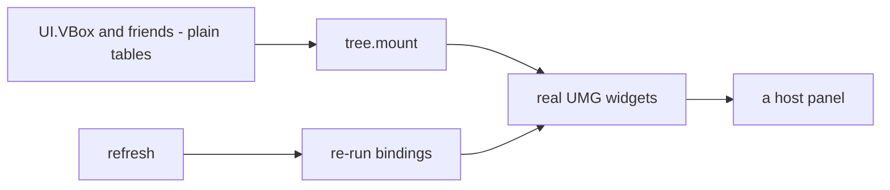
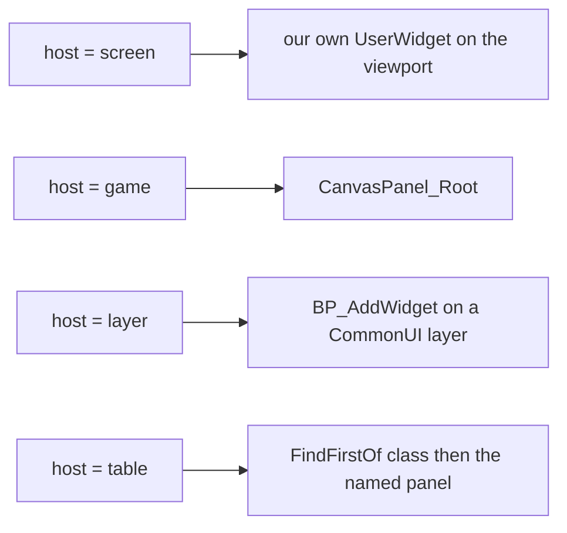
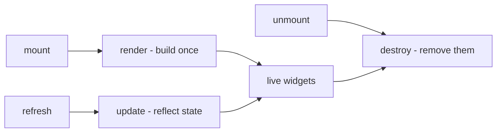
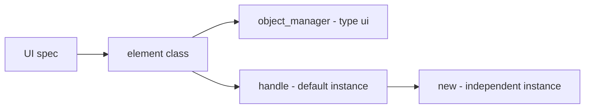
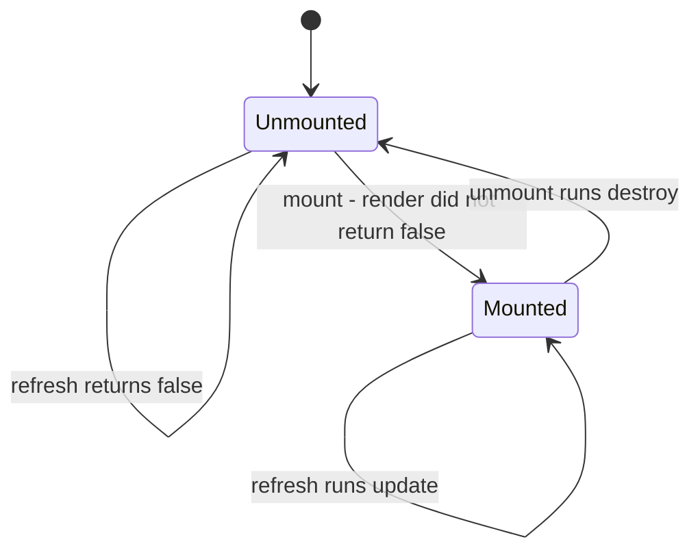
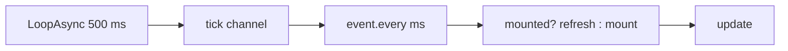
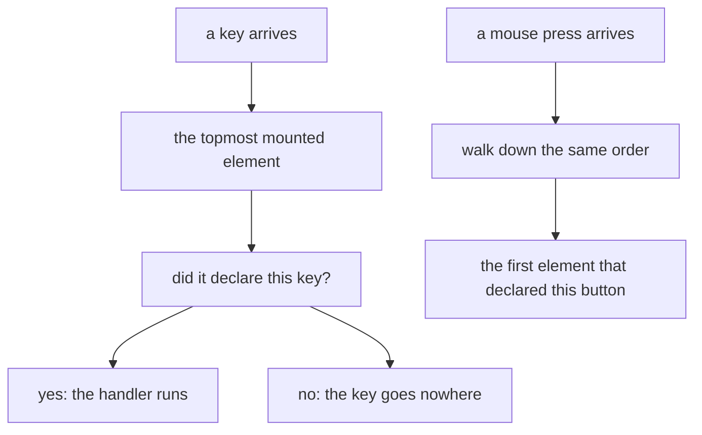
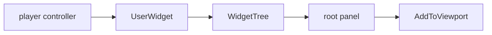

## What you can do after this page

- Declare a panel as a tree of nodes, so the nesting in your file is the nesting on screen
- Mount it into the game's own in-game UI, into a viewport layer of your own, or into a screen the game already draws
- Keep what it shows current, and know exactly how stale it can be
- Take the mouse cursor, or the game's own click mode, without ever breaking Esc
- Declare which panel is on top, and which one gets a key press
- Add your own entry to the title screen menu, and take everything back off again

## Your first panel

A UI element is anything you draw on screen: a line of text, a button, a whole panel. You
describe one with `UI{ ... }`, and it is built out of Palworld's own on-screen UI kit.

There are two ways to say what an element builds, and they are mutually exclusive. Declare a
`root` tree, or write a `render` function. The tree is the ordinary case:

```lua title="content/ui/panel.lua"
local UI = require("palforge.api.ui")   -- or use the global UI installed by palforge.api
local VBox, Label, Button = UI.VBox, UI.Label, UI.Button

local Supplies = UI{
    id   = "example:Supplies",
    host = "game",                       -- the game's own in-game UI root canvas
    root = VBox{ padding = 12,
        Label{ text = "Supplies" },
        Label{ name = "count", text = function(self) return "Wood x" .. self.wood end },
        Button{ text = "Take one",
                onClick = function(self) self.wood = self.wood - 1 end },
    },
}

Supplies:new{ wood = 10 }:autoMount(nil, 2000)
```

`render` is the other seam. It hands you a host panel and a free hand, which is what an
element that has to negotiate with the game's own widget tree needs:

```lua
local Panel = UI{
    id          = "example:Panel",
    name        = "Example Panel",
    description = "One line of text.",

    render = function(self, root)
        -- build the widget tree under `root`; runs once per mount
        -- return false if you could not build: the element then stays unmounted
    end,

    update  = function(self) end,   -- reflect changed state into the widgets render built
    destroy = function(self) end,   -- remove them again
}
```

Declaring both `root` and `render` is a hard error at define time. They are two answers to
one question, and `render` runs exactly once per mount, so there is no ordering of the two
that is not a surprise to somebody.

To reach an element another file defined, look it up by its id:

```lua
UI.get("palforge:Button")   -- a handle for an element defined elsewhere; never nil
UI.get_all()                -- every registered element, as a list of handles
```

## Declaring a tree

A node constructor is called with a declarative table and returns inert data. No engine call
happens until something mounts the tree, which is why a declared panel can be built, nested
and checked with no game running.



**Children are positional.** The array part of the table is the children, the named part is
the fields. `children = { ... }` is accepted too, for a tree some other code generated, and
writing both is a hard error rather than a merge.

**Two fields may be a function**, and only two: `text` and `visible`. A function is a
*binding* — it is called with the element instance when the tree is built, re-evaluated on
every `:refresh()`, and written back only when the value **changed**. Those are the two
fields a live panel actually changes; everything else is written once, so a heartbeat refresh
over an idle panel costs comparisons rather than a native call per node.

**Validation runs at each call site, inner to outer**, so the complaint names the node you
got wrong rather than the panel that contains it. `Label{ tetx = "x" }` is an error with a
did-you-mean, not a label that never says anything.

```lua title="content/ui/status.lua"
local UI = require("palforge.api.ui")
local Frame, Border, SizeBox, VBox, HBox = UI.Frame, UI.Border, UI.SizeBox, UI.VBox, UI.HBox
local Label, Button, Sprite = UI.Label, UI.Button, UI.Sprite

local Status = UI{
    id   = "example:Status",
    host = "game",
    data = { wood = 0, open = true },

    -- The game's own window chrome, a colour of our own inside it, a fixed size around that.
    root = Frame{
        Border{ color = { 0.10, 0.09, 0.08, 0.98 },
            SizeBox{ width = 420, height = 180,
                VBox{ padding = 12,
                    Label{ text = "Supplies", size = 20, native = true },
                    HBox{
                        Sprite{ icon = "Wood" },
                        Label{ name = "count",
                               text    = function(self) return "x" .. self.wood end,
                               visible = function(self) return self.open end },
                    },
                    Button{ text = "Close", onClick = function(self) self:unmount() end },
                },
            },
        },
    },
}
```

`self` inside a binding or an `onClick` is the element **instance**, which is the mountable
object itself: a close button is `self:unmount()`, and a button that changes what a sibling
label says is one assignment to `self`.

A node that declared `name = "..."` is reachable afterwards as `handle:find("count")` — the
live widget, or nil before the tree is built and after it is taken down. That is the
imperative escape hatch out of a declared tree, and from there you are responsible for the
same thing `render` always was.

## The eleven nodes

| Constructor | Builds | Children |
| --- | --- | --- |
| `UI.VBox` | a `VerticalBox` | any number |
| `UI.HBox` | a `HorizontalBox` | any number |
| `UI.Overlay` | an `Overlay`: children stacked on each other | any number |
| `UI.ScrollBox` | a `ScrollBox` | any number |
| `UI.Border` | a `Border` in a colour you chose | exactly one |
| `UI.SizeBox` | a `SizeBox` with a fixed width and height | exactly one |
| `UI.Frame` | the game's own window chrome, `WBP_PalCommonWindow_C` | exactly one |
| `UI.Label` | a `TextBlock`, or the game's own `BP_PalTextBlock_C` | none |
| `UI.Button` | one of the game's own buttons, routed through its `CommonButtonBase` | none |
| `UI.Sprite` | a `UImage` with a texture in it | none |
| `UI.GameWidget` | any Blueprint widget the game ships, by class path | none |

Giving a node more children than it holds is an error at the call site: `UI.Label{ ... }` with
a child names the nodes that do take children, and `UI.Border{ a, b }` says to put them in a
VBox or an HBox.

Every node also carries these five, appended after the kind's own fields. Four of the five are
the parent's half of the layout — a slot belongs to the parent panel in UMG, but "put this one
on the left" is a fact about the child, and a list of children is the only place it can be
written.

<TypeTable
  type={{
    name: {
      description: 'Look the built widget up later with handle:find("<name>").',
      type: 'string',
    },
    visible: {
      description: 'BINDABLE. false COLLAPSES the widget, so it stops taking layout space too.',
      type: 'boolean | fun(self): boolean',
    },
    hAlign: {
      description: 'Horizontal alignment in the parent slot: fill, left, center, right.',
      type: 'string',
    },
    vAlign: {
      description: 'Vertical alignment in the parent slot: fill, top, center, bottom.',
      type: 'string',
    },
    padding: {
      description: 'Slot padding: one number for all four sides, or { left =, top =, right =, bottom = }.',
      type: 'number | table',
    },
  }}
/>

Alignment goes through `core/signature`, so a slot class that does not declare it logs a
named refusal instead of raising. Every box, overlay, border and size slot declares
`SetHorizontalAlignment`; a `CanvasPanelSlot` does not, so `hAlign` on the direct child of a
`host = "game"` tree is refused and says what the slot really declares.

The fields worth knowing per kind:

| Node | Fields |
| --- | --- |
| `Border` | `color = { r, g, b, a }` in 0..1; omitted, PalForge's own dark panel colour |
| `SizeBox` | `width`, `height` in slate units — this is how a `Sprite` is sized |
| `Frame` | none of its own. `color` is **refused**: a Frame wears the game's window art and nothing here can tint it |
| `Label` | `text` (bindable), `size`, `color`, `native` |
| `Button` | `text` (bindable), `onClick`, `labelAlign` |
| `Sprite` | `path` or `icon` + `from`, `matchSize`, `color`, `opacity` |
| `GameWidget` | `class` (required), `text` + `textChild`, `onClick` + `clickChild` |

A few of those carry a finding rather than a preference:

- `Label{ native = true }` builds `BP_PalTextBlock_C`, a `UPalTextBlockBase`, which is where
  Palworld's font scaling, UI-settings binding and localisation live. It ignores `color` (the
  game's own text style decides that) and its `size` goes through `UpdateFontSize`, the one
  font call in this tree that takes a plain int rather than a struct. The class is resident in
  a world but not guaranteed at the title screen, so a native label that cannot be built falls
  back to the plain one and the substitution is logged.
- `Sprite` has no width or height, and that is a measurement rather than an omission: this
  build's `UImage` declares no `SetBrushSize`, the brush's `ImageSize` is a struct write, and
  `SetDesiredSizeOverride` takes an `FVector2D`. So a sprite takes the texture's own pixel size
  (`matchSize`, the default) or is sized by the node that already does sizing:
  `SizeBox{ width = 48, height = 48, Sprite{ icon = "Wood", matchSize = false } }`.
- `Sprite{ icon = "Wood" }` looks the id up in the game's own icon DataTables through
  `core/icons`, whose coverage is measured: 674/674 pal rows, 1183/1207 item rows, 567/571
  building, 311/311 partner-skill. A miss is nearly always a misspelt id, and ids are
  case-sensitive.
- `GameWidget`'s `text` does nothing without `textChild`, and its `onClick` does nothing
  without `clickChild`. The node clones a widget whose internals it cannot guess, so both go to
  the child you name and nowhere otherwise.

<Callout type="warn">
A game menu button's label cannot be left-aligned through its slot. A probe read the button's
own template tree and reported that its inner `HorizontalBox_0` sits in a `CanvasPanelSlot` —
the one slot class of the six that declares no `SetHorizontalAlignment` (UMG.hpp:350-374) — so
`core/signature` refused that call every time, correctly, and the label stays centred. The
alignment a `CanvasPanelSlot` **does** declare, `SetAlignment`, takes an `FVector2D`, and a
struct argument is the shape that faults inside UE4SS marshalling where `pcall` cannot see it.
The helper that tried was deleted rather than left to log a refusal on every button build.

`Button{ labelAlign = "left" }` is a different construction, not a second attempt at that one:
an `Overlay` holds the game button stretched to fill, with a plain `TextBlock` of ours over the
top at `ESlateVisibility` HitTestInvisible, so every click passes through to the button
underneath, and an `OverlaySlot` does declare the alignment calls. The cost is why it is opt-in:
the text is ours, so it inherits none of the button's font, hover states or localisation.
</Callout>

## What you pass to UI

`id` is the only field you have to give. `root` or `render` is what makes the element useful.

<TypeTable
  type={{
    id: {
      description: 'Element id, e.g. "example:Panel". Validated at define time for the shape id resolution requires.',
      type: 'string',
      required: true,
    },
    name: {
      description: 'Human label. Defaults to id.',
      type: 'string',
    },
    description: {
      description: 'One-line description, for UI and tooling.',
      type: 'string',
    },
    root: {
      description: 'The widget tree, declared. Mutually exclusive with render. It also decides what input, backHandler and host = "layer" may declare: all three need the root to be a UI.Frame.',
      type: 'UI.Node',
    },
    host: {
      description: 'Where to mount when mount() is given no root: "screen", "game", "layer", or { widget = <class>, panel = <member> }. mount(root) with an explicit root wins over it.',
      type: 'string | table',
    },
    render: {
      description: 'fun(self, root): boolean? — build the widget tree under root. Runs once per mount. Return false to report that nothing was built.',
      type: 'function',
    },
    update: {
      description: 'fun(self) — refresh the already-built widgets. Runs on each refresh call.',
      type: 'function',
    },
    destroy: {
      description: 'fun(self) — remove the widgets render built. Runs on each unmount call.',
      type: 'function',
    },
    input: {
      description: 'How much of the player\'s input this element takes while mounted: "none" (default), "cursor", "clicks", "exclusive". The last two require a UI.Frame root.',
      type: 'string',
      default: '"none"',
    },
    backHandler: {
      description: 'Claim the CommonUI BACK action (that is Esc) on this element\'s window. Requires a UI.Frame root. Declared, shipped and never once observed working.',
      type: 'boolean',
    },
    z: {
      description: 'Stacking order, higher on top. Decides drawing only where the host has a z of its own; it decides event routing always.',
      type: 'number',
      default: '0',
    },
    keys: {
      description: 'The key names onKeyPressed wants, spelled as UE4SS spells them ("INS", "END", "F4", "NUM_ZERO"). A key Palworld\'s live key config already uses is refused at mount with the action named.',
      type: 'string[]',
    },
    overrideKeys: {
      description: 'Keys to take deliberately even though Palworld\'s key config uses them. Same routing; the only difference is that PalForge stops refusing. "ESCAPE" is still refused.',
      type: 'string[]',
    },
    onKeyPressed: {
      description: 'fun(self, ctx) — one of keys went down. ctx.key / ctx.z / ctx.id. Reaches ONLY the topmost mounted element.',
      type: 'function',
    },
    buttons: {
      description: 'Which mouse buttons onMousePressed wants: "left", "right", "middle". Every mouse button on a default install is bound by the game, so this list is usually empty.',
      type: 'string[]',
    },
    overrideButtons: {
      description: 'Mouse buttons to take deliberately. On a default install this is the only list that ever produces a working mouse route.',
      type: 'string[]',
    },
    onMousePressed: {
      description: 'fun(self, ctx) — one of buttons went down. ctx.button / ctx.z / ctx.id. Goes to the topmost element that declared it and stops there.',
      type: 'function',
    },
    data: {
      description: 'Default fields shared by every instance of this element.',
      type: 'table',
    },
  }}
/>

Values that differ from one copy of the element to the next do **not** go here. Pass them to
`:new{ label = "OK", onClick = fn }` and read them as `self.label` inside `render` / `update` /
`destroy` or inside a binding. Use `data` for defaults every copy should share.

The same list of fields is printable from inside the game, and it is generated from the same
strings your editor completes from:

```lua
local schema = require("palforge.core.schema")
print(schema.help("UI.Spec"))         -- every field, its type and meaning
schema.get("UI.Spec").fields          -- the same as a table, for tooling
print(schema.help("UI.Node.Label"))   -- and one per node kind
```

`UI` takes an optional second argument, as every PalForge domain constructor does:

```lua
UI(spec, { register = false })   -- build the class, hand it back, register nothing
UI(spec, { pack = "mypack" })    -- register under that pack id

-- the same call with the pack filled in for you
local UI = PalForge.pack("mypack").UI
```

`register = false` is what a catalog accessor needs: a read that fabricates a handle must not
take the id away from a pack that has not defined it yet. `pack` is what makes an id collision
attributable — registration is last-wins, and the warning names the previous owner and the new
one instead of an element quietly disappearing.

The id itself is checked at **define** time for the shape id resolution requires. An id with a
colon whose halves are not letters, digits or underscores resolves to nothing at every engine
boundary, so it would register, look healthy in `UI.get_all()`, and be silently dead:

```text
PalForge: UI "my-pack:Panel": invalid pack id 'my-pack' in 'my-pack:Panel' (letters/digits/_ only)
```

## Where it mounts: host

`mount(root)` still takes an explicit root and it wins over `host`. An element with neither
mounts nowhere and says so: `:lastError()` carries the reason the last attempt gave up.

| `host` | Where it goes |
| --- | --- |
| `"screen"` | a viewport layer of our own, stacked by `AddToViewport` at 1000 plus the declared `z` |
| `"game"` | the game's own in-game UI root canvas: `CanvasPanel_Root` inside `WBP_PalOverallUILayout`, a `UCanvasPanel` and therefore the one host with a real ZOrder |
| `"layer"` | the game's own route: pushed onto a CommonUI layer through `BP_AddWidget`, so the action router owns activation, focus and input mode |
| `{ widget = "PalUITitleBase", panel = "VerticalBox_0" }` | any live widget class and the panel inside it — how a pack extends a screen the game already draws |



```lua
UI{ id = "pack:Hud",   host = "screen", root = ... }
UI{ id = "pack:Panel", host = "game",   root = ... }
UI{ id = "pack:Extra", host = { widget = "PalUITitleBase", panel = "VerticalBox_0" },
    root = ... }
```

Name the **native base class** for a table host, not the blueprint class: the lookup matches
subclasses, so `"PalPrimaryGameLayoutBase"` survives a blueprint rename where
`"WBP_PalOverallUILayout_C"` would not. The panel is read as a declared member first and
searched for by name second, because a widget whose designer "Is Variable" box is unchecked
gets no member and still exists in the widget tree.

A host that is not up yet is not a failure. At the moment a pack's files load there is no
title screen, no in-game layout and often no player controller, so `mount()` returns false and
the element stays down. `:autoMount(nil, ms)` is the retry loop for exactly that.

A `"screen"` host is built with no dimmer and no inset frame on purpose: a frame the author did
not declare is not composition. A declared tree that wants one writes it.

<Callout type="warn">
`host = "layer"` is declared, shipped and **never once observed working**. Every fact it rests
on is read out of this install's dump — `UPrimaryGameLayout` registers its CommonUI layers in a
`TMap<FGameplayTag, UCommonActivatableWidgetContainerBase*>`, and `BP_AddWidget` makes the game
create, stack, activate, transition and register the widget — but no run has watched
`BP_AddWidget` answer for a widget of ours. It **requires** a `UI.Frame` root, because only a
Palworld activatable may go on a layer, and that is refused at define time rather than left to
fail at mount. An element that declares it and cannot get on stays unmounted with the reason,
which is what `:autoMount` retries.

The run that settles it is `pf_hook ui-host-layer`, and `pf_uiz`'s LAYER panel is what it
mounts. Until it reports, a panel that declares this must still have another way up.
</Callout>

What **has** been observed: on 2026-07-27, `pf_uidecl` mounted a declared tree into
`PalPrimaryGameLayoutBase.CanvasPanel_Root` with a `CanvasPanelSlot`, and the panel was visible
on screen. That is the load-bearing evidence for `host = "game"`.

## render, update and destroy



`render(self, root)` builds your widgets under `root`. `mount()` calls it once each time the
element goes on screen. Return `false` when you could not build — the panel you needed was not
there yet, for example. The element then stays off screen, and mounting again later tries once
more. Returning `nil` counts as success, so a render that always works need not return
anything.

`update(self)` writes new values into the widgets `render` already built. `refresh()` calls it.

`destroy(self)` removes the widgets `render` built. `unmount()` calls it, and only while the
element is on screen.

A **declared tree fills all three itself**, and two of them compose with yours. On a refresh
the tree's bindings run first and your `update` second, so yours can override what a binding
wrote. On the way down your `destroy` runs first and the tree is taken apart after it, so yours
can still touch the widgets.

You never have to track whether you rendered already. `mount` does that, and rather more:

```lua
-- Class:mount in api/ui.lua, abridged
function Class:mount(root)
    if self._mounted then return false end
    if root == nil and self.hostSpec ~= nil then
        -- resolve the declared host; a host that is not up yet is a refusal, not a raise
        local host, reason = tree.host(self.hostSpec, { z = self.zOrder })
        if not host then return refuse(self, reason) end
        self._host, root = host, host.panel
    end
    self._root = root
    if self:render(root) == false then
        self._root = nil
        self:releaseInput()          -- a mount that could not build leaves no cursor behind
        self:releaseHost()           -- and no viewport layer of ours behind either
        return false
    end
    self._mounted = true
    stackPush(self)                  -- in the routing list BEFORE anything that can fail
    self:applyZ()
    self:armInput()
    self:grabInput()
    return true
end
```

All three seams do nothing until you write them, so an element can be a declaration and nothing
else — useful when the id exists just so other mods can find it through `UI.get`.

```lua
-- valid: registers "example:Marker" with no behaviour at all
UI{ id = "example:Marker", description = "Reserved id, nothing rendered." }
```

Split the work the way the names say. Everything that builds a widget goes in `render` and is
stored on `self`; everything that writes a new value into a widget that already exists goes in
`update`; everything that takes a widget back out goes in `destroy`:

```lua
local widget = require("palforge.native.ui._widget")

local Label = UI{
    id   = "example:Label",
    data = { text = "" },

    render = function(self, screen)
        if not (screen and widget.alive(screen.root)) then return false end
        local ok = pcall(function()
            self.textWidget = widget.text(screen.tree, tostring(self.text), 18)
            widget.addChild(screen.root, self.textWidget)
        end)
        if not ok then self:destroy(); return false end
        return true
    end,

    update = function(self)
        if not widget.alive(self.textWidget) then return false end
        local t = self.textWidget
        return pcall(function() t:SetText(FText(tostring(self.text))) end)
    end,

    destroy = function(self)
        local t = self.textWidget
        self.textWidget = nil
        if not widget.alive(t) then return false end
        return pcall(function() t:RemoveFromParent() end)
    end,
}
```

<Callout type="info">
`mount()` marks the element as on screen from what `render` **returned**, not from the fact
that it ran. A `false` return leaves the element off screen and forgets the root you passed, so
calling `mount()` again later simply tries again. You do not have to test the game state
yourself before every attempt.
</Callout>

## One panel, many copies



`UI{ ... }` registers your element under its id and gives you back a **handle**: the object you
call `:mount`, `:refresh` and `:unmount` on. That handle already carries one copy of the
element, so what `UI{ ... }` returns is mountable as it is. `:new(props)` gives you another copy
with its own state.

```lua
local Badge = UI{
    id     = "example:Badge",
    data   = { label = "Badge", size = 18 },
    render = function(self, root) end,
}

local a = Badge:new{}                  -- a:state().label == "Badge"  (from data)
local b = Badge:new{ label = "Boss" }  -- b:state().label == "Boss", b:state().size == 18
```

`:new` hands back a handle, not the state itself: the state lives behind `:state()`, and
`a.label` on the handle is nil. That state table is what `self` is inside `render` / `update` /
`destroy` and inside every binding, and a name read on it is found in this order:

1. fields you passed to `:new{ ... }`, plus anything a seam or an `onClick` assigns to `self`
2. the element's `data` defaults, copied onto the class at define time
3. the lifecycle methods and the seams

Writing `self.label = "x"` inside a binding sets the field on that one copy; the shared `data`
default is untouched.

From outside, read and write a copy's state through `:state()`:

```lua
local st = a:state()
st.label = "Ready"
a:refresh()             -- nothing does this for you
```

<Callout type="info">
State names resolve through the element itself, so these are already taken: `id`, `name`,
`description`, `render`, `update`, `destroy`, `mount`, `refresh`, `unmount`, `isMounted`,
`find`, `hostSpec`, `inputMode`, `backHandler`, `zOrder`, `rootNode`, `keyList`, `keySet`,
`overrideList`, `buttonList`, `buttonSet`, `overrideButtonList`, `onKeyPressed`,
`onMousePressed`, and every underscore field (`_mounted`, `_root`, `_tree`, `_host`, `_input`,
`_refreshSub`, `_stackSeq`).
</Callout>

`UI.get(id)` builds a **new** handle with a **new** empty copy on every call, so two `UI.get`
calls give you two panels you can put on screen independently:

```lua
local one = UI.get("palforge:Button")
local two = UI.get("palforge:Button")   -- a different instance of the same element
```

For an id nobody defined, `UI.get` returns a handle rather than nil, and the stand-in it builds
carries the whole lifecycle: `:mount()`, `:refresh()`, `:unmount()` and `:isMounted()` all
resolve and quietly do nothing, because the three seams default to inert. A `mount()` on one
reports success and builds no widgets. Look an element up only once whatever defines it has
loaded — `core/registry` decides that order.

## Show it, update it, hide it



```lua
local panel = Panel:new{ title = "Status" }

panel:mount(root)      -- true: render did not report a failure
panel:mount(root)      -- false: already mounted, render is NOT run again
panel:isMounted()      -- true
panel:refresh()        -- true: update() ran
panel:unmount()        -- destroy() runs, then everything the mount took is given back
panel:refresh()        -- false: not mounted, update() does not run
panel:mount(root)      -- true: renders again from scratch
panel:lastError()      -- nil after a success; the reason after a failure
```

`mount()` returns `false` in two different situations: the element is already on screen, or
`render` returned `false`. Neither is an error, and neither leaves half a panel behind.

`refresh()` does nothing and returns `false` until the element is on screen, so it is safe to
call from a subscription that outlives it.

`unmount()` takes the element out of the routing list **first**, before anything that can fail:
an element coming down must stop being the reason a key does not reach the panel underneath,
even if its `destroy()` raises. Then it runs `destroy()` inside a `pcall`, clears the mounted
flag and the stored root, gives the player's input back, gives back a host it created, and
cancels an `autoRefresh` or `autoMount` subscription.

<Callout type="warn">
`unmount()` calls only the `destroy` you wrote, and the default `destroy` does nothing. An
element that stores widgets on `self` in `render` and defines no `destroy` leaks them: the flag
clears, a later `mount()` builds a second copy, and the first one stays on screen. A declared
`root` has no such hole — the tree's own teardown is installed for you.
</Callout>

## Keeping the screen up to date

<Callout type="warn">
Polling is not one of two options. It is the only refresh driver PalForge has. Nothing calls
`refresh()` for a pack, so every element either calls `:refresh()` by hand when its own state
changes or rides the 500 ms heartbeat — and there is no way to refresh exactly when the game
rebuilds a screen. Three consequences worth stating rather than leaving to be discovered:

- a panel shows **stale content for up to `ms` milliseconds**. A binding that reads a count the
  player just changed is behind by that much, and shortening `ms` is the only lever.
- `TitleMenu`'s whole re-injection strategy is a poll for the same reason: the title screen
  rebuilds its widget tree and takes our buttons with it, nothing tells us it did, so its
  `update()` re-checks every entry on this same beat.
- a beat over an idle panel is cheap on purpose — bindings compare and write back only what
  changed — so a fast `ms` costs comparisons, not native calls.
</Callout>

Option one — refresh where the change happens. Exact, and costs nothing while nothing changes:

```lua
local event = require("palforge.core.event")

event.on("item.obtain", function(ctx)
    if ctx.itemId ~= "Wood" then return end
    local st = panel:state()
    st.wood = (st.wood or 0) + (ctx.count or 1)
    panel:refresh()
end)
```

Option two — poll. Both pollers ride `event.every`, which counts whole heartbeats of
`event.TICK_MS` (500 ms), so the real period rounds up to a multiple of 500.

```lua
panel:mount(root)
panel:autoRefresh()        -- refresh every 500 ms
panel:autoRefresh(2000)    -- no-op: a subscription is already installed, returns true

-- the whole lifecycle instead: retry mount() while it is down, refresh it once it is up
panel:autoMount(nil, 2000)
```



`:autoRefresh(ms)` is a no-op while the element is unmounted, because `refresh()` is. That is
what `:autoMount(root, ms)` is for: the same one subscription, but while the element is down it
retries `mount(root)`, and once it is up it refreshes it. **This is the mount path every live
PalForge UI takes**, and a retry that keeps failing is not silent — `mount()` records the reason
on the instance and logs it once per **distinct** reason, so `:lastError()` answers "why is my
panel not up" at any moment and the log does not fill with one line per beat.

Details that matter:

- `autoRefresh` defaults to 500 ms; `autoMount` defaults to 2000, because a retry loop wants a
  slower beat than a refresh.
- The two share one subscription slot. A second call while one is running returns `true` without
  installing another. To change the interval, `unmount()` first.
- `unmount()` cancels it, so it is also how you stop an `autoMount` retrying.
- Either returns `false` if the subscription could not be installed; the whole call is guarded.
- Each drives the one copy behind that handle. Another copy needs its own call.

<Callout type="info">
Whether Palworld raises a catchable UFunction when a UI is rebuilt is **unmeasured**, and it is
what would replace the poll. The dump names four candidates —
`PalUserWidget:OnSetup` and `:OnClosed` on the base class every Palworld screen derives from,
`PalUIHUDLayoutBase:AddHUD`, and `CommonActivatableWidget:ActivateWidget` — and eliminates a
fifth, `UPalUIManagerSubsystem`, which declares zero functions.

Two things still have to be measured before any of them is hooked: the three that read as
BlueprintImplementableEvents give a blueprint that implements one its **own** UFunction of that
name, so a hook on the base may catch nothing; and a hook armed during the world-load storm has
wedged the shared dispatch before. `pf_hook ui-update-event` is the run that settles both.
</Callout>

## Input: what a panel takes from the player

Drawing a widget and being able to click it are two different problems. While the game holds
mouse capture — ordinary gameplay — Slate is never offered the pointer, so hit-testing, z-order
and visibility are all irrelevant and every button in every mod is inert. Pressing Esc is what
fixes it by hand: the game's own menu switches the input mode and shows the cursor.

| `input` | What it takes |
| --- | --- |
| `"none"` | **the default.** Nothing. Clickable only while the game has already given the mouse away, i.e. with a menu open. A HUD readout wants exactly this. |
| `"cursor"` | the mouse cursor and nothing else. `bShowMouseCursor` is a plain readable property, so it is restored exactly as it was found. |
| `"clicks"` | the game's own GameAndMenu mode: clicks reach widgets while the player can still move and look. |
| `"exclusive"` | the game's own Menu mode — a modal, what an inventory screen declares. Game input stops. |

The last two are carried **where the game carries them**, which has a consequence visible from
the declaration: they need the element's root to be a `UI.Frame{ }`, because
`WBP_PalCommonWindow_C` is the one widget in this vocabulary that is a Palworld activatable.
Declaring either without one is refused at define time.

```lua
local UI = require("palforge.api.ui")
local Frame, VBox, Label, Button = UI.Frame, UI.VBox, UI.Label, UI.Button

UI{
    id    = "example:Dialog",
    host  = "game",
    z     = 100,
    input = "clicks",             -- needs the Frame below; refused at define time without it
    root  = Frame{
        VBox{ padding = 16,
            Label{ text = "Pick one", native = true },
            Button{ text = "Close", onClick = function(self) self:unmount() end },
        },
    },
}
```

Every Palworld screen is a `UPalActivatableWidget` and **declares** the mode it wants as two
bytes on itself (`InputConfig`, `GameMouseCaptureMode`); CommonUI's action router reads the
topmost activatable's declaration, applies it, and restores the previous one when that widget
deactivates. PalForge writes those two bytes onto the frame before it is activated — the only
moment the router reads them — and unmounting gives the mode back **through the router** rather
than by forcing anything.

<Callout type="warn">
PalForge never calls `SetInputMode` on the player controller, and that is not a style choice.
Two live runs did, and both broke Esc: in the first the game's menu would not close, in the
second it would not open at all. Writing the mode by hand leaves the router describing an input
state that is no longer true, and Esc is not a key on this build — it is a UI **action** the
same router resolves against the same activatable stack.

Underneath that there is still a floor: every input grab is registered on `_G` and swept on
`core/poll`'s heartbeat, so one that nobody can answer for any more — because the element is
gone, because its `destroy` raised, or because a hot reload took the whole Lua state with it —
releases itself. A grab with no owner to ask is capped at 120 seconds.
</Callout>

<Callout type="warn">
Neither `"clicks"` nor `"exclusive"` has been **observed working**. No run has watched the
action router read a declaration off a widget of ours. What arrives when the root is not an
activatable is the cursor plus a note saying the widget-side write did not happen, so a run can
tell "the game's route was taken" from "the panel is not an activatable and got nothing".

The same is true of `backHandler = true`, which sets `bIsBackHandler` on the element's window
before it is activated — how a Palworld screen says "Esc closes ME" — and answers
`BP_OnHandleBackAction`. It requires a `UI.Frame` root, it is refused at define time without
one, and it is **declared, shipped and never once observed working**. `pf_hook ui-backhandler`
is the run that records the answer. Until it reports, a panel that declares it must still have
another way down.
</Callout>

## Stacking order and event routing

Two panels up at once is the ordinary case — a HUD readout and a dialog over it — and without a
declared order it is decided by whichever pack's file the loader happened to reach first. `z` is
that order, declared, default 0, higher on top.

```lua
UI{ id = "pack:Hud",    host = "game", z = 0,   root = ... }
UI{ id = "pack:Dialog", host = "game", z = 100, root = ... }
```

It decides two different things, and it is worth being exact about which is which.

**Drawing** is the engine's, and only where the engine has a z at all. A tree hosted in the
game's canvas gets it, because `UCanvasPanelSlot` is the one slot class that declares `ZOrder`
and `SetZOrder`. A tree injected into the title screen's `VerticalBox` cannot — a box stacks by
child order and has no z — and that is reported once per instance, not swallowed and not
repeated per mount. A `"screen"` host stacks by `AddToViewport` instead, at 1000 plus the
declared `z`.

**Routing** is `api/ui`'s own, and it is exact everywhere, host or no host: the mounted elements
are kept in (z, then mount order) and events walk that order.



- `onKeyPressed` reaches **only the topmost mounted element**. A panel does not get a key while
  anything above it is still up, even if the thing above it wants no keys at all. That is the
  modal reading and it is deliberate: the top panel is what the player is looking at.
- `onMousePressed` goes to the topmost element that **wants** it, and stops there. An element
  that declares no `onMousePressed` is transparent to a press rather than blocking it.
- Among equal `z`, the most recently mounted goes first — which is what UMG itself does with a
  canvas, where children of equal ZOrder draw in the order they were added.
- **Neither consumes anything.** A UE4SS keybind observes; it does not swallow. The game
  receives every one of these presses regardless. "Stops there" means it stops travelling down
  PalForge's list, and nothing more.

Which keys and which buttons have to be declared, and that is not bureaucracy: a press is read
through UE4SS's `RegisterKeyBind`, which binds one **named** key. There is no "give me every
key". Half a declaration is an error at define time — `onKeyPressed` with no `keys` cannot be
wired to anything, and `keys` with no `onKeyPressed` would bind one of the player's keys for the
whole session and route it to nothing.

```lua
UI{ id = "pack:Dialog", host = "game", z = 100,
    keys            = { "INS" },
    onKeyPressed    = function(self, ctx) self:unmount() end,
    overrideButtons = { "middle" },
    onMousePressed  = function(self, ctx) log.info("middle at z " .. ctx.z) end,
    root            = ... }
```

**Whether a key is free is asked, not assumed.** `core/keyboard` reads Palworld's own key config
out of the running game — the struct the options screen edits — and answers per key, so a
`keys = { "F7" }` that collides with the player's own binding is refused **at mount** with the
action it collides with named, instead of arming into silence. That is what F7 cost the first
time: its bind succeeded, it was the game's volume control, and the key never arrived.

<Callout type="warn">
An override buys exactly one thing: PalForge stops refusing. The game's own action still fires,
the player's key config is not rewritten, and nothing can make a press arrive that the game
takes below UE4SS. Sharing a key means both things happen and you may still get nothing.

On a default install **all three mouse buttons are bound by the game** (middle is
DirectAttackOrder), so `buttons` alone is refused at arm time and `overrideButtons` is the only
list that ever produces a working mouse route — and middle-clicking will also order your pal to
attack. `"ESCAPE"` is refused by name, override or not: a keybind on it could only observe, never
participate, because Esc is resolved as a named UI action against the activatable stack.

Nothing is ever unbound. UE4SS has no unregister for a keybind, so a key is armed at most once
per session and an element that unmounts stops receiving because the **router** stops choosing
it, not because the bind went away.
</Callout>

An `onMousePressed` is a global press notification routed by z. UE4SS cannot tell us what was
under the cursor, and nothing here consumes the press. Clicking a thing on screen is
`Button{ onClick = ... }`, which goes through the game's own `CommonButtonBase` and really does
know which widget was hit. The two are different events and neither substitutes for the other.

The rule is published rather than described, because a rule nobody can inspect is a rumour:

```lua
UI.stack()          -- every MOUNTED element in routing order, one row each
UI.routeKey("INS")  -- who would get INS right now, plus the sentence that says why
UI.routeMouse("middle")
UI.report()         -- printable lines: the stack, the key binds, the grabs, the keymap
```

`UI.routeKey` and `UI.routeMouse` do not synthesize anything to the game — they answer the
question a press would ask. That is how the headless suite proves the rule with no keyboard,
and how a probe asks "if INS arrived right now, who would get it".

```text
1  pack:Dialog  z=100  seq=2  keys=INS  buttons=middle
2  pack:Hud     z=0    seq=1  keys=INS  buttons=

UI.routeKey("INS")   -> "pack:Dialog", 'key "INS" -> pack:Dialog (z=100)'
UI.routeMouse("mid") -> nil, 'mouse "mid" reached none of the 2 mounted element(s) ...'
```

`UI.report()` crosses four sources that answer four different questions: the stack says **who**
would get a press, the key binds say whether a press can **arrive** at all, the grab list says
what is still being held from the player, and the keymap says what Palworld has on every key —
107 rows on the measured build. A key that arrived zero times is attributed against the first
two rather than shrugged at.

## Everything you can call

`UI{ ... }`, `UI.get(id)` and `:new(props)` all return a `UI.Handle`, and these are its members.

| Member | Returns | What it does |
| --- | --- | --- |
| `.id` | `string` | the element's id |
| `:new(props)` | `UI.Handle` | a fresh, independently mountable instance; `props` becomes its state |
| `:mount(root)` | `boolean` | render once under `root`, or under the declared `host` when `root` is nil |
| `:refresh()` | `boolean` | run the tree's bindings and `update()`; `false` until mounted |
| `:unmount()` | — | leave the routing list, run `destroy()`, give back the input and the host, cancel the poller |
| `:isMounted()` | `boolean` | whether a render reported success and `unmount` has not run |
| `:find(name)` | `userdata?` | the live widget a node claimed with `name = "..."`; nil until mounted |
| `:lastError()` | `string?` | why the last mount attempt gave up, as a sentence |
| `:autoRefresh(ms)` | `boolean` | poll `refresh()` off the heartbeat; `ms` defaults to 500 |
| `:autoMount(root, ms)` | `boolean` | poll the whole lifecycle: retry `mount` while down, refresh while up; `ms` defaults to 2000 |
| `:state()` | `table` | the instance — what `self` is inside the seams and the bindings |
| `:name()` | `string` | the element's `name`, or its id |
| `:description()` | `string?` | the element's `description` |

And on the module itself:

| Member | Returns | What it does |
| --- | --- | --- |
| `UI(spec, opts)` | `UI.Handle` | define an element; `opts` is `{ register = false, pack = "id" }` |
| `UI.get(id)` | `UI.Handle` | an existing element, else an inert stand-in; never nil |
| `UI.get_all()` | `UI.Handle[]` | every registered element |
| `UI.VBox` … `UI.GameWidget` | `UI.Node` | the eleven node constructors |
| `UI.stack()` | `table[]` | every mounted element in routing order |
| `UI.routeKey(name)` | `string?, string` | who would take that key, and why |
| `UI.routeMouse(button)` | `string?, string` | the same for a mouse button |
| `UI.report()` | `string[]` | the stack, the key binds, the outstanding grabs and the live keymap |
| `UI.Class` | `table` | the base class every element extends |

## Building your own screen

Your widgets need somewhere to live. A declared tree finds its own host from `host`; an
imperative `render` is handed one. Both are built with `native/ui/_widget.lua`, the toolkit the
ready-made elements use.



Every helper in the toolkit needs a `WidgetTree` — the container Unreal keeps a screen's widgets
in — and a bare `UUserWidget` has none, because the engine normally builds one from a widget's
compiled Blueprint. `widget.screen()` builds that tree itself and attaches it, which is what
lets you make UI from Lua alone, with nothing to compile.

```lua
local widget = require("palforge.native.ui._widget")

local screen, why = widget.screen()
if not screen then
    print("no screen: " .. tostring(why))
end

-- when it built:
--   screen.widget  the UUserWidget now on the viewport
--   screen.tree    the WidgetTree every primitive constructs into
--   screen.root    the VerticalBox your widgets go under
--   screen.pc      the controller that owns it; the clickable helpers need it
```

`widget.screen(pc, opts)` never throws. It returns the screen table, or `nil` plus a reason
string: there is no owner, a UMG class is missing, or `AddToViewport` did not take. `pc`
defaults to `widget.owner()` — the `PalPlayerController`, else any `PlayerController`, else the
`GameInstance`, and `nil` when there is no game at all.

<TypeTable
  type={{
    zOrder: {
      description: 'Viewport z-order passed to AddToViewport.',
      type: 'number',
      default: '1000',
    },
    show: {
      description: 'Add to the viewport immediately. Pass false to build it hidden and call widget.show yourself.',
      type: 'boolean',
      default: 'true',
    },
    dim: {
      description: 'Colour of the fullscreen dimmer behind the panel, as { r, g, b, a }. Pass false for a bare VerticalBox root with no frame at all.',
      type: 'table | false',
      default: '{ 0.02, 0.02, 0.03, 0.86 }',
    },
    panel: {
      description: 'Colour of the inset panel your widgets sit on, as { r, g, b, a }.',
      type: 'table',
      default: '{ 0.10, 0.09, 0.08, 0.98 }',
    },
    padding: {
      description: 'Padding inside that panel, as { Left, Top, Right, Bottom }.',
      type: 'table',
      default: '{ Left = 90, Top = 54, Right = 90, Bottom = 54 }',
    },
  }}
/>

```lua
-- a bare vertical stack: no dimmer, no frame, drawn under the default z
local bare = widget.screen(nil, { dim = false, zOrder = 500 })

-- built but not shown; put it up and take it down yourself
local hidden = widget.screen(nil, { show = false })
widget.show(hidden)       -- AddToViewport; true if the widget reports itself shown
widget.hide(hidden)       -- RemoveFromParent; true if it is no longer shown
```

The pieces you fill it with:

| Helper | Builds |
| --- | --- |
| `widget.vbox(tree)` / `widget.hbox(tree)` | a `VerticalBox` / `HorizontalBox` |
| `widget.scrollBox(tree)` / `widget.overlay(tree)` | a `ScrollBox` / `Overlay` |
| `widget.border(tree, rgba)` | a `Border`, brush colour `{ r, g, b, a }` |
| `widget.sizeBox(tree, w, h)` | a `SizeBox`; each override is written as the property with its `bOverride_` flag and again through the setter, because UE4SS setters sometimes no-op |
| `widget.text(tree, str, size, rgba)` | a `TextBlock`; `size` defaults to 16 |
| `widget.palText(tree, str, size)` | the game's own `BP_PalTextBlock_C`, or nil plus why |
| `widget.menuButton(tree, pc, label, onClick)` | one of the game's own buttons; returns the button, its click target and the click-router key |
| `widget.clickableRow(tree, pc, label, onClick, opts)` | that button with left-aligned text laid over it; returns a fourth value, the `TextBlock` |
| `widget.gameFrame(pc, opts)` | `WBP_PalCommonWindow_C` plus the NamedSlot your content goes into |
| `widget.cloneGameWidget(tree, pc, classPath, opts)` | any Palworld BP widget; `opts = { label, labelChild, clickChild, onClick }` |
| `widget.addChild(panel, child)` | puts `child` into whatever kind of panel `panel` is, and returns its slot |
| `widget.gameUIRoot()` / `widget.hostPanel(class, panel)` | the game's own in-game canvas / any panel inside any live widget class |
| `widget.alive(w)` | whether a widget can still be talked to; never throws |
| `widget.findByName(w, name)` | depth-first search for a descendant widget, by name |
| `widget.releaseClicks(names)` | drop click-router entries by key — what a `destroy` calls |

`widget.addChild` asks the panel what it is rather than being told: it tries `AddChild` first,
because that is `UPanelWidget`'s generic entry and every panel overrides it to build its own
slot type, and falls back to the typed `AddChildTo*` names. It also fixes the one thing a fresh
`CanvasPanelSlot` gets wrong — its offsets are all zero, so a widget added to a canvas would
occupy a 0x0 box and never draw — by setting `bAutoSize`, which is the only way to do that
without a struct argument.

`mount(root)` hands `root` to `render` untouched, so an element can take the whole screen table
as its root and reach `tree`, `root` and `pc` from that one argument:

```lua title="content/ui/stats_panel.lua"
local UI     = require("palforge.api.ui")
local Item   = require("palforge.api.item")
local Pal    = require("palforge.api.pal")
local widget = require("palforge.native.ui._widget")

local Stats = UI{
    id   = "example:Stats",
    name = "Stats",
    data = { title = "PalForge", rows = {} },

    render = function(self, screen)
        if not (screen and widget.alive(screen.root)) then return false end
        self.clicks = {}
        local ok = pcall(function()
            local head = widget.text(screen.tree, self.title, 24)
            widget.addChild(screen.root, head)
            for _, row in ipairs(self.rows) do
                local line, _, clickName =
                    widget.clickableRow(screen.tree, screen.pc, row.label, row.onClick)
                widget.addChild(screen.root, line)
                self.clicks[#self.clicks + 1] = clickName
            end
        end)
        if not ok then self:destroy(); return false end
        self.screen = screen
        return true
    end,

    -- Taking the whole screen off the viewport removes every widget under it at once.
    destroy = function(self)
        widget.releaseClicks(self.clicks or {})
        if self.screen then widget.hide(self.screen) end
        self.clicks, self.screen = nil, nil
        return true
    end,
}

local panel = Stats:new{
    title = "PalForge",
    rows  = {
        { label = "Give 10 Wood",    onClick = function() Item.get("Wood"):give(10) end },
        { label = "Spawn a Chikipi", onClick = function() Pal.get("ChickenPal"):spawn() end },
    },
}

local screen = widget.screen()
if screen then panel:mount(screen) end
```

<Callout type="info">
`_widget.lua` sits under `native/ui`, not under `api/`, so its helpers can change between
versions without warning. A declared tree is the surface with the compatibility promise; the
toolkit is what a `render` reaches for when the declaration cannot say what it needs.
</Callout>

## Ready-made elements

PalForge comes with two elements you can use as they are. Both put real widgets into the game's
own UI, and both are registered under the pack id `palforge`, so a pack that defines the same id
replaces them and the collision is named in the log rather than silent.

```lua
local ui = require("palforge.native.ui")
ui.Button                                    -- also require("palforge.native.ui.button")
ui.TitleMenu                                 -- also require("palforge.native.ui.title_menu")
ui.widget                                    -- the toolkit, without the underscore module
ui.tree                                      -- what turns a declared node tree into widgets
ui.keys                                      -- the keyboard seam; keys.report() is printable

UI.get("palforge:Button")                    -- the same element, a fresh instance
```

Call `:new{ ... }` rather than mounting the module value directly, so every place you use it
keeps its own label and its own callback.

### Button

`palforge:Button` — one clickable button, styled like the game's own.

```lua
local Button = require("palforge.native.ui.button")
local widget = require("palforge.native.ui._widget")

local screen = widget.screen()
local give   = Button:new{
    label   = "Give 10 Wood",
    onClick = function() Item.get("Wood"):give(10) end,
}
if screen then give:mount(screen.root) end
```

It reads two fields from the copy you make: `self.label` (defaults to `""`) and `self.onClick`.
`render` stores the button on `self.widget`, its click target on `self.invButton`, its label
widget on `self.labelWidget` and the click router's key on `self.clickName`.

What `render` does, in order:

- finds a `PalPlayerController`, returning `false` when there is none
- builds one of the game's own buttons through `widget.buttonClass()`, which asks the **world**
  what button class is loaded rather than naming a path. It leads with `WBP_CommonButton_C`, the
  button Palworld's own Mod Menu is built from, because that is the only candidate that declares
  a label child (`Text_Main`) and a click target (`WBP_PalInvisibleButton`) by name rather than
  by luck. The title-menu class is only resident at the title screen, which is what an earlier
  attempt died on inside a world.
- writes `label` through `widget.setButtonText`, which prefers the button's own declared
  `SetText` and reaches for the label child only when the class declares no setter
- registers the click target with the shared click router: a single `RegisterHook` on
  `/Script/CommonUI.CommonButtonBase:HandleButtonClicked` that sends the click to whichever
  callback owns the button. The click target is the child the class declares, else any
  `CommonButtonBase` in its tree, else the button itself.
- adds the button to `root` with `widget.addChild`

Placement is checked, not assumed. If `root` accepts no child at all, `render` runs its own
`destroy()` — dropping the button and its click handler rather than leaving an invisible button
wired to a live callback — and returns `false`.

`update` writes the current `self.label` **and** the current `self.onClick` into the live
button, so you can change either without building it again:

```lua
give:state().label = "Give 50 Wood"
give:refresh()
```

It returns `false` when the button itself is gone. When only the cached label widget went stale,
it looks the label child up again first. Re-registering a click replaces the router entry rather
than adding one, and clearing `onClick` drops it.

`destroy` releases the button's click-router entry and calls `RemoveFromParent()`, so
`unmount()` really takes the button off the screen and a later `mount()` builds a fresh one.

### TitleMenu

`palforge:TitleMenu` — adds entries to the game's title screen. This works on the real title
screen.

```lua
local TitleMenu = require("palforge.native.ui.title_menu")

local menu = TitleMenu:new{
    entries = {
        { label = "Mods",     onClick = function() openMods() end },
        { label = "Settings", onClick = function() openSettings() end },
    },
}
menu:autoMount(nil, 2000)   -- waits for the title screen, then re-injects when it rebuilds
```

`self.entries` is an array of `{ label = ..., onClick = ... }`. Before it touches a single
entry, `render` resolves three things and returns `false` if any is missing: the root — the
`root` you passed if it is valid, else `FindFirstOf("PalUITitleBase").WidgetTree.RootWidget` —
then `VerticalBox_0` inside it, which is the title screen's button column, and a valid
`PalPlayerController`. For every entry that has no live button it then:

1. builds a native menu button and wraps it in a `SizeBox` sized from the native neighbour
   `SizeBox_4`, read as the `WidthOverride` / `HeightOverride` **properties** — the getters read
   back nil. Without that fixed width the button stretches and centres.
2. adds the `SizeBox` to the column, left-aligns the slot and gives it a top and bottom padding
   of 3, matching the game's own entries
3. records the button, its click target, its `SizeBox` and its click-router key on the entry

After a pass that added at least one entry, it moves the parent box of
`WBP_Title_MenuButton_ExitGame` to the end of the column, so Exit Game stays last — a
`VerticalBox` has no insert.

`render` returns `true` only when an entry really went in, so a `mount()` attempted before the
title screen exists leaves the element off screen and can simply be repeated.

`update` does two things on the same beat. Every entry whose click target is no longer valid is
injected again — the title screen rebuilds its widgets on returning to the title, for instance,
and silently takes the added buttons with it — and every entry that **is** still alive has its
current `label` and `onClick` written into the live button, skipped when neither changed. So
editing `self.entries` and refreshing is a real edit, and a refresh can never stack duplicates.

`destroy` removes every entry's `SizeBox` from the button column and releases its click-router
entry, so `unmount()` takes the menu back out and a later `mount()` adds it afresh.

<Callout type="warn">
There is no world and no player character at the title screen. An entry that calls
`Item.get("Wood"):give(10)` there will fail: `give` goes through the local player's inventory.
Keep title entries to menu actions, and mount an in-game panel for anything that touches
gameplay.
</Callout>

## Recipes

### A panel that shows a counter

A declared panel that counts Wood pickups. The tree is the whole of the drawing; the
`item.obtain` handler moves the number and calls `:refresh()`, and `:autoMount(nil, 2000)` is
what gets it in once a world is up and keeps retrying while there is none.

```lua title="content/ui/wood_counter.lua"
local UI    = require("palforge.api.ui")
local event = require("palforge.core.event")
local Frame, Border, SizeBox, VBox, HBox = UI.Frame, UI.Border, UI.SizeBox, UI.VBox, UI.HBox
local Label, Sprite, Button = UI.Label, UI.Sprite, UI.Button

local Counter = UI{
    id          = "example:Counter",
    name        = "Counter",
    description = "A running count of the Wood you have picked up.",
    host        = "game",
    z           = 10,
    data        = { label = "Wood", count = 0 },

    root = Frame{
        Border{ color = { 0.10, 0.09, 0.08, 0.98 },
            SizeBox{ width = 320, height = 110,
                VBox{ padding = 12,
                    HBox{
                        Sprite{ icon = "Wood" },
                        -- BINDABLE: re-evaluated on every refresh, written back only when
                        -- the value moved.
                        Label{ name = "count", size = 20,
                               text = function(self)
                                   return self.label .. ": " .. self.count
                               end },
                    },
                    Button{ text = "Hide", onClick = function(self) self:unmount() end },
                },
            },
        },
    },
}

local wood = Counter:new{ label = "Wood", count = 0 }

-- The in-game layout does not exist at load, so this retries until it does and refreshes
-- afterwards. mount() records why each attempt gave up; wood:lastError() reads it back.
wood:autoMount(nil, 2000)

-- Move the state, then refresh: nothing refreshes for you.
event.on("item.obtain", function(ctx)
    if ctx.itemId ~= "Wood" then return end
    local st = wood:state()
    st.count = st.count + (ctx.count or 1)
    wood:refresh()
end)

-- Leaving the world drops the widgets; unmount also stops the retry loop, so mount it again
-- from world.ready if you want it back.
event.on("world.left", function() wood:unmount() end)
event.on("world.ready", function() wood:autoMount(nil, 2000) end)
```

The heartbeat is doing nothing here except retrying the mount: the count is written the moment
`item.obtain` fires. Drop the `event.on` and give `:autoMount` a shorter beat when the number
comes from something with no event behind it — the binding then reads whatever is current, at
the cost of being up to that many milliseconds stale.

### A button wired to give an item

<Tabs items={['Standalone button', 'Title menu entries']}>
<Tab value="Standalone button">

```lua title="content/ui/give_button.lua"
local Button = require("palforge.native.ui.button")
local Item   = require("palforge.api.item")
local widget = require("palforge.native.ui._widget")
local log    = require("palforge.utils.log").scope("give-button")

-- One instance per use site: :new gives this button its own label and callback.
local giveWood = Button:new{
    label   = "Give 10 Wood",
    onClick = function()
        local ok = Item.get("Wood"):give(10)
        log.info("gave wood: " .. tostring(ok))
    end,
}

local screen

-- A screen of our own to host it: screen.root is a VerticalBox, which is exactly what
-- Button's render adds itself to.
local function show()
    if giveWood:isMounted() then return end
    screen = widget.screen(nil, { dim = false })
    if not screen then return end
    if not giveWood:mount(screen.root) then
        widget.hide(screen)
        screen = nil
    end
end

local function hide()
    giveWood:unmount()          -- destroy() removes the button and drops its click handler
    if screen then widget.hide(screen) end
    screen = nil
end

return { show = show, hide = hide }
```

</Tab>
<Tab value="Title menu entries">

```lua title="content/ui/title_entries.lua"
local TitleMenu = require("palforge.native.ui.title_menu")
local UI        = require("palforge.api.ui")
local event     = require("palforge.core.event")
local log       = require("palforge.utils.log").scope("title")

local menu = TitleMenu:new{
    entries = {
        {
            label   = "PalForge: elements",
            onClick = function()
                for _, el in ipairs(UI.get_all()) do
                    log.info(el.id .. " -> " .. el:name())
                end
            end,
        },
        {
            label   = "PalForge: version",
            onClick = function() log.info(tostring(PalForge.env.version)) end,
        },
    },
}

-- The title screen does not exist yet when this file loads, and it rebuilds itself later.
-- autoMount is both halves: it waits for the screen, then re-injects on the same beat.
menu:autoMount(nil, 2000)

-- Entering a world takes the title screen away; unmount so a later mount injects afresh.
event.on("world.ready", function() menu:unmount() end)
event.on("world.left",  function() menu:autoMount(nil, 2000) end)
```

</Tab>
</Tabs>

Both buttons route their clicks through the same hook, and both drop their router entry in
`destroy`, so an element you took down leaves nothing behind. Giving items only works with a
live player character, so `Item.get("Wood"):give(10)` belongs on the in-game button, not on a
title entry.

## Errors

Every problem is a hard error, and the call never half-succeeds.

```lua
UI{ name = "Panel" }
```

```text
PalForge: UI: field "id" is required (element id, e.g. "pack:Panel")
```

```lua
UI{ id = "example:Panel", onClick = function() end }
```

```text
PalForge: UI: unknown field "onClick". Valid fields: id, name, description, root, host,
render, update, destroy, input, backHandler, z, keys, overrideKeys, onKeyPressed, buttons,
overrideButtons, onMousePressed, data
```

`onClick` belongs to a copy of the element, or to a `Button` node, not to the definition.

```lua
UI{ id = "example:Panel", root = UI.VBox{}, render = function() end }
```

```text
PalForge: UI "example:Panel" declares BOTH `root` and `render`, and they are two answers to
the same question — a declared tree builds the widgets, and so does render(). Keep the tree
and drop render (self:find("<name>") reaches any node that declared a name), or keep render
and drop the tree.
```

```lua
UI{ id = "example:Panel", root = UI.VBox{}, input = "clicks" }
```

```text
PalForge: UI "example:Panel" declares input = "clicks", which Palworld carries on an
ACTIVATABLE WIDGET (UPalActivatableWidget.InputConfig / bIsBackHandler, and a CommonUI layer
takes nothing else) — and this element's root is a vbox, which is not one. Wrap the tree in
UI.Frame{ ... }: that builds WBP_PalCommonWindow_C, the game's own window, which IS an
activatable ...
```

The same message answers `backHandler = true` and `host = "layer"`, and it goes on to say what
satisfying the rule is currently known to buy, which is nothing yet.

```lua
UI{ id = "example:Panel", onKeyPressed = function() end }
```

```text
PalForge: UI "example:Panel" declares onKeyPressed but no `keys`. A press is read through
UE4SS's RegisterKeyBind, which binds ONE named key — there is no way to ask for all of them —
so name the ones you want: keys = { "INS" }.
```

```lua
UI.VBox{ UI.Label{ tetx = "Supplies" } }
```

```text
PalForge: UI.Label: unknown field "tetx" (did you mean "text"?). Valid fields: text, size,
color, native, name, visible, hAlign, vAlign, padding
```

```lua
UI.Frame{ color = { 1, 0, 0 }, UI.Label{ text = "x" } }
```

```text
PalForge: UI.Frame: field "color" is invalid: a Frame takes no colour: it wears the GAME's
own window art (WBP_PalCommonWindow_C) and nothing here can tint it ... For a coloured panel
write Border{ color = { r, g, b, a } }; for the game's chrome AROUND a colour of your own,
put the Border inside it — Frame{ Border{ color = {...}, ... } }
```

## See also

<Cards>
  <Card title="Item" href="/docs/api/item">
    `:give` / `:take` and the `item.obtain` context a panel counts.
  </Card>
  <Card title="Pal" href="/docs/api/pal">
    Spawning a pal from a button, and the events a pal can react to.
  </Card>
  <Card title="Lifecycle" href="/docs/concepts/lifecycle">
    The 500 ms heartbeat both pollers ride on, and every event channel.
  </Card>
</Cards>

## Summary

- Describe an element with `UI{ ... }`. Only `id` is required, and `root` or `render` — never
  both — is what puts something on screen.
- A declared tree is eleven node constructors, positional children, and two bindable fields
  (`text`, `visible`) that are re-evaluated on every refresh and written back only when they
  moved.
- `host` decides where it goes with no explicit root: `"screen"`, `"game"`, a table naming a
  live widget class and a panel, or `"layer"` — which is declared, shipped and never observed
  working.
- `input` decides what it takes from the player. `"clicks"` and `"exclusive"` are declared on a
  `UI.Frame` root the way Palworld declares them, so the action router applies and restores
  them. PalForge never writes the input mode by hand, and neither mode has been observed
  working either.
- `z` decides drawing only where the host has a z, and event routing always: a key reaches the
  topmost element, a mouse press the topmost that wants it, and neither is consumed.
- Polling is the only refresh driver there is. `:autoMount(root, ms)` is the mount path every
  live PalForge UI takes, and a panel is stale by up to `ms`.

Next, read [Item](/docs/api/item) to make the things your button hands out.
