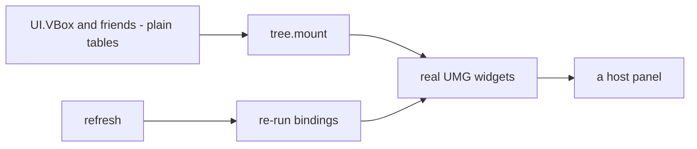
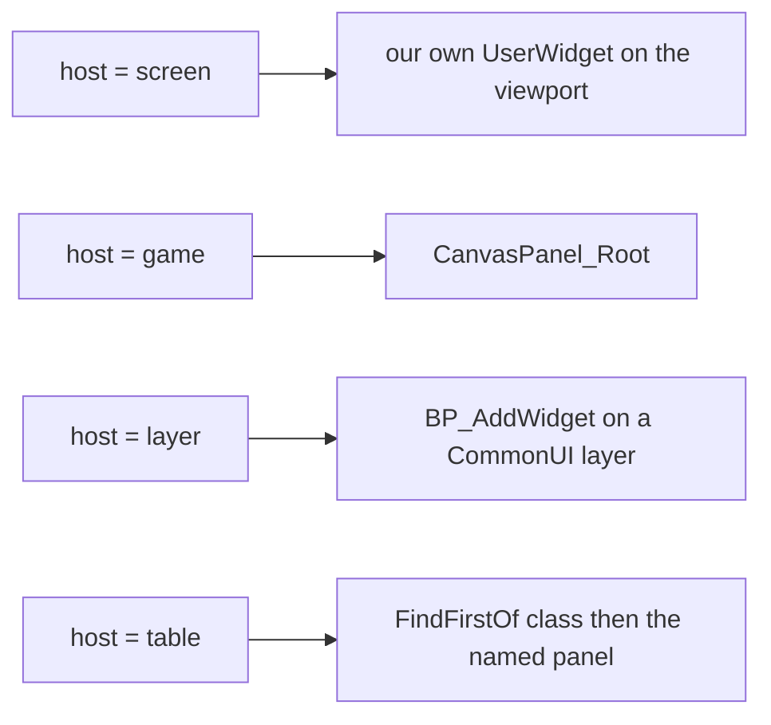
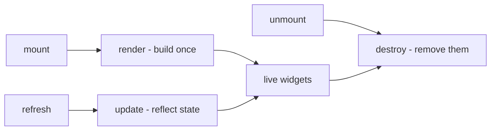
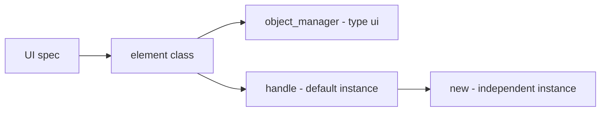
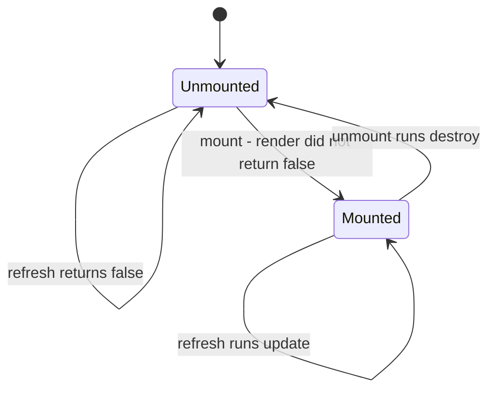
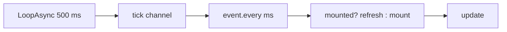
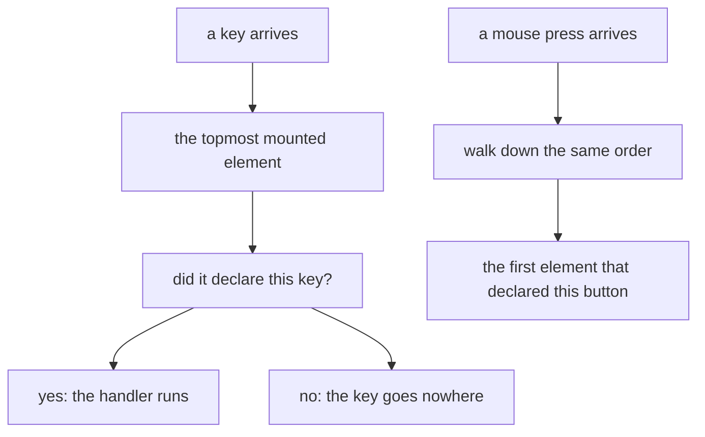
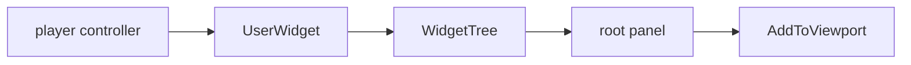

## 读完本页你可以做到

- 把面板声明成一棵节点树，文件里的嵌套就是画面上的嵌套
- 把它挂进游戏自己的游戏内界面、你自己的视口层，或者游戏已经在画的某个画面
- 让它显示的内容保持最新，并且清楚它最多能旧到什么程度
- 拿走鼠标指针或者游戏自己的点击模式，同时不弄坏 Esc
- 声明哪块面板在最上面，以及按键会落到谁身上
- 往标题画面菜单里加自己的项目，用完再全部收走

## 第一个面板

界面元素就是你画到画面上的任何东西：一行文字、一个按钮、一整块面板。用 `UI{ ... }` 描述一个，它会用 Palworld 自带的界面控件搭出来。

说清楚一个元素要搭什么，有两种写法，而且互斥：声明一棵 `root` 树，或者写一个 `render` 函数。通常用树。

```lua title="content/ui/panel.lua"
local UI = require("palforge.api.ui")   -- or use the global UI installed by palforge.api
local VBox, Label, Button = UI.VBox, UI.Label, UI.Button

local Supplies = UI{
    id   = "example:Supplies",
    host = "game",                       -- the game's own in-game UI root canvas
    root = VBox{ padding = 12,
        Label{ text = "Supplies" },
        Label{ name = "count", text = function(self) return "Wood x" .. self.wood end },
        Button{ text = "Take one",
                onClick = function(self) self.wood = self.wood - 1 end },
    },
}

Supplies:new{ wood = 10 }:autoMount(nil, 2000)
```

另一条缝是 `render`。它把一个宿主面板和一双自由的手交给你，需要跟游戏自己的控件树打交道的元素只能这么写。

```lua
local Panel = UI{
    id          = "example:Panel",
    name        = "Example Panel",
    description = "One line of text.",

    render = function(self, root)
        -- build the widget tree under `root`; runs once per mount
        -- return false if you could not build: the element then stays unmounted
    end,

    update  = function(self) end,   -- reflect changed state into the widgets render built
    destroy = function(self) end,   -- remove them again
}
```

同时声明 `root` 和 `render` 会在定义时直接报错。它们是同一个问题的两个答案，而 `render` 每次挂载正好跑一次，所以两者不管谁先谁后，总会让某个人意外。

要用到别的文件声明的元素，就按它的 id 去查：

```lua
UI.get("palforge:Button")   -- a handle for an element defined elsewhere; never nil
UI.get_all()                -- every registered element, as a list of handles
```

## 声明一棵树

节点构造器接受一张声明式的表，返回一份不做任何事的数据。在有东西去挂载这棵树之前，一次引擎调用都不会发生 —— 所以一块声明好的面板可以在完全不启动游戏的情况下构建、嵌套和检查。



**子节点按位置写。** 表的数组部分是子节点，具名部分是字段。为别的代码生成出来的树，也接受 `children = { ... }`，但两者同时写是直接报错，而不是合并。

**只有两个字段可以写成函数**：`text` 和 `visible`。函数就是一条**绑定** —— 树构建时用元素实例作参数调用它，每次 `:refresh()` 都重新求值，只有值**变了**才写回去。这两个正是一块活面板真正会改的东西；其余字段只写一次，所以对一块没变化的面板做心跳刷新，代价是比较，而不是每个节点一次原生调用。

**校验发生在每个调用点，由内往外**，所以被指出问题的是你写错的那个节点，而不是包着它的面板。`Label{ tetx = "x" }` 是一条带「你是不是想写」的错误，而不是一个永远不出声的标签。

```lua title="content/ui/status.lua"
local UI = require("palforge.api.ui")
local Frame, Border, SizeBox, VBox, HBox = UI.Frame, UI.Border, UI.SizeBox, UI.VBox, UI.HBox
local Label, Button, Sprite = UI.Label, UI.Button, UI.Sprite

local Status = UI{
    id   = "example:Status",
    host = "game",
    data = { wood = 0, open = true },

    -- The game's own window chrome, a colour of our own inside it, a fixed size around that.
    root = Frame{
        Border{ color = { 0.10, 0.09, 0.08, 0.98 },
            SizeBox{ width = 420, height = 180,
                VBox{ padding = 12,
                    Label{ text = "Supplies", size = 20, native = true },
                    HBox{
                        Sprite{ icon = "Wood" },
                        Label{ name = "count",
                               text    = function(self) return "x" .. self.wood end,
                               visible = function(self) return self.open end },
                    },
                    Button{ text = "Close", onClick = function(self) self:unmount() end },
                },
            },
        },
    },
}
```

绑定和 `onClick` 里的 `self` 是元素的**实例**，也就是那个可以挂载的对象本身：一个关闭按钮就是 `self:unmount()`，一个改变兄弟标签内容的按钮就是对 `self` 的一次赋值。

声明了 `name = "..."` 的节点，之后可以用 `handle:find("count")` 拿到活的控件；树构建之前和撤下之后都是 nil。这是从声明式树里跳出去的命令式出口，从那之后你要负的责任和写 `render` 时一样。

## 十一种节点

| 构造器 | 搭出什么 | 子节点 |
| --- | --- | --- |
| `UI.VBox` | 一个 `VerticalBox` | 任意多个 |
| `UI.HBox` | 一个 `HorizontalBox` | 任意多个 |
| `UI.Overlay` | 一个 `Overlay`，子节点互相叠着 | 任意多个 |
| `UI.ScrollBox` | 一个 `ScrollBox` | 任意多个 |
| `UI.Border` | 一个用你选的颜色画的 `Border` | 正好一个 |
| `UI.SizeBox` | 一个固定宽高的 `SizeBox` | 正好一个 |
| `UI.Frame` | 游戏自己的窗口外框 `WBP_PalCommonWindow_C` | 正好一个 |
| `UI.Label` | 一个 `TextBlock`，或者游戏自己的 `BP_PalTextBlock_C` | 无 |
| `UI.Button` | 游戏自己的按钮，点击走它的 `CommonButtonBase` | 无 |
| `UI.Sprite` | 一个装着贴图的 `UImage` | 无 |
| `UI.GameWidget` | 游戏自带的任意 Blueprint 控件，按类路径取 | 无 |

给一个节点塞超过它能装的子节点，会在调用点报错：`UI.Label{ ... }` 带子节点时会列出哪些节点能装子节点，`UI.Border{ a, b }` 会告诉你把它们放进 VBox 或 HBox。

每个节点还带下面这五个字段，排在该种类自己的字段后面。其中四个是父级那半边的布局信息：在 UMG 里插槽属于父面板，但「这个放左边」是关于子节点的事实，而且子节点列表是唯一能写下它的地方。

<TypeTable
  type={{
    name: {
      description: '之后用 handle:find("<name>") 查到搭好的控件。',
      type: 'string',
    },
    visible: {
      description: '可绑定。false 是 COLLAPSED，所以它连布局空间都不再占。',
      type: 'boolean | fun(self): boolean',
    },
    hAlign: {
      description: '在父插槽里的水平对齐：fill、left、center、right。',
      type: 'string',
    },
    vAlign: {
      description: '在父插槽里的垂直对齐：fill、top、center、bottom。',
      type: 'string',
    },
    padding: {
      description: '插槽内边距：一个数字表示四边，或者 { left =, top =, right =, bottom = }。',
      type: 'number | table',
    },
  }}
/>

对齐走 `core/signature`，所以没有声明对齐的插槽类会记下一条指名道姓的拒绝，而不是抛异常。box、overlay、border 和 size 的插槽都声明了 `SetHorizontalAlignment`，`CanvasPanelSlot` 没有 —— 所以给 `host = "game"` 那棵树的直接子节点写 `hAlign` 会被拒绝，并说明那个插槽实际声明了什么。

按种类值得知道的字段：

| 节点 | 字段 |
| --- | --- |
| `Border` | `color = { r, g, b, a }`，取值 0..1；省略就是 PalForge 自己的深色面板色 |
| `SizeBox` | `width`、`height`，单位是 slate —— `Sprite` 就靠它定尺寸 |
| `Frame` | 没有自己的字段。`color` 会被**拒绝**：Frame 穿的是游戏自己的窗口贴图，这里没有任何东西能给它上色 |
| `Label` | `text`（可绑定）、`size`、`color`、`native` |
| `Button` | `text`（可绑定）、`onClick`、`labelAlign` |
| `Sprite` | `path` 或 `icon` + `from`、`matchSize`、`color`、`opacity` |
| `GameWidget` | `class`（必填）、`text` + `textChild`、`onClick` + `clickChild` |

其中有几条是量出来的结论，不是偏好：

- `Label{ native = true }` 搭的是 `BP_PalTextBlock_C`，一个 `UPalTextBlockBase`，Palworld 的字体缩放、界面设置联动和本地化都在那里。它会忽略 `color`（文字颜色由游戏自己的文本样式决定），`size` 走 `UpdateFontSize` —— 这是整棵树里唯一一个吃普通 int 而不是结构体的字体调用。这个类在世界里常驻，但标题画面不保证有，所以搭不出原生标签时会退回普通标签，而且这次替换会记进日志。
- `Sprite` 没有宽高，这是量出来的而不是漏掉的：这个版本的 `UImage` 没有声明 `SetBrushSize`，画刷的 `ImageSize` 是结构体写入，`SetDesiredSizeOverride` 吃 `FVector2D`。所以一张 sprite 要么取贴图自己的像素尺寸（默认的 `matchSize`），要么交给已经会定尺寸的节点：`SizeBox{ width = 48, height = 48, Sprite{ icon = "Wood", matchSize = false } }`。
- `Sprite{ icon = "Wood" }` 通过 `core/icons` 到游戏自己的图标 DataTable 里查这个 id，覆盖率是量过的：帕鲁 674/674 行、道具 1183/1207 行、建筑 567/571、伙伴技能 311/311。查不到几乎总是 id 拼错了，而且 id 区分大小写。
- `GameWidget` 的 `text` 在没有 `textChild` 时什么都不做，`onClick` 在没有 `clickChild` 时也什么都不做。这个节点克隆的是它猜不出内部结构的控件，所以两者都只送到你点名的那个子控件，别处都不去。

<Callout type="warn">
游戏菜单按钮的标签没法通过它的插槽做左对齐。一次探针读了按钮自己的模板树并报告：它内层的 `HorizontalBox_0` 待在一个 `CanvasPanelSlot` 里 —— 六个插槽类里唯一一个没有声明 `SetHorizontalAlignment` 的（UMG.hpp:350-374）—— 所以 `core/signature` 每次都正确地拒绝了那个调用，标签一直是居中的。`CanvasPanelSlot` **确实**声明的那个对齐 `SetAlignment` 吃 `FVector2D`，而结构体参数正是会在 UE4SS 编组内部炸掉、`pcall` 又看不见的那种形状。那个尝试过的辅助函数被删掉了 —— 与其每次搭按钮都往日志里写一条拒绝。

`Button{ labelAlign = "left" }` 是另一种搭法，不是对同一条路的第二次尝试：一个 `Overlay` 装着被拉满的游戏按钮，上面盖一个我们自己的 `TextBlock`，可见性设成 `ESlateVisibility` 的 HitTestInvisible，所以点击全部穿过去落在下面的按钮上；而 `OverlaySlot` 是声明了对齐调用的。它之所以要显式开启，代价就在这里：文字是我们自己的，按钮的字体、悬停状态和本地化一样都继承不到。
</Callout>

## 传给 UI 的字段

必填的只有 `id`。让元素真正有用的是 `root` 或 `render`。

<TypeTable
  type={{
    id: {
      description: '元素的 id，例如 "example:Panel"。定义时就会按 id 解析所要求的形状做校验。',
      type: 'string',
      required: true,
    },
    name: {
      description: '给人看的名字。省略就是 id。',
      type: 'string',
    },
    description: {
      description: '一行说明，给界面和工具用。',
      type: 'string',
    },
    root: {
      description: '声明出来的控件树。和 render 互斥。它还决定 input、backHandler 和 host = "layer" 能不能声明：这三者都要求 root 是一个 UI.Frame。',
      type: 'UI.Node',
    },
    host: {
      description: 'mount() 没给 root 时挂到哪里："screen"、"game"、"layer"，或者 { widget = <class>, panel = <member> }。显式带 root 的 mount(root) 优先级更高。',
      type: 'string | table',
    },
    render: {
      description: 'fun(self, root): boolean? —— 在 root 下面搭控件树。每次挂载跑一次。搭不出来就返回 false。',
      type: 'function',
    },
    update: {
      description: 'fun(self) —— 刷新已经搭好的控件。每次 refresh 都跑。',
      type: 'function',
    },
    destroy: {
      description: 'fun(self) —— 撤掉 render 搭的控件。每次 unmount 都跑。',
      type: 'function',
    },
    input: {
      description: '挂载期间从玩家那里拿走多少输入："none"（默认）、"cursor"、"clicks"、"exclusive"。后两个要求 root 是 UI.Frame。',
      type: 'string',
      default: '"none"',
    },
    backHandler: {
      description: '在这个元素的窗口上认领 CommonUI 的 BACK 动作（也就是 Esc）。要求 root 是 UI.Frame。已声明、已随包发布，但从来没有一次被观测到起作用。',
      type: 'boolean',
    },
    z: {
      description: '叠放次序，越大越靠前。只有宿主自己有 z 时它才决定绘制；但它永远决定事件路由。',
      type: 'number',
      default: '0',
    },
    keys: {
      description: 'onKeyPressed 想要的按键名，按 UE4SS 的拼法（"INS"、"END"、"F4"、"NUM_ZERO"）。Palworld 当前按键配置已经占用的键，会在挂载时被拒绝并点名冲突的操作。',
      type: 'string[]',
    },
    overrideKeys: {
      description: '明知 Palworld 的按键配置在用，仍然要拿的键。路由完全一样，唯一的区别是 PalForge 不再拒绝。"ESCAPE" 依然会被拒绝。',
      type: 'string[]',
    },
    onKeyPressed: {
      description: 'fun(self, ctx) —— keys 里的某个键被按下。ctx.key / ctx.z / ctx.id。只会送到最上面那个已挂载的元素。',
      type: 'function',
    },
    buttons: {
      description: 'onMousePressed 想要哪些鼠标键："left"、"right"、"middle"。默认安装下三个鼠标键都被游戏占了，所以这个列表通常是空的。',
      type: 'string[]',
    },
    overrideButtons: {
      description: '明知被占用仍然要拿的鼠标键。默认安装下，这是唯一一个真能让鼠标路由跑起来的列表。',
      type: 'string[]',
    },
    onMousePressed: {
      description: 'fun(self, ctx) —— buttons 里的某个键被按下。ctx.button / ctx.z / ctx.id。送到最上面那个声明了它的元素，然后停下。',
      type: 'function',
    },
    data: {
      description: '这个元素每份副本共享的默认字段。',
      type: 'table',
    },
  }}
/>

各份副本之间会变的值**不要**放这里。把它们传给 `:new{ label = "OK", onClick = fn }`，在 `render` / `update` / `destroy` 或绑定里读成 `self.label`。要让每份副本共享的默认值才用 `data`。

同一份字段清单可以在游戏里打印出来，而且它和你的编辑器补全读的是同一批字符串：

```lua
local schema = require("palforge.core.schema")
print(schema.help("UI.Spec"))         -- every field, its type and meaning
schema.get("UI.Spec").fields          -- the same as a table, for tooling
print(schema.help("UI.Node.Label"))   -- and one per node kind
```

和 PalForge 每个领域构造器一样，`UI` 也接受一个可选的第二参数：

```lua
UI(spec, { register = false })   -- build the class, hand it back, register nothing
UI(spec, { pack = "mypack" })    -- register under that pack id

-- the same call with the pack filled in for you
local UI = PalForge.pack("mypack").UI
```

`register = false` 是目录访问器需要的：一次**读取**顺手造出的句柄，不能把 id 从还没声明它的整合包手里抢走。`pack` 让 id 冲突变得可追责 —— 注册仍然是后来者胜，但警告会点名之前的主人和现在的主人，而不是让一个元素悄悄消失。

id 本身在**定义时**就按 id 解析所要求的形状检查。冒号两边不是字母、数字或下划线的 id，在每一个引擎边界上都解析不到任何东西：它会注册成功，在 `UI.get_all()` 里看着很健康，然后悄悄地死着。

```text
PalForge: UI "my-pack:Panel": invalid pack id 'my-pack' in 'my-pack:Panel' (letters/digits/_ only)
```

## 挂在哪里：host

`mount(root)` 仍然接受一个显式的 root，并且优先于 `host`。两者都没有的元素哪儿也挂不上，而且会说出来：`:lastError()` 里带着上一次尝试放弃的原因。

| `host` | 挂到哪儿 |
| --- | --- |
| `"screen"` | 我们自己的视口层，按 `AddToViewport` 的 1000 加上声明的 `z` 叠放 |
| `"game"` | 游戏自己的游戏内界面根画布：`WBP_PalOverallUILayout` 里的 `CanvasPanel_Root`，它是 `UCanvasPanel`，因此是唯一一个有真正 ZOrder 的宿主 |
| `"layer"` | 游戏自己的路线：通过 `BP_AddWidget` 压到某个 CommonUI 层上，激活、焦点和输入模式都归动作路由器管 |
| `{ widget = "PalUITitleBase", panel = "VerticalBox_0" }` | 任意一个活着的控件类，以及它里面的面板 —— 整合包扩展游戏已有画面的方式 |



```lua
UI{ id = "pack:Hud",   host = "screen", root = ... }
UI{ id = "pack:Panel", host = "game",   root = ... }
UI{ id = "pack:Extra", host = { widget = "PalUITitleBase", panel = "VerticalBox_0" },
    root = ... }
```

表形式的宿主要写**原生基类**，不要写蓝图类：查找会匹配子类，所以 `"PalPrimaryGameLayoutBase"` 扛得住蓝图改名，`"WBP_PalOverallUILayout_C"` 扛不住。面板先当成已声明的成员去读，读不到再按名字搜 —— 设计器里没勾 "Is Variable" 的控件没有成员，但它仍然在控件树里。

宿主还没起来不算失败。整合包的文件被加载的时刻，标题画面、游戏内布局、往往连玩家控制器都还不存在，所以 `mount()` 返回 false，元素就一直是下来的状态。`:autoMount(nil, ms)` 正是为此而设的重试循环。

`"screen"` 宿主是特意不带压暗层、也不带内嵌外框造出来的：作者没有声明的外框不算构图。想要外框的声明式树自己写一个就是了。

<Callout type="warn">
`host = "layer"` 已声明、已随包发布，但**从来没有一次被观测到起作用**。它依赖的每一条事实都能从这份安装的 dump 里读到 —— `UPrimaryGameLayout` 把它的 CommonUI 层注册在一张 `TMap<FGameplayTag, UCommonActivatableWidgetContainerBase*>` 里，`BP_AddWidget` 会让游戏去创建、入栈、激活、过渡并注册这个控件 —— 但没有任何一次运行看到 `BP_AddWidget` 对我们的控件作出应答。它**要求** `UI.Frame` 作为 root，因为只有 Palworld 的 activatable 才能上层，而这条规则是在定义时就拒绝，而不是留到挂载时才失败。声明了它却上不去的元素会带着原因保持未挂载，而这正是 `:autoMount` 会重试的东西。

能给出结论的那次运行是 `pf_hook ui-host-layer`，它挂的就是 `pf_uiz` 里的 LAYER 面板。在它给出结果之前，声明了这个的面板必须另外准备一条上场的路。
</Callout>

**已经被观测到的**是另一件事：2026-07-27，`pf_uidecl` 把一棵声明好的树挂进了 `PalPrimaryGameLayoutBase.CanvasPanel_Root`，插槽是 `CanvasPanelSlot`，面板在画面上可见。这就是 `host = "game"` 的承重证据。

## render、update 和 destroy



`render(self, root)` 把你的控件搭在 `root` 下面。元素每次上画面，`mount()` 都会调它一次。搭不出来时返回 `false`，比如你要的那块面板还不存在。元素就留在画面外，之后再挂一次就是重试。返回 `nil` 算成功，所以一个总能成功的 render 什么都不用返回。

`update(self)` 把新的值写进 `render` 已经搭好的控件。调它的是 `refresh()`。

`destroy(self)` 撤掉 `render` 搭的控件。调它的是 `unmount()`，而且只在元素还在画面上时调。

**声明式的树会自己把这三个都填上**，其中两个还会和你写的合成。刷新时先跑树的绑定，再跑你的 `update`，所以你可以覆盖绑定刚写下的值。撤下时先跑你的 `destroy`，再拆树，所以你那一段仍然能碰到控件。

你永远不用自己记「是不是已经 render 过了」。`mount` 会替你记，而且还不止：

```lua
-- Class:mount in api/ui.lua, abridged
function Class:mount(root)
    if self._mounted then return false end
    if root == nil and self.hostSpec ~= nil then
        -- resolve the declared host; a host that is not up yet is a refusal, not a raise
        local host, reason = tree.host(self.hostSpec, { z = self.zOrder })
        if not host then return refuse(self, reason) end
        self._host, root = host, host.panel
    end
    self._root = root
    if self:render(root) == false then
        self._root = nil
        self:releaseInput()          -- a mount that could not build leaves no cursor behind
        self:releaseHost()           -- and no viewport layer of ours behind either
        return false
    end
    self._mounted = true
    stackPush(self)                  -- in the routing list BEFORE anything that can fail
    self:applyZ()
    self:armInput()
    self:grabInput()
    return true
end
```

三条缝在你写之前都什么都不做，所以一个元素可以只是一份声明 —— 当这个 id 存在只是为了让别的 mod 能通过 `UI.get` 找到它时，这很有用。

```lua
-- valid: registers "example:Marker" with no behaviour at all
UI{ id = "example:Marker", description = "Reserved id, nothing rendered." }
```

按名字分工：凡是搭控件的都放进 `render` 并存到 `self` 上；凡是往已有控件里写新值的都放进 `update`；凡是把控件撤走的都放进 `destroy`。

```lua
local widget = require("palforge.native.ui._widget")

local Label = UI{
    id   = "example:Label",
    data = { text = "" },

    render = function(self, screen)
        if not (screen and widget.alive(screen.root)) then return false end
        local ok = pcall(function()
            self.textWidget = widget.text(screen.tree, tostring(self.text), 18)
            widget.addChild(screen.root, self.textWidget)
        end)
        if not ok then self:destroy(); return false end
        return true
    end,

    update = function(self)
        if not widget.alive(self.textWidget) then return false end
        local t = self.textWidget
        return pcall(function() t:SetText(FText(tostring(self.text))) end)
    end,

    destroy = function(self)
        local t = self.textWidget
        self.textWidget = nil
        if not widget.alive(t) then return false end
        return pcall(function() t:RemoveFromParent() end)
    end,
}
```

<Callout type="info">
`mount()` 判定元素是否在画面上，靠的是 `render` **返回**了什么，而不是它跑过了这件事。返回 `false` 会让元素留在画面外，并且忘掉你传的 root，所以之后再调 `mount()` 就只是重试。你不需要在每次尝试前自己去判断游戏状态。
</Callout>

## 一个面板，多份副本



`UI{ ... }` 把你的元素按 id 注册，并返回一个**句柄**：`:mount`、`:refresh`、`:unmount` 都是对它调的。这个句柄本身已经带着一份副本，所以 `UI{ ... }` 返回的东西可以直接挂。`:new(props)` 给你另一份带自己状态的副本。

```lua
local Badge = UI{
    id     = "example:Badge",
    data   = { label = "Badge", size = 18 },
    render = function(self, root) end,
}

local a = Badge:new{}                  -- a:state().label == "Badge"  (from data)
local b = Badge:new{ label = "Boss" }  -- b:state().label == "Boss", b:state().size == 18
```

`:new` 返回的是句柄，不是状态本身：状态在 `:state()` 后面，句柄上的 `a.label` 是 nil。那张状态表就是 `render` / `update` / `destroy` 和每一条绑定里的 `self`，名字按这个顺序解析：

1. 你传给 `:new{ ... }` 的字段，加上任何一条缝或 `onClick` 往 `self` 上写的东西
2. 元素的 `data` 默认值，定义时被复制到类上
3. 生命周期方法和那三条缝

在绑定里写 `self.label = "x"` 只会给那一份副本立字段；共享的 `data` 默认值不受影响。

从外面通过 `:state()` 读写某份副本的状态：

```lua
local st = a:state()
st.label = "Ready"
a:refresh()             -- nothing does this for you
```

<Callout type="info">
状态里的名字是穿过元素本身解析的，所以下面这些已经被占用了：`id`、`name`、`description`、`render`、`update`、`destroy`、`mount`、`refresh`、`unmount`、`isMounted`、`find`、`hostSpec`、`inputMode`、`backHandler`、`zOrder`、`rootNode`、`keyList`、`keySet`、`overrideList`、`buttonList`、`buttonSet`、`overrideButtonList`、`onKeyPressed`、`onMousePressed`，以及所有下划线开头的字段（`_mounted`、`_root`、`_tree`、`_host`、`_input`、`_refreshSub`、`_stackSeq`）。
</Callout>

`UI.get(id)` 每次调用都会造一个**新的**句柄和一份**新的**空副本，所以调两次 `UI.get` 就得到两块可以各自独立上画面的面板：

```lua
local one = UI.get("palforge:Button")
local two = UI.get("palforge:Button")   -- a different instance of the same element
```

对于没人声明过的 id，`UI.get` 返回的仍然是句柄而不是 nil，而且它造出来的替身带着整套生命周期：`:mount()`、`:refresh()`、`:unmount()` 和 `:isMounted()` 都能解析到，并且安静地什么都不做，因为那三条缝的默认实现是空的。对替身调 `mount()` 会报告成功，但一个控件也不会搭。查元素这件事，要等到声明它的东西加载之后再做 —— 顺序由 `core/registry` 决定。

## 显示、更新、收起



```lua
local panel = Panel:new{ title = "Status" }

panel:mount(root)      -- true: render did not report a failure
panel:mount(root)      -- false: already mounted, render is NOT run again
panel:isMounted()      -- true
panel:refresh()        -- true: update() ran
panel:unmount()        -- destroy() runs, then everything the mount took is given back
panel:refresh()        -- false: not mounted, update() does not run
panel:mount(root)      -- true: renders again from scratch
panel:lastError()      -- nil after a success; the reason after a failure
```

`mount()` 返回 `false` 有两种情况：元素已经在画面上，或者 `render` 返回了 `false`。两种都不是错误，也都不会留下半块面板。

`refresh()` 在元素上画面之前什么都不做并返回 `false`，所以从一个活得比它久的订阅里调它是安全的。

`unmount()` **先**把元素从路由列表里摘掉，排在任何会失败的动作之前：一个正在下场的元素，哪怕它的 `destroy()` 抛了异常，也不能继续当「按键到不了下面那块面板」的理由。然后它在 `pcall` 里跑 `destroy()`，清掉挂载标记和保存的 root，把玩家的输入还回去，把自己造的宿主还回去，并取消 `autoRefresh` 或 `autoMount` 的订阅。

<Callout type="warn">
`unmount()` 只会调你写的 `destroy`，而默认的 `destroy` 什么都不做。在 `render` 里把控件存到 `self` 上却不写 `destroy` 的元素会漏掉它们：标记清了，之后的 `mount()` 又搭了第二份，第一份还留在画面上。声明式的 `root` 没有这个坑 —— 树自己的拆解已经替你装好了。
</Callout>

## 让画面保持最新

<Callout type="warn">
轮询不是两个选项之一，它是 PalForge 唯一的刷新驱动。没有任何东西会替整合包调 `refresh()`，所以每个元素要么在自己状态变化时自己调 `:refresh()`，要么搭上 500 ms 的心跳 —— 而且没有办法恰好在游戏重建某个画面的那一刻刷新。有三个后果值得直说，而不是留给你自己撞上：

- 面板显示的内容**最多会旧 `ms` 毫秒**。一条读取玩家刚刚改过的数量的绑定就落后这么多，唯一的杠杆是把 `ms` 调小。
- `TitleMenu` 整套重新注入的策略，就是因为同样的原因而做成轮询的：标题画面会重建它的控件树并把我们的按钮一起带走，没有任何东西会告诉我们它做了，所以它的 `update()` 在同一个拍子上把每个项目重新检查一遍。
- 对一块闲着的面板来说，一拍是特意做得很便宜的 —— 绑定只做比较，只写回变了的东西 —— 所以 `ms` 调快，代价是比较，不是原生调用。
</Callout>

办法一 —— 在变化发生的地方刷新。精确，而且什么都没变的时候不花任何代价：

```lua
local event = require("palforge.core.event")

event.on("item.obtain", function(ctx)
    if ctx.itemId ~= "Wood" then return end
    local st = panel:state()
    st.wood = (st.wood or 0) + (ctx.count or 1)
    panel:refresh()
end)
```

办法二 —— 轮询。两个轮询器都搭在 `event.every` 上，它按整拍数 `event.TICK_MS`（500 ms）计数，所以真实周期会向上取整到 500 的倍数。

```lua
panel:mount(root)
panel:autoRefresh()        -- refresh every 500 ms
panel:autoRefresh(2000)    -- no-op: a subscription is already installed, returns true

-- the whole lifecycle instead: retry mount() while it is down, refresh it once it is up
panel:autoMount(nil, 2000)
```



元素没挂载的时候 `:autoRefresh(ms)` 什么都不做，因为 `refresh()` 就是什么都不做。`:autoMount(root, ms)` 就是为此而设：同一个订阅，但元素在下面时它重试 `mount(root)`，上去之后它刷新。**每一个活着的 PalForge 界面走的都是这条挂载路径**，而且一直失败的重试并不沉默 —— `mount()` 把原因记在实例上，并且**每个不同的原因**只记一条日志，所以 `:lastError()` 随时能回答「我的面板为什么没上去」，日志也不会被一拍一行灌满。

需要注意的细节：

- `autoRefresh` 默认 500 ms；`autoMount` 默认 2000，因为重试循环要的拍子比刷新慢。
- 两者共用一个订阅位。已经在跑的时候再调一次会返回 `true`，不会再装一个。要改周期就先 `unmount()`。
- `unmount()` 会取消它，所以它也是停掉 `autoMount` 重试的办法。
- 订阅装不上时两者都返回 `false`；整个调用都有保护。
- 每一个都只驱动那个句柄背后的那一份副本。另一份副本要自己调一次。

<Callout type="info">
Palworld 在界面被重建时会不会抛出一个可以挂钩的 UFunction，目前**没有测过**，而那正是能取代轮询的东西。dump 里列出了四个候选 —— Palworld 每个画面都继承的基类上的 `PalUserWidget:OnSetup` 和 `:OnClosed`、`PalUIHUDLayoutBase:AddHUD`，以及 `CommonActivatableWidget:ActivateWidget` —— 并排除了第五个：`UPalUIManagerSubsystem` 一个函数都没声明。

在挂钩其中任何一个之前，还有两件事要先量：读起来像 BlueprintImplementableEvent 的那三个，实现了它的蓝图会拿到一个同名的**自己的** UFunction，所以挂在基类上的钩子可能一个都抓不到；另外，在世界加载风暴期间装上的钩子曾经把共享分发卡死过。`pf_hook ui-update-event` 就是给这两件事下结论的那次运行。
</Callout>

## 输入：面板从玩家那里拿走什么

画出一个控件和能点到它是两个问题。游戏握着鼠标捕获的时候 —— 也就是正常游玩时 —— Slate 根本拿不到指针，所以命中测试、z 序和可见性全都无关紧要，任何 mod 里的任何按钮都是死的。手动把它掰回来的办法是按 Esc：游戏自己的菜单会切换输入模式并显示指针。

| `input` | 拿走什么 |
| --- | --- |
| `"none"` | **默认。** 什么都不拿。只有在游戏已经把鼠标交出来的时候（也就是开着菜单时）才点得动。一块 HUD 读数要的正是这个。 |
| `"cursor"` | 只要鼠标指针。`bShowMouseCursor` 是一个能直接读的普通属性，所以能一模一样地还回去。 |
| `"clicks"` | 游戏自己的 GameAndMenu 模式：点击能落到控件上，同时玩家还能移动和转视角。 |
| `"exclusive"` | 游戏自己的 Menu 模式 —— 一个模态，背包界面声明的就是它。游戏侧的输入停下。 |

后两个是**按游戏放置它们的方式**放置的，而这带来一个从声明里就能看见的后果：元素的 root 必须是 `UI.Frame{ }`，因为在这套词汇里，只有 `WBP_PalCommonWindow_C` 是 Palworld 的 activatable。没有它就声明这两者之一，会在定义时被拒绝。

```lua
local UI = require("palforge.api.ui")
local Frame, VBox, Label, Button = UI.Frame, UI.VBox, UI.Label, UI.Button

UI{
    id    = "example:Dialog",
    host  = "game",
    z     = 100,
    input = "clicks",             -- needs the Frame below; refused at define time without it
    root  = Frame{
        VBox{ padding = 16,
            Label{ text = "Pick one", native = true },
            Button{ text = "Close", onClick = function(self) self:unmount() end },
        },
    },
}
```

Palworld 的每个画面都是 `UPalActivatableWidget`，它把自己想要的模式当作自己身上的两个字节**声明**出来（`InputConfig`、`GameMouseCaptureMode`）；CommonUI 的动作路由器读最上面那个 activatable 的声明，把它应用上去，并在该控件失活时把之前的还原回来。PalForge 在这个控件被激活之前 —— 路由器读这两个字节的唯一时刻 —— 把它们写到 frame 上；而 unmount 是**经过路由器**把模式还回去，而不是强行改什么。

<Callout type="warn">
PalForge 不会对玩家控制器调 `SetInputMode`，这不是风格选择。两次实机运行这么做过，两次都弄坏了 Esc：第一次游戏自己的菜单关不上，第二次干脆打不开。手写模式会让路由器一直描述一个已经不成立的输入状态；而 Esc 在这个版本里根本不是一个按键 —— 它是同一个路由器对着同一个 activatable 栈解析出来的界面**动作**。

在这之下还有一层兜底：每一次输入获取都登记在 `_G` 上，并由 `core/poll` 的心跳扫过，所以再也没有人能为之负责的那些 —— 元素没了、它的 `destroy` 抛了异常、或者热重载把整个 Lua 状态带走了 —— 会自己释放。没有主人可问的那种获取，上限是 120 秒。
</Callout>

<Callout type="warn">
`"clicks"` 和 `"exclusive"` 都**没有被观测到起作用过**。没有任何一次运行看到动作路由器从我们的控件上读走一份声明。当 root 不是 activatable 时，你拿到的是指针，外加一条说明「控件那一侧的写入没有发生」的注记 —— 所以一次运行能分辨出「走通了游戏的路线」和「这块面板不是 activatable，什么都没拿到」。

`backHandler = true` 也是一样：它在控件被激活之前给元素的窗口立上 `bIsBackHandler`，也就是 Palworld 的画面说「Esc 关的是我」的那套机制，并回应 `BP_OnHandleBackAction`。它要求 `UI.Frame` 作为 root，没有就在定义时被拒绝，而且它**已声明、已随包发布，从来没有一次被观测到起作用**。记录答案的那次运行是 `pf_hook ui-backhandler`。在它给出结果之前，声明了它的面板必须另外准备一条下场的路。
</Callout>

## 叠放次序与事件路由

同时开着两块面板是常事 —— 一块 HUD 读数，上面压一个对话框 —— 而在没有声明次序的情况下，这由加载器碰巧先读到哪个整合包的文件决定。`z` 就是那个次序：显式声明，默认 0，越大越靠前。

```lua
UI{ id = "pack:Hud",    host = "game", z = 0,   root = ... }
UI{ id = "pack:Dialog", host = "game", z = 100, root = ... }
```

它决定两件不同的事，值得把哪件是哪件说清楚。

**绘制**是引擎的事，而且只在引擎本来就有 z 的地方。挂在游戏画布里的树能拿到，因为 `UCanvasPanelSlot` 是唯一声明了 `ZOrder` 和 `SetZOrder` 的插槽类。注入到标题画面 `VerticalBox` 里的树拿不到 —— box 按子节点顺序叠放，根本没有 z —— 而这件事每个实例只报告一次，既不吞掉也不每次挂载都重复。`"screen"` 宿主则改由 `AddToViewport` 叠放，值是 1000 加上声明的 `z`。

**路由**是 `api/ui` 自己的事，而且不管有没有宿主都精确成立：已挂载的元素按 (z，然后挂载顺序) 保存，事件沿着这个顺序走。



- `onKeyPressed` **只会送到最上面那个已挂载的元素**。只要上面还压着东西，下面那块面板就拿不到按键，哪怕上面那个压根不想要任何按键。这是模态式的读法，而且是故意的：最上面那块面板才是玩家正在看的。
- `onMousePressed` 送到最上面那个**想要**它的元素，然后停下。没有声明 `onMousePressed` 的元素对一次按下是透明的，而不是挡住它。
- `z` 相同的时候，后挂载的排前面 —— 这正是 UMG 在画布上的做法，ZOrder 相同的子节点按加入顺序绘制。
- **两者都不消费任何东西。** UE4SS 的按键绑定只是观察，不会吞掉。这些按下游戏一个不落地都会收到。「停下」的意思是它不再沿 PalForge 这张列表往下走，仅此而已。

哪些键、哪些鼠标键必须声明出来，这不是官僚主义：一次按下是通过 UE4SS 的 `RegisterKeyBind` 读到的，而它绑定的是**一个具名**按键，没有「把所有键都给我」这种形式。只写一半的声明在定义时就是错误 —— 没有 `keys` 的 `onKeyPressed` 接不到任何东西，而没有 `onKeyPressed` 的 `keys` 会把玩家的一个键绑定整个会话，然后路由到虚无。

```lua
UI{ id = "pack:Dialog", host = "game", z = 100,
    keys            = { "INS" },
    onKeyPressed    = function(self, ctx) self:unmount() end,
    overrideButtons = { "middle" },
    onMousePressed  = function(self, ctx) log.info("middle at z " .. ctx.z) end,
    root            = ... }
```

**一个键是不是空的，是问出来的，不是假设出来的。** `core/keyboard` 从运行中的游戏里读 Palworld 自己的按键配置 —— 就是选项界面在编辑的那个结构体 —— 并逐键作答，所以和玩家自己的绑定冲突的 `keys = { "F7" }` 会在**挂载时**被拒绝并点名冲突的操作，而不是无声地武装起来。这正是 F7 第一次的代价：绑定成功了，那是游戏的音量控制，而按键一次也没到过。

<Callout type="warn">
override 只买到一样东西：PalForge 不再拒绝。游戏自己的操作照样触发，玩家的按键配置不会被改写，而且它也没法让一个在 UE4SS 之下就被游戏拿走的按下变得能到达。共享一个键意味着两件事都会发生，而你仍然可能什么都收不到。

默认安装下**三个鼠标键全都被游戏占用**（中键是 DirectAttackOrder），所以只写 `buttons` 会在武装时被拒绝，`overrideButtons` 是唯一一个真能让鼠标路由跑起来的列表 —— 并且中键点击同时也会命令你的帕鲁去攻击。`"ESCAPE"` 无论有没有 override 都按名字拒绝：Esc 是对着 activatable 栈解析的具名界面动作，所以按键绑定只能在旁边观察，永远进不了那条路径。

任何绑定都无法解除。UE4SS 没有解绑按键的办法，所以一个键在一个会话里最多武装一次；已卸载的元素不再收到按键，是因为**路由器**不再选它，而不是因为绑定没了。
</Callout>

`onMousePressed` 是一条按 z 路由的全局按下通知。UE4SS 没法告诉我们指针下面是什么，这里也不会消费掉这次按下。要点画面上的某个东西，用的是 `Button{ onClick = ... }`，它走游戏自己的 `CommonButtonBase`，是真的知道命中了哪个控件的。两者是不同的事件，谁也替代不了谁。

这条规则是公开的，不只是被描述：谁都检查不了的规则就只是传闻。

```lua
UI.stack()          -- every MOUNTED element in routing order, one row each
UI.routeKey("INS")  -- who would get INS right now, plus the sentence that says why
UI.routeMouse("middle")
UI.report()         -- printable lines: the stack, the key binds, the grabs, the keymap
```

`UI.routeKey` 和 `UI.routeMouse` 不会向游戏合成任何按下 —— 它们回答的是一次按下会提出的那个问题。无键盘的 headless 测试就是这样证明这条规则的，探针也是这样问「如果 INS 现在到了，谁会拿到」的。

```text
1  pack:Dialog  z=100  seq=2  keys=INS  buttons=middle
2  pack:Hud     z=0    seq=1  keys=INS  buttons=

UI.routeKey("INS")   -> "pack:Dialog", 'key "INS" -> pack:Dialog (z=100)'
UI.routeMouse("mid") -> nil, 'mouse "mid" reached none of the 2 mounted element(s) ...'
```

`UI.report()` 交叉了四个来源，它们回答四个不同的问题：栈说一次按下会归**谁**；按键绑定说一次按下究竟**能不能到**；获取列表说现在还从玩家那里扣着什么；键位表说 Palworld 在每个键上放了什么 —— 在测过的版本上是 107 行。到达次数为 0 的键会拿前两者去归因，而不是耸耸肩。

## 所有可以调用的成员

`UI{ ... }`、`UI.get(id)` 和 `:new(props)` 都返回一个 `UI.Handle`，下面是它的成员。

| 成员 | 返回值 | 作用 |
| --- | --- | --- |
| `.id` | `string` | 元素的 id |
| `:new(props)` | `UI.Handle` | 一份全新、可以独立挂载的副本；`props` 成为它的状态 |
| `:mount(root)` | `boolean` | 在 `root` 下面 render 一次；`root` 为 nil 时用声明的 `host` |
| `:refresh()` | `boolean` | 跑树的绑定和 `update()`；挂载之前一直返回 `false` |
| `:unmount()` | — | 先离开路由列表，再跑 `destroy()`，把输入和宿主还回去，取消轮询 |
| `:isMounted()` | `boolean` | render 是否报告了成功，且还没有 unmount |
| `:find(name)` | `userdata?` | 某个声明了 `name = "..."` 的节点对应的活控件；挂载之前是 nil |
| `:lastError()` | `string?` | 上一次挂载尝试放弃的原因，一句话 |
| `:autoRefresh(ms)` | `boolean` | 搭在心跳上轮询 `refresh()`；`ms` 默认是 500 |
| `:autoMount(root, ms)` | `boolean` | 轮询整个生命周期：下来时重试 `mount`，上去后刷新；`ms` 默认是 2000 |
| `:state()` | `table` | 这份副本本身，也就是那几条缝和绑定里的 `self` |
| `:name()` | `string` | 元素的 `name`，没有就是 id |
| `:description()` | `string?` | 元素的 `description` |

模块本身还有这些：

| 成员 | 返回值 | 作用 |
| --- | --- | --- |
| `UI(spec, opts)` | `UI.Handle` | 声明一个元素；`opts` 是 `{ register = false, pack = "id" }` |
| `UI.get(id)` | `UI.Handle` | 已有的元素，没有则是一个什么都不做的替身；不会是 nil |
| `UI.get_all()` | `UI.Handle[]` | 所有已注册的元素 |
| `UI.VBox` … `UI.GameWidget` | `UI.Node` | 十一个节点构造器 |
| `UI.stack()` | `table[]` | 所有已挂载的元素，按路由顺序 |
| `UI.routeKey(name)` | `string?, string` | 那个键会归谁，以及为什么 |
| `UI.routeMouse(button)` | `string?, string` | 鼠标键的同一件事 |
| `UI.report()` | `string[]` | 栈、按键绑定、未释放的获取，以及当前键位表 |
| `UI.Class` | `table` | 每个元素都继承的基类 |

## 自己造一个画面

你的控件得有地方待。声明式的树按 `host` 自己找宿主；命令式的 `render` 则由别人把宿主递给它。两种都用 `native/ui/_widget.lua` 搭建，那是现成元素用的工具箱。



工具箱里的每个辅助函数都需要一个 `WidgetTree` —— Unreal 用来装一个画面全部控件的容器 —— 而一个裸的 `UUserWidget` 没有，因为通常那是引擎从控件编译好的 Blueprint 里造出来的。`widget.screen()` 自己造出这棵树并挂上去，这就是你能只用 Lua、不编译任何东西就做界面的原因。

```lua
local widget = require("palforge.native.ui._widget")

local screen, why = widget.screen()
if not screen then
    print("no screen: " .. tostring(why))
end

-- when it built:
--   screen.widget  the UUserWidget now on the viewport
--   screen.tree    the WidgetTree every primitive constructs into
--   screen.root    the VerticalBox your widgets go under
--   screen.pc      the controller that owns it; the clickable helpers need it
```

`widget.screen(pc, opts)` 从不抛异常。它返回 screen 表，或者返回 `nil` 加一句原因：没有主人、缺少某个 UMG 类，或者 `AddToViewport` 没生效。`pc` 默认取 `widget.owner()` —— `PalPlayerController`，否则任意 `PlayerController`，否则 `GameInstance`，完全没有游戏时是 `nil`。

<TypeTable
  type={{
    zOrder: {
      description: '传给 AddToViewport 的视口 z 序。',
      type: 'number',
      default: '1000',
    },
    show: {
      description: '立刻加到视口上。传 false 就造成隐藏的，自己再调 widget.show。',
      type: 'boolean',
      default: 'true',
    },
    dim: {
      description: '面板背后全屏压暗层的颜色，写成 { r, g, b, a }。传 false 则是一个没有任何外框的裸 VerticalBox 根。',
      type: 'table | false',
      default: '{ 0.02, 0.02, 0.03, 0.86 }',
    },
    panel: {
      description: '你的控件所在的内嵌面板的颜色，写成 { r, g, b, a }。',
      type: 'table',
      default: '{ 0.10, 0.09, 0.08, 0.98 }',
    },
    padding: {
      description: '那块面板内部的边距，写成 { Left, Top, Right, Bottom }。',
      type: 'table',
      default: '{ Left = 90, Top = 54, Right = 90, Bottom = 54 }',
    },
  }}
/>

```lua
-- a bare vertical stack: no dimmer, no frame, drawn under the default z
local bare = widget.screen(nil, { dim = false, zOrder = 500 })

-- built but not shown; put it up and take it down yourself
local hidden = widget.screen(nil, { show = false })
widget.show(hidden)       -- AddToViewport; true if the widget reports itself shown
widget.hide(hidden)       -- RemoveFromParent; true if it is no longer shown
```

往里面填的零件：

| 辅助函数 | 搭出什么 |
| --- | --- |
| `widget.vbox(tree)` / `widget.hbox(tree)` | 一个 `VerticalBox` / `HorizontalBox` |
| `widget.scrollBox(tree)` / `widget.overlay(tree)` | 一个 `ScrollBox` / `Overlay` |
| `widget.border(tree, rgba)` | 一个 `Border`，画刷颜色是 `{ r, g, b, a }` |
| `widget.sizeBox(tree, w, h)` | 一个 `SizeBox`；每个 override 既按带 `bOverride_` 标志的属性写一次，也走 setter 写一次，因为 UE4SS 的 setter 有时什么都不做 |
| `widget.text(tree, str, size, rgba)` | 一个 `TextBlock`；`size` 默认 16 |
| `widget.palText(tree, str, size)` | 游戏自己的 `BP_PalTextBlock_C`，或者 nil 加原因 |
| `widget.menuButton(tree, pc, label, onClick)` | 游戏自己的一个按钮；返回按钮、它的点击目标和点击路由器的 key |
| `widget.clickableRow(tree, pc, label, onClick, opts)` | 那个按钮上盖一层左对齐文字；第四个返回值是那个 `TextBlock` |
| `widget.gameFrame(pc, opts)` | `WBP_PalCommonWindow_C`，以及你的内容要放进去的 NamedSlot |
| `widget.cloneGameWidget(tree, pc, classPath, opts)` | 任意 Palworld BP 控件；`opts = { label, labelChild, clickChild, onClick }` |
| `widget.addChild(panel, child)` | 不管 `panel` 是哪种面板都把 `child` 放进去，并返回它的插槽 |
| `widget.gameUIRoot()` / `widget.hostPanel(class, panel)` | 游戏自己的游戏内画布 / 任意活着的控件类里的任意面板 |
| `widget.alive(w)` | 这个控件还能不能对话；从不抛异常 |
| `widget.findByName(w, name)` | 按名字深度优先查找后代控件 |
| `widget.releaseClicks(names)` | 按 key 丢掉点击路由器里的登记 —— `destroy` 调的就是它 |

`widget.addChild` 是去问面板它是什么，而不是被告知：它先试 `AddChild`，因为那是 `UPanelWidget` 的通用入口，每种面板都会重写它来造自己那种插槽；然后才退回到带类型的 `AddChildTo*`。它还顺手修掉新建 `CanvasPanelSlot` 唯一会搞错的那件事 —— 偏移全是 0，所以加进画布的控件占的是 0x0 的盒子，永远画不出来 —— 办法是设 `bAutoSize`，那是不用结构体参数就能做到这件事的唯一途径。

`mount(root)` 把 `root` 原封不动地交给 `render`，所以一个元素可以把整张 screen 表当作 root，从这一个参数里够到 `tree`、`root` 和 `pc`：

```lua title="content/ui/stats_panel.lua"
local UI     = require("palforge.api.ui")
local Item   = require("palforge.api.item")
local Pal    = require("palforge.api.pal")
local widget = require("palforge.native.ui._widget")

local Stats = UI{
    id   = "example:Stats",
    name = "Stats",
    data = { title = "PalForge", rows = {} },

    render = function(self, screen)
        if not (screen and widget.alive(screen.root)) then return false end
        self.clicks = {}
        local ok = pcall(function()
            local head = widget.text(screen.tree, self.title, 24)
            widget.addChild(screen.root, head)
            for _, row in ipairs(self.rows) do
                local line, _, clickName =
                    widget.clickableRow(screen.tree, screen.pc, row.label, row.onClick)
                widget.addChild(screen.root, line)
                self.clicks[#self.clicks + 1] = clickName
            end
        end)
        if not ok then self:destroy(); return false end
        self.screen = screen
        return true
    end,

    -- Taking the whole screen off the viewport removes every widget under it at once.
    destroy = function(self)
        widget.releaseClicks(self.clicks or {})
        if self.screen then widget.hide(self.screen) end
        self.clicks, self.screen = nil, nil
        return true
    end,
}

local panel = Stats:new{
    title = "PalForge",
    rows  = {
        { label = "Give 10 Wood",    onClick = function() Item.get("Wood"):give(10) end },
        { label = "Spawn a Chikipi", onClick = function() Pal.get("ChickenPal"):spawn() end },
    },
}

local screen = widget.screen()
if screen then panel:mount(screen) end
```

<Callout type="info">
`_widget.lua` 在 `native/ui` 下面，不在 `api/` 下面，所以它的辅助函数可能在版本之间无预告地变化。有兼容承诺的是声明式的树；工具箱是当声明说不出你需要的东西时，`render` 才伸手去够的地方。
</Callout>

## 现成的元素

PalForge 自带两个可以直接用的元素。两个都会把真正的控件放进游戏自己的界面，而且都注册在整合包 id `palforge` 下面 —— 所以某个整合包定义了同样的 id 把它替换掉时，冲突会被点名写进日志，而不是悄悄发生。

```lua
local ui = require("palforge.native.ui")
ui.Button                                    -- also require("palforge.native.ui.button")
ui.TitleMenu                                 -- also require("palforge.native.ui.title_menu")
ui.widget                                    -- the toolkit, without the underscore module
ui.tree                                      -- what turns a declared node tree into widgets
ui.keys                                      -- the keyboard seam; keys.report() is printable

UI.get("palforge:Button")                    -- the same element, a fresh instance
```

调 `:new{ ... }`，不要直接挂模块本身的那个值，这样每个使用它的地方都保有自己的标签和自己的回调。

### Button

`palforge:Button` —— 一个可以点的按钮，样式和游戏自己的一致。

```lua
local Button = require("palforge.native.ui.button")
local widget = require("palforge.native.ui._widget")

local screen = widget.screen()
local give   = Button:new{
    label   = "Give 10 Wood",
    onClick = function() Item.get("Wood"):give(10) end,
}
if screen then give:mount(screen.root) end
```

它从你造的那份副本里读两个字段：`self.label`（默认 `""`）和 `self.onClick`。`render` 把按钮存到 `self.widget`，点击目标存到 `self.invButton`，标签控件存到 `self.labelWidget`，点击路由器的 key 存到 `self.clickName`。

`render` 依次做这些事：

- 找一个 `PalPlayerController`，没有就返回 `false`
- 通过 `widget.buttonClass()` 搭出游戏自己的按钮。它不是点名一条路径，而是去问**世界**现在加载了哪个按钮类。排在最前面的是 `WBP_CommonButton_C`，也就是 Palworld 自带 Mod 菜单用的那个按钮，因为它是唯一一个按名字（而不是靠运气）声明了标签子控件 `Text_Main` 和点击目标 `WBP_PalInvisibleButton` 的候选。标题菜单那个类只在标题画面常驻，早先在世界里的尝试就是死在这上面。
- 用 `widget.setButtonText` 写标签。它优先用按钮自己声明的 `SetText`，只有当这个类没有声明 setter 时才去够标签子控件。
- 把点击目标登记到共享的点击路由器上：在 `/Script/CommonUI.CommonButtonBase:HandleButtonClicked` 上装一个 `RegisterHook`，把点击送到拥有那个按钮的回调。点击目标是这个类声明的子控件，没有就是它树里任意一个 `CommonButtonBase`，再没有就是按钮自己。
- 用 `widget.addChild` 把按钮加到 `root` 上

放置是检查过的，不是假设的。如果 `root` 根本不收任何子节点，`render` 会跑自己的 `destroy()` —— 与其留下一个看不见的按钮连着一个活回调，不如把按钮一起丢掉 —— 然后返回 `false`。

`update` 会把当前的 `self.label` **和**当前的 `self.onClick` 写进那个活按钮，所以两者都能不重建就改：

```lua
give:state().label = "Give 50 Wood"
give:refresh()
```

按钮本身没了时它返回 `false`。只有缓存的标签控件失效时，它会先把标签子控件重新查一遍。重新登记点击是替换路由器里的那一条，而不是再加一条；清掉 `onClick` 则是把那条丢掉。

`destroy` 释放按钮在点击路由器里的登记并调 `RemoveFromParent()`，所以 `unmount()` 是真把按钮从画面上撤掉，之后的 `mount()` 会搭一个新的。

### TitleMenu

`palforge:TitleMenu` —— 往游戏标题画面加项目。这个在真实的标题画面上是能用的。

```lua
local TitleMenu = require("palforge.native.ui.title_menu")

local menu = TitleMenu:new{
    entries = {
        { label = "Mods",     onClick = function() openMods() end },
        { label = "Settings", onClick = function() openSettings() end },
    },
}
menu:autoMount(nil, 2000)   -- waits for the title screen, then re-injects when it rebuilds
```

`self.entries` 是一个 `{ label = ..., onClick = ... }` 的数组。在碰任何一个项目之前，`render` 会解析三样东西，缺一个就返回 `false`：root（你传的 `root` 如果有效就用它，否则是 `FindFirstOf("PalUITitleBase").WidgetTree.RootWidget`）、它里面的 `VerticalBox_0`（标题画面的按钮列），以及一个有效的 `PalPlayerController`。对每个还没有活按钮的项目，它接着：

1. 搭一个原生菜单按钮，并用一个 `SizeBox` 包起来，尺寸从旁边的原生 `SizeBox_4` 读来 —— 读的是 `WidthOverride` / `HeightOverride` **属性**，因为 getter 读回来是 nil。没有这个固定宽度，按钮会被拉伸并居中。
2. 把 `SizeBox` 加到那一列里，把插槽设成左对齐，上下各留 3 的边距，和游戏自己的项目一致
3. 把按钮、点击目标、它的 `SizeBox` 和点击路由器的 key 记在这个项目上

在至少加进去一个项目的那一趟之后，它把 `WBP_Title_MenuButton_ExitGame` 的父盒子挪到这一列的末尾，好让 Exit Game 留在最后 —— `VerticalBox` 没有插入操作。

`render` 只在真的有项目进去时才返回 `true`，所以在标题画面存在之前尝试的 `mount()` 会让元素留在画面外，直接重来即可。

`update` 在同一拍里做两件事。点击目标已经失效的项目会被重新注入 —— 比如回到标题时，标题画面会重建它的控件并悄悄把加上去的按钮一起带走 —— 而**仍然活着**的项目，则会把当前的 `label` 和 `onClick` 写进那个活按钮，两者都没变时就跳过写入。所以改 `self.entries` 再刷新是一次真正的编辑，而刷新永远不会堆出重复项。

`destroy` 把每个项目的 `SizeBox` 从按钮列里移除并释放它的点击路由登记，所以 `unmount()` 会把菜单取出来，之后的 `mount()` 重新加一遍。

<Callout type="warn">
标题画面上没有世界，也没有玩家角色。在那里调 `Item.get("Wood"):give(10)` 的项目会失败：`give` 走的是本地玩家的背包。标题项目只放菜单类操作，凡是碰到游戏玩法的都放到游戏内的面板上。
</Callout>

## 实用示例

### 显示计数的面板

一块统计木材拾取数的声明式面板。绘制全部由树负责；`item.obtain` 的处理器负责动那个数并调 `:refresh()`，而 `:autoMount(nil, 2000)` 负责在世界起来后把它放进去，没起来时一直重试。

```lua title="content/ui/wood_counter.lua"
local UI    = require("palforge.api.ui")
local event = require("palforge.core.event")
local Frame, Border, SizeBox, VBox, HBox = UI.Frame, UI.Border, UI.SizeBox, UI.VBox, UI.HBox
local Label, Sprite, Button = UI.Label, UI.Sprite, UI.Button

local Counter = UI{
    id          = "example:Counter",
    name        = "Counter",
    description = "A running count of the Wood you have picked up.",
    host        = "game",
    z           = 10,
    data        = { label = "Wood", count = 0 },

    root = Frame{
        Border{ color = { 0.10, 0.09, 0.08, 0.98 },
            SizeBox{ width = 320, height = 110,
                VBox{ padding = 12,
                    HBox{
                        Sprite{ icon = "Wood" },
                        -- BINDABLE: re-evaluated on every refresh, written back only when
                        -- the value moved.
                        Label{ name = "count", size = 20,
                               text = function(self)
                                   return self.label .. ": " .. self.count
                               end },
                    },
                    Button{ text = "Hide", onClick = function(self) self:unmount() end },
                },
            },
        },
    },
}

local wood = Counter:new{ label = "Wood", count = 0 }

-- The in-game layout does not exist at load, so this retries until it does and refreshes
-- afterwards. mount() records why each attempt gave up; wood:lastError() reads it back.
wood:autoMount(nil, 2000)

-- Move the state, then refresh: nothing refreshes for you.
event.on("item.obtain", function(ctx)
    if ctx.itemId ~= "Wood" then return end
    local st = wood:state()
    st.count = st.count + (ctx.count or 1)
    wood:refresh()
end)

-- Leaving the world drops the widgets; unmount also stops the retry loop, so mount it again
-- from world.ready if you want it back.
event.on("world.left", function() wood:unmount() end)
event.on("world.ready", function() wood:autoMount(nil, 2000) end)
```

这里心跳做的只是重试挂载：数字在 `item.obtain` 触发的那一刻就写进去了。当数字的来源背后没有事件时，把 `event.on` 去掉，给 `:autoMount` 一个更短的拍子 —— 绑定那时读的就是当前值，代价是最多旧那么多毫秒。

### 点一下就给道具的按钮

<Tabs items={['Standalone button', 'Title menu entries']}>
<Tab value="Standalone button">

```lua title="content/ui/give_button.lua"
local Button = require("palforge.native.ui.button")
local Item   = require("palforge.api.item")
local widget = require("palforge.native.ui._widget")
local log    = require("palforge.utils.log").scope("give-button")

-- One instance per use site: :new gives this button its own label and callback.
local giveWood = Button:new{
    label   = "Give 10 Wood",
    onClick = function()
        local ok = Item.get("Wood"):give(10)
        log.info("gave wood: " .. tostring(ok))
    end,
}

local screen

-- A screen of our own to host it: screen.root is a VerticalBox, which is exactly what
-- Button's render adds itself to.
local function show()
    if giveWood:isMounted() then return end
    screen = widget.screen(nil, { dim = false })
    if not screen then return end
    if not giveWood:mount(screen.root) then
        widget.hide(screen)
        screen = nil
    end
end

local function hide()
    giveWood:unmount()          -- destroy() removes the button and drops its click handler
    if screen then widget.hide(screen) end
    screen = nil
end

return { show = show, hide = hide }
```

</Tab>
<Tab value="Title menu entries">

```lua title="content/ui/title_entries.lua"
local TitleMenu = require("palforge.native.ui.title_menu")
local UI        = require("palforge.api.ui")
local event     = require("palforge.core.event")
local log       = require("palforge.utils.log").scope("title")

local menu = TitleMenu:new{
    entries = {
        {
            label   = "PalForge: elements",
            onClick = function()
                for _, el in ipairs(UI.get_all()) do
                    log.info(el.id .. " -> " .. el:name())
                end
            end,
        },
        {
            label   = "PalForge: version",
            onClick = function() log.info(tostring(PalForge.env.version)) end,
        },
    },
}

-- The title screen does not exist yet when this file loads, and it rebuilds itself later.
-- autoMount is both halves: it waits for the screen, then re-injects on the same beat.
menu:autoMount(nil, 2000)

-- Entering a world takes the title screen away; unmount so a later mount injects afresh.
event.on("world.ready", function() menu:unmount() end)
event.on("world.left",  function() menu:autoMount(nil, 2000) end)
```

</Tab>
</Tabs>

两个按钮的点击都走同一个钩子，而且都在 `destroy` 里丢掉自己的路由登记，所以你收起来的元素不会留下任何东西。给道具只有在有活的玩家角色时才成立，所以 `Item.get("Wood"):give(10)` 属于游戏内的按钮，不属于标题项目。

## 错误

每个问题都是硬错误，调用绝不会成功一半。

```lua
UI{ name = "Panel" }
```

```text
PalForge: UI: field "id" is required (element id, e.g. "pack:Panel")
```

```lua
UI{ id = "example:Panel", onClick = function() end }
```

```text
PalForge: UI: unknown field "onClick". Valid fields: id, name, description, root, host,
render, update, destroy, input, backHandler, z, keys, overrideKeys, onKeyPressed, buttons,
overrideButtons, onMousePressed, data
```

`onClick` 属于元素的某份副本，或者属于一个 `Button` 节点，不属于定义本身。

```lua
UI{ id = "example:Panel", root = UI.VBox{}, render = function() end }
```

```text
PalForge: UI "example:Panel" declares BOTH `root` and `render`, and they are two answers to
the same question — a declared tree builds the widgets, and so does render(). Keep the tree
and drop render (self:find("<name>") reaches any node that declared a name), or keep render
and drop the tree.
```

```lua
UI{ id = "example:Panel", root = UI.VBox{}, input = "clicks" }
```

```text
PalForge: UI "example:Panel" declares input = "clicks", which Palworld carries on an
ACTIVATABLE WIDGET (UPalActivatableWidget.InputConfig / bIsBackHandler, and a CommonUI layer
takes nothing else) — and this element's root is a vbox, which is not one. Wrap the tree in
UI.Frame{ ... }: that builds WBP_PalCommonWindow_C, the game's own window, which IS an
activatable ...
```

同一条消息也回答 `backHandler = true` 和 `host = "layer"`，并且接着说明满足这条规则目前已知能换来什么 —— 目前还什么都没有。

```lua
UI{ id = "example:Panel", onKeyPressed = function() end }
```

```text
PalForge: UI "example:Panel" declares onKeyPressed but no `keys`. A press is read through
UE4SS's RegisterKeyBind, which binds ONE named key — there is no way to ask for all of them —
so name the ones you want: keys = { "INS" }.
```

```lua
UI.VBox{ UI.Label{ tetx = "Supplies" } }
```

```text
PalForge: UI.Label: unknown field "tetx" (did you mean "text"?). Valid fields: text, size,
color, native, name, visible, hAlign, vAlign, padding
```

```lua
UI.Frame{ color = { 1, 0, 0 }, UI.Label{ text = "x" } }
```

```text
PalForge: UI.Frame: field "color" is invalid: a Frame takes no colour: it wears the GAME's
own window art (WBP_PalCommonWindow_C) and nothing here can tint it ... For a coloured panel
write Border{ color = { r, g, b, a } }; for the game's chrome AROUND a colour of your own,
put the Border inside it — Frame{ Border{ color = {...}, ... } }
```

## 相关页面

<Cards>
  <Card title="Item" href="/docs/api/item">
    `:give` / `:take`，以及面板要统计的 `item.obtain` 上下文。
  </Card>
  <Card title="Pal" href="/docs/api/pal">
    从按钮刷出一只帕鲁，以及帕鲁能响应的事件。
  </Card>
  <Card title="生命周期" href="/docs/concepts/lifecycle">
    两个轮询器搭乘的 500 ms 心跳，以及全部事件通道。
  </Card>
</Cards>

## 小结

- 用 `UI{ ... }` 描述一个元素。必填的只有 `id`，而让东西出现在画面上的是 `root` 或 `render`，二者只能选一个。
- 一棵声明式的树就是十一个节点构造器、按位置写的子节点，以及两个可绑定字段（`text`、`visible`）—— 它们每次刷新都重新求值，只有值动了才写回去。
- 没有显式 root 时，`host` 决定它去哪儿：`"screen"`、`"game"`、一张点名活控件类和面板的表，或者 `"layer"` —— 最后这个已声明、已随包发布，但从没被观测到起作用。
- `input` 决定它从玩家那里拿走什么。`"clicks"` 和 `"exclusive"` 按 Palworld 自己的方式声明在 `UI.Frame` 的 root 上，由动作路由器负责应用和还原。PalForge 绝不手写输入模式，而这两个模式同样没有被观测到起作用。
- `z` 只在宿主有 z 时决定绘制，但永远决定事件路由：按键落到最上面的元素，鼠标按下落到最上面那个想要它的元素，而且两者都不会被消费。
- 刷新的唯一驱动就是轮询。`:autoMount(root, ms)` 是每个活着的 PalForge 界面都会走的挂载路径，而面板最多会旧 `ms` 毫秒。
