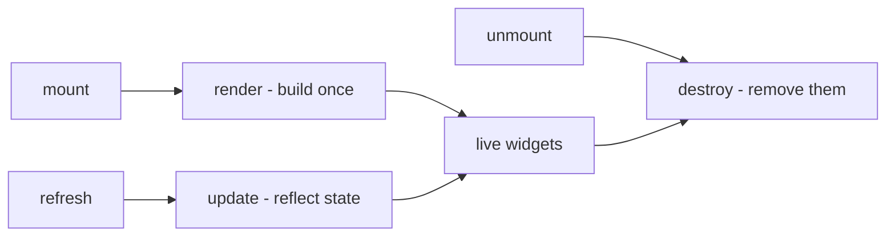
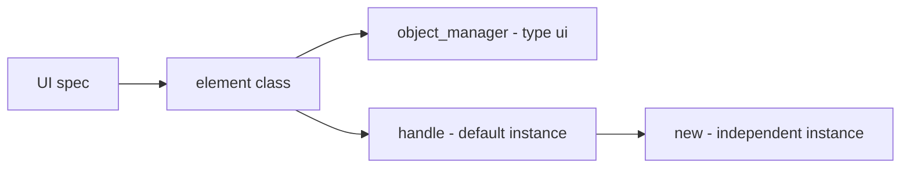
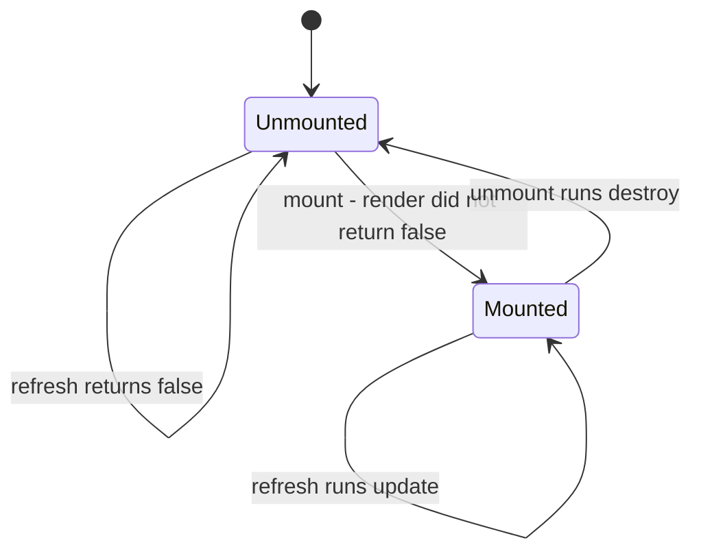
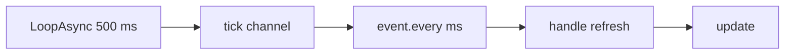
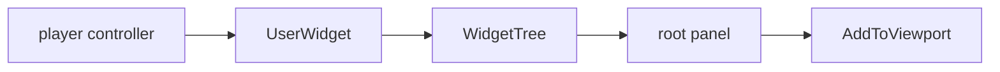

## 读完本页你可以做到

- 在游戏进行中，把自己的面板放到画面上
- 加一个按钮，点一下就给你道具，或者刷出一只帕鲁
- 在游戏标题画面的菜单里加上自己的项目
- 不重新搭一遍面板，只改它显示的内容
- 用完之后，把画面上的东西全部收走

## 第一个面板

界面元素就是你画到画面上的任何东西：一行文字、一个按钮、一整块面板。用 `UI{ ... }` 描述一个，它会用 Palworld 自带的界面控件搭出来，所以看上去和游戏的其他部分一致。

你要写三个函数。`render` 把各个部件搭一次。`update` 把新的值写进 `render` 已经搭好的部件。`destroy` 再把它们撤掉。

```lua title="content/ui/panel.lua"
local UI = require("palforge.api.ui")   -- or use the global UI installed by palforge.api

local Panel = UI{
    id          = "example:Panel",
    name        = "Example Panel",
    description = "One line of text.",

    render = function(self, root)
        -- build the widget tree under `root`; runs once per mount
        -- return false if you could not build: the element then stays unmounted
    end,

    update = function(self)
        -- reflect changed state into the widgets render already built
    end,

    destroy = function(self)
        -- remove the widgets render built; runs on unmount
    end,
}

local panel = Panel:new{ title = "Hello" }
panel:mount(root)
panel:refresh()
panel:unmount()
```

这里的每个部件都是一个**控件**（widget）：画面上界面的一个单元，比如一行文字、一个按钮，或者一个装着其他控件的盒子。

要用到别的文件定义的元素，就按它的 id 去查：

```lua
UI.get("palforge:Button")   -- a handle for an element defined elsewhere; never nil
UI.get_all()                -- every registered element, as a list of handles
```

游戏里没有任何东西会替你显示、更新或关闭你的面板。也没有原生事件会告诉你界面变了，所以时机由你自己挑：`:mount(root)` 把元素放到画面上，`:refresh()` 把当前的值写进去，`:unmount()` 把它撤下来。

## 传给 UI 的字段

`id` 是唯一必须给的字段。让画面上真正出现东西的是 `render`。

<TypeTable
  type={{
    id: {
      description: '元素的 id，例如 "example:Panel"。必须是非空字符串。',
      type: 'string',
      required: true,
    },
    name: {
      description: '给人看的标签。省略时等于 id。',
      type: 'string',
    },
    description: {
      description: '一行说明，给界面和工具用。',
      type: 'string',
    },
    render: {
      description: 'fun(self, root): boolean? —— 在 root 下面搭出控件树。每次挂载只跑一次。什么都没搭出来时返回 false。',
      type: 'function',
    },
    update: {
      description: 'fun(self) —— 刷新已经搭好的控件。每次调用 refresh 时跑。',
      type: 'function',
    },
    destroy: {
      description: 'fun(self) —— 移除 render 搭出来的控件。每次调用 unmount 时跑。',
      type: 'function',
    },
    data: {
      description: '这个元素的每份副本共享的默认字段。',
      type: 'table',
    },
  }}
/>

每份副本各不相同的值**不要**放在这里。把它们传给 `:new{ label = "OK", onClick = fn }`，然后在 `render` / `update` / `destroy` 里用 `self.label` 读出来。所有副本都该共享的默认值才用 `data`。

同一份字段清单在游戏里也能打印出来：

```lua
local schema = require("palforge.core.schema")
print(schema.help("UI.Spec"))         -- every field, its type and meaning
schema.get("UI.Spec").fields          -- the same as a table, for tooling
```

## render、update 和 destroy



`render(self, root)` 在 `root`（也就是控件要进的那块面板）下面搭出你的控件。元素每次上画面，`mount()` 都会调用它一次。不要自己调用它。什么都搭不出来时就返回 `false`，比如你需要的那块面板还不存在。这时元素会留在画面外，之后再挂载一次就会重试。返回 `nil` 算成功，所以一个总能成功的 render 可以什么都不返回。

`update(self)` 把新的值写进 `render` 已经搭好的控件。调用它的是 `refresh()`。也不要自己调用。

`destroy(self)` 移除 `render` 搭出来的控件。调用它的是 `unmount()`，而且只在元素还在画面上时才调用。也不要自己调用。

你不需要自己记住有没有 render 过。`mount` 替你记着：

```lua
-- Class:mount in api/ui.lua
function Class:mount(root)
    if self._mounted then return false end
    self._root = root
    if self:render(root) == false then
        self._root = nil
        return false
    end
    self._mounted = true
    return true
end
```

这三个函数不写就什么都不做，所以一个元素可以只是一份声明。当这个 id 存在的目的只是让别的模组通过 `UI.get` 找到它时，这很有用。

```lua
-- valid: registers "example:Marker" with no behaviour at all
UI{ id = "example:Marker", description = "Reserved id, nothing rendered." }
```

按名字分工。凡是搭控件的都放进 `render`，并存到 `self` 上；凡是往已有控件里写新值的都放进 `update`；凡是把控件撤走的都放进 `destroy`：

```lua
local widget = require("palforge.native.ui._widget")

local Label = UI{
    id   = "example:Label",
    data = { text = "" },

    render = function(self, screen)
        if not (screen and widget.alive(screen.root)) then return false end
        local ok = pcall(function()
            self.textWidget = widget.text(screen.tree, tostring(self.text), 18)
            widget.addV(screen.root, self.textWidget)
        end)
        if not ok then self:destroy(); return false end
        return true
    end,

    update = function(self)
        if not widget.alive(self.textWidget) then return false end
        local t = self.textWidget
        return pcall(function() t:SetText(FText(tostring(self.text))) end)
    end,

    destroy = function(self)
        local t = self.textWidget
        self.textWidget = nil
        if not widget.alive(t) then return false end
        return pcall(function() t:RemoveFromParent() end)
    end,
}
```

<Callout type="info">
`mount()` 把元素标记为「在画面上」，依据的是 `render` **返回了什么**，而不是它跑过这件事。返回 `false` 会让元素留在画面外，也会忘掉你传进去的 root，所以之后再调用 `mount()` 就只是再试一次。你不必在每次尝试之前自己去查游戏的状态。
</Callout>

## 一个面板，多份副本



`UI{ ... }` 把你的元素按 id 注册，并返回一个**句柄**：你在它上面调用 `:mount`、`:refresh` 和 `:unmount` 的那个对象。这个句柄已经带着元素的一份副本，所以 `UI{ ... }` 的返回值可以直接挂载。`:new(props)` 再给你一份带自己状态的副本。

```lua
local Badge = UI{
    id     = "example:Badge",
    data   = { label = "Badge", size = 18 },
    render = function(self, root) end,
}

local a = Badge:new{}                  -- a:state().label == "Badge"  (from data)
local b = Badge:new{ label = "Boss" }  -- b:state().label == "Boss", b:state().size == 18
```

`:new` 返回的是句柄，不是状态本身：状态在 `:state()` 后面，句柄上的 `a.label` 是 nil。那张状态表就是 `render` / `update` / `destroy` 里的 `self`，在它上面读一个名字时，查找顺序是：

1. 你传给 `:new{ ... }` 的字段，以及 `render` / `update` / `destroy` 赋到 `self` 上的东西
2. 元素的 `data` 默认值，它在定义时被复制到类上
3. `render`、`update`、`destroy`、`mount`、`refresh`、`unmount`、`isMounted`

在 `render` 里写 `self.label = "x"`，只会给这一份副本设上这个字段；共享的 `data` 默认值不受影响。

从外面读写某份副本的状态，用 `:state()`：

```lua
local st = a:state()
st.label = "Ready"
a:refresh()             -- nothing does this for you
```

<Callout type="info">
状态里的名字是顺着元素本身解析的，所以不要拿 `id`、`name`、`description`、`render`、`update`、`destroy`、`_mounted`、`_root`、`_refreshSub` 当自己状态的名字 —— 它们已经各有含义。
</Callout>

`UI.get(id)` 每次调用都会造一个**新的**句柄，带一份**新的**空副本，所以调用两次 `UI.get`，你会拿到两块能各自独立放上画面的面板：

```lua
local one = UI.get("palforge:Button")
local two = UI.get("palforge:Button")   -- a different instance of the same element
```

<Callout type="warn">
对于没人定义过的 id，`UI.get` 仍然返回句柄而不是 nil，`.id` / `:name()` / `:description()` 在它上面也能用。其余的不行：它造出来的替身没有挂上生命周期，所以 `:mount()`、`:refresh()`、`:unmount()` 和 `:isMounted()` 会抛出 `attempt to call a nil value`。要等到定义它的那份东西加载完之后再去查这个元素 —— 顺序由 `core/registry` 决定。
</Callout>

## 显示、更新、收起



```lua
local panel = Panel:new{ title = "Status" }

panel:mount(root)      -- true: render did not report a failure
panel:mount(root)      -- false: already mounted, render is NOT run again
panel:isMounted()      -- true
panel:refresh()        -- true: update() ran
panel:unmount()        -- destroy() runs, then the mounted flag and root are cleared
panel:refresh()        -- false: not mounted, update() does not run
panel:mount(root)      -- true: renders again from scratch
```

`mount(root)` 会保存 `root`，并原样交给 `render`。没有谁会去看它的内容，所以什么算合法的 root，由每个元素自己决定。你什么都不传时 `TitleMenu` 会自己找到，而建在 `widget.screen()` 上的元素会把整张 screen 表当成自己的 root。

`mount()` 在两种情况下返回 `false`：元素已经在画面上，或者 `render` 返回了 `false`。两种都不是错误，也都不会留下半块面板 —— 第二种情况里 `mount()` 还会忘掉 root，所以元素和尝试之前完全一样。

`refresh()` 在元素上画面之前什么都不做，只返回 `false`，所以从一个比它活得久的订阅里调用它也是安全的。

`unmount()` 会在 `pcall` 里跑 `destroy()`，所以一段会抛异常的收尾不可能把元素卡在画面上。接着它清掉「在画面上」的标记和保存的 root，并取消正在跑的 `autoRefresh` 订阅。因此之后的 `mount()` 会从头重新搭一遍。

<Callout type="warn">
`unmount()` 只会调用你写的 `destroy`，而默认的 `destroy` 什么都不做。一个在 `render` 里把控件存到 `self` 上、却没写 `destroy` 的元素会漏掉这些控件：标记清了，之后 `mount()` 又搭出第二份，第一份还留在画面上。`render` 搭了什么，就写出把它撤走的 `destroy`。
</Callout>

## 让画面保持最新

<Callout type="warn">
没有谁会替你调用 `refresh()`。目前没有确认存在的「界面更新了」原生事件可以挂钩，所以也没有谁在背后偷偷轮询。让画面保持最新有两条路：状态一变就自己调用 `:refresh()`，或者用 `:autoRefresh(ms)` 打开轮询。
</Callout>

第一条路 —— 在变化发生的地方 refresh。准确，而且什么都没变的时候不花任何开销：

```lua
local event = require("palforge.core.event")

event.on("item.obtain", function(ctx)
    if ctx.itemId ~= "Wood" then return end
    local st = panel:state()
    st.wood = (st.wood or 0) + (ctx.count or 1)
    panel:refresh()
end)
```

第二条路 —— 轮询。`autoRefresh(ms)` 搭在 PalForge 的心跳上，那是一个每 `event.TICK_MS`（500 ms）触发一次的计时器，通过 `event.every` 接入。因为它按整数个 tick 计数，实际周期会向上取整到 500 ms 的倍数。默认是 500。

```lua
panel:mount(root)
panel:autoRefresh()       -- every 500 ms
panel:autoRefresh(2000)   -- no-op: a subscription is already installed, returns true
```



几个要记住的点：

- 已经有一个在跑的时候再调用 `autoRefresh`，会返回 `true`，但不会再装一个订阅。要改间隔，先 `unmount()`，再挂载一次并重新调用。
- `unmount()` 会取消它。
- 订阅装不上时它返回 `false`；整个调用都有保护。
- 它驱动的只是那个句柄背后的那一份副本。同一个元素的另一份副本得自己再调用一次。

轮询不只是给那些自己会变的值用的。`TitleMenu` 靠它扛住游戏重建自己界面这件事：它的 `update` 会把按钮已经消失的项目放回去，所以 `:autoRefresh(2000)` 能让你的项目留在一个被拆掉又重建的标题画面上。

## 所有可以调用的成员

`UI{ ... }`、`UI.get(id)` 和 `:new(props)` 都返回一个 `UI.Handle`，下面是它的成员。

| 成员 | 返回值 | 作用 |
| --- | --- | --- |
| `.id` | `string` | 元素的 id |
| `:new(props)` | `UI.Handle` | 一份全新、可以独立挂载的副本；`props` 成为它的状态 |
| `:mount(root)` | `boolean` | 在 `root` 下面 render 一次；已挂载或 `render` 返回 `false` 时返回 `false` |
| `:refresh()` | `boolean` | 跑 `update()`；挂载之前一直返回 `false` |
| `:unmount()` | — | 跑 `destroy()`，清掉挂载标记和保存的 root，取消 `autoRefresh` |
| `:isMounted()` | `boolean` | render 是否报告了成功，且还没有 unmount |
| `:autoRefresh(ms)` | `boolean` | 搭在心跳上轮询 `refresh()`；`ms` 默认是 500 |
| `:state()` | `table` | 这份副本本身，也就是 `render` / `update` / `destroy` 里的 `self` |
| `:name()` | `string` | 元素的 `name`，没有就是 id |
| `:description()` | `string?` | 元素的 `description` |

`UI.Class` 是每个元素都继承的基类。它持有 `mount` / `refresh` / `unmount` / `isMounted`，以及 `render`、`update`、`destroy` 三个什么都不做的默认实现。

## 自己造一个画面

你的控件得有地方待。宿主有两种：游戏已经有的面板 —— `TitleMenu` 就是往标题画面的按钮列里加东西 —— 或者你用 `widget.screen()` 自己造一个。两种都用 `native/ui/_widget.lua` 搭建，那是现成元素用的工具箱。



工具箱里每个辅助函数都需要一个 `WidgetTree` —— Unreal 用来装一个画面全部控件的容器 —— 而一个光秃秃的 `UUserWidget` 没有它，因为引擎通常是从控件编译好的 Blueprint 里建出来的。`widget.screen()` 自己造出这棵树并挂上去，这就是你能只靠 Lua 做界面、不用编译任何东西的原因。

```lua
local widget = require("palforge.native.ui._widget")

local screen, why = widget.screen()
if not screen then
    print("no screen: " .. tostring(why))
end

-- when it built:
--   screen.widget  the UUserWidget now on the viewport
--   screen.tree    the WidgetTree every primitive constructs into
--   screen.root    the VerticalBox your widgets go under
--   screen.pc      the controller that owns it; the clickable helpers need it
```

`widget.screen(pc, opts)` 从不抛异常。它要么返回 screen 表，要么返回 `nil` 加一个说明原因的字符串：没有 owner、缺少某个 UMG 类，或者 `AddToViewport` 没生效。`pc` 默认是 `widget.owner()` —— `PalPlayerController`，否则任意 `PlayerController`，再否则 `GameInstance`，完全没有游戏时是 `nil`。

<TypeTable
  type={{
    zOrder: {
      description: '传给 AddToViewport 的视口 z 序。',
      type: 'number',
      default: '1000',
    },
    show: {
      description: '立刻加到视口上。传 false 就先隐藏着搭好，之后自己调用 widget.show。',
      type: 'boolean',
      default: 'true',
    },
    dim: {
      description: '面板背后那层全屏压暗的颜色，写成 { r, g, b, a }。传 false 则 root 就是一个没有任何边框的裸 VerticalBox。',
      type: 'table | false',
      default: '{ 0.02, 0.02, 0.03, 0.86 }',
    },
    panel: {
      description: '控件所在的内层面板的颜色，写成 { r, g, b, a }。',
      type: 'table',
      default: '{ 0.10, 0.09, 0.08, 0.98 }',
    },
    padding: {
      description: '那块面板内侧的留白，写成 { Left, Top, Right, Bottom }。',
      type: 'table',
      default: '{ Left = 90, Top = 54, Right = 90, Bottom = 54 }',
    },
  }}
/>

```lua
-- a bare vertical stack: no dimmer, no frame, drawn under the default z
local bare = widget.screen(nil, { dim = false, zOrder = 500 })

-- built but not shown; put it up and take it down yourself
local hidden = widget.screen(nil, { show = false })
widget.show(hidden)       -- AddToViewport; true if the widget reports itself shown
widget.hide(hidden)       -- RemoveFromParent; true if it is no longer shown
```

往里面填的部件：

| 辅助函数 | 搭出什么 |
| --- | --- |
| `widget.vbox(tree)` / `widget.hbox(tree)` | 一个 `VerticalBox` / `HorizontalBox` |
| `widget.scrollBox(tree)` / `widget.overlay(tree)` | 一个 `ScrollBox` / `Overlay` |
| `widget.border(tree, rgba)` | 一个 `Border`，画刷颜色写成 `{ r, g, b, a }` |
| `widget.sizeBox(tree, w, h)` | 一个 `SizeBox`；每个 override 都会先作为带 `bOverride_` 标志的属性写一次，再通过 setter 写一次，因为 UE4SS 的 setter 有时不生效 |
| `widget.text(tree, str, size, rgba)` | 一个 `TextBlock`；`size` 默认是 16 |
| `widget.menuButton(tree, pc, label, onClick)` | 游戏菜单按钮的一份克隆；返回按钮、它的隐形点击目标和点击路由的键 |
| `widget.clickableRow(tree, pc, label, onClick, opts)` | 同一个按钮，上面盖着左对齐的文字；`opts = { size, color, indent }` |
| `widget.cloneGameWidget(tree, pc, classPath, opts)` | 任意 Palworld BP 控件；`opts = { label, labelChild, clickChild, onClick }` |
| `widget.addV(vbox, child, padTop)` | 加进 `child`，返回那个插槽 |
| `widget.addH(hbox, child)` / `widget.addScroll(scroll, child)` | 对 `HorizontalBox` / `ScrollBox` 做同样的事 |
| `widget.alive(w)` | 这个控件还能不能对话；不会抛异常 |
| `widget.findByName(w, name)` | 按名字深度优先查找一个后代控件 |
| `widget.releaseClicks(names)` | 按键丢掉点击路由里的登记 —— `destroy` 调用的就是它 |

`mount(root)` 把 `root` 原封不动交给 `render`，所以一个元素可以把整张 screen 表当成自己的 root，从这一个参数里就能拿到 `tree`、`root` 和 `pc`：

```lua title="content/ui/stats_panel.lua"
local UI     = require("palforge.api.ui")
local Item   = require("palforge.api.item")
local Pal    = require("palforge.api.pal")
local widget = require("palforge.native.ui._widget")

local Stats = UI{
    id   = "example:Stats",
    name = "Stats",
    data = { title = "PalForge", rows = {} },

    render = function(self, screen)
        if not (screen and widget.alive(screen.root)) then return false end
        self.clicks = {}
        local ok = pcall(function()
            local head = widget.text(screen.tree, self.title, 24)
            widget.addV(screen.root, head, 8)
            for _, row in ipairs(self.rows) do
                local line, _, clickName =
                    widget.clickableRow(screen.tree, screen.pc, row.label, row.onClick)
                widget.addV(screen.root, line, 4)
                self.clicks[#self.clicks + 1] = clickName
            end
        end)
        if not ok then self:destroy(); return false end
        self.screen = screen
        return true
    end,

    -- Taking the whole screen off the viewport removes every widget under it at once.
    destroy = function(self)
        widget.releaseClicks(self.clicks or {})
        if self.screen then widget.hide(self.screen) end
        self.clicks, self.screen = nil, nil
        return true
    end,
}

local panel = Stats:new{
    title = "PalForge",
    rows  = {
        { label = "Give 10 Wood",    onClick = function() Item.get("Wood"):give(10) end },
        { label = "Spawn a Chikipi", onClick = function() Pal.get("ChickenPal"):spawn() end },
    },
}

local screen = widget.screen()
if screen then panel:mount(screen) end
```

<Callout type="info">
`_widget.lua` 在 `native/ui` 下面，不在 `api/` 下面，所以它的辅助函数可能在版本之间无预告地变化。它仍然是今天唯一能搭出控件的办法，所以这里的元素和示例都用它。
</Callout>

## 现成的元素

PalForge 自带两个可以直接用的元素。两个都会把真正的控件放进游戏自己的界面里。

```lua
local ui = require("palforge.native.ui")
ui.Button                                    -- also require("palforge.native.ui.button")
ui.TitleMenu                                 -- also require("palforge.native.ui.title_menu")

UI.get("palforge:Button")                    -- the same element, a fresh instance
UI.get("palforge:TitleMenu")
```

每个模块给你的元素都已经附带一份副本。请调用 `:new{ ... }`，而不要直接挂载模块本身的值，这样每个用到它的地方都能有自己的标签和自己的回调。

### Button

`palforge:Button` —— 一个可点击的按钮，样式和游戏自带的一样。

```lua
local Button = require("palforge.native.ui.button")
local widget = require("palforge.native.ui._widget")

local screen = widget.screen()
local give   = Button:new{
    label   = "Give 10 Wood",
    onClick = function() Item.get("Wood"):give(10) end,
}
if screen then give:mount(screen.root) end
```

它从你造的副本里读两个字段：`self.label`（默认是 `""`）和 `self.onClick`。`render` 把按钮存到 `self.widget`，把它内部的标签控件存到 `self.labelWidget`，把点击路由的键存到 `self.clickName`。

`render` 依次做这些事：

- 找一个 `PalPlayerController`，没有就返回 `false`
- 通过 `WidgetBlueprintLibrary.Create` 克隆游戏的 `WBP_Title_MenuButton`，克隆失败也返回 `false`
- 把 `label` 写进按钮内部的 `Test_Content` 文本控件
- 把按钮内部的 `HorizontalBox_0` 改成左对齐，让标签不管多宽都能对齐
- 把内部的 `WBP_PalInvisibleButton` 注册到共享的点击路由上：那是装在
  `/Script/CommonUI.CommonButtonBase:HandleButtonClicked` 上的一个 `RegisterHook`，它会把点击发给拥有那个按钮的回调。钩子在第一次注册时才装上，不会更早。
- 用 `AddChildToVerticalBox` 把按钮加到 `root` 上，不行就退回 `AddChild`

放置是查过的，不是想当然的。如果 `root` 这两种调用都不接受，`render` 会跑自己的 `destroy()` —— 把按钮和它的点击处理函数一起丢掉，而不是留下一个连着活回调的隐形按钮 —— 然后返回 `false`。元素会留在画面外，所以可以换一个真能接收子节点的 root 重新 `mount()`。

`update` 把当前的 `self.label` 写进活着的按钮，所以你可以不重建按钮就改标签：

```lua
give:state().label = "Give 50 Wood"
give:refresh()
```

按钮本身已经没了时它返回 `false`。如果只是缓存的标签控件过期了，它会先重新查一次 `Test_Content`。

`destroy` 释放按钮在点击路由里的登记，并调用 `RemoveFromParent()`，所以 `unmount()` 是真的把按钮从画面上撤走，之后的 `mount()` 会搭一个新的，不会留下一个孤儿。

### TitleMenu

`palforge:TitleMenu` —— 往游戏的标题画面加项目。这个在真正的标题画面上是能用的。

```lua
local TitleMenu = require("palforge.native.ui.title_menu")

local menu = TitleMenu:new{
    entries = {
        { label = "Mods",     onClick = function() openMods() end },
        { label = "Settings", onClick = function() openSettings() end },
    },
}
menu:mount()             -- no root: it finds the title screen itself
menu:autoRefresh(2000)   -- re-inject whenever the title screen rebuilds itself
```

`self.entries` 是一个 `{ label = ..., onClick = ... }` 的数组。在碰任何一个项目之前，`render` 会先解决三件事，其中任何一件缺失就返回 `false`：root —— 你传进来的 `root`，如果它有效，否则是 `FindFirstOf("PalUITitleBase").WidgetTree.RootWidget` —— 然后是它里面的 `VerticalBox_0`，也就是标题画面的按钮列，还有一个有效的 `PalPlayerController`。接着，对每个还没有活按钮的项目，它会：

1. 造一个原生菜单按钮，用一个 `SizeBox` 把它包起来，尺寸从旁边那个原生的 `SizeBox_4` 读，读的是 `WidthOverride` / `HeightOverride` 这两个**属性** —— getter 读回来是 nil。没有这个固定宽度，按钮会被拉伸并居中。
2. 把这个 `SizeBox` 加进列里，把插槽设成左对齐，上下各给 3 的留白，和游戏自己的项目一致
3. 把按钮的隐形点击目标、它的 `SizeBox` 和它的点击路由键记在这个项目上，字段名是 `e.invButton`、`e.sizeBox` 和 `e.clickName`

一轮里只要加进了至少一个项目，它就会把 `WBP_Title_MenuButton_ExitGame` 的父盒子移到列尾，让 Exit Game 保持在最后 —— `VerticalBox` 没有插入操作。

`render` 只有在真的加进了项目时才返回 `true`，所以在标题画面存在之前尝试的 `mount()` 会让元素留在画面外，直接重试就行。

`update` 把项目放回去。标题画面会重建自己的控件 —— 比如回到标题的时候 —— 并且悄悄把加上去的按钮一起带走。每个 `e.invButton` 已经无效的项目都会被重新加一次；还活着的项目原样不动，所以一次 refresh 绝不会堆出重复项。之后所有项目都在时它返回 `true`，没有任何项目需要加时返回 `false`。在心跳上跑这个检查的就是 `:autoRefresh(2000)`。

`destroy` 把每个项目的 `SizeBox` 从按钮列里移除，并释放它的点击路由登记，所以 `unmount()` 会把菜单撤回去，之后的 `mount()` 是重新加一遍，而不是给每个项目再堆上第二份。

<Callout type="warn">
标题画面上没有世界，也没有玩家角色。在那里调用 `Item.get("Wood"):give(10)` 的项目会失败：`give` 走的是本地玩家的背包。标题项目请只做菜单操作，任何碰到游戏玩法的东西，都把 `Button` 挂到游戏内的面板上去做。
</Callout>

## 实用示例

### 显示计数的面板

一块统计 Wood 拾取数量的单行面板。`render` 把文本控件搭一次，`update` 把当前的数字写进去，`destroy` 把整个 screen 撤下来，而推动这个数字的是 `item.obtain` 处理函数。screen 在 `world.ready` 时才建，因为 `item.obtain` 只有在世界加载之后才会触发。

```lua title="content/ui/wood_counter.lua"
local UI     = require("palforge.api.ui")
local event  = require("palforge.core.event")
local widget = require("palforge.native.ui._widget")

local Counter = UI{
    id          = "example:Counter",
    name        = "Counter",
    description = "One line of text showing a running number.",
    data        = { label = "Count", count = 0 },

    -- build once; `screen` is what widget.screen() returned
    render = function(self, screen)
        if not (screen and widget.alive(screen.root)) then return false end
        local ok = pcall(function()
            self.textWidget = widget.text(screen.tree, self.label .. ": " .. self.count, 18)
            widget.addV(screen.root, self.textWidget)
        end)
        if not ok then self:destroy(); return false end
        self.screen = screen
        return true
    end,

    -- reflect state into the widget render already built
    update = function(self)
        if not widget.alive(self.textWidget) then return false end
        local t = self.textWidget
        return pcall(function() t:SetText(FText(self.label .. ": " .. self.count)) end)
    end,

    -- take it down again: unmount() runs this
    destroy = function(self)
        if self.screen then widget.hide(self.screen) end
        self.textWidget, self.screen = nil, nil
        return true
    end,
}

local wood = Counter:new{ label = "Wood", count = 0 }

-- mount() returns false while render reports it could not build, so this just retries.
event.on("world.ready", function()
    if wood:isMounted() then return end
    local screen = widget.screen(nil, { dim = false, zOrder = 500 })
    if screen then wood:mount(screen) end
end)

-- move the state, then refresh: nothing refreshes for you
event.on("item.obtain", function(ctx)
    if ctx.itemId ~= "Wood" then return end
    local st = wood:state()
    st.count = st.count + (ctx.count or 1)
    wood:refresh()
end)

-- leaving the world drops the widgets; destroy() runs and a later mount() rebuilds
event.on("world.left", function() wood:unmount() end)
```

如果数字的来源背后没有事件，就改成轮询：

```lua
wood:mount(screen)
wood:autoRefresh(1000)      -- refresh at most every 1000 ms, off the 500 ms heartbeat

-- update() now reads whatever is current, so the source can be anything
```

### 点一下就给道具的按钮

<Tabs items={['单独的按钮', '标题菜单项目']}>
<Tab value="单独的按钮">

```lua title="content/ui/give_button.lua"
local Button = require("palforge.native.ui.button")
local Item   = require("palforge.api.item")
local widget = require("palforge.native.ui._widget")
local log    = require("palforge.utils.log").scope("give-button")

-- One instance per use site: :new gives this button its own label and callback.
local giveWood = Button:new{
    label   = "Give 10 Wood",
    onClick = function()
        local ok = Item.get("Wood"):give(10)
        log.info("gave wood: " .. tostring(ok))
    end,
}

local screen

-- A screen of our own to host it: screen.root is a VerticalBox, which is exactly what
-- Button's render adds itself to.
local function show()
    if giveWood:isMounted() then return end
    screen = widget.screen(nil, { dim = false })
    if not screen then return end
    if not giveWood:mount(screen.root) then
        widget.hide(screen)
        screen = nil
    end
end

local function hide()
    giveWood:unmount()          -- destroy() removes the button and drops its click handler
    if screen then widget.hide(screen) end
    screen = nil
end

return { show = show, hide = hide }
```

</Tab>
<Tab value="标题菜单项目">

```lua title="content/ui/title_entries.lua"
local TitleMenu = require("palforge.native.ui.title_menu")
local UI        = require("palforge.api.ui")
local event     = require("palforge.core.event")
local log       = require("palforge.utils.log").scope("title")

local menu = TitleMenu:new{
    entries = {
        {
            label   = "PalForge: elements",
            onClick = function()
                for _, el in ipairs(UI.get_all()) do
                    log.info(el.id .. " -> " .. el:name())
                end
            end,
        },
        {
            label   = "PalForge: version",
            onClick = function() log.info(tostring(PalForge.env.version)) end,
        },
    },
}

-- The title screen may not exist yet when this file loads. mount() stays false until it
-- does, so retrying off the heartbeat is the whole retry loop.
event.every(1000, function()
    if not menu:isMounted() then menu:mount() end
end)

-- Once it is in, polling re-injects the entries whenever the title screen rebuilds itself.
menu:autoRefresh(2000)

-- Entering a world takes the title screen away; unmount so a later mount injects afresh.
event.on("world.ready", function() menu:unmount() end)
```

</Tab>
</Tabs>

两个按钮的点击都走同一个钩子，两个也都在 `destroy` 里丢掉自己的路由登记，所以你收起来的元素不会留下任何东西。给道具只有在有活着的玩家角色时才管用，所以 `Item.get("Wood"):give(10)` 属于游戏内的按钮，不属于标题项目。

## 错误

每个问题都是硬报错，调用绝不会做到一半就算成功。

```lua
UI{ name = "Panel" }
```

```text
PalForge: UI: field "id" is required (element id, e.g. "pack:Panel")
```

```lua
UI{ id = "example:Panel", onClick = function() end }
```

```text
PalForge: UI: unknown field "onClick". Valid fields: id, name, description, render, update, destroy, data
```

`onClick` 属于元素的副本，不属于定义 —— 把它传给 `:new{ onClick = ... }`。

```lua
UI{ id = "example:Panel", render = "build" }
```

```text
PalForge: UI: field "render" expects function, got string
```

```lua
UI{ id = "" }
```

```text
PalForge: UI: field "id" is invalid: must be a non-empty string
```

## 相关页面

<Cards>
  <Card title="Item" href="/docs/api/item">
    `:give` / `:take`，以及面板要统计的 `item.obtain` 上下文。
  </Card>
  <Card title="Pal" href="/docs/api/pal">
    从按钮刷出一只帕鲁，以及帕鲁能响应的事件。
  </Card>
  <Card title="生命周期" href="/docs/concepts/lifecycle">
    `autoRefresh` 搭上去的那条 500 ms 心跳，以及所有事件频道。
  </Card>
</Cards>

## 小结

- 用 `UI{ ... }` 描述一个元素。只有 `id` 是必须的，而让画面上出现东西的是 `render`。
- `render` 搭出你的控件，`update` 往里写新的值，`destroy` 把它们撤走。这三个你都不用自己调用。
- `:mount(root)` 显示它，`:refresh()` 更新它，`:unmount()` 收起它。`mount()` 返回 `false` 只是「还不到时候」，之后再调用一次就行。
- 每份副本都有自己的状态。`:new{ ... }` 造一份，`:state()` 读写它。
- 没有谁会替你 refresh：状态变了就调用 `:refresh()`，或者用 `:autoRefresh(ms)` 每隔几个 tick 轮询一次。
- `widget.screen()` 给你一块自己的面板来搭东西，而 `Button` 和 `TitleMenu` 拿来就能用。

接下来读 [Item](/docs/api/item)，做出按钮要发给玩家的那些东西。
