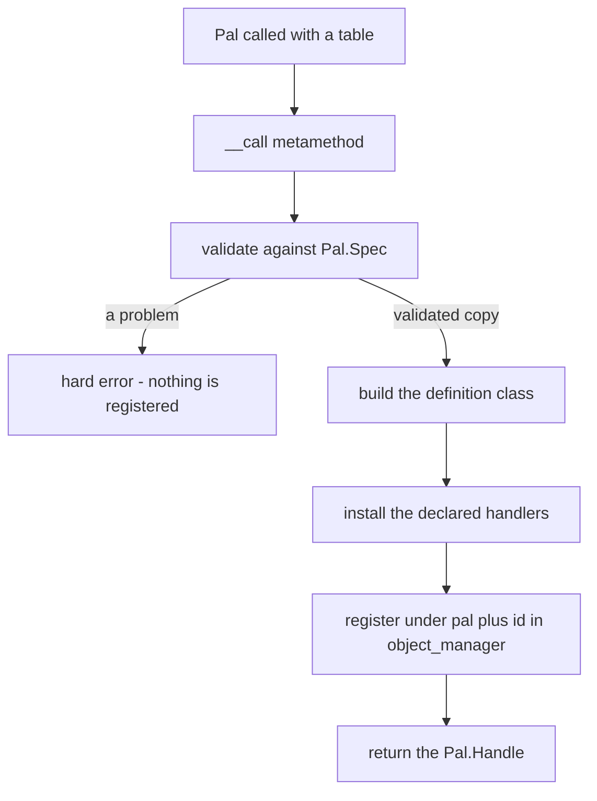
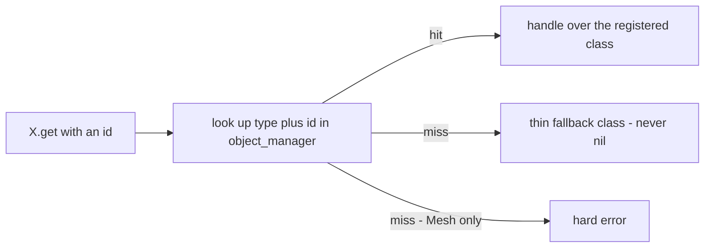
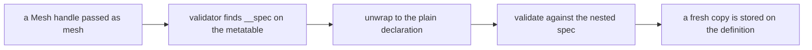

## このページでできるようになること

- 自分の Pal、アイテム、建物、サウンド、メッシュをゲームに追加する
- もとからあるものに、何も宣言せずに新しい動きを付ける
- さきに作ったものを、パックのどこからでも探し出す
- ほかの人の Mod と名前がぶつからない名前をつけ、ぶつかったときにそれを知る
- フィールドを書き間違えたときのメッセージを読んで直す

## 何かを作る

コンテンツは、その種類のモジュールに設定のテーブルを渡して呼び出すと作れます。どの種類でも
やり方は同じです。

```lua
local pal = Pal{ id = "example:Boss", name = "Boss" }  -- CALL the module to define
Pal.get("ChickenPal")                                  -- an existing one, by id
Pal.get_all()                                          -- every registered one
```

呼び出すと、渡した設定が **定義** として記録され、**ハンドル** が返ってきます。ハンドルは操作
するためのオブジェクトです。`Item`、`Building`、`Skill`、`Effect`、`Audio`、`Mesh`、`UI` も
同じ形で呼び出します。違うのはフィールドだけです。

`Pal{ ... }` は Lua の短い書き方です。呼び出しの引数がテーブルひとつだけのときは丸括弧を省け
るので、次の 2 つはまったく同じ呼び出しです。

<Tabs items={['Sugared', 'Desugared']}>
<Tab value="Sugared">

```lua
local pal = Pal{
    id          = "ChickenPal",
    name        = "Chicken Pal",
    description = "the one that greets you",
}
```

</Tab>
<Tab value="Desugared">

```lua
local pal = Pal({
    id          = "ChickenPal",
    name        = "Chicken Pal",
    description = "the one that greets you",
})
```

</Tab>
</Tabs>

波括弧の中身がそのまま引数リストです。値にはすべて名前がつくので順序は関係なく、あとから
ドメインにフィールドが増えても、すでに書いた項目の意味がずれることはありません。

この書き方はテーブルをひとつ受け取る関数すべてに使えるので、名前つきコンストラクタも同じ形に
なります。

```lua
Audio.bgm{ id = "AKE_BGM_Title" }     -- same as Audio.bgm({ id = "AKE_BGM_Title" })
Panel:new{ title = "Hello" }          -- same as Panel:new({ title = "Hello" })
```

モジュールを呼び出せるのは、そのテーブルが `__call` メタメソッド（テーブルが呼ばれたときに
走る Lua の仕組み）を持っているからです。

```lua
setmetatable(Pal, { __call = function(_, spec) return define(spec) end })
```

`define` は `api/pal.lua` の中のローカル関数です。そこへ届く方法がモジュールの呼び出しです。

<Callout type="info">
引数なしの `Pal()` は空の定義を作るショートカットではありません。spec が空テーブルになり、
`id` が欠けているためエラーになります。
</Callout>

## 返ってくるもの

ハンドルは操作の窓口です。Pal に対して「する」ことはすべてここにあります。

```lua
local boss = Pal{ id = "ChickenPal", name = "Scorched Chicken" }

boss:spawn(Player.coordinate())   -- put one in the world
boss:name()                       -- "Scorched Chicken"
boss.id                           -- "ChickenPal"
```

`Pal.Handle:spawn`、`Item.Handle:give`、`Audio.Handle:play`、`Effect.Handle:apply`、
`Mesh.Handle:attachTo`、`UI.Handle:new` は、どれもハンドルのメソッドです。

中身を見ると、ハンドルは定義を包むフィールド 2 つのラッパーです。

```lua
wrap = function(cls) return setmetatable({ id = cls.id, _cls = cls }, Handle) end
```

`id` が公開部分、`_cls` が実体の定義で、`Handle` メタテーブルがそのドメインのアクションと
クエリを持ちます。ハンドルは軽く使い捨てで、`get` を呼ぶたびに新しいものが作られます。

```lua
local a = Pal.get("ChickenPal")
local b = Pal.get("ChickenPal")

a == b        -- false: two different wrapper tables
a.id == b.id  -- true:  the same definition underneath
```

イベントハンドラも第 1 引数に同じハンドルを受け取ります。何が起きたときでも、その対象への
アクションがすでに手元にあります。

```lua
Pal{
    id = "ChickenPal",
    events = {
        onSpawned = function(pal, ctx)
            pal:renderOn(ctx.actor)          -- `pal` is this definition's handle
        end,
    },
}
```

<Callout type="info">
`UI` のハンドルだけはもうひとつ持ち物があります。`wrap` は要素クラスをメタテーブルとする状態
テーブルも作って `_st` に持たせるので、ハンドルそのものがマウントでき、`Handle:new{ ... }` は
独自の状態を持つ独立したインスタンスを返します。
</Callout>

## 記録されるもの

定義は、渡した内容を持つ素の Lua テーブルです。そのドメインの基底クラスをメタテーブルに持ち、
`core/object_manager` に `(type, id)` の組で記録されます。

Pal の場合、`Pal{ ... }` は次のテーブルを組み立てます。

```lua
local cls = setmetatable({
    id           = spec.id,
    name         = spec.name or spec.id,
    description  = spec.description,
    skills       = spec.skills,
    meshSpec     = spec.mesh,
    materialSpec = spec.material,
    color        = spec.color,
    texture      = spec.texture,
    icon         = spec.icon,
    data         = spec.data,
}, Class)
cls.__index = cls
```

2 つのフィールドは別の名前で入ります。`mesh` は `cls.meshSpec`、`material` は
`cls.materialSpec` になります。`Class:mesh()` と `Class:material()` がメソッドとしてあり、
名前がぶつかるからです。建築物の `state` は `cls.defaultState` になります。設置された建築物の
`state` は、その 1 つの建築物が保存している自分用のテーブルだからです。これらの名前に出会う
のは、クラスを直接のぞいたときだけです。

宣言したハンドラはそのクラスに取り付けられます。Pal、Item、Skill、Effect は小さなフォワーダ
越しに取り付けます。ハンドラがクラスではなく **ハンドル** を受け取るのはそのためです。

```lua
for name, handler in pairs(spec.events or {}) do
    cls[name] = function(_, ...) return handler(handle, ...) end
end
```

建築物はハンドラを書いたまま取り付けます。建築物のハンドラの第 1 引数は定義ではなく、設置され
た建築物そのものだからです。

```lua
for name, handler in pairs(spec.events) do cls[name] = handler end
```

そのうえで、いま定義しているパックの情報と一緒にクラスが登録されます。

```lua
om.register("pal", spec.id, cls, { pack = pack })
```

`register` はクラス、または `nil` と理由を返します。例外は投げません。8 ドメイン中 6 つはこれを
ベストエフォートで呼んで戻り値を捨てるので、レジストリ側の問題が定義の呼び出しを壊すことはあり
ません。残る 2 つは黙りません。登録されなかった定義は誰にも見つけられないからです。
`api/pal.lua` は戻り値を確認し、`api/ui.lua` は例外を捕まえて何が動かなくなるのかを名指しします。

```text
[PalForge.pal][err] Pal 'example:Boss' could NOT be registered (...) — it will receive no lifecycle events and Pal.get will not find it
```

キーは **あなたが書いたとおりの id** で、コロンも含みます。`"example:Boss"` は
`"example:Boss"` として格納されます。解決後の綴り `example_Boss` はその隣、2 本目の
インデックスに入り、ディスパッチがゲームの行名と突き合わせるのはそちらです。

レジストリは直接読めますし、誰が所有しているかも訊けます。

```lua
local om = require("palforge.core.object_manager")

om.get("pal", "ChickenPal")          -- the definition class, or nil
om.all("pal")                        -- { id -> cls }, a shallow copy you may not mutate into
om.TYPES                             -- audio, building, effect, item, mesh, pal, skill, ui

om.isRegistered("pal", "ChickenPal") -- always a boolean: is this id taken
om.owner("pal", "example:Boss")      -- the pack id that registered it, or nil
om.entry("pal", "example:Boss")      -- a copy of { cls = , pack = , resolved = }
om.byResolved("pal", "example_Boss") -- cls, sourceId - one table read, not a scan
om.unregister("pal", "example:Boss") -- true when something was there to forget
om.validId("my-pack:Bench")          -- false, plus the reason
```

「この id はもう使われているか」に公に答えられるのは `om.isRegistered` だけです。`X.get` では
答えられません。7 つのドメインは外れたときに薄いハンドルをでっち上げ、`Mesh.get` は例外を投げる
からです。`om.all` と `om.entry` はコピーを返すので、そこに書き込んでも何も変わりません。

## 呼び出しの全体像



最初に検査が走り、完全に通るか例外を投げるかのどちらかです。呼び出しが途中まで成功することは
ないので、はねられた設定の定義が登録されたままになることもありません。検査はまず、個々の
フィールドを見る前にテーブル全体の未知のキーを調べ、そのあと宣言順にフィールドをたどって、
新しいコピーへデフォルトを埋めていきます。渡したテーブルが変更されることはありません。

問題はすべてハードエラーになり、ドメイン名とフィールド名が出ます。たいていはメッセージだけで
直せます。

```text
PalForge: Pal: unknown field "meshSpec" (did you mean "mesh"?). Valid fields: id, name, description, skills, mesh, material, color, texture, icon, events, data
PalForge: Pal: field "id" is required (pal id: a game CharacterID ("ChickenPal") or "pack:name")
PalForge: Pal: field "name" expects string, got number
PalForge: Pal: field "skills[2]" expects string, got number
PalForge: Pal: field "mesh" (Mesh.Spec): field "model" is required (USkeletalMesh / UStaticMesh asset path)
PalForge: Item: field "category" must be one of { "material", "consumable", "equipment", "ammo", "ingredient", "other" }, got "consumeable"
```

書く前に何を渡せるか知りたいときは、スキーマレジストリ（宣言されている形の一覧を実行時に
返すもの）に聞きます。

```lua
local schema = require("palforge.core.schema")

print(schema.help("Pal.Spec"))        -- every field, type, default and meaning
schema.get("Pal.Spec").fields         -- the same, as a table, for tooling
schema.all()                          -- every declared spec, in declaration order
```

## あとから見つける

定義を作るのは `X{ ... }` だけです。`get` と `get_all` は探すだけです。

```lua
Item{ id = "Wood", name = "Wood", maxStack = 9999 }   -- defines and registers
Item.get("Wood")                                      -- looks it up
Item.get_all()                                        -- every registered item
```

`X.get(id)` は `id` が空でない文字列であることを assert してからレジストリを引きます。その id
に何も登録されていなかったときの動きだけが、ドメインによって違います。



7 つのドメインは薄いフォールバックを作ります。id だけを持つ素のクラスをハンドルで包んだもの
です。おかげで、何も宣言せずにゲームがもとから持つコンテンツを操作できます。

```lua
Item.get("Wood"):give(10)                              -- no Item{ id = "Wood" } needed
Pal.get("SheepBall"):spawn(Player.coordinate())
Audio.get("AKE_BGM_Title"):play()
```

薄いハンドルでも、id だけで済むことはすべてできます。`:spawn`、`:give`、`:take`、`:play` は
いずれも id を通ります。アイコン DataTable（ゲームが持つアイテムや生き物のアイコン表）を読む
ドメインでは `:iconOf()` も普段どおり解決します。対象は pal、item、building、skill です。
薄いハンドルにできないのは、宣言から来る部分です。`:mesh()` は `nil`、`:renderOn(actor)` は
`false`、`:name()` は id にフォールバックし、ハンドラは何も走りません。

`Audio.get` だけはフォールバックにもうひとつ `soundId = id` を持たせるので、どの AkAudioEvent
名（ゲーム側でのサウンドの名前）でもそのまま再生できます。音を指定しなかった定義に対して
`Audio{ ... }` が適用するのと同じフォールバックです。

`Mesh.get` は代わりに例外を投げます。

```text
PalForge: Mesh.get("example:body"): no mesh is defined under that id
```

`model` のないメッシュには描くものがありません。ですから、メッシュ id の取りこぼしは書いた
場所でエラーになります。別の場所で黙って何も付かない、ということにはなりません。

```lua
local log = require("palforge.utils.log").scope("mypack")

local ok, err = pcall(Mesh.get, "example:body")
if not ok then log.warn(err) end
```

`X.get_all()` は `om.all(type)` をたどり、見つけたクラスをすべて包みます。

```lua
local log = require("palforge.utils.log").scope("mypack")

for _, item in ipairs(Item.get_all()) do
    log.info(item.id .. " -> " .. item:name() .. " (" .. item:category() .. ")")
end
```

覚えておくことが 2 つあります。順序はスナップショットに対する `pairs` の走査なので安定しま
せん。順序が必要なら結果をソートしてください。そして並ぶのは実際に定義されたものだけです。
ネイティブカタログは必要になってから読み込まれるので、起動直後の `Item.get_all()` が返すのは
キュレーション済みの定義（`Wood`、`Berries`、`Arrow`）と自分のパックが宣言したものであって、
ゲームのアイテムテーブルの全行ではありません。

### 一度定義し、何度でも操作する

定義呼び出しは登録します。ハンドラはイベントのたびに走ります。ハンドラの中では `get` を使い、
定義は書かないでください。

```lua
Pal{
    id = "ChickenPal",
    events = {
        onDeath = function(pal, ctx)
            Audio.get("AKE_BGM_Title"):play()          -- a lookup, then a play
            -- Audio.bgm{ id = "AKE_BGM_Title" }:play()  -- re-declares on every death
        end,
    },
}
```

どちらの書き方でも音は鳴ります。ただし後者は、その Pal が死ぬたびに設定を検査し直し、
レジストリのエントリを上書きします。

## ID: 自分のものと、ゲームのもの

コロンを含む id はパック id で、形は `"packid:name"` です。ゲームの DataTable では対応する行の
FName が `packid_name` になります。これは推測ではなく、ダンプした `DT_ItemDataTable` に注入されて
いる 2 行が、まさに `PalSmith_TestPotion` と `example_Potion` という綴りだったことで確かめてあり
ます。PalSchema の行はすべての Mod で共有されるので、この接頭辞がパック同士の衝突を防ぎます。

コロンのない id はリテラルなゲーム id です。`"Wood"`、`"ChickenPal"`、`"PalBoxV2"`、
`"WorkBench"`、`"AKE_BGM_Title"` などがそれにあたります。

```lua
local om = require("palforge.core.object_manager")

om.resolve("example:Bench")   -- "example_Bench"
om.resolve("PalBoxV2")        -- "PalBoxV2"
om.resolve("my pack:Bench")   -- nil, "invalid pack id 'my pack' (letters/digits/_ only)"
```

名前空間つき id の前後どちらの区間も、英数字かアンダースコアでなければなりません。この形は
解決時だけでなく **定義時** にも検査されます。いちばん高くつく形なので書き下しておくと、
`Building{ id = "my-pack:Bench" }` はハイフンのせいで解決できず、build id がスキャンの
インデックスに入らず、`onPlace` / `onLoad` / `onTick` / `onRemove` のどれも発火しえません。
しかもハンドルは正常に見えるものが返ります。いまはルールを名指しするハードエラーです。

```text
PalForge: Building: field "id" is invalid: invalid pack id 'my-pack' in 'my-pack:Bench' (letters/digits/_ only)
```

id は **ドメインごと** です。レジストリのキーは `(type, id)` の組なので、`Pal{ id = "Ash" }` と
`Item{ id = "Ash" }` は別々のエントリで、衝突しません。衝突しうるのは、同じドメインで同じ行名に
解決される 2 つの id のほうで、そちらは定義時に警告されます。

解決はゲームの行名が必要になる箇所で行われ、レジストリでは行われません。

- `Building.Handle:unlock()` はテクノロジー行をアンロックする前に id を解決します。
- `core/event` は設置されたアクターと突き合わせる前に建築物の `buildIds` を解決します。
- `:iconOf()`、パッシブスキルの書き込み、オーディオカタログの参照もすべて先に解決するので、
  `Item{ id = "pack:Potion" }:iconOf()` は本物の行に届きます。

レジストリのキーは書いたままの id です。これは検索するときに効いてきます。

```lua
Building{ id = "example:Bench" }

Building.get("example:Bench")   -- the definition
Building.get("example_Bench")   -- a thin fallback: nothing is registered under that key
```

### どのパックが定義しているかを名乗る

定義の呼び出しはただの Lua の呼び出しで、どの Mod が行ったのかという証拠を持ちません。だから
パック自身が名乗らない限り、登録に持ち主を付けることも、自分の id を上書きしたパックと他人の id
を上書きしたパックを区別することもできません。名乗る場所が `PalForge.pack(packId)` です。

```lua
local mine = PalForge.pack("mypack", { depends = { "otherpack" } })
local Item = mine.Item

Item{ id = "mypack:Potion" }     -- registered with pack = "mypack"
```

返ってくるメンバーは同じ 9 つです。8 つのコンストラクタは、定義がパック名を記録した状態で走る
ようにラップされ、ドメインが名前つき関数として足している別の定義ルート（`Audio.bgm`、
`Audio.se`）も同じです。そちらも登録を行うからです。それ以外（`X.get`、`X.get_all`、`Player`）は
そのまま素通りします。スコープ付きのテーブルは読み取り専用のビューで、代入はエラーになります。
他の呼び出し側が見ているモジュールとの静かな食い違いを作らないためです。

使うかどうかは任意です。使わないパックのエントリは `pack = nil` になりますが、これは「特定の
パックが名乗らずに宣言した」という立派な記録です。困るのは、衝突したときに持ち主を名指しでき
ないことだけです。

<Callout type="warn">
名前空間つき id を定義すると、その id に振る舞いとメタデータが与えられます。ゲームに新しい
DataTable の行が増えるわけではありません。Lua だけではそれはできず、PalSchema の担当です。
定義は、すでに存在する id に向けてください。バニラの id か、パックが PalSchema 経由で同梱する
行です。
</Callout>

## メッシュを別の定義に入れ子にする

メッシュは、そのものがまとうモデルです。まとう定義の中にインラインで書くことも、名前をつけて
一度だけ宣言してそれ自体を渡すこともできます。どちらも同じように `core/mesh` に届きます。

<Tabs items={['Inline', 'Named']}>
<Tab value="Inline">

```lua
Pal{
    id   = "ChickenPal",
    mesh = {
        kind      = "skeletal",
        model     = "/Game/Pal/Model/Character/Monster/ChickenPal/SK_ChickenPal.SK_ChickenPal",
        animClass = "/Game/Pal/Blueprint/Character/Monster/PalActorBP/ChickenPal/ABP_ChickenPal.ABP_ChickenPal_C",
    },
}
```

</Tab>
<Tab value="Named">

```lua
local ChickenBody = Mesh{
    id        = "example:ChickenBody",
    kind      = "skeletal",
    model     = "/Game/Pal/Model/Character/Monster/ChickenPal/SK_ChickenPal.SK_ChickenPal",
    animClass = "/Game/Pal/Blueprint/Character/Monster/PalActorBP/ChickenPal/ABP_ChickenPal.ABP_ChickenPal_C",
}

Pal{ id = "ChickenPal", mesh = ChickenBody }
Pal{ id = "SheepBall",  mesh = Mesh.get("example:ChickenBody") }
```

</Tab>
</Tabs>

名前つきの形が動くのは、`Mesh.Handle` のメタテーブルが `__spec` メタフィールドを持っている
からです。

```lua
Handle.__spec = function(self) return self._cls:source() end
```

検査はこのメタフィールドを探し、見つかったらハンドルではなく、そこから返ってきたテーブルを
検査します。



覚えておく価値のある帰結が 2 つあります。

1 つめ。コピーは本物です。`Pal.Handle:mesh()` が返すのは Pal の定義に格納されたコピーであって
メッシュ定義そのものではないので、書き換えても宣言した `Mesh` には届きません。

```lua
local body = Mesh{ id = "example:Body", model = "/Game/.../SK_X.SK_X", scale = 1.0 }
local pal  = Pal{ id = "example:Boss", mesh = body }

pal:mesh().scale = 4.0
body:source().scale     -- still 1.0
```

2 つめ。`__spec` を持つハンドルは `Mesh.Handle` だけです。定義済みオブジェクトを別の定義に
入れ子で渡せるのは、いまのところメッシュだけです。ほかのドメインの形が求められる場所には、
素のテーブルを渡してください。

<Callout type="warn">
`Building.Spec.Mesh` は `Mesh.Spec` の `kind` のデフォルトを `"skeletal"` から `"static"` に
差し替えたものです。デフォルトは書かなかったフィールドにしか効きません。名前つきの
`Mesh{ ... }` は定義された時点で自分のデフォルトを埋め終えています。そのため建築物に入れ子に
したメッシュハンドルは `kind = "skeletal"` を持ったまま届き、建築物側の `"static"` は発動しま
せん。建築物がまとうメッシュには `kind` を明示してください。
</Callout>

```lua
local BenchBody = Mesh{
    id    = "example:BenchBody",
    kind  = "static",   -- explicit: this mesh is worn by a building
    model = "/Game/Pal/Model/Prop/Architecture/WorkBenchPrimitive/SM_WorkBenchPrimitive.SM_WorkBenchPrimitive",
}

Building{ id = "WorkBench", name = "Workbench", gridCm = 100, mesh = BenchBody }
```

## 同じ ID を 2 回定義する

同じ `(type, id)` を 2 回定義するとエントリが置き換わります。last-wins は方針であり、方針のまま
です。レジストリが足したのは、その置き換えが目に見えること、そしてパックが名乗っていれば持ち主
まで分かることです。

```lua
local first  = Item{ id = "Wood", name = "Wood" }
local second = Item{ id = "Wood", name = "Seasoned Wood" }

first:name()              -- "Wood"          (the first class, still held by that handle)
second:name()             -- "Seasoned Wood"
Item.get("Wood"):name()   -- "Seasoned Wood" (the registry holds the second)
```

3 つの場合があり、ログの出し方が意図的に違います。

- **2 つのパックが 1 つの id を取り合う。** 種別・id・持っていたパック・奪うパック・結果を名指し
  する警告が出ます。
- **1 つのパックが自分の id を定義し直す。** 警告レベルでは黙ります。F9 リロード、テスト
  スイート、ネイティブカタログの行の再生成など、これはごく普通の出来事なので、`env.debug` で
  ゲートされた info 行になります。作者が何百行も読まされる警告にはしません。
- **2 つの id が 1 つのゲーム行に解決される。** `"my:pack_Thing"` と `"my_pack:Thing"` はどちらも
  `my_pack_Thing` になるので、1 行に 2 つの定義がぶら下がります。両方の元 id と、解決後の参照を
  いまどちらが持っているかを名指しする警告が出ます。どちらかを改名してください。

```text
[PalForge.objects][warn] item 'Wood' was defined by pack 'first' and is being redefined by pack 'second'; the new definition replaces the old one (last-wins)
[PalForge.objects][warn] item ids 'my:pack_Thing' and 'my_pack:Thing' both resolve to the single game row 'my_pack_Thing' — one row, two definitions. 'my_pack:Thing' now owns the resolved lookup; rename one of them
```

持ち主を名指しするには名前が要ります。`PalForge.pack("mypack")` を使わなければ両方とも
`pack = nil` で登録され、それは同じ持ち主と読めるため、衝突は警告ではなく静かな再定義として
記録されます。

登録は取り消せます。`om.unregister(type, id)` がそれで、何かがあったかどうかを返します。

ここから導かれることは次のとおりです。

- `X.get`、`X.get_all`、そしてイベントのディスパッチはすべてレジストリを経由するので、最新の
  定義を見ます。
- 先に作られたハンドルは自分の `_cls` を持ち続けます。そのクエリと手動の `:onXxx` フォワーダは
  古い宣言を走らせます。id しか使わないアクション（`:spawn`、`:give`、`:play`）はどちらでも
  同じ動きになります。`self.id` しか参照しないからです。
- 建築物では、`core/event` がクラスごとに下ろした def をキャッシュし、クラスが変わっていれば次の
  スキャンで作り直します。すでに追跡されている構造物は生成時のクラスを保ったままで、新しい定義
  はそれ以降に設置された建築物に効きます。

確実なやり方は、各 id をロード時に一度だけ定義し、それ以外の場所では `X.get` を使うことです。
作業中にパックのファイルをホットリロードするなら、レジストリが保持するのは最後に読み込んだ版
であり、ローカル変数に取っておいた古いハンドルは古いままだと考えてください。

## X.Class

呼び出せるモジュールはすべて `X.Class` を公開しています。そのドメインの定義がメタテーブル
として受け取る基底クラスです。中身は、何もしないフックのデフォルトと、そのドメイン固有のメソッドです。
`Pal.Class:mesh`、`Pal.Class:material`、`Pal.Class:iconOf`、`Building.Class:render`、
`Building.Class:update`、`Building.Class.new`、`Mesh.Class:source`、`Audio.Class:source`、
`UI.Class:mount` などが該当します。

ほとんどのパックはここに触れません。触るのは次の 2 つの場面です。

**オーバーライドの検出。** `core/event` は、建築物がフックを宣言したかどうかをクラスと基底
クラスの比較で判断します。

```lua
local BuildingBase = require("palforge.api.building").Class

local function overrides(cls, name)
    return cls[name] ~= nil and cls[name] ~= BuildingBase[name]
end
```

`onTick` を宣言しなかった定義は何もしないデフォルトを継承し、比較が一致するので tick のリスト
から完全に外れます。裏を返すと、空のハンドラはただではありません。

```lua
Building{
    id     = "example:Bench",
    events = {
        onTick = function(self, ctx) end,   -- differs from the base: this instance ticks
    },
}
```

**複数の定義で振る舞いを共有する。** メソッドはメタテーブルの連鎖で解決されます。設置された
建築物は自分の定義クラスへ、定義クラスは `Building.Class` へとたどるので、そこに足したメソッド
はすべての定義とすべての建築物から見えます。足す前に作られたものからも見えます。

```lua
function Building.Class:describe()
    return (self.name or self.id) .. " at " .. tostring(self.key)
end
```

定義ごとの値をここに置いてはいけません。`Mesh` を除くどのドメインも宣言している `data`
フィールドを使ってください。中身はそのまま定義へ運ばれます。扱いが違うのは `UI` だけで、
`data` のキーは要素クラスへ展開され、すべてのインスタンスが受け継ぐデフォルトになります。

```lua
local Boss = Pal{
    id   = "ChickenPal",
    data = { tier = 3, drops = { "Wood", "Berries" } },
}
```

## ドメイン一覧

| ドメイン | `X{ ... }` の戻り値 | 未登録のときの `X.get(id)` | ハンドラの `self` | define / get / get_all 以外 |
| --- | --- | --- | --- | --- |
| `Pal` | `Pal.Handle` | `{ id = id }` の薄いハンドル | この定義のハンドル | `Pal.Class` |
| `Item` | `Item.Handle` | `{ id = id }` の薄いハンドル | この定義のハンドル | `Item.Class` |
| `Building` | `Building.Handle` | `{ id = id }` の薄いハンドル | 設置された生きたインスタンス | `Building.Class` |
| `Skill` | `Skill.Handle` | `{ id = id }` の薄いハンドル | この定義のハンドル | `Skill.Class` |
| `Effect` | `Effect.Handle` | `{ id = id }` の薄いハンドル | この定義のハンドル | `Effect.activeOn`, `Effect.Class` |
| `Audio` | `Audio.Handle` | `{ id = id, soundId = id }` の薄いハンドル | このドメインにイベントはなし | `Audio.bgm`, `Audio.se`, `Audio.Class` |
| `Mesh` | `Mesh.Handle` | エラー | このドメインにイベントはなし | `Mesh.Class` |
| `UI` | `UI.Handle`、それ自体マウント可能 | 薄く何もしない要素 | マウントされたインスタンス | `UI.Class`, `Handle:new` |
| `Player` | 呼び出し不可 | `get` なし | このドメインにイベントはなし | `character`, `coordinate`, `coordinateOffset` |

`Mesh` は、定義で省略できるものも他と違います。`id` を省略できる形は `Mesh.Spec` だけです。
インラインのメッシュには名前をつける対象がないからです。ただし直接定義する場合はやはり必須
です。

```text
PalForge: Mesh: field "id" is required (an unnamed mesh cannot be looked up again - write it inline as mesh = { ... } instead)
```

`Audio.bgm` と `Audio.se` は `kind` を固定しただけの同じ定義です。渡したテーブルは変更されず
コピーされ、矛盾する `kind` は上書きではなく拒否されます。

```lua
Audio.bgm{ id = "AKE_BGM_Title" }            -- kind = "bgm"
Audio.se{ id = "AKE_Build_PalBox" }          -- kind = "se"
Audio.bgm{ id = "AKE_Cheer", kind = "se" }   -- error: kind is fixed to "bgm" here
```

## レシピ

### メッシュからスポーンまでのパックファイル

```lua title="Scripts/mypack/content.lua"
require("palforge.api")   -- installs Pal / Item / Mesh / Audio / Player as mod-local globals

local log = require("palforge.utils.log").scope("mypack")

-- 1. one named mesh, reusable by id
local BossBody = Mesh{
    id        = "mypack:BossBody",
    kind      = "skeletal",
    model     = "/Game/Pal/Model/Character/Monster/ChickenPal/SK_ChickenPal.SK_ChickenPal",
    animClass = "/Game/Pal/Blueprint/Character/Monster/PalActorBP/ChickenPal/ABP_ChickenPal.ABP_ChickenPal_C",
    scale     = 2.0,
    color     = { r = 1.0, g = 0.4, b = 0.2, a = 1.0 },
}

-- 2. a definition that wears it
local Boss = Pal{
    id          = "ChickenPal",
    name        = "Scorched Chicken",
    description = "A chicken that has seen things.",
    mesh        = BossBody,
    data        = { tier = 3 },
    events = {
        onSpawned = function(pal, ctx)
            pal:renderOn(ctx.actor)
            Audio.get("AKE_BGM_Title"):play()
        end,
        onDeath = function(pal, ctx)
            Item.get("Wood"):give(5)
            log.info(pal:name() .. " dropped its wood")
        end,
    },
}

-- 3. act on it through the handle the define returned
Boss:spawn(Player.coordinateOffset(300, 0, 0))
```

### 同じ名前つきメッシュの書き方を使う建築物

```lua title="Scripts/mypack/bench.lua"
require("palforge.api")

local BenchBody = Mesh{
    id    = "mypack:BenchBody",
    kind  = "static",
    model = "/Game/Pal/Model/Prop/Architecture/WorkBenchPrimitive/SM_WorkBenchPrimitive.SM_WorkBenchPrimitive",
}

local Bench = Building{
    id           = "WorkBench",
    name         = "Workbench",
    gridCm       = 100,
    tickInterval = 4,
    mesh         = BenchBody,
    state        = { uses = 0 },
    events = {
        onPlace = function(self, ctx)
            self.state.uses = 0
            self:save()
        end,
        onRightClick = function(self, ctx)
            self.state.uses = self.state.uses + 1
            self:save()
        end,
    },
}

Bench:unlock()                                  -- resolves the id, unlocks the tech row
local placed = #Bench:instances()               -- how many are live in the loaded world
```

建築物のハンドラは `self` として設置された建築物そのものを受け取ります。`self.state` と
`self:save()` があるのはそのためです。どのフックが何に駆動されるかは
[ライフサイクルのページ](/docs/concepts/lifecycle) を参照してください。

### 登録済みの内容を調べる

```lua title="a console-driven dump"
local om     = require("palforge.core.object_manager")
local schema = require("palforge.core.schema")
local log    = require("palforge.utils.log").scope("mypack")

-- what a call accepts
log.info(schema.help("Pal.Spec"))
log.info(schema.help("Mesh.Spec"))

-- what exists right now, per object type
for _, otype in ipairs(om.TYPES) do
    local ids = {}
    for id in pairs(om.all(otype)) do ids[#ids + 1] = id end
    table.sort(ids)
    log.info(otype .. " (" .. #ids .. "): " .. table.concat(ids, ", "))
end
```

### 自分のものとは限らないコンテンツに安全に定義する

```lua
local function meshOrNil(id)
    local ok, handle = pcall(Mesh.get, id)
    return ok and handle or nil
end

Pal{
    id   = "example:Boss",
    mesh = meshOrNil("otherpack:BossBody") or {
        model = "/Game/Pal/Model/Character/Monster/ChickenPal/SK_ChickenPal.SK_ChickenPal",
    },
}
```

例外を投げる検索は `Mesh.get` だけなので、`pcall` を巻く価値があるのもそこだけです。ほかの
`get` は何があってもハンドルを返します。

## 次に読むもの

<Cards>
  <Card title="Pal" href="/docs/api/pal">Pal 定義の全フィールドと、ハンドルでできること</Card>
  <Card title="Mesh" href="/docs/api/mesh">別の定義に入れ子にできる唯一の定義</Card>
  <Card title="Building" href="/docs/api/building">ハンドラが生きたインスタンスを受け取るドメイン</Card>
  <Card title="Lifecycle" href="/docs/concepts/lifecycle">実際に発火するフックと、それを駆動しているもの</Card>
</Cards>

## まとめ

- 何かを作るときは、モジュールにテーブルを渡して呼び出します（`Pal{ id = "example:Boss" }`）。
  `id` はどの種類でも必須です。
- 呼び出すとハンドルが返ります。`:spawn`、`:give`、`:play`、`:apply` などのアクションはハンドル
  側にあり、ハンドラは第 1 引数でそれを受け取ります。
- あとから探すときは `X.get(id)` です。7 つのドメインは見つからないと id だけの薄いハンドルを
  返すので、バニラのコンテンツは宣言なしで扱えます。`Mesh.get` だけは例外を投げます。
- コロンつきの id は自分のもの（`"mypack:Bench"`）、コロンなしはゲームのもの（`"Wood"`）です。
  名前空間つき id の両区間は英数字と `_` だけで、これは定義時に検査されます。id はドメインごと
  に分かれています。
- フィールドの間違いや綴りミスはハードエラーになり、フィールド名が出て、何も登録されません。
- 同じ id を 2 回定義すると置き換わり、レジストリはそれを言います。パックをまたぐ衝突は両方の
  持ち主を、1 つのゲーム行に解決される 2 つの id は両方の id を名指しします。そこに自分の名前を
  出すために `PalForge.pack("mypack")` でパックを名乗ってください。
- 各 id はロード時に一度だけ定義し、ハンドラの中では `X.get` を使います。

次は [ライフサイクル](/docs/concepts/lifecycle) を読むと、どのイベントが実際にハンドラまで
届くのかがわかります。
