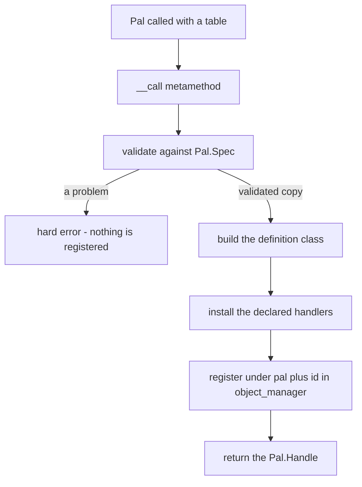
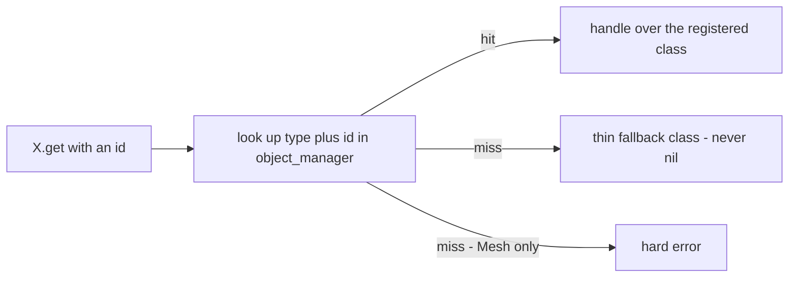
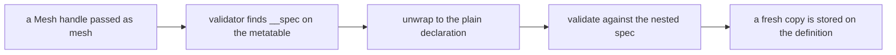

コンテンツパックが宣言するものはすべて、同じ 3 行の形を通ります。

```lua
local pal = Pal{ id = "example:Boss", name = "Boss" }  -- CALL the module to define
Pal.get("ChickenPal")                                  -- an existing one, by id
Pal.get_all()                                          -- every registered one
```

`Pal.define` はありません。モジュール自体がコンストラクタで、呼び出すと **定義** が登録され、
返ってくるのが **ハンドル** です。この 2 つの言葉が仕組みのすべてで、ドメインごとに変わるのは
細部だけです。

## 呼び出しの形

`Pal{ ... }` は PalForge が発明した特別な構文ではありません。Lua では呼び出しの引数がテーブル
コンストラクタひとつだけのとき丸括弧を省略できるので、次の 2 つはまったく同じ呼び出しです。

<Tabs items={['Sugared', 'Desugared']}>
<Tab value="Sugared">

```lua
local pal = Pal{
    id          = "ChickenPal",
    name        = "Chicken Pal",
    description = "the one that greets you",
}
```

</Tab>
<Tab value="Desugared">

```lua
local pal = Pal({
    id          = "ChickenPal",
    name        = "Chicken Pal",
    description = "the one that greets you",
})
```

</Tab>
</Tabs>

波括弧の中身がそのまま引数リストです。これが Lua でできる名前つき引数にもっとも近い形で、
値にはすべて名前がつき、順序は関係なく、あとからドメインにフィールドが追加されても、すでに
書いた項目の意味がずれることはありません。

同じ規則はテーブルをひとつ受け取る関数すべてに当てはまるので、名前つきコンストラクタも同じ
書き方になります。

```lua
Audio.bgm{ id = "AKE_BGM_Title" }     -- same as Audio.bgm({ id = "AKE_BGM_Title" })
Panel:new{ title = "Hello" }          -- same as Panel:new({ title = "Hello" })
```

モジュールを呼び出せるのは `__call` メタメソッドによるものです。

```lua
setmetatable(Pal, { __call = function(_, spec) return define(spec) end })
```

`define` は `api/pal.lua` 内のローカル関数です。パックからは届きません。だからモジュール
テーブルが唯一の入口になります。

<Callout type="info">
引数なしの `Pal()` は空の定義を作るショートカットではありません。spec が空テーブルになり、
`id` が欠けているためエラーになります。
</Callout>

## 定義とは何か

定義とは、そのドメインの基底クラスをメタテーブルに持つ素の Lua テーブルで、`core/object_manager`
に `(type, id)` の組で記録されたものです。

Pal の場合、`Pal{ ... }` は次のテーブルを組み立てます。

```lua
local cls = setmetatable({
    id           = spec.id,
    name         = spec.name or spec.id,
    description  = spec.description,
    skills       = spec.skills,
    meshSpec     = spec.mesh,
    materialSpec = spec.material,
    color        = spec.color,
    texture      = spec.texture,
    icon         = spec.icon,
    data         = spec.data,
}, Class)
cls.__index = cls
```

spec のフィールドのうち 2 つは名前が変わります。`mesh` は `cls.meshSpec` に、`material` は
`cls.materialSpec` になります。`Class:mesh()` と `Class:material()` がメソッドとして存在する
ためです。建築物の `state` が `cls.defaultState` になるのは、生きた建築物の `state` がその
インスタンス自身の永続テーブルであり、クラス側のデフォルトを同じ名前で置くわけにいかないから
です。これらの名前に出会うのは、クラスを直接のぞいたときだけです。

宣言したハンドラはそのクラスに取り付けられます。Pal、Item、Skill、Effect はフォワーダ越しに
取り付けるので、ハンドラはクラスではなく **ハンドル** を受け取ります。

```lua
for name, handler in pairs(spec.events or {}) do
    cls[name] = function(_, ...) return handler(handle, ...) end
end
```

建築物はハンドラを書いたまま取り付けます。建築物のハンドラの第 1 引数は定義ではなく、設置され
た生きたインスタンスだからです。

```lua
for name, handler in pairs(spec.events) do cls[name] = handler end
```

そのうえでクラスが登録されます。

```lua
pcall(function() om.register("pal", spec.id, cls) end)
```

注意点が 2 つあります。登録は `pcall` で包まれているので、レジストリ側の問題が定義呼び出しを
壊すことはありません。そしてキーは **あなたが書いたとおりの id** で、コロンも含みます。
`"example:Boss"` は `"example_Boss"` ではなく `"example:Boss"` として格納されます。

レジストリは直接読めます。

```lua
local om = require("palforge.core.object_manager")

om.get("pal", "ChickenPal")   -- the definition class, or nil
om.all("pal")                 -- { id -> cls }, a shallow copy you may not mutate into
om.TYPES                      -- audio, building, effect, item, mesh, pal, skill, ui
```

`om.all` はコピーを返すので、そこに書き込んでも何も変わりません。登録の取り消しはありません。

## ハンドルとは何か

ハンドルは、定義クラスを包むフィールド 2 つのラッパーです。

```lua
wrap = function(cls) return setmetatable({ id = cls.id, _cls = cls }, Handle) end
```

`id` が公開部分、`_cls` が実体の定義で、`Handle` メタテーブルがそのドメインのアクションと
クエリを持ちます。中身はそれだけです。ハンドルは軽く使い捨てで、`get` を呼ぶたびに新しいものが
作られます。

```lua
local a = Pal.get("ChickenPal")
local b = Pal.get("ChickenPal")

a == b        -- false: two different wrapper tables
a.id == b.id  -- true:  the same definition underneath
```

動詞はハンドル側にあります。`Pal.Handle:spawn`、`Item.Handle:give`、`Audio.Handle:play`、
`Effect.Handle:apply`、`Mesh.Handle:attachTo`、`UI.Handle:new` — どれも定義クラスには存在
せず、ハンドルにだけあります。

ハンドラがハンドルを受け取るのはそのためです。どんなイベントであれ、その同じオブジェクトへの
アクションがすでに手元にあります。

```lua
Pal{
    id = "ChickenPal",
    events = {
        onSpawned = function(pal, ctx)
            pal:renderOn(ctx.actor)          -- `pal` is this definition's handle
        end,
    },
}
```

<Callout type="info">
ハンドルが余分に持ち物を抱えるのは `UI` だけです。`wrap` は要素クラスをメタテーブルとする状態
テーブルも作って `_st` に持たせるので、ハンドルそのものがマウント可能になり、
`Handle:new{ ... }` は独自の状態を持つ独立したインスタンスを返します。
</Callout>

## 定義呼び出しの全体像



検証が最初に走り、完全に成功するか例外を投げるかのどちらかです。呼び出しが途中まで成功する
ことはないので、はねられた spec の定義が登録されたままになることもありません。バリデータは、
個々のフィールドを見る前にテーブル全体の未知のキーを調べ、その後は宣言順にフィールドをたどり、
新しいコピーへデフォルトを埋めていきます。渡したテーブルが変更されることはありません。

```text
PalForge: Pal: unknown field "meshSpec" (did you mean "mesh"?). Valid fields: id, name, description, skills, mesh, material, color, texture, icon, events, data
PalForge: Pal: field "id" is required (pal id: a game CharacterID ("ChickenPal") or "pack:name")
PalForge: Pal: field "name" expects string, got number
PalForge: Pal: field "skills[2]" expects string, got number
PalForge: Pal: field "mesh" (Mesh.Spec): field "model" is required (USkeletalMesh / UStaticMesh asset path)
PalForge: Item: field "category" must be one of { "material", "consumable", "equipment", "ammo", "ingredient", "other" }, got "consumeable"
```

形状の宣言そのものは各モジュールのプライベートです。ドメインは呼び出す対象であって、中を見て
回る名前空間ではありません。実行時に読みたいときはスキーマレジストリを通します。

```lua
local schema = require("palforge.core.schema")

print(schema.help("Pal.Spec"))        -- every field, type, default and meaning
schema.get("Pal.Spec").fields         -- the same, as a table, for tooling
schema.all()                          -- every declared spec, in declaration order
```

## 定義、get、get_all

定義を作るのは `X{ ... }` だけです。`get` と `get_all` は定義しません。

```lua
Item{ id = "Wood", name = "Wood", maxStack = 9999 }   -- defines and registers
Item.get("Wood")                                      -- looks it up
Item.get_all()                                        -- every registered item
```

`X.get(id)` は `id` が空でない文字列であることを assert してからレジストリを引きます。見つから
なかったときの挙動だけがドメインによって違います。



7 つのドメインは薄いフォールバックを作ります。id だけを持つ素のクラスをハンドルで包んだもの
です。これがあるおかげで、何も宣言せずにバニラのコンテンツを操作できます。

```lua
Item.get("Wood"):give(10)                              -- no Item{ id = "Wood" } needed
Pal.get("SheepBall"):spawn(Player.coordinate())
Audio.get("AKE_BGM_Title"):play()
```

薄いハンドルでも、id だけで済むことはすべてできます。`:spawn`、`:give`、`:take`、`:play` は
いずれも id を通り、アイコン DataTable を読むドメイン（pal、item、building、skill）では
`:iconOf()` も普段どおり解決します。できないのは宣言から来る部分です。`:mesh()` は `nil`、
`:renderOn(actor)` は `false`、`:name()` は id にフォールバックし、ハンドラは何も走りません。

`Audio.get` だけはフォールバックにもうひとつ `soundId = id` を持たせるので、どの AkAudioEvent
名でもそのまま再生できます。これは、音を指定しなかった定義に対して `Audio{ ... }` が適用するの
と同じフォールバックです。

`Mesh.get` は代わりにエラーになります。

```text
PalForge: Mesh.get("example:body"): no mesh is defined under that id
```

`model` のないメッシュには描くものがありません。薄いフォールバックを返すと黙って何も付かず、
見当違いの場所でバグを探すことになるので、取りこぼしはその場で投げます。

```lua
local log = require("palforge.utils.log").scope("mypack")

local ok, err = pcall(Mesh.get, "example:body")
if not ok then log.warn(err) end
```

`X.get_all()` は `om.all(type)` をたどり、見つけたクラスをすべて包みます。

```lua
local log = require("palforge.utils.log").scope("mypack")

for _, item in ipairs(Item.get_all()) do
    log.info(item.id .. " -> " .. item:name() .. " (" .. item:category() .. ")")
end
```

正直に書いておくべき点が 2 つあります。順序はスナップショットに対する `pairs` の走査なので
安定しません。順序が必要なら結果をソートしてください。そして列挙されるのは実際に定義された
ものだけです。ネイティブカタログは遅延読み込みなので、起動直後の `Item.get_all()` が返すのは
キュレーション済みの定義（`Wood`、`Berries`、`Arrow`）と自分のパックが宣言したものであって、
ゲームのアイテムテーブルの全行ではありません。

### 一度定義し、何度でも操作する

定義呼び出しは登録します。ハンドラはイベントのたびに走ります。ハンドラの中では `get` を使い、
定義は絶対に書かないでください。

```lua
Pal{
    id = "ChickenPal",
    events = {
        onDeath = function(pal, ctx)
            Audio.get("AKE_BGM_Title"):play()          -- a lookup, then a play
            -- Audio.bgm{ id = "AKE_BGM_Title" }:play()  -- re-declares on every death
        end,
    },
}
```

どちらの書き方でも音は鳴ります。ただし後者は、その Pal が死ぬたびに spec を検証し直し、
レジストリのエントリを上書きします。

## ID: 名前空間つきとリテラル

コロンを含む id はパック id で、形は `"packid:name"` です。ゲームの DataTable では対応する行の
FName が `packid_name` になります。PalSchema の行はグローバルなので、この接頭辞がパック同士の
衝突を防ぎます。

コロンのない id はリテラルなゲーム id です。`"Wood"`、`"ChickenPal"`、`"PalBoxV2"`、
`"WorkBench"`、`"AKE_BGM_Title"` などがそれにあたります。

```lua
local om = require("palforge.core.object_manager")

om.resolve("example:Bench")   -- "example_Bench"
om.resolve("PalBoxV2")        -- "PalBoxV2"
om.resolve("my pack:Bench")   -- nil, "invalid pack id 'my pack' (letters/digits/_ only)"
```

名前空間つき id の 2 つの区間は、いずれも英数字かアンダースコアでなければなりません。この
チェックが走るのは id を **解決** するときで、定義するときではありません。定義時に `id` に
かかるのは、空でない文字列かどうかだけです。

解決はゲームの行名が必要になる箇所で行われ、レジストリでは行われません。

- `Building.Handle:unlock()` はテクノロジー行をアンロックする前に id を解決します。
- `core/event` は設置されたアクターと突き合わせる前に建築物の `buildIds` を解決します。

レジストリのキーは書いたままの id です。これは検索するときに効いてきます。

```lua
Building{ id = "example:Bench" }

Building.get("example:Bench")   -- the definition
Building.get("example_Bench")   -- a thin fallback: nothing is registered under that key
```

<Callout type="warn">
名前空間つき id を定義すると、その id に振る舞いとメタデータが与えられます。新しい DataTable の
行が publish されるわけではありません。Lua だけではそれはできず、PalSchema の担当です。定義は
存在する id、つまりバニラの id か、パックが PalSchema 経由で同梱する行に向けてください。
</Callout>

## 定義を入れ子にする

メッシュは、それをまとう定義の中にインラインで書くことも、名前をつけて一度だけ宣言してそれ
自体を渡すこともできます。どちらも同じように `core/mesh` に届きます。

<Tabs items={['Inline', 'Named']}>
<Tab value="Inline">

```lua
Pal{
    id   = "ChickenPal",
    mesh = {
        kind      = "skeletal",
        model     = "/Game/Pal/Model/Character/Monster/ChickenPal/SK_ChickenPal.SK_ChickenPal",
        animClass = "/Game/Pal/Blueprint/Character/Monster/PalActorBP/ChickenPal/ABP_ChickenPal.ABP_ChickenPal_C",
    },
}
```

</Tab>
<Tab value="Named">

```lua
local ChickenBody = Mesh{
    id        = "example:ChickenBody",
    kind      = "skeletal",
    model     = "/Game/Pal/Model/Character/Monster/ChickenPal/SK_ChickenPal.SK_ChickenPal",
    animClass = "/Game/Pal/Blueprint/Character/Monster/PalActorBP/ChickenPal/ABP_ChickenPal.ABP_ChickenPal_C",
}

Pal{ id = "ChickenPal", mesh = ChickenBody }
Pal{ id = "SheepBall",  mesh = Mesh.get("example:ChickenBody") }
```

</Tab>
</Tabs>

名前つきの形が動くのは、`Mesh.Handle` のメタテーブルが `__spec` メタフィールドを持っている
からです。

```lua
Handle.__spec = function(self) return self._cls:source() end
```

バリデータはこのメタフィールドを探し、見つかったらハンドルではなく、そこから返ってきた
テーブルを検証します。



覚えておく価値のある帰結が 2 つあります。

1 つめ。コピーは本物です。`Pal.Handle:mesh()` が返すのは Pal の定義に格納されたコピーであって
メッシュ定義そのものではないので、書き換えても宣言した `Mesh` には届きません。

```lua
local body = Mesh{ id = "example:Body", model = "/Game/.../SK_X.SK_X", scale = 1.0 }
local pal  = Pal{ id = "example:Boss", mesh = body }

pal:mesh().scale = 4.0
body:source().scale     -- still 1.0
```

2 つめ。`__spec` を持つのは `Mesh.Handle` だけです。定義済みオブジェクトを別の定義に入れ子で
渡せるのは、いまのところメッシュだけで、`Item.Handle` や `Skill.Handle` をテーブルの位置に渡す
仕組みはありません。

<Callout type="warn">
`Building.Spec.Mesh` は `Mesh.Spec` の `kind` のデフォルトを `"skeletal"` から `"static"` に
差し替えたものです。デフォルトは値がないフィールドにしか効かず、名前つきの `Mesh{ ... }` は
定義された時点で自分のデフォルトを埋め終えています。そのため建築物に入れ子にしたメッシュ
ハンドルは `kind = "skeletal"` を持ったまま届き、建築物側の `"static"` は発動しません。建築物が
まとうメッシュには `kind` を明示してください。
</Callout>

```lua
local BenchBody = Mesh{
    id    = "example:BenchBody",
    kind  = "static",   -- explicit: this mesh is worn by a building
    model = "/Game/Pal/Model/Prop/Architecture/WorkBenchPrimitive/SM_WorkBenchPrimitive.SM_WorkBenchPrimitive",
}

Building{ id = "WorkBench", name = "Workbench", gridCm = 100, mesh = BenchBody }
```

## 同じ ID を再定義する

`om.register` はバケットへ直接書き込むので、同じ `(type, id)` を 2 回定義するとエントリが置き
換わります。警告は出ず、登録の取り消しもありません。

```lua
local first  = Item{ id = "Wood", name = "Wood" }
local second = Item{ id = "Wood", name = "Seasoned Wood" }

first:name()              -- "Wood"          (the first class, still held by that handle)
second:name()             -- "Seasoned Wood"
Item.get("Wood"):name()   -- "Seasoned Wood" (the registry holds the second)
```

ここから導かれることは次のとおりです。

- `X.get`、`X.get_all`、そしてイベントのディスパッチはすべてレジストリを経由するので、最新の
  定義を見ます。
- 先に作られたハンドルは自分の `_cls` を持ち続けます。そのクエリと手動の `:onXxx` フォワーダは
  古い宣言を走らせます。id しか使わないアクション（`:spawn`、`:give`、`:play`）はどちらでも
  同じ動きになります。`self.id` しか参照しないからです。
- 建築物では、`core/event` がクラスごとに下ろした def をキャッシュし、クラスが変わっていれば次の
  スキャンで作り直します。すでに追跡されている構造物は生成時のクラスを保ったままで、新しい定義
  はそれ以降に作られるインスタンスに効きます。

確実なやり方は、各 id をロード時に一度だけ定義し、それ以外の場所では `X.get` を使うことです。
開発中にパックのファイルをホットリロードするなら、レジストリが保持するのは最後に読み込んだ版
であり、ローカル変数に取っておいた古いハンドルは古いままだと考えてください。

## X.Class

呼び出せるモジュールはすべて `X.Class` を公開しています。そのドメインの定義がメタテーブル
として受け取る基底クラスです。中身は、何もしないフックのデフォルトと、そのドメイン固有のメソッドです。
`Pal.Class:mesh`、`Pal.Class:material`、`Pal.Class:iconOf`、`Building.Class:render`、
`Building.Class:update`、`Building.Class.new`、`Mesh.Class:source`、`Audio.Class:source`、
`UI.Class:mount` などが該当します。

ほとんどのパックはここに触れません。触るのは次の 2 つの場面です。

**オーバーライドの検出。** `core/event` は、建築物がフックを宣言したかどうかをクラスと基底
クラスの比較で判断します。

```lua
local BuildingBase = require("palforge.api.building").Class

local function overrides(cls, name)
    return cls[name] ~= nil and cls[name] ~= BuildingBase[name]
end
```

`onTick` を宣言しなかった定義は何もしないデフォルトを継承し、比較が一致するので tick のリスト
から完全に外れます。裏を返すと、空のハンドラはただではありません。

```lua
Building{
    id     = "example:Bench",
    events = {
        onTick = function(self, ctx) end,   -- differs from the base: this instance ticks
    },
}
```

**複数の定義で振る舞いを共有する。** メソッドはメタテーブルの連鎖で解決されます。生きた建築物
インスタンスは自分の定義クラスへ、定義クラスは `Building.Class` へとたどるので、そこに足した
メソッドはすべての定義とすべてのインスタンスから見えます。足す前に作られたものからも見えます。

```lua
function Building.Class:describe()
    return (self.name or self.id) .. " at " .. tostring(self.key)
end
```

定義ごとの値をここに置いてはいけません。`Mesh` を除くどのドメインも宣言している `data`
フィールドを使ってください。中身はそのまま定義へ運ばれます。扱いが違うのは `UI` だけで、
`data` のキーは要素クラスへ展開され、すべてのインスタンスが受け継ぐデフォルトになります。

```lua
local Boss = Pal{
    id   = "ChickenPal",
    data = { tier = 3, drops = { "Wood", "Berries" } },
}
```

## ドメイン一覧

| ドメイン | `X{ ... }` の戻り値 | 未登録のときの `X.get(id)` | ハンドラの `self` | define / get / get_all 以外 |
| --- | --- | --- | --- | --- |
| `Pal` | `Pal.Handle` | `{ id = id }` の薄いハンドル | この定義のハンドル | `Pal.Class` |
| `Item` | `Item.Handle` | `{ id = id }` の薄いハンドル | この定義のハンドル | `Item.Class` |
| `Building` | `Building.Handle` | `{ id = id }` の薄いハンドル | 設置された生きたインスタンス | `Building.Class` |
| `Skill` | `Skill.Handle` | `{ id = id }` の薄いハンドル | この定義のハンドル | `Skill.Class` |
| `Effect` | `Effect.Handle` | `{ id = id }` の薄いハンドル | この定義のハンドル | `Effect.activeOn`, `Effect.Class` |
| `Audio` | `Audio.Handle` | `{ id = id, soundId = id }` の薄いハンドル | このドメインにイベントはなし | `Audio.bgm`, `Audio.se`, `Audio.Class` |
| `Mesh` | `Mesh.Handle` | エラー | このドメインにイベントはなし | `Mesh.Class` |
| `UI` | `UI.Handle`、それ自体マウント可能 | 薄く何もしない要素 | マウントされたインスタンス | `UI.Class`, `Handle:new` |
| `Player` | 呼び出し不可 | `get` なし | このドメインにイベントはなし | `character`, `coordinate`, `coordinateOffset` |

`Mesh` は、定義で省略できるものも他のドメインと違います。`id` を省略できる形状は `Mesh.Spec`
だけです。インラインのメッシュには名前をつける対象がないからです。ただし直接定義する場合は
やはり必須です。

```text
PalForge: Mesh: field "id" is required (an unnamed mesh cannot be looked up again - write it inline as mesh = { ... } instead)
```

`Audio.bgm` と `Audio.se` は `kind` を固定しただけの同じ定義です。渡したテーブルは変更されず
コピーされ、矛盾する `kind` は上書きではなく拒否されます。

```lua
Audio.bgm{ id = "AKE_BGM_Title" }            -- kind = "bgm"
Audio.se{ id = "AKE_Build_PalBox" }          -- kind = "se"
Audio.bgm{ id = "AKE_Cheer", kind = "se" }   -- error: kind is fixed to "bgm" here
```

## レシピ

### メッシュからスポーンまでのパックファイル

```lua title="Scripts/mypack/content.lua"
require("palforge.api")   -- installs Pal / Item / Mesh / Audio / Player as mod-local globals

local log = require("palforge.utils.log").scope("mypack")

-- 1. one named mesh, reusable by id
local BossBody = Mesh{
    id        = "mypack:BossBody",
    kind      = "skeletal",
    model     = "/Game/Pal/Model/Character/Monster/ChickenPal/SK_ChickenPal.SK_ChickenPal",
    animClass = "/Game/Pal/Blueprint/Character/Monster/PalActorBP/ChickenPal/ABP_ChickenPal.ABP_ChickenPal_C",
    scale     = 2.0,
    color     = { r = 1.0, g = 0.4, b = 0.2, a = 1.0 },
}

-- 2. a definition that wears it
local Boss = Pal{
    id          = "ChickenPal",
    name        = "Scorched Chicken",
    description = "A chicken that has seen things.",
    mesh        = BossBody,
    data        = { tier = 3 },
    events = {
        onSpawned = function(pal, ctx)
            pal:renderOn(ctx.actor)
            Audio.get("AKE_BGM_Title"):play()
        end,
        onDeath = function(pal, ctx)
            Item.get("Wood"):give(5)
            log.info(pal:name() .. " dropped its wood")
        end,
    },
}

-- 3. act on it through the handle the define returned
Boss:spawn(Player.coordinateOffset(300, 0, 0))
```

### 同じ名前つきメッシュの書き方を使う建築物

```lua title="Scripts/mypack/bench.lua"
require("palforge.api")

local BenchBody = Mesh{
    id    = "mypack:BenchBody",
    kind  = "static",
    model = "/Game/Pal/Model/Prop/Architecture/WorkBenchPrimitive/SM_WorkBenchPrimitive.SM_WorkBenchPrimitive",
}

local Bench = Building{
    id           = "WorkBench",
    name         = "Workbench",
    gridCm       = 100,
    tickInterval = 4,
    mesh         = BenchBody,
    state        = { uses = 0 },
    events = {
        onPlace = function(self, ctx)
            self.state.uses = 0
            self:save()
        end,
        onRightClick = function(self, ctx)
            self.state.uses = self.state.uses + 1
            self:save()
        end,
    },
}

Bench:unlock()                                  -- resolves the id, unlocks the tech row
local placed = #Bench:instances()               -- how many are live in the loaded world
```

建築物のハンドラは `self` として生きたインスタンスを受け取ります。`self.state` と `self:save()`
があるのはそのためです。どのフックが何に駆動されるかは
[ライフサイクルのページ](/docs/concepts/lifecycle) を参照してください。

### 登録済みの内容を調べる

```lua title="a console-driven dump"
local om     = require("palforge.core.object_manager")
local schema = require("palforge.core.schema")
local log    = require("palforge.utils.log").scope("mypack")

-- what a call accepts
log.info(schema.help("Pal.Spec"))
log.info(schema.help("Mesh.Spec"))

-- what exists right now, per object type
for _, otype in ipairs(om.TYPES) do
    local ids = {}
    for id in pairs(om.all(otype)) do ids[#ids + 1] = id end
    table.sort(ids)
    log.info(otype .. " (" .. #ids .. "): " .. table.concat(ids, ", "))
end
```

### 自分のものとは限らないコンテンツに安全に定義する

```lua
local function meshOrNil(id)
    local ok, handle = pcall(Mesh.get, id)
    return ok and handle or nil
end

Pal{
    id   = "example:Boss",
    mesh = meshOrNil("otherpack:BossBody") or {
        model = "/Game/Pal/Model/Character/Monster/ChickenPal/SK_ChickenPal.SK_ChickenPal",
    },
}
```

例外を投げる検索は `Mesh.get` だけなので、`pcall` を巻く価値があるのもそこだけです。ほかの
`get` は何があってもハンドルを返します。

## 次に読むもの

<Cards>
  <Card title="Pal" href="/docs/api/pal">Pal 定義の全フィールドと、ハンドルでできること</Card>
  <Card title="Mesh" href="/docs/api/mesh">別の定義に入れ子にできる唯一の定義</Card>
  <Card title="Building" href="/docs/api/building">ハンドラが生きたインスタンスを受け取るドメイン</Card>
  <Card title="Lifecycle" href="/docs/concepts/lifecycle">実際に発火するフックと、それを駆動しているもの</Card>
</Cards>
