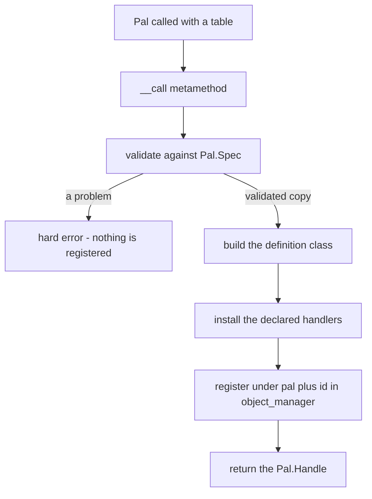
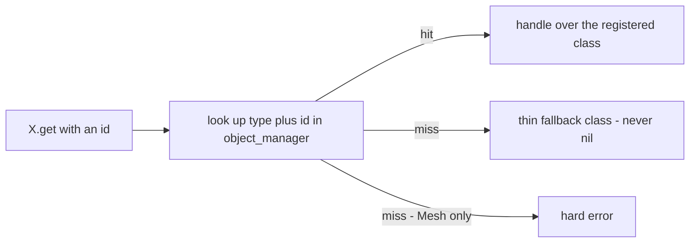
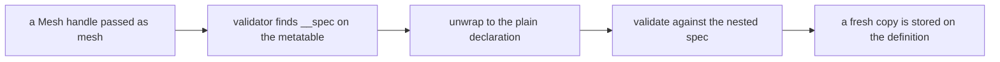

## What you can do after this page

- Add your own pal, item, building, sound or mesh to the game
- Give something already in Palworld new behaviour, without declaring a thing
- Find anything you made earlier from anywhere else in your pack
- Pick names that will not clash with another player's mods
- Read the message PalForge prints when a field is wrong, and fix it

## Making something

You make content by calling the module for that kind of thing with a table of
settings. Every kind works the same way:

```lua
local pal = Pal{ id = "example:Boss", name = "Boss" }  -- CALL the module to define
Pal.get("ChickenPal")                                  -- an existing one, by id
Pal.get_all()                                          -- every registered one
```

The call writes your settings down as a **definition** and hands back a **handle**: an
object you can act on. `Item`, `Building`, `Skill`, `Effect`, `Audio`, `Mesh` and `UI`
are called the same way. Only the fields differ.

`Pal{ ... }` is Lua shorthand. When a call's only argument is a table, you may leave the
parentheses out, so the two forms below are the same call:

<Tabs items={['Sugared', 'Desugared']}>
<Tab value="Sugared">

```lua
local pal = Pal{
    id          = "ChickenPal",
    name        = "Chicken Pal",
    description = "the one that greets you",
}
```

</Tab>
<Tab value="Desugared">

```lua
local pal = Pal({
    id          = "ChickenPal",
    name        = "Chicken Pal",
    description = "the one that greets you",
})
```

</Tab>
</Tabs>

The braces are the argument list. Every value carries a name, so the order does not
matter, and a field added to a domain later can never shift the meaning of the ones you
already wrote.

The same shorthand works for any function that takes one table, so the named
constructors read the same way:

```lua
Audio.bgm{ id = "AKE_BGM_Title" }     -- same as Audio.bgm({ id = "AKE_BGM_Title" })
Panel:new{ title = "Hello" }          -- same as Panel:new({ title = "Hello" })
```

A module can be called because its table carries a `__call` metamethod, Lua's hook for
"somebody called this table":

```lua
setmetatable(Pal, { __call = function(_, spec) return define(spec) end })
```

`define` is a local function inside `api/pal.lua`, so calling the module is how you
reach it.

<Callout type="info">
`Pal()` with no argument is not a shortcut for an empty definition. The spec becomes an
empty table, `id` is missing, and the call errors.
</Callout>

## What you get back

The handle is the object you act through. Everything you want to *do* to a pal lives
there:

```lua
local boss = Pal{ id = "ChickenPal", name = "Scorched Chicken" }

boss:spawn(Player.coordinate())   -- put one in the world
boss:name()                       -- "Scorched Chicken"
boss.id                           -- "ChickenPal"
```

`Pal.Handle:spawn`, `Item.Handle:give`, `Audio.Handle:play`, `Effect.Handle:apply`,
`Mesh.Handle:attachTo` and `UI.Handle:new` are all methods on a handle.

Inside, a handle is a two-field wrapper around the definition it stands for:

```lua
wrap = function(cls) return setmetatable({ id = cls.id, _cls = cls }, Handle) end
```

`id` is public, `_cls` is the definition, and the `Handle` metatable carries that
domain's actions and queries. Handles are cheap and disposable — every `get` call builds
a fresh one:

```lua
local a = Pal.get("ChickenPal")
local b = Pal.get("ChickenPal")

a == b        -- false: two different wrapper tables
a.id == b.id  -- true:  the same definition underneath
```

Your event handlers are called with that same handle as the first argument, so whatever
just happened, the actions for that object are already in your hand:

```lua
Pal{
    id = "ChickenPal",
    events = {
        onSpawned = function(pal, ctx)
            pal:renderOn(ctx.actor)          -- `pal` is this definition's handle
        end,
    },
}
```

<Callout type="info">
A `UI` handle carries one thing more. `wrap` also builds a state table with the element
class as its metatable and stores it in `_st`, so the handle is itself mountable, and
`Handle:new{ ... }` produces an independent instance with its own state.
</Callout>

## What gets stored

The definition is a plain Lua table holding what you passed, with the domain's base
class as its metatable, recorded in `core/object_manager` under the pair `(type, id)`.

For a pal, `Pal{ ... }` builds this:

```lua
local cls = setmetatable({
    id           = spec.id,
    name         = spec.name or spec.id,
    description  = spec.description,
    skills       = spec.skills,
    meshSpec     = spec.mesh,
    materialSpec = spec.material,
    color        = spec.color,
    texture      = spec.texture,
    icon         = spec.icon,
    data         = spec.data,
}, Class)
cls.__index = cls
```

Two fields are stored under a different name. `mesh` becomes `cls.meshSpec` and
`material` becomes `cls.materialSpec`, because `Class:mesh()` and `Class:material()` are
methods and would collide. A building's `state` field lands as `cls.defaultState`,
because on a live building `state` is that one building's own saved table. You only meet
those names if you inspect a class directly.

The handlers you declared are installed onto that class. Pals, items, skills and effects
install each one behind a small forwarder, which is what makes the handler receive the
**handle** rather than the class:

```lua
for name, handler in pairs(spec.events or {}) do
    cls[name] = function(_, ...) return handler(handle, ...) end
end
```

Buildings install handlers exactly as written, because a building handler's first
argument is the live placed building, not the definition:

```lua
for name, handler in pairs(spec.events) do cls[name] = handler end
```

Then the class is registered:

```lua
pcall(function() om.register("pal", spec.id, cls) end)
```

Two things follow. Registration runs inside a `pcall`, so a registry problem can never
break your definition call. And the key is the id **exactly as you wrote it**, colon
included — `"example:Boss"` is stored under `"example:Boss"`, not under `"example_Boss"`.

You can read the registry directly:

```lua
local om = require("palforge.core.object_manager")

om.get("pal", "ChickenPal")   -- the definition class, or nil
om.all("pal")                 -- { id -> cls }, a shallow copy you may not mutate into
om.TYPES                      -- audio, building, effect, item, mesh, pal, skill, ui
```

`om.all` hands back a copy, so writing into it changes nothing. Once an id is registered
it stays registered; to change it, define it again.

## One call, end to end



Checking comes first, and it either passes completely or raises. A call never
half-succeeds, so you can never end up with a definition registered under settings that
were rejected. The checker looks for unknown keys across the whole table before it
inspects any single field, then walks the declared fields in order, filling defaults into
a fresh copy. Your table is never changed.

Every problem is a hard error naming the domain and the field, so you can usually fix it
from the message alone:

```text
PalForge: Pal: unknown field "meshSpec" (did you mean "mesh"?). Valid fields: id, name, description, skills, mesh, material, color, texture, icon, events, data
PalForge: Pal: field "id" is required (pal id: a game CharacterID ("ChickenPal") or "pack:name")
PalForge: Pal: field "name" expects string, got number
PalForge: Pal: field "skills[2]" expects string, got number
PalForge: Pal: field "mesh" (Mesh.Spec): field "model" is required (USkeletalMesh / UStaticMesh asset path)
PalForge: Item: field "category" must be one of { "material", "consumable", "equipment", "ammo", "ingredient", "other" }, got "consumeable"
```

To see what a call accepts before you write it, ask the schema registry — the runtime
list of every declared shape:

```lua
local schema = require("palforge.core.schema")

print(schema.help("Pal.Spec"))        -- every field, type, default and meaning
schema.get("Pal.Spec").fields         -- the same, as a table, for tooling
schema.all()                          -- every declared spec, in declaration order
```

## Finding something again

`X{ ... }` is the only thing that creates a definition. `get` and `get_all` only look
things up:

```lua
Item{ id = "Wood", name = "Wood", maxStack = 9999 }   -- defines and registers
Item.get("Wood")                                      -- looks it up
Item.get_all()                                        -- every registered item
```

`X.get(id)` asserts that `id` is a non-empty string, then looks in the registry. What
happens when nothing is registered under that id is the one place the domains differ:



Seven domains build a thin fallback: a bare class carrying only the id, wrapped in a
handle. That is what lets you act on the game's own content without declaring anything:

```lua
Item.get("Wood"):give(10)                              -- no Item{ id = "Wood" } needed
Pal.get("SheepBall"):spawn(Player.coordinate())
Audio.get("AKE_BGM_Title"):play()
```

A thin handle still does everything that only needs the id. `:spawn`, `:give`, `:take`
and `:play` all go through the id, and in the domains that read an icon DataTable — the
game's table of item and creature icons — `:iconOf()` resolves from it as usual. That
covers pal, item, building and skill.
What a thin handle cannot do is anything that came from a declaration: `:mesh()` is
`nil`, `:renderOn(actor)` returns `false`, `:name()` falls back to the id, and no handler
runs.

`Audio.get` is the one thin fallback with a second field, `soundId = id`, so any
AkAudioEvent name — the game's own name for a sound — is playable straight away. The
same fallback `Audio{ ... }` applies to a definition that names no sound.

`Mesh.get` raises instead:

```text
PalForge: Mesh.get("example:body"): no mesh is defined under that id
```

A mesh with no `model` has nothing to render, so a missing mesh id fails where you wrote
it rather than quietly attaching nothing somewhere else.

```lua
local log = require("palforge.utils.log").scope("mypack")

local ok, err = pcall(Mesh.get, "example:body")
if not ok then log.warn(err) end
```

`X.get_all()` walks `om.all(type)` and wraps every class it finds:

```lua
local log = require("palforge.utils.log").scope("mypack")

for _, item in ipairs(Item.get_all()) do
    log.info(item.id .. " -> " .. item:name() .. " (" .. item:category() .. ")")
end
```

Two things to expect from it. The order is a `pairs` walk over a snapshot, so it is not
stable — sort the result if you need one. And it lists only what has actually been
defined: the native catalogs load on demand, so right after startup `Item.get_all()`
gives you the curated definitions (`Wood`, `Berries`, `Arrow`) plus whatever your pack
declared, not every row in the game's item table.

### Define once, act many times

A definition call registers. A handler runs on every event. Reach for `get` inside a
handler, never for a define:

```lua
Pal{
    id = "ChickenPal",
    events = {
        onDeath = function(pal, ctx)
            Audio.get("AKE_BGM_Title"):play()          -- a lookup, then a play
            -- Audio.bgm{ id = "AKE_BGM_Title" }:play()  -- re-declares on every death
        end,
    },
}
```

Both spellings play the sound. The second one also re-checks a spec and overwrites the
registry entry every single time the pal dies.

## Ids: your own, and the game's

An id with a colon is a pack id: `"packid:name"`. In the game's DataTables the matching
row FName is `packid_name`. PalSchema rows are shared across every mod, so that prefix is
what keeps two packs from colliding.

An id without a colon is a literal game id: `"Wood"`, `"ChickenPal"`, `"PalBoxV2"`,
`"WorkBench"`, `"AKE_BGM_Title"`.

```lua
local om = require("palforge.core.object_manager")

om.resolve("example:Bench")   -- "example_Bench"
om.resolve("PalBoxV2")        -- "PalBoxV2"
om.resolve("my pack:Bench")   -- nil, "invalid pack id 'my pack' (letters/digits/_ only)"
```

Both halves of a namespaced id must be letters, digits or underscores. That check runs
when the id is **resolved**, not when you define it — at define time `id` is only checked
for being a non-empty string.

Resolving happens where a game row name is needed, not in the registry:

- `Building.Handle:unlock()` resolves the id before unlocking the technology row.
- `core/event` resolves a building's `buildIds` before matching placed actors against them.

The registry key stays the id as written, which matters when you look one up:

```lua
Building{ id = "example:Bench" }

Building.get("example:Bench")   -- the definition
Building.get("example_Bench")   -- a thin fallback: nothing is registered under that key
```

<Callout type="warn">
Defining a namespaced id gives that id behaviour and metadata. It does not add a new
DataTable row to the game — Lua alone cannot do that, which is PalSchema's job. Point a
definition at an id that already exists, whether that is a vanilla one or a row your pack
ships through PalSchema.
</Callout>

## Nesting a mesh inside another definition

A mesh is the model something wears. You can write it inline inside the definition that
wears it, or declare it once by name and pass it in as itself. Both reach `core/mesh`
the same way.

<Tabs items={['Inline', 'Named']}>
<Tab value="Inline">

```lua
Pal{
    id   = "ChickenPal",
    mesh = {
        kind      = "skeletal",
        model     = "/Game/Pal/Model/Character/Monster/ChickenPal/SK_ChickenPal.SK_ChickenPal",
        animClass = "/Game/Pal/Blueprint/Character/Monster/PalActorBP/ChickenPal/ABP_ChickenPal.ABP_ChickenPal_C",
    },
}
```

</Tab>
<Tab value="Named">

```lua
local ChickenBody = Mesh{
    id        = "example:ChickenBody",
    kind      = "skeletal",
    model     = "/Game/Pal/Model/Character/Monster/ChickenPal/SK_ChickenPal.SK_ChickenPal",
    animClass = "/Game/Pal/Blueprint/Character/Monster/PalActorBP/ChickenPal/ABP_ChickenPal.ABP_ChickenPal_C",
}

Pal{ id = "ChickenPal", mesh = ChickenBody }
Pal{ id = "SheepBall",  mesh = Mesh.get("example:ChickenBody") }
```

</Tab>
</Tabs>

The named form works because `Mesh.Handle`'s metatable carries a `__spec` metafield:

```lua
Handle.__spec = function(self) return self._cls:source() end
```

The checker looks for that metafield and, when it finds one, checks the table it returns
instead of the handle:



Two consequences worth knowing.

First, the copy is real. `Pal.Handle:mesh()` returns the copy stored on the pal
definition, not the mesh definition itself, so changing it does not reach back into the
`Mesh` you declared.

```lua
local body = Mesh{ id = "example:Body", model = "/Game/.../SK_X.SK_X", scale = 1.0 }
local pal  = Pal{ id = "example:Boss", mesh = body }

pal:mesh().scale = 4.0
body:source().scale     -- still 1.0
```

Second, `Mesh.Handle` is the only handle that carries `__spec`. A mesh is the one defined
object you can nest inside another definition today. Where any other domain's shape is
expected, pass a plain table.

<Callout type="warn">
`Building.Spec.Mesh` is `Mesh.Spec` with `kind` defaulting to `"static"` instead of
`"skeletal"`. A default only applies to a field you left out, and a named `Mesh{ ... }`
already had its own default filled in when it was defined. So a mesh handle nested into a
building arrives carrying `kind = "skeletal"`, and the building's `"static"` default
never fires. Set `kind` explicitly on any mesh a building will wear.
</Callout>

```lua
local BenchBody = Mesh{
    id    = "example:BenchBody",
    kind  = "static",   -- explicit: this mesh is worn by a building
    model = "/Game/Pal/Model/Prop/Architecture/WorkBenchPrimitive/SM_WorkBenchPrimitive.SM_WorkBenchPrimitive",
}

Building{ id = "WorkBench", name = "Workbench", gridCm = 100, mesh = BenchBody }
```

## Defining the same id twice

`om.register` writes straight into the bucket, so defining the same `(type, id)` twice
replaces the entry. Nothing warns you, and a registration cannot be taken back.

```lua
local first  = Item{ id = "Wood", name = "Wood" }
local second = Item{ id = "Wood", name = "Seasoned Wood" }

first:name()              -- "Wood"          (the first class, still held by that handle)
second:name()             -- "Seasoned Wood"
Item.get("Wood"):name()   -- "Seasoned Wood" (the registry holds the second)
```

What follows from that:

- `X.get`, `X.get_all` and event dispatch all go through the registry, so they see the
  newest definition.
- A handle from an earlier call keeps its own `_cls`. Its queries and its manual `:onXxx`
  forwarders still run the earlier declaration. Its id-only actions (`:spawn`, `:give`,
  `:play`) behave the same either way, because they only ever use `self.id`.
- For buildings, `core/event` caches a lowered def per class and rebuilds it on the next
  scan when the class changed. A structure that is already tracked keeps the class it was
  created with; the new definition applies to buildings placed afterwards.

The reliable pattern is to define each id once, at load, and use `X.get` everywhere else.
If you are hot-reloading a pack file while you work, expect the registry to hold the last
version loaded, and expect old handles you kept in locals to be stale.

## X.Class

Every callable module exposes `X.Class`: the base class every definition of that domain
gets as its metatable. It holds the do-nothing hook defaults plus the domain's own
methods — `Pal.Class:mesh`, `Pal.Class:material`, `Pal.Class:iconOf`,
`Building.Class:render`, `Building.Class:update`, `Building.Class.new`,
`Mesh.Class:source`, `Audio.Class:source`, `UI.Class:mount`, and so on.

Most packs never touch it. Two situations where you do.

**Override detection.** `core/event` decides whether a building declared a hook by
comparing the class against the base:

```lua
local BuildingBase = require("palforge.api.building").Class

local function overrides(cls, name)
    return cls[name] ~= nil and cls[name] ~= BuildingBase[name]
end
```

A definition that never declared `onTick` inherits the do-nothing default, compares equal,
and is left out of the tick list entirely. The flip side is that an empty handler is not
free:

```lua
Building{
    id     = "example:Bench",
    events = {
        onTick = function(self, ctx) end,   -- differs from the base: this instance ticks
    },
}
```

**Sharing behaviour across definitions.** Methods resolve through the metatable chain —
a live building falls back to its definition class, which falls back to `Building.Class`
— so a method added there is visible to every definition and every live building,
including ones created before you added it.

```lua
function Building.Class:describe()
    return (self.name or self.id) .. " at " .. tostring(self.key)
end
```

Per-definition values do not belong there. Use the `data` field, which every domain but
`Mesh` declares and carries onto the definition untouched. `UI` treats it differently:
its `data` keys are spread onto the element class as defaults every instance inherits.

```lua
local Boss = Pal{
    id   = "ChickenPal",
    data = { tier = 3, drops = { "Wood", "Berries" } },
}
```

## Every domain at a glance

| Domain | `X{ ... }` returns | `X.get(id)` with nothing registered | Handler `self` | Beyond define / get / get_all |
| --- | --- | --- | --- | --- |
| `Pal` | `Pal.Handle` | thin handle over `{ id = id }` | this definition's handle | `Pal.Class` |
| `Item` | `Item.Handle` | thin handle over `{ id = id }` | this definition's handle | `Item.Class` |
| `Building` | `Building.Handle` | thin handle over `{ id = id }` | the live placed instance | `Building.Class` |
| `Skill` | `Skill.Handle` | thin handle over `{ id = id }` | this definition's handle | `Skill.Class` |
| `Effect` | `Effect.Handle` | thin handle over `{ id = id }` | this definition's handle | `Effect.activeOn`, `Effect.Class` |
| `Audio` | `Audio.Handle` | thin handle over `{ id = id, soundId = id }` | no events in this domain | `Audio.bgm`, `Audio.se`, `Audio.Class` |
| `Mesh` | `Mesh.Handle` | hard error | no events in this domain | `Mesh.Class` |
| `UI` | `UI.Handle`, itself mountable | thin, inert element | the mounted instance | `UI.Class`, `Handle:new` |
| `Player` | not callable | no `get` | no events in this domain | `character`, `coordinate`, `coordinateOffset` |

`Mesh` also differs in what a definition may leave out. `Mesh.Spec` is the one shape
whose `id` is optional, because an inline mesh has nothing to name — but defining one
directly still requires it:

```text
PalForge: Mesh: field "id" is required (an unnamed mesh cannot be looked up again - write it inline as mesh = { ... } instead)
```

`Audio.bgm` and `Audio.se` are the same define with `kind` pinned. They copy your table
rather than changing it, and a contradicting `kind` is rejected instead of overwritten:

```lua
Audio.bgm{ id = "AKE_BGM_Title" }            -- kind = "bgm"
Audio.se{ id = "AKE_Build_PalBox" }          -- kind = "se"
Audio.bgm{ id = "AKE_Cheer", kind = "se" }   -- error: kind is fixed to "bgm" here
```

## Recipes

### A pack file, from mesh to spawn

```lua title="Scripts/mypack/content.lua"
require("palforge.api")   -- installs Pal / Item / Mesh / Audio / Player as mod-local globals

local log = require("palforge.utils.log").scope("mypack")

-- 1. one named mesh, reusable by id
local BossBody = Mesh{
    id        = "mypack:BossBody",
    kind      = "skeletal",
    model     = "/Game/Pal/Model/Character/Monster/ChickenPal/SK_ChickenPal.SK_ChickenPal",
    animClass = "/Game/Pal/Blueprint/Character/Monster/PalActorBP/ChickenPal/ABP_ChickenPal.ABP_ChickenPal_C",
    scale     = 2.0,
    color     = { r = 1.0, g = 0.4, b = 0.2, a = 1.0 },
}

-- 2. a definition that wears it
local Boss = Pal{
    id          = "ChickenPal",
    name        = "Scorched Chicken",
    description = "A chicken that has seen things.",
    mesh        = BossBody,
    data        = { tier = 3 },
    events = {
        onSpawned = function(pal, ctx)
            pal:renderOn(ctx.actor)
            Audio.get("AKE_BGM_Title"):play()
        end,
        onDeath = function(pal, ctx)
            Item.get("Wood"):give(5)
            log.info(pal:name() .. " dropped its wood")
        end,
    },
}

-- 3. act on it through the handle the define returned
Boss:spawn(Player.coordinateOffset(300, 0, 0))
```

### A building that reuses the same named mesh style

```lua title="Scripts/mypack/bench.lua"
require("palforge.api")

local BenchBody = Mesh{
    id    = "mypack:BenchBody",
    kind  = "static",
    model = "/Game/Pal/Model/Prop/Architecture/WorkBenchPrimitive/SM_WorkBenchPrimitive.SM_WorkBenchPrimitive",
}

local Bench = Building{
    id           = "WorkBench",
    name         = "Workbench",
    gridCm       = 100,
    tickInterval = 4,
    mesh         = BenchBody,
    state        = { uses = 0 },
    events = {
        onPlace = function(self, ctx)
            self.state.uses = 0
            self:save()
        end,
        onRightClick = function(self, ctx)
            self.state.uses = self.state.uses + 1
            self:save()
        end,
    },
}

Bench:unlock()                                  -- resolves the id, unlocks the tech row
local placed = #Bench:instances()               -- how many are live in the loaded world
```

A building handler takes `self` as the live placed building, which is why `self.state`
and `self:save()` are there. See [the lifecycle page](/docs/concepts/lifecycle) for what
drives each hook.

### Inspecting what is registered

```lua title="a console-driven dump"
local om     = require("palforge.core.object_manager")
local schema = require("palforge.core.schema")
local log    = require("palforge.utils.log").scope("mypack")

-- what a call accepts
log.info(schema.help("Pal.Spec"))
log.info(schema.help("Mesh.Spec"))

-- what exists right now, per object type
for _, otype in ipairs(om.TYPES) do
    local ids = {}
    for id in pairs(om.all(otype)) do ids[#ids + 1] = id end
    table.sort(ids)
    log.info(otype .. " (" .. #ids .. "): " .. table.concat(ids, ", "))
end
```

### Defining safely over content that may not be yours

```lua
local function meshOrNil(id)
    local ok, handle = pcall(Mesh.get, id)
    return ok and handle or nil
end

Pal{
    id   = "example:Boss",
    mesh = meshOrNil("otherpack:BossBody") or {
        model = "/Game/Pal/Model/Character/Monster/ChickenPal/SK_ChickenPal.SK_ChickenPal",
    },
}
```

`Mesh.get` is the only lookup that raises, so it is the only one worth a `pcall`. Every
other `get` returns a handle no matter what.

## Where to go next

<Cards>
  <Card title="Pal" href="/docs/api/pal">Every field of a pal definition and what the handle can do</Card>
  <Card title="Mesh" href="/docs/api/mesh">The one definition you can nest inside another</Card>
  <Card title="Building" href="/docs/api/building">The domain whose handlers get a live instance</Card>
  <Card title="Lifecycle" href="/docs/concepts/lifecycle">Which hooks actually fire, and what drives them</Card>
</Cards>

## Summary

- Call the module with a table to make something: `Pal{ id = "example:Boss" }`. `id` is
  always required.
- The call returns a handle. Actions such as `:spawn`, `:give`, `:play` and `:apply` live
  on the handle, and your handlers receive it as their first argument.
- `X.get(id)` finds one again. Seven domains give you a thin, id-only handle on a miss,
  so vanilla content works without being declared; `Mesh.get` raises instead.
- An id with a colon is yours (`"mypack:Bench"`); an id without one is the game's
  (`"Wood"`). Defining attaches behaviour to an id that already exists.
- A wrong or misspelled field is a hard error naming the field, and nothing is registered.
- Define each id once at load, and use `X.get` inside handlers.

Next, read [Lifecycle](/docs/concepts/lifecycle) to see which events actually reach your
handlers.
