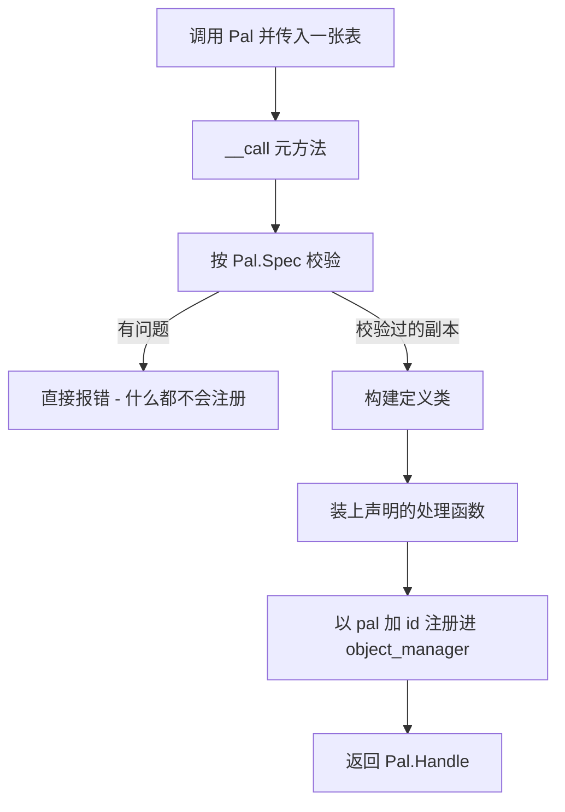
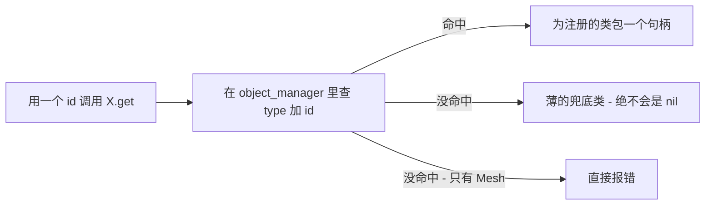
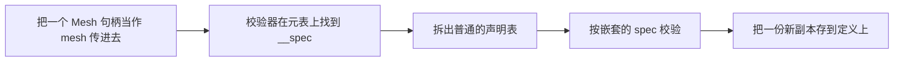

## 读完本页你可以做到

- 把自己的帕鲁、道具、建筑物、声音或网格加进游戏
- 不声明任何东西，就给游戏里已有的内容加上新行为
- 在包的任何地方，找回你先前做好的东西
- 起一个不会和别人模组撞车的名字
- 读懂字段写错时 PalForge 打印的消息，并把它改对

## 做出一样东西

要做内容，就把一张设置表交给对应种类的模块并调用它。每一种的做法都一样：

```lua
local pal = Pal{ id = "example:Boss", name = "Boss" }  -- CALL the module to define
Pal.get("ChickenPal")                                  -- an existing one, by id
Pal.get_all()                                          -- every registered one
```

这次调用会把你的设置记成一份 **定义**，然后交还一个 **句柄**：一个可以拿来操作的对象。
`Item`、`Building`、`Skill`、`Effect`、`Audio`、`Mesh` 和 `UI` 的调用方式完全一样，只有字段
不同。

`Pal{ ... }` 是 Lua 的简写。当一次调用只有一个表参数时，圆括号可以省掉，所以下面两种写法是
同一次调用：

<Tabs items={['Sugared', 'Desugared']}>
<Tab value="Sugared">

```lua
local pal = Pal{
    id          = "ChickenPal",
    name        = "Chicken Pal",
    description = "the one that greets you",
}
```

</Tab>
<Tab value="Desugared">

```lua
local pal = Pal({
    id          = "ChickenPal",
    name        = "Chicken Pal",
    description = "the one that greets you",
})
```

</Tab>
</Tabs>

花括号里就是参数列表。每个值都带着名字，所以顺序无所谓；以后某个领域新增字段，也不会改变你
已经写好的那些字段的含义。

同样的简写适用于任何只收一张表的函数，所以带名字的构造函数读起来也是同一个样子：

```lua
Audio.bgm{ id = "AKE_BGM_Title" }     -- same as Audio.bgm({ id = "AKE_BGM_Title" })
Panel:new{ title = "Hello" }          -- same as Panel:new({ title = "Hello" })
```

模块之所以能被调用，是因为它的表上带了 `__call` 元方法，也就是 Lua 用来响应“有人调用了这张
表”的机制：

```lua
setmetatable(Pal, { __call = function(_, spec) return define(spec) end })
```

`define` 是 `api/pal.lua` 里的一个局部函数，调用模块就是够到它的办法。

<Callout type="info">
不带参数的 `Pal()` 不是“空定义”的快捷写法。spec 会变成一张空表，`id` 缺失，这次调用直接
报错。
</Callout>

## 你会拿回什么

句柄是你操作的入口。所有你想对一只帕鲁*做*的事都在它上面：

```lua
local boss = Pal{ id = "ChickenPal", name = "Scorched Chicken" }

boss:spawn(Player.coordinate())   -- put one in the world
boss:name()                       -- "Scorched Chicken"
boss.id                           -- "ChickenPal"
```

`Pal.Handle:spawn`、`Item.Handle:give`、`Audio.Handle:play`、`Effect.Handle:apply`、
`Mesh.Handle:attachTo` 和 `UI.Handle:new` 都是句柄上的方法。

往里看，句柄就是包住它所代表的那份定义的一个两字段包装：

```lua
wrap = function(cls) return setmetatable({ id = cls.id, _cls = cls }, Handle) end
```

`id` 是公开的，`_cls` 是那份定义，`Handle` 元表带着该领域的动作和查询。句柄很轻，用完即弃
—— 每次调用 `get` 都会新建一个：

```lua
local a = Pal.get("ChickenPal")
local b = Pal.get("ChickenPal")

a == b        -- false: two different wrapper tables
a.id == b.id  -- true:  the same definition underneath
```

你的事件处理函数第一个参数收到的就是同一种句柄，所以不管刚才发生了什么，能对那个对象做的
操作都已经在手上了：

```lua
Pal{
    id = "ChickenPal",
    events = {
        onSpawned = function(pal, ctx)
            pal:renderOn(ctx.actor)          -- `pal` is this definition's handle
        end,
    },
}
```

<Callout type="info">
`UI` 的句柄还多带一样东西。`wrap` 会再建一张以元素类为元表的状态表，存进 `_st`，所以句柄
本身就能挂载，而 `Handle:new{ ... }` 会产出一个拥有自己状态的独立实例。
</Callout>

## 实际存下来的东西

定义是一张普通的 Lua 表，装着你传进去的内容，以该领域的基类作为元表，并按 `(type, id)` 这一
对记录在 `core/object_manager` 里。

对帕鲁来说，`Pal{ ... }` 组装出来的是这张表：

```lua
local cls = setmetatable({
    id           = spec.id,
    name         = spec.name or spec.id,
    description  = spec.description,
    skills       = spec.skills,
    meshSpec     = spec.mesh,
    materialSpec = spec.material,
    color        = spec.color,
    texture      = spec.texture,
    icon         = spec.icon,
    data         = spec.data,
}, Class)
cls.__index = cls
```

有两个字段换了名字存放。`mesh` 变成 `cls.meshSpec`，`material` 变成 `cls.materialSpec`，因为
`Class:mesh()` 和 `Class:material()` 是方法，名字会撞上。建筑物的 `state` 字段落在
`cls.defaultState`，因为在一座已放置的建筑物上，`state` 是那一座建筑物自己存下来的表。只有
直接翻看类的时候，你才会碰到这些名字。

你声明的处理函数会被装到那个类上。帕鲁、道具、技能和效果都把每个处理函数装在一个小转发器
后面，这正是处理函数收到的是 **句柄** 而不是类的原因：

```lua
for name, handler in pairs(spec.events or {}) do
    cls[name] = function(_, ...) return handler(handle, ...) end
end
```

建筑物则原样装上处理函数，因为建筑物处理函数的第一个参数是那座活着的、已放置的建筑物，不是
定义：

```lua
for name, handler in pairs(spec.events) do cls[name] = handler end
```

然后这个类被注册：

```lua
pcall(function() om.register("pal", spec.id, cls) end)
```

由此有两点。注册是在 `pcall` 里跑的，所以注册表出问题绝不会弄坏你的定义调用。另外，键就是
**你写下来的那个 id**，冒号也在里面 —— `"example:Boss"` 存在 `"example:Boss"` 下，而不是
`"example_Boss"`。

注册表可以直接读：

```lua
local om = require("palforge.core.object_manager")

om.get("pal", "ChickenPal")   -- the definition class, or nil
om.all("pal")                 -- { id -> cls }, a shallow copy you may not mutate into
om.TYPES                      -- audio, building, effect, item, mesh, pal, skill, ui
```

`om.all` 交还的是一份副本，往里写不会有任何变化。一个 id 注册之后就一直在；想改就再定义
一次。

## 一次调用，从头到尾



检查排在最前面，要么整个通过，要么抛错。一次调用不会只成功一半，所以你不可能拿到一份用被
拒绝的设置注册进去的定义。检查器先在整张表上找未知的键，然后才去看具体的字段；接着按声明
顺序走一遍字段，把默认值填进一份新的副本。你自己那张表永远不会被改动。

每个问题都是直接报错，并写明领域和字段，所以通常只看消息就能改：

```text
PalForge: Pal: unknown field "meshSpec" (did you mean "mesh"?). Valid fields: id, name, description, skills, mesh, material, color, texture, icon, events, data
PalForge: Pal: field "id" is required (pal id: a game CharacterID ("ChickenPal") or "pack:name")
PalForge: Pal: field "name" expects string, got number
PalForge: Pal: field "skills[2]" expects string, got number
PalForge: Pal: field "mesh" (Mesh.Spec): field "model" is required (USkeletalMesh / UStaticMesh asset path)
PalForge: Item: field "category" must be one of { "material", "consumable", "equipment", "ammo", "ingredient", "other" }, got "consumeable"
```

想在动手写之前知道一次调用能接受什么，就去问 schema 注册表 —— 它是所有已声明形状的运行时
清单：

```lua
local schema = require("palforge.core.schema")

print(schema.help("Pal.Spec"))        -- every field, type, default and meaning
schema.get("Pal.Spec").fields         -- the same, as a table, for tooling
schema.all()                          -- every declared spec, in declaration order
```

## 之后再找到它

只有 `X{ ... }` 会创建定义。`get` 和 `get_all` 只负责查：

```lua
Item{ id = "Wood", name = "Wood", maxStack = 9999 }   -- defines and registers
Item.get("Wood")                                      -- looks it up
Item.get_all()                                        -- every registered item
```

`X.get(id)` 先断言 `id` 是非空字符串，然后去注册表里查。各领域唯一不同的地方，是那个 id 下
什么都没注册时会发生什么：



有七个领域会做一个薄的兜底：一个只带 id 的裸类，外面包一个句柄。正是它让你不用声明任何东西
就能操作游戏自带的内容：

```lua
Item.get("Wood"):give(10)                              -- no Item{ id = "Wood" } needed
Pal.get("SheepBall"):spawn(Player.coordinate())
Audio.get("AKE_BGM_Title"):play()
```

薄句柄照样能做所有只需要 id 的事。`:spawn`、`:give`、`:take` 和 `:play` 都是走 id 的；在会读
图标 DataTable 的领域里 —— 那是游戏存放道具和生物图标的表 —— `:iconOf()` 也照常解析。这覆盖
了帕鲁、道具、建筑物和技能。
薄句柄做不到的，是一切来自声明的东西：`:mesh()` 是 `nil`，`:renderOn(actor)` 返回 `false`，
`:name()` 退回成 id，而且没有任何处理函数会跑。

`Audio.get` 是唯一一个兜底里多带一个字段的：`soundId = id`，所以任何 AkAudioEvent 名字 ——
游戏自己给声音起的名字 —— 都能直接播放。对于没有指定声音的定义，`Audio{ ... }` 用的也是同一
个兜底。

`Mesh.get` 则是抛错：

```text
PalForge: Mesh.get("example:body"): no mesh is defined under that id
```

没有 `model` 的网格没有东西可以渲染，所以缺失的网格 id 会在你写它的地方就失败，而不是在别处
悄悄地什么都不挂上。

```lua
local log = require("palforge.utils.log").scope("mypack")

local ok, err = pcall(Mesh.get, "example:body")
if not ok then log.warn(err) end
```

`X.get_all()` 会走一遍 `om.all(type)`，把找到的每个类都包起来：

```lua
local log = require("palforge.utils.log").scope("mypack")

for _, item in ipairs(Item.get_all()) do
    log.info(item.id .. " -> " .. item:name() .. " (" .. item:category() .. ")")
end
```

对它要有两点预期。顺序是对一份快照做 `pairs` 遍历得到的，并不稳定 —— 需要顺序就自己排一下。
而且它只列出真正被定义过的东西：原生目录是按需加载的，所以刚启动时 `Item.get_all()` 给你的
是那几份精选的定义（`Wood`、`Berries`、`Arrow`）加上你的包声明的内容，而不是游戏道具表里的
每一行。

### 定义一次，操作很多次

定义调用做的是注册。处理函数每次事件都会跑。在处理函数里要用 `get`，绝不要写定义：

```lua
Pal{
    id = "ChickenPal",
    events = {
        onDeath = function(pal, ctx)
            Audio.get("AKE_BGM_Title"):play()          -- a lookup, then a play
            -- Audio.bgm{ id = "AKE_BGM_Title" }:play()  -- re-declares on every death
        end,
    },
}
```

两种写法都会把声音放出来。但第二种在这只帕鲁每次死亡时，都会重新检查一遍设置，并覆盖注册表
里的那条记录。

## ID：你自己的，和游戏的

带冒号的 id 是包 id：`"packid:name"`。在游戏的 DataTable 里，对应那一行的 FName 是
`packid_name`。PalSchema 的行是所有模组共用的，所以这个前缀就是防止两个包撞车的东西。

不带冒号的 id 就是字面上的游戏 id：`"Wood"`、`"ChickenPal"`、`"PalBoxV2"`、`"WorkBench"`、
`"AKE_BGM_Title"`。

```lua
local om = require("palforge.core.object_manager")

om.resolve("example:Bench")   -- "example_Bench"
om.resolve("PalBoxV2")        -- "PalBoxV2"
om.resolve("my pack:Bench")   -- nil, "invalid pack id 'my pack' (letters/digits/_ only)"
```

带命名空间的 id，冒号两边都只能是字母、数字或下划线。这项检查是在 id 被 **解析** 的时候跑的，
不是你定义它的时候 —— 定义时对 `id` 只检查它是不是非空字符串。

解析发生在需要游戏行名的地方，不在注册表里：

- `Building.Handle:unlock()` 会先解析 id，再解锁科技行。
- `core/event` 会先解析建筑物的 `buildIds`，再拿已放置的 actor 去和它们比对。

注册表的键始终是你写下来的那个 id，这一点在查找时很要紧：

```lua
Building{ id = "example:Bench" }

Building.get("example:Bench")   -- the definition
Building.get("example_Bench")   -- a thin fallback: nothing is registered under that key
```

<Callout type="warn">
定义一个带命名空间的 id，是给这个 id 加上行为和元数据。它不会给游戏加一行新的 DataTable ——
光靠 Lua 做不到，那是 PalSchema 的活。请把定义指向一个已经存在的 id，可以是原版的 id，也可以
是你的包通过 PalSchema 附带的行。
</Callout>

## 把网格嵌进另一份定义

网格就是一样东西身上穿的模型。你可以把它内联写在穿着它的那份定义里，也可以起个名字只声明
一次，再把它本身传进去。两种写法抵达 `core/mesh` 的路子是一样的。

<Tabs items={['Inline', 'Named']}>
<Tab value="Inline">

```lua
Pal{
    id   = "ChickenPal",
    mesh = {
        kind      = "skeletal",
        model     = "/Game/Pal/Model/Character/Monster/ChickenPal/SK_ChickenPal.SK_ChickenPal",
        animClass = "/Game/Pal/Blueprint/Character/Monster/PalActorBP/ChickenPal/ABP_ChickenPal.ABP_ChickenPal_C",
    },
}
```

</Tab>
<Tab value="Named">

```lua
local ChickenBody = Mesh{
    id        = "example:ChickenBody",
    kind      = "skeletal",
    model     = "/Game/Pal/Model/Character/Monster/ChickenPal/SK_ChickenPal.SK_ChickenPal",
    animClass = "/Game/Pal/Blueprint/Character/Monster/PalActorBP/ChickenPal/ABP_ChickenPal.ABP_ChickenPal_C",
}

Pal{ id = "ChickenPal", mesh = ChickenBody }
Pal{ id = "SheepBall",  mesh = Mesh.get("example:ChickenBody") }
```

</Tab>
</Tabs>

带名字的写法能用，是因为 `Mesh.Handle` 的元表上带了 `__spec` 元字段：

```lua
Handle.__spec = function(self) return self._cls:source() end
```

检查器会找这个元字段；找到之后，它检查的是元字段返回的那张表，而不是句柄：



有两个后果值得知道。

第一，那份副本是真的副本。`Pal.Handle:mesh()` 返回的是存在帕鲁定义上的那份副本，不是网格
定义本身，所以改它不会反过来影响你声明的那个 `Mesh`。

```lua
local body = Mesh{ id = "example:Body", model = "/Game/.../SK_X.SK_X", scale = 1.0 }
local pal  = Pal{ id = "example:Boss", mesh = body }

pal:mesh().scale = 4.0
body:source().scale     -- still 1.0
```

第二，`Mesh.Handle` 是唯一带 `__spec` 的句柄。网格是目前唯一能嵌进另一份定义里的已定义对象。
凡是要求其他领域形状的地方，请传一张普通的表。

<Callout type="warn">
`Building.Spec.Mesh` 就是 `Mesh.Spec`，只把 `kind` 的默认值从 `"skeletal"` 换成了
`"static"`。默认值只对你没写的字段生效，而带名字的 `Mesh{ ... }` 在被定义的那一刻就已经填好
了自己的默认值。所以嵌进建筑物的网格句柄是带着 `kind = "skeletal"` 到达的，建筑物那边的
`"static"` 默认值根本不会触发。建筑物要穿的网格，请显式写上 `kind`。
</Callout>

```lua
local BenchBody = Mesh{
    id    = "example:BenchBody",
    kind  = "static",   -- explicit: this mesh is worn by a building
    model = "/Game/Pal/Model/Prop/Architecture/WorkBenchPrimitive/SM_WorkBenchPrimitive.SM_WorkBenchPrimitive",
}

Building{ id = "WorkBench", name = "Workbench", gridCm = 100, mesh = BenchBody }
```

## 同一个 id 定义两次

`om.register` 直接写进桶里，所以同一个 `(type, id)` 定义两次会把原来那条记录换掉。不会有任何
警告，注册也收不回来。

```lua
local first  = Item{ id = "Wood", name = "Wood" }
local second = Item{ id = "Wood", name = "Seasoned Wood" }

first:name()              -- "Wood"          (the first class, still held by that handle)
second:name()             -- "Seasoned Wood"
Item.get("Wood"):name()   -- "Seasoned Wood" (the registry holds the second)
```

由此可以得出：

- `X.get`、`X.get_all` 和事件分发都走注册表，所以它们看到的是最新的那份定义。
- 先前那次调用返回的句柄，仍然抱着它自己的 `_cls`。它的查询和手动的 `:onXxx` 转发器跑的还是
  先前那份声明。只用 id 的动作（`:spawn`、`:give`、`:play`）两边表现一样，因为它们始终只用
  `self.id`。
- 对建筑物来说，`core/event` 会按类缓存一份从类推导出来的 def，类变了就在下一次扫描时重建。
  已经被跟踪的建筑保留它创建时的那个类；新定义只对之后放置的建筑物生效。

可靠的做法是：每个 id 在加载时只定义一次，其他地方一律用 `X.get`。如果你一边改一边热重载包
文件，就要预期注册表里留下的是最后加载的那一版，而你存在局部变量里的旧句柄已经过期了。

## X.Class

每个可调用的模块都暴露了 `X.Class`：该领域的每一份定义都会拿它当元表的那个基类。它装着什么
都不做的钩子默认实现，加上该领域自己的方法 —— `Pal.Class:mesh`、`Pal.Class:material`、
`Pal.Class:iconOf`、`Building.Class:render`、`Building.Class:update`、`Building.Class.new`、
`Mesh.Class:source`、`Audio.Class:source`、`UI.Class:mount` 等等。

大多数包永远不会碰它。有两种情况你会碰。

**检测覆盖。** `core/event` 靠拿类和基类做比较，来判断一座建筑物有没有声明某个钩子：

```lua
local BuildingBase = require("palforge.api.building").Class

local function overrides(cls, name)
    return cls[name] ~= nil and cls[name] ~= BuildingBase[name]
end
```

从没声明过 `onTick` 的定义继承的是什么都不做的默认实现，比较结果相等，于是被完全排除在 tick
列表之外。反过来说，空的处理函数不是免费的：

```lua
Building{
    id     = "example:Bench",
    events = {
        onTick = function(self, ctx) end,   -- differs from the base: this instance ticks
    },
}
```

**在多份定义之间共享行为。** 方法是沿着元表链解析的 —— 一座活着的建筑物退回到它的定义类，
定义类再退回到 `Building.Class` —— 所以加在那里的方法，每一份定义和每一座活着的建筑物都看得
到，包括你加它之前就已经建好的那些。

```lua
function Building.Class:describe()
    return (self.name or self.id) .. " at " .. tostring(self.key)
end
```

每份定义各自的值不该放在那里。请用 `data` 字段，除 `Mesh` 以外每个领域都声明了它，并且会
原样带到定义上。`UI` 的处理方式不同：它的 `data` 键会摊到元素类上，成为每个实例都继承的
默认值。

```lua
local Boss = Pal{
    id   = "ChickenPal",
    data = { tier = 3, drops = { "Wood", "Berries" } },
}
```

## 各个领域一览

| 领域 | `X{ ... }` 返回 | 什么都没注册时的 `X.get(id)` | 处理函数的 `self` | 除 define / get / get_all 之外 |
| --- | --- | --- | --- | --- |
| `Pal` | `Pal.Handle` | 包着 `{ id = id }` 的薄句柄 | 这份定义的句柄 | `Pal.Class` |
| `Item` | `Item.Handle` | 包着 `{ id = id }` 的薄句柄 | 这份定义的句柄 | `Item.Class` |
| `Building` | `Building.Handle` | 包着 `{ id = id }` 的薄句柄 | 已放置的那个活实例 | `Building.Class` |
| `Skill` | `Skill.Handle` | 包着 `{ id = id }` 的薄句柄 | 这份定义的句柄 | `Skill.Class` |
| `Effect` | `Effect.Handle` | 包着 `{ id = id }` 的薄句柄 | 这份定义的句柄 | `Effect.activeOn`, `Effect.Class` |
| `Audio` | `Audio.Handle` | 包着 `{ id = id, soundId = id }` 的薄句柄 | 这个领域没有事件 | `Audio.bgm`, `Audio.se`, `Audio.Class` |
| `Mesh` | `Mesh.Handle` | 直接报错 | 这个领域没有事件 | `Mesh.Class` |
| `UI` | `UI.Handle`，本身就能挂载 | 薄的、什么都不做的元素 | 挂载出来的那个实例 | `UI.Class`, `Handle:new` |
| `Player` | 不可调用 | 没有 `get` | 这个领域没有事件 | `character`, `coordinate`, `coordinateOffset` |

`Mesh` 在“定义时可以省略什么”上也和别人不同。`Mesh.Spec` 是唯一 `id` 可选的形状，因为内联
的网格没有名字可起 —— 但直接定义一个网格时，`id` 仍然是必填的：

```text
PalForge: Mesh: field "id" is required (an unnamed mesh cannot be looked up again - write it inline as mesh = { ... } instead)
```

`Audio.bgm` 和 `Audio.se` 就是把 `kind` 钉死了的同一个定义。它们会复制你的表，而不是改动它；
矛盾的 `kind` 会被拒绝，而不是被覆盖：

```lua
Audio.bgm{ id = "AKE_BGM_Title" }            -- kind = "bgm"
Audio.se{ id = "AKE_Build_PalBox" }          -- kind = "se"
Audio.bgm{ id = "AKE_Cheer", kind = "se" }   -- error: kind is fixed to "bgm" here
```

## 实用写法

### 一个包文件，从网格到生成

```lua title="Scripts/mypack/content.lua"
require("palforge.api")   -- installs Pal / Item / Mesh / Audio / Player as mod-local globals

local log = require("palforge.utils.log").scope("mypack")

-- 1. one named mesh, reusable by id
local BossBody = Mesh{
    id        = "mypack:BossBody",
    kind      = "skeletal",
    model     = "/Game/Pal/Model/Character/Monster/ChickenPal/SK_ChickenPal.SK_ChickenPal",
    animClass = "/Game/Pal/Blueprint/Character/Monster/PalActorBP/ChickenPal/ABP_ChickenPal.ABP_ChickenPal_C",
    scale     = 2.0,
    color     = { r = 1.0, g = 0.4, b = 0.2, a = 1.0 },
}

-- 2. a definition that wears it
local Boss = Pal{
    id          = "ChickenPal",
    name        = "Scorched Chicken",
    description = "A chicken that has seen things.",
    mesh        = BossBody,
    data        = { tier = 3 },
    events = {
        onSpawned = function(pal, ctx)
            pal:renderOn(ctx.actor)
            Audio.get("AKE_BGM_Title"):play()
        end,
        onDeath = function(pal, ctx)
            Item.get("Wood"):give(5)
            log.info(pal:name() .. " dropped its wood")
        end,
    },
}

-- 3. act on it through the handle the define returned
Boss:spawn(Player.coordinateOffset(300, 0, 0))
```

### 一座复用同一个具名网格写法的建筑物

```lua title="Scripts/mypack/bench.lua"
require("palforge.api")

local BenchBody = Mesh{
    id    = "mypack:BenchBody",
    kind  = "static",
    model = "/Game/Pal/Model/Prop/Architecture/WorkBenchPrimitive/SM_WorkBenchPrimitive.SM_WorkBenchPrimitive",
}

local Bench = Building{
    id           = "WorkBench",
    name         = "Workbench",
    gridCm       = 100,
    tickInterval = 4,
    mesh         = BenchBody,
    state        = { uses = 0 },
    events = {
        onPlace = function(self, ctx)
            self.state.uses = 0
            self:save()
        end,
        onRightClick = function(self, ctx)
            self.state.uses = self.state.uses + 1
            self:save()
        end,
    },
}

Bench:unlock()                                  -- resolves the id, unlocks the tech row
local placed = #Bench:instances()               -- how many are live in the loaded world
```

建筑物的处理函数把 `self` 收成那座活着的、已放置的建筑物，这就是 `self.state` 和 `self:save()`
存在的原因。每个钩子由什么驱动，见 [生命周期页面](/docs/concepts/lifecycle)。

### 看看现在注册了些什么

```lua title="a console-driven dump"
local om     = require("palforge.core.object_manager")
local schema = require("palforge.core.schema")
local log    = require("palforge.utils.log").scope("mypack")

-- what a call accepts
log.info(schema.help("Pal.Spec"))
log.info(schema.help("Mesh.Spec"))

-- what exists right now, per object type
for _, otype in ipairs(om.TYPES) do
    local ids = {}
    for id in pairs(om.all(otype)) do ids[#ids + 1] = id end
    table.sort(ids)
    log.info(otype .. " (" .. #ids .. "): " .. table.concat(ids, ", "))
end
```

### 给不一定属于你的内容安全地写定义

```lua
local function meshOrNil(id)
    local ok, handle = pcall(Mesh.get, id)
    return ok and handle or nil
end

Pal{
    id   = "example:Boss",
    mesh = meshOrNil("otherpack:BossBody") or {
        model = "/Game/Pal/Model/Character/Monster/ChickenPal/SK_ChickenPal.SK_ChickenPal",
    },
}
```

会抛错的查找只有 `Mesh.get` 一个，所以也只有它值得包一层 `pcall`。其他所有 `get` 无论如何都
会返回一个句柄。

## 接下来读什么

<Cards>
  <Card title="Pal" href="/docs/api/pal">帕鲁定义的每个字段，以及句柄能做的事</Card>
  <Card title="Mesh" href="/docs/api/mesh">唯一能嵌进另一份定义里的定义</Card>
  <Card title="Building" href="/docs/api/building">处理函数拿到的是活实例的那个领域</Card>
  <Card title="生命周期" href="/docs/concepts/lifecycle">哪些钩子真的会触发，以及是什么在驱动它们</Card>
</Cards>

## 小结

- 想做出一样东西，就把一张表交给模块调用：`Pal{ id = "example:Boss" }`。`id` 永远必填。
- 调用会返回一个句柄。`:spawn`、`:give`、`:play`、`:apply` 这类动作都在句柄上，你的处理函数
  第一个参数收到的就是它。
- `X.get(id)` 用来再次找到它。七个领域在查不到时会给你一个只带 id 的薄句柄，所以原版内容不用
  声明就能操作；只有 `Mesh.get` 是抛错。
- 带冒号的 id 是你自己的（`"mypack:Bench"`），不带冒号的是游戏的（`"Wood"`）。定义是把行为
  挂到一个已经存在的 id 上。
- 字段写错或拼错都是直接报错，报错里会写明字段名，而且什么都不会注册。
- 每个 id 在加载时只定义一次，处理函数里用 `X.get`。

接着读 [生命周期](/docs/concepts/lifecycle)，看看哪些事件真的会到达你的处理函数。
