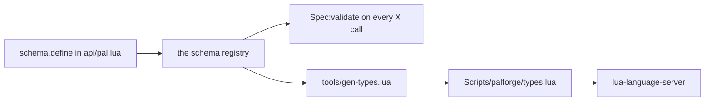

## このページでできるようになること

- パルやアイテム、建物に指定できる項目を、打ちながらエディタに一覧してもらう
- 各項目の意味と、書かなかったときの既定値をその場で確認する
- 項目名の打ち間違いを、ゲームを起動する前にエディタで見つける
- 決まった値しか取らない項目で、使える値の中から選ぶ
- エディタから離れているときは、同じ一覧をゲーム内で表示する

コンテンツパックはただの Lua ファイルです。コンパイルも、エディタのプラグインの導入も必要
ありません。

やることは 1 つ、PalForge の場所を 1 つのプログラムに教えるだけです。そのプログラムが
[lua-language-server](https://github.com/LuaLS/lua-language-server)、通称 LuaLS で、エディタ
が Lua を理解するために裏で動いています。PalForge の `Scripts` フォルダを教えておくと、
`Pal{ ... }` や `Item{ ... }`、`Building{ ... }` を書いたときにフィールドの候補が出るように
なります。フィールドとは、波かっこの中の `name =` や `mesh =` のような 1 行のことです。候補
には、パック読み込み時に PalForge が照合するのと同じ説明が付いてきます。

## エディタを設定する

LuaLS から `Scripts/palforge/` フォルダが*見えている*必要があります。どこを見るかは
`.luarc.json` というファイルで指定します。このファイルを置く場所は、パックを自分のフォルダで
管理しているか、PalForge のフォルダの中で書いているかで変わります。

<Tabs items={['パック専用フォルダ', 'PalForge リポジトリ内']}>
<Tab value="パック専用フォルダ">

`.luarc.json` をパックのフォルダの一番上に置き、PalForge の `Scripts` ディレクトリをライブラリ
として並べます。パスは `.luarc.json` からの相対です。

```json title=".luarc.json"
{
    "runtime.version": "Lua 5.4",
    "workspace.library": [
        "../PalForge/Scripts"
    ],
    "diagnostics.globals": [
        "FindFirstOf", "FindAllOf", "StaticFindObject", "LoadAsset",
        "RegisterHook", "RegisterKeyBind", "RegisterConsoleCommandHandler",
        "ExecuteInGameThread", "LoopAsync", "FName", "Key"
    ]
}
```

フルパスでも書けます。パックを UE4SS の mods フォルダに置き、PalForge はディスク上の別の場所
にある、という場合はこちらが向いています。

```json title=".luarc.json"
{
    "workspace.library": [
        "C:/games/Palworld/Pal/Binaries/Win64/ue4ss/Mods/PalForge/Scripts"
    ]
}
```

</Tab>
<Tab value="PalForge リポジトリ内">

`Scripts` はすでにエディタで開いているので、`workspace.library` に足すものはありません。Lua の
バージョンを指定し、UE4SS が実行時に渡してくる名前を並べて、エディタが下線を引かないように
します。

```json title=".luarc.json"
{
    "runtime.version": "Lua 5.4",
    "diagnostics.globals": [
        "FindFirstOf", "FindAllOf", "StaticFindObject", "LoadAsset",
        "RegisterHook", "RegisterKeyBind", "RegisterConsoleCommandHandler",
        "ExecuteInGameThread", "LoopAsync", "FName", "Key"
    ]
}
```

</Tab>
</Tabs>

PalForge のコピーによっては、`Scripts/palforge/deprecated/` と `Scripts/palforge/tmp/` という
フォルダがディスク上にあります。リリースには含まれないので、手元にない場合もあります。ある
場合は、古い定義が候補に混ざらないよう、エディタに読み飛ばしてもらってください。

```json title=".luarc.json"
{
    "workspace.ignoreDir": [
        "Scripts/palforge/deprecated",
        "Scripts/palforge/tmp"
    ]
}
```

## エディタに出てくるもの

パック側のファイルに import するものはありません。`Pal`、`Item`、`Building`、`Skill`、
`Effect`、`Audio`、`Mesh`、`UI`、`Player` は最初からグローバルとして置かれ、それぞれに型が
書かれているので、`local` を書かずにそのまま使えます。

```lua title="Scripts/palforge/api/init.lua"
---@type palforge.pal
_G.Pal = Pal
```

波かっこの中身が補完されるのは、各モジュールに付いた `---@overload` の行のおかげです。
`Pal{ ... }` が `Pal.Spec` を受け取り `Pal.Handle` を返す、とエディタに伝えています。

```lua title="Scripts/palforge/api/pal.lua"
---@class palforge.pal
---@overload fun(spec: Pal.Spec): Pal.Handle
local Pal = {}
```

**設定前** — `Scripts` がワークスペースの外にあると、エディタは `Pal.Spec` を知らないので、
波かっこはただのテーブルで、出せる候補がありません。

```text
Pal{
    |            no suggestions; a typo like displayName surfaces only when the game runs
}
```

**設定後** — 候補一覧は `Pal.Spec` のフィールドそのもので、宣言された順に並び、それぞれに説明
が付きます。

```text
Pal{
    |
    id           string                  pal id: a game CharacterID ("ChickenPal") or "pack:name"
    name         string?                 shown in UI (defaults to id)
    description  string?                 one-line description, for UI and tooling
    skills       string[]?               skill ids this pal owns (see Skill)
    mesh         Mesh.Spec|Mesh.Handle?  the mesh attached to a spawned pawn (inline, or a Mesh{ ... } handle)
    material     Pal.Spec.Material?      material override applied to that mesh
    color        table?                  base tint { r, g, b, a } (shorthand for material.color)
    texture      string?                 png path applied to the mesh (shorthand for material.texture)
    icon         any?                    fallback icon used when the DataTable lookup misses
    events       Pal.Spec.Events?        lifecycle handlers (grouped)
    data         table?                  free-form payload of your own, carried onto the definition
}
```

ここで一度に 4 つのことが手に入ります。

- **各フィールドとその説明。** `---@field` 行の `#` の後ろは、スペック宣言の `doc =` の文字列
  そのものです。`maxStack` にホバーすれば *inventory stack ceiling (default 1)* と出て、既定値
  まで含まれます。
- **決まった値しか取らない項目の、短い選択肢。** `values` を持つフィールドは専用の型になります。
  全部で 5 つ、`Mesh.Spec.Kind`、`Item.Spec.Category`、`Building.Spec.Mesh.Kind`、
  `Skill.Spec.Kind`、`Audio.Spec.Kind` です。
  `kind =` の後で引用符を打つと、
  `"procedural"`、`"static"`、`"skeletal"`、`"obj"` だけが出て、それ以外は出ません。
- **ネストした形は、どちらの書き方でも。** `mesh` の型は `Mesh.Spec|Mesh.Handle` です。メッシュ
  をその場に直接書いても、`Mesh{ ... }` が返したものを渡しても、どちらでも通ります。
- **返ってきたもので何ができるか。** `Pal{ ... }` は `Pal.Handle` を返すので、`pal:` と打つと
  `spawn`、`renderOn`、`skillsOf`、`mesh`、`iconOf`、`name`、`description` とイベントの
  フォワーダが、`api/pal.lua` でそれぞれの上に書かれたコメントつきで出ます。

```lua title="content/pals.lua"
local pal = Pal{
    id          = "example:Boss",
    name        = "Boss",
    description = "the one that greets you",
    mesh        = Mesh{
        id    = "example:body",
        kind  = "skeletal",                 -- completes to the four Mesh.Spec.Kind values
        model = "/Game/Pal/Model/Character/Monster/ChickenPal/SK_ChickenPal",
    },
    events = {                              -- completes to Pal.Spec.Events, five handlers
        onSpawned = function(pal, ctx)      -- pal is a Pal.Handle, so pal: completes
            pal:renderOn(ctx.actor)
        end,
    },
}

pal:spawn(Player.coordinate())              -- Player.coordinate returns Coord?
```

ハンドルとビルディングインスタンスの型は、メソッドの実装のすぐ隣に手で書かれています。
`Pal.Handle` は `api/pal.lua`、`Building.Handle` と `Building.Instance` は
`api/building.lua`、という具合です。だからビルディングのハンドラでは、インスタンスの側も
補完されます。

```lua title="content/buildings.lua"
Building{
    id    = "example:Beacon",
    state = { charges = 3 },
    events = {
        onRightClick = function(inst, ctx)  -- inst is a Building.Instance
            inst.state.charges = inst.state.charges - 1
            inst:save()                     -- .actor .pos .state .buildId .key all complete
        end,
    },
}
```

## 候補を運んでくるファイル

補完に出てくる文字列は、すべて `Scripts/palforge/types.lua` から来ています。LuaLS 用の定義
ファイルで、中身は説明だけ、実行されるコードはありません。api が受け取るすべての形について
`---@class` と `---@alias` を宣言しています。先頭の `---@meta` の行が、これは実際のコードでは
なく型の記述だと LuaLS に伝えていて、フレームワーク側がこのファイルを読み込むことはありません。

```lua title="Scripts/palforge/types.lua"
-- PalForge type definitions — GENERATED, do not edit.
--
-- Regenerate with:  lua5.4 tools/gen-types.lua
-- Source of truth:  the schema declarations in Scripts/palforge/api/*.lua
---@meta

---@alias Mesh.Spec.Kind "procedural"|"static"|"skeletal"|"obj"
---@class Mesh.Spec
---@field id? string # mesh id, e.g. "pack:name" (required when defined directly; omit when inline)
---@field kind? Mesh.Spec.Kind # which core.mesh backend renders it (default skeletal)
---@field model string # USkeletalMesh / UStaticMesh asset path
```

このファイルには、宣言済みの形ごとに 1 つずつ、18 個のクラスが入っています。`Pal.Spec`、
`Pal.Spec.Events`、`Pal.Spec.Material`、`Item.Spec`、`Item.Spec.Recipe`、`Item.Spec.Events`、
`Building.Spec`、`Building.Spec.Mesh`、`Building.Spec.Material`、`Building.Spec.Events`、
`Skill.Spec`、`Skill.Spec.Events`、`Effect.Spec`、`Effect.Spec.Events`、`Audio.Spec`、
`UI.Spec`、`Mesh.Spec`、`Coord` です。

<Callout type="info">
`types.lua` を削除して壊れるのは補完だけです。ゲームはこのファイルを読みませんし、
`Pal{ ... }` のチェック結果もあるとき・ないときで同じです。チェックは
`Scripts/palforge/api/*.lua` のスペック宣言に対して行われ、このファイルもそこから作られて
います。
</Callout>

## types.lua を再生成する

スペックを変えたらジェネレータを実行します。開発用のツールで、ゲームを閉じたまま素の Lua
インタプリタで動きます。

```bash
cd /path/to/PalForge
lua5.4 tools/gen-types.lua
```

```text
wrote ./Scripts/palforge/types.lua (18 classes, 223 lines)
```

書き出し先は、渡したルート（既定は今いるフォルダ）の下の `Scripts/palforge/types.lua` です。
別の場所から実行することもできます。

```bash
lua5.4 tools/gen-types.lua /path/to/PalForge
```

`schema.define` や `schema.derive` の呼び出しが変わったら、そのつど実行し直してください。
フィールドの追加、使える値の追加、既定値の変更、説明の書き換え、いずれもです。`types.lua` は
リポジトリにコミットされているので、再生成したファイルはスペック変更と同じコミットに入れます。

<Callout type="warn">
`types.lua` を手で編集しないでください。次にジェネレータを実行した時点でファイル全体が
書き直されます。`Scripts/palforge/api/*.lua` の `schema.define` を変更して再生成します。
</Callout>

## 候補がいつもゲームと一致する理由

エディタは `types.lua` を読み、ゲームは `Scripts/palforge/api/*.lua` のスペック宣言を読みます。
この 2 つは、別々に合わせ込む一覧ではありません。ジェネレータは `palforge.api` を読み込んで
すべての形をスキーマレジストリに載せ、`schema.all()` を辿ります。定義呼び出しのたびに
`Spec:validate` が使うのと同じスペックオブジェクトです。



そのため、エディタが出すフィールドはゲームが受け付けるフィールドであり、ゲームが弾く
フィールドが候補に出ることはありません。フィールド宣言の各要素は、生成される行に決まった形で
効きます。

| スキーマのディスクリプタ | 生成されるアノテーション |
| --- | --- |
| `required = true` | `?` の付かないフィールド名 |
| `default = "material"` | 説明の末尾に `(default material)` を追加 |
| `values = { "active", "passive" }` | `---@alias Skill.Spec.Kind "active"\|"passive"` |
| `of = Recipe`（ネストしたスペック） | そのスペック名、つまり `Item.Spec.Recipe`。ハンドルを名乗っていれば `Mesh.Spec\|Mesh.Handle` |
| `arrayOf = "string"` | `string[]` |
| `mapOf = "number"` | `table<string, number>` |
| `sig = "fun(self: Pal.Handle, ctx: table)"` | そのシグネチャをそのまま |
| `doc = "..."` | `#` の後ろのテキスト |
| `check = schema.nonEmpty` | 何も出ません。check は定義時にだけ走ります |
| `type` なし | `any` |

知っておくとよいことが 2 つあります。

- `schema.derive` で宣言した形は、独自のクラスと独自の値リストを持ちます。
  `Building.Spec.Mesh` は `Mesh.Spec` の 3 フィールドを調整したもので、`kind` の既定値を
  `"skeletal"` から `"static"` へ、`model` と `offset` の説明をより具体的にしてあります。
  そのため `Building.Spec.Mesh.Kind` が、同じ 4 つの値と別の既定値の記述で生成されます。
- クラスは宣言順に出力され、形の名前の最初の部分でまとめられます。だから `Mesh.Spec` は
  `Mesh` の見出しの下に並び、ドメイン接頭辞を持たない `Coord` は `Common` に入ります。

## UE4SS がゲーム実行中に足す名前

`FindFirstOf`、`FindAllOf`、`StaticFindObject`、`LoadAsset`、`RegisterHook`、
`RegisterKeyBind`、`RegisterConsoleCommandHandler`、`ExecuteInGameThread`、`LoopAsync`、
`FName`、`Key` は、PalForge が動く土台である MOD ローダー UE4SS から来ます。どの Lua ファイル
にも書かれていないため、並べておかない限り LuaLS は未定義として印を付けます。上の
`diagnostics.globals` はそのためのものです。

ジェネレータ側の扱いは違います。ゲームを閉じたまま api モジュールを実際に*動かす*必要がある
ので、何かを読み込む前に、それぞれの名前に何もしない代役を置きます。

```lua title="tools/gen-types.lua"
for _, name in ipairs({ "FindFirstOf", "FindAllOf", "StaticFindObject", "LoadAsset",
                        "RegisterHook", "RegisterKeyBind", "RegisterConsoleCommandHandler",
                        "ExecuteInGameThread", "LoopAsync" }) do
    _G[name] = function() return nil end
end
_G.FName = function(s) return { ToString = function() return s end } end
_G.Key = {}
```

api モジュールを読み込んでもテーブルが組み立てられるだけなので、代役が呼ばれることはありま
せん。一緒に読み込まれるゲーム寄りのファイルは、名前が存在することだけを求めています。

UE4SS の Lua 型定義を持っているなら、そのフォルダも `workspace.library` に追加し、対応する
名前を `diagnostics.globals` から外してください。何も出ない代わりに、実際のシグネチャが出る
ようになります。PalForge はその型定義を同梱していません。

## 同じ一覧をゲーム内で見る

すべての形は、実行中のゲームからも読めます。キーバインドやコンソールコマンドから、あるいは
検証エラーの原因を追っている最中に役立ちます。

```lua
local schema = require("palforge.core.schema")

print(schema.help("Pal.Spec"))                -- printable field list
local fields = schema.get("Pal.Spec").fields  -- the same as an ordered array, for tooling
local specs  = schema.all()                   -- every declared spec, in declaration order
```

`schema.help` はフィールドを宣言順に 1 行ずつ出力します。

```text
Pal.Spec {
  id            string     (required) pal id: a game CharacterID ("ChickenPal") or "pack:name"
  name          string     shown in UI (defaults to id)
  description   string     one-line description, for UI and tooling
  skills        table      (string[]) skill ids this pal owns (see Skill)
  mesh          table      (Mesh.Spec) the mesh attached to a spawned pawn (inline, or a Mesh{ ... } handle)
  material      table      (Pal.Spec.Material) material override applied to that mesh
  color         table      base tint { r, g, b, a } (shorthand for material.color)
  texture       string     png path applied to the mesh (shorthand for material.texture)
  icon          any        fallback icon used when the DataTable lookup misses
  events        table      (Pal.Spec.Events) lifecycle handlers (grouped)
  data          table      free-form payload of your own, carried onto the definition
}
```

宣言されていない名前を渡すと、宣言済みの名前の一覧が返ってきます。

```text
PalForge: no spec named "Pal.Events". Declared: Audio.Spec, Building.Spec, Building.Spec.Events, Building.Spec.Material, Building.Spec.Mesh, Coord, Effect.Spec, Effect.Spec.Events, Item.Spec, Item.Spec.Events, Item.Spec.Recipe, Mesh.Spec, Pal.Spec, Pal.Spec.Events, Pal.Spec.Material, Skill.Spec, Skill.Spec.Events, UI.Spec
```

同じ情報が出てくる 3 つ目の場所は、エラーそのものです。問題が見つかると読み込みは止まり、
ドメイン名、フィールド名、そして有効な選択肢が示されます。つまり読み込みに成功したパックは、
綴りが正しかったということです。

```text
PalForge: Pal: unknown field "displayName" (did you mean "name"?). Valid fields: id, name, description, skills, mesh, material, color, texture, icon, events, data
PalForge: Pal: field "id" is required (pal id: a game CharacterID ("ChickenPal") or "pack:name")
PalForge: Pal: field "mesh" (Mesh.Spec): field "kind" must be one of { "procedural", "static", "skeletal", "obj" }, got "voxel"
PalForge: Pal: field "mesh" (Mesh.Spec): field "model" is required (USkeletalMesh / UStaticMesh asset path)
```

## レシピ

### パックのフォルダをゼロから用意する

<Steps>

<Step>
### PalForge の隣にパックを置く

```text
mods/
  PalForge/
    Scripts/
      main.lua
      palforge/
  MyPack/
    .luarc.json
    content/
      pals.lua
```
</Step>

<Step>
### .luarc.json を書く

```json title="MyPack/.luarc.json"
{
    "runtime.version": "Lua 5.4",
    "workspace.library": [
        "../PalForge/Scripts"
    ],
    "diagnostics.globals": [
        "FindFirstOf", "FindAllOf", "StaticFindObject", "LoadAsset",
        "RegisterHook", "RegisterKeyBind", "RegisterConsoleCommandHandler",
        "ExecuteInGameThread", "LoopAsync", "FName", "Key"
    ]
}
```
</Step>

<Step>
### コンテンツを書いて補完を確かめる

```lua title="MyPack/content/pals.lua"
local pal = Pal{
    id     = "ChickenPal",
    name   = "Lookout Chicken",
    skills = { "example:Screech" },
    events = {
        onCaptured = function(pal, ctx)
            Item.get("Berries"):give(3)
        end,
    },
}

return pal
```

`Pal` も `Item` も `require` は不要です。`api/init.lua` がグローバルとして置き、型も書いて
くれているので、LuaLS はライブラリパス越しにそれを拾います。
</Step>

</Steps>

### スペックを変えたら再生成する

フィールドの追加は、宣言 1 つとコマンド 1 つです。その形を持っているモジュールで宣言します。

```lua title="Scripts/palforge/api/skill.lua"
local Spec = schema.define("Skill.Spec", {
    { "id",          type = "string", required = true, check = schema.nonEmpty,
                     doc = "skill id: a game row id or \"pack:name\"" },
    { "name",        type = "string", doc = "shown in skill lists (defaults to id)" },
    { "description", type = "string", doc = "one-line description, for UI and tooling" },
    { "kind",        type = "string", values = { "active", "passive" }, default = "active",
                     doc = "an active skill is fired; a passive one is equipped" },
    -- element, cooldown, power, icon, events, data unchanged
    { "range",       type = "number", doc = "metres the skill reaches" },   -- new
})
```

そのうえで再生成し、両方のファイルをコミットします。

```bash
lua5.4 tools/gen-types.lua
git add Scripts/palforge/api/skill.lua Scripts/palforge/types.lua
```

クラスは宣言順に出力されるので新しい行は最後に並び、`range` は `Skill{ ... }` に受け付けられる
のと同時に、エディタからも候補に出ます。

```lua title="Scripts/palforge/types.lua"
---@alias Skill.Spec.Kind "active"|"passive"
---@class Skill.Spec
---@field id string # skill id: a game row id or "pack:name"
---@field name? string # shown in skill lists (defaults to id)
---@field description? string # one-line description, for UI and tooling
---@field kind? Skill.Spec.Kind # an active skill is fired; a passive one is equipped (default active)
---@field element? string # attribute / element (fire, water, ...)
---@field cooldown? number # seconds between activations (enforced by :activate)
---@field power? number # base power / magnitude
---@field icon? any # fallback icon used when the DataTable lookup misses
---@field events? Skill.Spec.Events # behaviour handlers (grouped)
---@field data? table # free-form payload of your own, carried onto the definition
---@field range? number # metres the skill reaches
```

### 宣言済みのすべての形を UE4SS のログに出す

エディタから離れているときや、原因を探しに来たエラーのすぐ隣にフィールド一覧が欲しいときに
使えます。

```lua title="MyPack/content/dev.lua"
local schema = require("palforge.core.schema")
local event  = require("palforge.core.event")
local log    = require("palforge.utils.log").scope("mypack")

event.on("world.ready", function()
    for _, spec in ipairs(schema.all()) do
        log.info(spec.name .. "  (" .. #spec.fields .. " fields)")
    end
    log.info(schema.help("Building.Spec"))
end)
```

各行は `[PalForge.mypack][info] ...` の形で出ます。全部を出さずに 1 つの形だけを見たいときは、
フィールドのディスクリプタを自分で走査します。

```lua
local schema = require("palforge.core.schema")

for _, f in ipairs(schema.get("Effect.Spec").fields) do
    print(string.format("%-12s %-8s %s%s",
        f.name,
        f.type or "any",
        f.required and "required " or "",
        f.doc or ""))
end
```

## まとめ

- `.luarc.json` の `workspace.library` に PalForge の `Scripts` フォルダを足すと、すべての
  `X{ ... }` がフィールドを補完し、ゲームが照合するのと同じ説明を見せてくれます。
- UE4SS の名前（`FindFirstOf`、`LoadAsset`、`RegisterHook` など）を `diagnostics.globals` に
  並べると、エディタが未定義扱いするのをやめます。
- 補完を運んでいるのは `Scripts/palforge/types.lua` です。手で編集せず、スペックを変えたら
  `lua5.4 tools/gen-types.lua` を実行し、両方のファイルをコミットします。
- エディタが出すフィールドはゲームが受け付けるフィールドです。どちらも
  `Scripts/palforge/api/*.lua` の同じスペック宣言から来ているからです。
- エディタから離れていても、`schema.help("Pal.Spec")` が同じ一覧をゲーム内に出しますし、
  検証エラーは必ずフィールド名と有効な選択肢を教えてくれます。

次は [フィールドと検証](/docs/concepts/schema) がディスクリプタの各キーとそこから出るエラーを、
[Pal](/docs/api/pal) や [Mesh](/docs/api/mesh) などのドメインごとのページが各フィールドの意味を、
[ライフサイクルとイベント](/docs/concepts/lifecycle) が実際に発火するハンドラを説明します。
