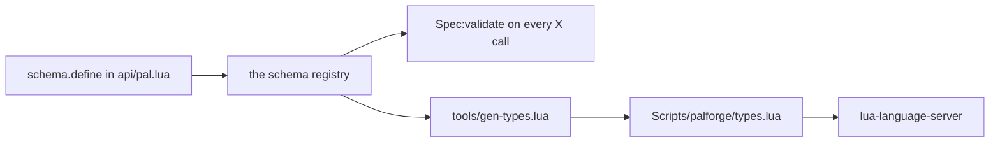

コンテンツパックはただの Lua です。PalForge にビルド手順も IDE プラグインも必要ありません。
[lua-language-server](https://github.com/LuaLS/lua-language-server)（LuaLS）に PalForge の
`Scripts` ディレクトリを見せるだけで、すべての `X{ ... }` 呼び出しが、定義時にバリデータが
強制するのと同じ説明つきでフィールドを補完するようになります。

## types.lua とは

`Scripts/palforge/types.lua` は生成された LuaLS の型定義ファイルです。中身はアノテーション
だけで、api が受け取るすべての形について `---@class` と `---@alias` を宣言しており、実行され
るステートメントは 1 行もありません。ヘッダに `---@meta` が入っているため LuaLS はこのファイル
を型の記述として扱い、フレームワーク側がこれを require することは一切ありません。

```lua title="Scripts/palforge/types.lua"
-- PalForge type definitions — GENERATED, do not edit.
--
-- Regenerate with:  lua5.4 tools/gen-types.lua
-- Source of truth:  the schema declarations in Scripts/palforge/api/*.lua
---@meta

---@alias Mesh.Spec.Kind "procedural"|"static"|"skeletal"|"obj"
---@class Mesh.Spec
---@field id? string # mesh id, e.g. "pack:name" (required when defined directly; omit when inline)
---@field kind? Mesh.Spec.Kind # which core.mesh backend renders it (default skeletal)
---@field model string # USkeletalMesh / UStaticMesh asset path
```

現在このファイルには、宣言済みのスペックごとに 1 つずつ、18 個のクラスが入っています。
`Pal.Spec`、`Pal.Spec.Events`、`Pal.Spec.Material`、`Item.Spec`、`Item.Spec.Recipe`、
`Item.Spec.Events`、`Building.Spec`、`Building.Spec.Mesh`、`Building.Spec.Material`、
`Building.Spec.Events`、`Skill.Spec`、`Skill.Spec.Events`、`Effect.Spec`、
`Effect.Spec.Events`、`Audio.Spec`、`UI.Spec`、`Mesh.Spec`、`Coord` です。

<Callout type="info">
`types.lua` を削除すると壊れるのは補完だけです。ゲームはこのファイルを読みませんし、
`Pal{ ... }` の検証結果もあるとき・ないときで完全に同じです。検証は
`Scripts/palforge/api/*.lua` のスキーマ宣言に対して行われ、このファイルもその宣言から生成
されています。
</Callout>

## 言語サーバーに Scripts を見せる

LuaLS から `Scripts/palforge/` が*見えている*必要があります。`.luarc.json` をどこに置くかは、
PalForge のチェックアウト内で編集しているか、自分のパック用フォルダで編集しているかで
変わります。

<Tabs items={['パック専用フォルダ', 'PalForge リポジトリ内']}>
<Tab value="パック専用フォルダ">

`.luarc.json` をパックのルートに置き、PalForge の `Scripts` ディレクトリをライブラリとして
追加します。パスはこのファイルからの相対です。

```json title=".luarc.json"
{
    "runtime.version": "Lua 5.4",
    "workspace.library": [
        "../PalForge/Scripts"
    ],
    "diagnostics.globals": [
        "FindFirstOf", "FindAllOf", "StaticFindObject", "LoadAsset",
        "RegisterHook", "RegisterKeyBind", "RegisterConsoleCommandHandler",
        "ExecuteInGameThread", "LoopAsync", "FName", "Key"
    ]
}
```

絶対パスも使えます。パックを UE4SS の mods ツリーに置き、PalForge を別の場所にチェック
アウトしている場合はこちらが向いています。

```json title=".luarc.json"
{
    "workspace.library": [
        "C:/games/Palworld/Pal/Binaries/Win64/ue4ss/Mods/PalForge/Scripts"
    ]
}
```

</Tab>
<Tab value="PalForge リポジトリ内">

`Scripts` はすでにワークスペースに入っているので、`workspace.library` に足すものはありま
せん。意味があるのはランタイムのバージョンと、フレームワーク自身が呼ぶ UE4SS のグローバル
だけです。

```json title=".luarc.json"
{
    "runtime.version": "Lua 5.4",
    "diagnostics.globals": [
        "FindFirstOf", "FindAllOf", "StaticFindObject", "LoadAsset",
        "RegisterHook", "RegisterKeyBind", "RegisterConsoleCommandHandler",
        "ExecuteInGameThread", "LoopAsync", "FName", "Key"
    ]
}
```

</Tab>
</Tabs>

リポジトリのチェックアウトには、ディスク上に残されたデッドコードのディレクトリが 2 つ
あります。`Scripts/palforge/deprecated/` と `Scripts/palforge/tmp/` です。どちらも
gitignore 対象なのでリリース版には含まれませんが、手元にある場合は古い定義が補完に混ざら
ないよう除外してください。

```json title=".luarc.json"
{
    "workspace.ignoreDir": [
        "Scripts/palforge/deprecated",
        "Scripts/palforge/tmp"
    ]
}
```

## エディタに出るもの

パック側のファイルに import するものはありません。api を require するとむき出しのグローバル
が入り、`api/init.lua` がそれぞれにモジュール型を注釈しているため、`Pal`、`Item`、
`Building`、`Skill`、`Effect`、`Audio`、`Mesh`、`UI`、`Player` は `local` なしで解決されます。

```lua title="Scripts/palforge/api/init.lua"
---@type palforge.pal
_G.Pal = Pal
```

各モジュールは `---@overload` つきで宣言されており、これがモジュールそのものの呼び出しを
型のついた呼び出しにしています。

```lua title="Scripts/palforge/api/pal.lua"
---@class palforge.pal
---@overload fun(spec: Pal.Spec): Pal.Handle
local Pal = {}
```

**設定前** — `Scripts` がワークスペースの外にあると `Pal.Spec` は何にも解決されず、波かっこ
はただの無名テーブルです。

```text
Pal{
    |            no suggestions; a typo like displayName surfaces only when the game runs
}
```

**設定後** — 補完リストは `Pal.Spec` のフィールド一覧そのもので、宣言順に並び、スキーマが
宣言したドキュメント文字列がそれぞれに付きます。

```text
Pal{
    |
    id           string                  pal id: a game CharacterID ("ChickenPal") or "pack:name"
    name         string?                 shown in UI (defaults to id)
    description  string?                 one-line description, for UI and tooling
    skills       string[]?               skill ids this pal owns (see Skill)
    mesh         Mesh.Spec|Mesh.Handle?  the mesh attached to a spawned pawn (inline, or a Mesh{ ... } handle)
    material     Pal.Spec.Material?      material override applied to that mesh
    color        table?                  base tint { r, g, b, a } (shorthand for material.color)
    texture      string?                 png path applied to the mesh (shorthand for material.texture)
    icon         any?                    fallback icon used when the DataTable lookup misses
    events       Pal.Spec.Events?        lifecycle handlers (grouped)
    data         table?                  free-form payload of your own, carried onto the definition
}
```

ここで一度に 4 つのことが手に入ります。

- **各フィールドとその説明。** `---@field` 行の `#` の後ろのテキストは、スキーマ宣言の
  `doc =` 文字列そのものです。`maxStack` にホバーすれば *inventory stack ceiling
  (default 1)* が出て、デフォルト値も含まれます。
- **列挙値のエイリアス。** `values` リストを持つフィールドは、スペック名とフィールド名から
  名付けられた専用のエイリアスになります。生成されるファイルには 5 つあり、
  `Mesh.Spec.Kind`、`Item.Spec.Category`、`Building.Spec.Mesh.Kind`、`Skill.Spec.Kind`、
  `Audio.Spec.Kind` です。`kind =` の後で引用符を打つと、
  `"procedural"`、`"static"`、`"skeletal"`、`"obj"` だけが候補に出ます。
- **ネストした形の両方の書き方。** `mesh` の型は `Mesh.Spec|Mesh.Handle` です。バリデータが
  インラインのテーブルと、`Mesh{ ... }` 呼び出しが返したハンドルの両方を受け取るからです。
- **ハンドルのメソッド。** `Pal{ ... }` は `Pal.Handle` を返すので、`pal:` と打てば `spawn`、
  `renderOn`、`skillsOf`、`mesh`、`iconOf`、`name`、`description`、そしてイベントの
  フォワーダが、`api/pal.lua` でそれぞれの上に書かれたコメントつきで出ます。

```lua title="content/pals.lua"
local pal = Pal{
    id          = "example:Boss",
    name        = "Boss",
    description = "the one that greets you",
    mesh        = Mesh{
        id    = "example:body",
        kind  = "skeletal",                 -- completes to the four Mesh.Spec.Kind values
        model = "/Game/Pal/Model/Character/Monster/ChickenPal/SK_ChickenPal",
    },
    events = {                              -- completes to Pal.Spec.Events, five handlers
        onSpawned = function(pal, ctx)      -- pal is a Pal.Handle, so pal: completes
            pal:renderOn(ctx.actor)
        end,
    },
}

pal:spawn(Player.coordinate())              -- Player.coordinate returns Coord?
```

ハンドルの型は生成物ではなく、メソッドが実装されている場所に手書きされています。
`Pal.Handle` は `api/pal.lua`、`Building.Handle` と `Building.Instance` は
`api/building.lua`、という具合です。だからビルディングのハンドラではインスタンスの
フィールドが補完されます。

```lua title="content/buildings.lua"
Building{
    id    = "example:Beacon",
    state = { charges = 3 },
    events = {
        onRightClick = function(inst, ctx)  -- inst is a Building.Instance
            inst.state.charges = inst.state.charges - 1
            inst:save()                     -- .actor .pos .state .buildId .key all complete
        end,
    },
}
```

## types.lua を再生成する

ジェネレータは開発用ツールです。ゲームがなくても素の Lua インタプリタで動きます。

```bash
cd /path/to/PalForge
lua5.4 tools/gen-types.lua
```

```text
wrote ./Scripts/palforge/types.lua (18 classes, 223 lines)
```

書き出し先は、渡したルート（既定はカレントディレクトリ）からの相対で
`Scripts/palforge/types.lua` です。別の場所から実行することもできます。

```bash
lua5.4 tools/gen-types.lua /path/to/PalForge
```

`schema.define` や `schema.derive` の呼び出しが変わったら、そのつど再実行してください。
フィールドの追加、`values` の追加、`default` の変更、`doc` の書き換え、いずれもです。
`types.lua` はリポジトリにコミットされているので、再生成したファイルはスキーマ変更と同じ
コミットに含めます。

<Callout type="warn">
`types.lua` を手で編集しないでください。次にジェネレータを実行した時点でファイル全体が
上書きされます。`Scripts/palforge/api/*.lua` の `schema.define` を変更して再生成します。
</Callout>

## 定義がずれない理由

ジェネレータは `types.lua` を読みませんし、フィールド一覧の 2 つ目のコピーも持っていません。
`palforge.api` を require することで全部の形をスキーマレジストリに載せ、そのうえで
`schema.all()` を辿ります。定義呼び出しのたびに `Spec:validate` が使うのと、まったく同じ
スペックオブジェクトです。



したがって、エディタが提示するフィールドはバリデータが受け付けるフィールドであり、
バリデータが弾くフィールドが補完に現れることはありません。各ディスクリプタが生成行に
及ぼす効果は次のとおりです。

| スキーマのディスクリプタ | 生成されるアノテーション |
| --- | --- |
| `required = true` | `?` の付かないフィールド名 |
| `default = "material"` | 説明の末尾に `(default material)` を追加 |
| `values = { "active", "passive" }` | `---@alias Skill.Spec.Kind "active"\|"passive"` |
| `of = Recipe`（ネストしたスペック） | そのスペック名、つまり `Item.Spec.Recipe`。ハンドルを名乗っていれば `Mesh.Spec\|Mesh.Handle` |
| `arrayOf = "string"` | `string[]` |
| `mapOf = "number"` | `table<string, number>` |
| `sig = "fun(self: Pal.Handle, ctx: table)"` | そのシグネチャをそのまま |
| `doc = "..."` | `#` の後ろのテキスト |
| `check = schema.nonEmpty` | 何も出ません。check は定義時にだけ走ります |
| `type` なし | `any` |

知っておくとよい帰結が 2 つあります。

- `schema.derive` で宣言したスペックは、独自のクラスと独自のエイリアスを持ちます。
  `Building.Spec.Mesh` は `Mesh.Spec` に 3 つのフィールド単位の上書き — `kind` の既定値を
  `"skeletal"` から `"static"` へ、`model` と `offset` の説明の書き換え — を加えたものなので、
  同じ 4 つの値を持ち既定値の記述だけが違う `Building.Spec.Mesh.Kind` が生成されます。
- クラスは宣言順に出力され、スペック名の最初のセグメントでグループ化されます。だから
  `Mesh.Spec` は `Mesh` の見出しの下に並び、ドメイン接頭辞を持たない `Coord` は
  `Common` に入ります。

## UE4SS のグローバルの扱い

`FindFirstOf`、`FindAllOf`、`StaticFindObject`、`LoadAsset`、`RegisterHook`、
`RegisterKeyBind`、`RegisterConsoleCommandHandler`、`ExecuteInGameThread`、`LoopAsync`、
`FName`、`Key` は UE4SS が実行時に注入します。どの Lua ファイルにも存在しないため、列挙して
おかない限り LuaLS は未定義のグローバルとして報告します。上の `diagnostics.globals` はその
ためのものです。

ジェネレータ側の扱いは違います。ゲームの外で api モジュールを実際に*動かす*必要があるので、
何かを読み込む前に同じ一覧をスタブします。

```lua title="tools/gen-types.lua"
for _, name in ipairs({ "FindFirstOf", "FindAllOf", "StaticFindObject", "LoadAsset",
                        "RegisterHook", "RegisterKeyBind", "RegisterConsoleCommandHandler",
                        "ExecuteInGameThread", "LoopAsync" }) do
    _G[name] = function() return nil end
end
_G.FName = function(s) return { ToString = function() return s end } end
_G.Key = {}
```

api モジュールを require してもテーブルが組み立てられるだけなので、スタブが呼ばれることは
ありません。一緒に読み込まれるネイティブ側が、名前が存在することだけを期待しています。

UE4SS の Lua 型定義を持っているなら、そのフォルダも `workspace.library` に追加し、対応する
名前を `diagnostics.globals` から外してください。何も表示されない代わりに、実際のシグネチャ
が出るようになります。PalForge はその型定義を同梱していません。

## 同じ情報を実行時に読む

エディタはあくまで便宜的なもので、情報源そのものではありません。すべてのスペックは実行中
のゲームからもスキーマレジストリ経由で読めます。キーバインドやコンソールハンドラから、
あるいは検証エラーの原因を切り分けている最中に役立ちます。

```lua
local schema = require("palforge.core.schema")

print(schema.help("Pal.Spec"))                -- printable field list
local fields = schema.get("Pal.Spec").fields  -- the same as an ordered array, for tooling
local specs  = schema.all()                   -- every declared spec, in declaration order
```

`schema.help` はフィールドを宣言順に 1 行ずつ出力します。

```text
Pal.Spec {
  id            string     (required) pal id: a game CharacterID ("ChickenPal") or "pack:name"
  name          string     shown in UI (defaults to id)
  description   string     one-line description, for UI and tooling
  skills        table      (string[]) skill ids this pal owns (see Skill)
  mesh          table      (Mesh.Spec) the mesh attached to a spawned pawn (inline, or a Mesh{ ... } handle)
  material      table      (Pal.Spec.Material) material override applied to that mesh
  color         table      base tint { r, g, b, a } (shorthand for material.color)
  texture       string     png path applied to the mesh (shorthand for material.texture)
  icon          any        fallback icon used when the DataTable lookup misses
  events        table      (Pal.Spec.Events) lifecycle handlers (grouped)
  data          table      free-form payload of your own, carried onto the definition
}
```

宣言されていない名前を渡すと、宣言済みの名前一覧が返ってきます。

```text
PalForge: no spec named "Pal.Events". Declared: Audio.Spec, Building.Spec, Building.Spec.Events, Building.Spec.Material, Building.Spec.Mesh, Coord, Effect.Spec, Effect.Spec.Events, Item.Spec, Item.Spec.Events, Item.Spec.Recipe, Mesh.Spec, Pal.Spec, Pal.Spec.Events, Pal.Spec.Material, Skill.Spec, Skill.Spec.Events, UI.Spec
```

同じ情報の 3 つ目の出どころはバリデータ自身です。問題はすべてハードエラーで、ドメイン名、
フィールド名、そして有効な選択肢を挙げてくれます。つまり読み込みに成功したパックは綴りが
正しかったということです。

```text
PalForge: Pal: unknown field "displayName" (did you mean "name"?). Valid fields: id, name, description, skills, mesh, material, color, texture, icon, events, data
PalForge: Pal: field "id" is required (pal id: a game CharacterID ("ChickenPal") or "pack:name")
PalForge: Pal: field "mesh" (Mesh.Spec): field "kind" must be one of { "procedural", "static", "skeletal", "obj" }, got "voxel"
PalForge: Pal: field "mesh" (Mesh.Spec): field "model" is required (USkeletalMesh / UStaticMesh asset path)
```

## レシピ

### パックのフォルダをゼロから用意する

<Steps>

<Step>
### PalForge の隣にパックを置く

```text
mods/
  PalForge/
    Scripts/
      main.lua
      palforge/
  MyPack/
    .luarc.json
    content/
      pals.lua
```
</Step>

<Step>
### .luarc.json を書く

```json title="MyPack/.luarc.json"
{
    "runtime.version": "Lua 5.4",
    "workspace.library": [
        "../PalForge/Scripts"
    ],
    "diagnostics.globals": [
        "FindFirstOf", "FindAllOf", "StaticFindObject", "LoadAsset",
        "RegisterHook", "RegisterKeyBind", "RegisterConsoleCommandHandler",
        "ExecuteInGameThread", "LoopAsync", "FName", "Key"
    ]
}
```
</Step>

<Step>
### コンテンツを書いて補完を確認する

```lua title="MyPack/content/pals.lua"
local pal = Pal{
    id     = "ChickenPal",
    name   = "Lookout Chicken",
    skills = { "example:Screech" },
    events = {
        onCaptured = function(pal, ctx)
            Item.get("Berries"):give(3)
        end,
    },
}

return pal
```

`Pal` も `Item` も `require` は不要です。`api/init.lua` がグローバルとして設置し、それぞれ
に注釈を付けているので、LuaLS はライブラリパス越しにそれを拾います。
</Step>

</Steps>

### スペックを変えたら再生成する

フィールドの追加は宣言 1 つとコマンド 1 つです。その形を所有しているモジュールで宣言します。

```lua title="Scripts/palforge/api/skill.lua"
local Spec = schema.define("Skill.Spec", {
    { "id",          type = "string", required = true, check = schema.nonEmpty,
                     doc = "skill id: a game row id or \"pack:name\"" },
    { "name",        type = "string", doc = "shown in skill lists (defaults to id)" },
    { "description", type = "string", doc = "one-line description, for UI and tooling" },
    { "kind",        type = "string", values = { "active", "passive" }, default = "active",
                     doc = "an active skill is fired; a passive one is equipped" },
    -- element, cooldown, power, icon, events, data unchanged
    { "range",       type = "number", doc = "metres the skill reaches" },   -- new
})
```

そのうえで再生成し、両方のファイルをコミットします。

```bash
lua5.4 tools/gen-types.lua
git add Scripts/palforge/api/skill.lua Scripts/palforge/types.lua
```

クラスは宣言順に出力されるので新しいアノテーションは最後に並び、`range` は `Skill{ ... }` に
受け付けられるのと同時にエディタからも提示されます。

```lua title="Scripts/palforge/types.lua"
---@alias Skill.Spec.Kind "active"|"passive"
---@class Skill.Spec
---@field id string # skill id: a game row id or "pack:name"
---@field name? string # shown in skill lists (defaults to id)
---@field description? string # one-line description, for UI and tooling
---@field kind? Skill.Spec.Kind # an active skill is fired; a passive one is equipped (default active)
---@field element? string # attribute / element (fire, water, ...)
---@field cooldown? number # seconds between activations (enforced by :activate)
---@field power? number # base power / magnitude
---@field icon? any # fallback icon used when the DataTable lookup misses
---@field events? Skill.Spec.Events # behaviour handlers (grouped)
---@field data? table # free-form payload of your own, carried onto the definition
---@field range? number # metres the skill reaches
```

### 宣言済みのすべての形を UE4SS のログに出す

エディタから離れているときや、原因を探しに来たエラーのすぐ隣にフィールド一覧が欲しいときに
使えます。

```lua title="MyPack/content/dev.lua"
local schema = require("palforge.core.schema")
local event  = require("palforge.core.event")
local log    = require("palforge.utils.log").scope("mypack")

event.on("world.ready", function()
    for _, spec in ipairs(schema.all()) do
        log.info(spec.name .. "  (" .. #spec.fields .. " fields)")
    end
    log.info(schema.help("Building.Spec"))
end)
```

各行は `[PalForge.mypack][info] ...` の形で出ます。全部を出さずに 1 つの形だけを見たい
場合は、ディスクリプタを自分で走査します。

```lua
local schema = require("palforge.core.schema")

for _, f in ipairs(schema.get("Effect.Spec").fields) do
    print(string.format("%-12s %-8s %s%s",
        f.name,
        f.type or "any",
        f.required and "required " or "",
        f.doc or ""))
end
```

形が補完されるようになったら、各フィールドの意味はドメインごとのページ
（[Pal](/docs/api/pal)、[Mesh](/docs/api/mesh)）を、ディスクリプタキーとそこから出るエラーは
[フィールドと検証](/docs/concepts/schema)を、宣言したハンドラのうち実際に発火するのはどれかは
[ライフサイクルとイベント](/docs/concepts/lifecycle)を参照してください。
