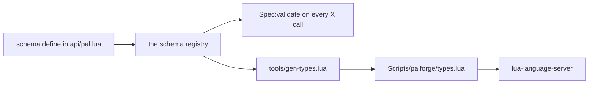

A content pack is plain Lua. Nothing about PalForge needs a build step or an IDE plugin: you
point [lua-language-server](https://github.com/LuaLS/lua-language-server) (LuaLS) at
PalForge's `Scripts` directory and every `X{ ... }` call starts completing its fields with
the same documentation the validator enforces at define time.

## What types.lua is

`Scripts/palforge/types.lua` is a generated LuaLS definition file. It is annotations only —
it declares `---@class` and `---@alias` for every shape the api accepts, and contains no
executable statements. Its header carries `---@meta`, which tells LuaLS the file describes
types rather than runtime code, and nothing in the framework ever requires it.

```lua title="Scripts/palforge/types.lua"
-- PalForge type definitions — GENERATED, do not edit.
--
-- Regenerate with:  lua5.4 tools/gen-types.lua
-- Source of truth:  the schema declarations in Scripts/palforge/api/*.lua
---@meta

---@alias Mesh.Spec.Kind "procedural"|"static"|"skeletal"|"obj"
---@class Mesh.Spec
---@field id? string # mesh id, e.g. "pack:name" (required when defined directly; omit when inline)
---@field kind? Mesh.Spec.Kind # which core.mesh backend renders it (default skeletal)
---@field model string # USkeletalMesh / UStaticMesh asset path
```

The file currently holds 18 classes, one per declared spec: `Pal.Spec`, `Pal.Spec.Events`,
`Pal.Spec.Material`, `Item.Spec`, `Item.Spec.Recipe`, `Item.Spec.Events`, `Building.Spec`,
`Building.Spec.Mesh`, `Building.Spec.Material`, `Building.Spec.Events`, `Skill.Spec`,
`Skill.Spec.Events`, `Effect.Spec`, `Effect.Spec.Events`, `Audio.Spec`, `UI.Spec`,
`Mesh.Spec` and `Coord`.

<Callout type="info">
Deleting `types.lua` breaks completion and nothing else. The game does not read it, and
`Pal{ ... }` validates exactly the same with or without it — validation runs off the schema
declarations in `Scripts/palforge/api/*.lua`, which is also what the file is generated from.
</Callout>

## Point the language server at Scripts

LuaLS needs to *see* `Scripts/palforge/`. Where you put `.luarc.json` depends on whether you
are editing inside the PalForge checkout or in a pack folder of your own.

<Tabs items={['Separate pack folder', 'Inside the PalForge repo']}>
<Tab value="Separate pack folder">

Put `.luarc.json` at the root of your pack and add PalForge's `Scripts` directory as a
library. The path is relative to the file.

```json title=".luarc.json"
{
    "runtime.version": "Lua 5.4",
    "workspace.library": [
        "../PalForge/Scripts"
    ],
    "diagnostics.globals": [
        "FindFirstOf", "FindAllOf", "StaticFindObject", "LoadAsset",
        "RegisterHook", "RegisterKeyBind", "RegisterConsoleCommandHandler",
        "ExecuteInGameThread", "LoopAsync", "FName", "Key"
    ]
}
```

An absolute path works too, and is what you want when your pack lives in the UE4SS mods tree
while PalForge is checked out somewhere else:

```json title=".luarc.json"
{
    "workspace.library": [
        "C:/games/Palworld/Pal/Binaries/Win64/ue4ss/Mods/PalForge/Scripts"
    ]
}
```

</Tab>
<Tab value="Inside the PalForge repo">

`Scripts` is already in the workspace, so there is nothing to add to `workspace.library`.
The only settings that matter are the runtime version and the UE4SS globals the framework
itself calls.

```json title=".luarc.json"
{
    "runtime.version": "Lua 5.4",
    "diagnostics.globals": [
        "FindFirstOf", "FindAllOf", "StaticFindObject", "LoadAsset",
        "RegisterHook", "RegisterKeyBind", "RegisterConsoleCommandHandler",
        "ExecuteInGameThread", "LoopAsync", "FName", "Key"
    ]
}
```

</Tab>
</Tabs>

A repo checkout keeps two directories of dead code on disk, `Scripts/palforge/deprecated/`
and `Scripts/palforge/tmp/`. Both are gitignored, so a released copy will not have them; when
yours does, exclude them so their stale definitions stay out of completion:

```json title=".luarc.json"
{
    "workspace.ignoreDir": [
        "Scripts/palforge/deprecated",
        "Scripts/palforge/tmp"
    ]
}
```

## What the editor shows

Nothing is imported into your pack file. Requiring the api installs the bare globals, and
`api/init.lua` annotates each one with its module type, so `Pal`, `Item`, `Building`,
`Skill`, `Effect`, `Audio`, `Mesh`, `UI` and `Player` resolve without a `local`:

```lua title="Scripts/palforge/api/init.lua"
---@type palforge.pal
_G.Pal = Pal
```

Each module is declared with an `---@overload`, which is what makes calling the module
itself a typed call:

```lua title="Scripts/palforge/api/pal.lua"
---@class palforge.pal
---@overload fun(spec: Pal.Spec): Pal.Handle
local Pal = {}
```

**Before** — with `Scripts` outside the workspace, `Pal.Spec` resolves to nothing, so the
braces are just an anonymous table:

```text
Pal{
    |            no suggestions; a typo like displayName surfaces only when the game runs
}
```

**After** — the completion list is the field list of `Pal.Spec`, in declaration order, each
carrying the doc string the schema declared:

```text
Pal{
    |
    id           string                  pal id: a game CharacterID ("ChickenPal") or "pack:name"
    name         string?                 shown in UI (defaults to id)
    description  string?                 one-line description, for UI and tooling
    skills       string[]?               skill ids this pal owns (see Skill)
    mesh         Mesh.Spec|Mesh.Handle?  the mesh attached to a spawned pawn (inline, or a Mesh{ ... } handle)
    material     Pal.Spec.Material?      material override applied to that mesh
    color        table?                  base tint { r, g, b, a } (shorthand for material.color)
    texture      string?                 png path applied to the mesh (shorthand for material.texture)
    icon         any?                    fallback icon used when the DataTable lookup misses
    events       Pal.Spec.Events?        lifecycle handlers (grouped)
    data         table?                  free-form payload of your own, carried onto the definition
}
```

That covers four things at once:

- **Every field with its doc.** The text after `#` in a `---@field` line is the `doc =`
  string from the schema declaration, so hovering `maxStack` shows *inventory stack ceiling
  (default 1)* — the default included.
- **Enumerated values as aliases.** A field with a `values` list becomes its own alias, named
  after the spec and the field. The generated file holds five: `Mesh.Spec.Kind`,
  `Item.Spec.Category`, `Building.Spec.Mesh.Kind`, `Skill.Spec.Kind` and `Audio.Spec.Kind`.
  Typing a quote after `kind =` offers exactly
  `"procedural"`, `"static"`, `"skeletal"`, `"obj"` and nothing else.
- **Nested shapes both ways.** `mesh` is typed `Mesh.Spec|Mesh.Handle`, because the validator
  accepts an inline table *or* the handle a `Mesh{ ... }` call returned.
- **Handle methods.** `Pal{ ... }` returns a `Pal.Handle`, so `pal:` offers `spawn`,
  `renderOn`, `skillsOf`, `mesh`, `iconOf`, `name`, `description` and the event forwarders,
  each with the doc comment written above it in `api/pal.lua`.

```lua title="content/pals.lua"
local pal = Pal{
    id          = "example:Boss",
    name        = "Boss",
    description = "the one that greets you",
    mesh        = Mesh{
        id    = "example:body",
        kind  = "skeletal",                 -- completes to the four Mesh.Spec.Kind values
        model = "/Game/Pal/Model/Character/Monster/ChickenPal/SK_ChickenPal",
    },
    events = {                              -- completes to Pal.Spec.Events, five handlers
        onSpawned = function(pal, ctx)      -- pal is a Pal.Handle, so pal: completes
            pal:renderOn(ctx.actor)
        end,
    },
}

pal:spawn(Player.coordinate())              -- Player.coordinate returns Coord?
```

Handle types are hand-written where the methods live, not generated: `Pal.Handle` is declared
in `api/pal.lua`, `Building.Handle` and `Building.Instance` in `api/building.lua`, and so on.
That is why a building handler completes on instance fields:

```lua title="content/buildings.lua"
Building{
    id    = "example:Beacon",
    state = { charges = 3 },
    events = {
        onRightClick = function(inst, ctx)  -- inst is a Building.Instance
            inst.state.charges = inst.state.charges - 1
            inst:save()                     -- .actor .pos .state .buildId .key all complete
        end,
    },
}
```

## Regenerating types.lua

The generator is a dev tool. It runs on a plain Lua interpreter with the game absent:

```bash
cd /path/to/PalForge
lua5.4 tools/gen-types.lua
```

```text
wrote ./Scripts/palforge/types.lua (18 classes, 223 lines)
```

It writes `Scripts/palforge/types.lua` relative to the root you give it, defaulting to the
current directory, so you can also run it from elsewhere:

```bash
lua5.4 tools/gen-types.lua /path/to/PalForge
```

Re-run it whenever a `schema.define` or `schema.derive` call changes: a new field, a new
`values` entry, a changed `default`, a reworded `doc`. `types.lua` is checked in, so the
regenerated file is part of the same commit as the schema change.

<Callout type="warn">
Do not edit `types.lua` by hand. The next run of the generator overwrites the whole file.
Change the `schema.define` call in `Scripts/palforge/api/*.lua` and regenerate.
</Callout>

## Why it cannot drift

The generator does not read `types.lua` and does not carry a second copy of the field lists.
It requires `palforge.api`, which is what puts every shape into the schema registry, then
walks `schema.all()` — the exact same spec objects that `Spec:validate` runs against on every
define call.



A field the editor offers is therefore a field the validator accepts, and a field the
validator rejects can never appear in completion. Each descriptor has a fixed effect on the
generated line:

| Schema descriptor | Generated annotation |
| --- | --- |
| `required = true` | the field name without `?` |
| `default = "material"` | `(default material)` appended to the doc |
| `values = { "active", "passive" }` | a `---@alias Skill.Spec.Kind "active"\|"passive"` |
| `of = Recipe` — a nested spec | that spec's name, `Item.Spec.Recipe`, or `Mesh.Spec\|Mesh.Handle` when it names a handle |
| `arrayOf = "string"` | `string[]` |
| `mapOf = "number"` | `table<string, number>` |
| `sig = "fun(self: Pal.Handle, ctx: table)"` | that signature verbatim |
| `doc = "..."` | the text after `#` |
| `check = schema.nonEmpty` | nothing — a check runs at define time only |
| no `type` | `any` |

Two consequences worth knowing:

- A spec declared with `schema.derive` gets its own class and its own aliases. `Building.Spec.Mesh`
  is `Mesh.Spec` with three per-field overrides — `kind` defaulting to `"static"` instead of
  `"skeletal"`, and reworded `model` and `offset` docs — so it emits
  `Building.Spec.Mesh.Kind` with the same four values and a different documented default.
- Classes are emitted in declaration order and grouped by the first segment of the spec name,
  which is why `Mesh.Spec` sits under a `Mesh` banner and `Coord`, having no domain prefix,
  lands under `Common`.

## How the UE4SS globals are handled

`FindFirstOf`, `FindAllOf`, `StaticFindObject`, `LoadAsset`, `RegisterHook`, `RegisterKeyBind`,
`RegisterConsoleCommandHandler`, `ExecuteInGameThread`, `LoopAsync`, `FName` and `Key` are
injected by UE4SS at runtime. They exist in no Lua file, so LuaLS reports them as undefined
globals unless you list them — that is what the `diagnostics.globals` block above is for.

The generator handles them differently, because it has to *run* the api modules outside the
game. It stubs the same list before loading anything:

```lua title="tools/gen-types.lua"
for _, name in ipairs({ "FindFirstOf", "FindAllOf", "StaticFindObject", "LoadAsset",
                        "RegisterHook", "RegisterKeyBind", "RegisterConsoleCommandHandler",
                        "ExecuteInGameThread", "LoopAsync" }) do
    _G[name] = function() return nil end
end
_G.FName = function(s) return { ToString = function() return s end } end
_G.Key = {}
```

Requiring an api module only builds tables, so the stubs are never called; the natives pulled
in alongside them just expect the names to exist.

If you have a copy of the UE4SS Lua type definitions, add its folder to `workspace.library`
as well and drop the corresponding names from `diagnostics.globals` — the annotations then
give you real signatures instead of silence. PalForge does not ship those definitions.

## The same information at runtime

The editor is a convenience, not the source. Every spec is readable in the running game
through the schema registry, which is useful from a keybind, a console handler, or while
bisecting a validation error.

```lua
local schema = require("palforge.core.schema")

print(schema.help("Pal.Spec"))                -- printable field list
local fields = schema.get("Pal.Spec").fields  -- the same as an ordered array, for tooling
local specs  = schema.all()                   -- every declared spec, in declaration order
```

`schema.help` prints one line per field, in declaration order:

```text
Pal.Spec {
  id            string     (required) pal id: a game CharacterID ("ChickenPal") or "pack:name"
  name          string     shown in UI (defaults to id)
  description   string     one-line description, for UI and tooling
  skills        table      (string[]) skill ids this pal owns (see Skill)
  mesh          table      (Mesh.Spec) the mesh attached to a spawned pawn (inline, or a Mesh{ ... } handle)
  material      table      (Pal.Spec.Material) material override applied to that mesh
  color         table      base tint { r, g, b, a } (shorthand for material.color)
  texture       string     png path applied to the mesh (shorthand for material.texture)
  icon          any        fallback icon used when the DataTable lookup misses
  events        table      (Pal.Spec.Events) lifecycle handlers (grouped)
  data          table      free-form payload of your own, carried onto the definition
}
```

A name that was never declared answers with the list of names that were:

```text
PalForge: no spec named "Pal.Events". Declared: Audio.Spec, Building.Spec, Building.Spec.Events, Building.Spec.Material, Building.Spec.Mesh, Coord, Effect.Spec, Effect.Spec.Events, Item.Spec, Item.Spec.Events, Item.Spec.Recipe, Mesh.Spec, Pal.Spec, Pal.Spec.Events, Pal.Spec.Material, Skill.Spec, Skill.Spec.Events, UI.Spec
```

The third source of the same information is the validator itself. Every problem is a hard
error naming the domain, the field and the valid alternatives, so a pack that loads at all
was spelled correctly:

```text
PalForge: Pal: unknown field "displayName" (did you mean "name"?). Valid fields: id, name, description, skills, mesh, material, color, texture, icon, events, data
PalForge: Pal: field "id" is required (pal id: a game CharacterID ("ChickenPal") or "pack:name")
PalForge: Pal: field "mesh" (Mesh.Spec): field "kind" must be one of { "procedural", "static", "skeletal", "obj" }, got "voxel"
PalForge: Pal: field "mesh" (Mesh.Spec): field "model" is required (USkeletalMesh / UStaticMesh asset path)
```

## Recipes

### A pack folder set up from scratch

<Steps>

<Step>
### Lay the pack out next to PalForge

```text
mods/
  PalForge/
    Scripts/
      main.lua
      palforge/
  MyPack/
    .luarc.json
    content/
      pals.lua
```
</Step>

<Step>
### Write .luarc.json

```json title="MyPack/.luarc.json"
{
    "runtime.version": "Lua 5.4",
    "workspace.library": [
        "../PalForge/Scripts"
    ],
    "diagnostics.globals": [
        "FindFirstOf", "FindAllOf", "StaticFindObject", "LoadAsset",
        "RegisterHook", "RegisterKeyBind", "RegisterConsoleCommandHandler",
        "ExecuteInGameThread", "LoopAsync", "FName", "Key"
    ]
}
```
</Step>

<Step>
### Write content and watch it complete

```lua title="MyPack/content/pals.lua"
local pal = Pal{
    id     = "ChickenPal",
    name   = "Lookout Chicken",
    skills = { "example:Screech" },
    events = {
        onCaptured = function(pal, ctx)
            Item.get("Berries"):give(3)
        end,
    },
}

return pal
```

`Pal`, `Item` and the rest need no `require` — `api/init.lua` installs them as globals and
annotates each one, and LuaLS picks that up from the library path.
</Step>

</Steps>

### Change a spec, then regenerate

Adding a field is one declaration plus one command. Declare it in the module that owns the
shape:

```lua title="Scripts/palforge/api/skill.lua"
local Spec = schema.define("Skill.Spec", {
    { "id",          type = "string", required = true, check = schema.nonEmpty,
                     doc = "skill id: a game row id or \"pack:name\"" },
    { "name",        type = "string", doc = "shown in skill lists (defaults to id)" },
    { "description", type = "string", doc = "one-line description, for UI and tooling" },
    { "kind",        type = "string", values = { "active", "passive" }, default = "active",
                     doc = "an active skill is fired; a passive one is equipped" },
    -- element, cooldown, power, icon, events, data unchanged
    { "range",       type = "number", doc = "metres the skill reaches" },   -- new
})
```

Then regenerate and commit both files:

```bash
lua5.4 tools/gen-types.lua
git add Scripts/palforge/api/skill.lua Scripts/palforge/types.lua
```

Classes are emitted in declaration order, so the new annotation lands last, and `range` is
simultaneously accepted by `Skill{ ... }` and offered by the editor:

```lua title="Scripts/palforge/types.lua"
---@alias Skill.Spec.Kind "active"|"passive"
---@class Skill.Spec
---@field id string # skill id: a game row id or "pack:name"
---@field name? string # shown in skill lists (defaults to id)
---@field description? string # one-line description, for UI and tooling
---@field kind? Skill.Spec.Kind # an active skill is fired; a passive one is equipped (default active)
---@field element? string # attribute / element (fire, water, ...)
---@field cooldown? number # seconds between activations (enforced by :activate)
---@field power? number # base power / magnitude
---@field icon? any # fallback icon used when the DataTable lookup misses
---@field events? Skill.Spec.Events # behaviour handlers (grouped)
---@field data? table # free-form payload of your own, carried onto the definition
---@field range? number # metres the skill reaches
```

### Dump every declared shape to the UE4SS log

Useful when you are away from the editor and want the field list in the log next to the error
that sent you looking for it.

```lua title="MyPack/content/dev.lua"
local schema = require("palforge.core.schema")
local event  = require("palforge.core.event")
local log    = require("palforge.utils.log").scope("mypack")

event.on("world.ready", function()
    for _, spec in ipairs(schema.all()) do
        log.info(spec.name .. "  (" .. #spec.fields .. " fields)")
    end
    log.info(schema.help("Building.Spec"))
end)
```

Each line arrives as `[PalForge.mypack][info] ...`. To inspect one shape without printing all
of them, walk the descriptors yourself:

```lua
local schema = require("palforge.core.schema")

for _, f in ipairs(schema.get("Effect.Spec").fields) do
    print(string.format("%-12s %-8s %s%s",
        f.name,
        f.type or "any",
        f.required and "required " or "",
        f.doc or ""))
end
```

Once the shapes are completing, the per-domain pages describe what each field does —
[Pal](/docs/api/pal), [Mesh](/docs/api/mesh) —
[Fields and validation](/docs/concepts/schema) covers every descriptor key and the errors
they produce, and [Lifecycle and events](/docs/concepts/lifecycle) covers which of the
declared handlers actually fire.
