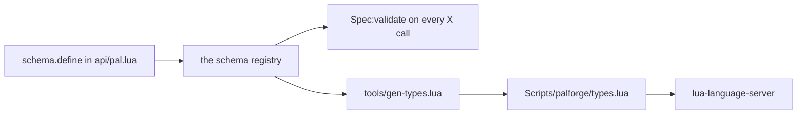

## What you can do after this page

- Have your editor list every setting a pal, item or building takes, while you type it
- See what each setting means, and what it falls back to when you leave it out
- Catch a misspelled setting in the editor instead of finding out when the game loads
- Choose from the allowed values on settings that only accept a few
- Print the same list from inside the running game, when you are away from your editor

A content pack is plain Lua files. Nothing to compile, no editor plugin to install.

You only have to show one program where PalForge lives:
[lua-language-server](https://github.com/LuaLS/lua-language-server), usually called LuaLS —
the background program your editor uses to understand Lua. Point it at PalForge's `Scripts`
folder and every `Pal{ ... }`, `Item{ ... }` or `Building{ ... }` you write starts suggesting
its fields. A field is one line inside the braces, like `name =` or `mesh =`. Each suggestion
carries the same description PalForge checks against when it loads your pack.

## Set your editor up

LuaLS has to be able to *see* the folder `Scripts/palforge/`. You tell it where to look in a
file called `.luarc.json`. Where that file goes depends on whether you keep your pack in its
own folder or write inside the PalForge folder itself.

<Tabs items={['Separate pack folder', 'Inside the PalForge repo']}>
<Tab value="Separate pack folder">

Put `.luarc.json` at the top of your pack folder and list PalForge's `Scripts` directory as a
library. The path is relative to the `.luarc.json` file.

```json title=".luarc.json"
{
    "runtime.version": "Lua 5.4",
    "workspace.library": [
        "../PalForge/Scripts"
    ],
    "diagnostics.globals": [
        "FindFirstOf", "FindAllOf", "StaticFindObject", "LoadAsset",
        "RegisterHook", "RegisterKeyBind", "RegisterConsoleCommandHandler",
        "ExecuteInGameThread", "LoopAsync", "FName", "Key"
    ]
}
```

A full path works too. Use one when your pack sits in the UE4SS mods folder and your copy of
PalForge lives somewhere else on disk:

```json title=".luarc.json"
{
    "workspace.library": [
        "C:/games/Palworld/Pal/Binaries/Win64/ue4ss/Mods/PalForge/Scripts"
    ]
}
```

</Tab>
<Tab value="Inside the PalForge repo">

`Scripts` is already open in your editor, so there is nothing to add to
`workspace.library`. Set the Lua version, and list the names UE4SS hands the framework at
runtime so the editor stops underlining them.

```json title=".luarc.json"
{
    "runtime.version": "Lua 5.4",
    "diagnostics.globals": [
        "FindFirstOf", "FindAllOf", "StaticFindObject", "LoadAsset",
        "RegisterHook", "RegisterKeyBind", "RegisterConsoleCommandHandler",
        "ExecuteInGameThread", "LoopAsync", "FName", "Key"
    ]
}
```

</Tab>
</Tabs>

Some copies of PalForge carry two extra folders on disk, `Scripts/palforge/deprecated/` and
`Scripts/palforge/tmp/`. They are left out of releases, so you may not have them at all. If
you do, tell the editor to skip them, or their stale definitions turn up in your suggestions:

```json title=".luarc.json"
{
    "workspace.ignoreDir": [
        "Scripts/palforge/deprecated",
        "Scripts/palforge/tmp"
    ]
}
```

## What the editor shows you

You do not import anything into your pack file. `Pal`, `Item`, `Building`, `Skill`, `Effect`,
`Audio`, `Mesh`, `UI` and `Player` are already there as globals, and each one is labelled with
its type, so you can use them without writing a `local`:

```lua title="Scripts/palforge/api/init.lua"
---@type palforge.pal
_G.Pal = Pal
```

The `---@overload` line on each module is what makes the braces complete — it tells the editor
that `Pal{ ... }` takes a `Pal.Spec`, an optional second `opts` table
(`{ register = false, pack = "mypack" }`), and hands back a `Pal.Handle`:

```lua title="Scripts/palforge/api/pal.lua"
---@class palforge.pal
---@overload fun(spec: Pal.Spec, opts: table?): Pal.Handle
local Pal = {}
```

**Before** — with `Scripts` outside your workspace, the editor has never heard of `Pal.Spec`,
so the braces are just a table with nothing to offer:

```text
Pal{
    |            no suggestions; a typo like displayName surfaces only when the game runs
}
```

**After** — the suggestion list is the field list of `Pal.Spec`, in the order the fields were
declared, each with its description:

```text
Pal{
    |
    id           string                  pal id: a game CharacterID ("ChickenPal") or "pack:name"
    name         string?                 shown in UI (defaults to id)
    description  string?                 one-line description, for UI and tooling
    skills       string[]?               skill ids this pal owns (see Skill)
    mesh         Mesh.Spec|Mesh.Handle?  the mesh worn by a spawned pawn (inline, or a Mesh{ ... } handle); attached automatically on pal.spawned
    material     Pal.Spec.Material?      material override applied to that mesh
    color        table?                  base tint { r, g, b, a } (shorthand for material.color)
    texture      string?                 png path applied to the mesh (shorthand for material.texture)
    icon         string?                 /Game/... texture path used when the icon DataTable has no row for this id
    events       Pal.Spec.Events?        lifecycle handlers (grouped)
    data         table?                  free-form payload of your own, carried onto the definition
}
```

You get four things at once:

- **Every field with its description.** The text after `#` in a `---@field` line is the
  `doc =` string from the spec declaration, so hovering `maxStack` shows *stack ceiling you
  declare; the GAME's ceiling is a DataTable column (default 1)* — the default value
  included.
- **A short menu where only a few values are allowed.** A field with a `values` list gets its
  own named type, and there are **30** of them. Five come from the domain specs —
  `Mesh.Spec.Kind`, `Item.Spec.Category`, `Building.Spec.Mesh.Kind`, `Skill.Spec.Kind`,
  `Audio.Spec.Kind` — and the other 25 from `api/ui.lua`: `UI.Spec.Input`,
  `UI.Node.Button.LabelAlign`, `UI.Node.Sprite.From`, and an `HAlign` / `VAlign` pair on each
  of the eleven node constructors. Typing a quote after `kind =` in a mesh offers exactly
  `"procedural"`, `"static"`, `"skeletal"`, `"obj"` and nothing else.
- **Nested shapes, written either way.** `mesh` is typed `Mesh.Spec|Mesh.Handle`, because you
  can write the mesh inline *or* pass what a `Mesh{ ... }` call gave you back.
- **What you can do with the result.** `Pal{ ... }` hands you back a `Pal.Handle`, so typing
  `pal:` offers `spawn`, `renderOn`, `skillsOf`, `mesh`, `iconOf`, `name`, `description` and
  the event forwarders, each with the comment written above it in `api/pal.lua`.

```lua title="content/pals.lua"
local pal = Pal{
    id          = "example:Boss",
    name        = "Boss",
    description = "the one that greets you",
    mesh        = Mesh{
        id    = "example:body",
        kind  = "skeletal",                 -- completes to the four Mesh.Spec.Kind values
        model = "/Game/Pal/Model/Character/Monster/ChickenPal/SK_ChickenPal",
    },
    events = {                              -- completes to Pal.Spec.Events, five handlers
        onSpawned = function(pal, ctx)      -- pal is a Pal.Handle, so pal: completes
            pal:renderOn(ctx.actor)
        end,
    },
}

pal:spawn(Player.coordinate())              -- Player.coordinate returns Coord?
```

The types for handles and building instances are written by hand, next to the methods
themselves: `Pal.Handle` in `api/pal.lua`, `Building.Handle` and `Building.Instance` in
`api/building.lua`, and so on. That is why a building handler completes on the instance too:

```lua title="content/buildings.lua"
Building{
    id    = "example:Beacon",
    state = { charges = 3 },
    events = {
        onRightClick = function(inst, ctx)  -- inst is a Building.Instance
            inst.state.charges = inst.state.charges - 1
            inst:save()                     -- .actor .pos .state .buildId .key all complete
        end,
    },
}
```

## The file that carries the suggestions

`Scripts/palforge/types.lua` is where all of that completion text comes from. It is a
definition file for LuaLS: descriptions only, no code that runs. It declares a `---@class` and
a `---@alias` for every shape the api accepts. The `---@meta` line at the top tells LuaLS the
file describes types rather than real code, and nothing in the framework loads it.

```lua title="Scripts/palforge/types.lua"
-- PalForge type definitions — GENERATED, do not edit.
--
-- Regenerate with:  lua5.4 tools/gen-types.lua
-- Source of truth:  the schema declarations in Scripts/palforge/api/*.lua
--
-- Annotations only: nothing requires this file at runtime. It exists so an editor
-- (LuaLS / lua-language-server) can complete the fields of every X{ ... } call,
-- show each field's meaning, and jump from a spec name to its field list.
---@meta

---@alias Mesh.Spec.Kind "procedural"|"static"|"skeletal"|"obj"
---@class Mesh.Spec
---@field id? string # mesh id, e.g. "pack:name" (required when defined directly; omit when inline)
---@field kind? Mesh.Spec.Kind # which core.mesh backend renders it (default skeletal)
---@field model string # a /Game/... USkeletalMesh or UStaticMesh path (see Mesh.assets); for procedural / obj, an .obj file path - absolute, or relative to the .lua file that declares it
```

The file holds **38 classes and 30 aliases**, and it is long: the generator reports 8759
lines. Thirty-one of the classes are the declared shapes, one per name `schema.all()`
returns — `Mesh.Spec`, `Pal.Spec` with its `Events` and `Material`, `Item.Spec` with its
`Recipe`, `Events` and `Restores`, the four `Building.Spec.*`, `Skill.Spec` and its
`Events`, `Effect.Spec` and its `Events`, `Audio.Spec`, the eleven `UI.Node.*` node shapes,
`UI.Spec` and `UI.Spec.Host`, and `Coord`.

The remaining seven, and almost all of the length, are the **native content catalogs**:
`palforge.native.buildings`, `.items`, `.pals`, `.skills`, `.effects`, `.audio` and the
`palforge.native` table that holds them. `native.items.Arrow_Fire` is served at runtime by
a metatable `__index` (`native/_catalog.lua`), and an editor cannot see through a
metatable, so the generator enumerates the names from the catalogs themselves — 8293 of
them on this build. That is what makes a native id something you can discover by typing
rather than something you have to already know.

<Callout type="info">
Deleting `types.lua` breaks completion and nothing else. The game does not read it, and
`Pal{ ... }` is checked exactly the same with or without it — the check runs off the spec
declarations in `Scripts/palforge/api/*.lua`, which is also where the file comes from.
</Callout>

## Regenerating types.lua

Run the generator whenever a spec changes. It is a dev tool, it runs on a plain Lua
interpreter with the game closed, and it needs nothing but the repo:

```bash
cd /path/to/PalForge
lua5.4 tools/gen-types.lua
```

It prints one line, and that line is the whole result:

```text
wrote ./Scripts/palforge/types.lua (38 classes, 8759 lines, 8293 native catalog names)
```

`classes` counts the `---@class` lines it wrote, `lines` is the length of the file it
wrote, and `native catalog names` is how many `native.*` fields it enumerated out of the
catalogs. The file is overwritten whole every run.

The argument is the repo ROOT, not the output path. Given none it uses the folder you are
standing in, so it always writes `<root>/Scripts/palforge/types.lua`:

```bash
lua5.4 tools/gen-types.lua /path/to/PalForge
```

It reaches the specs by `require`-ing `palforge.api`, which is what puts every shape into
the schema registry, and then walks `schema.all()`. A catalog it cannot load is skipped
with a `gen-types: skipping <module>` line on stderr rather than aborting the run, so a
short `native catalog names` count is the sign that something failed to load.

Re-run it whenever a `schema.define` or `schema.derive` call changes: a new field, a new
allowed value, a changed default, a reworded description — and whenever a native catalog is
regenerated. `types.lua` is committed to the repo, so the regenerated file belongs in the
same commit as the change that moved it.

<Callout type="warn">
Do not edit `types.lua` by hand. The next run of the generator rewrites the whole file.
Change the `schema.define` call in `Scripts/palforge/api/*.lua` and regenerate.
</Callout>

## Why the suggestions always match the game

Your editor reads `types.lua`. The game reads the spec declarations in
`Scripts/palforge/api/*.lua`. Those are not two lists to keep in step: the generator loads
`palforge.api`, which puts every shape into the schema registry, then walks `schema.all()` —
the same spec objects `Spec:validate` runs against on every definition call.



So a field the editor offers is a field the game accepts, and a field the game rejects can
never appear in the suggestion list. Each part of a field declaration has a fixed effect on
the line the generator writes:

| Schema descriptor | Generated annotation |
| --- | --- |
| `required = true` | the field name without `?` |
| `default = "material"` | `(default material)` appended to the doc |
| `values = { "active", "passive" }` | a `---@alias Skill.Spec.Kind "active"\|"passive"` |
| `of = Recipe` — a nested spec | that spec's name, `Item.Spec.Recipe`, or `Mesh.Spec\|Mesh.Handle` when it names a handle |
| `arrayOf = "string"` | `string[]` |
| `mapOf = "number"` | `table<string, number>` |
| `sig = "fun(self: Pal.Handle, ctx: table)"` | that signature verbatim |
| `doc = "..."` | the text after `#` |
| `check = schema.validId` | nothing — a check runs at define time only |
| no `type` | `any` |

Two things worth knowing:

- A shape declared with `schema.derive` gets its own class and its own value lists.
  `Building.Spec.Mesh` is `Mesh.Spec` with three fields adjusted — `kind` defaulting to
  `"static"` instead of `"skeletal"`, and clearer wording on `model` and `offset` — so it
  emits `Building.Spec.Mesh.Kind` with the same four values and a different stated default.
- Classes come out in declaration order, grouped by the first part of the shape's name. That
  is why `Mesh.Spec` sits under a `Mesh` banner, and `Coord`, which has no domain prefix,
  lands under `Common`. The native catalog classes come last, after every declared shape.

## The names UE4SS adds while the game runs

`FindFirstOf`, `FindAllOf`, `StaticFindObject`, `LoadAsset`, `RegisterHook`, `RegisterKeyBind`,
`RegisterConsoleCommandHandler`, `ExecuteInGameThread`, `LoopAsync`, `FName` and `Key` come
from UE4SS, the mod loader PalForge runs on. They live in no Lua file, so LuaLS marks them as
undefined until you list them — that is what the `diagnostics.globals` block above is for.

The generator deals with them another way, because it has to actually *run* the api modules
with the game closed. It puts a do-nothing stand-in behind each name before loading anything:

```lua title="tools/gen-types.lua"
for _, name in ipairs({ "FindFirstOf", "FindAllOf", "StaticFindObject", "LoadAsset",
                        "RegisterHook", "RegisterKeyBind", "RegisterConsoleCommandHandler",
                        "ExecuteInGameThread", "LoopAsync" }) do
    _G[name] = function() return nil end
end
_G.FName = function(s) return { ToString = function() return s end } end
_G.Key = {}
```

Loading an api module only builds tables, so the stand-ins are never called; the game-facing
files pulled in alongside them just need the names to exist.

If you have a copy of the UE4SS Lua type definitions, add that folder to `workspace.library`
as well and drop the matching names from `diagnostics.globals`. You then get real signatures
for them instead of silence. PalForge does not ship those definitions.

## The same list inside the game

You can read every shape from the running game as well, which helps from a keybind, a console
command, or while you are tracking down a validation error:

```lua
local schema = require("palforge.core.schema")

print(schema.help("Pal.Spec"))                -- printable field list
local fields = schema.get("Pal.Spec").fields  -- the same as an ordered array, for tooling
local specs  = schema.all()                   -- every declared spec, in declaration order
```

`schema.help` prints one line per field, in declaration order:

```text
Pal.Spec {
  id            string     (required) pal id: a game CharacterID ("ChickenPal") or "pack:name"
  name          string     shown in UI (defaults to id)
  description   string     one-line description, for UI and tooling
  skills        table      (string[]) skill ids this pal owns (see Skill)
  mesh          table      (Mesh.Spec) the mesh worn by a spawned pawn (inline, or a Mesh{ ... } handle); attached automatically on pal.spawned
  material      table      (Pal.Spec.Material) material override applied to that mesh
  color         table      base tint { r, g, b, a } (shorthand for material.color)
  texture       string     png path applied to the mesh (shorthand for material.texture)
  icon          string     /Game/... texture path used when the icon DataTable has no row for this id
  events        table      (Pal.Spec.Events) lifecycle handlers (grouped)
  data          table      free-form payload of your own, carried onto the definition
}
```

Ask for a name that was never declared and you get the list of names that were:

```text
PalForge: no spec named "Pal.Events". Declared: Audio.Spec, Building.Spec, Building.Spec.Events, Building.Spec.Material, Building.Spec.Mesh, Coord, Effect.Spec, Effect.Spec.Events, Item.Spec, Item.Spec.Events, Item.Spec.Recipe, Mesh.Spec, Pal.Spec, Pal.Spec.Events, Pal.Spec.Material, Skill.Spec, Skill.Spec.Events, UI.Node.Border, UI.Node.Button, UI.Node.Frame, UI.Node.GameWidget, UI.Node.HBox, UI.Node.Label, UI.Node.Overlay, UI.Node.ScrollBox, UI.Node.SizeBox, UI.Node.Sprite, UI.Node.VBox, UI.Spec, UI.Spec.Host
```

The errors themselves are the third place the same information shows up. Every problem stops
the load and names the domain, the field and the valid alternatives, so a pack that loads at
all was spelled correctly:

```text
PalForge: Pal: unknown field "displayName" (did you mean "name"?). Valid fields: id, name, description, skills, mesh, material, color, texture, icon, events, data
PalForge: Pal: field "id" is required (pal id: a game CharacterID ("ChickenPal") or "pack:name")
PalForge: Pal: field "mesh" (Mesh.Spec): field "kind" must be one of { "procedural", "static", "skeletal", "obj" }, got "voxel"
PalForge: Pal: field "mesh" (Mesh.Spec): field "model" is required (a /Game/... USkeletalMesh or UStaticMesh path (see Mesh.assets); for procedural / obj, an .obj file path - absolute, or relative to the .lua file that declares it)
PalForge: Pal: field "id" is invalid: invalid pack id 'my-pack' in 'my-pack:Boss' (letters/digits/_ only)
```

## Recipes

### A pack folder set up from scratch

<Steps>

<Step>
### Lay the pack out next to PalForge

```text
mods/
  PalForge/
    Scripts/
      main.lua
      palforge/
  MyPack/
    .luarc.json
    content/
      pals.lua
```
</Step>

<Step>
### Write .luarc.json

```json title="MyPack/.luarc.json"
{
    "runtime.version": "Lua 5.4",
    "workspace.library": [
        "../PalForge/Scripts"
    ],
    "diagnostics.globals": [
        "FindFirstOf", "FindAllOf", "StaticFindObject", "LoadAsset",
        "RegisterHook", "RegisterKeyBind", "RegisterConsoleCommandHandler",
        "ExecuteInGameThread", "LoopAsync", "FName", "Key"
    ]
}
```
</Step>

<Step>
### Write content and watch it complete

```lua title="MyPack/content/pals.lua"
local pal = Pal{
    id     = "ChickenPal",
    name   = "Lookout Chicken",
    skills = { "example:Screech" },
    events = {
        onCaptured = function(pal, ctx)
            Item.get("Berries"):give(3)
        end,
    },
}

return pal
```

`Pal`, `Item` and the rest need no `require`. They are installed as globals and labelled with
their types by `api/init.lua`, and LuaLS picks that up through the library path.
</Step>

</Steps>

### Change a spec, then regenerate

Adding a field is one declaration plus one command. Declare it in the module that owns the
shape:

```lua title="Scripts/palforge/api/skill.lua"
local Spec = schema.define("Skill.Spec", {
    { "id",          type = "string", required = true, check = schema.validId,
                     doc = "skill id: a game row id or \"pack:name\"" },
    { "name",        type = "string", doc = "shown in skill lists (defaults to id)" },
    { "description", type = "string", doc = "one-line description, for UI and tooling" },
    { "kind",        type = "string", values = { "active", "passive" }, default = "active",
                     doc = "an active skill is fired; a passive one is equipped" },
    -- element, cooldown, power, icon, events, data unchanged
    { "range",       type = "number", doc = "metres the skill reaches" },   -- new
})
```

Then regenerate and commit both files:

```bash
lua5.4 tools/gen-types.lua
git add Scripts/palforge/api/skill.lua Scripts/palforge/types.lua
```

Classes come out in declaration order, so the new line lands last, and `range` is accepted by
`Skill{ ... }` and offered by the editor at the same time:

```lua title="Scripts/palforge/types.lua"
---@alias Skill.Spec.Kind "active"|"passive"
---@class Skill.Spec
---@field id string # skill id: a game row id or "pack:name"
---@field name? string # shown in skill lists (defaults to id)
---@field description? string # one-line description, for UI and tooling
---@field kind? Skill.Spec.Kind # an active skill is fired; a passive one is equipped (default active)
---@field element? string # attribute / element (fire, water, ...). AUTHOR METADATA: stored and handed back, read by nothing
---@field cooldown? number # seconds between activations (enforced by :activate)
---@field power? number # base power / magnitude. AUTHOR METADATA: stored and handed back, read by nothing
---@field icon? string # /Game/... texture path used when the icon DataTable has no row for this id
---@field events? Skill.Spec.Events # behaviour handlers (grouped)
---@field data? table # free-form payload of your own, carried onto the definition
---@field range? number # metres the skill reaches
```

### Dump every declared shape to the UE4SS log

Useful when you are away from the editor and want the field list in the log, right next to the
error that sent you looking for it.

```lua title="MyPack/content/dev.lua"
local schema = require("palforge.core.schema")
local event  = require("palforge.core.event")
local log    = require("palforge.utils.log").scope("mypack")

event.on("world.ready", function()
    for _, spec in ipairs(schema.all()) do
        log.info(spec.name .. "  (" .. #spec.fields .. " fields)")
    end
    log.info(schema.help("Building.Spec"))
end)
```

Each line arrives as `[PalForge.mypack][info] ...`. To look at one shape without printing all
of them, walk the field descriptors yourself:

```lua
local schema = require("palforge.core.schema")

for _, f in ipairs(schema.get("Effect.Spec").fields) do
    print(string.format("%-12s %-8s %s%s",
        f.name,
        f.type or "any",
        f.required and "required " or "",
        f.doc or ""))
end
```

## Summary

- Add PalForge's `Scripts` folder to `workspace.library` in `.luarc.json`, and every
  `X{ ... }` call completes its fields with the description the game checks against.
- List the UE4SS names (`FindFirstOf`, `LoadAsset`, `RegisterHook`, ...) in
  `diagnostics.globals` so the editor stops calling them undefined.
- `Scripts/palforge/types.lua` carries the completions. Never edit it by hand; run
  `lua5.4 tools/gen-types.lua` after any spec change and commit both files.
- A field the editor offers is a field the game accepts, because both come from the same spec
  declarations in `Scripts/palforge/api/*.lua`.
- Away from the editor, `schema.help("Pal.Spec")` prints the same field list in the game, and
  every validation error names the field and the valid alternatives.

Next, [Fields and validation](/docs/concepts/schema) explains every descriptor key and the
errors it produces; the per-domain pages such as [Pal](/docs/api/pal) and
[Mesh](/docs/api/mesh) say what each field actually does, and
[Lifecycle and events](/docs/concepts/lifecycle) says which handlers really fire.
