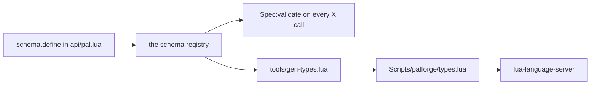

## 读完本页你可以做到

- 一边打字，一边让编辑器列出帕鲁、道具或建筑物能填的每一项设置
- 看到每一项设置的含义，以及不写它时会退回到什么默认值
- 在编辑器里就发现写错的设置名，而不是等游戏加载时才知道
- 在只接受少数几个取值的设置上，从允许的值里挑一个
- 离开编辑器的时候，在运行中的游戏里打印出同一份列表

内容包就是普通的 Lua 文件。不用编译，也不用装编辑器插件。

你只需要把 PalForge 的位置告诉一个程序：
[lua-language-server](https://github.com/LuaLS/lua-language-server)，通常叫 LuaLS ——
它是编辑器用来理解 Lua 的后台程序。把它指向 PalForge 的 `Scripts` 文件夹，之后你写的每个
`Pal{ ... }`、`Item{ ... }` 或 `Building{ ... }` 都会开始提示自己的字段。字段就是花括号里的
一行，比如 `name =` 或 `mesh =`。每条提示带的说明，和 PalForge 加载内容包时用来核对的说明是
同一份。

## 设置你的编辑器

LuaLS 必须能*看到* `Scripts/palforge/` 这个文件夹。你在一个叫 `.luarc.json` 的文件里告诉它
去哪里找。这个文件放在哪儿，取决于你是把包放在自己的文件夹里，还是直接在 PalForge 的文件夹
里写。

<Tabs items={['独立的包文件夹', 'PalForge 仓库内']}>
<Tab value="独立的包文件夹">

把 `.luarc.json` 放在包文件夹的最上层，并把 PalForge 的 `Scripts` 目录列为库。路径相对于
`.luarc.json` 文件本身。

```json title=".luarc.json"
{
    "runtime.version": "Lua 5.4",
    "workspace.library": [
        "../PalForge/Scripts"
    ],
    "diagnostics.globals": [
        "FindFirstOf", "FindAllOf", "StaticFindObject", "LoadAsset",
        "RegisterHook", "RegisterKeyBind", "RegisterConsoleCommandHandler",
        "ExecuteInGameThread", "LoopAsync", "FName", "Key"
    ]
}
```

写完整路径也可以。如果你的包放在 UE4SS 的 mods 文件夹里，而 PalForge 在磁盘上的另一个地方，
就用这种写法：

```json title=".luarc.json"
{
    "workspace.library": [
        "C:/games/Palworld/Pal/Binaries/Win64/ue4ss/Mods/PalForge/Scripts"
    ]
}
```

</Tab>
<Tab value="PalForge 仓库内">

`Scripts` 已经在你的编辑器里打开了，所以 `workspace.library` 不用加任何东西。设置好 Lua
版本，再列出 UE4SS 在运行时交给框架的那些名字，编辑器就不会再给它们画下划线。

```json title=".luarc.json"
{
    "runtime.version": "Lua 5.4",
    "diagnostics.globals": [
        "FindFirstOf", "FindAllOf", "StaticFindObject", "LoadAsset",
        "RegisterHook", "RegisterKeyBind", "RegisterConsoleCommandHandler",
        "ExecuteInGameThread", "LoopAsync", "FName", "Key"
    ]
}
```

</Tab>
</Tabs>

有些 PalForge 副本在磁盘上还带着两个额外的文件夹，`Scripts/palforge/deprecated/` 和
`Scripts/palforge/tmp/`。它们不包含在发行版里，所以你手上可能根本没有。如果有，就让编辑器
跳过它们，否则里面过时的定义会混进你的提示：

```json title=".luarc.json"
{
    "workspace.ignoreDir": [
        "Scripts/palforge/deprecated",
        "Scripts/palforge/tmp"
    ]
}
```

## 编辑器会给你看什么

你不用在包文件里 import 任何东西。`Pal`、`Item`、`Building`、`Skill`、`Effect`、`Audio`、
`Mesh`、`UI` 和 `Player` 本来就作为全局变量放在那里，而且每个都标好了类型，不写 `local`
也能直接用：

```lua title="Scripts/palforge/api/init.lua"
---@type palforge.pal
_G.Pal = Pal
```

花括号里之所以能补全，靠的是每个模块上的 `---@overload` 那一行 —— 它告诉编辑器
`Pal{ ... }` 接收一个 `Pal.Spec`、一个可选的第二参数 `opts`
（`{ register = false, pack = "mypack" }`），返回一个 `Pal.Handle`：

```lua title="Scripts/palforge/api/pal.lua"
---@class palforge.pal
---@overload fun(spec: Pal.Spec, opts: table?): Pal.Handle
local Pal = {}
```

**设置前** —— `Scripts` 在工作区之外时，编辑器从没听说过 `Pal.Spec`，花括号就只是一张普通的
表，提不出任何东西：

```text
Pal{
    |            no suggestions; a typo like displayName surfaces only when the game runs
}
```

**设置后** —— 提示列表就是 `Pal.Spec` 的字段列表，按字段声明的顺序排列，每条都带着自己的
说明：

```text
Pal{
    |
    id           string                  pal id: a game CharacterID ("ChickenPal") or "pack:name"
    name         string?                 shown in UI (defaults to id)
    description  string?                 one-line description, for UI and tooling
    skills       string[]?               skill ids this pal owns (see Skill)
    mesh         Mesh.Spec|Mesh.Handle?  the mesh worn by a spawned pawn (inline, or a Mesh{ ... } handle); attached automatically on pal.spawned
    material     Pal.Spec.Material?      material override applied to that mesh
    color        table?                  base tint { r, g, b, a } (shorthand for material.color)
    texture      string?                 png path applied to the mesh (shorthand for material.texture)
    icon         string?                 /Game/... texture path used when the icon DataTable has no row for this id
    events       Pal.Spec.Events?        lifecycle handlers (grouped)
    data         table?                  free-form payload of your own, carried onto the definition
}
```

你一下子拿到四样东西：

- **每个字段和它的说明。** `---@field` 行里 `#` 后面的文字，就是规格声明中的 `doc =`
  字符串，所以把鼠标停在 `maxStack` 上会显示 *stack ceiling you declare; the GAME's ceiling
  is a DataTable column (default 1)* —— 默认值也包含在内。
- **只允许几个取值的字段，会给出一份很短的菜单。** 带 `values` 列表的字段会有自己的具名类型，
  一共 **30 个**。五个来自各领域的规格：`Mesh.Spec.Kind`、`Item.Spec.Category`、
  `Building.Spec.Mesh.Kind`、`Skill.Spec.Kind` 和 `Audio.Spec.Kind`；另外 25 个来自
  `api/ui.lua`：`UI.Spec.Input`、`UI.Node.Button.LabelAlign`、`UI.Node.Sprite.From`，
  以及十一个节点构造器各自的一对 `HAlign` / `VAlign`。
  在网格里的 `kind =` 后面打一个引号，出现的正好是
  `"procedural"`、`"static"`、`"skeletal"`、`"obj"`，没有别的。
- **嵌套的结构，两种写法都认。** `mesh` 的类型是 `Mesh.Spec|Mesh.Handle`，因为你既可以就地
  写这个网格，*也可以*把 `Mesh{ ... }` 调用返回的东西传进去。
- **拿到结果之后能做什么。** `Pal{ ... }` 返回给你一个 `Pal.Handle`，所以输入 `pal:` 会提示
  `spawn`、`renderOn`、`skillsOf`、`mesh`、`iconOf`、`name`、`description` 和那些事件转发
  方法，每个都带着 `api/pal.lua` 里写在它上面的注释。

```lua title="content/pals.lua"
local pal = Pal{
    id          = "example:Boss",
    name        = "Boss",
    description = "the one that greets you",
    mesh        = Mesh{
        id    = "example:body",
        kind  = "skeletal",                 -- completes to the four Mesh.Spec.Kind values
        model = "/Game/Pal/Model/Character/Monster/ChickenPal/SK_ChickenPal",
    },
    events = {                              -- completes to Pal.Spec.Events, five handlers
        onSpawned = function(pal, ctx)      -- pal is a Pal.Handle, so pal: completes
            pal:renderOn(ctx.actor)
        end,
    },
}

pal:spawn(Player.coordinate())              -- Player.coordinate returns Coord?
```

句柄和建筑物实例的类型是手写的，就写在方法本身旁边：`Pal.Handle` 在 `api/pal.lua` 里，
`Building.Handle` 和 `Building.Instance` 在 `api/building.lua` 里，其余照此类推。所以建筑物的
处理函数里，实例那一侧也能补全：

```lua title="content/buildings.lua"
Building{
    id    = "example:Beacon",
    state = { charges = 3 },
    events = {
        onRightClick = function(inst, ctx)  -- inst is a Building.Instance
            inst.state.charges = inst.state.charges - 1
            inst:save()                     -- .actor .pos .state .buildId .key all complete
        end,
    },
}
```

## 装着这些提示的文件

所有补全文字都来自 `Scripts/palforge/types.lua`。它是给 LuaLS 用的定义文件：里面只有说明，
没有会运行的代码。api 接受的每一种结构，它都声明了一个 `---@class` 和一个 `---@alias`。
开头的 `---@meta` 行告诉 LuaLS 这个文件描述的是类型而不是真正的代码，框架本身不会加载它。

```lua title="Scripts/palforge/types.lua"
-- PalForge type definitions — GENERATED, do not edit.
--
-- Regenerate with:  lua5.4 tools/gen-types.lua
-- Source of truth:  the schema declarations in Scripts/palforge/api/*.lua
--
-- Annotations only: nothing requires this file at runtime. It exists so an editor
-- (LuaLS / lua-language-server) can complete the fields of every X{ ... } call,
-- show each field's meaning, and jump from a spec name to its field list.
---@meta

---@alias Mesh.Spec.Kind "procedural"|"static"|"skeletal"|"obj"
---@class Mesh.Spec
---@field id? string # mesh id, e.g. "pack:name" (required when defined directly; omit when inline)
---@field kind? Mesh.Spec.Kind # which core.mesh backend renders it (default skeletal)
---@field model string # a /Game/... USkeletalMesh or UStaticMesh path (see Mesh.assets); for procedural / obj, an .obj file path - absolute, or relative to the .lua file that declares it
```

文件里有 **38 个类和 30 个别名**，而且它很长：生成器报的是 8759 行。其中 31 个类是已声明的
结构，和 `schema.all()` 返回的名字一一对应：`Mesh.Spec`，`Pal.Spec` 及其 `Events`、
`Material`，`Item.Spec` 及其 `Recipe`、`Events`、`Restores`，四个 `Building.Spec.*`，`Skill.Spec` 及其
`Events`，`Effect.Spec` 及其 `Events`，`Audio.Spec`，十一个 `UI.Node.*`，`UI.Spec` 和
`UI.Spec.Host`，以及 `Coord`。

剩下的 7 个类，以及绝大部分行数，是**原生内容目录**：`palforge.native.buildings`、`.items`、
`.pals`、`.skills`、`.effects`、`.audio`，加上把它们装在一起的 `palforge.native`。
`native.items.Arrow_Fire` 在运行时由元表的 `__index` 提供（`native/_catalog.lua`），而编辑器
看不穿元表，所以生成器直接从目录本身把这些名字列举出来 —— 这个版本上是 8293 个。原生 id
之所以是打字就能发现的东西，而不是必须事先知道的东西，靠的就是这一段。

<Callout type="info">
删掉 `types.lua` 只会让补全失效，别的什么都不会坏。游戏不读它，有没有它，`Pal{ ... }`
受到的检查完全一样 —— 检查依据的是 `Scripts/palforge/api/*.lua` 里的规格声明，而这个文件
也正是从那里来的。
</Callout>

## 重新生成 types.lua

规格一有变动就运行生成器。它是开发用的工具，在游戏关着的情况下用普通的 Lua 解释器就能跑，
除了仓库本身什么都不需要：

```bash
cd /path/to/PalForge
lua5.4 tools/gen-types.lua
```

它只打印一行，那一行就是全部结果：

```text
wrote ./Scripts/palforge/types.lua (38 classes, 8763 lines, 8293 native catalog names)
```

`classes` 是它写出的 `---@class` 行数，`lines` 是它写出的文件行数，`native catalog names`
是它从目录里列举出的 `native.*` 字段个数。文件每次都被整体覆盖。

参数是仓库的**根目录**，不是输出路径。不给参数就用你当前所在的文件夹，所以它总是写到
`<root>/Scripts/palforge/types.lua`：

```bash
lua5.4 tools/gen-types.lua /path/to/PalForge
```

它通过 `require` `palforge.api` 拿到规格 —— 这一步把每种结构放进 schema 注册表 —— 然后遍历
`schema.all()`。加载不了的目录不会中断整个运行，只会在标准错误上留下一行
`gen-types: skipping <module>` 被跳过，所以 `native catalog names` 偏少就是有东西没加载成功
的信号。

只要 `schema.define` 或 `schema.derive` 的调用有改动，就重新跑一次：加了字段、加了允许的值、
改了默认值、重写了说明，以及原生目录重新生成，都算。`types.lua` 是提交进仓库的，所以重新
生成的文件应该和引起改动的那次修改放在同一个提交里。

<Callout type="warn">
不要手工编辑 `types.lua`。生成器下次运行会把整个文件重写一遍。请改
`Scripts/palforge/api/*.lua` 里的 `schema.define` 调用，然后重新生成。
</Callout>

## 提示为什么总是和游戏一致

你的编辑器读 `types.lua`，游戏读 `Scripts/palforge/api/*.lua` 里的规格声明。这不是需要你手动
对齐的两份列表：生成器会加载 `palforge.api`，把每一种结构放进 schema 注册表，然后遍历
`schema.all()` —— 那就是每次定义调用时 `Spec:validate` 所依据的同一批规格对象。



所以编辑器提示出来的字段，就是游戏会接受的字段；游戏会拒绝的字段，绝不会出现在提示列表里。
字段声明的每个部分，对生成器写出的那一行都有固定的影响：

| schema 描述符 | 生成的注解 |
| --- | --- |
| `required = true` | 不带 `?` 的字段名 |
| `default = "material"` | 在说明末尾追加 `(default material)` |
| `values = { "active", "passive" }` | 一条 `---@alias Skill.Spec.Kind "active"\|"passive"` |
| `of = Recipe` —— 一个嵌套的规格 | 那个规格的名字，也就是 `Item.Spec.Recipe`；如果它指向的是句柄，则是 `Mesh.Spec\|Mesh.Handle` |
| `arrayOf = "string"` | `string[]` |
| `mapOf = "number"` | `table<string, number>` |
| `sig = "fun(self: Pal.Handle, ctx: table)"` | 原样写出这个签名 |
| `doc = "..."` | `#` 后面的文字 |
| `check = schema.validId` | 什么都不生成 —— check 只在定义时运行 |
| 没有 `type` | `any` |

有两点值得知道：

- 用 `schema.derive` 声明的结构，有自己的类和自己的取值列表。`Building.Spec.Mesh` 就是调整了
  三个字段的 `Mesh.Spec` —— `kind` 的默认值从 `"skeletal"` 改成 `"static"`，`model` 和
  `offset` 的措辞更清楚 —— 所以它生成的 `Building.Spec.Mesh.Kind` 有同样的四个值，但写明的
  默认值不同。
- 类按声明顺序输出，并按结构名的第一段分组。所以 `Mesh.Spec` 排在 `Mesh` 这个标题下面，而
  没有领域前缀的 `Coord` 落在 `Common` 里。原生目录的那几个类排在所有已声明结构之后，放在文件最末尾。

## 游戏运行时 UE4SS 加进来的名字

`FindFirstOf`、`FindAllOf`、`StaticFindObject`、`LoadAsset`、`RegisterHook`、
`RegisterKeyBind`、`RegisterConsoleCommandHandler`、`ExecuteInGameThread`、`LoopAsync`、
`FName` 和 `Key` 来自 UE4SS，也就是 PalForge 运行所在的模组加载器。它们不写在任何 Lua 文件
里，所以在你把它们列出来之前，LuaLS 会一直标记它们未定义 —— 上面那个 `diagnostics.globals`
就是干这个用的。

生成器的处理方式不一样，因为它必须在游戏关着的时候真的*运行* api 模块。它在加载任何东西之前，
先给每个名字放一个什么都不做的替身：

```lua title="tools/gen-types.lua"
for _, name in ipairs({ "FindFirstOf", "FindAllOf", "StaticFindObject", "LoadAsset",
                        "RegisterHook", "RegisterKeyBind", "RegisterConsoleCommandHandler",
                        "ExecuteInGameThread", "LoopAsync" }) do
    _G[name] = function() return nil end
end
_G.FName = function(s) return { ToString = function() return s end } end
_G.Key = {}
```

加载一个 api 模块只是在搭建表，所以这些替身永远不会被调用；跟着一起被引入的那些贴近游戏的
文件，只要求这些名字存在而已。

如果你手上有 UE4SS 的 Lua 类型定义，把那个文件夹也加进 `workspace.library`，并把对应的名字
从 `diagnostics.globals` 里去掉。这样你看到的就是它们真正的签名，而不是一片空白。PalForge
不附带这些定义。

## 在游戏里看同一份列表

每一种结构也可以从运行中的游戏里读出来。用键位绑定、控制台命令，或者在追查一个校验错误的
时候，这都很有用：

```lua
local schema = require("palforge.core.schema")

print(schema.help("Pal.Spec"))                -- printable field list
local fields = schema.get("Pal.Spec").fields  -- the same as an ordered array, for tooling
local specs  = schema.all()                   -- every declared spec, in declaration order
```

`schema.help` 按声明顺序，每个字段打印一行：

```text
Pal.Spec {
  id            string     (required) pal id: a game CharacterID ("ChickenPal") or "pack:name"
  name          string     shown in UI (defaults to id)
  description   string     one-line description, for UI and tooling
  skills        table      (string[]) skill ids this pal owns (see Skill)
  mesh          table      (Mesh.Spec) the mesh worn by a spawned pawn (inline, or a Mesh{ ... } handle); attached automatically on pal.spawned
  material      table      (Pal.Spec.Material) material override applied to that mesh
  color         table      base tint { r, g, b, a } (shorthand for material.color)
  texture       string     png path applied to the mesh (shorthand for material.texture)
  icon          string     /Game/... texture path used when the icon DataTable has no row for this id
  events        table      (Pal.Spec.Events) lifecycle handlers (grouped)
  data          table      free-form payload of your own, carried onto the definition
}
```

问一个从来没有声明过的名字，你会拿到已经声明过的名字列表：

```text
PalForge: no spec named "Pal.Events". Declared: Audio.Spec, Building.Spec, Building.Spec.Events, Building.Spec.Material, Building.Spec.Mesh, Coord, Effect.Spec, Effect.Spec.Events, Item.Spec, Item.Spec.Events, Item.Spec.Recipe, Mesh.Spec, Pal.Spec, Pal.Spec.Events, Pal.Spec.Material, Skill.Spec, Skill.Spec.Events, UI.Node.Border, UI.Node.Button, UI.Node.Frame, UI.Node.GameWidget, UI.Node.HBox, UI.Node.Label, UI.Node.Overlay, UI.Node.ScrollBox, UI.Node.SizeBox, UI.Node.Sprite, UI.Node.VBox, UI.Spec, UI.Spec.Host
```

同一份信息出现的第三个地方，就是错误本身。每一个问题都会中止加载，并说出领域、字段和有效的
备选值，所以一个能加载成功的包，名字就是拼对了的：

```text
PalForge: Pal: unknown field "displayName" (did you mean "name"?). Valid fields: id, name, description, skills, mesh, material, color, texture, icon, events, data
PalForge: Pal: field "id" is required (pal id: a game CharacterID ("ChickenPal") or "pack:name")
PalForge: Pal: field "mesh" (Mesh.Spec): field "kind" must be one of { "procedural", "static", "skeletal", "obj" }, got "voxel"
PalForge: Pal: field "mesh" (Mesh.Spec): field "model" is required (a /Game/... USkeletalMesh or UStaticMesh path (see Mesh.assets); for procedural / obj, an .obj file path - absolute, or relative to the .lua file that declares it)
PalForge: Pal: field "id" is invalid: invalid pack id 'my-pack' in 'my-pack:Boss' (letters/digits/_ only)
```

## 实用做法

### 从零搭好一个包文件夹

<Steps>

<Step>
### 把包放在 PalForge 旁边

```text
mods/
  PalForge/
    Scripts/
      main.lua
      palforge/
  MyPack/
    .luarc.json
    content/
      pals.lua
```
</Step>

<Step>
### 写 .luarc.json

```json title="MyPack/.luarc.json"
{
    "runtime.version": "Lua 5.4",
    "workspace.library": [
        "../PalForge/Scripts"
    ],
    "diagnostics.globals": [
        "FindFirstOf", "FindAllOf", "StaticFindObject", "LoadAsset",
        "RegisterHook", "RegisterKeyBind", "RegisterConsoleCommandHandler",
        "ExecuteInGameThread", "LoopAsync", "FName", "Key"
    ]
}
```
</Step>

<Step>
### 写内容，看着它补全

```lua title="MyPack/content/pals.lua"
local pal = Pal{
    id     = "ChickenPal",
    name   = "Lookout Chicken",
    skills = { "example:Screech" },
    events = {
        onCaptured = function(pal, ctx)
            Item.get("Berries"):give(3)
        end,
    },
}

return pal
```

`Pal`、`Item` 和其他这些都不需要 `require`。`api/init.lua` 把它们装成全局变量并标好了类型，
LuaLS 通过库路径就能读到。
</Step>

</Steps>

### 改了规格，再重新生成

加一个字段，就是一条声明加一条命令。在拥有这个结构的模块里声明它：

```lua title="Scripts/palforge/api/skill.lua"
local Spec = schema.define("Skill.Spec", {
    { "id",          type = "string", required = true, check = schema.validId,
                     doc = "skill id: a game row id or \"pack:name\"" },
    { "name",        type = "string", doc = "shown in skill lists (defaults to id)" },
    { "description", type = "string", doc = "one-line description, for UI and tooling" },
    { "kind",        type = "string", values = { "active", "passive" }, default = "active",
                     doc = "an active skill is fired; a passive one is equipped" },
    -- element, cooldown, power, icon, events, data unchanged
    { "range",       type = "number", doc = "metres the skill reaches" },   -- new
})
```

然后重新生成，并把两个文件一起提交：

```bash
lua5.4 tools/gen-types.lua
git add Scripts/palforge/api/skill.lua Scripts/palforge/types.lua
```

类按声明顺序输出，所以新的这一行排在最后，而 `range` 会同时被 `Skill{ ... }` 接受、被编辑器
提示出来：

```lua title="Scripts/palforge/types.lua"
---@alias Skill.Spec.Kind "active"|"passive"
---@class Skill.Spec
---@field id string # skill id: a game row id or "pack:name"
---@field name? string # shown in skill lists (defaults to id)
---@field description? string # one-line description, for UI and tooling
---@field kind? Skill.Spec.Kind # an active skill is fired; a passive one is equipped (default active)
---@field element? string # attribute / element (fire, water, ...). AUTHOR METADATA: stored and handed back, read by nothing
---@field cooldown? number # seconds between activations (enforced by :activate)
---@field power? number # base power / magnitude. AUTHOR METADATA: stored and handed back, read by nothing
---@field icon? string # /Game/... texture path used when the icon DataTable has no row for this id
---@field events? Skill.Spec.Events # behaviour handlers (grouped)
---@field data? table # free-form payload of your own, carried onto the definition
---@field range? number # metres the skill reaches
```

### 把所有已声明的结构打进 UE4SS 日志

当你离开编辑器，想让字段列表就出现在那条把你引过来的错误旁边时，这很好用。

```lua title="MyPack/content/dev.lua"
local schema = require("palforge.core.schema")
local event  = require("palforge.core.event")
local log    = require("palforge.utils.log").scope("mypack")

event.on("world.ready", function()
    for _, spec in ipairs(schema.all()) do
        log.info(spec.name .. "  (" .. #spec.fields .. " fields)")
    end
    log.info(schema.help("Building.Spec"))
end)
```

每一行会以 `[PalForge.mypack][info] ...` 的形式出现。如果只想看某一种结构、不想把全部都打
出来，就自己遍历字段描述符：

```lua
local schema = require("palforge.core.schema")

for _, f in ipairs(schema.get("Effect.Spec").fields) do
    print(string.format("%-12s %-8s %s%s",
        f.name,
        f.type or "any",
        f.required and "required " or "",
        f.doc or ""))
end
```

## 小结

- 在 `.luarc.json` 的 `workspace.library` 里加上 PalForge 的 `Scripts` 文件夹，之后每个
  `X{ ... }` 调用都会补全字段，说明文字和游戏核对时用的完全一样。
- 把 UE4SS 的那些名字（`FindFirstOf`、`LoadAsset`、`RegisterHook` 等）列进
  `diagnostics.globals`，编辑器就不会再说它们未定义。
- 补全内容装在 `Scripts/palforge/types.lua` 里。永远不要手工改它；规格有任何改动之后运行
  `lua5.4 tools/gen-types.lua`，并把两个文件一起提交。
- 编辑器提示的字段就是游戏接受的字段，因为两边都来自 `Scripts/palforge/api/*.lua` 里同一批
  规格声明。
- 离开编辑器时，`schema.help("Pal.Spec")` 会在游戏里打印同一份字段列表，而每条校验错误都会
  说出字段名和有效的备选值。

接下来，[字段与校验](/docs/concepts/schema) 讲解每个描述符键以及它产生的错误；
[Pal](/docs/api/pal)、[Mesh](/docs/api/mesh) 这些按领域划分的页面说明每个字段实际做什么；
[生命周期与事件](/docs/concepts/lifecycle) 说明哪些处理函数真的会触发。
