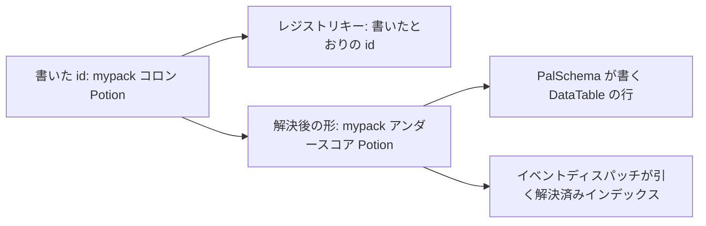

## このページでできるようになること

- 定義がどのパックのものかを表明し、衝突が両者を名指しできるようにする
- 2 種類の衝突警告を読み分ける
- ある id が使用済みか、誰のものか、何に解決されるかをレジストリに尋ねる
- 自分のコードが作った登録を、不要になったときに取り消す
- パックの依存を宣言し、他人の名前空間への参照を検査できるようにする

<Callout type="info">
[定義とハンドル](/docs/concepts/definitions)は定義そのもの、つまり呼び出し方、ハンドル、`X.get`、
`packid:name` という綴り自体を扱います。このページはその下の層、帰属・衝突・レジストリ面の話です。
</Callout>

## 1 つの id、2 つの綴り

コロンを含む id は名前空間つき、含まない id はゲームのリテラル id です。名前空間つきの形には綴りが
2 つあり、どちらも重要です。

```lua
local om = require("palforge.core.object_manager")

om.resolve("mypack:Potion")    -- "mypack_Potion"   ゲームの行の綴り
om.resolve("Wood")             -- "Wood"            リテラル id はそのまま通る
om.resolve("my pack:Potion")   -- nil, "invalid pack id 'my pack' (letters/digits/_ only)"
```



レジストリのキーは**書いたとおりの** id で、エンジンとの境界はすべて解決後の形を使います。4 つの
`iconOf` 実装、`AddPassiveSkill` と `RemovePassiveSkill`、オーディオカタログの検索、建物 id の
フォールバックは、いずれも先に解決します。どれも `resolve(x)` 単独ではなく `resolve(x) or x` と
書かれているので、解決できない id でも「何も聞かない」ではなく「聞ける唯一の質問をする」になります。

## id は定義した時点で検査される

名前空間つき id の両半分は英数字かアンダースコアでなければなりません。PalSchema がその id のために
書く行が `packid_name` だからです。これは**定義時**にドメインのコンストラクタで検査され、失敗は
規則を名指しするハードエラーになります。

```text
PalForge: Building: field "id" is invalid: invalid pack id 'my-pack' in 'my-pack:Bench'
    (letters/digits/_ only)

PalForge: Item: field "id" is invalid: invalid pack id '' in ':Potion' (letters/digits/_ only)
```

`validId` は 1 方向だけ意図的に `resolve` より厳格です。`":Bench"` や `"example:"` は resolve の
分割パターンに一致しないので resolve はリテラルとして通しますが、`validId` は拒否します。定義時に
半分が空の id は、毎回タイプミスだからです。

コロンをまったく含まない id はゲームのリテラル id であり、空でない文字列ならすべて受け付けられます。
リテラル id に何を含めてよいかの権威はゲーム自身の行だからです。

## オブジェクト型ごとに 1 バケット

レジストリのキーは `(type, id)` で、api モジュールごとに 1 バケットあります。`om.TYPES` がその一覧で、
ツールがハードコードしなくて済むように公開されています。

```lua
local om = require("palforge.core.object_manager")

om.TYPES   -- audio, building, effect, item, mesh, pal, skill, ui

for _, otype in ipairs(om.TYPES) do
    local ids = {}
    for id in pairs(om.all(otype)) do ids[#ids + 1] = id end
    table.sort(ids)
    print(otype, #ids, table.concat(ids, ", "))
end
```

呼び出し可能なドメイン 1 つにつき 1 つ、計 8 型です。`Player` は 9 番目の api メンバーですが何も定義
しないのでバケットを持ちません。`om.all(otype)` は浅い**コピー**なので、呼び出し側がこれを通じて
ライブなレジストリを書き換えることはできません。そして確保が発生するので、検索ではなく列挙のための
ものです。

## どのパックかを表明する

定義の呼び出しは自分の require 名前空間から行われるただの Lua 呼び出しで、呼び出し自体にはどの MOD が
行ったかを示すものがありません。それを表明する場所が `PalForge.pack(packId)` です。

```lua title="Scripts/mypack/content.lua"
local api  = PalForge.pack("mypack", { depends = { "otherpack" } })
local Item = api.Item

Item{ id = "mypack:Potion", name = "Potion" }   -- pack = "mypack" として登録される
```

返るのは同じ 9 つの api メンバーと、10 番目の `.store` です。`.store` はこのパック自身の保存された
状態で、他のパックのファイルを名指しすることはできません。8 つのコンストラクタは定義が
`object_manager.withPack` の内側で走るよう
ラップされ、ドメインが名前付き関数として追加している定義経路も同様です。`Audio.bgm` と `Audio.se` も
登録を行い、これらは `__call` ではなく `__index` 経由で到達するので名前を指定してラップしてあります。
それ以外（`X.get`、`X.get_all`、`Player`）は素通りで、ラッパーは読み取り専用のビューです。書き込もう
とすると例外になります。ほかの呼び出し側が見ているモジュールと黙って食い違うことがないようにです。

スコープ付きテーブルはパック id ごとに 1 つなので、
`PalForge.pack("x").Item == PalForge.pack("x").Item` が成り立ちます。利用は任意で、帰属のない定義は
`pack = nil` で登録されます。

パック id は今や **ファイル名** でもあります。保存された状態は `state/<save>/<packId>.json` に
置かれるので、3 つの id は書いた場所で拒否されます。`_save`、`_unowned`、`_quarantine` の 3 つで、
どれもそのディレクトリで PalForge がすでに使っている名前です。`opts.version` は `depends` や
`recommends` と並べて渡せます。これはフレームワークではなくあなたのパックのバージョンです。
そのファイルに何が入り、削除すると何が起きるかは [保存される状態](/docs/concepts/saved-state) に
あります。

`depends` と `recommends` はレジストリに記録されます。これにより `checkImport` は「このパックがその
id に言及してよいか」に答えられ、呼び出し側が集合を持ち回る必要がなくなります。定義が*言及する*
id をドメイン側から渡す仕組みはまだないので、これは「インポートを検査している」という主張ではなく、
提供済みの接続点です。

## 衝突はこう見える

方針は**後勝ち**で、これは以前からそうです。新しいのは、衝突が見えて帰属先が分かることです。衝突は
2 種類あり、別々の問題です。

別のパックが持つ id の下に別のクラスが来た場合。

```text
[PalForge.objects][warn] item 'shared:Thing' was defined by pack 'packa' and is being redefined
  by pack 'packb'; the new definition replaces the old one (last-wins)
```

異なる 2 つのソース id が**同じ 1 つの**ゲーム行に解決される場合。

```text
[PalForge.objects][warn] item ids 'my:pack_Thing' and 'my_pack:Thing' both resolve to the single
  game row 'my_pack_Thing' — one row, two definitions. 'my_pack:Thing' now owns the resolved
  lookup; rename one of them
```

解決はどちらの半分にも `_` を含みうる 2 つの文字列の単純な連結なので、2 つ目が起こりえます。これが
重要なのは、イベントディスパッチが読むのが解決済みインデックスだからです。1 行に定義が 2 つあり、
イベントを受け取るのは片方だけになります。

3 つ目の警告は、パックが他人の名前空間の中に id を作ったときに出ます。警告されたうえで登録もされます。
8 ドメイン中 7 つが `register` をベストエフォートで呼んで戻り値を捨てているため、拒否しても呼び出し
側からは見えず、登録されていない定義に対して生きているように見えるハンドルが返ってしまうからです。

```text
[PalForge.objects][warn] item 'shared:Thing': 'shared:Thing' declares an id in namespace 'shared'
  (pack is 'packa'). It is registered anyway (last-wins), but the id belongs to another pack's
  namespace and that pack will overwrite it
```

パックが**自分の** id を定義し直すのは衝突ではありません。F9 リロード、再定義、テストスイート、
ネイティブカタログの行の再生成などがそれで、`env.debug` が有効なときだけ出る info 行になります。
F1 スイートを走らせる作者は 1 回の実行で数百のテスト id を再登録するので、そのすべてを知らされては
たまりません。

## 誰が何を持っているかレジストリに尋ねる

```lua
local om = require("palforge.core.object_manager")

om.isRegistered("item", "mypack:Potion")   -- true / false、常に真偽値
om.owner("item", "mypack:Potion")          -- "mypack"、帰属のない定義なら nil
om.entry("item", "mypack:Potion")          -- { cls =, pack =, resolved = } のコピー
om.byResolved("item", "mypack_Potion")     -- cls, sourceId  -- O(1)、ディスパッチ経路
om.get("item", "mypack:Potion")            -- クラスだけを返す。従来どおり
```

`isRegistered` が公式の「この id は使用済みか」です。8 ドメイン中 7 つは `X.get` から `nil` を返さず
薄いフォールバックハンドルを作ります（例外は `Mesh` で、こちらは例外を投げます）。そのため、これが
なかった頃は正直に答えるには api を越えてレジストリに手を伸ばすしかありませんでした。

`entry` は `all` と同じ理由で**コピー**を返します。実レコードはレジストリのもので、呼び出し側が
`pack` をその場で書き換えれば、誰かのコンテンツの帰属を黙って書き換えてしまいます。

`byResolved` は走査ではなくインデックスで、ディスパッチが使うべきものです。リテラル id は自分自身の
下にインデックスされるので、リテラルにも答えます。

## 登録を取り消す

```lua
om.unregister("item", "mypack:Potion")   -- 何かを消したら true、空いていたら false
```

`unregister` はエントリを削除し、解決済みインデックスのスロットも消します。ただし、そのスロットが
まだ*この* id を指している場合に限ります。解決形が衝突したあとのスロットは最後に登録した側のもので、
衝突していた 2 つのうち片方を消すときに、もう片方を黙って外してはいけません。

`register(otype, id, nil)` は同じことの古い綴りで、今も動きます。ただし `unregister` を推奨します。
名前が意図を語り、何かがあったかどうかも報告するからです。

これが効いてくるのはテストハーネスです。定義は永続なので、使い捨てコンテンツを登録した実行はそれを
取り除かなければなりません。さもないとキーを押すたびに、建物スキャンが毎回歩くライブレジストリが
膨らんでいきます。

## まとめ

- `packid:name` がレジストリのキー、`packid_name` がエンジン境界すべてで解決される行の名前です。
- 両半分は英数字か `_` のみで、違反はコンストラクタでのハードエラーです。
- バケットは呼び出し可能ドメインごとに 1 つで計 8 つ。一覧は `om.TYPES`、`om.all` はコピーを返します。
- `PalForge.pack("mypack")` は配下の定義すべてに帰属を付け、それが衝突を名指し可能にします。
- 後勝ちですが黙っていません。パック間の再定義と解決形の共有には、それぞれ専用の警告があります。
- 尋ねるのは `isRegistered` / `owner` / `entry` / `byResolved`、取り消すのは `unregister` です。
- パック id は保存された状態が置かれるファイル名でもあるので、`_save` / `_unowned` / `_quarantine` は拒否されます。

<Cards>
  <Card title="定義とハンドル" href="/docs/concepts/definitions">定義とは何か、何が返ってくるか</Card>
  <Card title="状態異常とアイコン" href="/docs/concepts/status-and-icons">エンジン境界で解決形が必要になる場所</Card>
  <Card title="はじめてのコンテンツパック" href="/docs/guides/first-content-pack">パックファイルを頭から最後まで</Card>
</Cards>
