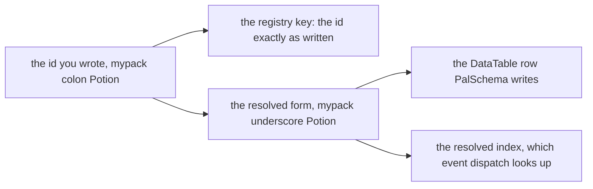

## What you can do after this page

- Say which pack a definition belongs to, so a collision can name both sides
- Read the two collision warnings and know which one you are looking at
- Ask the registry whether an id is taken, by whom, and what it resolves to
- Take a registration back when your code created it and no longer wants it
- Declare what your pack depends on, so a reference into someone else's namespace can be checked

<Callout type="info">
[Definitions and handles](/docs/concepts/definitions) covers what a definition *is* — the call,
the handle, `X.get`, and the `packid:name` spelling itself. This page is the layer under it:
attribution, collisions, and the registry surface.
</Callout>

## Two spellings of one id

An id with a colon is namespaced; an id without one is a literal game id. The namespaced form has
two spellings and both matter:

```lua
local om = require("palforge.core.object_manager")

om.resolve("mypack:Potion")    -- "mypack_Potion"   the game row spelling
om.resolve("Wood")             -- "Wood"            a literal id passes through
om.resolve("my pack:Potion")   -- nil, "invalid pack id 'my pack' (letters/digits/_ only)"
```



The registry is keyed on the id **as written**, and every engine boundary uses the resolved form:
the four `iconOf` implementations, `AddPassiveSkill` and `RemovePassiveSkill`, the audio catalog
lookup and the building-id fallback all resolve first. Each of them spells it `resolve(x) or x`,
never `resolve(x)` alone, so an id that cannot resolve still asks the game the only question it
can rather than asking nothing.

## An id is checked when you define it

Both halves of a namespaced id must be letters, digits or underscores, because the row PalSchema
writes for it is `packid_name`. That is checked **at define time**, in the domain constructor, and
a failure is a hard error naming the rule:

```text
PalForge: Building: field "id" is invalid: invalid pack id 'my-pack' in 'my-pack:Bench'
    (letters/digits/_ only)

PalForge: Item: field "id" is invalid: invalid pack id '' in ':Potion' (letters/digits/_ only)
```

`validId` is deliberately stricter than `resolve` in one direction: `":Bench"` and `"example:"`
do not match resolve's split, so resolve waves them through as literals, while `validId` rejects
them. At define time an id with an empty half is a typo every time.

An id with no colon at all is a literal game id and is accepted for any non-empty string. The
game's own rows are the authority on what a literal id may contain.

## One bucket per object type

The registry is keyed by `(type, id)`, one bucket per api module. `om.TYPES` is the list, exposed
so tooling does not have to hard-code it:

```lua
local om = require("palforge.core.object_manager")

om.TYPES   -- audio, building, effect, item, mesh, pal, skill, ui

for _, otype in ipairs(om.TYPES) do
    local ids = {}
    for id in pairs(om.all(otype)) do ids[#ids + 1] = id end
    table.sort(ids)
    print(otype, #ids, table.concat(ids, ", "))
end
```

Eight types, one per callable domain. `Player` is the ninth api member and defines nothing, so it
has no bucket. `om.all(otype)` is a shallow **copy**, so a caller cannot mutate the live registry
through it — and it allocates, so it is for enumeration rather than for lookups.

## Saying which pack you are

A definition call is a plain Lua call from your own require namespace, and nothing in the call
itself says which mod made it. `PalForge.pack(packId)` is where you say so:

```lua title="Scripts/mypack/content.lua"
local api  = PalForge.pack("mypack", { depends = { "otherpack" } })
local Item = api.Item

Item{ id = "mypack:Potion", name = "Potion" }   -- registered with pack = "mypack"
```

It returns the same nine api members, plus a tenth — `.store`, this pack's own saved state, which
cannot name another pack's file. The eight constructors are wrapped so the define runs inside
`object_manager.withPack`, and so are the extra define routes a domain adds as named functions —
`Audio.bgm` and `Audio.se` register too, and they are reached through `__index` rather than
`__call`, so they are wrapped by name. Everything else (`X.get`, `X.get_all`, `Player`) passes
through untouched, and the wrapper is a read-only view: assigning into it raises rather than
silently diverging from the module every other caller sees.

One scoped table exists per pack id, so `PalForge.pack("x").Item == PalForge.pack("x").Item`.
Using it is optional: an unattributed definition registers with `pack = nil`.

A pack id is also a **file name** now — saved state lives at `state/<save>/<packId>.json` — so
three ids are refused where you typed them: `_save`, `_unowned` and `_quarantine`, which are names
PalForge already owns in that directory. `opts.version` is accepted alongside `depends` and
`recommends`, and it describes your pack rather than the framework.
[Saved state](/docs/concepts/saved-state) covers what that file holds and what deleting it does.

`depends` and `recommends` are recorded with the registry, which is what lets `checkImport` answer
"may this pack mention that id?" without every call site threading the set through. No domain
passes the ids a definition *mentions* yet, so this is an offered wiring point rather than a claim
that imports are checked today.

## What a collision looks like

The policy is **last-wins**, and it always was. What is new is that a collision is visible and
attributable. There are two, and they are different problems.

A different class under an id another pack holds:

```text
[PalForge.objects][warn] item 'shared:Thing' was defined by pack 'packa' and is being redefined
  by pack 'packb'; the new definition replaces the old one (last-wins)
```

Two different source ids that resolve to **one** game row:

```text
[PalForge.objects][warn] item ids 'my:pack_Thing' and 'my_pack:Thing' both resolve to the single
  game row 'my_pack_Thing' — one row, two definitions. 'my_pack:Thing' now owns the resolved
  lookup; rename one of them
```

Both are plain concatenation of two halves that may each contain `_`, which is how the second one
happens at all. It matters because the resolved index is what event dispatch reads: one row, two
definitions, and only one of them gets the events.

A third warning fires when a pack keys an id inside somebody else's namespace. It is warned and
still registered, because seven of the eight domains call `register` best-effort and discard the
result — a refusal would be invisible at the call site, handing back a live-looking handle for a
definition that was never registered:

```text
[PalForge.objects][warn] item 'shared:Thing': 'shared:Thing' declares an id in namespace 'shared'
  (pack is 'packa'). It is registered anyway (last-wins), but the id belongs to another pack's
  namespace and that pack will overwrite it
```

A pack redefining **its own** id is not a collision. That is an F9 reload, a redefinition, the
test suites, or the native catalogs re-materialising a row, and it prints only as an info line
gated on `env.debug` — an author running the F1 suite re-registers hundreds of test ids per run
and must not be told about every one of them.

## Asking the registry who owns what

```lua
local om = require("palforge.core.object_manager")

om.isRegistered("item", "mypack:Potion")   -- true / false, always a boolean
om.owner("item", "mypack:Potion")          -- "mypack", or nil for an unattributed definition
om.entry("item", "mypack:Potion")          -- { cls =, pack =, resolved = }, a copy
om.byResolved("item", "mypack_Potion")     -- cls, sourceId  -- O(1), the dispatch route
om.get("item", "mypack:Potion")            -- just the class, unchanged
```

`isRegistered` is the public "is this id taken". It exists because seven of the eight domains
never return `nil` from `X.get` — they fabricate a thin fallback handle, and `Mesh` is the one
that raises instead — so before it, the only honest answer meant reaching past the api into the
registry.

`entry` returns a **copy**, for the same reason `all` does: the live record belongs to the
registry, and a caller who edited `pack` in place would silently re-attribute someone's content.

`byResolved` is an index rather than a scan, and it is what dispatch should use. A literal id
indexes under itself, so it answers for those too.

## Taking a registration back

```lua
om.unregister("item", "mypack:Potion")   -- true when something was removed, false when free
```

`unregister` drops the entry and clears the resolved-index slot — but only if that slot still
points at *this* id. After a resolved-form collision the slot belongs to whoever registered last,
and dropping one of the two colliding ids must not silently unhook the other.

`register(otype, id, nil)` is the older spelling of the same thing and still works. Prefer
`unregister`: it says so in its name and reports whether anything was there.

The place this matters is a test harness. Defining is permanent, so a run that registered
throwaway content has to take it back out — otherwise pressing the key repeatedly grows the live
registry that the building scan walks on every pass.

## Summary

- `packid:name` is the registry key; `packid_name` is the row every engine boundary resolves to.
- Both halves must be letters, digits or `_`, and that is a hard error in the constructor.
- Eight buckets, one per callable domain; `om.TYPES` is the list and `om.all` hands back a copy.
- `PalForge.pack("mypack")` attributes every define underneath it, which is what makes a collision nameable.
- Last-wins, but loud: a cross-pack redefinition and a shared resolved form each get their own warning.
- `isRegistered` / `owner` / `entry` / `byResolved` ask, and `unregister` takes one back.
- A pack id is also the file name its saved state lives under, so `_save`, `_unowned` and `_quarantine` are refused.

<Cards>
  <Card title="Definitions and handles" href="/docs/concepts/definitions">What a definition is, and what you get back</Card>
  <Card title="Ailments and icons" href="/docs/concepts/status-and-icons">Where the resolved form is needed at the engine boundary</Card>
  <Card title="Your first content pack" href="/docs/guides/first-content-pack">A pack file from top to bottom</Card>
</Cards>
