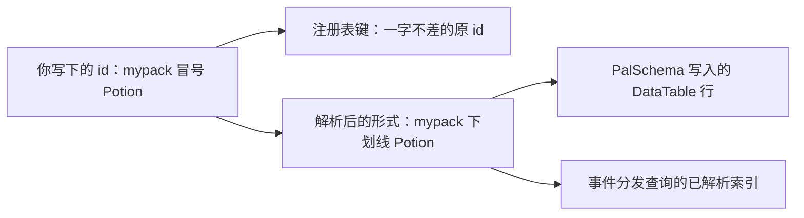

## 读完本页你可以做到

- 声明一份定义属于哪个包，让冲突能点名双方
- 读懂两种冲突警告，并分清自己看到的是哪一种
- 向注册表询问某个 id 是否被占、被谁占、解析成什么
- 在自己的代码建立注册之后又不需要它时，把注册收回
- 声明本包的依赖，使指向他人命名空间的引用可以被检查

<Callout type="info">
[定义与句柄](/docs/concepts/definitions)讲的是定义本身——调用方式、句柄、`X.get`，以及
`packid:name` 这个写法。本页是它下面那一层：归属、冲突和注册表接口。
</Callout>

## 一个 id 的两种写法

带冒号的 id 属于命名空间，不带冒号的是游戏的字面 id。带命名空间的形式有两种写法，两种都重要：

```lua
local om = require("palforge.core.object_manager")

om.resolve("mypack:Potion")    -- "mypack_Potion"   游戏行的写法
om.resolve("Wood")             -- "Wood"            字面 id 原样通过
om.resolve("my pack:Potion")   -- nil, "invalid pack id 'my pack' (letters/digits/_ only)"
```



注册表以**你写下的原样** id 为键，而每一处引擎边界都用解析后的形式：四个 `iconOf` 实现、
`AddPassiveSkill` 与 `RemovePassiveSkill`、音频目录查询和建筑 id 回退，都会先解析。它们一律写成
`resolve(x) or x` 而不是单独的 `resolve(x)`，这样解析不出来的 id 仍然会向游戏提出它唯一能提的问题，
而不是什么都不问。

## id 在定义时就会被检查

带命名空间的 id 两半都必须是字母、数字或下划线，因为 PalSchema 为它写的行是 `packid_name`。这一点在
**定义时**由域构造函数检查，失败就是一个点名规则的硬错误：

```text
PalForge: Building: field "id" is invalid: invalid pack id 'my-pack' in 'my-pack:Bench'
    (letters/digits/_ only)

PalForge: Item: field "id" is invalid: invalid pack id '' in ':Potion' (letters/digits/_ only)
```

`validId` 在一个方向上比 `resolve` 更严：`":Bench"` 和 `"example:"` 不匹配 resolve 的切分模式，所以
resolve 会把它们当字面 id 放行，而 `validId` 拒绝它们。在定义时，有一半为空的 id 每次都是打字错误。

完全不带冒号的 id 是游戏的字面 id，任何非空字符串都接受——字面 id 里能放什么，权威在游戏自己的行。

## 每个对象类型一个桶

注册表以 `(type, id)` 为键，每个 api 模块一个桶。`om.TYPES` 是这份清单，公开出来就是为了让工具不必
把它写死：

```lua
local om = require("palforge.core.object_manager")

om.TYPES   -- audio, building, effect, item, mesh, pal, skill, ui

for _, otype in ipairs(om.TYPES) do
    local ids = {}
    for id in pairs(om.all(otype)) do ids[#ids + 1] = id end
    table.sort(ids)
    print(otype, #ids, table.concat(ids, ", "))
end
```

八个类型，每个可调用的域一个。`Player` 是第九个 api 成员，它什么都不定义，所以没有桶。
`om.all(otype)` 返回的是浅**拷贝**，调用方无法借它改动活的注册表；而它会分配内存，所以那是用来枚举
的，不是用来查询的。

## 声明你是哪个包

一次定义调用只是从你自己的 require 命名空间发出的普通 Lua 调用，调用本身没有任何东西说明它出自哪个
mod。声明这件事的地方就是 `PalForge.pack(packId)`：

```lua title="Scripts/mypack/content.lua"
local api  = PalForge.pack("mypack", { depends = { "otherpack" } })
local Item = api.Item

Item{ id = "mypack:Potion", name = "Potion" }   -- 以 pack = "mypack" 注册
```

它返回同样的九个成员。八个构造函数被包了一层，使定义在 `object_manager.withPack` 内部执行；域以具名
函数形式追加的定义入口也一样——`Audio.bgm` 和 `Audio.se` 同样会注册，而它们经由 `__index` 而不是
`__call` 到达，所以是按名字单独包装的。其余成员（`X.get`、`X.get_all`、`Player`）原样透传；这个包装
是只读视图，往里赋值会抛错，以免和其他调用方看到的模块悄悄分叉。

每个包 id 只有一张作用域表，所以 `PalForge.pack("x").Item == PalForge.pack("x").Item`。用不用是自愿
的：没有归属的定义以 `pack = nil` 注册。

`depends` 和 `recommends` 会登记到注册表，于是 `checkImport` 能回答「这个包可不可以提到那个 id」，而
不必每个调用点都把集合传来传去。目前还没有哪个域会把定义*提到*的 id 传进来，所以这是一个已经接好的
接线点，而不是「导入已经在被检查」的主张。

## 冲突长什么样

策略是**后者胜出**，一直如此。新增的是：冲突现在看得见，也能归到具体的包。冲突有两种，是两个不同的
问题。

另一个包持有的 id 下面出现了不同的类：

```text
[PalForge.objects][warn] item 'shared:Thing' was defined by pack 'packa' and is being redefined
  by pack 'packb'; the new definition replaces the old one (last-wins)
```

两个不同的源 id 解析到了**同一个**游戏行：

```text
[PalForge.objects][warn] item ids 'my:pack_Thing' and 'my_pack:Thing' both resolve to the single
  game row 'my_pack_Thing' — one row, two definitions. 'my_pack:Thing' now owns the resolved
  lookup; rename one of them
```

解析就是把两半直接拼起来，而两半都允许含 `_`，第二种情况因此才可能发生。它要紧，是因为事件分发读的
正是这个已解析索引：一行、两份定义，只有一份能收到事件。

第三条警告出现在一个包把 id 建在别人的命名空间里的时候。它会被警告，同时仍然完成注册：八个域里有七
个是尽力而为地调用 `register` 并丢弃返回值，拒绝在调用点根本看不见，只会为一份从未注册的定义交回一
个看起来活着的句柄。

```text
[PalForge.objects][warn] item 'shared:Thing': 'shared:Thing' declares an id in namespace 'shared'
  (pack is 'packa'). It is registered anyway (last-wins), but the id belongs to another pack's
  namespace and that pack will overwrite it
```

一个包重新定义**自己的** id 不算冲突。那是 F9 重载、一次重定义、测试套件，或者原生目录重新落地某一
行；它只会在 `env.debug` 打开时作为 info 打印出来——跑 F1 套件的作者一次运行会重新注册几百个测试
id，不该被逐条告知。

## 向注册表询问归属

```lua
local om = require("palforge.core.object_manager")

om.isRegistered("item", "mypack:Potion")   -- true / false，永远是布尔值
om.owner("item", "mypack:Potion")          -- "mypack"，无归属的定义则是 nil
om.entry("item", "mypack:Potion")          -- { cls =, pack =, resolved = } 的拷贝
om.byResolved("item", "mypack_Potion")     -- cls, sourceId  -- O(1)，分发走的路
om.get("item", "mypack:Potion")            -- 只返回类，行为不变
```

`isRegistered` 是官方的「这个 id 被占了吗」。它之所以需要存在，是因为八个域里有七个的 `X.get` 从不
返回 `nil`——它们会造一个很薄的回退句柄，唯一例外是 `Mesh`，它选择抛错——所以在它出现之前，想得到
诚实的答案只能越过 api 直接摸注册表。

`entry` 返回**拷贝**，理由和 `all` 一样：真正的记录属于注册表，调用方原地改掉 `pack`，就等于悄悄把
别人的内容改了归属。

`byResolved` 是索引而不是扫描，也是分发应该用的那条路。字面 id 以自身为键建索引，所以它对字面 id 同
样有效。

## 把注册收回

```lua
om.unregister("item", "mypack:Potion")   -- 确实删掉了返回 true，本来就空则返回 false
```

`unregister` 删掉条目，并清空已解析索引里的槽位——但仅当那个槽位仍然指向*这一个* id 时。解析形冲突
之后，槽位属于最后注册的那一方，删掉两个冲突 id 中的一个，绝不能顺手把另一个也摘下去。

`register(otype, id, nil)` 是同一件事的旧写法，现在仍然有效。更推荐 `unregister`：名字说明了意图，还
会告诉你原本有没有东西。

真正用得上它的地方是测试用具。定义是永久的，所以注册过一次性内容的运行必须把它拿掉——否则每按一次
键，建筑扫描每轮都要走的那张活注册表就会长大一圈。

## 小结

- `packid:name` 是注册表的键，`packid_name` 是所有引擎边界都会解析出来的行名。
- 两半只能是字母、数字或 `_`，违反就是构造函数里的硬错误。
- 八个桶，每个可调用域一个；清单是 `om.TYPES`，`om.all` 交回的是拷贝。
- `PalForge.pack("mypack")` 给它下面的每次定义打上归属，这正是冲突能被点名的原因。
- 后者胜出，但不再沉默：跨包重定义和共用解析形各有自己的警告。
- 询问用 `isRegistered` / `owner` / `entry` / `byResolved`，收回用 `unregister`。

<Cards>
  <Card title="定义与句柄" href="/docs/concepts/definitions">定义是什么，你会拿回什么</Card>
  <Card title="状态与图标" href="/docs/concepts/status-and-icons">引擎边界上需要解析形的地方</Card>
  <Card title="你的第一个内容包" href="/docs/guides/first-content-pack">一个包文件从头到尾</Card>
</Cards>
