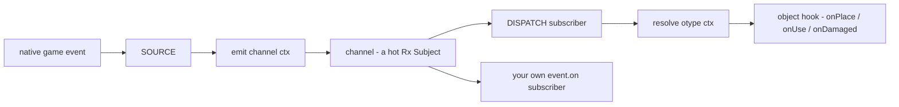
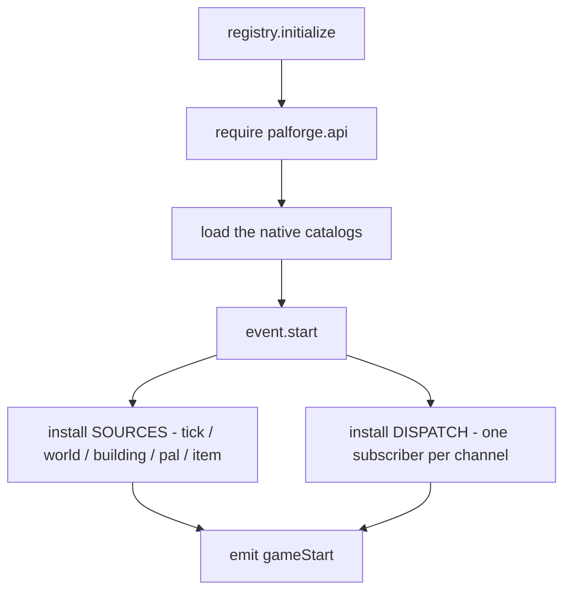
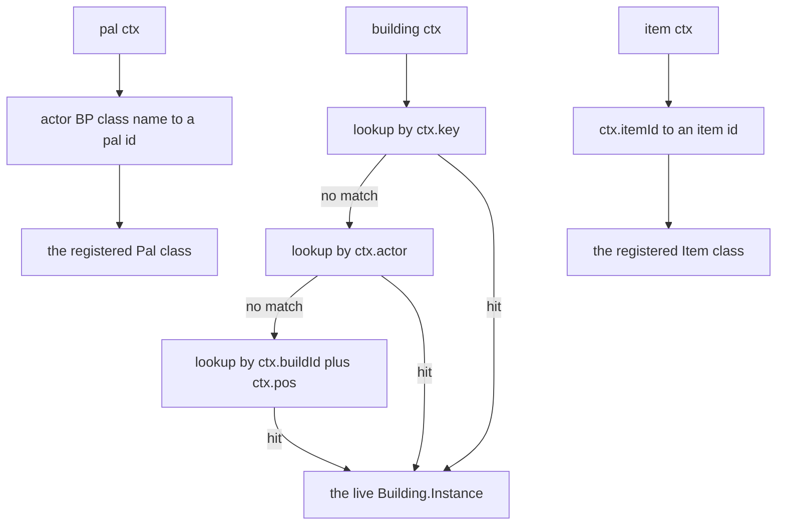
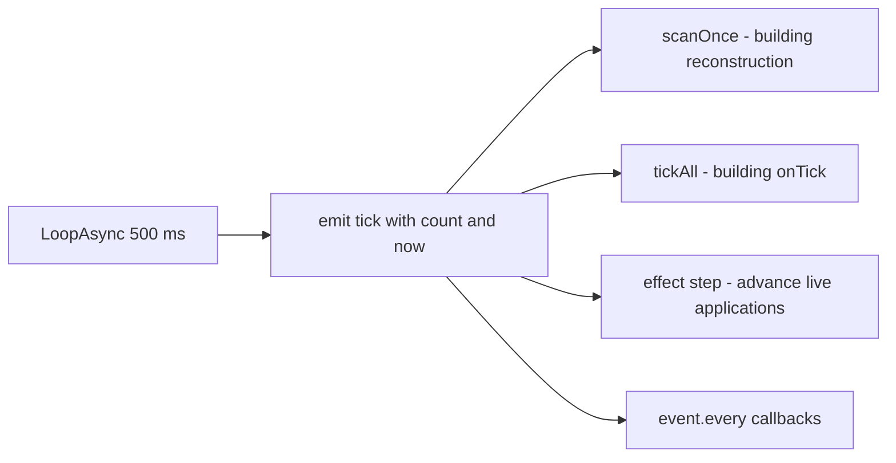
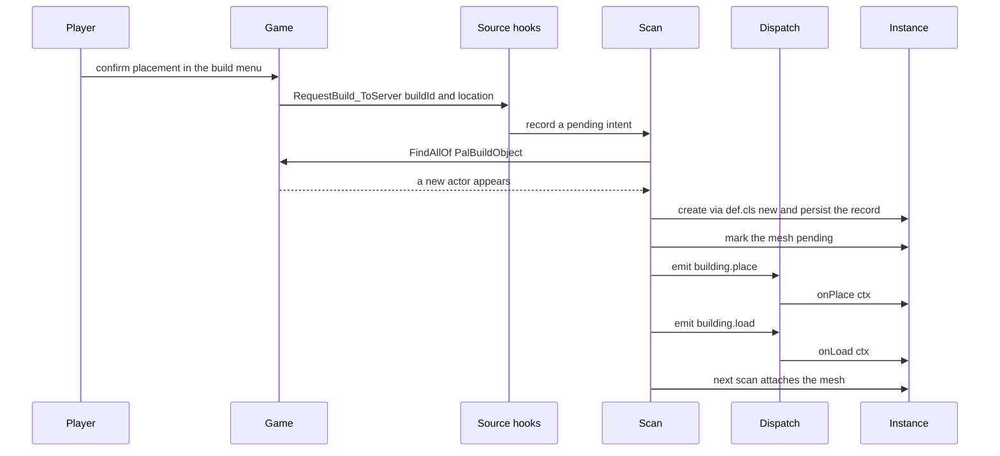
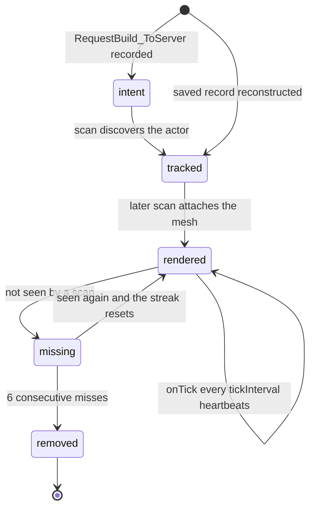
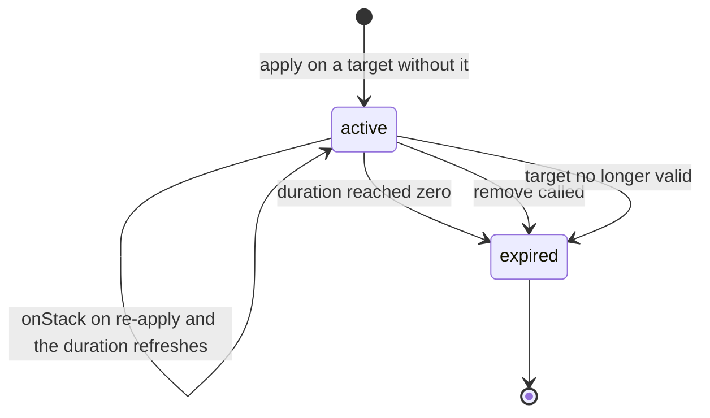

Palworld のネイティブイベントからハンドラまでの経路は、1 つのファイルが所有しています。
`Scripts/palforge/core/event.lua` です。チャンネル、それを供給するネイティブフック、チャンネル
をオブジェクトのメソッド呼び出しに変えるディスパッチ、そして建築物のインスタンスランタイムが、
すべてここに入っています。

```lua
local event = require("palforge.core.event")

event.on("pal.spawned", function(ctx) print(ctx.actor) end)
event.emit("example:custom", { note = "channels are created on demand" })
```

このモジュールを直接 require する場面はほとんどありません。定義に `events = { ... }` を書くのが
通常の入り口で、ディスパッチがそのハンドラを呼び出します。

## 3 つの部分

`core/event.lua` は 3 層に分かれており、あらゆるライフサイクルの瞬間はこの順に 3 層を通過します。

| 層 | 内容 |
| --- | --- |
| BUS | 名前付きチャンネル。各チャンネルはホットな Rx Subject で、`on` / `emit` / `observable` / `every` を備えます。 |
| SOURCE | ネイティブフックやループが、ゲームイベントを `emit(channel, ctx)` に変換します。 |
| DISPATCH | チャンネルごとの購読者。イベントが起きたオブジェクトを解決し、そのフックを呼びます。 |



共有点はバスだけです。SOURCE がフックを直接呼ぶことはなく、フックがどのネイティブ呼び出しから
来たかを知ることもありません。まだ SOURCE を持たないチャンネル（`item.craft`）でもディスパッチが
動作しているのはこのためで、何かが emit するようになった日から、既存のパックはコードを変えずに
受け取り始めます。

### 起動時の配線順序

`registry.initialize()` が、Mod ロード時に `main.lua` が呼ぶ唯一の入り口です。



`event.start()` は `started` フラグで保護されているため、二度目以降の呼び出しは何もしません。
`event.CHANNELS` のすべてのチャンネルは、どの SOURCE よりも先に生成されます。emit より前に
subscribe しても安全なのはこのためです。

### オブジェクトの解決

DISPATCH は推測をしません。`resolve(otype, ctx)` がコンテキストテーブルを具体的なオブジェクトに
対応付け、呼ぶ相手がいなければ `nil` を返します。そのときディスパッチは何もしません。



建築物は **ライブインスタンス** に解決されます。パルとアイテムにはインスタンス追跡がないため、
登録済みの **クラス** に解決され、ハンドラは `ctx` からアクターを読み取ります。PalForge の定義を
持たないバニラのパルやアイテムは `nil` に解決され、ディスパッチは何もしません。アイテムの ctx の
コストはテーブル参照 1 回の空振りだけです。パルの ctx はそれに加えて登録済みパル ID の走査が入り
ます。これが、名前空間付きの `pack:name` なパルを実際にスポーンした `BP_<resolved>_C` クラスと
突き合わせる仕組みです。

## チャンネル

`event.CHANNELS` が全リストで、宣言順に並んでいます。

```lua
event.CHANNELS   --> {
--   "gameStart",
--   "world.ready", "world.left",
--   "building.place", "building.load", "building.interact", "building.remove",
--   "pal.spawned", "pal.damaged", "pal.death", "pal.captured",
--   "item.obtain", "item.use", "item.craft", "item.discard",
--   "tick",
-- }
```

| チャンネル | emit するもの | `ctx` の内容 | ディスパッチ先 |
| --- | --- | --- | --- |
| `gameStart` | `registry.initialize`、`event.start()` の後 | ペイロードなし | なし。直接の購読者のみ |
| `world.ready` | ready ウォッチ。`LoopAsync(1000)` が `PalPlayerCharacter` をポーリングし、5 回連続で有効だったとき | ペイロードなし | 全ライブ建築物インスタンスの `onWorldReady`。ただしこの時点で追跡中のインスタンスは 1 つもありません |
| `world.left` | 同じウォッチ。ポーンが無効になったとき | ペイロードなし | 全ライブ建築物インスタンスの `onWorldLeft`。その後ライブインスタンスは破棄されます |
| `building.place` | 再構築スキャン。新しいインスタンスが作られ、保留中の設置意図と一致したとき | `key`, `actor`, `pos`, `buildId`, `player`, `firstSeen` | `onPlace` |
| `building.load` | 再構築スキャン。新しく追跡対象になったすべてのインスタンス | `key`, `actor`, `pos`, `buildId`, `reconstructed` | `onLoad` |
| `building.interact` | `/Script/Pal.PalBuildObject:OnBeginInteractBuilding` | `actor`, `player`, `buildId` | `onRightClick` |
| `building.remove` | スキャンの削除スイープ。6 回連続で見失ったとき | `key`, `buildId`, `actor`, `reason` | `onRemove` |
| `pal.spawned` | `/Script/Pal.PalCharacter:BroadcastOnCompleteInitializeParameter` | `actor` | `onSpawned` |
| `pal.damaged` | `/Script/Pal.PalCharacter:OnDamageReaction` | `actor` | `onDamaged` |
| `pal.death` | `/Script/Pal.PalCharacter:OnDeadCharacter` | `actor` | `onDeath` |
| `pal.captured` | `/Script/Pal.PalCharacterParameterComponent:SetIsCapturedProcessing`。引数が `true` のときのみ | `actor`, `comp` | `onCaptured` |
| `item.obtain` | `/Script/Pal.PalPlayerState:AddItemGetLog_ToClient` | `itemId`, `count` | `onObtain` |
| `item.use` | `/Script/Pal.PalItemUseProcessor:UseItemToCharacter_ServerInternal` | `itemId`, `actor`, `processor` | `onUse` |
| `item.craft` | まだ何もない | — | `onCraft` |
| `item.discard` | まだ何もない | — | `onDiscard` |
| `tick` | `ExecuteInGameThread` 内の `LoopAsync(500)` | `count`, `now` | ティックリスト経由で建築物の `onTick` |

<Callout type="info">
`world.ready` と `world.left` はペイロードなしで emit されるため、直接の購読者が受け取るのは
`nil` です。建築物のディスパッチは `onWorldReady` / `onWorldLeft` を呼ぶ前に空テーブルを差し替える
ので、これらのハンドラは常にテーブルを受け取ります。
</Callout>

<Callout type="warn">
ハートビート以外のネイティブフックは、ワールドが準備できていない間はすべて即座に return します。
建築物スキャン、interact フック、設置意図フック、パルの 4 フックとアイテムの 2 フックは、いずれも
先に `worldReady` を確認します。ready ウォッチ自体をインストールできなかった場合、ゲートは開いた
ままの状態でフォールバックし、ディスパッチは最初から動作します。
</Callout>

チャンネル名はバスのレベルでは閉じた集合ではありません。`event.emit` と `event.on` は必要に応じて
Subject を生成するので、独自の名前も使えます。

```lua
local event = require("palforge.core.event")

event.on("mypack:quest.completed", function(ctx)
    Item.get("Wood"):give(ctx.reward or 1)
end)

event.emit("mypack:quest.completed", { reward = 25 })
```

SOURCE と DISPATCH が背後にあるのは `event.CHANNELS` の名前だけです。独自の名前は素の pub/sub
チャンネルになります。

## ハートビート

`event.TICK_MS = 500` です。1 本の `LoopAsync(500)` が `ExecuteInGameThread` の内側から `tick` を
emit するので、すべての購読者はゲームスレッド上で動きます。

```lua
event.on("tick", function(ctx)
    -- ctx.count = how many heartbeats since the loop started
    -- ctx.now   = os.clock() at emit time
end)
```

PalForge の周期処理はすべて、この 1 本のループに乗っています。例外は ready ウォッチだけで、
こちらは独自の `LoopAsync(1000)` でポーリングします。



### event.every

`event.every(ms, fn)` はハートビートごとに `TICK_MS` を積算し、累積が `ms` に達したら発火して
リセットします。したがって実際の周期は、`ms` を 500 の倍数に切り上げた値になります。

```lua
local event = require("palforge.core.event")
local log   = require("palforge.utils.log").scope("beat")

local sub = event.every(5000, function()
    log.info("five seconds of heartbeats")
end)

sub:unsubscribe()   -- stop it
```

| 指定 | 実際の周期 |
| --- | --- |
| `event.every(500, fn)` | ハートビートごと |
| `event.every(700, fn)` | 1000 ms ごと |
| `event.every(2000, fn)` | 2000 ms ごと |
| `event.every(2500, fn)` | 2500 ms ごと |

`fn` は `pcall` の中で実行されます。コールバック内のエラーはハートビートを壊しませんが、報告も
されません。失敗を確認したい場合はコールバックの中でログを出してください。

### 建築物スキャンも同じ周期に乗る

再構築スキャンは同じ定数を使って `event.every(500, scanOnce)` として登録されています。スキャン用の
2 本目のタイマーはありません。おかげで考えるべき数値が 1 つで済みます。設置した建築物はおよそ
1 ハートビートでライブインスタンスになり、そのメッシュはさらに 1 ハートビート後に現れ、消えた
建築物は 6 回連続で見失った時点、およそ 3 秒で破棄されます。

## 実際に発火するもの

フックが宣言できることは、何かがそれを emit する保証ではありません。ドメインごとに見ていきます。

### Building

`onWorldReady` を除き、SOURCE を持つフックはすべて LIVE です。構造物ごとの状態を持つのはこの
ドメインだけです。

| フック | 状態 | SOURCE |
| --- | --- | --- |
| `onPlace` | LIVE | スキャン。`RequestBuild_ToServer` の意図と一致したとき |
| `onLoad` | LIVE | スキャン。新しく追跡対象になったすべてのインスタンス |
| `onRightClick` | LIVE | `OnBeginInteractBuilding` |
| `onRemove` | LIVE | スキャンの削除スイープ |
| `onTick` | LIVE | ハートビート。`tickInterval` で間引かれます |
| `onWorldReady` | 到達しません | ready ウォッチ。最初のスキャンより前に emit されます |
| `onWorldLeft` | LIVE | ready ウォッチ |
| `onBuild` | 宣言のみ | ネイティブ SOURCE がまだありません |
| `onLeftClick` | 宣言のみ | ネイティブ SOURCE がまだありません |
| `onBreak` | 宣言のみ | ネイティブ SOURCE がまだありません |

設置と破壊は `onPlace` と `onRemove` でカバーされます。`onBuild`、`onLeftClick`、`onBreak` は
スペックとしては受理されますが、呼ばれることはありません。

`onRightClick` は SOURCE の側でフィルタとデバウンスがかかります。操作した相手が
`PalCharacter` のときだけ通り、同じ構造物への 2 回目の操作は 1 秒以内なら捨てられます。

<Callout type="warn">
`onWorldReady` はディスパッチされますが、受け取る相手がいません。ready ウォッチはゲートを立てる
のと同じ手順で `world.ready` を emit し、インスタンスを生成するスキャンはそのゲートで止まって
いるため、ディスパッチがライブインスタンスを走査する時点ではまだ 1 つも存在しません。ワールドを
出るとライブインスタンスはすべて破棄されるので、2 回目のロードでも同じです。代わりに `onLoad` を
使ってください。最初のスキャンが追跡したすべてのインスタンスで発火し、`ctx.reconstructed` が
セーブ由来かどうかを教えてくれます。`onWorldReady` に届かせる方法は、自分で `world.ready` を
emit することだけです。
</Callout>

### Pal

| フック | 状態 | SOURCE |
| --- | --- | --- |
| `onCaptured` | LIVE | `SetIsCapturedProcessing` が `true` のとき |
| `onDamaged` | LIVE | `OnDamageReaction` |
| `onDeath` | LIVE | `OnDeadCharacter` |
| `onSpawned` | LIVE、ただしフックは未確認 | `BroadcastOnCompleteInitializeParameter` |
| `onTick` | 宣言のみ | なし |

<Callout type="warn">
`onSpawned` は `BroadcastOnCompleteInitializeParameter` に接続されていますが、ソース側でこれは
未確認の候補と明記されています。ゲーム内イベントプローブを実行した時点でパルはすでに存在して
いたため、実際のスポーンで発火するところは観測されていません。ベストエフォートとして扱い、
これを前提に機能を組む前に検証してください。
</Callout>

<Callout type="warn">
パルの `onTick` は発火しません。パルには建築物のようなインスタンススキャンがないため、パル単位の
周期フックを駆動するものが存在しません。パルごとの定期処理が必要なら、自分で `tick` を購読し、
対象のアクターを走査してください。
</Callout>

### Item

| フック | 状態 | SOURCE |
| --- | --- | --- |
| `onObtain` | LIVE | `AddItemGetLog_ToClient` |
| `onUse` | LIVE | `UseItemToCharacter_ServerInternal` |
| `onCraft` | 宣言のみ | なし |
| `onDiscard` | 宣言のみ | なし |

`onObtain` はゲーム自身の「アイテム入手」ログに乗っているため、拾得・戦利品・報酬で発火します。
入手ログに現れない内部的な追加はカバーされません。`item.craft` と `item.discard` にはチャンネルと
ディスパッチの購読者がありますが、emit するものがありません。

### Effect

4 つのフックはすべて LIVE ですが、タイミングを所有しているのはネイティブのゲームイベントでは
なく `api/effect.lua` です。`:apply(target)` は実際の適用を開始し、それを `tick` チャンネルが
進めます。

| フック | 状態 | 駆動元 |
| --- | --- | --- |
| `onApply` | LIVE | まだ持っていない対象への `:apply(target)` |
| `onTick` | LIVE | ハートビート。`interval` 秒ごと |
| `onStack` | LIVE | すでに持っている対象への `:apply(target)` |
| `onExpire` | LIVE | `duration` が 0 になる、`:remove(target)`、または対象が無効になる |

<Callout type="warn">
PalForge のエフェクトはゲーム自身の状態異常には触れません。`EPalStatusEffectType` はネイティブの
enum で、それを適用するネイティブ呼び出しは確認されていないため、`nativeStatus` はメタデータに
すぎず、ステータスアイコンは変化しません。ゲームプレイはあなたのハンドラの中にあります。
</Callout>

### Skill

ネイティブのスキル SOURCE は存在しません。`skill.*` を emit するチャンネルはなく、自動で発火する
ものは何もありません。動作するのは手動呼び出しで、クールダウンは Lua 側で強制されます。

```lua
local log = require("palforge.utils.log").scope("fireball")

local Fireball = Skill{
    id       = "example:Fireball",
    kind     = "active",
    element  = "fire",
    cooldown = 3.0,
    power    = 50,
    events = {
        onActivate = function(skill, owner, ctx)
            log.info(skill.id .. " fired by " .. tostring(owner))
        end,
    },
}

Fireball:activate(myPalActor)   -- false while cooling down
Fireball:hit(targetActor)
```

`:activate` / `:hit` / `:equip` / `:unequip` は、自分が制御するコードから駆動してください。パルの
ハンドラ、建築物の `onRightClick`、キーバインドなどです。

### Audio、Mesh、UI

ライフサイクルチャンネルはありません。オーディオは再生するもの、メッシュは着せるもの、UI 要素は
`render` と `update` に加えて、自分で呼ぶマウント・リフレッシュ・アンマウントを持ちます。

## ハンドラのシグネチャ

第 1 引数は常に **そのイベントが起きたオブジェクト** です。

| ドメイン | 第 1 引数 | シグネチャ全体 |
| --- | --- | --- |
| Pal | `Pal.Handle` | `function(pal, ctx)` |
| Item | `Item.Handle` | `function(item, ctx)` |
| Building | `Building.Instance` | `function(instance, ctx)` |
| Skill | `Skill.Handle` | `function(skill, owner, ctx)` |
| Effect | `Effect.Handle` | `function(effect, target, ctx)` |

パル・アイテム・スキル・エフェクトでは、ディスパッチが呼ぶのは登録済みクラスで、定義時に仕込まれた
フォワーダがハンドルに差し替えます。ハンドラの中から `:spawn`、`:give`、`:activate`、`:apply` に
そのまま手が届くのはこのためです。

```lua title="content/handlers.lua"
local log = require("palforge.utils.log").scope("handlers")

Pal{
    id = "ChickenPal",
    events = {
        onSpawned = function(pal, ctx)          -- pal is the Pal.Handle
            pal:renderOn(ctx.actor)
        end,
    },
}

Item{
    id = "Berries",
    events = {
        onUse = function(item, ctx)             -- item is the Item.Handle
            log.info(item.id .. " used by " .. tostring(ctx.actor))
        end,
    },
}

Building{
    id = "example:Bench",
    events = {
        onRightClick = function(inst, ctx)      -- inst is the LIVE instance
            inst.state.uses = (inst.state.uses or 0) + 1
            inst:save()
        end,
    },
}

Skill{
    id = "example:Fireball",
    events = {
        onActivate = function(skill, owner, ctx) end,   -- owner comes before ctx
    },
}

Effect{
    id = "example:Regen",
    events = {
        onTick = function(effect, target, ctx) end,     -- target comes before ctx
    },
}
```

`ctx` は素のテーブルです。キーはチャンネルによって変わり、上のチャンネル表がその唯一の一覧です。

## 建築物ランタイム

設置されたものが自身のオブジェクトと状態を持ち、ワールドごとに保存されるのは建築物だけです。
以下はすべて `core/event.lua` の中にあります。

### 設置操作から onPlace まで



<Steps>

<Step>
### 設置意図

`/Script/Pal.PalNetworkPlayerComponent:RequestBuild_ToServer` へのフックが、ビルド ID と位置を
読み取ります。この時点でアクターはまだ存在しないため、ここで何かを生成することはできません。
意図は最大 16 件のキューに入り、古いものから捨てられます。登録済み定義に属するビルド ID に
解決できた場合だけ記録されます。
</Step>

<Step>
### スキャン

`event.every(500, scanOnce)` が `FindAllOf("PalBuildObject")` を走査します。各アクターは 3 段階で
識別されます。クラス名 `BP_BuildObject_<Id>_C`、次にアクターの `MapObjectModel.BuildObjectId`、
最後に保存済みレコードとの位置一致です。すでにインスタンスに束縛されているアクターは高速パスに
入り、位置の更新だけを行います。
</Step>

<Step>
### 同一性

インスタンスのキーはビルド ID と量子化されたワールド座標の組で、`"<buildId>@<qx>,<qy>,<qz>"` の
形をとります。量子化には定義の `gridCm`、既定 100 cm を使います。正となる座標は常にライブ
アクターの位置です。スキャンをまたいで既知のインスタンスを束縛するのは、キーではなく **アクター**
です。設置直後の建築物が報告する位置は、スキャン間で 1 セル以上ぶれるためです。
</Step>

<Step>
### 生成と永続化

インスタンスは `def.cls:new{ ... }` で作られるので、あなたの定義クラスのインスタンスであり、宣言
したメソッドはすべてその上で解決します。state は保存済みレコードがあればそこから、なければ定義の
`state` フィールドから取られます。`state` はテーブルでもファクトリ関数でも構いません。新規
インスタンスは Mod フォルダ配下の `state/entities_<saveId>.json` に書き込まれます。ワールドの
GUID を読めなかった場合、`saveId` は `world` にフォールバックします。
</Step>

<Step>
### イベント

`building.place` が emit されるのは、保存済みレコードがなく、かつ 300 cm 以内に一致する保留意図が
あるときだけです。`building.load` は新しく追跡対象になったすべてのインスタンスで emit され、
`ctx.reconstructed` がセーブ由来かどうかを示します。したがって新規設置では `onPlace` が先に、
`onLoad` がその直後に発火します。
</Step>

<Step>
### 遅延メッシュ

インスタンスが `model` パスを持つメッシュを備えている場合、その場では取り付けず、保留マークを
付けます。取り付けは **後の** スキャンで、同じアクターが再び観測されてから行われます。
</Step>

</Steps>

<Callout type="error">
メッシュの取り付けが遅延されているのは意図的です。初期化途中のアクターに対して、設置されたその
フレームでプロシージャルメッシュコンポーネントを追加すると、無効なネイティブオブジェクトに触れて
ゲームがクラッシュします。ネイティブのアクセス違反は `pcall` では捕捉できないため、ランタイムは
アクターがスキャンを 1 回生き延びたことを確認してから取り付けます。同じ理由で
`OnCompleteBuild_ServerInternal` フックは使っていません。ワールドロードの嵐の最中にすべての建築物
について発火し、初期化途中の `UPalMapObjectModel` メモリを読んだ結果フォルトしたためです。

実際上の帰結として、`onPlace` の中ではメッシュはまだ取り付けられていません。
</Callout>

### インスタンスオブジェクト

建築物のハンドラが `self` として受け取るのがこれです。

<TypeTable
  type={{
    id: { description: 'クラスから継承される定義のビルド ID', type: 'string' },
    buildId: { description: 'このインスタンスが一致したゲーム側のビルド ID', type: 'string' },
    key: { description: '安定したレジストリキー。ビルド ID と量子化セルの組', type: 'string' },
    actor: { description: '設置された APalBuildObject', type: 'any' },
    pos: { description: 'ワールド座標。スキャンごとに更新されます', type: '{ x, y, z }' },
    state: { description: '永続化されるあなたのテーブル。その場で書き換えて save を呼びます', type: 'table' },
  }}
/>

インスタンスのメソッド。

| 呼び出し | 効果 |
| --- | --- |
| `inst:save()` | レコードを dirty にし、ワールドファイルを今すぐディスクへ書き出します |
| `inst:setDirty()` | 書き込まずに dirty にします。次の flush で拾われます |
| `inst:isValid()` | `inst.actor` がまだ有効なエンジンオブジェクトかどうか |
| `inst:render()` | アクターにメッシュとマテリアルを取り付けます。通常はスキャンが行います |
| `inst:update()` | `inst:currentColor()` からライブマテリアルを再着色します |
| `inst:mesh()` | メッシュ記述子。状態に応じたメッシュにしたい場合はオーバーライドします |

永続化レコードの `state` は `inst.state` と同一のテーブル参照なので、その場で書き換えるだけで
十分です。`:save()` はディスクに落とすタイミングを決めるだけです。

```lua title="content/buildings.lua"
local log = require("palforge.utils.log").scope("counter")

Building{
    id     = "example:Counter",
    name   = "Counter Bench",
    gridCm = 100,
    state  = { uses = 0 },
    mesh   = {
        kind  = "static",
        model = "/Game/Pal/Model/Prop/Architecture/WorkBenchPrimitive/SM_WorkBenchPrimitive.SM_WorkBenchPrimitive",
    },
    events = {
        onPlace = function(inst, ctx)
            log.info("placed at " .. inst.key .. " by " .. tostring(ctx.player))
            inst.state.uses = 0
            inst:save()
        end,
        onLoad = function(inst, ctx)
            if ctx.reconstructed then
                log.info("restored with " .. tostring(inst.state.uses) .. " uses")
            end
        end,
        onRightClick = function(inst, ctx)
            inst.state.uses = inst.state.uses + 1
            inst:save()
        end,
        onRemove = function(inst, ctx)
            log.info("removed, reason " .. tostring(ctx.reason))
        end,
    },
}
```

### tickInterval とサーキットブレーカー

`tickInterval` の既定値は 1 で、1 以上の整数でなければなりません。それ以外の値は黙って 1 に戻され
ます。インスタンスがティックするのは `ctx.count % tickInterval == 0` のときだけなので、
`tickInterval = 4` は 4 ハートビートに 1 回、つまり 2 秒に 1 回を意味します。

ティックリストに入るのは `onTick` を実際にオーバーライドしているクラスだけなので、そのフックを
持たない定義はハートビートごとのコストがゼロです。

```lua
Building{
    id           = "example:SlowFurnace",
    tickInterval = 20,          -- once every 20 heartbeats, about 10 seconds
    state        = { fuel = 0 },
    events = {
        onTick = function(inst, ctx)
            if inst.state.fuel > 0 then
                inst.state.fuel = inst.state.fuel - 1
                inst:setDirty()
            end
        end,
    },
}
```

`onTick` が成功を挟まずに 5 回例外を投げると、そのインスタンスのティックはセッション中永続的に
無効化され、警告がログに出ます。成功したティックはカウンタをリセットします。

### インスタンスの状態遷移



2 つの出口はセーブファイルへの影響が異なります。見失い閾値による削除は `building.remove` を emit
して `onRemove` を呼び、永続化レコードを削除します。ワールド退出は `world.left` を emit し、まだ
ライブな状態のまま全インスタンスの `onWorldLeft` を呼んでから、ライブインスタンスを破棄して
レコードは **残します**。次のワールドロードで再構築されるためです。

### ライブインスタンスへのアクセス

```lua
local event = require("palforge.core.event")

event.instances()                       -- every live instance in the world
event.instances("example:Counter")      -- filtered by definition id or matched build id
event.instanceOfActor(someActor)        -- the instance bound to an actor, or nil
event.isWorldReady()                    -- is the building runtime allowed to touch objects

Building.get("example:Counter"):instances()   -- the same list, from the handle
```

`Handle:instances()` はスキャンが構造物を見つけるまで空なので、`world.ready` より前は空のままです。

## エフェクトの適用

エフェクトのタイミングは `api/effect.lua` にあります。セッション中の最初の `:apply` が `tick`
チャンネルに 1 つのステッパーを購読させるため、パックが実際に何かを適用するまでモジュールの
require はコストゼロです。ステッパーはライブな適用をハートビートごとに `TICK_MS / 1000`、つまり
0.5 秒ずつ進めます。



適用は対象をキーとする弱参照テーブルに保持されるので、デスポーンしたポーンは自分の適用も一緒に
持ち去ります。`:apply(nil)` はグローバルのセンチネルの下に登録され、これがワールド全体に効く
エフェクトの作り方です。

### スタック

ライブなエフェクトを再適用しても `onApply` は二度と呼ばれません。呼ばれるのは `onStack` で、
`remaining` は常に `duration` いっぱいまで戻ります。スタック数が増えるのは `stackable = true` の
ときだけで、`maxStacks` で頭打ちになります。

```lua title="content/effects.lua"
local log = require("palforge.utils.log").scope("regen")

local Regen = Effect{
    id          = "example:Regen",
    name        = "Regeneration",
    description = "heals a little every second",
    duration    = 10.0,       -- omit for an effect that runs until :remove()
    interval    = 1.0,        -- omit for no periodic tick
    stackable   = true,
    maxStacks   = 3,
    events = {
        onApply = function(effect, target, ctx)
            log.info("regen on " .. tostring(target) .. " stacks=" .. ctx.stacks)
        end,
        onTick = function(effect, target, ctx)
            -- ctx.elapsed = seconds since apply, ctx.stacks = current stack count
            log.info("regen tick at " .. tostring(ctx.elapsed))
        end,
        onStack = function(effect, target, ctx)
            log.info("regen refreshed, stacks=" .. ctx.stacks)
        end,
        onExpire = function(effect, target, ctx)
            log.info("regen over, reason " .. tostring(ctx.reason))
        end,
    },
}

local me = Player.character()
Regen:apply(me)
Regen:apply(me)              -- onStack, stacks = 2, timer back to 10 s

Regen:isActive(me)           -- true
Regen:stacksOn(me)           -- 2
Regen:timeLeft(me)           -- seconds left, nil when the effect has no duration
Effect.activeOn(me)          -- { "example:Regen" }

Regen:remove(me)             -- onExpire with reason "removed"
```

フックごとの `ctx` のキー。

| フック | `ctx` |
| --- | --- |
| `onApply` | `effect`、`stacks`、および `:apply` の第 2 引数に渡した内容 |
| `onStack` | `effect`、`stacks`、および同じ受け渡し内容 |
| `onTick` | `effect`、`elapsed`、`stacks` |
| `onExpire` | `effect`、`reason`、`elapsed`、`stacks` |

期限切れ時の `ctx.reason` は `"duration"`、`"removed"`、`"target_gone"` のいずれかです。

<Callout type="info">
ステッパーは 0.5 秒単位で進むため、0.5 未満の `interval` を指定してもハートビートより速くは
なりません。累積分はループで消化されるので、小さい `interval` は「より頻繁に」ではなく「同じ
ハートビートの中で `onTick` が複数回」という結果になります。
</Callout>

## 直接購読する

通常のケースは `events = { ... }` の宣言でカバーできます。バスを購読するのは、横断的な振る舞いが
欲しいときや、`gameStart` や `tick` のようにオブジェクト単位のディスパッチを持たないチャンネルを
扱うときです。

| 呼び出し | 戻り値 |
| --- | --- |
| `event.on(name, onNext, onError, onCompleted)` | `:unsubscribe()` を持つ購読オブジェクト |
| `event.emit(name, ctx)` | 全購読者に `ctx` を流します |
| `event.observable(name)` | オペレータチェーン用に、チャンネルを Observable として返します |
| `event.channel(name)` | 同じ Subject。両端が欲しいときに使います |
| `event.every(ms, fn)` | `tick` に対する購読オブジェクト |
| `event.Rx` | 同梱の ReactiveX モジュール |

```lua
local event = require("palforge.core.event")
local log   = require("palforge.utils.log").scope("bus")

-- one-liner
event.on("world.ready", function()
    log.info("world is up")
end)

-- keep the handle and stop later
local sub = event.on("item.obtain", function(ctx)
    log.info("got " .. tostring(ctx.count) .. " x " .. tostring(ctx.itemId))
end)

sub:unsubscribe()
```

### オペレータチェーン

`event.observable(name)` はチャンネルを Rx の Observable として返すので、通常のオペレータが使え
ます。`filter`、`map`、`take`、`tap`、`distinctUntilChanged`、`scan`、`pluck` などは純粋で、ここで
安全に使えます。`debounce` や `delay` のような時間系オペレータは、PalForge のどこからも駆動されて
いないスケジューラを必要とするため避けて、`event.every` を使ってください。

```lua
local event = require("palforge.core.event")
local log   = require("palforge.utils.log").scope("chain")

-- only the workbench, and only the id
local sub = event.observable("building.interact")
    :filter(function(ctx) return ctx and ctx.buildId == "WorkBench" end)
    :map(function(ctx) return ctx.player end)
    :subscribe(function(player)
        log.info("workbench used by " .. tostring(player))
    end)

-- a countdown that stops itself
event.observable("tick")
    :filter(function(ctx) return ctx.count % 10 == 0 end)
    :take(3)
    :subscribe(function(ctx)
        log.info("beat " .. tostring(ctx.count))
    end)

sub:unsubscribe()
```

チャンネルの購読はディスパッチの代わりにはならず、ディスパッチを抑制もしません。両方が動きます。

<Callout type="warn">
ディスパッチはフック呼び出しを毎回 `pcall` で包みますが、素の `event.on` 購読者はバスからその保護を
受けません。購読者の中で投げられたエラーは emit 呼び出しへ伝播します。emit 自体は SOURCE 側か
ハートビート側で `pcall` に包まれているため、例外を投げる購読者がハートビートを止めることは
ありませんが、その emit の残りの購読者を止めることはあります。危険な処理は自分で `pcall` に包んで
ください。
</Callout>

## レシピ

### 開発中にライフサイクルをすべてログに出す

```lua title="content/debug.lua"
local event = require("palforge.core.event")
local log   = require("palforge.utils.log").scope("trace")

for _, name in ipairs(event.CHANNELS) do
    if name ~= "tick" then
        event.on(name, function(ctx)
            local bits = {}
            if type(ctx) == "table" then
                for _, k in ipairs({ "buildId", "itemId", "count", "key", "reason" }) do
                    if ctx[k] ~= nil then bits[#bits + 1] = k .. "=" .. tostring(ctx[k]) end
                end
            end
            log.info(name .. " " .. table.concat(bits, " "))
        end)
    end
end
```

`tick` を意図的に外しています。毎秒 2 回の emit は他のすべてを埋もれさせるためです。

### タイマーで産出し、再ロード後も生き残る建築物

```lua title="content/generator.lua"
local log = require("palforge.utils.log").scope("generator")

Building{
    id           = "example:BerryBush",
    name         = "Berry Bush",
    gridCm       = 100,
    tickInterval = 40,                 -- about 20 seconds
    state        = { grown = 0 },
    mesh = {
        kind  = "static",
        model = "/Game/Pal/Model/Prop/Architecture/WorkBenchPrimitive/SM_WorkBenchPrimitive.SM_WorkBenchPrimitive",
    },
    events = {
        onPlace = function(inst, ctx)
            inst.state.grown = 0
            inst:save()
        end,

        onLoad = function(inst, ctx)
            log.info(string.format("bush %s ready, grown=%d, fromSave=%s",
                inst.key, inst.state.grown or 0, tostring(ctx.reconstructed)))
        end,

        onTick = function(inst, ctx)
            inst.state.grown = (inst.state.grown or 0) + 1
            inst:setDirty()            -- cheap; the next :save flushes it
        end,

        onRightClick = function(inst, ctx)
            local n = inst.state.grown or 0
            if n <= 0 then return end
            Item.get("Berries"):give(n)
            inst.state.grown = 0
            inst:save()                -- harvesting is worth a disk write
        end,

        onRemove = function(inst, ctx)
            log.info("bush " .. inst.key .. " gone, reason " .. tostring(ctx.reason))
        end,
    },
}
```

### 自分でメッシュを着て、攻撃してきた相手を燃やすパル

```lua title="content/pals.lua"
local log = require("palforge.utils.log").scope("ember")

local Burning = Effect{
    id        = "example:Burning",
    name      = "Burning",
    duration  = 6.0,
    interval  = 1.0,
    stackable = true,
    maxStacks = 3,
    events = {
        onTick = function(effect, target, ctx)
            log.info("burning " .. tostring(target) .. " stacks=" .. tostring(ctx.stacks))
        end,
        onExpire = function(effect, target, ctx)
            log.info("burning ended, reason " .. tostring(ctx.reason))
        end,
    },
}

Pal{
    id          = "ChickenPal",
    name        = "Ember Chicken",
    description = "a chicken with a temper",
    mesh = Mesh{
        id    = "example:EmberChicken",
        model = "/Game/Pal/Model/Character/Monster/ChickenPal/SK_ChickenPal.SK_ChickenPal",
    },
    color = { r = 1.0, g = 0.4, b = 0.2, a = 1.0 },
    events = {
        onSpawned = function(pal, ctx)
            pal:renderOn(ctx.actor)                 -- pals have no scan, so you attach it
        end,
        onDamaged = function(pal, ctx)
            Burning:apply(ctx.actor)                -- re-apply stacks and refreshes
        end,
        onDeath = function(pal, ctx)
            Burning:remove(ctx.actor)
            Item.get("Wood"):give(3)
        end,
        onCaptured = function(pal, ctx)
            log.info(pal:name() .. " captured")
        end,
    },
}
```

### パルの onTick が発火しないので、自前でティッカーを作る

```lua title="content/patrol.lua"
local event = require("palforge.core.event")
local log   = require("palforge.utils.log").scope("patrol")

local watched = setmetatable({}, { __mode = "k" })   -- weak: never keep a pawn alive

Pal{
    id = "SheepBall",
    events = {
        onSpawned = function(pal, ctx)
            if ctx.actor then watched[ctx.actor] = 0 end
        end,
        onDeath = function(pal, ctx)
            if ctx.actor then watched[ctx.actor] = nil end
        end,
    },
}

event.every(2000, function()
    for actor, seconds in pairs(watched) do
        local ok, valid = pcall(function() return actor:IsValid() end)
        if not (ok and valid) then
            watched[actor] = nil
        else
            watched[actor] = seconds + 2
            log.info("sheepball alive for " .. tostring(watched[actor]) .. " s")
        end
    end
end)
```

### 操作するとスキルを撃つ建築物

```lua title="content/turret.lua"
local log = require("palforge.utils.log").scope("turret")

local Zap = Skill{
    id       = "example:Zap",
    kind     = "active",
    element  = "electric",
    cooldown = 2.0,
    power    = 25,
    events = {
        onActivate = function(skill, owner, ctx)
            log.info("zap from " .. tostring(ctx.key))
        end,
    },
}

Building{
    id     = "example:Turret",
    name   = "Zap Turret",
    state  = { shots = 0 },
    events = {
        onRightClick = function(inst, ctx)
            if Zap:activate(inst.actor, { key = inst.key }) then
                inst.state.shots = (inst.state.shots or 0) + 1
                inst:save()
            else
                log.info("still cooling down, " .. tostring(Zap:cooldownLeft(inst.actor)) .. " s left")
            end
        end,
    },
}
```

### ワールド退出時に全ライブ建築物を書き出す

```lua title="content/persist.lua"
local event = require("palforge.core.event")

event.on("world.left", function()
    for _, inst in ipairs(event.instances()) do
        pcall(function() inst:setDirty() end)
    end
end)
```

`world.left` はライブインスタンスが破棄される前に emit されるので、購読者の中ではまだインスタンス
に手が届きます。ワールドファイルの flush はランタイムがテアダウン時に自分で行うため、dirty を
立てるだけで十分です。

<Cards>
  <Card title="Building" href="/docs/api/building">ここで説明したランタイムの、定義側</Card>
  <Card title="Effect" href="/docs/api/effect">duration、interval、スタックの詳細</Card>
  <Card title="Pal" href="/docs/api/pal">スポーン、メッシュ、パルのフック</Card>
  <Card title="Item" href="/docs/api/item">give と take、アイテムのフック</Card>
</Cards>
