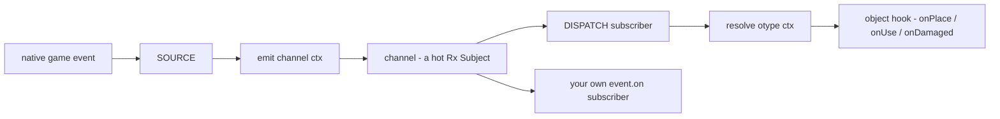
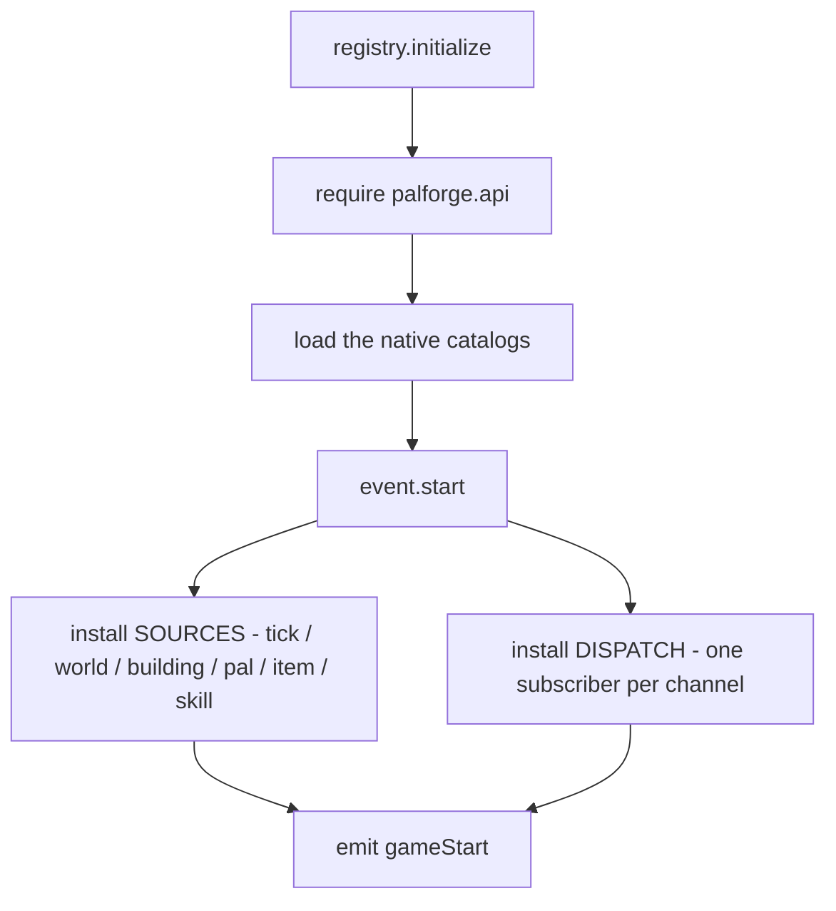
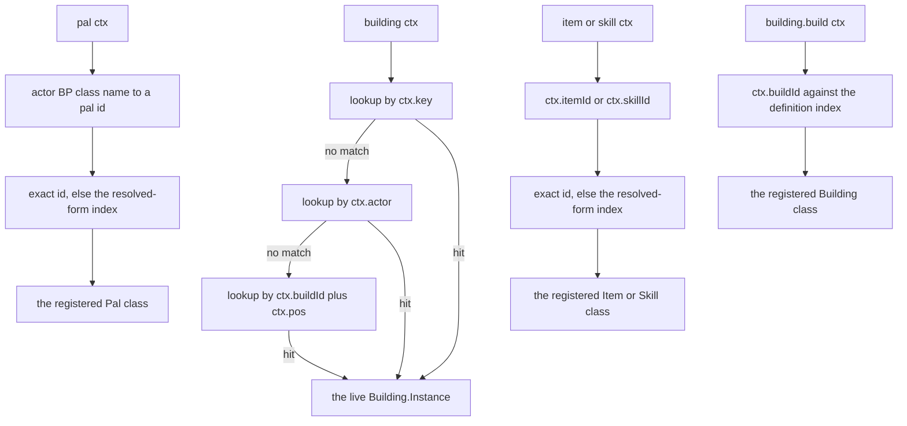
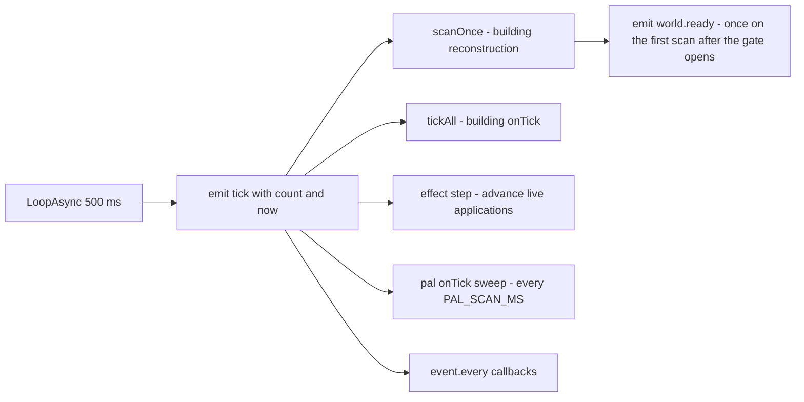
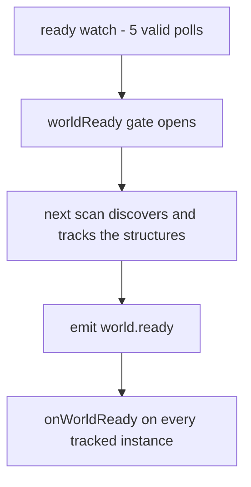
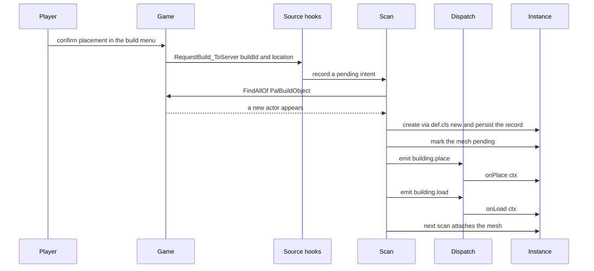
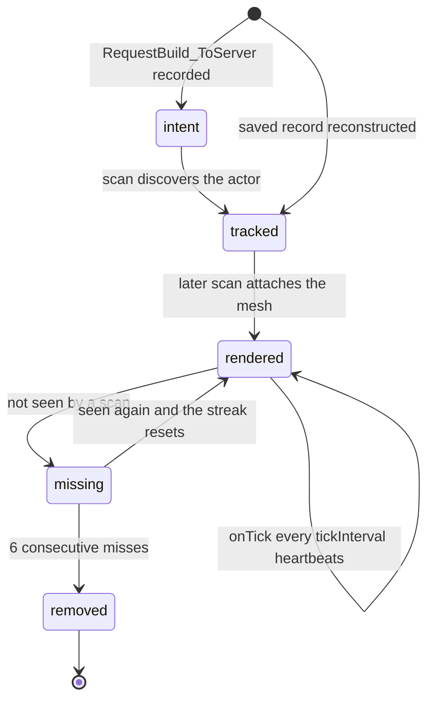
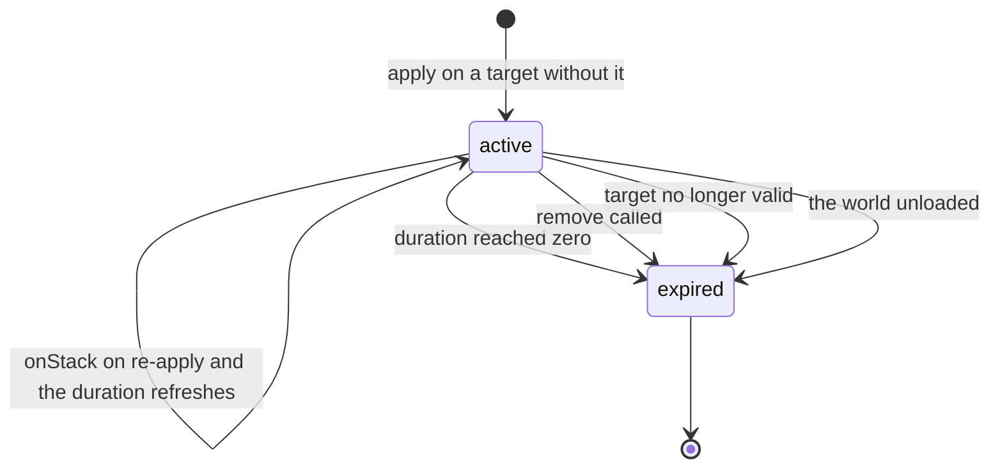

## このページでできるようになること

- 建物が置かれた瞬間、アイテムが使われた瞬間、パルが倒された瞬間に自分のコードを動かす
- 遊んでいる間ずっと動き続け、ワールドを再ロードしても数値を覚えている建物を作る
- 20 秒ごとにベリーが実る茂みのように、タイマーで何かを起こす
- ゲームが実際に知らせてくれる瞬間を把握して、来ないイベントを待たずに済ませる
- ハンドラが動かなかった理由をログから突き止める

## いつ動かすかを指定する

定義はテーブルです。その `events` テーブルに関数を入れておくと、対応することがゲームで起きた
ときに PalForge がその関数を呼びます。

```lua title="content/berries.lua"
Item{
    id = "Berries",
    events = {
        onUse = function(item, ctx)
            Item.get("Wood"):give(1)      -- eat a berry, get a log
        end,
    },
}
```

ゲーム内でベリーを食べると、木材が 1 つインベントリに入ります。「いつ」を指定しているのはキーの
名前です。`onUse` は「プレイヤーがこのアイテムを使ったとき」という意味です。

名前の一覧はドメインごとに違います。建築物には `onPlace`、`onRightClick`、`onTick` などがあり、
パルには `onDamaged`、`onDeath`、`onCaptured`、アイテムには `onObtain` と `onUse` があります。
ドメインごとの全リストと、そのうち今のゲームが本当に発火させるものは、このページの後半にあります。

定義を使わずに待ち受けることもできます。`event.on` は **チャンネル**（`pal.spawned` のような、
名前の付いた瞬間）を購読し、そこに何かが流れてくるたびに関数を実行します。

```lua
local event = require("palforge.core.event")

event.on("pal.spawned", function(ctx) print(ctx.actor) end)
event.emit("example:custom", { note = "channels are created on demand" })
```

ほとんどのパックではこれは不要です。定義に `events = { ... }` を書くのが通常の入り口で、
届く経路は同じチャンネルです。

## イベントがコードに届くまで

ゲーム内の瞬間とハンドラの間には 3 つの段階があり、あらゆる瞬間がこの順に 3 つとも通ります。
自分で呼ぶことはありません。名前を知っておくと、ログを読むときに役立ちます。

| 層 | 内容 |
| --- | --- |
| BUS | 名前付きチャンネル。各チャンネルはホットな Rx Subject で、`on` / `emit` / `observable` / `every` を備えます。 |
| SOURCE | ネイティブフックやループが、ゲームイベントを `emit(channel, ctx)` に変換します。 |
| DISPATCH | チャンネルごとの購読者。イベントが起きたオブジェクトを解決し、そのフックを呼びます。 |



`event.CHANNELS` のチャンネルには、すべて SOURCE が用意されています。ただし 1 つ、`skill.hit`
だけは一度もイベントを運んだことがありません。ネイティブ候補は 2 つとも登録に成功したうえで、
確実にダメージが入った戦闘のあいだ沈黙し続けました。これが未解決項目 `skill-hit-source` です。
建築物の `onLeftClick` と `onBreak` にはそもそもチャンネルがありません。ダンプを読んでも供給元に
できるものが存在しないからです。どれがどれなのかは、後述のチャンネル表に載っています。

### 起動時の配線順序

`registry.initialize()` は、Mod ロード時に `main.lua` が呼ぶものです。パックが最初のイベントを
受け取る前に、すべてを配置します。



`event.start()` がエンジン側の層を武装させるのは、セッションごとに一度だけです。UE4SS は
`RegisterHook` も `LoopAsync` も取り消せないため、二重に武装すればすべてのハンドラが 2 回、次は
3 回走ってしまいます。2 回目以降の呼び出しはもう一方の分岐に入り、`installDispatch()` を再実行
します。これは前回のチャンネル購読を破棄し、ロードし直された定義クラスにすべてのチャンネルを
つなぎ直す処理です。この分岐こそが F9 リロードの正体です。

`event.CHANNELS` のすべてのチャンネルは最初のゲームイベントより先に存在するので、パックの
ロード中に購読しても取りこぼしはありません。

### F9 リロードが差し替えるもの

F9 は `palforge.*` のモジュールをすべて `package.loaded` から落とし、`registry.initialize()` を
もう一度走らせます。定義・スペック・ハンドラ・API 面・テストスイート、そして自分のパックの
コードは本当に差し替わります。一方で、4 つのものは意図的にワイプを生き延びます。どれも一度は
代償を払って分かったことです。

| 生き延びるもの | 置き場所 | 理由 |
| --- | --- | --- |
| エンジン側のフックとループ | 一度だけ武装し、`_G.__PalForgeArmed` がそれを記録 | 最初のロードで武装したフックは、そのとき作られたコールバックを走らせ続けます。だからイベント SOURCE の中身を書き換えたときだけはゲームの再起動が要ります。それ以外はリロードで反映されます。 |
| 登録済みの定義すべて | `core.object_manager`（`reload.KEEP` に明記） | コンテンツパックは独自の require 名前空間を持つ別の UE4SS Mod なので、ワイプしても定義呼び出しは再実行されません。レジストリを残すことが、押した後もパックの内容を残すことです。 |
| チャンネル本体 | `_G.__PalForgeBus` | 最初のロードで武装したフックは、そのとき掴んだ subjects テーブルに流し込みます。新しく作り直すと、古い emitter は誰にも届かない場所へ流し続け、新しいディスパッチは空のバスを聴くことになります。 |
| 建築物ランタイムのレジストリ | `_G.__PalForgeBuildingRegistry`、および `_G.__PalForgeSpatialIndex` の空間インデックス | 再構築スキャンは一度だけ武装され、そのとき掴んだテーブルを持ち続けます。`_G` 上の 1 枚のテーブルが、スキャンとディスパッチが別々のレジストリを見てしまう事態を防ぎます。 |

さらに、繰り返し実行のコールバックが残っているあいだ、押しても **拒否** されます。`core/poll` の
ポーラーと `pf_watch` の長いチェーン 2 本は、いずれもリロードガードに自分を申告します。残ってい
る状態で押すと、どのチェーンを待っているのか、いつ武装されたのかがログに出て、リロードは行われ
ません。スケジュール済みの UE4SS コールバックの足元で `package.loaded` を消すと、そのレジストリ
参照が関数でないものを指しかねず、UE4SS はそれに対してエンジンの tick フックを外すという答えを
返します。tick フックは `ExecuteInGameThread` を捌く仕組みなので、ゲームは平然と動いたまま Mod の
キーバインドだけが再起動まで反応しなくなります。申告は 180 秒で自動的に失効し、拒否メッセージ
には解除用のコンソール行 `require('palforge.core.reload').asyncReset()` が出ます。

リロードが取り消さないものも 2 つあります。押す前に設置された建築物インスタンスは、スキャンが
発見し直すまで生成時のハンドラテーブルを持ち続けます。押す前に登録されたポーラーも、登録時の
クロージャを走らせ続けます。

### イベントが起きたオブジェクトを特定する

フックを呼ぶ前に、ディスパッチはそのイベントがどの定義のものかを判定します。
`resolve(otype, ctx)` がコンテキストテーブルを具体的なオブジェクトに対応付け、呼ぶ相手がいなければ
`nil` を返します。そのときは何も呼ばれません。



建築物は **ライブインスタンス**、つまりイベントが起きたその 1 棟に解決されます。パル・アイテム・
スキルは 1 つずつ追跡されていないので、登録済みの **クラス** に解決され、ハンドラは `ctx` から
アクターを読み取ります。定義していないバニラのパルやアイテムは何にも解決されず、フックは
呼ばれません。建築物のチャンネルでクラスに解決されるのは `building.build` だけで、これはアクター
が存在するより前に発火するからです。

クラスの照合はテーブル参照 2 回で終わります。まずゲームが報告した ID そのまま、外れたら
`object_manager.byResolved` です。これはレジストリが登録時に維持しているインデックスで、解決後の
行名から、それが定義された ID へ逆に引きます。名前空間付きの ID にもイベントが届くのはこのためで
（ゲームがスポーンさせるのは `BP_example_Boss_C`、報告されるアイテム行は `example_Ration` で、
コロン形式が現れることはありません）、同時に、1 つの行に解決される 2 つの ID がイベントごとの
運任せではなく定義時の警告になる理由でもあります。

## チャンネル

チャンネルは、名前の付いた 1 つの瞬間です。`event.CHANNELS` には 21 個あり、宣言順に並んでいます。

```lua
event.CHANNELS   --> {
--   "gameStart",
--   "world.ready", "world.left",
--   "building.place", "building.load", "building.interact", "building.remove",
--   "building.build",
--   "pal.spawned", "pal.damaged", "pal.death", "pal.captured",
--   "item.obtain", "item.use", "item.craft", "item.discard",
--   "skill.activate", "skill.hit", "skill.equip", "skill.unequip",
--   "tick",
-- }
```

チャンネルのイベントがどこから来るかは 3 つの語で表せます。この違いが、その上に機能を組めるか
どうかを決めます。

- **LIVE** — 名前の分かっているネイティブ関数が emit し、実際のセーブデータでイベントを運ぶところ
  が観測されています。
- **synthetic** — PalForge が再構築スキャンやループから自前で導出しています。背後にネイティブ
  呼び出しはなく、PalForge の外の何かが協力しなくても、このビルドで確実に発火します。
- **armed, unseen** — ネイティブフックは登録済みですが、まだ一度も何も運んでいません。

それぞれを送っているもの、`ctx` に入れる内容、最終的に呼ばれるフックは次の通りです。

| チャンネル | 状態 | emit するもの | `ctx` の内容 | ディスパッチ先 |
| --- | --- | --- | --- | --- |
| `gameStart` | synthetic | `registry.initialize`、`event.start()` の後（つまり F9 リロードのたびにも） | ペイロードなし | なし。直接の購読者のみ |
| `world.ready` | synthetic | ゲートが開いた後に最初に完走した再構築スキャン。ゲート自体は ready ウォッチで、`LoopAsync(1000)` が `PalPlayerCharacter` をポーリングし、5 回連続で有効だったときに開きます | ペイロードなし | 全ライブ建築物インスタンスの `onWorldReady`。その最初のスキャンが追跡を済ませています |
| `world.left` | synthetic | 同じウォッチ。ポーンが応答しなくなったとき | ペイロードなし | 全ライブ建築物インスタンスの `onWorldLeft`。その後ライブインスタンスは破棄されます |
| `building.place` | synthetic | スキャンが、保留中の `RequestBuild_ToServer` の意図と 300 cm 以内で一致するインスタンスを作ったとき | `key`, `actor`, `pos`, `buildId`, `player`, `firstSeen` | `onPlace` |
| `building.load` | synthetic | スキャン。新しく追跡対象になったすべてのインスタンス | `key`, `actor`, `pos`, `buildId`, `reconstructed` | `onLoad` |
| `building.interact` | LIVE | `/Script/Pal.PalBuildObject:OnBeginInteractBuilding` | `actor`, `player`, `buildId` | `onRightClick` |
| `building.remove` | synthetic | スキャンの削除スイープ。6 回連続で見失ったとき | `key`, `buildId`, `actor`, `reason` | `onRemove` |
| `building.build` | LIVE | `/Script/Pal.PalPlayerRecordData:OnCompleteBuild_ServerInternal`（`world.ready` で武装） | `buildId`, `model` | 定義クラスの `onBuild` |
| `pal.spawned` | LIVE | `/Script/Pal.PalNPC:OnCompletedInitParam` と `/Script/Pal.PalPlayerCharacter:OnCompleteInitializeParameter`（どちらも `world.ready` で武装） | `actor`, `via` | `onSpawned` |
| `pal.damaged` | LIVE | `/Script/Pal.PalCharacter:OnDamageReaction` | `actor` | `onDamaged` |
| `pal.death` | LIVE | `/Script/Pal.PalCharacter:OnDeadCharacter` | `actor` | `onDeath` |
| `pal.captured` | LIVE | `/Script/Pal.PalCharacterParameterComponent:SetIsCapturedProcessing`。引数が `true` のときのみ | `actor`, `comp` | `onCaptured` |
| `item.obtain` | LIVE | `/Script/Pal.PalPlayerState:AddItemGetLog_ToClient`。隣に `/Script/Pal.PalPlayerInventoryData:AddItem_ServerInternal` も武装 | `itemId`, `count`, `via` | `onObtain` |
| `item.use` | LIVE | `/Script/Pal.PalItemUseProcessor:UseItemToCharacter_ServerInternal` | `itemId`, `actor`, `player`, `itemData`, `targetId`, `processor` | `onUse` |
| `item.craft` | LIVE | `/Script/Pal.PalMapObjectConvertItemModel` と `/Script/Pal.PalMapObjectProductItemModel` の `OnFinishWorkInServer` | `itemId`, `recipeId`, `count`（常に nil）, `model`, `work`, `via` | `onCraft` |
| `item.discard` | LIVE | `/Script/Pal.PalNetworkItemComponent:RequestDrop_ToServer` と `:RequestDispose_ToServer` | `itemId`, `count`, `reason` | `onDiscard` |
| `skill.activate` | LIVE | `/Script/Pal.PalActionBase:OnBeginAction`。隣に `PalPlayerCharacter:OnBeginAction` と `PalUtility:PlayActionByWazaID` も武装 | `skillId`, `wazaId`, `owner`, `actor`, `target`, `action`, `via` | `onActivate`（第 2 引数は owner） |
| `skill.hit` | armed, unseen | `/Script/Pal.PalUtility:MakeDamageInfoByWazaType` と `/Script/Pal.PalAnimNotifyState_AttackCollision:OnHit`。どちらも沈黙を実測 | `skillId`, `wazaId`, `target`, `owner`, `attacker`, `location`, `via` | `onHit`（第 2 引数は target） |
| `skill.equip` | LIVE | `/Script/Pal.PalIndividualCharacterParameter:AddPassiveSkill` と、`PalPassiveSkillComponent:SetupSkillFromSelf` のリスト差分（どちらも `world.ready` で武装） | `skillId`, `owner`, `actor`, `params` または `component`, `overrides`, `via` | `onEquip` |
| `skill.unequip` | LIVE | `:RemovePassiveSkill` と、同じリスト差分 | `skillId`, `owner`, `actor`, `via` | `onUnequip` |
| `tick` | synthetic | `ExecuteInGameThread` 内の `LoopAsync(500)` | `count`, `now` | ティックリスト経由で建築物の `onTick` |

複数の SOURCE を同時に抱えるチャンネルがいくつかありますが、これは雑さではなく意図です。7 月の
セッションで、4 つのフックが登録に成功したまま一度も発火せず、その裏で 10 個のチャンネルが名乗り
を上げました。UE4SS はフックを解除できず、沈黙しているフックのコストはゼロなので、ヘッダダンプが
挙げた候補は、黙った側の **隣に** 並べて武装してあります。どれも必要な同一性でガードされている
ため、増えた SOURCE は沈黙を足すことはできても、誤ったイベントを足すことはできません。どれが運ん
だかは `ctx.via` が示し、チャンネルごと・SOURCE ごとの初回発火はログが告知します。

<Callout type="info">
`world.ready` と `world.left` はペイロードなしで emit されるため、直接の購読者が受け取るのは
`nil` です。建築物のディスパッチは `onWorldReady` / `onWorldLeft` を呼ぶ前に空テーブルを差し替える
ので、これらのハンドラは常にテーブルを受け取ります。
</Callout>

<Callout type="warn">
ハートビート以外のネイティブフックは、ワールドが準備できていない間はすべて即座に return します。
建築物スキャン、interact フック、設置意図フック、そしてパル・アイテム・スキルのフックはいずれも
同じゲート確認から始まります。うち 7 つ（`building.build`、`pal.spawned` の候補 3 つ、パッシブ
スキル関連の 3 つ）は、そもそもその時点まで武装すらされません。どれもワールドロードの嵐で既存
オブジェクトぶんも発火し、初期化途中のメモリを読むと `pcall` では捕まえられないネイティブの
アクセス違反が起きたためです。ready ウォッチ自体をインストールできなかった場合、ゲートは開いた
ままの状態でフォールバックし、ディスパッチは最初から動作します。このフォールバックでは
`world.ready` も予約されますが、emit するものはありません。`LoopAsync` がない以上ハートビートも
なく、告知役のスキャンも走らず、遅延武装のフックも武装しないためです。
</Callout>

チャンネル名は自分で作れます。`event.emit` と `event.on` は初めて名前を書いた時点でチャンネルを
生成するので、パック内での連絡にも、別のパックとの連絡にも使えます。

```lua
local event = require("palforge.core.event")

event.on("mypack:quest.completed", function(ctx)
    Item.get("Wood"):give(ctx.reward or 1)
end)

event.emit("mypack:quest.completed", { reward = 25 })
```

ゲームが背後にあるのは `event.CHANNELS` の名前だけです。独自の名前は、自分で送って自分で受け取る
だけのメッセージになります。

## ハートビート

PalForge は 500 ms ごとに動くタイマーを 1 本だけ持ちます（`event.TICK_MS = 500`）。これが
`ExecuteInGameThread` の内側から `tick` を emit するので、すべての購読者はゲームスレッド上で
動きます。

```lua
event.on("tick", function(ctx)
    -- ctx.count = how many heartbeats since the loop started
    -- ctx.now   = os.clock() at emit time
end)
```

周期処理はすべてこの 1 本のループに乗っています。もう 1 本あるのは ready ウォッチだけで、
こちらは独自の `LoopAsync(1000)` でポーリングします。



### event.every

`event.every(ms, fn)` はハートビートごとに `TICK_MS` を足し、合計が `ms` に達したら発火して
0 から数え直します。実際の周期は、`ms` を 500 の倍数に切り上げた値です。

```lua
local event = require("palforge.core.event")
local log   = require("palforge.utils.log").scope("beat")

local sub = event.every(5000, function()
    log.info("five seconds of heartbeats")
end)

sub:unsubscribe()   -- stop it
```

| 指定 | 実際の周期 |
| --- | --- |
| `event.every(500, fn)` | ハートビートごと |
| `event.every(700, fn)` | 1000 ms ごと |
| `event.every(2000, fn)` | 2000 ms ごと |
| `event.every(2500, fn)` | 2500 ms ごと |

`fn` は `pcall` の中で実行されます。コールバック内のエラーはハートビートを壊しませんが、報告も
されません。失敗を確認したい場合はコールバックの中でログを出してください。

### 建築物スキャンも同じ周期に乗る

設置した構造物を見つけるスキャンは、同じ定数を使った 1 本の `event.every(500, ...)` コールバック
から走ります。このコールバックは `scanOnce()` を呼び、その後で遅延された `world.ready` の emit を
担当します。順序はこの通りです。おかげでランタイム全体を 1 つの数値で把握できます。設置した
建築物はおよそ 1 ハートビートでライブインスタンスになり、そのメッシュはさらに 1 ハートビート後に
現れ、消えた建築物は 6 回連続で見失った時点、およそ 3 秒で破棄されます。

## 実際に動くフック

フックを書けることは、何かがそれを発火させる保証ではありません。ドメインごとに、配線されていない
場合の代わりも添えて見ていきます。

### Building

SOURCE を持つフックはすべて LIVE です。構造物ごとの状態を持つのはこのドメインだけです。

| フック | 状態 | SOURCE |
| --- | --- | --- |
| `onPlace` | LIVE | スキャン。`RequestBuild_ToServer` の意図と一致したとき |
| `onLoad` | LIVE | スキャン。新しく追跡対象になったすべてのインスタンス |
| `onRightClick` | LIVE | `OnBeginInteractBuilding` |
| `onRemove` | LIVE | スキャンの削除スイープ |
| `onTick` | LIVE | ハートビート。`tickInterval` で間引かれます |
| `onWorldReady` | LIVE | ready ゲートが開いた後、最初に完走したスキャン |
| `onWorldLeft` | LIVE | ready ウォッチ |
| `onBuild` | LIVE | `OnCompleteBuild_ServerInternal`（`world.ready` で武装） |
| `onLeftClick` | 宣言のみ | ネイティブ SOURCE なし。探索は打ち切り済み |
| `onBreak` | 宣言のみ | ネイティブ SOURCE なし。探索は打ち切り済み |

建築物のフックのうち、ライブインスタンスを渡されないのは `onBuild` だけです。これは建築完了の
時点、つまりスキャンがインスタンスを作る（最大 500 ms 後）より前に発火し、ネイティブ呼び出しが
運ぶのはアクターではなく `UPalMapObjectModel` です。そのためディスパッチは build id から定義
**クラス** を解決し、ハンドラは `ctx.buildId` と `ctx.model` を読みます。このフックがロード時
ではなく `world.ready` で武装されるのは、ワールドロードの嵐で既存の建築物ぶんも発火し、そこで
初期化途中のモデルメモリを読んだ結果ネイティブのアクセス違反が起きたからです。安全な設置フック
は引き続き `onPlace` で、`onBuild` は追加の 1 つです。まずは捨ててよいワールドで試してください。

`onLeftClick` と `onBreak` はスペックとしては受理されますが呼ばれることはなく、これは省略では
なく計測の結果です。両者の唯一の候補だった `OnDamage` は劣化タイマーでした。参照記録には 196 回
の発火があり、すべて設置済みの `WorkBench` に対して、構造物ごとに 12〜13 秒の一定間隔で、プレイ
ヤーは一切関与せず、構造物が壊れることもありませんでした。さらに、候補となる 4 クラスのどれにも
Destroy / Dismantle / Break / Click にあたるエントリがありません。破壊はデリゲートの **フィールド**
としてしか現れず、`RegisterHook` はそれをパスで指定できません。破壊はスキャンの見失いスイープが
引き続きカバーします（しきい値ぶん遅れ、実行者は分かりません）。そちらには `onRemove` を使って
ください。

`onRightClick` は SOURCE の側でフィルタとデバウンスがかかります。操作した相手が
`PalCharacter` のときだけ通り、同じ構造物への 2 回目の操作は 1 秒以内なら捨てられます。

`onWorldReady` はライブインスタンスに届きます。ready ウォッチが行うのはゲートを開けることだけで、
チャンネルを emit するのはその後に最初に完走した再構築スキャンです。アクターを追跡対象の
インスタンスに変えるのはスキャンなので、ディスパッチがライブ集合を走査する時点で、プレイヤーの
周囲の構造物はすでにその中にいます。通知が遅れるのは最大でも 1 ハートビート、500 ms です。



ワールドを出るとライブインスタンスはすべて破棄され、予約されていた emit も取り消されます。次の
ロードでは、空のレジストリから同じ手順がもう一度走ります。

```lua title="content/lamp.lua"
local event = require("palforge.core.event")
local log   = require("palforge.utils.log").scope("lamp")

Building{
    id     = "example:Lamp",
    name   = "Signal Lamp",
    gridCm = 100,
    state  = { loads = 0 },
    mesh   = {
        kind  = "static",
        model = "/Game/Pal/Model/Prop/Architecture/WorkBenchPrimitive/SM_WorkBenchPrimitive.SM_WorkBenchPrimitive",
    },
    events = {
        onWorldReady = function(inst, ctx)
            -- once per world load, on every lamp the first scan tracked
            inst.state.loads = (inst.state.loads or 0) + 1
            inst:save()
            log.info(inst.key .. " online, load #" .. tostring(inst.state.loads))
        end,
        onRightClick = function(inst, ctx)
            log.info(inst.key .. " has survived " .. tostring(inst.state.loads) .. " loads")
        end,
    },
}

-- the same moment, as a cross-cutting subscriber
event.on("world.ready", function()
    log.info(tostring(#event.instances()) .. " structures tracked")
end)
```

<Callout type="info">
`onWorldReady` はワールドロードという一度きりの瞬間であり、構造物ごとの瞬間ではありません。後の
スキャンで流れ込んできた構造物は、emit がすでに終わっているため受け取れません。インスタンス単位の
起動処理は `onLoad` の担当です。こちらはスキャンが追跡した時点で、それがいつのスキャンであっても
発火し、`ctx.reconstructed` がセーブ由来かどうかを教えてくれます。
</Callout>

### Pal

| フック | 状態 | SOURCE |
| --- | --- | --- |
| `onCaptured` | LIVE | `SetIsCapturedProcessing` が `true` のとき |
| `onDamaged` | LIVE | `OnDamageReaction` |
| `onDeath` | LIVE | `OnDeadCharacter` |
| `onSpawned` | LIVE | `PalNPC:OnCompletedInitParam` と `PalPlayerCharacter:OnCompleteInitializeParameter` |
| `onTick` | LIVE | パルスイープ。`event.PAL_SCAN_MS` ごと |

<Callout type="warn">
`onSpawned` は `PalCharacter:BroadcastOnCompleteInitializeParameter` には接続されていません。
その理由は覚えておく価値があります。このブロードキャスタは **沈黙を実測** されているからです。
実際のセーブで `world.ready` の後に武装し、パルを捕獲しては解放しても、10 個のチャンネルが名乗り
を上げるあいだ、このチャンネルはそこから何も運びませんでした。バインド先のデリゲート **ターゲット**
ではなくブロードキャスタをフックする、という誤りを記録するための事例です。実際に運ぶのはその
ターゲット 2 つです。`PalNPC:OnCompletedInitParam` は、`APalMonsterCharacter` が再宣言せずに継承
しているためすべてのパルを拾い、`PalPlayerCharacter:OnCompleteInitializeParameter` はプレイヤーが
購読したキャラクター、つまり手持ち側の経路だけを拾います。どちらが発火したかは `ctx.via` が示し
ます。未解決なのは「動くかどうか」より狭い話です。これまで記録された発火はすべて `world.ready` と
同じ秒に、つまり周囲のパルが一斉に初期化されるロードの嵐の中で起きているため、「このパルはさっき
まで存在しなかった」はまだ計測されていません。`onSpawned` は冪等に書いてください（SOURCE 側でも
アクター単位・1 秒以内の重複は除去されます）。
</Callout>

<Callout type="info">
パルの `onTick` にネイティブフックはなく、代わりにスイープが駆動します。`event.PAL_SCAN_MS`
ごと（既定 3000 ms、公開値なのでパックが実行時に変更できます）に `FindAllOf("PalCharacter")` を
歩き、各アクターを登録済みのパルクラスに解決して、`ctx.actor` / `ctx.count` / `ctx.now` を渡して
`onTick` を呼びます。インスタンス単位ではなくクラス単位であることから 2 つの帰結があります。
`self` は定義であり、ポーンは `ctx` に乗るので、パルごとの状態は自分でキーを決めたテーブルに置く
こと。そして、成功を挟まずに 5 回例外を投げたハンドラは、その ID をログに残してセッション中は
無効化されること。スイープがハートビートより意図的に遅いのは、`FindAllOf` が全 UObject を歩く
既知のカクつき要因だからで、パルが 1 つも定義されていない間は列挙自体を丸ごと省きます。
</Callout>

### Item

| フック | 状態 | SOURCE |
| --- | --- | --- |
| `onObtain` | LIVE | `AddItemGetLog_ToClient`。隣に `AddItem_ServerInternal` も武装 |
| `onUse` | LIVE | `UseItemToCharacter_ServerInternal` |
| `onCraft` | LIVE | convert / product の作業モデルの `OnFinishWorkInServer` |
| `onDiscard` | LIVE | `RequestDrop_ToServer` と `RequestDispose_ToServer` |

`onObtain` はゲーム自身の「アイテム入手」ログに乗っているため、拾得・戦利品・報酬で発火します。
入手ログに現れない内部的な追加は、インベントリ追加の経路を通る場合だけカバーされます。2 つの
SOURCE は 1 回の拾得を 2 つの角度から見たものなので、同じ ID が 0.5 秒以内に繰り返された場合は
捨てられ、届くのは 1 回だけです。どちらが運んだかは `ctx.via` が示します。

`onCraft` は作業台や炉で生産作業が完了したときに発火します（2026-07-26、実機で製作して観測）。
`ctx.count` は nil で、そのままです。1 回あたりの個数はレシピ行にあり、ネイティブフックの中で
DataTable を読むことはこの SOURCE はしません。convert 経路では `ctx.itemId` はレシピ ID であり、
バニラのレシピではそれが生産物のアイテム ID そのものです。パックがそれに頼らずに済むよう、
両方の名前で渡されます。

`onDiscard` はプレイヤーがスタックを地面に落としたとき、またはインベントリ画面から破棄したときに
発火し、どちらかは `ctx.reason` が伝えます。アイテム ID は、サーバがスロットを空にする前に、
リクエストが指すスロットのコンテナ GUID を生きている `PalItemContainer` すべてと突き合わせて読み
取る必要があります。この探索に失敗した場合、SOURCE は推測した ID でイベントを出したりせず何も
emit せず、どの段階で失敗したかを理由ごとに 1 度だけログに残します。

LIVE な 2 つのアイテムチャンネルはゲーム側のアイテム ID を運び、ディスパッチはそれを 2 段階で
定義に突き合わせます。まず ID の完全一致、次に登録済み ID を解決した DataTable 行名との一致です。
そのため、名前空間付きの `Item{ id = "example:Ration" }` も、ゲームが報告するのが
`example_Ration` だけであってもイベントを受け取れます。

```lua title="content/rations.lua"
local log = require("palforge.utils.log").scope("rations")

Item{
    id       = "example:Ration",
    name     = "Field Ration",
    category = "consumable",
    maxStack = 20,
    events = {
        onObtain = function(item, ctx)
            log.info("picked up " .. tostring(ctx.count) .. " x " .. tostring(ctx.itemId))
        end,
        onUse = function(item, ctx)
            -- ctx.itemId is "example_Ration" here: the row name, not the colon form
            Item.get("Berries"):give(1)
        end,
    },
}
```

<Callout type="warn">
`item.use` の `ctx.actor` は本物のポーンです。中身は `FindFirstOf("PalPlayerCharacter")`、つまり
ローカルプレイヤーで、同じ値が `ctx.player` にも入っています。ネイティブ呼び出しの第 1 引数、
`UPalStaticItemDataBase` のアイテムデータオブジェクトは `ctx.itemData` にあり、第 2 引数は
`ctx.targetId`（`FPalInstanceID`）として未解決のまま渡されます。インスタンス ID からアクターを
引く方法は、どちらのツリーにも実証されたものがないためです。残っている注意点は型ではなく
「どのキャラクターか」です。`ctx.actor` はアイテムを **使った** 側であり、それが **使われた対象**
と一致するのは食料などの自己使用のときだけです。パルに与えた場合、そのパルは `ctx.targetId` の
側にいます。
</Callout>

### Effect

4 つのフックはすべて動きます。そのタイミングを決めているのはゲームイベントではなく、
`api/effect.lua` とハートビートです。`:apply(target)` が実際の適用を開始し、それを `tick`
チャンネルが進め、`world.left` が終わらせます。

| フック | 状態 | 駆動元 |
| --- | --- | --- |
| `onApply` | LIVE | まだ持っていない対象への `:apply(target)` |
| `onTick` | LIVE | ハートビート。`interval` 秒ごと |
| `onStack` | LIVE | すでに持っている対象への `:apply(target)` |
| `onExpire` | LIVE | `duration` が 0 になる、`:remove(target)`、対象が無効になる、またはワールドがアンロードされる |

<Callout type="warn">
定義に `nativeStatus` を書くと、エフェクトが動いているあいだゲーム本体の状態異常が点灯し、終了
すると消えます。アイコンは実際に変わります。それ以外はこれまでどおり自分の担当です。体力を削る、
アイテムを渡すといったゲームプレイはハンドラの中に書いてください。
</Callout>

### Skill

スキルの 4 チャンネルのうち 3 つは、ゲーム側からイベントを運びます。4 つとも、自分で呼び出せば
実行され、そのときクールダウンは Lua 側で強制されます。

| フック | 状態 | SOURCE |
| --- | --- | --- |
| `onActivate` | LIVE | `PalActionBase:OnBeginAction`。パルの技はアクションオブジェクトそのもので、自分の `EPalWazaID` を持っています |
| `onEquip` | LIVE | `AddPassiveSkill` と、`SetupSkillFromSelf` のリスト差分 |
| `onUnequip` | LIVE | `RemovePassiveSkill` と、同じリスト差分 |
| `onHit` | armed, unseen | `MakeDamageInfoByWazaType` と `PalAnimNotifyState_AttackCollision:OnHit`。どちらも沈黙を実測 |

届かないのは `onHit` だけで、この否定は両側から確定しています。2 つのフックは武装済みのまま、
`pal.damaged` と `pal.death` がどちらも発火した戦闘のあいだ何も運びませんでした。つまり攻撃は
確実に当たり、確実にダメージを与えています。そしてダメージ経路のどこにも技を名指しするものが
ありません。`FPalDamageRactionInfo` は 6 フィールド、`FPalDamageInfo` は 40、`FPalDamageResult`
は 12 で、そのどれも `EPalWazaID` ではありません。ID がヒットに届く道は、直前の発動を覚えておいて
後続のダメージに結び付けることだけですが、それは SOURCE ではなく推測であり、意図的に配線して
いません（外れた技や、同じ時間帯にいるもう 1 体の攻撃まで、最後に発動したものへ結び付いてしまう
ため）。動く入り口は `:hit(target)` です。

ディスパッチされるのは `Skill{ ... }` で **定義した** スキルだけです。`Skill.get("FireBlast")` が
返すのは登録されていないハンドルなので、ゲームが FireBlast を撃っても何にも届きません。
`ctx.skillId` は、戦闘系 2 チャンネルでは `EPalWazaID` の名前、パッシブ系 2 チャンネルではパッシブ
行の FName です。

パッシブ側の疑問を閉じた発火は、PalForge 自身の書き込みから来ました。`Skill.Handle:teach` が
生きたパルに対して `AddPassiveSkill` に到達したもので、つまりハンドラは自分のパックが行った変更に
ついても知らされます。記録されたのは装備方向です。`onEquip` を冪等にしておく理由はもう 1 つあり
ます。あるキャラクターに対する最初の `SetupSkillFromSelf` 呼び出しは、そのキャラクターがすでに
持っているパッシブをすべて報告します。

```lua
local log = require("palforge.utils.log").scope("fireball")

local Fireball = Skill{
    id       = "example:Fireball",
    kind     = "active",
    element  = "fire",
    cooldown = 3.0,
    power    = 50,
    events = {
        onActivate = function(skill, owner, ctx)
            log.info(skill.id .. " fired by " .. tostring(owner))
        end,
    },
}

Fireball:activate(myPalActor)   -- false while cooling down
Fireball:hit(targetActor)
```

`:activate` / `:hit` / `:equip` / `:unequip` は、自分が制御するコード（パルのハンドラ、建築物の
`onRightClick`、キーバインドなど）からいつでもハンドラを実行でき、チャンネルが運ぶかどうかとは
無関係です。`onHit` にとっては、これが唯一の経路です。

### Audio、Mesh、UI

ライフサイクルチャンネルはありません。オーディオは再生するもの、メッシュは着せるもの、UI 要素は
`render` と `update` に加えて、自分で呼ぶマウント・リフレッシュ・アンマウントを持ちます。

## ハンドラの引数

第 1 引数は常に **そのイベントが起きたオブジェクト** です。

| ドメイン | 第 1 引数 | シグネチャ全体 |
| --- | --- | --- |
| Pal | `Pal.Handle` | `function(pal, ctx)` |
| Item | `Item.Handle` | `function(item, ctx)` |
| Building | `Building.Instance` | `function(instance, ctx)` |
| Skill | `Skill.Handle` | `function(skill, owner, ctx)` |
| Effect | `Effect.Handle` | `function(effect, target, ctx)` |

パル・アイテム・スキル・エフェクトでは、この第 1 引数は定義したときに返ってきたハンドルです。
だからハンドラの中から `:spawn`、`:give`、`:activate`、`:apply` にそのまま手が届きます。建築物では
ライブインスタンスなので、`self.actor`、`self.pos`、`self.state`、`self:save()` がすぐ使えます。

```lua title="content/handlers.lua"
local log = require("palforge.utils.log").scope("handlers")

Pal{
    id = "ChickenPal",
    events = {
        onSpawned = function(pal, ctx)          -- pal is the Pal.Handle
            pal:renderOn(ctx.actor)
        end,
    },
}

Item{
    id = "Berries",
    events = {
        onUse = function(item, ctx)             -- item is the Item.Handle
            log.info(item.id .. " used as " .. tostring(ctx.itemId))
        end,
    },
}

Building{
    id = "example:Bench",
    events = {
        onRightClick = function(inst, ctx)      -- inst is the LIVE instance
            inst.state.uses = (inst.state.uses or 0) + 1
            inst:save()
        end,
    },
}

Skill{
    id = "example:Fireball",
    events = {
        onActivate = function(skill, owner, ctx) end,   -- owner comes before ctx
    },
}

Effect{
    id = "example:Regen",
    events = {
        onTick = function(effect, target, ctx) end,     -- target comes before ctx
    },
}
```

`ctx` は素のテーブルです。キーはチャンネルによって変わり、チャンネル表が全チャンネル分の内容を
載せています。

### ハンドラが例外を投げたとき

ディスパッチはハンドラを `pcall` の中で呼び、捕まえた例外をチャンネル名とフック名つきでログに
出します。ハンドラ本文のタイプミスは、発火しなかったフックとは別物として見分けられます。

```text
[PalForge.event][err] item.use -> onUse handler failed: content/rations.lua:12: attempt to index a nil value
[PalForge.event][err] world.ready -> onWorldReady handler failed on 'example_Lamp@12,-8,3': ...
```

ワールド系のフックはライブ建築物すべてを回るため、インスタンスキーも出します。壊れたインスタンス
1 つは飛ばされ、残りにはそのまま呼び出しが届きます。建築物の `onTick` はこれに加えて独自の報告と
サーキットブレーカーを持ちます。

## 建築物ランタイム

設置された建築物は、自分専用のオブジェクトと状態を持ち、ワールドごとに保存される唯一の存在です。
2 か所に置いたランプは別々のカウンタを持ち、どちらも再ロード後に残ります。

### 設置操作から onPlace まで



<Steps>

<Step>
### 設置意図

`/Script/Pal.PalNetworkPlayerComponent:RequestBuild_ToServer` へのフックが、ビルド ID と位置を
読み取ります。この時点でアクターはまだ存在しないため、ここで何かを生成することはできません。
意図は最大 16 件のキューに入り、古いものから捨てられます。登録済み定義に属するビルド ID に
解決できた場合だけ記録されます。
</Step>

<Step>
### スキャン

`event.every(500, scanOnce)` が `FindAllOf("PalBuildObject")` を走査します。各アクターは 3 段階で
識別されます。クラス名 `BP_BuildObject_<Id>_C`、次にアクターの `MapObjectModel.BuildObjectId`、
最後に保存済みレコードとの位置一致です。すでにインスタンスに束縛されているアクターは高速パスに
入り、位置の更新だけを行います。
</Step>

<Step>
### 同一性

インスタンスのキーはビルド ID と量子化されたワールド座標の組で、`"<buildId>@<qx>,<qy>,<qz>"` の
形をとります。量子化には定義の `gridCm`、既定 100 cm を使います。正となる座標は常にライブ
アクターの位置です。スキャンをまたいで既知のインスタンスを束縛するのは、キーではなく **アクター**
です。設置直後の建築物が報告する位置は、スキャン間で 1 セル以上ぶれるためです。その束縛はアクター
の `GetFullName()` 文字列に対して行われ、ハンドルに対しては行われません。UE4SS は参照のたびに
新しいラッパーを作り、スキャンごとの `FindAllOf` も毎回新しいものを返すからです。
</Step>

<Step>
### 生成と永続化

インスタンスは `def.cls:new{ ... }` で作られるので、定義に書いたメソッドはすべてその上で解決
します。state は保存済みレコードがあればそこから、なければ定義の `state` フィールドから取られ
ます。`state` はテーブルでもファクトリ関数でも構いません。新規インスタンスは Mod フォルダ配下の
`state/entities_<saveId>.json` に書き込まれます。`saveId` は `PalGameInstance` から読みます。
まずセーブ **ディレクトリ** 名（`GetSelectedWorldSaveDirectoryName`、またはその実体プロパティ）、
次にワールドの表示名で、記号を除いたうえで `w_` を前置します。どちらも答えない場合は共有の
`world` にフォールバックします。
</Step>

<Step>
### イベント

`building.place` が emit されるのは、保存済みレコードがなく、かつ 300 cm 以内に一致する保留意図が
あるときだけです。`building.load` は新しく追跡対象になったすべてのインスタンスで emit され、
`ctx.reconstructed` がセーブ由来かどうかを示します。したがって新規設置では `onPlace` が先に、
`onLoad` がその直後に発火します。
</Step>

<Step>
### 遅延メッシュ

インスタンスが `model` パスを持つメッシュを備えている場合、その場では取り付けず、保留マークを
付けます。取り付けは **後の** スキャンで、同じアクターが再び観測されてから行われます。
</Step>

</Steps>

<Callout type="error">
建築物が設置されたそのフレームでメッシュを取り付けると、まだ準備中のネイティブオブジェクトに
触れてゲームがクラッシュします。ネイティブのアクセス違反は `pcall` では捕捉できないため、
ランタイムはアクターがスキャンを 1 回生き延びるまで待ちます。

実際上の帰結として、`onPlace` の中ではメッシュはまだ取り付けられていません。完成した見た目に
対して何かしたい場合は、`onRightClick` や `onTick` で行うか、後から自分で `inst:render()` を
呼んでください。
</Callout>

### インスタンスオブジェクト

建築物のハンドラが `self` として受け取るのがこれです。

<TypeTable
  type={{
    id: { description: 'クラスから継承される定義のビルド ID', type: 'string' },
    buildId: { description: 'このインスタンスが一致したゲーム側のビルド ID', type: 'string' },
    key: { description: '安定したレジストリキー。ビルド ID と量子化セルの組', type: 'string' },
    actor: { description: '設置された APalBuildObject', type: 'any' },
    pos: { description: 'ワールド座標。スキャンごとに更新されます', type: '{ x, y, z }' },
    state: { description: '永続化されるあなたのテーブル。その場で書き換えて save を呼びます', type: 'table' },
  }}
/>

インスタンスのメソッド。

| 呼び出し | 効果 |
| --- | --- |
| `inst:save()` | レコードを dirty にし、ワールドファイルを今すぐディスクへ書き出します |
| `inst:setDirty()` | 書き込まずに dirty にします。次の flush で拾われます |
| `inst:isValid()` | `inst.actor` がまだ有効なエンジンオブジェクトかどうか |
| `inst:render()` | アクターにメッシュとマテリアルを取り付けます。通常はスキャンが行います |
| `inst:update()` | `inst:currentColor()` からライブマテリアルを再着色します |
| `inst:mesh()` | メッシュ記述子。状態に応じたメッシュにしたい場合はオーバーライドします |

保存レコードの `state` は `inst.state` と同じテーブルなので、その場で書き換えるだけで十分です。
`:save()` はディスクに落とすタイミングを決めるだけです。

```lua title="content/buildings.lua"
local log = require("palforge.utils.log").scope("counter")

Building{
    id     = "example:Counter",
    name   = "Counter Bench",
    gridCm = 100,
    state  = { uses = 0 },
    mesh   = {
        kind  = "static",
        model = "/Game/Pal/Model/Prop/Architecture/WorkBenchPrimitive/SM_WorkBenchPrimitive.SM_WorkBenchPrimitive",
    },
    events = {
        onPlace = function(inst, ctx)
            log.info("placed at " .. inst.key .. " by " .. tostring(ctx.player))
            inst.state.uses = 0
            inst:save()
        end,
        onLoad = function(inst, ctx)
            if ctx.reconstructed then
                log.info("restored with " .. tostring(inst.state.uses) .. " uses")
            end
        end,
        onRightClick = function(inst, ctx)
            inst.state.uses = inst.state.uses + 1
            inst:save()
        end,
        onRemove = function(inst, ctx)
            log.info("removed, reason " .. tostring(ctx.reason))
        end,
    },
}
```

### tickInterval とサーキットブレーカー

`tickInterval` の既定値は 1 で、1 以上の整数でなければなりません。それ以外の値は黙って 1 に戻され
ます。インスタンスがティックするのは `ctx.count % tickInterval == 0` のときだけなので、
`tickInterval = 4` は 4 ハートビートに 1 回、つまり 2 秒に 1 回を意味します。

`onTick` を持たない建築物は、ハートビートごとのコストがゼロです。ティックリストに入るのは
`onTick` をオーバーライドしているクラスだけだからです。

```lua
Building{
    id           = "example:SlowFurnace",
    tickInterval = 20,          -- once every 20 heartbeats, about 10 seconds
    state        = { fuel = 0 },
    events = {
        onTick = function(inst, ctx)
            if inst.state.fuel > 0 then
                inst.state.fuel = inst.state.fuel - 1
                inst:setDirty()
            end
        end,
    },
}
```

`onTick` が成功を挟まずに 5 回例外を投げると、そのインスタンスのティックはセッション中永続的に
無効化され、警告がログに出ます。成功したティックはカウンタをリセットします。

### インスタンスの状態遷移



2 つの出口はセーブファイルへの影響が異なります。見失い閾値による削除は `building.remove` を emit
して `onRemove` を呼び、保存レコードを削除します。ワールド退出は `world.left` を emit し、まだ
ライブな状態のまま全インスタンスの `onWorldLeft` を呼んでから、ライブインスタンスを破棄して
レコードは **残します**。次のワールドロードで再構築されるためです。

### ライブインスタンスへのアクセス

```lua
local event = require("palforge.core.event")

event.instances()                       -- every live instance in the world
event.instances("example:Counter")      -- filtered by definition id or matched build id
event.instanceOfActor(someActor)        -- the instance bound to an actor, or nil
event.isWorldReady()                    -- is the building runtime allowed to touch objects

Building.get("example:Counter"):instances()   -- the same list, from the handle
```

`Handle:instances()` はスキャンが構造物を見つけるまで空です。`world.ready` を emit するのはその
最初のスキャンなので、`onWorldReady` ハンドラや `world.ready` の購読者の中ではすでに中身が
入っています。後から流れ込んできた構造物は、それを見つけたスキャンの時点で加わります。

## 時間とともに進むエフェクト

エフェクトのタイミングは `api/effect.lua` にあり、ハートビートに乗っています。ライブな適用は
ハートビートごとに `TICK_MS / 1000`、つまり 0.5 秒ずつ進みます。



適用は対象をキーとする弱参照テーブルに保持されるので、デスポーンしたポーンは自分の適用も一緒に
持ち去ります。`:apply(nil)` はグローバルのセンチネルの下に登録され、これがワールド全体に効く
エフェクトの作り方です。

ワールドを出ると、ライブな適用はすべて解放され、それぞれ理由 `"world_left"` の `onExpire` を
通ります。適用は保存されないため、次のワールドロードで戻るものはありません。復活させたい場合は
`onWorldReady`、`onLoad`、または `world.ready` の購読者から適用し直してください。

### スタック

ライブなエフェクトを再適用しても `onApply` は二度と呼ばれません。呼ばれるのは `onStack` で、
`remaining` は常に `duration` いっぱいまで戻ります。スタック数が増えるのは `stackable = true` の
ときだけで、`maxStacks` で頭打ちになります。

```lua title="content/effects.lua"
local log = require("palforge.utils.log").scope("regen")

local Regen = Effect{
    id          = "example:Regen",
    name        = "Regeneration",
    description = "heals a little every second",
    duration    = 10.0,       -- omit for an effect that runs until :remove()
    interval    = 1.0,        -- omit for no periodic tick
    stackable   = true,
    maxStacks   = 3,
    events = {
        onApply = function(effect, target, ctx)
            log.info("regen on " .. tostring(target) .. " stacks=" .. ctx.stacks)
        end,
        onTick = function(effect, target, ctx)
            -- ctx.elapsed = seconds since apply, ctx.stacks = current stack count
            log.info("regen tick at " .. tostring(ctx.elapsed))
        end,
        onStack = function(effect, target, ctx)
            log.info("regen refreshed, stacks=" .. ctx.stacks)
        end,
        onExpire = function(effect, target, ctx)
            log.info("regen over, reason " .. tostring(ctx.reason))
        end,
    },
}

local me = Player.character()
Regen:apply(me)
Regen:apply(me)              -- onStack, stacks = 2, timer back to 10 s

Regen:isActive(me)           -- true
Regen:stacksOn(me)           -- 2
Regen:timeLeft(me)           -- seconds left, nil when the effect has no duration
Effect.activeOn(me)          -- { "example:Regen" }

Regen:remove(me)             -- onExpire with reason "removed"
```

フックごとの `ctx` のキー。

| フック | `ctx` |
| --- | --- |
| `onApply` | `effect`、`stacks`、および `:apply` の第 2 引数に渡した内容 |
| `onStack` | `effect`、`stacks`、および同じ受け渡し内容 |
| `onTick` | `effect`、`elapsed`、`stacks` |
| `onExpire` | `effect`、`reason`、`elapsed`、`stacks` |

期限切れ時の `ctx.reason` は `"duration"`、`"removed"`、`"target_gone"`、`"world_left"` のいずれか
です。

<Callout type="info">
ステッパーは 0.5 秒単位で進むため、0.5 未満の `interval` を指定してもハートビートより速くは
なりません。累積分はループで消化されるので、小さい `interval` は「より頻繁に」ではなく「同じ
ハートビートの中で `onTick` が複数回」という結果になります。
</Callout>

## 自分でチャンネルを購読する

通常のケースは `events = { ... }` の宣言でカバーできます。チャンネルを購読するのは、1 か所の
コードで多くの定義をまとめて扱いたいときや、`gameStart` や `tick` のようにオブジェクト単位の
フックを持たないチャンネルを扱うときです。

| 呼び出し | 戻り値 |
| --- | --- |
| `event.on(name, onNext, onError, onCompleted)` | `:unsubscribe()` を持つ購読オブジェクト |
| `event.emit(name, ctx)` | 全購読者に `ctx` を流します |
| `event.observable(name)` | オペレータチェーン用に、チャンネルを Observable として返します |
| `event.channel(name)` | 同じ Subject。両端が欲しいときに使います |
| `event.every(ms, fn)` | `tick` に対する購読オブジェクト |
| `event.Rx` | 同梱の ReactiveX モジュール |

```lua
local event = require("palforge.core.event")
local log   = require("palforge.utils.log").scope("bus")

-- one-liner
event.on("world.ready", function()
    log.info("world is up")
end)

-- keep the handle and stop later
local sub = event.on("item.obtain", function(ctx)
    log.info("got " .. tostring(ctx.count) .. " x " .. tostring(ctx.itemId))
end)

sub:unsubscribe()
```

### オペレータチェーン

`event.observable(name)` はチャンネルを Rx の Observable として返すので、通常のオペレータが使え
ます。`filter`、`map`、`take`、`tap`、`distinctUntilChanged`、`scan`、`pluck` などは純粋で、ここで
安全に使えます。`debounce` や `delay` のような時間系オペレータは、PalForge のどこからも駆動されて
いないスケジューラを必要とするため避けて、`event.every` を使ってください。

```lua
local event = require("palforge.core.event")
local log   = require("palforge.utils.log").scope("chain")

-- only the workbench, and only the id
local sub = event.observable("building.interact")
    :filter(function(ctx) return ctx and ctx.buildId == "WorkBench" end)
    :map(function(ctx) return ctx.player end)
    :subscribe(function(player)
        log.info("workbench used by " .. tostring(player))
    end)

-- a countdown that stops itself
event.observable("tick")
    :filter(function(ctx) return ctx.count % 10 == 0 end)
    :take(3)
    :subscribe(function(ctx)
        log.info("beat " .. tostring(ctx.count))
    end)

sub:unsubscribe()
```

チャンネルの購読はフック呼び出しの代わりにはならず、それを抑制もしません。両方が動きます。

<Callout type="warn">
ディスパッチはフック呼び出しを毎回 `pcall` で包み、捕まえた例外をログに出しますが、素の
`event.on` 購読者はバスからそのどちらも受けません。購読者の中で投げられたエラーは emit 呼び出しへ
伝播します。emit 自体は SOURCE 側かハートビート側で `pcall` に包まれているため、例外を投げる
購読者がハートビートを止めることはありませんが、その emit の残りの購読者を、ログに何も残さずに
止めることはあります。危険な処理は自分で `pcall` に包み、失敗をログに出してください。
</Callout>

## レシピ

### 開発中にライフサイクルをすべてログに出す

```lua title="content/debug.lua"
local event = require("palforge.core.event")
local log   = require("palforge.utils.log").scope("trace")

for _, name in ipairs(event.CHANNELS) do
    if name ~= "tick" then
        event.on(name, function(ctx)
            local bits = {}
            if type(ctx) == "table" then
                for _, k in ipairs({ "buildId", "itemId", "count", "key", "reason" }) do
                    if ctx[k] ~= nil then bits[#bits + 1] = k .. "=" .. tostring(ctx[k]) end
                end
            end
            log.info(name .. " " .. table.concat(bits, " "))
        end)
    end
end
```

`tick` を意図的に外しています。毎秒 2 回の emit は他のすべてを埋もれさせるためです。

### タイマーで産出し、再ロード後も生き残る建築物

```lua title="content/generator.lua"
local log = require("palforge.utils.log").scope("generator")

Building{
    id           = "example:BerryBush",
    name         = "Berry Bush",
    gridCm       = 100,
    tickInterval = 40,                 -- about 20 seconds
    state        = { grown = 0 },
    mesh = {
        kind  = "static",
        model = "/Game/Pal/Model/Prop/Architecture/WorkBenchPrimitive/SM_WorkBenchPrimitive.SM_WorkBenchPrimitive",
    },
    events = {
        onPlace = function(inst, ctx)
            inst.state.grown = 0
            inst:save()
        end,

        onLoad = function(inst, ctx)
            log.info(string.format("bush %s ready, grown=%d, fromSave=%s",
                inst.key, inst.state.grown or 0, tostring(ctx.reconstructed)))
        end,

        onTick = function(inst, ctx)
            inst.state.grown = (inst.state.grown or 0) + 1
            inst:setDirty()            -- cheap; the next :save flushes it
        end,

        onRightClick = function(inst, ctx)
            local n = inst.state.grown or 0
            if n <= 0 then return end
            Item.get("Berries"):give(n)
            inst.state.grown = 0
            inst:save()                -- harvesting is worth a disk write
        end,

        onRemove = function(inst, ctx)
            log.info("bush " .. inst.key .. " gone, reason " .. tostring(ctx.reason))
        end,
    },
}
```

### 自分でメッシュを着て、攻撃してきた相手を燃やすパル

```lua title="content/pals.lua"
local log = require("palforge.utils.log").scope("ember")

local Burning = Effect{
    id        = "example:Burning",
    name      = "Burning",
    duration  = 6.0,
    interval  = 1.0,
    stackable = true,
    maxStacks = 3,
    events = {
        onTick = function(effect, target, ctx)
            log.info("burning " .. tostring(target) .. " stacks=" .. tostring(ctx.stacks))
        end,
        onExpire = function(effect, target, ctx)
            log.info("burning ended, reason " .. tostring(ctx.reason))
        end,
    },
}

Pal{
    id          = "ChickenPal",
    name        = "Ember Chicken",
    description = "a chicken with a temper",
    mesh = Mesh{
        id    = "example:EmberChicken",
        model = "/Game/Pal/Model/Character/Monster/ChickenPal/SK_ChickenPal.SK_ChickenPal",
    },
    color = { r = 1.0, g = 0.4, b = 0.2, a = 1.0 },
    events = {
        onSpawned = function(pal, ctx)
            pal:renderOn(ctx.actor)                 -- already done for you; the guard makes this free
        end,
        onDamaged = function(pal, ctx)
            Burning:apply(ctx.actor)                -- re-apply stacks and refreshes
        end,
        onDeath = function(pal, ctx)
            Burning:remove(ctx.actor)
            Item.get("Wood"):give(3)
        end,
        onCaptured = function(pal, ctx)
            log.info(pal:name() .. " captured")
        end,
    },
}
```

### クラス単位の onTick の上に、パルごとの状態を載せる

パルの `onTick` は定義 **クラス** に対して、条件に合う生きたアクター 1 体につき 1 回ずつ走ります。
そのため、特定の 1 体について覚えておきたいことは自分でキーを決めて保持する必要があります。キーは
`uobject.key(actor)`、つまりアクターの `GetFullName()` 文字列にしてください。アクターの値そのもの
をキーにしてはいけません。UE4SS は参照のたびに新しいラッパーを作るので、あるスイープで書き込んだ
ラッパーキーは、同じエンジンオブジェクトであっても次のスイープでは一致しません。

```lua title="content/patrol.lua"
local uobject = require("palforge.core.uobject")
local log     = require("palforge.utils.log").scope("patrol")

local seen = {}     -- GetFullName string -> seconds watched

Pal{
    id = "SheepBall",
    events = {
        onSpawned = function(pal, ctx)
            local k = uobject.key(ctx.actor)
            if k then seen[k] = 0 end
        end,
        onTick = function(pal, ctx)
            local k = uobject.key(ctx.actor)
            if not k then return end                 -- a pawn that will not answer its name
            seen[k] = (seen[k] or 0) + 3             -- PAL_SCAN_MS, in seconds
            log.info("sheepball " .. k .. " watched for " .. tostring(seen[k]) .. " s")
        end,
        onDeath = function(pal, ctx)
            local k = uobject.key(ctx.actor)
            if k then seen[k] = nil end
        end,
    },
}
```

### 操作するとスキルを撃つ建築物

```lua title="content/turret.lua"
local log = require("palforge.utils.log").scope("turret")

local Zap = Skill{
    id       = "example:Zap",
    kind     = "active",
    element  = "electric",
    cooldown = 2.0,
    power    = 25,
    events = {
        onActivate = function(skill, owner, ctx)
            log.info("zap from " .. tostring(ctx.key))
        end,
    },
}

Building{
    id     = "example:Turret",
    name   = "Zap Turret",
    state  = { shots = 0 },
    events = {
        onRightClick = function(inst, ctx)
            if Zap:activate(inst.actor, { key = inst.key }) then
                inst.state.shots = (inst.state.shots or 0) + 1
                inst:save()
            else
                log.info("still cooling down, " .. tostring(Zap:cooldownLeft(inst.actor)) .. " s left")
            end
        end,
    },
}
```

### ワールド退出時に全ライブ建築物を書き出す

```lua title="content/persist.lua"
local event = require("palforge.core.event")

event.on("world.left", function()
    for _, inst in ipairs(event.instances()) do
        pcall(function() inst:setDirty() end)
    end
end)
```

`world.left` はライブインスタンスが破棄される前に emit されるので、購読者の中ではまだインスタンス
に手が届きます。ワールドファイルの flush はランタイムがテアダウン時に自分で行うため、dirty を
立てるだけで十分です。

<Cards>
  <Card title="Building" href="/docs/api/building">ここで説明したランタイムの、定義側</Card>
  <Card title="Effect" href="/docs/api/effect">duration、interval、スタックの詳細</Card>
  <Card title="Pal" href="/docs/api/pal">スポーン、メッシュ、パルのフック</Card>
  <Card title="Item" href="/docs/api/item">give と take、アイテムのフック</Card>
</Cards>

## まとめ

- 定義の `events` テーブルに関数を入れると、その瞬間がゲームで起きたときに実行されます。
  「いつ」を決めるのはキーの名前です。
- 第 1 引数はイベントが起きた相手です。建築物のハンドラはその 1 棟のライブインスタンス、
  それ以外はハンドルを受け取ります。
- 建築物は再ロード後も状態を保てます。`inst.state` を書き換えて `inst:save()` を呼びます。
- 周期処理はすべて 500 ms のハートビート 1 本で動きます。建築物の `onTick`、エフェクトの
  タイミング、`event.every(ms, fn)`、そしてパルの `onTick` を駆動する低速スイープです。
- チャンネルは 21 個です。13 個は名前の分かるネイティブ関数から届く LIVE、7 個はスキャンや
  ループから PalForge が導出、残る 1 個 `skill.hit` は武装済みで一度も運んでいません。
- 受理されるが呼ばれないフックは 3 つです。建築物の `onLeftClick` と `onBreak`（ダンプに
  供給元がなく、チャンネル自体がありません）、そしてスキルの `onHit`。破壊には `onRemove`、
  ヒットには `:hit(target)` を使ってください。
- F9 はモジュールをすべて差し替えますが、武装済みフック・レジストリ・バス・建築物ランタイム
  の状態は残します。繰り返し実行のコールバックが残っている間は拒否されます。

次は [Building](/docs/api/building) を読むと、このページのランタイムを支える定義フィールドが
わかります。
