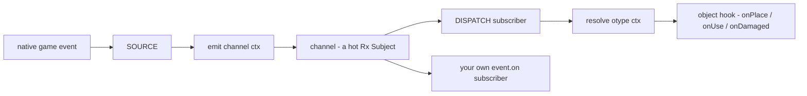
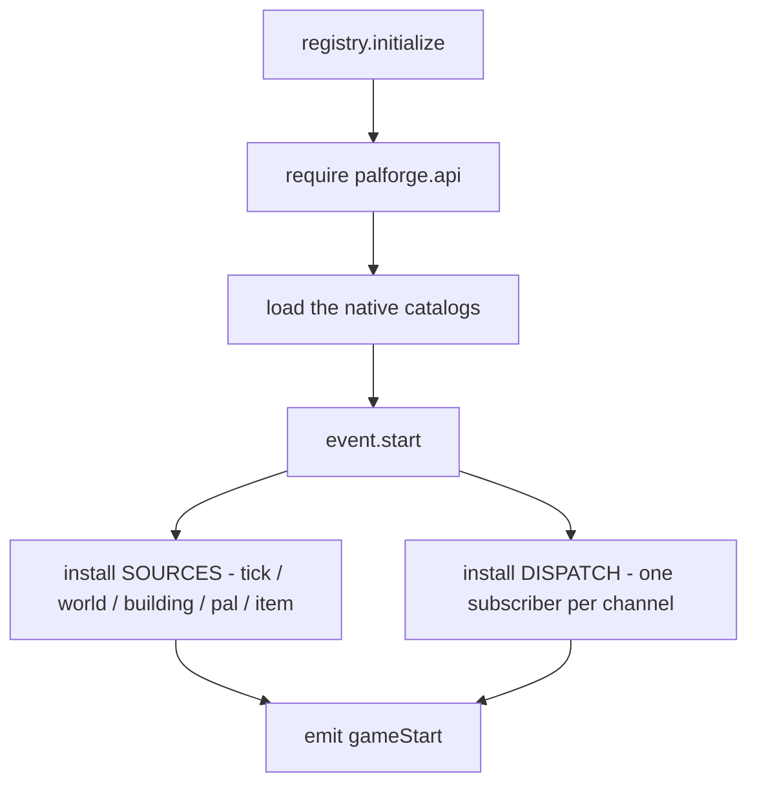
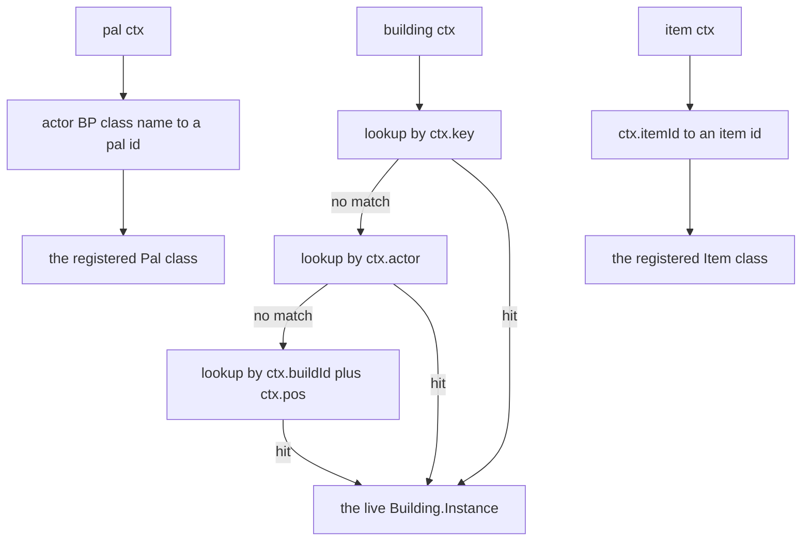
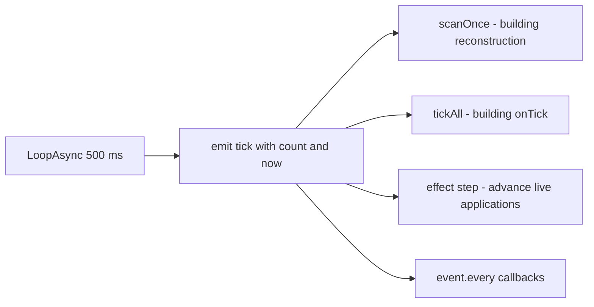
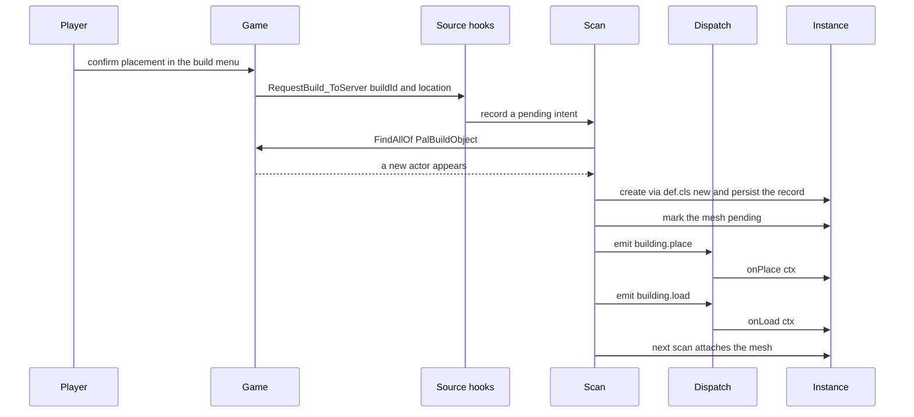
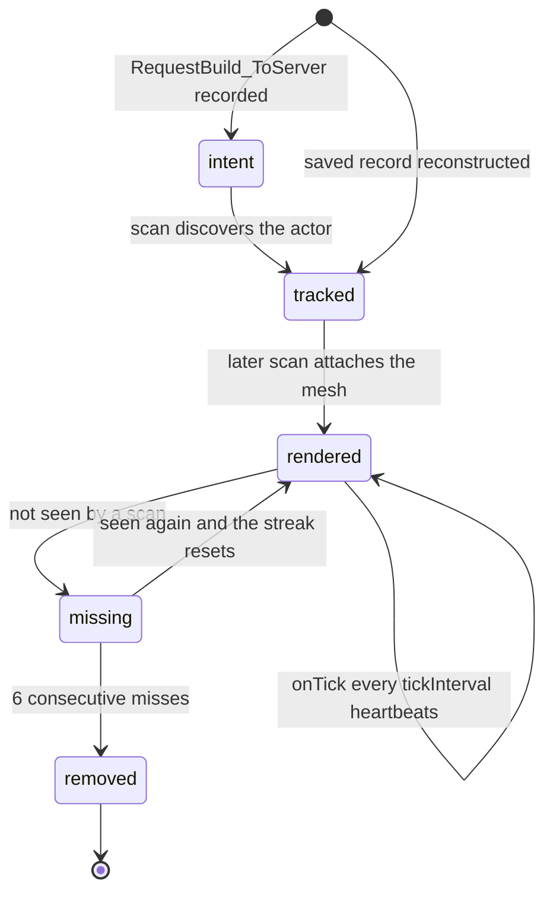
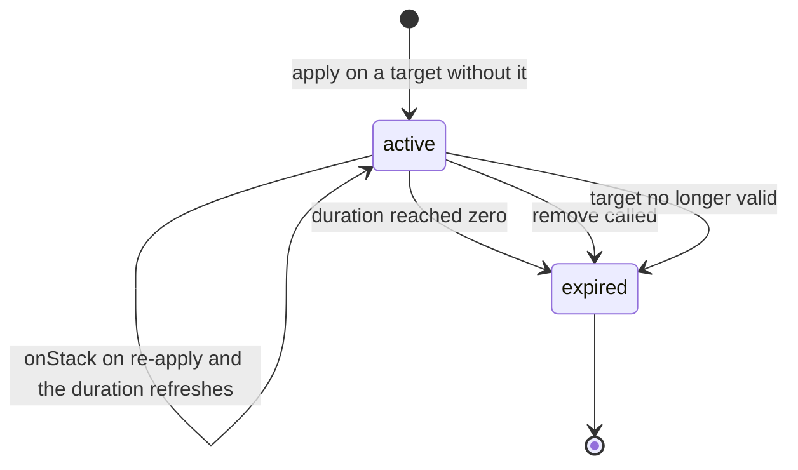

One file owns the whole path from a native Palworld event to your handler:
`Scripts/palforge/core/event.lua`. It holds the channels, the native hooks that feed
them, the dispatch that turns a channel into a method call on your object, and the
building instance runtime.

```lua
local event = require("palforge.core.event")

event.on("pal.spawned", function(ctx) print(ctx.actor) end)
event.emit("example:custom", { note = "channels are created on demand" })
```

You rarely need to require it. Declaring `events = { ... }` on a definition is the normal
way in, and dispatch calls those handlers for you.

## The three parts

`core/event.lua` is split into three layers, and every lifecycle moment travels through
all three in order.

| Layer | What it is |
| --- | --- |
| BUS | The named channels. Each channel is a hot Rx Subject, plus `on` / `emit` / `observable` / `every`. |
| SOURCE | A native game hook or a loop that turns a game event into `emit(channel, ctx)`. |
| DISPATCH | A subscriber per channel that resolves the object the event happened to, then calls its hook. |



The bus is the only shared point. A source never calls a hook directly, and a hook never
knows which native call produced it. That is why a channel with no source yet
(`item.craft`) still has working dispatch: the day something emits it, existing packs
start receiving it with no code change.

### Wiring order at startup

`registry.initialize()` is the single entry point `main.lua` calls at mod load.



`event.start()` is guarded by a `started` flag, so calling it again does nothing. Every
channel in `event.CHANNELS` is pre-created before any source runs, which is what makes
subscribe-before-emit safe.

### Resolving the object

DISPATCH never guesses. `resolve(otype, ctx)` maps a context table onto a concrete object,
and returns `nil` when there is nothing to call — dispatch then no-ops.



Buildings resolve to a **live instance**. Pals and items have no instance tracking, so
they resolve to the registered **class**, and the handler reads the actor off `ctx`.
A vanilla pal or item with no PalForge definition resolves to `nil` and dispatch no-ops.
An item ctx costs one failed table lookup. A pal ctx costs that lookup plus a walk over
the registered pal ids, which is how a namespaced `pack:name` pal is matched to the
`BP_<resolved>_C` class the game actually spawned.

## Channels

`event.CHANNELS` is the full list, in declaration order:

```lua
event.CHANNELS   --> {
--   "gameStart",
--   "world.ready", "world.left",
--   "building.place", "building.load", "building.interact", "building.remove",
--   "pal.spawned", "pal.damaged", "pal.death", "pal.captured",
--   "item.obtain", "item.use", "item.craft", "item.discard",
--   "tick",
-- }
```

| Channel | Emitted by | `ctx` carries | Dispatches to |
| --- | --- | --- | --- |
| `gameStart` | `registry.initialize`, after `event.start()` | no payload | nothing; direct subscribers only |
| `world.ready` | the ready watch: `LoopAsync(1000)` polling `PalPlayerCharacter`, after 5 consecutive valid polls | no payload | `onWorldReady` on every live building instance; none are tracked yet at that point |
| `world.left` | the same watch, when the pawn goes invalid | no payload | `onWorldLeft` on every live building instance, then live instances are dropped |
| `building.place` | the reconstruction scan, when a new instance is created and matches a pending build intent | `key`, `actor`, `pos`, `buildId`, `player`, `firstSeen` | `onPlace` |
| `building.load` | the reconstruction scan, on every newly tracked instance | `key`, `actor`, `pos`, `buildId`, `reconstructed` | `onLoad` |
| `building.interact` | `/Script/Pal.PalBuildObject:OnBeginInteractBuilding` | `actor`, `player`, `buildId` | `onRightClick` |
| `building.remove` | the scan removal sweep, after 6 consecutive misses | `key`, `buildId`, `actor`, `reason` | `onRemove` |
| `pal.spawned` | `/Script/Pal.PalCharacter:BroadcastOnCompleteInitializeParameter` | `actor` | `onSpawned` |
| `pal.damaged` | `/Script/Pal.PalCharacter:OnDamageReaction` | `actor` | `onDamaged` |
| `pal.death` | `/Script/Pal.PalCharacter:OnDeadCharacter` | `actor` | `onDeath` |
| `pal.captured` | `/Script/Pal.PalCharacterParameterComponent:SetIsCapturedProcessing`, only when the argument is `true` | `actor`, `comp` | `onCaptured` |
| `item.obtain` | `/Script/Pal.PalPlayerState:AddItemGetLog_ToClient` | `itemId`, `count` | `onObtain` |
| `item.use` | `/Script/Pal.PalItemUseProcessor:UseItemToCharacter_ServerInternal` | `itemId`, `actor`, `processor` | `onUse` |
| `item.craft` | nothing yet | — | `onCraft` |
| `item.discard` | nothing yet | — | `onDiscard` |
| `tick` | `LoopAsync(500)` inside `ExecuteInGameThread` | `count`, `now` | building `onTick`, through the tick list |

<Callout type="info">
`world.ready` and `world.left` are emitted with no payload at all, so a direct subscriber
receives `nil`. The building dispatch substitutes an empty table before calling
`onWorldReady` / `onWorldLeft`, so those handlers always get a table.
</Callout>

<Callout type="warn">
Every native hook except the heartbeat returns early while the world is not ready. The
building scan, the interact hook, the place-intent hook and all four pal hooks and both
item hooks check `worldReady` first. If the ready watch cannot be installed at all, the
gate fails open and dispatch runs from the start.
</Callout>

Channel names are not a closed set at the bus level: `event.emit` and `event.on` create a
Subject on demand, so your own names work.

```lua
local event = require("palforge.core.event")

event.on("mypack:quest.completed", function(ctx)
    Item.get("Wood"):give(ctx.reward or 1)
end)

event.emit("mypack:quest.completed", { reward = 25 })
```

Only the names in `event.CHANNELS` have a SOURCE and a DISPATCH behind them. A name of
your own is a plain pub/sub channel.

## The heartbeat

`event.TICK_MS = 500`. One `LoopAsync(500)` emits `tick` from inside
`ExecuteInGameThread`, so every subscriber runs on the game thread.

```lua
event.on("tick", function(ctx)
    -- ctx.count = how many heartbeats since the loop started
    -- ctx.now   = os.clock() at emit time
end)
```

Everything periodic in PalForge rides that one loop, except the ready watch, which polls
on its own `LoopAsync(1000)`.



### event.every

`event.every(ms, fn)` accumulates `TICK_MS` per heartbeat and fires when the accumulator
reaches `ms`, then resets it. The real period is therefore `ms` rounded up to a multiple
of 500.

```lua
local event = require("palforge.core.event")
local log   = require("palforge.utils.log").scope("beat")

local sub = event.every(5000, function()
    log.info("five seconds of heartbeats")
end)

sub:unsubscribe()   -- stop it
```

| You ask for | You get |
| --- | --- |
| `event.every(500, fn)` | every heartbeat |
| `event.every(700, fn)` | every 1000 ms |
| `event.every(2000, fn)` | every 2000 ms |
| `event.every(2500, fn)` | every 2500 ms |

`fn` runs inside `pcall`, so an error in your callback does not break the heartbeat and is
not reported. Log inside the callback if you need to see failures.

### The building scan rides the same cadence

The reconstruction scan is installed as `event.every(500, scanOnce)`, using the same
constant. There is no second scan timer. That gives one number to reason about: a placed
building becomes a live instance within roughly one heartbeat, its mesh appears one
heartbeat after that, and a removed building is dropped after 6 consecutive misses,
roughly three seconds.

## What actually fires

A hook being declarable is not a promise that anything emits it. Per domain:

### Building

Every hook with a source is live except `onWorldReady`, and this is the only domain with
per-structure state.

| Hook | State | Source |
| --- | --- | --- |
| `onPlace` | LIVE | the scan, matched to a `RequestBuild_ToServer` intent |
| `onLoad` | LIVE | the scan, on every newly tracked instance |
| `onRightClick` | LIVE | `OnBeginInteractBuilding` |
| `onRemove` | LIVE | the scan removal sweep |
| `onTick` | LIVE | the heartbeat, gated by `tickInterval` |
| `onWorldReady` | never reached | the ready watch, which emits before the first scan |
| `onWorldLeft` | LIVE | the ready watch |
| `onBuild` | declarable | no native source yet |
| `onLeftClick` | declarable | no native source yet |
| `onBreak` | declarable | no native source yet |

`onPlace` and `onRemove` cover placement and destruction. `onBuild`, `onLeftClick` and
`onBreak` are accepted by the spec and never called.

`onRightClick` is filtered and debounced at the source: only a `PalCharacter` interactor
counts, and a second interact on the same structure within one second is dropped.

<Callout type="warn">
`onWorldReady` is dispatched, but nothing receives it. The ready watch sets the gate and
emits `world.ready` in the same step, and the scan that creates instances is gated on
that same flag, so no instance exists yet when the dispatch walks the live set. Leaving a
world drops every live instance, so a second load behaves the same way. Use `onLoad`,
which fires for every instance the first scan tracks, with `ctx.reconstructed` telling
you it came from a save. A `world.ready` you emit yourself is the only way to reach
`onWorldReady`.
</Callout>

### Pal

| Hook | State | Source |
| --- | --- | --- |
| `onCaptured` | LIVE | `SetIsCapturedProcessing` with `true` |
| `onDamaged` | LIVE | `OnDamageReaction` |
| `onDeath` | LIVE | `OnDeadCharacter` |
| `onSpawned` | LIVE, unconfirmed hook | `BroadcastOnCompleteInitializeParameter` |
| `onTick` | declarable | none |

<Callout type="warn">
`onSpawned` is wired to `BroadcastOnCompleteInitializeParameter`, which the source marks
as an unconfirmed candidate: the in-game event probe ran against pals that already
existed, so the hook has not been observed firing on a real spawn. Treat it as best
effort and verify before you build a feature on it.
</Callout>

<Callout type="warn">
Pal `onTick` never fires. Pals have no instance scan the way buildings do, so nothing
drives a per-pal periodic hook. If you need per-pal work on a schedule, subscribe to
`tick` yourself and walk the actors you care about.
</Callout>

### Item

| Hook | State | Source |
| --- | --- | --- |
| `onObtain` | LIVE | `AddItemGetLog_ToClient` |
| `onUse` | LIVE | `UseItemToCharacter_ServerInternal` |
| `onCraft` | declarable | none |
| `onDiscard` | declarable | none |

`onObtain` rides the game's own "obtained item" log, so it fires on pickup, loot and
rewards. Silent internal adds that never surface a get-log are not covered.
`item.craft` and `item.discard` have a channel and a dispatch subscriber, and nothing
emits them.

### Effect

All four hooks are live, but the timing is owned by `api/effect.lua`, not by a native
game event. `:apply(target)` starts a real application that the `tick` channel advances.

| Hook | State | Driven by |
| --- | --- | --- |
| `onApply` | LIVE | `:apply(target)` on a target that does not have it |
| `onTick` | LIVE | the heartbeat, every `interval` seconds |
| `onStack` | LIVE | `:apply(target)` on a target that already has it |
| `onExpire` | LIVE | `duration` reaching zero, `:remove(target)`, or the target going invalid |

<Callout type="warn">
A PalForge effect does not touch the game's own ailments. `EPalStatusEffectType` is a
native enum and no native call to apply one was confirmed, so `nativeStatus` is metadata
only and the status icon never changes. The gameplay lives in your handlers.
</Callout>

### Skill

There is no native skill source. No channel emits `skill.*`, so nothing fires these
automatically. What works is manual invocation, with the cooldown enforced in Lua.

```lua
local log = require("palforge.utils.log").scope("fireball")

local Fireball = Skill{
    id       = "example:Fireball",
    kind     = "active",
    element  = "fire",
    cooldown = 3.0,
    power    = 50,
    events = {
        onActivate = function(skill, owner, ctx)
            log.info(skill.id .. " fired by " .. tostring(owner))
        end,
    },
}

Fireball:activate(myPalActor)   -- false while cooling down
Fireball:hit(targetActor)
```

Drive `:activate` / `:hit` / `:equip` / `:unequip` from code you control: a pal handler, a
building's `onRightClick`, or a keybind.

### Audio, Mesh, UI

No lifecycle channels. Audio is played, a mesh is worn, and a UI element has `render` and
`update` plus mount, refresh and unmount that you call.

## Handler signatures

The first argument is always **the object the event happened to**.

| Domain | First argument | Full signature |
| --- | --- | --- |
| Pal | `Pal.Handle` | `function(pal, ctx)` |
| Item | `Item.Handle` | `function(item, ctx)` |
| Building | `Building.Instance` | `function(instance, ctx)` |
| Skill | `Skill.Handle` | `function(skill, owner, ctx)` |
| Effect | `Effect.Handle` | `function(effect, target, ctx)` |

For pals, items, skills and effects, dispatch calls the registered class, and a forwarder
installed at define time swaps the handle in. That is why `:spawn`, `:give`, `:activate`
and `:apply` are reachable straight from inside a handler.

```lua title="content/handlers.lua"
local log = require("palforge.utils.log").scope("handlers")

Pal{
    id = "ChickenPal",
    events = {
        onSpawned = function(pal, ctx)          -- pal is the Pal.Handle
            pal:renderOn(ctx.actor)
        end,
    },
}

Item{
    id = "Berries",
    events = {
        onUse = function(item, ctx)             -- item is the Item.Handle
            log.info(item.id .. " used by " .. tostring(ctx.actor))
        end,
    },
}

Building{
    id = "example:Bench",
    events = {
        onRightClick = function(inst, ctx)      -- inst is the LIVE instance
            inst.state.uses = (inst.state.uses or 0) + 1
            inst:save()
        end,
    },
}

Skill{
    id = "example:Fireball",
    events = {
        onActivate = function(skill, owner, ctx) end,   -- owner comes before ctx
    },
}

Effect{
    id = "example:Regen",
    events = {
        onTick = function(effect, target, ctx) end,     -- target comes before ctx
    },
}
```

`ctx` is a plain table. Its keys depend on the channel, and the table above is the only
list of them.

## The building runtime

Buildings are the one domain where a placed thing gets its own object with its own state,
saved per world. Everything below is in `core/event.lua`.

### From key press to onPlace



<Steps>

<Step>
### The intent

A hook on `/Script/Pal.PalNetworkPlayerComponent:RequestBuild_ToServer` reads the build id
and the location. The actor does not exist yet, so nothing can be created here. The intent
goes into a queue capped at 16 entries, oldest dropped first, and only if the resolved
build id belongs to a registered definition.
</Step>

<Step>
### The scan

`event.every(500, scanOnce)` walks `FindAllOf("PalBuildObject")`. Each actor is identified
in three tiers: the class name `BP_BuildObject_<Id>_C`, then the actor's
`MapObjectModel.BuildObjectId`, then a position match against a saved record. An actor
already bound to an instance takes a fast path and only refreshes its position.
</Step>

<Step>
### Identity

An instance is keyed by build id plus quantized world position:
`"<buildId>@<qx>,<qy>,<qz>"`, using `gridCm` from the definition, default 100 cm. The
canonical position is always the live actor's location. The **actor**, not the key, is
what binds an already-known instance across scans, because a placed building's reported
location jitters by more than a cell between scans.
</Step>

<Step>
### Creation and persistence

`def.cls:new{ ... }` produces the instance, so it is an instance of your definition class
and every method you declared resolves on it. State comes from the saved record if there
is one, otherwise from the definition's `state` field, which may be a table or a factory
function. A fresh instance is written to `state/entities_<saveId>.json` under the mod
folder. `saveId` falls back to `world` when the world guid cannot be read.
</Step>

<Step>
### The events

`building.place` is emitted only when there is no saved record and a pending intent
matches within 300 cm. `building.load` is emitted for every newly tracked instance, with
`ctx.reconstructed` telling you whether it came from a save. A fresh placement therefore
fires `onPlace` first and `onLoad` immediately after.
</Step>

<Step>
### The deferred mesh

If the instance has a mesh with a `model` path, it is marked pending, not attached. The
attach happens on a **later** scan, once the same actor has been seen again.
</Step>

</Steps>

<Callout type="error">
The mesh attach is deferred on purpose. Adding a procedural mesh component to an actor
that is still mid-initialisation, on the frame it is placed, touches an invalid native
object and crashes the game. A native access violation cannot be caught by `pcall`, so
the runtime waits for the actor to prove it survived a scan instead. For the same reason
there is no `OnCompleteBuild_ServerInternal` hook: it fires for every building during the
world-load storm and reading half-initialised `UPalMapObjectModel` memory there faulted.

Practical consequence: inside `onPlace` the mesh is not attached yet.
</Callout>

### The instance object

Your building handlers receive this, as `self`.

<TypeTable
  type={{
    id: { description: 'The definition build id, inherited from the class', type: 'string' },
    buildId: { description: 'The game build id this instance matched', type: 'string' },
    key: { description: 'Stable registry key, buildId plus quantized cell', type: 'string' },
    actor: { description: 'The placed APalBuildObject', type: 'any' },
    pos: { description: 'World position, refreshed on every scan', type: '{ x, y, z }' },
    state: { description: 'Your persisted table; mutate in place then call save', type: 'table' },
  }}
/>

Methods on the instance:

| Call | Effect |
| --- | --- |
| `inst:save()` | Marks the record dirty and flushes the world file to disk now |
| `inst:setDirty()` | Marks it dirty without writing; the next flush picks it up |
| `inst:isValid()` | Whether `inst.actor` is still a valid engine object |
| `inst:render()` | Attaches mesh and material to the actor; the scan normally does this |
| `inst:update()` | Re-tints the live material from `inst:currentColor()` |
| `inst:mesh()` | The mesh descriptor; override for a state-driven mesh |

The persisted record's `state` is the same table reference as `inst.state`, so mutating in
place is enough and `:save()` only decides when it hits disk.

```lua title="content/buildings.lua"
local log = require("palforge.utils.log").scope("counter")

Building{
    id     = "example:Counter",
    name   = "Counter Bench",
    gridCm = 100,
    state  = { uses = 0 },
    mesh   = {
        kind  = "static",
        model = "/Game/Pal/Model/Prop/Architecture/WorkBenchPrimitive/SM_WorkBenchPrimitive.SM_WorkBenchPrimitive",
    },
    events = {
        onPlace = function(inst, ctx)
            log.info("placed at " .. inst.key .. " by " .. tostring(ctx.player))
            inst.state.uses = 0
            inst:save()
        end,
        onLoad = function(inst, ctx)
            if ctx.reconstructed then
                log.info("restored with " .. tostring(inst.state.uses) .. " uses")
            end
        end,
        onRightClick = function(inst, ctx)
            inst.state.uses = inst.state.uses + 1
            inst:save()
        end,
        onRemove = function(inst, ctx)
            log.info("removed, reason " .. tostring(ctx.reason))
        end,
    },
}
```

### tickInterval and the circuit breaker

`tickInterval` defaults to 1 and must be an integer of at least 1; anything else is
silently forced back to 1. An instance ticks only when `ctx.count % tickInterval == 0`,
so `tickInterval = 4` means one call every four heartbeats, that is every two seconds.

Only classes that actually override `onTick` go into the tick list, so a definition
without the hook costs nothing per heartbeat.

```lua
Building{
    id           = "example:SlowFurnace",
    tickInterval = 20,          -- once every 20 heartbeats, about 10 seconds
    state        = { fuel = 0 },
    events = {
        onTick = function(inst, ctx)
            if inst.state.fuel > 0 then
                inst.state.fuel = inst.state.fuel - 1
                inst:setDirty()
            end
        end,
    },
}
```

If `onTick` raises five times without a success in between, that instance's tick is
disabled permanently for the session and a warning is logged. Successful ticks reset the
counter.

### The instance state machine



Two exits differ in what they do to the save file. A removal through the miss threshold
emits `building.remove`, calls `onRemove`, and deletes the persisted record. Leaving the
world emits `world.left`, calls `onWorldLeft` on every live instance while they are still
live, then drops the live instances and **keeps** the records, so the next world load
reconstructs them.

### Reaching live instances

```lua
local event = require("palforge.core.event")

event.instances()                       -- every live instance in the world
event.instances("example:Counter")      -- filtered by definition id or matched build id
event.instanceOfActor(someActor)        -- the instance bound to an actor, or nil
event.isWorldReady()                    -- is the building runtime allowed to touch objects

Building.get("example:Counter"):instances()   -- the same list, from the handle
```

`Handle:instances()` is empty until the scan has seen the structures, so it stays empty
before `world.ready`.

## Effect applications

An effect's timing lives in `api/effect.lua`. The first `:apply` in the session
subscribes a single stepper to the `tick` channel, so requiring the module costs nothing
until a pack actually applies something. The stepper advances every live application by
`TICK_MS / 1000`, that is 0.5 seconds per heartbeat.



Applications are stored in a weak-keyed table under the target, so a despawned pawn takes
its applications with it. `:apply(nil)` files the application under a global sentinel
instead, which is how you run a world-wide effect.

### Stacking

Re-applying a live effect never calls `onApply` again. It calls `onStack`, and it always
refreshes `remaining` back to the full `duration`. The stack counter only grows when
`stackable = true`, and it stops at `maxStacks`.

```lua title="content/effects.lua"
local log = require("palforge.utils.log").scope("regen")

local Regen = Effect{
    id          = "example:Regen",
    name        = "Regeneration",
    description = "heals a little every second",
    duration    = 10.0,       -- omit for an effect that runs until :remove()
    interval    = 1.0,        -- omit for no periodic tick
    stackable   = true,
    maxStacks   = 3,
    events = {
        onApply = function(effect, target, ctx)
            log.info("regen on " .. tostring(target) .. " stacks=" .. ctx.stacks)
        end,
        onTick = function(effect, target, ctx)
            -- ctx.elapsed = seconds since apply, ctx.stacks = current stack count
            log.info("regen tick at " .. tostring(ctx.elapsed))
        end,
        onStack = function(effect, target, ctx)
            log.info("regen refreshed, stacks=" .. ctx.stacks)
        end,
        onExpire = function(effect, target, ctx)
            log.info("regen over, reason " .. tostring(ctx.reason))
        end,
    },
}

local me = Player.character()
Regen:apply(me)
Regen:apply(me)              -- onStack, stacks = 2, timer back to 10 s

Regen:isActive(me)           -- true
Regen:stacksOn(me)           -- 2
Regen:timeLeft(me)           -- seconds left, nil when the effect has no duration
Effect.activeOn(me)          -- { "example:Regen" }

Regen:remove(me)             -- onExpire with reason "removed"
```

`ctx` keys by hook:

| Hook | `ctx` |
| --- | --- |
| `onApply` | `effect`, `stacks`, plus anything you passed as the second argument to `:apply` |
| `onStack` | `effect`, `stacks`, plus the same passthrough |
| `onTick` | `effect`, `elapsed`, `stacks` |
| `onExpire` | `effect`, `reason`, `elapsed`, `stacks` |

`ctx.reason` on expiry is one of `"duration"`, `"removed"` or `"target_gone"`.

<Callout type="info">
Because the stepper advances in 0.5 s units, an `interval` below 0.5 does not tick faster
than the heartbeat; the accumulator catches up by looping, so a small interval means
several `onTick` calls in the same heartbeat rather than more frequent ones.
</Callout>

## Subscribing directly

Declaring `events = { ... }` covers the common case. Subscribe to the bus when you want
cross-cutting behaviour, or a channel that has no per-object dispatch, such as `gameStart`
or `tick`.

| Call | Returns |
| --- | --- |
| `event.on(name, onNext, onError, onCompleted)` | a subscription with `:unsubscribe()` |
| `event.emit(name, ctx)` | pushes `ctx` to every subscriber |
| `event.observable(name)` | the channel as an Observable, for operator chains |
| `event.channel(name)` | the same Subject, when you want both ends |
| `event.every(ms, fn)` | a subscription on `tick` |
| `event.Rx` | the vendored ReactiveX module |

```lua
local event = require("palforge.core.event")
local log   = require("palforge.utils.log").scope("bus")

-- one-liner
event.on("world.ready", function()
    log.info("world is up")
end)

-- keep the handle and stop later
local sub = event.on("item.obtain", function(ctx)
    log.info("got " .. tostring(ctx.count) .. " x " .. tostring(ctx.itemId))
end)

sub:unsubscribe()
```

### Operator chains

`event.observable(name)` gives you the channel as an Rx Observable, so the usual operators
apply. `filter`, `map`, `take`, `tap`, `distinctUntilChanged`, `scan`, `pluck` and the
rest are pure and safe here. Time-based operators such as `debounce` and `delay` need a
scheduler that is not driven anywhere in PalForge, so avoid them and use `event.every`
instead.

```lua
local event = require("palforge.core.event")
local log   = require("palforge.utils.log").scope("chain")

-- only the workbench, and only the id
local sub = event.observable("building.interact")
    :filter(function(ctx) return ctx and ctx.buildId == "WorkBench" end)
    :map(function(ctx) return ctx.player end)
    :subscribe(function(player)
        log.info("workbench used by " .. tostring(player))
    end)

-- a countdown that stops itself
event.observable("tick")
    :filter(function(ctx) return ctx.count % 10 == 0 end)
    :take(3)
    :subscribe(function(ctx)
        log.info("beat " .. tostring(ctx.count))
    end)

sub:unsubscribe()
```

Subscribing to a channel does not replace dispatch, and it does not suppress it. Both run.

<Callout type="warn">
Dispatch wraps every hook call in `pcall`, but a plain `event.on` subscriber does not get
that protection from the bus. An error thrown inside your subscriber propagates into the
emit call. Emits are themselves wrapped in `pcall`, at the source or at the heartbeat, so
a throwing subscriber will not stop the heartbeat, but it can stop the remaining
subscribers on that emit. Wrap risky work in `pcall` yourself.
</Callout>

## Recipes

### Log every lifecycle moment while developing

```lua title="content/debug.lua"
local event = require("palforge.core.event")
local log   = require("palforge.utils.log").scope("trace")

for _, name in ipairs(event.CHANNELS) do
    if name ~= "tick" then
        event.on(name, function(ctx)
            local bits = {}
            if type(ctx) == "table" then
                for _, k in ipairs({ "buildId", "itemId", "count", "key", "reason" }) do
                    if ctx[k] ~= nil then bits[#bits + 1] = k .. "=" .. tostring(ctx[k]) end
                end
            end
            log.info(name .. " " .. table.concat(bits, " "))
        end)
    end
end
```

`tick` is skipped on purpose: at two emits per second it drowns everything else.

### A building that pays out on a timer and survives a reload

```lua title="content/generator.lua"
local log = require("palforge.utils.log").scope("generator")

Building{
    id           = "example:BerryBush",
    name         = "Berry Bush",
    gridCm       = 100,
    tickInterval = 40,                 -- about 20 seconds
    state        = { grown = 0 },
    mesh = {
        kind  = "static",
        model = "/Game/Pal/Model/Prop/Architecture/WorkBenchPrimitive/SM_WorkBenchPrimitive.SM_WorkBenchPrimitive",
    },
    events = {
        onPlace = function(inst, ctx)
            inst.state.grown = 0
            inst:save()
        end,

        onLoad = function(inst, ctx)
            log.info(string.format("bush %s ready, grown=%d, fromSave=%s",
                inst.key, inst.state.grown or 0, tostring(ctx.reconstructed)))
        end,

        onTick = function(inst, ctx)
            inst.state.grown = (inst.state.grown or 0) + 1
            inst:setDirty()            -- cheap; the next :save flushes it
        end,

        onRightClick = function(inst, ctx)
            local n = inst.state.grown or 0
            if n <= 0 then return end
            Item.get("Berries"):give(n)
            inst.state.grown = 0
            inst:save()                -- harvesting is worth a disk write
        end,

        onRemove = function(inst, ctx)
            log.info("bush " .. inst.key .. " gone, reason " .. tostring(ctx.reason))
        end,
    },
}
```

### A pal that dresses itself and burns whatever hits it

```lua title="content/pals.lua"
local log = require("palforge.utils.log").scope("ember")

local Burning = Effect{
    id        = "example:Burning",
    name      = "Burning",
    duration  = 6.0,
    interval  = 1.0,
    stackable = true,
    maxStacks = 3,
    events = {
        onTick = function(effect, target, ctx)
            log.info("burning " .. tostring(target) .. " stacks=" .. tostring(ctx.stacks))
        end,
        onExpire = function(effect, target, ctx)
            log.info("burning ended, reason " .. tostring(ctx.reason))
        end,
    },
}

Pal{
    id          = "ChickenPal",
    name        = "Ember Chicken",
    description = "a chicken with a temper",
    mesh = Mesh{
        id    = "example:EmberChicken",
        model = "/Game/Pal/Model/Character/Monster/ChickenPal/SK_ChickenPal.SK_ChickenPal",
    },
    color = { r = 1.0, g = 0.4, b = 0.2, a = 1.0 },
    events = {
        onSpawned = function(pal, ctx)
            pal:renderOn(ctx.actor)                 -- pals have no scan, so you attach it
        end,
        onDamaged = function(pal, ctx)
            Burning:apply(ctx.actor)                -- re-apply stacks and refreshes
        end,
        onDeath = function(pal, ctx)
            Burning:remove(ctx.actor)
            Item.get("Wood"):give(3)
        end,
        onCaptured = function(pal, ctx)
            log.info(pal:name() .. " captured")
        end,
    },
}
```

### A per-pal ticker, since pal onTick never fires

```lua title="content/patrol.lua"
local event = require("palforge.core.event")
local log   = require("palforge.utils.log").scope("patrol")

local watched = setmetatable({}, { __mode = "k" })   -- weak: never keep a pawn alive

Pal{
    id = "SheepBall",
    events = {
        onSpawned = function(pal, ctx)
            if ctx.actor then watched[ctx.actor] = 0 end
        end,
        onDeath = function(pal, ctx)
            if ctx.actor then watched[ctx.actor] = nil end
        end,
    },
}

event.every(2000, function()
    for actor, seconds in pairs(watched) do
        local ok, valid = pcall(function() return actor:IsValid() end)
        if not (ok and valid) then
            watched[actor] = nil
        else
            watched[actor] = seconds + 2
            log.info("sheepball alive for " .. tostring(watched[actor]) .. " s")
        end
    end
end)
```

### A building that fires a skill on interaction

```lua title="content/turret.lua"
local log = require("palforge.utils.log").scope("turret")

local Zap = Skill{
    id       = "example:Zap",
    kind     = "active",
    element  = "electric",
    cooldown = 2.0,
    power    = 25,
    events = {
        onActivate = function(skill, owner, ctx)
            log.info("zap from " .. tostring(ctx.key))
        end,
    },
}

Building{
    id     = "example:Turret",
    name   = "Zap Turret",
    state  = { shots = 0 },
    events = {
        onRightClick = function(inst, ctx)
            if Zap:activate(inst.actor, { key = inst.key }) then
                inst.state.shots = (inst.state.shots or 0) + 1
                inst:save()
            else
                log.info("still cooling down, " .. tostring(Zap:cooldownLeft(inst.actor)) .. " s left")
            end
        end,
    },
}
```

### Flush every live building when the world unloads

```lua title="content/persist.lua"
local event = require("palforge.core.event")

event.on("world.left", function()
    for _, inst in ipairs(event.instances()) do
        pcall(function() inst:setDirty() end)
    end
end)
```

`world.left` is emitted before live instances are dropped, so the instances are still
reachable inside the subscriber. The runtime flushes the world file itself during
teardown, so marking dirty is enough.

<Cards>
  <Card title="Building" href="/docs/api/building">The definition side of the runtime described here</Card>
  <Card title="Effect" href="/docs/api/effect">Durations, intervals and stacking in full</Card>
  <Card title="Pal" href="/docs/api/pal">Spawning, meshes and the pal hooks</Card>
  <Card title="Item" href="/docs/api/item">Give, take and the item hooks</Card>
</Cards>
