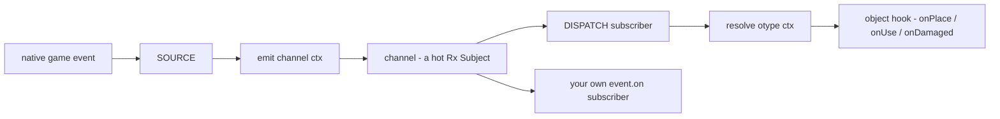
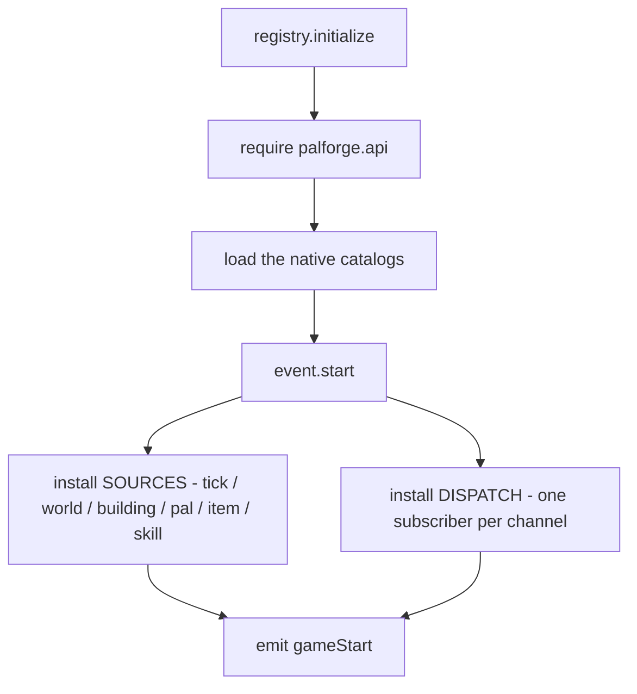
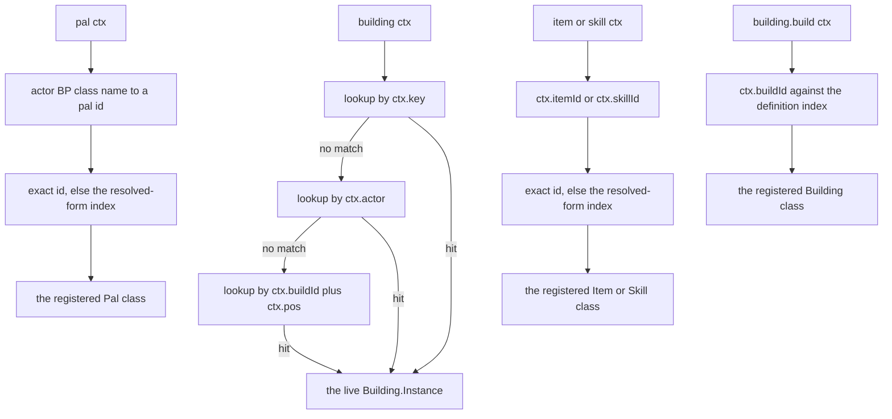
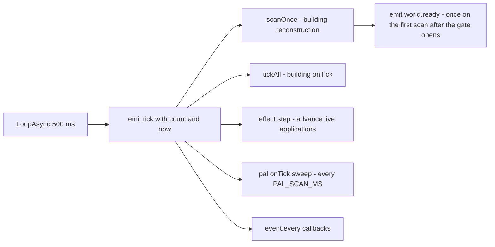
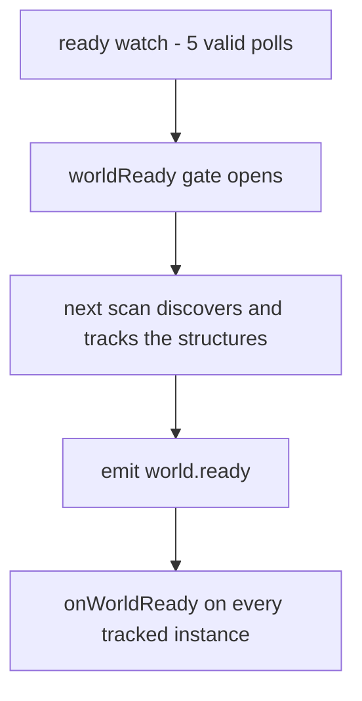
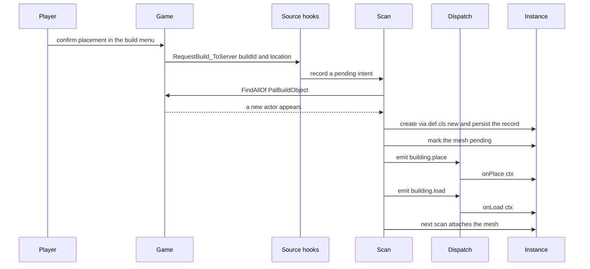
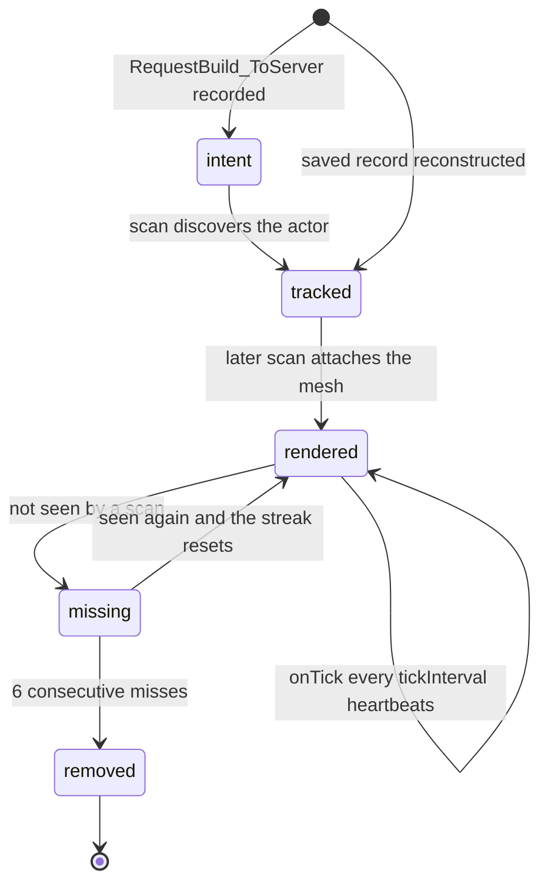
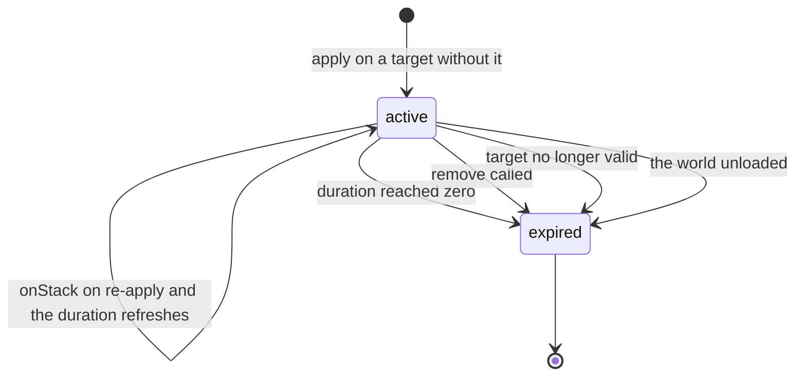

## What you can do after this page

- Run your own code the moment a player places a building, uses an item, or takes down a pal
- Build a structure that keeps working while you play and remembers its numbers after a reload
- Make something happen on a timer, like a bush that grows berries every twenty seconds
- Know which moments the game really reports, so you never wait on one that never arrives
- Read the log to find out why a handler did not run

## Say when your code runs

A definition is a table. Put a function in its `events` table, and PalForge calls that
function when the matching thing happens in the game.

```lua title="content/berries.lua"
Item{
    id = "Berries",
    events = {
        onUse = function(item, ctx)
            Item.get("Wood"):give(1)      -- eat a berry, get a log
        end,
    },
}
```

Eat a berry in game and a log lands in your inventory. The name of the key is how you say
*when*: `onUse` means "when a player uses this item".

Every domain has its own set of names. A building has `onPlace`, `onRightClick`, `onTick`
and more. A pal has `onDamaged`, `onDeath`, `onCaptured`. An item has `onObtain` and
`onUse`. The full list per domain, and which ones the game really fires today, is further
down this page.

You can also listen without a definition. `event.on` subscribes to a **channel** — a named
moment, such as `pal.spawned` — and runs your function every time something pushes to it.

```lua
local event = require("palforge.core.event")

event.on("pal.spawned", function(ctx) print(ctx.actor) end)
event.emit("example:custom", { note = "channels are created on demand" })
```

Most packs never need that. Writing `events = { ... }` on a definition is the normal way
in, and it reaches you through the same channels.

## How an event reaches your code

Three steps sit between a moment in the game and your handler, and every moment goes
through all three in order. You never call them yourself. Knowing the names helps when you
are reading a log line.

| Layer | What it is |
| --- | --- |
| BUS | The named channels. Each channel is a hot Rx Subject, plus `on` / `emit` / `observable` / `every`. |
| SOURCE | A native game hook or a loop that turns a game event into `emit(channel, ctx)`. |
| DISPATCH | A subscriber per channel that resolves the object the event happened to, then calls its hook. |



Every channel in `event.CHANNELS` has a SOURCE armed for it. One of them, `skill.hit`, has
never carried an event: both of its native candidates registered successfully and stayed
silent through fights that certainly landed damage, which is the open item
`skill-hit-source`. Two building hooks have no channel at all, `onLeftClick` and `onBreak`,
because nothing in the dumps can feed one. The channel table below says which is which.

### Wiring order at startup

`registry.initialize()` is what `main.lua` calls when the mod loads. It puts everything in
place before your pack can see a single event.



`event.start()` arms the engine-facing layer once per session. UE4SS can take back neither
a `RegisterHook` nor a `LoopAsync`, so re-arming would run every handler twice, then three
times. A second call takes the other branch instead: it re-runs `installDispatch()`, which
drops the previous run's channel subscriptions and rebinds every channel to the freshly
loaded definition classes. That branch is the F9 reload.

Every channel in `event.CHANNELS` exists before the first game event arrives, so you can
subscribe while your pack is still loading and miss nothing.

### What an F9 reload replaces

F9 drops every `palforge.*` module from `package.loaded` and runs `registry.initialize()`
again, so definitions, specs, handlers, the api surface, the test suite and your own pack
code are genuinely replaced. Four things deliberately survive the wipe, and each one is a
failure that was paid for once.

| Survives | Where it lives | Why |
| --- | --- | --- |
| The engine-facing hooks and loops | armed once; `_G.__PalForgeArmed` records that it happened | A hook armed on the first load keeps running the callback it was created with, so editing the body of an event SOURCE needs a game restart. Everything above that line reloads. |
| Every registered definition | `core.object_manager`, named in `reload.KEEP` | A content pack is its own UE4SS mod in its own require namespace, so a wipe never re-runs its define calls. Keeping the registry is what keeps a pack's content across the press. |
| The channels themselves | `_G.__PalForgeBus` | The hooks from the first load push into the subjects table they closed over. A fresh one would leave the old emitters talking to nobody while the new dispatch listened to an empty bus. |
| The building runtime registry | `_G.__PalForgeBuildingRegistry`, with the spatial index on `_G.__PalForgeSpatialIndex` | The reconstruction scan is armed once and holds the tables it was created with. One table on `_G` is what stops the scan and the dispatch from looking at two different registries. |

The press is also REFUSED while a repeating callback is outstanding. Every `core/poll`
poller and both long chains in `pf_watch` declare themselves to the reload guard, and a
press with one outstanding logs which chain it is waiting for and how long it has been
armed. Clearing `package.loaded` under a scheduled UE4SS callback can leave its registry
reference pointing at something that is not a function, and UE4SS answers that by removing
the engine tick hook — which is what drains `ExecuteInGameThread`, so every keybind in the
mod stops responding while the game carries on, until a restart. A claim expires by itself
after 180 s, and the refusal prints the console line that clears it,
`require('palforge.core.reload').asyncReset()`.

Two things a reload does not undo. A building instance placed before the press keeps the
handler table it was created with until the scan rediscovers it, and a poller registered
before the press keeps running the closure it was registered with.

### Which object the event happened to

Before calling a hook, dispatch works out which of your definitions the event belongs to.
`resolve(otype, ctx)` maps the context table onto a concrete object, and returns `nil` when
there is nothing to call. Then nothing is called.



A building resolves to a **live instance**: the one structure standing in the world that
the event happened to. Pals, items and skills are not tracked one by one, so they resolve
to the registered **class** instead, and your handler reads the actor off `ctx`. A vanilla
pal or item you never defined resolves to nothing, and the hook is skipped. `building.build`
is the one building channel that also resolves to a class, because it fires before the
actor exists.

The class lookups are two table reads and nothing else: the id exactly as the game reported
it, then `object_manager.byResolved`, an index the registry maintains at register time that
maps a resolved row spelling back to the id it was defined under. That is why a namespaced
id still gets its events — the game spawns `BP_example_Boss_C` and reports the item row
`example_Ration`, never the colon form — and it is also why two ids that resolve to one row
are a warning at define time rather than a coin flip per event.

## Channels

A channel is one named moment. `event.CHANNELS` holds 21 of them, in declaration order:

```lua
event.CHANNELS   --> {
--   "gameStart",
--   "world.ready", "world.left",
--   "building.place", "building.load", "building.interact", "building.remove",
--   "building.build",
--   "pal.spawned", "pal.damaged", "pal.death", "pal.captured",
--   "item.obtain", "item.use", "item.craft", "item.discard",
--   "skill.activate", "skill.hit", "skill.equip", "skill.unequip",
--   "tick",
-- }
```

Three words describe where a channel's events come from, and the difference decides whether
you can build on it:

- **LIVE** — a named native game function emits it, and it has been seen carrying an event
  in a real save.
- **synthetic** — PalForge derives it, from the reconstruction scan or from a loop. There
  is no native call behind it, and it fires on this build because nothing outside PalForge
  has to cooperate.
- **armed, unseen** — a native hook is registered for it and has never carried anything.

What sends each one, what it puts in `ctx`, and which hook it ends up calling:

| Channel | State | Emitted by | `ctx` carries | Dispatches to |
| --- | --- | --- | --- | --- |
| `gameStart` | synthetic | `registry.initialize`, after `event.start()` — so also on every F9 reload | no payload | nothing; direct subscribers only |
| `world.ready` | synthetic | the first reconstruction scan that completes after the gate opens; the gate is the ready watch, `LoopAsync(1000)` polling `PalPlayerCharacter`, after 5 consecutive valid polls | no payload | `onWorldReady` on every live building instance, and that first scan has already tracked them |
| `world.left` | synthetic | the same watch, when the pawn stops answering | no payload | `onWorldLeft` on every live building instance, then live instances are dropped |
| `building.place` | synthetic | the scan, when it creates an instance that matches a pending `RequestBuild_ToServer` intent within 300 cm | `key`, `actor`, `pos`, `buildId`, `player`, `firstSeen` | `onPlace` |
| `building.load` | synthetic | the scan, on every newly tracked instance | `key`, `actor`, `pos`, `buildId`, `reconstructed` | `onLoad` |
| `building.interact` | LIVE | `/Script/Pal.PalBuildObject:OnBeginInteractBuilding` | `actor`, `player`, `buildId` | `onRightClick` |
| `building.remove` | synthetic | the scan removal sweep, after 6 consecutive misses | `key`, `buildId`, `actor`, `reason` | `onRemove` |
| `building.build` | LIVE | `/Script/Pal.PalPlayerRecordData:OnCompleteBuild_ServerInternal`, armed at `world.ready` | `buildId`, `model` | `onBuild`, on the definition class |
| `pal.spawned` | LIVE | `/Script/Pal.PalNPC:OnCompletedInitParam` and `/Script/Pal.PalPlayerCharacter:OnCompleteInitializeParameter`, both armed at `world.ready` | `actor`, `via` | `onSpawned` |
| `pal.damaged` | LIVE | `/Script/Pal.PalCharacter:OnDamageReaction` | `actor` | `onDamaged` |
| `pal.death` | LIVE | `/Script/Pal.PalCharacter:OnDeadCharacter` | `actor` | `onDeath` |
| `pal.captured` | LIVE | `/Script/Pal.PalCharacterParameterComponent:SetIsCapturedProcessing`, only when the argument is `true` | `actor`, `comp` | `onCaptured` |
| `item.obtain` | LIVE | `/Script/Pal.PalPlayerState:AddItemGetLog_ToClient`, with `/Script/Pal.PalPlayerInventoryData:AddItem_ServerInternal` armed beside it | `itemId`, `count`, `via` | `onObtain` |
| `item.use` | LIVE | `/Script/Pal.PalItemUseProcessor:UseItemToCharacter_ServerInternal` | `itemId`, `actor`, `player`, `itemData`, `targetId`, `processor` | `onUse` |
| `item.craft` | LIVE | `OnFinishWorkInServer` on `/Script/Pal.PalMapObjectConvertItemModel` and on `/Script/Pal.PalMapObjectProductItemModel` | `itemId`, `recipeId`, `count` (always nil), `model`, `work`, `via` | `onCraft` |
| `item.discard` | LIVE | `/Script/Pal.PalNetworkItemComponent:RequestDrop_ToServer` and `:RequestDispose_ToServer` | `itemId`, `count`, `reason` | `onDiscard` |
| `skill.activate` | LIVE | `/Script/Pal.PalActionBase:OnBeginAction`, with `PalPlayerCharacter:OnBeginAction` and `PalUtility:PlayActionByWazaID` armed beside it | `skillId`, `wazaId`, `owner`, `actor`, `target`, `action`, `via` | `onActivate`, with the owner as its second argument |
| `skill.hit` | armed, unseen | `/Script/Pal.PalUtility:MakeDamageInfoByWazaType` and `/Script/Pal.PalAnimNotifyState_AttackCollision:OnHit`, both measured silent | `skillId`, `wazaId`, `target`, `owner`, `attacker`, `location`, `via` | `onHit`, with the target as its second argument |
| `skill.equip` | LIVE | `/Script/Pal.PalIndividualCharacterParameter:AddPassiveSkill`, plus the `PalPassiveSkillComponent:SetupSkillFromSelf` list diff; both armed at `world.ready` | `skillId`, `owner`, `actor`, `params` or `component`, `overrides`, `via` | `onEquip` |
| `skill.unequip` | LIVE | `:RemovePassiveSkill` and the same list diff | `skillId`, `owner`, `actor`, `via` | `onUnequip` |
| `tick` | synthetic | `LoopAsync(500)` inside `ExecuteInGameThread` | `count`, `now` | building `onTick`, through the tick list |

Several channels carry more than one source at once, and that is deliberate rather than
untidy: a session in July measured four hooks registering and never firing while ten other
channels announced themselves, UE4SS cannot unregister a hook, and a silent hook costs
nothing — so the candidates the header dump named are armed BESIDE the ones that went
quiet. Each is guarded on the identity it needs, so an extra source can only add silence,
never a wrong event. `ctx.via` names which one carried a given event, and the log announces
the first firing per channel and per source.

<Callout type="info">
`world.ready` and `world.left` are emitted with no payload at all, so a direct subscriber
receives `nil`. The building dispatch substitutes an empty table before calling
`onWorldReady` / `onWorldLeft`, so those handlers always get a table.
</Callout>

<Callout type="warn">
Every native hook except the heartbeat returns early while the world is not ready: the
building scan, the interact and place-intent hooks and every pal, item and skill hook open
with the same gate check. Seven of them are not even armed until then — `building.build`,
the three `pal.spawned` candidates and the three passive-skill ones — because each also
fires for every pre-existing object during the world-load storm, where reading
half-initialised memory produced a native access violation that `pcall` cannot catch. If
the ready watch cannot be installed at all, the gate fails open and dispatch runs from the
start. `world.ready` is armed in that fallback too, but nothing emits it: without
`LoopAsync` there is no heartbeat, so there is no scan to announce it, and the late hooks
never arm.
</Callout>

You can invent your own channel names. `event.emit` and `event.on` create the channel the
first time you name one, so a pack can talk to itself, or to another pack.

```lua
local event = require("palforge.core.event")

event.on("mypack:quest.completed", function(ctx)
    Item.get("Wood"):give(ctx.reward or 1)
end)

event.emit("mypack:quest.completed", { reward = 25 })
```

Only the names in `event.CHANNELS` have the game behind them. A name of your own is a
plain message that you send and you receive.

## The heartbeat

PalForge runs one timer, every 500 ms (`event.TICK_MS = 500`). It emits `tick` from inside
`ExecuteInGameThread`, so every subscriber runs on the game thread.

```lua
event.on("tick", function(ctx)
    -- ctx.count = how many heartbeats since the loop started
    -- ctx.now   = os.clock() at emit time
end)
```

Everything periodic rides that one loop. The only other timer is the ready watch, which
polls on its own `LoopAsync(1000)`.



### event.every

`event.every(ms, fn)` adds `TICK_MS` per heartbeat and fires when the total reaches `ms`,
then starts again from zero. The real period is `ms` rounded up to a multiple of 500.

```lua
local event = require("palforge.core.event")
local log   = require("palforge.utils.log").scope("beat")

local sub = event.every(5000, function()
    log.info("five seconds of heartbeats")
end)

sub:unsubscribe()   -- stop it
```

| You ask for | You get |
| --- | --- |
| `event.every(500, fn)` | every heartbeat |
| `event.every(700, fn)` | every 1000 ms |
| `event.every(2000, fn)` | every 2000 ms |
| `event.every(2500, fn)` | every 2500 ms |

`fn` runs inside `pcall`, so an error in your callback does not break the heartbeat and is
not reported. Log inside the callback if you need to see failures.

### The building scan rides the same cadence

The scan that finds your placed structures runs from one `event.every(500, ...)` callback,
using the same constant. That callback calls `scanOnce()` and then owns the deferred
`world.ready` emit, in that order. One number covers the whole runtime: a placed building
becomes a live instance within roughly one heartbeat, its mesh appears one heartbeat after
that, and a removed building is dropped after 6 consecutive misses, roughly three seconds.

## Which hooks actually run

Being allowed to write a hook is not a promise that something fires it. Per domain, with
what to reach for when a hook is not wired.

### Building

Every hook with a source is live, and this is the only domain with per-structure state.

| Hook | State | Source |
| --- | --- | --- |
| `onPlace` | LIVE | the scan, matched to a `RequestBuild_ToServer` intent |
| `onLoad` | LIVE | the scan, on every newly tracked instance |
| `onRightClick` | LIVE | `OnBeginInteractBuilding` |
| `onRemove` | LIVE | the scan removal sweep |
| `onTick` | LIVE | the heartbeat, gated by `tickInterval` |
| `onWorldReady` | LIVE | the first scan that completes after the ready gate opens |
| `onWorldLeft` | LIVE | the ready watch |
| `onBuild` | LIVE | `OnCompleteBuild_ServerInternal`, armed at `world.ready` |
| `onLeftClick` | declarable | no native source, and the search is closed |
| `onBreak` | declarable | no native source, and the search is closed |

`onBuild` is the one building hook that is not handed a live instance. It fires at
build-complete time, before the scan has created the instance — up to 500 ms later — and
the native call carries a `UPalMapObjectModel` rather than an actor, so dispatch resolves
the definition CLASS by build id and your handler reads `ctx.buildId` and `ctx.model`. Its
hook is armed at `world.ready` rather than at load, because it also fires for every
existing building during the world-load storm, and reading half-initialised model memory
there produced a native access violation. `onPlace` remains the safe placement hook;
`onBuild` is the extra one, and it is worth trying in a throwaway world first.

`onLeftClick` and `onBreak` are accepted by the spec and never called, and that is a
measurement rather than an omission. The one candidate for both, `OnDamage`, turned out to
be a deterioration timer: the reference recording caught 196 firings, every one on a placed
`WorkBench`, at a steady 12-13 s per structure, with no player involved and no structure
ever destroyed. And none of the four candidate classes declares a Destroy, Dismantle, Break
or Click entry at all — destruction appears only as delegate fields, which `RegisterHook`
cannot address by path. Destruction stays covered by the scan's miss sweep, one threshold
late and without an instigator, so use `onRemove` for it.

`onRightClick` is filtered and debounced at the source: only a `PalCharacter` interactor
counts, and a second interact on the same structure within one second is dropped.

`onWorldReady` reaches live instances. The ready watch only opens the gate; the channel is
emitted by the first reconstruction scan that completes afterwards. The scan is what turns
actors into tracked instances, so by the time the dispatch walks the live set the
structures around the player are in it. The notification lands at most one heartbeat, 500
ms, after the gate opened.



Leaving a world drops every live instance and clears the pending emit, so a second load
runs the same sequence again from a clean registry.

```lua title="content/lamp.lua"
local event = require("palforge.core.event")
local log   = require("palforge.utils.log").scope("lamp")

Building{
    id     = "example:Lamp",
    name   = "Signal Lamp",
    gridCm = 100,
    state  = { loads = 0 },
    mesh   = {
        kind  = "static",
        model = "/Game/Pal/Model/Prop/Architecture/WorkBenchPrimitive/SM_WorkBenchPrimitive.SM_WorkBenchPrimitive",
    },
    events = {
        onWorldReady = function(inst, ctx)
            -- once per world load, on every lamp the first scan tracked
            inst.state.loads = (inst.state.loads or 0) + 1
            inst:save()
            log.info(inst.key .. " online, load #" .. tostring(inst.state.loads))
        end,
        onRightClick = function(inst, ctx)
            log.info(inst.key .. " has survived " .. tostring(inst.state.loads) .. " loads")
        end,
    },
}

-- the same moment, as a cross-cutting subscriber
event.on("world.ready", function()
    log.info(tostring(#event.instances()) .. " structures tracked")
end)
```

<Callout type="info">
`onWorldReady` is a one-shot world-load moment, not a per-structure one. A structure that
streams in on a later scan misses it, because the emit already happened. Per-instance
startup work belongs in `onLoad`, which fires for every instance the scan tracks, whenever
that scan happens, with `ctx.reconstructed` telling you it came from a save.
</Callout>

### Pal

| Hook | State | Source |
| --- | --- | --- |
| `onCaptured` | LIVE | `SetIsCapturedProcessing` with `true` |
| `onDamaged` | LIVE | `OnDamageReaction` |
| `onDeath` | LIVE | `OnDeadCharacter` |
| `onSpawned` | LIVE | `PalNPC:OnCompletedInitParam` and `PalPlayerCharacter:OnCompleteInitializeParameter` |
| `onTick` | LIVE | the pal sweep, every `event.PAL_SCAN_MS` |

<Callout type="warn">
`onSpawned` is not wired to `PalCharacter:BroadcastOnCompleteInitializeParameter`, and the
reason is worth carrying: that broadcaster is measured SILENT. It was armed after
`world.ready` in a real save, pals were caught and released, and the channel carried
nothing from it while ten other channels announced themselves — hooking a broadcaster
rather than the bound delegate target is the mistake it exists to record. The two sources
that carry are those targets. `PalNPC:OnCompletedInitParam` sees every pal, because
`APalMonsterCharacter` inherits it without redeclaring, and
`PalPlayerCharacter:OnCompleteInitializeParameter` sees only the characters the player
subscribed to, which is the party path. `ctx.via` names which one fired. What is still
open is narrower than "does it work": every firing recorded so far landed in the same
second as `world.ready`, the load storm in which every pal in range initialises at once, so
"this pal did not exist a moment ago" is not yet measured. Keep `onSpawned` idempotent —
the source already dedupes per actor within one second.
</Callout>

<Callout type="info">
Pal `onTick` has no native hook and is driven by a sweep instead. Every
`event.PAL_SCAN_MS` — 3000 ms, and public, so a pack can retune it at runtime — the sweep
walks `FindAllOf("PalCharacter")`, resolves each actor to a registered pal class and calls
`onTick` on it with `ctx.actor`, `ctx.count` and `ctx.now`. Two consequences follow from
that being class-level rather than per-instance: `self` is the definition and the pawn is
on `ctx`, so per-pal state belongs in a table you key yourself; and a handler that raises
five times without a success in between is disabled for the session, with its id in the
log. The sweep is deliberately slower than the heartbeat, because a `FindAllOf` walks every
UObject and is the known periodic-hitch source, and it skips the enumeration entirely while
no pal is defined.
</Callout>

### Item

| Hook | State | Source |
| --- | --- | --- |
| `onObtain` | LIVE | `AddItemGetLog_ToClient`, with `AddItem_ServerInternal` armed beside it |
| `onUse` | LIVE | `UseItemToCharacter_ServerInternal` |
| `onCraft` | LIVE | `OnFinishWorkInServer` on the convert and product work models |
| `onDiscard` | LIVE | `RequestDrop_ToServer` and `RequestDispose_ToServer` |

`onObtain` rides the game's own "obtained item" log, so it fires on pickup, loot and
rewards. Silent internal adds that never surface a get-log are covered only if they take
the inventory-add route. The two sources are two views of one pickup, so a repeat of the
same id within 0.5 s is dropped and you hear about it once; `ctx.via` says which carried it.

`onCraft` fires when a production work finishes at a bench or a furnace, observed live on
2026-07-26 by crafting at a real machine. `ctx.count` is nil and stays nil: the per-craft
count lives in the recipe row, and a DataTable read inside a native hook is not something
this source does. On the convert route `ctx.itemId` is the recipe id, which for a vanilla
recipe is the product item id, and it is handed over under both names so a pack need not
rely on that.

`onDiscard` fires when the player drops a stack or trashes one from the inventory menu,
with `ctx.reason` telling you which. The item id has to be read off the slot the request
points at before the server empties it, by matching the slot's container GUID against every
live `PalItemContainer`. When that walk fails the source emits nothing rather than an event
with a guessed id, and logs which step failed, once per distinct reason.

Both live item channels carry a game item id, and dispatch matches it against your
definitions in two steps: the exact id, then the resolved DataTable row name of every
registered id. A namespaced `Item{ id = "example:Ration" }` therefore receives events even
though the game only ever reports `example_Ration`.

```lua title="content/rations.lua"
local log = require("palforge.utils.log").scope("rations")

Item{
    id       = "example:Ration",
    name     = "Field Ration",
    category = "consumable",
    maxStack = 20,
    events = {
        onObtain = function(item, ctx)
            log.info("picked up " .. tostring(ctx.count) .. " x " .. tostring(ctx.itemId))
        end,
        onUse = function(item, ctx)
            -- ctx.itemId is "example_Ration" here: the row name, not the colon form
            Item.get("Berries"):give(1)
        end,
    },
}
```

<Callout type="warn">
`ctx.actor` on `item.use` is a real pawn: `FindFirstOf("PalPlayerCharacter")`, the local
player, handed over again as `ctx.player`. The native call's first parameter — the
`UPalStaticItemDataBase` item data object — is `ctx.itemData`, and the second is
`ctx.targetId`, an `FPalInstanceID` passed through unresolved because no instance-id to
actor lookup is demonstrated anywhere in either tree. The caveat that remains is about
WHICH character rather than about the type: `ctx.actor` is the one who USED the item, which
is the one it was used ON only for self-use such as food. Feed a pal and the pal is
`ctx.targetId`.
</Callout>

### Effect

All four hooks run. Their timing comes from `api/effect.lua` and the heartbeat, not from a
game event: `:apply(target)` starts a real application that the `tick` channel advances,
and `world.left` ends.

| Hook | State | Driven by |
| --- | --- | --- |
| `onApply` | LIVE | `:apply(target)` on a target that does not have it |
| `onTick` | LIVE | the heartbeat, every `interval` seconds |
| `onStack` | LIVE | `:apply(target)` on a target that already has it |
| `onExpire` | LIVE | `duration` reaching zero, `:remove(target)`, the target going invalid, or the world unloading |

<Callout type="warn">
A `nativeStatus` on the definition switches one of the game's own ailments on while the effect
runs, and off again when it ends — the icon really does change. Everything else is still yours:
put the gameplay in your handlers, whether that is draining health or giving an item.
</Callout>

### Skill

Three of the four skill channels carry events from the game. All four also run when you
call them yourself, with the cooldown enforced in Lua.

| Hook | State | Source |
| --- | --- | --- |
| `onActivate` | LIVE | `PalActionBase:OnBeginAction` — a pal's move IS an action object, and it carries its own `EPalWazaID` |
| `onEquip` | LIVE | `AddPassiveSkill`, plus the `SetupSkillFromSelf` list diff |
| `onUnequip` | LIVE | `RemovePassiveSkill`, plus the same list diff |
| `onHit` | armed, unseen | `MakeDamageInfoByWazaType` and `PalAnimNotifyState_AttackCollision:OnHit`, both measured silent |

`onHit` is the one that does not arrive, and the negative is settled from both sides. Both
hooks were armed and carried nothing through fights in which `pal.damaged` and `pal.death`
did fire, so a blow certainly connected and certainly did damage. And nothing on the damage
path names a move: `FPalDamageRactionInfo` has six fields, `FPalDamageInfo` forty and
`FPalDamageResult` twelve, and not one of them is an `EPalWazaID`. The id could only reach
a hit by being remembered from the activation that preceded it, which is inference rather
than a source and is deliberately not wired as one — a move that misses, or a second
attacker in the same window, would be attributed to whatever activated last. `:hit(target)`
is the working entry point.

Only a skill DEFINED with `Skill{ ... }` is dispatched to: `Skill.get("FireBlast")` hands
back a handle that was never registered, so the game firing FireBlast reaches nothing.
`ctx.skillId` is an `EPalWazaID` name for the two combat channels and a passive row FName
for the two passive ones.

The firing that closed the passive question came from PalForge's own write —
`Skill.Handle:teach` reaching `AddPassiveSkill` on a live pal — so a handler hears about
changes its own pack made, and it is the equip direction that was recorded. Keep `onEquip`
idempotent for a second reason as well: the first `SetupSkillFromSelf` call for a character
reports every passive that character already has.

```lua
local log = require("palforge.utils.log").scope("fireball")

local Fireball = Skill{
    id       = "example:Fireball",
    kind     = "active",
    element  = "fire",
    cooldown = 3.0,
    power    = 50,
    events = {
        onActivate = function(skill, owner, ctx)
            log.info(skill.id .. " fired by " .. tostring(owner))
        end,
    },
}

Fireball:activate(myPalActor)   -- false while cooling down
Fireball:hit(targetActor)
```

`:activate` / `:hit` / `:equip` / `:unequip` run the handler on demand from code you
control — a pal handler, a building's `onRightClick`, a keybind — and they are unaffected
by whether the channel carries. For `onHit` they are the only route.

### Audio, Mesh, UI

No lifecycle channels. Audio is played, a mesh is worn, and a UI element has `render` and
`update` plus mount, refresh and unmount that you call.

## Handler arguments

The first argument is always **the object the event happened to**.

| Domain | First argument | Full signature |
| --- | --- | --- |
| Pal | `Pal.Handle` | `function(pal, ctx)` |
| Item | `Item.Handle` | `function(item, ctx)` |
| Building | `Building.Instance` | `function(instance, ctx)` |
| Skill | `Skill.Handle` | `function(skill, owner, ctx)` |
| Effect | `Effect.Handle` | `function(effect, target, ctx)` |

For pals, items, skills and effects that first argument is the handle you got back when you
defined the thing, so `:spawn`, `:give`, `:activate` and `:apply` are reachable straight
from inside a handler. For buildings it is the live instance, so `self.actor`, `self.pos`,
`self.state` and `self:save()` are right there.

```lua title="content/handlers.lua"
local log = require("palforge.utils.log").scope("handlers")

Pal{
    id = "ChickenPal",
    events = {
        onSpawned = function(pal, ctx)          -- pal is the Pal.Handle
            pal:renderOn(ctx.actor)
        end,
    },
}

Item{
    id = "Berries",
    events = {
        onUse = function(item, ctx)             -- item is the Item.Handle
            log.info(item.id .. " used as " .. tostring(ctx.itemId))
        end,
    },
}

Building{
    id = "example:Bench",
    events = {
        onRightClick = function(inst, ctx)      -- inst is the LIVE instance
            inst.state.uses = (inst.state.uses or 0) + 1
            inst:save()
        end,
    },
}

Skill{
    id = "example:Fireball",
    events = {
        onActivate = function(skill, owner, ctx) end,   -- owner comes before ctx
    },
}

Effect{
    id = "example:Regen",
    events = {
        onTick = function(effect, target, ctx) end,     -- target comes before ctx
    },
}
```

`ctx` is a plain table. Its keys depend on the channel, and the channel table lists them
for every channel.

### When a handler throws

Dispatch calls your handler inside `pcall` and logs what it catches, naming the channel and
the hook. A typo in a handler body therefore looks different from a hook that never fired.

```text
[PalForge.event][err] item.use -> onUse handler failed: content/rations.lua:12: attempt to index a nil value
[PalForge.event][err] world.ready -> onWorldReady handler failed on 'example_Lamp@12,-8,3': ...
```

The world hooks name the instance key too, because they run over every live building: one
broken instance is skipped and the rest still get the call. Building `onTick` has its own
report on top of that, and its own circuit breaker.

## The building runtime

A placed building is the one thing that gets its own object, with its own state, saved per
world. Two lamps in two places have two separate counters, and both survive a reload.

### From key press to onPlace



<Steps>

<Step>
### The intent

A hook on `/Script/Pal.PalNetworkPlayerComponent:RequestBuild_ToServer` reads the build id
and the location. The actor does not exist yet, so nothing can be created here. The intent
goes into a queue capped at 16 entries, oldest dropped first, and only if the resolved
build id belongs to a registered definition.
</Step>

<Step>
### The scan

`event.every(500, scanOnce)` walks `FindAllOf("PalBuildObject")`. Each actor is identified
in three tiers: the class name `BP_BuildObject_<Id>_C`, then the actor's
`MapObjectModel.BuildObjectId`, then a position match against a saved record. An actor
already bound to an instance takes a fast path and only refreshes its position.
</Step>

<Step>
### Identity

An instance is keyed by build id plus quantized world position:
`"<buildId>@<qx>,<qy>,<qz>"`, using `gridCm` from the definition, default 100 cm. The
canonical position is always the live actor's location. The **actor**, not the key, is
what binds an already-known instance across scans, because a placed building's reported
location jitters by more than a cell between scans. That binding is on the actor's
`GetFullName()` string and never on the handle: UE4SS mints a fresh wrapper per lookup, and
each scan's `FindAllOf` hands back new ones.
</Step>

<Step>
### Creation and persistence

`def.cls:new{ ... }` produces the instance, so every method you declared on the definition
resolves on it. State comes from the saved record if there is one, otherwise from the
definition's `state` field, which may be a table or a factory function. A fresh instance is
written to `state/<saveId>/<mod id>.json` under the mod folder — one directory per save, one
file per mod. `saveId` is read off `PalGameInstance`: the save DIRECTORY name first
(`GetSelectedWorldSaveDirectoryName`, or its backing property), then the world's display name,
sanitised and prefixed `w_`. When neither answers it falls back to the shared bucket `world`.
</Step>

<Step>
### The events

`building.place` is emitted only when there is no saved record and a pending intent
matches within 300 cm. `building.load` is emitted for every newly tracked instance, with
`ctx.reconstructed` telling you whether it came from a save. A fresh placement therefore
fires `onPlace` first and `onLoad` immediately after.
</Step>

<Step>
### The deferred mesh

If the instance has a mesh with a `model` path, it is marked pending, not attached. The
attach happens on a **later** scan, once the same actor has been seen again.
</Step>

</Steps>

<Callout type="error">
Attaching a mesh on the frame a building is placed touches a native object that is still
being set up, and crashes the game. A native access violation cannot be caught by `pcall`,
so the runtime waits until the actor has survived a scan.

Practical consequence: inside `onPlace` the mesh is not attached yet. If you need to do
something with the finished visual, do it in `onRightClick` or `onTick`, or call
`inst:render()` yourself later.
</Callout>

### The instance object

Your building handlers receive this, as `self`.

<TypeTable
  type={{
    id: { description: 'The definition build id, inherited from the class', type: 'string' },
    buildId: { description: 'The game build id this instance matched', type: 'string' },
    key: { description: 'Stable registry key, buildId plus quantized cell', type: 'string' },
    actor: { description: 'The placed APalBuildObject', type: 'any' },
    pos: { description: 'World position, refreshed on every scan', type: '{ x, y, z }' },
    state: { description: 'Your persisted table; mutate in place then call save', type: 'table' },
  }}
/>

Methods on the instance:

| Call | Effect |
| --- | --- |
| `inst:save()` | Marks the record dirty and flushes the world file to disk now |
| `inst:setDirty()` | Marks it dirty without writing; the next flush picks it up |
| `inst:isValid()` | Whether `inst.actor` is still a valid engine object |
| `inst:render()` | Attaches mesh and material to the actor; the scan normally does this |
| `inst:update()` | Re-tints the live material from `inst:currentColor()` |
| `inst:mesh()` | The mesh descriptor; override for a state-driven mesh |

The saved record's `state` is the same table as `inst.state`, so changing it in place is
enough. `:save()` only decides when it hits disk.

```lua title="content/buildings.lua"
local log = require("palforge.utils.log").scope("counter")

Building{
    id     = "example:Counter",
    name   = "Counter Bench",
    gridCm = 100,
    state  = { uses = 0 },
    mesh   = {
        kind  = "static",
        model = "/Game/Pal/Model/Prop/Architecture/WorkBenchPrimitive/SM_WorkBenchPrimitive.SM_WorkBenchPrimitive",
    },
    events = {
        onPlace = function(inst, ctx)
            log.info("placed at " .. inst.key .. " by " .. tostring(ctx.player))
            inst.state.uses = 0
            inst:save()
        end,
        onLoad = function(inst, ctx)
            if ctx.reconstructed then
                log.info("restored with " .. tostring(inst.state.uses) .. " uses")
            end
        end,
        onRightClick = function(inst, ctx)
            inst.state.uses = inst.state.uses + 1
            inst:save()
        end,
        onRemove = function(inst, ctx)
            log.info("removed, reason " .. tostring(ctx.reason))
        end,
    },
}
```

### tickInterval and the circuit breaker

`tickInterval` defaults to 1 and must be an integer of at least 1; anything else is
silently forced back to 1. An instance ticks only when `ctx.count % tickInterval == 0`,
so `tickInterval = 4` means one call every four heartbeats, that is every two seconds.

A building without an `onTick` hook costs nothing per heartbeat: only classes that override
`onTick` go into the tick list.

```lua
Building{
    id           = "example:SlowFurnace",
    tickInterval = 20,          -- once every 20 heartbeats, about 10 seconds
    state        = { fuel = 0 },
    events = {
        onTick = function(inst, ctx)
            if inst.state.fuel > 0 then
                inst.state.fuel = inst.state.fuel - 1
                inst:setDirty()
            end
        end,
    },
}
```

If `onTick` raises five times without a success in between, that instance's tick is
disabled permanently for the session and a warning is logged. Successful ticks reset the
counter.

### The instance state machine



The two exits differ in what they do to the save file. A removal through the miss threshold
emits `building.remove`, calls `onRemove`, and deletes the saved record. Leaving the world
emits `world.left`, calls `onWorldLeft` on every live instance while they are still live,
then drops the live instances and **keeps** the records, so the next world load
reconstructs them.

### Reaching live instances

```lua
local event = require("palforge.core.event")

event.instances()                       -- every live instance in the world
event.instances("example:Counter")      -- filtered by definition id or matched build id
event.instanceOfActor(someActor)        -- the instance bound to an actor, or nil
event.isWorldReady()                    -- is the building runtime allowed to touch objects

Building.get("example:Counter"):instances()   -- the same list, from the handle
```

`Handle:instances()` is empty until the scan has seen the structures. `world.ready` is
emitted by that first scan, so inside an `onWorldReady` handler or a `world.ready`
subscriber the list is already populated; structures that stream in later join it on the
scan that finds them.

## Effects that run over time

An effect's timing lives in `api/effect.lua` and rides the heartbeat: every live
application advances by `TICK_MS / 1000`, that is 0.5 seconds per heartbeat.



Applications are stored under the target in a weak-keyed table, so a pawn that despawns
takes its applications with it. `:apply(nil)` files the application under a global sentinel
instead, which is how you run a world-wide effect.

Leaving a world releases every live application, each through `onExpire` with the reason
`"world_left"`. Applications are not saved, so nothing comes back on the next world load.
Re-apply from `onWorldReady`, `onLoad` or a `world.ready` subscriber if the effect should
return.

### Stacking

Re-applying a live effect never calls `onApply` again. It calls `onStack`, and it always
refreshes `remaining` back to the full `duration`. The stack counter only grows when
`stackable = true`, and it stops at `maxStacks`.

```lua title="content/effects.lua"
local log = require("palforge.utils.log").scope("regen")

local Regen = Effect{
    id          = "example:Regen",
    name        = "Regeneration",
    description = "heals a little every second",
    duration    = 10.0,       -- omit for an effect that runs until :remove()
    interval    = 1.0,        -- omit for no periodic tick
    stackable   = true,
    maxStacks   = 3,
    events = {
        onApply = function(effect, target, ctx)
            log.info("regen on " .. tostring(target) .. " stacks=" .. ctx.stacks)
        end,
        onTick = function(effect, target, ctx)
            -- ctx.elapsed = seconds since apply, ctx.stacks = current stack count
            log.info("regen tick at " .. tostring(ctx.elapsed))
        end,
        onStack = function(effect, target, ctx)
            log.info("regen refreshed, stacks=" .. ctx.stacks)
        end,
        onExpire = function(effect, target, ctx)
            log.info("regen over, reason " .. tostring(ctx.reason))
        end,
    },
}

local me = Player.character()
Regen:apply(me)
Regen:apply(me)              -- onStack, stacks = 2, timer back to 10 s

Regen:isActive(me)           -- true
Regen:stacksOn(me)           -- 2
Regen:timeLeft(me)           -- seconds left, nil when the effect has no duration
Effect.activeOn(me)          -- { "example:Regen" }

Regen:remove(me)             -- onExpire with reason "removed"
```

`ctx` keys by hook:

| Hook | `ctx` |
| --- | --- |
| `onApply` | `effect`, `stacks`, plus anything you passed as the second argument to `:apply` |
| `onStack` | `effect`, `stacks`, plus the same passthrough |
| `onTick` | `effect`, `elapsed`, `stacks` |
| `onExpire` | `effect`, `reason`, `elapsed`, `stacks` |

`ctx.reason` on expiry is one of `"duration"`, `"removed"`, `"target_gone"` or
`"world_left"`.

<Callout type="info">
Because the stepper advances in 0.5 s units, an `interval` below 0.5 does not tick faster
than the heartbeat; the accumulator catches up by looping, so a small interval means
several `onTick` calls in the same heartbeat rather than more frequent ones.
</Callout>

## Subscribing to a channel yourself

Declaring `events = { ... }` covers the common case. Subscribe to a channel when you want
one piece of code to react across many definitions, or when the channel has no per-object
hook at all, such as `gameStart` or `tick`.

| Call | Returns |
| --- | --- |
| `event.on(name, onNext, onError, onCompleted)` | a subscription with `:unsubscribe()` |
| `event.emit(name, ctx)` | pushes `ctx` to every subscriber |
| `event.observable(name)` | the channel as an Observable, for operator chains |
| `event.channel(name)` | the same Subject, when you want both ends |
| `event.every(ms, fn)` | a subscription on `tick` |
| `event.Rx` | the vendored ReactiveX module |

```lua
local event = require("palforge.core.event")
local log   = require("palforge.utils.log").scope("bus")

-- one-liner
event.on("world.ready", function()
    log.info("world is up")
end)

-- keep the handle and stop later
local sub = event.on("item.obtain", function(ctx)
    log.info("got " .. tostring(ctx.count) .. " x " .. tostring(ctx.itemId))
end)

sub:unsubscribe()
```

### Operator chains

`event.observable(name)` gives you the channel as an Rx Observable, so the usual operators
apply. `filter`, `map`, `take`, `tap`, `distinctUntilChanged`, `scan`, `pluck` and the
rest are pure and safe here. Time-based operators such as `debounce` and `delay` need a
scheduler that nothing in PalForge drives, so avoid them and use `event.every` instead.

```lua
local event = require("palforge.core.event")
local log   = require("palforge.utils.log").scope("chain")

-- only the workbench, and only the id
local sub = event.observable("building.interact")
    :filter(function(ctx) return ctx and ctx.buildId == "WorkBench" end)
    :map(function(ctx) return ctx.player end)
    :subscribe(function(player)
        log.info("workbench used by " .. tostring(player))
    end)

-- a countdown that stops itself
event.observable("tick")
    :filter(function(ctx) return ctx.count % 10 == 0 end)
    :take(3)
    :subscribe(function(ctx)
        log.info("beat " .. tostring(ctx.count))
    end)

sub:unsubscribe()
```

Subscribing to a channel does not replace the hook call, and it does not suppress it. Both
run.

<Callout type="warn">
Dispatch wraps every hook call in `pcall` and logs what it catches, but a plain `event.on`
subscriber gets neither from the bus. An error thrown inside your subscriber propagates
into the emit call. Emits are themselves wrapped in `pcall`, at the source or at the
heartbeat, so a throwing subscriber will not stop the heartbeat, but it can stop the
remaining subscribers on that emit, without a word in the log. Wrap risky work in `pcall`
yourself, and log the failure.
</Callout>

## Recipes

### Log every lifecycle moment while developing

```lua title="content/debug.lua"
local event = require("palforge.core.event")
local log   = require("palforge.utils.log").scope("trace")

for _, name in ipairs(event.CHANNELS) do
    if name ~= "tick" then
        event.on(name, function(ctx)
            local bits = {}
            if type(ctx) == "table" then
                for _, k in ipairs({ "buildId", "itemId", "count", "key", "reason" }) do
                    if ctx[k] ~= nil then bits[#bits + 1] = k .. "=" .. tostring(ctx[k]) end
                end
            end
            log.info(name .. " " .. table.concat(bits, " "))
        end)
    end
end
```

`tick` is skipped on purpose: at two emits per second it drowns everything else.

### A building that pays out on a timer and survives a reload

```lua title="content/generator.lua"
local log = require("palforge.utils.log").scope("generator")

Building{
    id           = "example:BerryBush",
    name         = "Berry Bush",
    gridCm       = 100,
    tickInterval = 40,                 -- about 20 seconds
    state        = { grown = 0 },
    mesh = {
        kind  = "static",
        model = "/Game/Pal/Model/Prop/Architecture/WorkBenchPrimitive/SM_WorkBenchPrimitive.SM_WorkBenchPrimitive",
    },
    events = {
        onPlace = function(inst, ctx)
            inst.state.grown = 0
            inst:save()
        end,

        onLoad = function(inst, ctx)
            log.info(string.format("bush %s ready, grown=%d, fromSave=%s",
                inst.key, inst.state.grown or 0, tostring(ctx.reconstructed)))
        end,

        onTick = function(inst, ctx)
            inst.state.grown = (inst.state.grown or 0) + 1
            inst:setDirty()            -- cheap; the next :save flushes it
        end,

        onRightClick = function(inst, ctx)
            local n = inst.state.grown or 0
            if n <= 0 then return end
            Item.get("Berries"):give(n)
            inst.state.grown = 0
            inst:save()                -- harvesting is worth a disk write
        end,

        onRemove = function(inst, ctx)
            log.info("bush " .. inst.key .. " gone, reason " .. tostring(ctx.reason))
        end,
    },
}
```

### A pal that dresses itself and burns whatever hits it

```lua title="content/pals.lua"
local log = require("palforge.utils.log").scope("ember")

local Burning = Effect{
    id        = "example:Burning",
    name      = "Burning",
    duration  = 6.0,
    interval  = 1.0,
    stackable = true,
    maxStacks = 3,
    events = {
        onTick = function(effect, target, ctx)
            log.info("burning " .. tostring(target) .. " stacks=" .. tostring(ctx.stacks))
        end,
        onExpire = function(effect, target, ctx)
            log.info("burning ended, reason " .. tostring(ctx.reason))
        end,
    },
}

Pal{
    id          = "ChickenPal",
    name        = "Ember Chicken",
    description = "a chicken with a temper",
    mesh = Mesh{
        id    = "example:EmberChicken",
        model = "/Game/Pal/Model/Character/Monster/ChickenPal/SK_ChickenPal.SK_ChickenPal",
    },
    color = { r = 1.0, g = 0.4, b = 0.2, a = 1.0 },
    events = {
        onSpawned = function(pal, ctx)
            pal:renderOn(ctx.actor)                 -- already done for you; the guard makes this free
        end,
        onDamaged = function(pal, ctx)
            Burning:apply(ctx.actor)                -- re-apply stacks and refreshes
        end,
        onDeath = function(pal, ctx)
            Burning:remove(ctx.actor)
            Item.get("Wood"):give(3)
        end,
        onCaptured = function(pal, ctx)
            log.info(pal:name() .. " captured")
        end,
    },
}
```

### Per-pal state, on top of the class-level onTick

Pal `onTick` runs on the definition CLASS, once per live matching actor, so anything you
want to remember about one particular pal has to be keyed by you. Key it on
`uobject.key(actor)`, the actor's `GetFullName()` string, and never on the actor value
itself: UE4SS builds a fresh wrapper on every lookup, so a table keyed on the wrapper
written in one sweep misses in the next for the very same engine object.

```lua title="content/patrol.lua"
local uobject = require("palforge.core.uobject")
local log     = require("palforge.utils.log").scope("patrol")

local seen = {}     -- GetFullName string -> seconds watched

Pal{
    id = "SheepBall",
    events = {
        onSpawned = function(pal, ctx)
            local k = uobject.key(ctx.actor)
            if k then seen[k] = 0 end
        end,
        onTick = function(pal, ctx)
            local k = uobject.key(ctx.actor)
            if not k then return end                 -- a pawn that will not answer its name
            seen[k] = (seen[k] or 0) + 3             -- PAL_SCAN_MS, in seconds
            log.info("sheepball " .. k .. " watched for " .. tostring(seen[k]) .. " s")
        end,
        onDeath = function(pal, ctx)
            local k = uobject.key(ctx.actor)
            if k then seen[k] = nil end
        end,
    },
}
```

### A building that fires a skill on interaction

```lua title="content/turret.lua"
local log = require("palforge.utils.log").scope("turret")

local Zap = Skill{
    id       = "example:Zap",
    kind     = "active",
    element  = "electric",
    cooldown = 2.0,
    power    = 25,
    events = {
        onActivate = function(skill, owner, ctx)
            log.info("zap from " .. tostring(ctx.key))
        end,
    },
}

Building{
    id     = "example:Turret",
    name   = "Zap Turret",
    state  = { shots = 0 },
    events = {
        onRightClick = function(inst, ctx)
            if Zap:activate(inst.actor, { key = inst.key }) then
                inst.state.shots = (inst.state.shots or 0) + 1
                inst:save()
            else
                log.info("still cooling down, " .. tostring(Zap:cooldownLeft(inst.actor)) .. " s left")
            end
        end,
    },
}
```

### Flush every live building when the world unloads

```lua title="content/persist.lua"
local event = require("palforge.core.event")

event.on("world.left", function()
    for _, inst in ipairs(event.instances()) do
        pcall(function() inst:setDirty() end)
    end
end)
```

`world.left` is emitted before live instances are dropped, so the instances are still
reachable inside the subscriber. The runtime flushes the world file itself during
teardown, so marking dirty is enough.

<Cards>
  <Card title="Building" href="/docs/api/building">The definition side of the runtime described here</Card>
  <Card title="Effect" href="/docs/api/effect">Durations, intervals and stacking in full</Card>
  <Card title="Pal" href="/docs/api/pal">Spawning, meshes and the pal hooks</Card>
  <Card title="Item" href="/docs/api/item">Give, take and the item hooks</Card>
</Cards>

## Summary

- Put a function in a definition's `events` table and it runs when that moment happens in
  the game. The key name says when.
- The first argument is the thing it happened to: a building handler gets the live
  structure, everything else gets its handle.
- A building keeps state across reloads: change `inst.state`, then call `inst:save()`.
- Everything periodic runs on one 500 ms heartbeat — building `onTick`, effect timing,
  `event.every(ms, fn)` and the slower pal sweep behind pal `onTick`.
- There are 21 channels: 13 LIVE from a named native function, 7 derived by PalForge from
  the scan or a loop, and one — `skill.hit` — armed and never seen carrying anything.
- Three hooks are accepted and never called: building `onLeftClick` and `onBreak`, which
  have no channel because the dumps offer nothing to feed one, and skill `onHit`. Use
  `onRemove` for destruction and `:hit(target)` for a hit.
- F9 replaces every module but keeps the armed hooks, the registry, the bus and the
  building runtime state — and it refuses while a repeating callback is outstanding.

Next, read [Building](/docs/api/building) for the definition fields behind the runtime on
this page.
