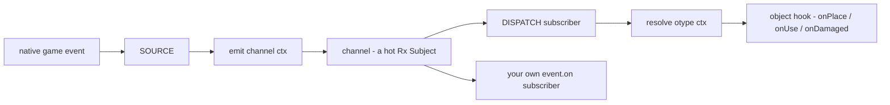
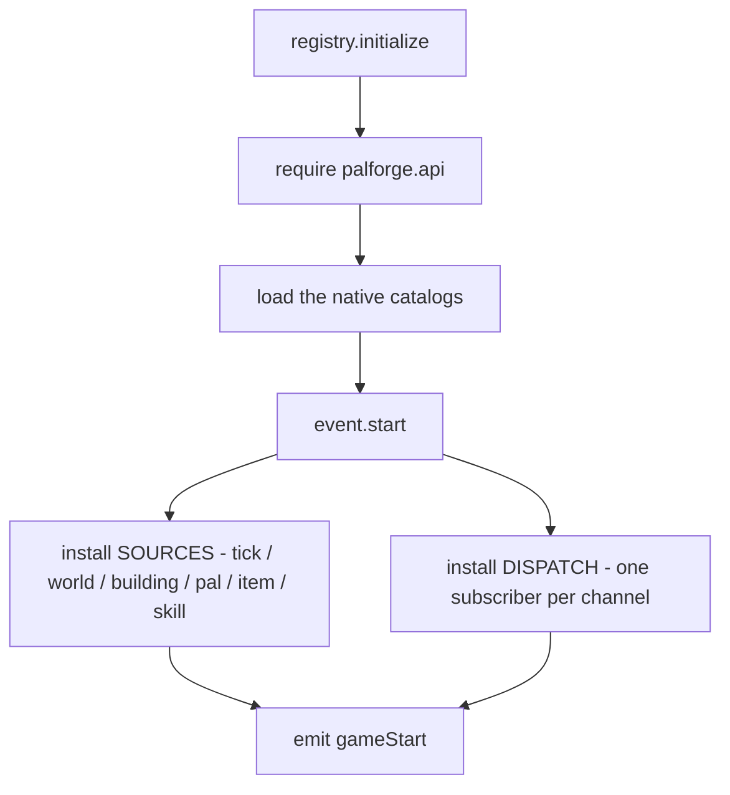
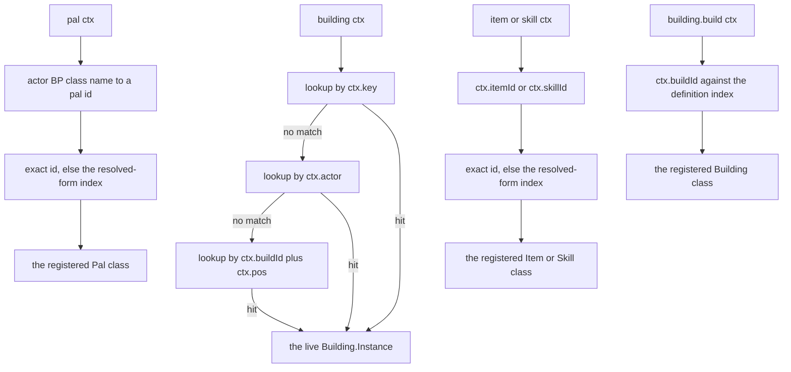
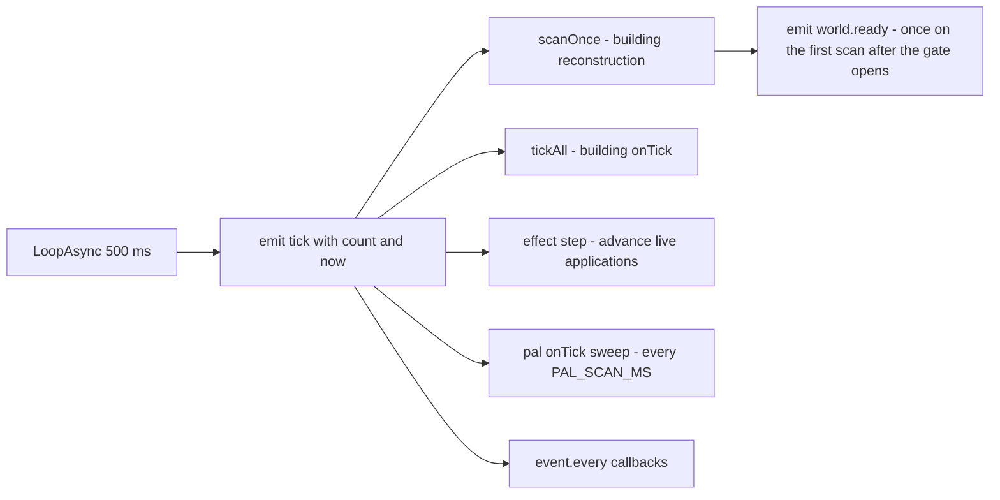
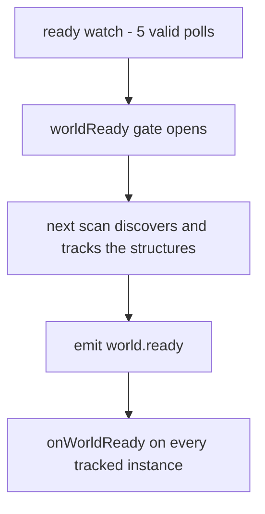
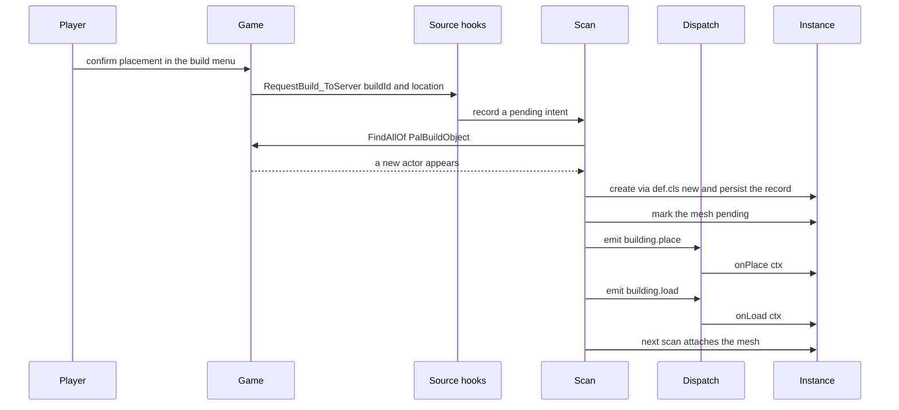
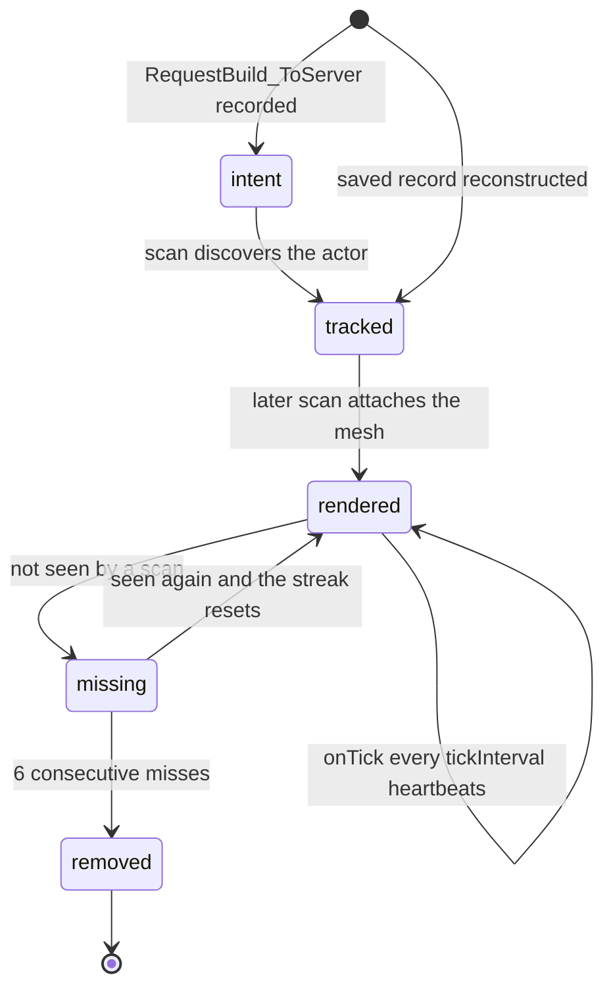
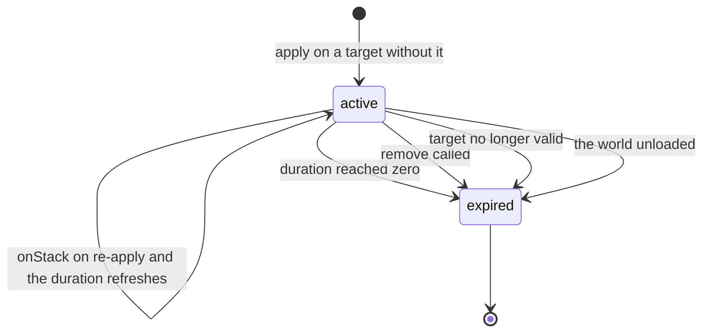

## 读完本页你可以做到

- 在玩家放下建筑物、使用道具、打倒帕鲁的那一刻运行你自己的代码
- 做一个一边玩一边持续运转、重新加载后还记得自己数值的建筑物
- 用定时器让事情发生，比如一丛每二十秒结一次果子的浆果丛
- 知道游戏真正会报告哪些时刻，不再去等一个永远不来的事件
- 从日志里查出处理函数为什么没有运行

## 指定代码何时运行

定义就是一张表。往它的 `events` 表里放一个函数，游戏里发生对应的事情时，PalForge 就会调用
这个函数。

```lua title="content/berries.lua"
Item{
    id = "Berries",
    events = {
        onUse = function(item, ctx)
            Item.get("Wood"):give(1)      -- eat a berry, get a log
        end,
    },
}
```

在游戏里吃一颗浆果，背包里就多出一根木头。说明“何时”的正是键的名字：`onUse` 的意思是
“玩家使用这个道具时”。

每个域都有自己的一套名字。建筑物有 `onPlace`、`onRightClick`、`onTick` 等等，帕鲁有
`onDamaged`、`onDeath`、`onCaptured`，道具有 `onObtain` 和 `onUse`。每个域的完整列表，以及
其中哪些是今天的游戏真的会触发的，都在本页后面。

也可以不写定义来监听。`event.on` 订阅一条**频道** —— 一个有名字的时刻，比如 `pal.spawned` ——
每当有东西推送到它上面，你的函数就运行一次。

```lua
local event = require("palforge.core.event")

event.on("pal.spawned", function(ctx) print(ctx.actor) end)
event.emit("example:custom", { note = "channels are created on demand" })
```

大多数模组包用不到这个。在定义里写 `events = { ... }` 才是常规入口，而它走的也是同样的频道。

## 事件如何到达你的代码

游戏里的一个时刻和你的处理函数之间隔着三层，每个时刻都要按顺序走完这三层。你不需要自己调用
它们。知道这几个名字，读日志的时候会有用。

| 层 | 是什么 |
| --- | --- |
| BUS | 具名频道。每条频道是一个热的 Rx Subject，另外提供 `on` / `emit` / `observable` / `every`。 |
| SOURCE | 一个原生游戏钩子或一个循环，把游戏事件变成 `emit(channel, ctx)`。 |
| DISPATCH | 每条频道一个订阅者，先算出事件发生在哪个对象上，再调用它的钩子。 |



`event.CHANNELS` 里的每条频道都备有 SOURCE。只有一条 `skill.hit` 从来没有运过事件：它的两个原生
候选都注册成功，却在确实打出伤害的战斗中始终沉默，这就是未决项 `skill-hit-source`。建筑物的
`onLeftClick` 和 `onBreak` 则连频道都没有，因为翻遍转储也找不到能喂给它的东西。哪条是哪种，下面
的频道表都写了。

### 启动时的接线顺序

`registry.initialize()` 是模组加载时 `main.lua` 调用的东西。在你的模组包看到第一个事件之前，
它先把一切就位。



`event.start()` 每个会话只把面向引擎的那一层装备一次。UE4SS 既收不回 `RegisterHook`，也收不回
`LoopAsync`，重复装备就意味着每个处理函数跑两遍、再跑三遍。第二次调用走的是另一条分支：重新执行
`installDispatch()`，先退订上一轮的频道订阅，再把每条频道接到刚加载好的定义类上。这条分支就是
F9 热重载。

`event.CHANNELS` 里的每条频道都在第一个游戏事件到达之前就已经存在，所以你可以在模组包还在加载时
就订阅，一个都不会漏。

### F9 热重载会换掉什么

F9 会把每个 `palforge.*` 模块从 `package.loaded` 里丢掉，再跑一次 `registry.initialize()`，所以
定义、规格、处理函数、API 表面、测试套件以及你自己的模组包代码都是真的被换掉了。有四样东西刻意
挺过这次清空，而每一样都是曾经付过代价才明白的。

| 挺过清空的 | 存放位置 | 原因 |
| --- | --- | --- |
| 面向引擎的钩子和循环 | 只装备一次，由 `_G.__PalForgeArmed` 记录 | 第一次加载装备的钩子会一直跑它当时拿到的那个回调，所以只有改动事件 SOURCE 内部才需要重启游戏，其余都能热更。 |
| 全部已注册的定义 | `core.object_manager`，写在 `reload.KEEP` 里 | 内容模组包是拥有自己 require 命名空间的另一个 UE4SS 模组，清空不会重新执行它的定义调用。留住注册表，才留得住模组包的内容。 |
| 频道本身 | `_G.__PalForgeBus` | 第一次加载装备的钩子往它当时闭包住的 subjects 表里推送。换成新表，旧的发送方就对着没人听的地方推，而新的分发在听一条空总线。 |
| 建筑物运行时注册表 | `_G.__PalForgeBuildingRegistry`，以及 `_G.__PalForgeSpatialIndex` 上的空间索引 | 重建扫描只装备一次，一直握着创建时拿到的那些表。放在 `_G` 上的同一张表，正是扫描和分发不会看到两份不同注册表的原因。 |

另外，只要还有重复执行的回调没有结束，这次按键就会被**拒绝**。`core/poll` 的每个轮询器和
`pf_watch` 里两条长链都会向重载守卫申报自己；在还有申报未释放时按下，日志会写明它在等哪条链、
这条链装备了多久，而不会重载。在已排期的 UE4SS 回调脚下清掉 `package.loaded`，可能让它的注册表
引用指向一个不再是函数的东西，而 UE4SS 对此的回应是摘掉引擎 tick 钩子 —— tick 钩子正是负责排空
`ExecuteInGameThread` 的东西，于是游戏照常运行，模组里的每个按键却要等到重启才会有反应。申报会在
180 秒后自动失效，拒绝信息里也会打印解除用的控制台行
`require('palforge.core.reload').asyncReset()`。

有两件事重载不会撤销：按键之前放下的建筑物实例，会一直用创建时的那张处理函数表，直到扫描重新
发现它；按键之前注册的轮询器，也会继续跑注册时的那个闭包。

### 事件发生在哪个对象上

调用钩子之前，分发会先算出这个事件属于你的哪个定义。`resolve(otype, ctx)` 把上下文表映射到
一个具体对象，没有可调用的对象时返回 `nil`。那时就什么都不调用。



建筑物解析到一个**活动实例**：世界里发生这件事的那一座建筑。帕鲁、道具和技能没有被逐个跟踪，
所以它们解析到已注册的**类**，你的处理函数从 `ctx` 上读取 actor。你从没定义过的原版帕鲁或道具
解析不到任何东西，钩子会被跳过。建筑物频道里同样解析到类的只有 `building.build`，因为它在 actor
存在之前就发火。

类的匹配就是两次表查找：先用游戏报告的 id 原样查，没中就查 `object_manager.byResolved` —— 注册表
在注册时维护的索引，把解析后的行名反查回它当初被定义时用的 id。带命名空间的 id 也能收到事件，
原因就在这里（游戏生成的是 `BP_example_Boss_C`，报告的道具行是 `example_Ration`，从来不是冒号
形式）；同时这也是两个解析到同一行的 id 会在定义时就发出警告、而不是每次事件靠运气的原因。

## 频道

一条频道就是一个有名字的时刻。`event.CHANNELS` 里有 21 条，按声明顺序排列：

```lua
event.CHANNELS   --> {
--   "gameStart",
--   "world.ready", "world.left",
--   "building.place", "building.load", "building.interact", "building.remove",
--   "building.build",
--   "pal.spawned", "pal.damaged", "pal.death", "pal.captured",
--   "item.obtain", "item.use", "item.craft", "item.discard",
--   "skill.activate", "skill.hit", "skill.equip", "skill.unequip",
--   "tick",
-- }
```

一条频道的事件从哪里来，用三个词就能说清，而这个区别决定了你能不能在它上面盖东西：

- **LIVE** —— 由一个有名有姓的原生游戏函数发出，并且在真实存档里被观测到运过事件。
- **synthetic** —— PalForge 自己从重建扫描或某个循环推导出来。背后没有原生调用，它在这个版本上
  一定会发火，因为不需要 PalForge 之外的任何东西配合。
- **armed, unseen** —— 原生钩子已注册，但至今一次都没运过东西。

每条频道由什么发出、往 `ctx` 里放了什么、最后调用哪个钩子：

| 频道 | 状态 | 由什么发出 | `ctx` 带着 | 分发到 |
| --- | --- | --- | --- | --- |
| `gameStart` | synthetic | `registry.initialize`，在 `event.start()` 之后（所以每次 F9 热重载也会有） | 无载荷 | 无；只有直接订阅者 |
| `world.ready` | synthetic | 闸门打开后第一次跑完的重建扫描；闸门本身是 ready 监视，用 `LoopAsync(1000)` 轮询 `PalPlayerCharacter`，连续 5 次有效之后打开 | 无载荷 | 每个活动建筑物实例的 `onWorldReady`，而那第一次扫描已经把它们跟踪好了 |
| `world.left` | synthetic | 同一个监视，pawn 不再应答时 | 无载荷 | 每个活动建筑物实例的 `onWorldLeft`，之后活动实例被丢弃 |
| `building.place` | synthetic | 扫描创建出的新实例，在 300 厘米内匹配上一条待处理的 `RequestBuild_ToServer` 意图时 | `key`, `actor`, `pos`, `buildId`, `player`, `firstSeen` | `onPlace` |
| `building.load` | synthetic | 扫描，每个新跟踪到的实例 | `key`, `actor`, `pos`, `buildId`, `reconstructed` | `onLoad` |
| `building.interact` | LIVE | `/Script/Pal.PalBuildObject:OnBeginInteractBuilding` | `actor`, `player`, `buildId` | `onRightClick` |
| `building.remove` | synthetic | 扫描的移除清理，连续 6 次没看到之后 | `key`, `buildId`, `actor`, `reason` | `onRemove` |
| `building.build` | LIVE | `/Script/Pal.PalPlayerRecordData:OnCompleteBuild_ServerInternal`，在 `world.ready` 时装备 | `buildId`, `model` | 定义类上的 `onBuild` |
| `pal.spawned` | LIVE | `/Script/Pal.PalNPC:OnCompletedInitParam` 和 `/Script/Pal.PalPlayerCharacter:OnCompleteInitializeParameter`，都在 `world.ready` 时装备 | `actor`, `via` | `onSpawned` |
| `pal.damaged` | LIVE | `/Script/Pal.PalCharacter:OnDamageReaction` | `actor` | `onDamaged` |
| `pal.death` | LIVE | `/Script/Pal.PalCharacter:OnDeadCharacter` | `actor` | `onDeath` |
| `pal.captured` | LIVE | `/Script/Pal.PalCharacterParameterComponent:SetIsCapturedProcessing`，仅当参数为 `true` 时 | `actor`, `comp` | `onCaptured` |
| `item.obtain` | LIVE | `/Script/Pal.PalPlayerState:AddItemGetLog_ToClient`，旁边还装备着 `/Script/Pal.PalPlayerInventoryData:AddItem_ServerInternal` | `itemId`, `count`, `via` | `onObtain` |
| `item.use` | LIVE | `/Script/Pal.PalItemUseProcessor:UseItemToCharacter_ServerInternal` | `itemId`, `actor`, `player`, `itemData`, `targetId`, `processor` | `onUse` |
| `item.craft` | LIVE | `/Script/Pal.PalMapObjectConvertItemModel` 和 `/Script/Pal.PalMapObjectProductItemModel` 上的 `OnFinishWorkInServer` | `itemId`, `recipeId`, `count`（始终为 nil）, `model`, `work`, `via` | `onCraft` |
| `item.discard` | LIVE | `/Script/Pal.PalNetworkItemComponent:RequestDrop_ToServer` 和 `:RequestDispose_ToServer` | `itemId`, `count`, `reason` | `onDiscard` |
| `skill.activate` | LIVE | `/Script/Pal.PalActionBase:OnBeginAction`，旁边还装备着 `PalPlayerCharacter:OnBeginAction` 和 `PalUtility:PlayActionByWazaID` | `skillId`, `wazaId`, `owner`, `actor`, `target`, `action`, `via` | `onActivate`，第二个参数是 owner |
| `skill.hit` | armed, unseen | `/Script/Pal.PalUtility:MakeDamageInfoByWazaType` 和 `/Script/Pal.PalAnimNotifyState_AttackCollision:OnHit`，两个都实测沉默 | `skillId`, `wazaId`, `target`, `owner`, `attacker`, `location`, `via` | `onHit`，第二个参数是 target |
| `skill.equip` | LIVE | `/Script/Pal.PalIndividualCharacterParameter:AddPassiveSkill`，外加 `PalPassiveSkillComponent:SetupSkillFromSelf` 的列表差分；都在 `world.ready` 时装备 | `skillId`, `owner`, `actor`, `params` 或 `component`, `overrides`, `via` | `onEquip` |
| `skill.unequip` | LIVE | `:RemovePassiveSkill`，以及同一份列表差分 | `skillId`, `owner`, `actor`, `via` | `onUnequip` |
| `tick` | synthetic | `ExecuteInGameThread` 里的 `LoopAsync(500)` | `count`, `now` | 建筑物的 `onTick`，经由 tick 列表 |

有几条频道同时挂着多个 SOURCE，这是刻意的而不是随手堆的：七月的一次实测里，四个钩子注册成功却
一次也没发火，同一场里另外十条频道却都报到了。UE4SS 无法解除钩子，而沉默的钩子不花任何代价，
所以头文件转储点名的候选就装备在哑掉的那些**旁边**。每一个都按它需要的身份做了守卫，所以多一个
SOURCE 只可能多出沉默，不可能多出错误的事件。是哪一个运来的由 `ctx.via` 说明，每条频道、每个
SOURCE 的首次发火日志都会宣告。

<Callout type="info">
`world.ready` 和 `world.left` 发出时完全没有载荷，所以直接订阅者收到的是 `nil`。建筑物的分发在
调用 `onWorldReady` / `onWorldLeft` 之前会换上一张空表，所以这两个处理函数总能拿到一张表。
</Callout>

<Callout type="warn">
除心跳之外，每个原生钩子在世界还没准备好时都会直接返回：建筑物扫描、interact 钩子、放置意图
钩子，以及帕鲁、道具和技能的每个钩子，开头都是同一句闸门检查。其中七个甚至要等到那时才装备
——`building.build`、`pal.spawned` 的三个候选，还有被动技能相关的三个——因为它们在世界加载的
风暴里也会为每个既有对象发火，而在那里读到初始化到一半的内存，会产生 `pcall` 抓不住的原生访问
违规。如果 ready 监视根本装不上，这道闸门就默认打开，分发从一开始就运行。这个回退里
`world.ready` 也是备好的，但没有任何东西发出它：没有 `LoopAsync` 就没有心跳，也就没有扫描来宣告
它，那七个延迟装备的钩子也永远装不上。
</Callout>

频道名可以自己发明。`event.emit` 和 `event.on` 会在你第一次写出某个名字时创建这条频道，所以一个
模组包可以和自己通信，也可以和另一个模组包通信。

```lua
local event = require("palforge.core.event")

event.on("mypack:quest.completed", function(ctx)
    Item.get("Wood"):give(ctx.reward or 1)
end)

event.emit("mypack:quest.completed", { reward = 25 })
```

只有 `event.CHANNELS` 里的名字背后有游戏。你自己起的名字只是一条你自己发、自己收的普通消息。

## 心跳

PalForge 只跑一个定时器，每 500 毫秒一次（`event.TICK_MS = 500`）。它在 `ExecuteInGameThread`
内部发出 `tick`，所以每个订阅者都运行在游戏线程上。

```lua
event.on("tick", function(ctx)
    -- ctx.count = how many heartbeats since the loop started
    -- ctx.now   = os.clock() at emit time
end)
```

所有周期性的东西都搭在这一个循环上。另一个定时器只有 ready 监视，它用自己的 `LoopAsync(1000)`
轮询。



### event.every

`event.every(ms, fn)` 每次心跳累加 `TICK_MS`，总和达到 `ms` 时触发，然后从零重新开始。实际周期
是 `ms` 向上取整到 500 的倍数。

```lua
local event = require("palforge.core.event")
local log   = require("palforge.utils.log").scope("beat")

local sub = event.every(5000, function()
    log.info("five seconds of heartbeats")
end)

sub:unsubscribe()   -- stop it
```

| 你写的 | 实际得到的 |
| --- | --- |
| `event.every(500, fn)` | 每次心跳 |
| `event.every(700, fn)` | 每 1000 毫秒 |
| `event.every(2000, fn)` | 每 2000 毫秒 |
| `event.every(2500, fn)` | 每 2500 毫秒 |

`fn` 在 `pcall` 里运行，所以回调里出错不会弄坏心跳，也不会被报告出来。想看到失败，就在回调里
自己打日志。

### 建筑物扫描也跟着同一个节拍

找出你放下的建筑的那次扫描，跑在一个 `event.every(500, ...)` 回调里，用的是同一个常量。这个
回调先调用 `scanOnce()`，然后负责发出延迟的 `world.ready`，顺序就是这样。一个数字覆盖整个
运行时：放下的建筑物大约一次心跳内变成活动实例，它的网格再过一次心跳出现，被拆掉的建筑物在
连续 6 次没看到之后被丢弃，大约三秒。

## 哪些钩子真的会运行

能写一个钩子，不等于有东西会触发它。下面按域列出，并给出钩子没接上时该改用什么。

### Building

有 SOURCE 的钩子都是 LIVE，而且只有这个域有每座建筑各自的状态。

| 钩子 | 状态 | SOURCE |
| --- | --- | --- |
| `onPlace` | LIVE | 扫描，匹配上一条 `RequestBuild_ToServer` 意图 |
| `onLoad` | LIVE | 扫描，每个新跟踪到的实例 |
| `onRightClick` | LIVE | `OnBeginInteractBuilding` |
| `onRemove` | LIVE | 扫描的移除清理 |
| `onTick` | LIVE | 心跳，按 `tickInterval` 间隔 |
| `onWorldReady` | LIVE | ready 闸门打开后第一次跑完的扫描 |
| `onWorldLeft` | LIVE | ready 监视 |
| `onBuild` | LIVE | `OnCompleteBuild_ServerInternal`，在 `world.ready` 时装备 |
| `onLeftClick` | 可声明 | 没有原生来源，且这条线索已经查到底了 |
| `onBreak` | 可声明 | 没有原生来源，且这条线索已经查到底了 |

建筑物的钩子里，唯一不会拿到活动实例的是 `onBuild`。它在建造完成的时刻发火，也就是扫描创建出
实例（最多晚 500 毫秒）之前，而且原生调用带来的是 `UPalMapObjectModel` 而不是 actor。所以分发按
build id 解析出定义**类**，你的处理函数读 `ctx.buildId` 和 `ctx.model`。它的钩子在 `world.ready`
而不是加载时装备，因为它在世界加载的风暴里也会为每座既有建筑发火，而在那里读到初始化到一半的
模型内存曾经引发原生访问违规。安全的放置钩子仍然是 `onPlace`，`onBuild` 是额外的那一个，值得先
在可以丢掉的存档里试。

`onLeftClick` 和 `onBreak` 会被 spec 接受但永远不会被调用，而这是量出来的结论、不是漏掉了。两者
唯一的候选 `OnDamage` 其实是劣化计时器：参考记录里抓到 196 次发火，每一次都落在放好的
`WorkBench` 上，按每座建筑 12–13 秒的固定节奏，全程没有玩家参与，也没有任何建筑被摧毁。而且四个
候选类里都没有 Destroy / Dismantle / Break / Click 之类的条目 —— 摧毁只以委托**字段**的形式存在，
而 `RegisterHook` 无法按路径寻址它们。摧毁仍由扫描的丢失清理覆盖，晚一个阈值，也不知道是谁干的；
那种情况请用 `onRemove`。

`onRightClick` 在源头就做了过滤和防抖：只有 `PalCharacter` 交互者才算数，同一座建筑一秒之内的
第二次交互会被丢掉。

`onWorldReady` 会送到活动实例上。ready 监视只负责打开闸门，频道是由此后第一次跑完的重建扫描
发出的。把 actor 变成被跟踪实例的正是扫描，所以等分发遍历活动集合时，玩家周围的建筑已经在
里面了。这个通知最迟在闸门打开后一次心跳，也就是 500 毫秒，就会到达。



离开世界会丢掉每个活动实例，并清掉待发的 emit，所以第二次加载会从一个干净的注册表重新走一遍
同样的流程。

```lua title="content/lamp.lua"
local event = require("palforge.core.event")
local log   = require("palforge.utils.log").scope("lamp")

Building{
    id     = "example:Lamp",
    name   = "Signal Lamp",
    gridCm = 100,
    state  = { loads = 0 },
    mesh   = {
        kind  = "static",
        model = "/Game/Pal/Model/Prop/Architecture/WorkBenchPrimitive/SM_WorkBenchPrimitive.SM_WorkBenchPrimitive",
    },
    events = {
        onWorldReady = function(inst, ctx)
            -- once per world load, on every lamp the first scan tracked
            inst.state.loads = (inst.state.loads or 0) + 1
            inst:save()
            log.info(inst.key .. " online, load #" .. tostring(inst.state.loads))
        end,
        onRightClick = function(inst, ctx)
            log.info(inst.key .. " has survived " .. tostring(inst.state.loads) .. " loads")
        end,
    },
}

-- the same moment, as a cross-cutting subscriber
event.on("world.ready", function()
    log.info(tostring(#event.instances()) .. " structures tracked")
end)
```

<Callout type="info">
`onWorldReady` 是一次性的世界加载时刻，不是每座建筑各自的时刻。后来某次扫描才流入的建筑收不到
它，因为 emit 已经发生过了。每个实例各自的启动处理属于 `onLoad`，它对扫描跟踪到的每个实例都会
触发，不管那是哪一次扫描，并且 `ctx.reconstructed` 会告诉你它来自存档。
</Callout>

### Pal

| 钩子 | 状态 | SOURCE |
| --- | --- | --- |
| `onCaptured` | LIVE | `SetIsCapturedProcessing` 参数为 `true` 时 |
| `onDamaged` | LIVE | `OnDamageReaction` |
| `onDeath` | LIVE | `OnDeadCharacter` |
| `onSpawned` | LIVE | `PalNPC:OnCompletedInitParam` 和 `PalPlayerCharacter:OnCompleteInitializeParameter` |
| `onTick` | LIVE | 帕鲁扫描，每 `event.PAL_SCAN_MS` 一次 |

<Callout type="warn">
`onSpawned` 并没有接在 `PalCharacter:BroadcastOnCompleteInitializeParameter` 上，原因值得记住：
那个广播方是**实测沉默**的。它曾在真实存档里于 `world.ready` 之后装备，玩家反复捕捉又放生帕鲁，
在另外十条频道纷纷报到时，这条频道从它那里什么也没运到 —— 去钩广播方而不是绑定的委托**目标**，
正是它留下来记录的那个错误。真正会运的是那两个目标。`PalNPC:OnCompletedInitParam` 能看到每只
帕鲁，因为 `APalMonsterCharacter` 继承了它而没有重新声明；
`PalPlayerCharacter:OnCompleteInitializeParameter` 只看到玩家订阅过的角色，也就是队伍那条路径。
是哪一个发火了由 `ctx.via` 说明。仍然未决的问题比“它能不能用”更窄：至今记录到的每一次发火都落在
和 `world.ready` 同一秒内，也就是周围帕鲁一起初始化的加载风暴里，所以“这只帕鲁刚才还不存在”还
没有被量到。请把 `onSpawned` 写成幂等的 —— SOURCE 侧也已经按 actor 做了一秒内的去重。
</Callout>

<Callout type="info">
帕鲁的 `onTick` 没有原生钩子，改由一次扫描驱动。每 `event.PAL_SCAN_MS`（默认 3000 毫秒，而且是
公开值，模组包可以在运行时调整）扫描会走一遍 `FindAllOf("PalCharacter")`，把每个 actor 解析到
已注册的帕鲁类，再带着 `ctx.actor`、`ctx.count` 和 `ctx.now` 调用它的 `onTick`。它是类级而不是
实例级，由此有两个后果：`self` 是定义，pawn 在 `ctx` 上，所以每只帕鲁的状态要放进你自己定键的
表里；以及一个中间没有成功、连续抛错五次的处理函数会被停用一整个会话，并把它的 id 写进日志。
扫描比心跳慢是刻意的，因为 `FindAllOf` 要走遍所有 UObject，是已知的周期性卡顿来源；而在一只
帕鲁都没定义时，它会整段跳过枚举。
</Callout>

### Item

| 钩子 | 状态 | SOURCE |
| --- | --- | --- |
| `onObtain` | LIVE | `AddItemGetLog_ToClient`，旁边还装备着 `AddItem_ServerInternal` |
| `onUse` | LIVE | `UseItemToCharacter_ServerInternal` |
| `onCraft` | LIVE | convert 与 product 两个作业模型上的 `OnFinishWorkInServer` |
| `onDiscard` | LIVE | `RequestDrop_ToServer` 和 `RequestDispose_ToServer` |

`onObtain` 搭的是游戏自己的“获得道具”日志，所以捡取、战利品和奖励都会触发它。那些从不产生
获得日志的静默内部添加，只有走背包添加那条路时才被覆盖。两个 SOURCE 是同一次捡取的两个视角，
所以同一个 id 在 0.5 秒内重复出现会被丢掉，你只会收到一次；是哪一个运来的由 `ctx.via` 说明。

`onCraft` 在工作台或熔炉上一次生产作业完成时触发（2026-07-26 在真机上制作时观测到）。
`ctx.count` 是 nil，而且会一直是 nil：每次制作的数量在配方行里，而在原生钩子内部读 DataTable
不是这个 SOURCE 会做的事。走 convert 那条路时 `ctx.itemId` 是配方 id，对原版配方来说它就是产物
的道具 id；两个名字都会传过来，这样模组包不必依赖这一点。

`onDiscard` 在玩家把一叠道具丢到地上、或从背包界面销毁时触发，是哪一种由 `ctx.reason` 告诉你。
道具 id 必须在服务器清空槽位之前读出来：用请求指向的槽位的容器 GUID，去和每个活着的
`PalItemContainer` 精确比对。这一步走不通时，SOURCE 宁可什么都不发，也不会拿猜出来的 id 发事件，
并按不同原因各记录一次是哪一步失败了。

两条道具频道都带着游戏的道具 id，分发分两步把它和你的定义相比：先是完全相同的 id，再是解析形式
的索引。所以带命名空间的 `Item{ id = "example:Ration" }` 也能收到事件，尽管游戏只会报告
`example_Ration`。

```lua title="content/rations.lua"
local log = require("palforge.utils.log").scope("rations")

Item{
    id       = "example:Ration",
    name     = "Field Ration",
    category = "consumable",
    maxStack = 20,
    events = {
        onObtain = function(item, ctx)
            log.info("picked up " .. tostring(ctx.count) .. " x " .. tostring(ctx.itemId))
        end,
        onUse = function(item, ctx)
            -- ctx.itemId is "example_Ration" here: the row name, not the colon form
            Item.get("Berries"):give(1)
        end,
    },
}
```

<Callout type="warn">
`item.use` 上的 `ctx.actor` 是一个真正的 pawn：`FindFirstOf("PalPlayerCharacter")`，也就是本地
玩家，同一个值还会以 `ctx.player` 再给你一次。原生调用的第一个参数 —— `UPalStaticItemDataBase`
道具数据对象 —— 在 `ctx.itemData` 上；第二个参数是 `ctx.targetId`（`FPalInstanceID`），原样传出
而不做解析，因为两棵树里都没有从实例 id 反查 actor 的可行做法。剩下的注意点是“哪个角色”而不是
类型：`ctx.actor` 是**使用**道具的那个角色，只有吃食物之类的自用情形，它才同时是被使用的对象。
喂给帕鲁时，那只帕鲁在 `ctx.targetId` 那一侧。
</Callout>

### Effect

四个钩子都会运行。决定它们时机的不是游戏事件，而是 `api/effect.lua` 和心跳：`:apply(target)`
开始一次真正的应用，`tick` 频道推进它，`world.left` 结束它。

| 钩子 | 状态 | 由什么驱动 |
| --- | --- | --- |
| `onApply` | LIVE | 对还没有它的目标调用 `:apply(target)` |
| `onTick` | LIVE | 心跳，每 `interval` 秒一次 |
| `onStack` | LIVE | 对已经有它的目标调用 `:apply(target)` |
| `onExpire` | LIVE | `duration` 归零、`:remove(target)`、目标失效，或者世界卸载 |

<Callout type="warn">
在定义里写上 `nativeStatus`，效果运行期间就会点亮游戏自己的状态异常，结束时再熄灭 —— 图标是真的
会变。除此之外仍然归你管：扣血、给道具这类玩法，请写在你的处理函数里。
</Callout>

### Skill

四条技能频道里有三条会从游戏那边运来事件。四条也都可以由你自己调用来运行，冷却在 Lua 这边强制。

| 钩子 | 状态 | SOURCE |
| --- | --- | --- |
| `onActivate` | LIVE | `PalActionBase:OnBeginAction` —— 帕鲁的招式本身就是一个动作对象，自带 `EPalWazaID` |
| `onEquip` | LIVE | `AddPassiveSkill`，外加 `SetupSkillFromSelf` 的列表差分 |
| `onUnequip` | LIVE | `RemovePassiveSkill`，以及同一份列表差分 |
| `onHit` | armed, unseen | `MakeDamageInfoByWazaType` 和 `PalAnimNotifyState_AttackCollision:OnHit`，两个都实测沉默 |

不会到达的只有 `onHit`，而这个否定结论从两边都已经坐实。两个钩子都在装备状态下，经历了
`pal.damaged` 和 `pal.death` 都发火的战斗却什么也没运来，所以攻击确实命中、确实造成了伤害。而
伤害路径上没有任何东西能指出是哪一招：`FPalDamageRactionInfo` 有 6 个字段、`FPalDamageInfo` 有
40 个、`FPalDamageResult` 有 12 个，没有一个是 `EPalWazaID`。id 想到达一次命中，只能靠记住它前面
那次发动再挂到随后的伤害上，那是推断而不是 SOURCE，因此刻意没有接上去 —— 否则打空的招式、或者
同一时间窗里的第二个攻击者，都会被算到最后一次发动头上。能用的入口是 `:hit(target)`。

只有用 `Skill{ ... }` **定义过**的技能才会被分发到。`Skill.get("FireBlast")` 返回的是一个从未注册
的句柄，所以游戏放出 FireBlast 时不会到达任何地方。`ctx.skillId` 在两条战斗频道上是
`EPalWazaID` 的名字，在两条被动频道上是被动行的 FName。

让被动这个问题收尾的那次发火，来自 PalForge 自己的写入：`Skill.Handle:teach` 在一只活着的帕鲁上
走到了 `AddPassiveSkill`。也就是说，处理函数也会收到自己模组包做出的改动，而被记录下来的是装备
方向。把 `onEquip` 写成幂等还有第二个理由：对某个角色的第一次 `SetupSkillFromSelf` 调用，会把它
已经拥有的每个被动都报一遍。

```lua
local log = require("palforge.utils.log").scope("fireball")

local Fireball = Skill{
    id       = "example:Fireball",
    kind     = "active",
    element  = "fire",
    cooldown = 3.0,
    power    = 50,
    events = {
        onActivate = function(skill, owner, ctx)
            log.info(skill.id .. " fired by " .. tostring(owner))
        end,
    },
}

Fireball:activate(myPalActor)   -- false while cooling down
Fireball:hit(targetActor)
```

`:activate` / `:hit` / `:equip` / `:unequip` 可以从你能控制的代码里随时运行处理函数 —— 帕鲁的
处理函数、建筑物的 `onRightClick`、一个按键绑定 —— 与频道是否运来事件无关。对 `onHit` 来说，
这是唯一的路径。

### Audio、Mesh、UI

没有生命周期频道。音频是拿来播放的，网格是拿来穿上的，界面元素有 `render` 和 `update`，外加
由你自己调用的挂载、刷新和卸载。

## 处理函数的参数

第一个参数永远是**事件发生在其上的那个对象**。

| 域 | 第一个参数 | 完整签名 |
| --- | --- | --- |
| Pal | `Pal.Handle` | `function(pal, ctx)` |
| Item | `Item.Handle` | `function(item, ctx)` |
| Building | `Building.Instance` | `function(instance, ctx)` |
| Skill | `Skill.Handle` | `function(skill, owner, ctx)` |
| Effect | `Effect.Handle` | `function(effect, target, ctx)` |

对帕鲁、道具、技能和效果来说，这第一个参数就是你定义这个东西时拿回来的句柄，所以 `:spawn`、
`:give`、`:activate` 和 `:apply` 在处理函数内部直接就能用。建筑物拿到的是活动实例，所以
`self.actor`、`self.pos`、`self.state` 和 `self:save()` 都在手边。

```lua title="content/handlers.lua"
local log = require("palforge.utils.log").scope("handlers")

Pal{
    id = "ChickenPal",
    events = {
        onSpawned = function(pal, ctx)          -- pal is the Pal.Handle
            pal:renderOn(ctx.actor)
        end,
    },
}

Item{
    id = "Berries",
    events = {
        onUse = function(item, ctx)             -- item is the Item.Handle
            log.info(item.id .. " used as " .. tostring(ctx.itemId))
        end,
    },
}

Building{
    id = "example:Bench",
    events = {
        onRightClick = function(inst, ctx)      -- inst is the LIVE instance
            inst.state.uses = (inst.state.uses or 0) + 1
            inst:save()
        end,
    },
}

Skill{
    id = "example:Fireball",
    events = {
        onActivate = function(skill, owner, ctx) end,   -- owner comes before ctx
    },
}

Effect{
    id = "example:Regen",
    events = {
        onTick = function(effect, target, ctx) end,     -- target comes before ctx
    },
}
```

`ctx` 是一张普通的表。它有哪些键取决于频道，频道表里逐条列出了。

### 处理函数抛错时

分发在 `pcall` 里调用你的处理函数，并把抓到的错误写进日志，同时点名频道和钩子。所以处理函数
里的笔误，看起来和一个从来没触发过的钩子不一样。

```text
[PalForge.event][err] item.use -> onUse handler failed: content/rations.lua:12: attempt to index a nil value
[PalForge.event][err] world.ready -> onWorldReady handler failed on 'example_Lamp@12,-8,3': ...
```

世界相关的钩子还会写出实例的 key，因为它们要遍历每个活动建筑物：坏掉的那个实例被跳过，其余的
照样收到调用。建筑物的 `onTick` 在这之外还有自己的报告和自己的断路器。

## 建筑物运行时

放下的建筑物是唯一拥有自己对象的东西，它有自己的状态，按世界分别保存。放在两个地方的两盏灯有
两个各自独立的计数器，而且都能挺过重新加载。

### 从确认放置到 onPlace



<Steps>

<Step>
### 放置意图

`/Script/Pal.PalNetworkPlayerComponent:RequestBuild_ToServer` 上的一个钩子读出建造 id 和位置。
这时 actor 还不存在，所以这里创建不了任何东西。意图进入一个最多 16 条的队列，满了先丢最旧的，
而且只有解析出的建造 id 属于某个已注册定义时才会记录。
</Step>

<Step>
### 扫描

`event.every(500, scanOnce)` 遍历 `FindAllOf("PalBuildObject")`。每个 actor 分三级识别：类名
`BP_BuildObject_<Id>_C`，然后是 actor 的 `MapObjectModel.BuildObjectId`，最后是和已保存记录做
位置匹配。已经绑定到实例的 actor 走快速路径，只刷新位置。
</Step>

<Step>
### 身份

实例的 key 由建造 id 加上量化后的世界坐标组成：`"<buildId>@<qx>,<qy>,<qz>"`，量化用定义里的
`gridCm`，默认 100 厘米。基准坐标始终取活动 actor 的位置。跨扫描把一个已知实例绑定起来的是
**actor**，不是 key，因为刚放下的建筑物报告的位置在两次扫描之间的抖动会超过一格。这个绑定落在
actor 的 `GetFullName()` 字符串上，绝不会落在句柄上：UE4SS 每次查找都新造一个包装器，每次扫描的
`FindAllOf` 交回来的也都是新的。
</Step>

<Step>
### 创建与保存

`def.cls:new{ ... }` 产出实例，所以你在定义里写的每个方法都能在它上面解析到。状态优先来自已
保存的记录，没有就来自定义的 `state` 字段，这个字段可以是一张表，也可以是一个工厂函数。新建的
实例会写进模组文件夹下的 `state/<saveId>/<模组 id>.json`——每个存档一个目录，每个模组一个文件。
`saveId` 是从 `PalGameInstance` 上读的：
先取存档**目录**名（`GetSelectedWorldSaveDirectoryName`，或它背后的属性），再取世界的显示名，
清理掉非法字符后加上 `w_` 前缀。两者都读不到时，退回到共享的 `world`。
</Step>

<Step>
### 事件

只有在没有已保存记录、并且有一条待处理意图在 300 厘米内匹配上时，才会发出 `building.place`。
`building.load` 对每个新跟踪到的实例都会发出，`ctx.reconstructed` 告诉你它是不是来自存档。所以
一次全新的放置会先触发 `onPlace`，紧接着触发 `onLoad`。
</Step>

<Step>
### 延迟挂网格

如果实例带着一个有 `model` 路径的网格，它只会被标成待处理，不会立刻挂上。挂载发生在**之后**
某次扫描，等同一个 actor 再次被看到之后。
</Step>

</Steps>

<Callout type="error">
在建筑物放下的那一帧挂网格，会碰到一个还在初始化的原生对象，让游戏崩溃。原生的访问违例
`pcall` 抓不住，所以运行时会一直等到这个 actor 熬过一次扫描。

实际后果是：在 `onPlace` 里网格还没挂上。如果你要对做好的外观做点什么，请放在 `onRightClick`
或 `onTick` 里，或者之后自己调用 `inst:render()`。
</Callout>

### 实例对象

你的建筑物处理函数收到的就是它，作为 `self`。

<TypeTable
  type={{
    id: { description: '定义的建造 id，从类继承而来', type: 'string' },
    buildId: { description: '这个实例匹配上的游戏建造 id', type: 'string' },
    key: { description: '稳定的注册表 key，建造 id 加上量化后的格子', type: 'string' },
    actor: { description: '放下的 APalBuildObject', type: 'any' },
    pos: { description: '世界坐标，每次扫描都会刷新', type: '{ x, y, z }' },
    state: { description: '你要保存的表；就地修改后调用 save', type: 'table' },
  }}
/>

实例上的方法：

| 调用 | 作用 |
| --- | --- |
| `inst:save()` | 把记录标脏，并立刻把世界文件写到磁盘 |
| `inst:setDirty()` | 只标脏不写盘；下一次写盘会带上它 |
| `inst:isValid()` | `inst.actor` 是否仍是一个有效的引擎对象 |
| `inst:render()` | 给 actor 挂上网格和材质；通常这由扫描来做 |
| `inst:update()` | 用 `inst:currentColor()` 给活动材质重新上色 |
| `inst:mesh()` | 网格描述；想让模型随状态变化就重写它 |

保存记录里的 `state` 和 `inst.state` 是同一张表，所以就地改它就够了。`:save()` 只决定它什么
时候落到磁盘。

```lua title="content/buildings.lua"
local log = require("palforge.utils.log").scope("counter")

Building{
    id     = "example:Counter",
    name   = "Counter Bench",
    gridCm = 100,
    state  = { uses = 0 },
    mesh   = {
        kind  = "static",
        model = "/Game/Pal/Model/Prop/Architecture/WorkBenchPrimitive/SM_WorkBenchPrimitive.SM_WorkBenchPrimitive",
    },
    events = {
        onPlace = function(inst, ctx)
            log.info("placed at " .. inst.key .. " by " .. tostring(ctx.player))
            inst.state.uses = 0
            inst:save()
        end,
        onLoad = function(inst, ctx)
            if ctx.reconstructed then
                log.info("restored with " .. tostring(inst.state.uses) .. " uses")
            end
        end,
        onRightClick = function(inst, ctx)
            inst.state.uses = inst.state.uses + 1
            inst:save()
        end,
        onRemove = function(inst, ctx)
            log.info("removed, reason " .. tostring(ctx.reason))
        end,
    },
}
```

### tickInterval 与断路器

`tickInterval` 默认是 1，必须是不小于 1 的整数；其他值会被悄悄改回 1。只有
`ctx.count % tickInterval == 0` 时实例才会 tick，所以 `tickInterval = 4` 表示每四次心跳调用
一次，也就是每两秒一次。

没有 `onTick` 钩子的建筑物，每次心跳的开销为零：只有重写了 `onTick` 的类才会进入 tick 列表。

```lua
Building{
    id           = "example:SlowFurnace",
    tickInterval = 20,          -- once every 20 heartbeats, about 10 seconds
    state        = { fuel = 0 },
    events = {
        onTick = function(inst, ctx)
            if inst.state.fuel > 0 then
                inst.state.fuel = inst.state.fuel - 1
                inst:setDirty()
            end
        end,
    },
}
```

如果 `onTick` 连续抛错五次、中间没有一次成功，这个实例的 tick 会在本次会话中被永久关掉，并写
一条警告日志。成功的 tick 会把计数清零。

### 实例的状态机



两个出口对存档文件的影响不一样。因为达到丢失次数阈值而移除，会发出 `building.remove`、调用
`onRemove`，并删掉已保存的记录。离开世界会发出 `world.left`，趁实例还活着对每个活动实例调用
`onWorldLeft`，然后丢掉活动实例并**保留**记录，这样下次加载世界还能把它们重建出来。

### 访问活动实例

```lua
local event = require("palforge.core.event")

event.instances()                       -- every live instance in the world
event.instances("example:Counter")      -- filtered by definition id or matched build id
event.instanceOfActor(someActor)        -- the instance bound to an actor, or nil
event.isWorldReady()                    -- is the building runtime allowed to touch objects

Building.get("example:Counter"):instances()   -- the same list, from the handle
```

`Handle:instances()` 在扫描看到建筑之前是空的。`world.ready` 正是由那第一次扫描发出的，所以在
`onWorldReady` 处理函数里，或者在 `world.ready` 的订阅者里，这个列表已经有内容了；之后才流入的
建筑，会在发现它们的那次扫描时加进来。

## 随时间推进的效果

效果的计时住在 `api/effect.lua` 里，搭在心跳上：每个活动的应用每次心跳推进 `TICK_MS / 1000`，
也就是 0.5 秒。



应用保存在以目标为键的弱引用表里，所以消失的 pawn 会把自己的应用一起带走。`:apply(nil)` 把这次
应用记在一个全局哨兵下面，全世界范围的效果就是这么做的。

离开世界会释放每个活动的应用，每个都走一次 `onExpire`，原因是 `"world_left"`。应用不会被保存，
所以下次加载世界不会有任何东西回来。如果这个效果应该回来，请在 `onWorldReady`、`onLoad` 或某个
`world.ready` 订阅者里重新应用。

### 叠层

对一个活动效果再次应用，永远不会再调用 `onApply`。它调用的是 `onStack`，并且总是把 `remaining`
刷新回完整的 `duration`。只有 `stackable = true` 时层数才会增长，并且停在 `maxStacks`。

```lua title="content/effects.lua"
local log = require("palforge.utils.log").scope("regen")

local Regen = Effect{
    id          = "example:Regen",
    name        = "Regeneration",
    description = "heals a little every second",
    duration    = 10.0,       -- omit for an effect that runs until :remove()
    interval    = 1.0,        -- omit for no periodic tick
    stackable   = true,
    maxStacks   = 3,
    events = {
        onApply = function(effect, target, ctx)
            log.info("regen on " .. tostring(target) .. " stacks=" .. ctx.stacks)
        end,
        onTick = function(effect, target, ctx)
            -- ctx.elapsed = seconds since apply, ctx.stacks = current stack count
            log.info("regen tick at " .. tostring(ctx.elapsed))
        end,
        onStack = function(effect, target, ctx)
            log.info("regen refreshed, stacks=" .. ctx.stacks)
        end,
        onExpire = function(effect, target, ctx)
            log.info("regen over, reason " .. tostring(ctx.reason))
        end,
    },
}

local me = Player.character()
Regen:apply(me)
Regen:apply(me)              -- onStack, stacks = 2, timer back to 10 s

Regen:isActive(me)           -- true
Regen:stacksOn(me)           -- 2
Regen:timeLeft(me)           -- seconds left, nil when the effect has no duration
Effect.activeOn(me)          -- { "example:Regen" }

Regen:remove(me)             -- onExpire with reason "removed"
```

各个钩子的 `ctx` 键：

| 钩子 | `ctx` |
| --- | --- |
| `onApply` | `effect`、`stacks`，外加你作为第二个参数传给 `:apply` 的东西 |
| `onStack` | `effect`、`stacks`，外加同样透传过来的东西 |
| `onTick` | `effect`、`elapsed`、`stacks` |
| `onExpire` | `effect`、`reason`、`elapsed`、`stacks` |

过期时的 `ctx.reason` 是 `"duration"`、`"removed"`、`"target_gone"`、`"world_left"` 之一。

<Callout type="info">
因为步进器以 0.5 秒为单位推进，小于 0.5 的 `interval` 并不会比心跳更快；累积的量靠循环补上，
所以小的 `interval` 意味着同一次心跳里调用好几次 `onTick`，而不是调用得更频繁。
</Callout>

## 自己订阅频道

写 `events = { ... }` 已经覆盖了常见情况。当你想用一段代码横跨很多定义来响应，或者这条频道
根本没有对应到具体对象的钩子（比如 `gameStart` 和 `tick`）时，就订阅频道。

| 调用 | 返回 |
| --- | --- |
| `event.on(name, onNext, onError, onCompleted)` | 一个带 `:unsubscribe()` 的订阅对象 |
| `event.emit(name, ctx)` | 把 `ctx` 推给每个订阅者 |
| `event.observable(name)` | 把频道作为 Observable 返回，用来串接操作符 |
| `event.channel(name)` | 同一个 Subject，两头都要时用它 |
| `event.every(ms, fn)` | 一个挂在 `tick` 上的订阅对象 |
| `event.Rx` | 内置的 ReactiveX 模块 |

```lua
local event = require("palforge.core.event")
local log   = require("palforge.utils.log").scope("bus")

-- one-liner
event.on("world.ready", function()
    log.info("world is up")
end)

-- keep the handle and stop later
local sub = event.on("item.obtain", function(ctx)
    log.info("got " .. tostring(ctx.count) .. " x " .. tostring(ctx.itemId))
end)

sub:unsubscribe()
```

### 操作符链

`event.observable(name)` 把频道作为 Rx Observable 交给你，所以常见的操作符都能用。`filter`、
`map`、`take`、`tap`、`distinctUntilChanged`、`scan`、`pluck` 之类都是纯的，在这里用是安全的。
`debounce`、`delay` 这些基于时间的操作符需要一个调度器，而 PalForge 里没有任何东西驱动它，
所以别用，改用 `event.every`。

```lua
local event = require("palforge.core.event")
local log   = require("palforge.utils.log").scope("chain")

-- only the workbench, and only the id
local sub = event.observable("building.interact")
    :filter(function(ctx) return ctx and ctx.buildId == "WorkBench" end)
    :map(function(ctx) return ctx.player end)
    :subscribe(function(player)
        log.info("workbench used by " .. tostring(player))
    end)

-- a countdown that stops itself
event.observable("tick")
    :filter(function(ctx) return ctx.count % 10 == 0 end)
    :take(3)
    :subscribe(function(ctx)
        log.info("beat " .. tostring(ctx.count))
    end)

sub:unsubscribe()
```

订阅频道不会取代钩子调用，也不会压住它。两边都会运行。

<Callout type="warn">
分发会把每次钩子调用包在 `pcall` 里，并把抓到的错误写进日志，但普通的 `event.on` 订阅者从总线
那里这两样都拿不到。你的订阅者里抛出的错误会传播回 emit 调用。emit 自己在源头或心跳那里也包了
`pcall`，所以一个抛错的订阅者不会让心跳停下，但它可能让这次 emit 剩下的订阅者收不到，而且日志
里一个字都没有。有风险的活儿请自己包 `pcall`，并把失败写进日志。
</Callout>

## 实用示例

### 开发时把每个生命周期时刻都打进日志

```lua title="content/debug.lua"
local event = require("palforge.core.event")
local log   = require("palforge.utils.log").scope("trace")

for _, name in ipairs(event.CHANNELS) do
    if name ~= "tick" then
        event.on(name, function(ctx)
            local bits = {}
            if type(ctx) == "table" then
                for _, k in ipairs({ "buildId", "itemId", "count", "key", "reason" }) do
                    if ctx[k] ~= nil then bits[#bits + 1] = k .. "=" .. tostring(ctx[k]) end
                end
            end
            log.info(name .. " " .. table.concat(bits, " "))
        end)
    end
end
```

`tick` 是故意跳过的：每秒两次 emit，会把别的都淹没。

### 一个定时产出、并且能挺过重新加载的建筑物

```lua title="content/generator.lua"
local log = require("palforge.utils.log").scope("generator")

Building{
    id           = "example:BerryBush",
    name         = "Berry Bush",
    gridCm       = 100,
    tickInterval = 40,                 -- about 20 seconds
    state        = { grown = 0 },
    mesh = {
        kind  = "static",
        model = "/Game/Pal/Model/Prop/Architecture/WorkBenchPrimitive/SM_WorkBenchPrimitive.SM_WorkBenchPrimitive",
    },
    events = {
        onPlace = function(inst, ctx)
            inst.state.grown = 0
            inst:save()
        end,

        onLoad = function(inst, ctx)
            log.info(string.format("bush %s ready, grown=%d, fromSave=%s",
                inst.key, inst.state.grown or 0, tostring(ctx.reconstructed)))
        end,

        onTick = function(inst, ctx)
            inst.state.grown = (inst.state.grown or 0) + 1
            inst:setDirty()            -- cheap; the next :save flushes it
        end,

        onRightClick = function(inst, ctx)
            local n = inst.state.grown or 0
            if n <= 0 then return end
            Item.get("Berries"):give(n)
            inst.state.grown = 0
            inst:save()                -- harvesting is worth a disk write
        end,

        onRemove = function(inst, ctx)
            log.info("bush " .. inst.key .. " gone, reason " .. tostring(ctx.reason))
        end,
    },
}
```

### 一只自己穿好模型、并烧掉打它的东西的帕鲁

```lua title="content/pals.lua"
local log = require("palforge.utils.log").scope("ember")

local Burning = Effect{
    id        = "example:Burning",
    name      = "Burning",
    duration  = 6.0,
    interval  = 1.0,
    stackable = true,
    maxStacks = 3,
    events = {
        onTick = function(effect, target, ctx)
            log.info("burning " .. tostring(target) .. " stacks=" .. tostring(ctx.stacks))
        end,
        onExpire = function(effect, target, ctx)
            log.info("burning ended, reason " .. tostring(ctx.reason))
        end,
    },
}

Pal{
    id          = "ChickenPal",
    name        = "Ember Chicken",
    description = "a chicken with a temper",
    mesh = Mesh{
        id    = "example:EmberChicken",
        model = "/Game/Pal/Model/Character/Monster/ChickenPal/SK_ChickenPal.SK_ChickenPal",
    },
    color = { r = 1.0, g = 0.4, b = 0.2, a = 1.0 },
    events = {
        onSpawned = function(pal, ctx)
            pal:renderOn(ctx.actor)                 -- already done for you; the guard makes this free
        end,
        onDamaged = function(pal, ctx)
            Burning:apply(ctx.actor)                -- re-apply stacks and refreshes
        end,
        onDeath = function(pal, ctx)
            Burning:remove(ctx.actor)
            Item.get("Wood"):give(3)
        end,
        onCaptured = function(pal, ctx)
            log.info(pal:name() .. " captured")
        end,
    },
}
```

### 在类级 onTick 之上放逐帕鲁的状态

帕鲁的 `onTick` 跑在定义**类**上，每一只符合条件的活着的 actor 各调用一次，所以想记住某一只帕鲁
的东西，得由你自己定键来保存。键请用 `uobject.key(actor)`，也就是这个 actor 的 `GetFullName()`
字符串，绝不要用 actor 值本身：UE4SS 每次查找都会新建一个包装器，所以某次扫描里用包装器写下的
键，在下一次扫描里即使是同一个引擎对象也匹配不上。

```lua title="content/patrol.lua"
local uobject = require("palforge.core.uobject")
local log     = require("palforge.utils.log").scope("patrol")

local seen = {}     -- GetFullName string -> seconds watched

Pal{
    id = "SheepBall",
    events = {
        onSpawned = function(pal, ctx)
            local k = uobject.key(ctx.actor)
            if k then seen[k] = 0 end
        end,
        onTick = function(pal, ctx)
            local k = uobject.key(ctx.actor)
            if not k then return end                 -- a pawn that will not answer its name
            seen[k] = (seen[k] or 0) + 3             -- PAL_SCAN_MS, in seconds
            log.info("sheepball " .. k .. " watched for " .. tostring(seen[k]) .. " s")
        end,
        onDeath = function(pal, ctx)
            local k = uobject.key(ctx.actor)
            if k then seen[k] = nil end
        end,
    },
}
```

### 交互时发动技能的建筑物

```lua title="content/turret.lua"
local log = require("palforge.utils.log").scope("turret")

local Zap = Skill{
    id       = "example:Zap",
    kind     = "active",
    element  = "electric",
    cooldown = 2.0,
    power    = 25,
    events = {
        onActivate = function(skill, owner, ctx)
            log.info("zap from " .. tostring(ctx.key))
        end,
    },
}

Building{
    id     = "example:Turret",
    name   = "Zap Turret",
    state  = { shots = 0 },
    events = {
        onRightClick = function(inst, ctx)
            if Zap:activate(inst.actor, { key = inst.key }) then
                inst.state.shots = (inst.state.shots or 0) + 1
                inst:save()
            else
                log.info("still cooling down, " .. tostring(Zap:cooldownLeft(inst.actor)) .. " s left")
            end
        end,
    },
}
```

### 世界卸载时把每个活动建筑物写盘

```lua title="content/persist.lua"
local event = require("palforge.core.event")

event.on("world.left", function()
    for _, inst in ipairs(event.instances()) do
        pcall(function() inst:setDirty() end)
    end
end)
```

`world.left` 在活动实例被丢掉之前发出，所以在订阅者里还能拿到这些实例。运行时会在收尾时自己把
世界文件写出去，所以标脏就够了。

<Cards>
  <Card title="Building" href="/docs/api/building">本页所讲运行时的定义那一侧</Card>
  <Card title="Effect" href="/docs/api/effect">duration、interval 和叠层的完整说明</Card>
  <Card title="Pal" href="/docs/api/pal">生成、网格和帕鲁的钩子</Card>
  <Card title="Item" href="/docs/api/item">give、take 和道具的钩子</Card>
</Cards>

## 小结

- 往定义的 `events` 表里放一个函数，游戏里发生那个时刻时它就会运行。键的名字说明“何时”。
- 第一个参数是事件发生在其上的东西：建筑物的处理函数拿到那座活动建筑，其他都拿到自己的句柄。
- 建筑物的状态能跨重新加载保留：改 `inst.state`，然后调用 `inst:save()`。
- 所有周期性的东西都跑在同一个 500 毫秒心跳上 —— 建筑物的 `onTick`、效果的计时、
  `event.every(ms, fn)`，以及帕鲁 `onTick` 背后那次较慢的扫描。
- 一共有 21 条频道：13 条来自有名有姓的原生函数，是 LIVE；7 条由 PalForge 从扫描或循环推导；
  剩下一条 `skill.hit` 已装备却从未运过任何东西。
- 会被接受但永远不会被调用的钩子有三个：建筑物的 `onLeftClick` 和 `onBreak`（转储里没有能喂给
  它们的东西，连频道都没有），以及技能的 `onHit`。摧毁请用 `onRemove`，命中请用 `:hit(target)`。
- F9 会换掉每个模块，但保留已装备的钩子、注册表、总线和建筑物运行时状态；只要还有重复执行的
  回调没结束，它就会拒绝。

接着读 [Building](/docs/api/building)，了解支撑本页运行时的那些定义字段。
