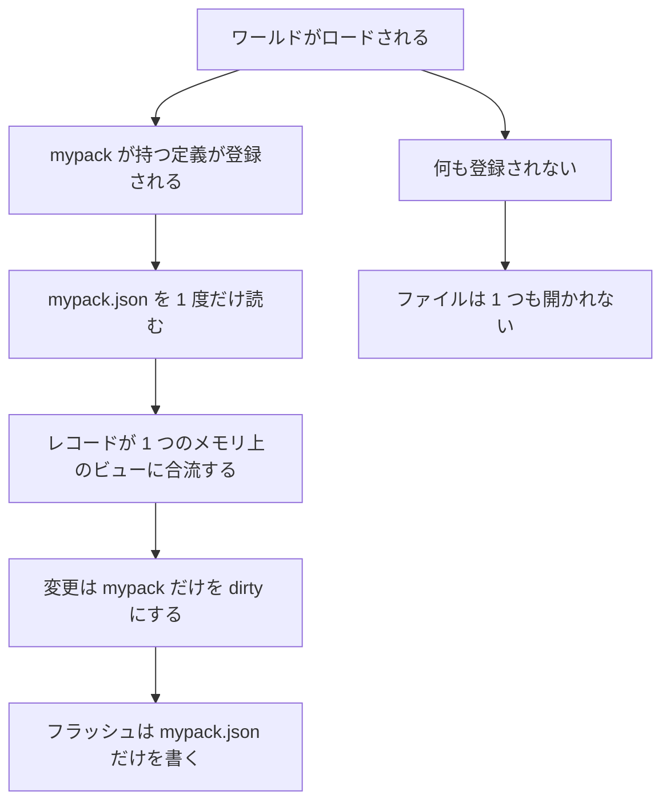

## このページでできるようになること

- 自分の mod の状態が入っている 1 つのファイルを見つけ、自分で中身を読む
- `PalForge.pack("mypack").store` を通じて自分の値を保存し、読み出す
- 保存できない値を、10 分後の書き込み時ではなく自分が書いた行で拒否させる
- 構造物や mod が消えたとき、その構造物の状態がどうなるかを知る
- mod をアンインストールするとプレイヤーの Palworld セーブに何が起きるか、正確に説明する

## どこに置かれるか

PalForge が保存するものはすべて PalForge 自身の mod フォルダの中にあり、Palworld のセーブごとに
1 ディレクトリ、mod ID ごとに 1 ファイルという形をしています。

```text
<UE4SS Mods>/PalForge/
└── state/
    ├── README.txt                                  最初の書き込み時に一度だけ作られる
    ├── entities_w_1DF0E44B….json                   古い PalForge が残したもの。今は誰も読まない
    └── w_1DF0E44B4FDDD6196E30819A899C9009/         セーブごとに 1 ディレクトリ
        ├── _save.json                              どのセーブか、どの mod を抱えているか
        ├── _unowned.json                           まだ持ち主を特定できないレコード
        ├── logi.json                               mod ID ごとに 1 ファイル
        ├── logi.json.bak                           その 1 つ前の正常なコピー
        ├── mypack.json
        └── _quarantine/
            └── 2026-08-02T14-03-11Z_logi.json      パースできなかったファイルの退避先
```

ディレクトリ名は `core/spatial` が答えます。生きた `PalGameInstance` から選択中のセーブを読み、
まずセーブ **ディレクトリ** 名、次にワールドの表示名を使い、記号を除いて `w_` を前置します。
どちらも答えないときは共有バケット `world` です。2026-08-02 に実セーブで計測した答えは
`w_1DF0E44B4FDDD6196E30819A899C9009` でした。

このフォールバックは記憶されません。ゲームがまだ答えられない時点で読んだ場合 — 起動中や、セーブが
選ばれる前 — その 1 回だけ `world` になり、次の呼び出しはまた尋ね直します。これをわざわざ書くのは、
逆の挙動が 2026-08-02 に実際に観測されたからです。早すぎる 1 回の読み取りがキャッシュされ、実セーブが
ロードされているあいだセッション全体が共有バケットに書き込んでいました。今は成功した答えだけを
保持します。

ファイル名はあなたの mod ID です。`PalForge.pack("mypack")` に渡す文字列そのもので、定義する
`mypack:Thing` の `mypack` の側と同じものです。別の識別子を宣言する必要はありません。使えるのは
英数字とアンダースコアだけで、それはこの ID がファイル名にもなったからです。

そのうち 3 つの名前は PalForge 自身が使っているので、`api.pack` が書いた場所で拒否します。

```text
PalForge: api.pack("_save"): "_save" is RESERVED — a pack id is also the file name its saved state lives under (state/<save>/_save.json), and PalForge already owns _save, _unowned and _quarantine in that directory. Pick another id
```

<Callout type="info">
これらはどれも Palworld 自身の `.sav` の中にはありません。PalForge は自分のスクリプトの隣に JSON を
書くだけで、セーブファイルを開くことはありません。`Scripts/palforge` のどこにも `SaveGame`、
`RequestSave`、`WriteSave` の呼び出しはありません。`<UE4SS Mods>/PalForge/` を削除してもワールドは
ロードできます。失われるのは mod が保持していた状態であって、セーブではありません。`state/README.txt`
にも同じことが書いてあります。このページより先にフォルダを見つけたプレイヤーのためです。
</Callout>

実際に何かが保存されるまで、何も作られません。建物定義を登録しただけで何も保存しない mod は、
ファイルもディレクトリも作りません。ストアのハンドルを取得するだけでも何も開きません。

## mod ごとのファイル

JSON ドキュメント 1 つ、キーはソート済み、まるごと書き込みます。これは実物です。state テーブルを
持つ構造物 1 つと、保存された値が 2 つ。書き込まれるとおりに載せます。

```json
{"buildings":{"mypack_Smelter@-3432,2651,42":{"buildId":"mypack_Smelter","def":"mypack:Smelter","pos":[-343157,265120,4210],"state":{"oreBurned":10}}},"data":{"launches":1,"tutorialSeen":true},"orphans":{},"palforge":{"buildings":1,"forge":"0.3.0","format":3,"mod":"mypack","save":"w_1DF0E44B4FDDD6196E30819A899C9009","wrote":1785646408}}
```

| セクション | 中身 |
| --- | --- |
| `palforge` | ヘッダ。`format`（3）、`mod`、`save`、`forge`（書いた PalForge のバージョン）、`wrote`、レコード数。mod がバージョンを宣言していれば `packVer` も |
| `buildings` | 設置済み構造物 1 件につき 1 レコード。`buildId`、`def`、`pos`、そしてあなたの `state` |
| `orphans` | 削除せずに脇へ寄せたレコード。それぞれ `orphanedAt` と `why` を持つ |
| `data` | `store.set` で入れたもの。空のあいだはセクションごと省かれる |
| `ledger` | この mod が **ゲーム** 自身のセーブに書かせた、パック由来の ID |

レコードのキーは解決後の build id と量子化したセルで、`<buildId>@<qx>,<qy>,<qz>` です。その格子に
ついては [近傍と空間インデックス](/docs/concepts/spatial-index) にあります。位置は整数センチメートル
です。保存された位置を読む唯一の場所がそれを同じ量子化器に渡し直すからであり、double が印字する
14 桁は、2 回のスキャンの間にそれ以上動く構造物を語っているからです。

ファイルが持たないフィールドが 2 つあります。持ち主の mod はファイル名であり、レコード単位の
バージョンはヘッダの `format` です。このビルドが知らない `format` は推測せずそのまま残すので、
古い PalForge が新しいファイルを切り詰めることはありません。

## パックに生えるストア

`PalForge.pack("mypack").store` があなたの mod の取り分です。mod ID はハンドルに焼き込まれているので、
これを通じて他の mod のストアに触ることはできません。

```lua
local db = PalForge.pack("mypack", { version = "1.0.0" }).store

db.get(key)                --> value | nil      最初の読み込み以降はディスクに触れない
db.set(key, value)         --> true | false, reason      この行で検査される
db.delete(key)             --> boolean
db.keys()                  --> string[]         ソート済み
db.data()                  --> table            生テーブル。書き換えてから save()
db.save()                  --> true | false, err        この mod のファイルを今すぐ書く

db.building(instOrKey)     --> table | nil      その構造物の state テーブル
db.buildings()             --> { { key, buildId, def, pos, state, orphanedAt, why }, ... }

db.ledger()                --> { item = {...}, tech = {...}, passive = {...}, pal = {...} }
db.reclaim()               --> この mod の削除で戻せないものを名指しするレポート

db.saveId()                --> "w_1DF0E44B4FDDD6196E30819A899C9009"
db.path()                  --> この mod のファイルの絶対パス
db.stats()                 --> { path, bytes, buildings, orphans, data, ledger, dirty, health, ... }
db.diagnose()              --> この mod の状態を説明する英語 1 段落
```

`db.data()` が返すのは生きたテーブルです。あなた自身のキー / 値データはあなたのものだからです。
`db.buildings()` が返すのは **コピー** です。構造物レコードは建物ランタイムのものでもあるからで、
戻り値を書き換えても何も変わりません。中に入る正規の経路は `db.building(inst)` で、返るテーブルは
生きているインスタンスの `self.state` と同一のテーブルです。

<Callout>
`opts.version` はヘッダに `packVer` として書き込まれるので、その状態ファイルを最後に書いたのが
あなたの MOD のどのビルドだったかが記録されます。バージョンを宣言する前に書かれたファイルには
単に `packVer` がありません。宣言した値はファイルが覚えていた値より優先されます — 宣言はこれから
書くビルドを、ヘッダは前回書いたビルドを指しているからです。
</Callout>

### 実際の例

```lua title="Scripts/content/smelter.lua"
local mine = PalForge.pack("mypack", { version = "1.0.0" })

mine.Building{
    id    = "mypack:Smelter",
    state = { oreBurned = 0 },
    events = {
        onLoad = function(self, ctx)
            print(("%s has burned %d ore"):format(self.key, self.state.oreBurned))
        end,
        onTick = function(self)
            self.state.oreBurned = self.state.oreBurned + 1
            self:setDirty()                    -- まとめ書き。10 秒以内にディスクへ
        end,
        onRightClick = function(self)
            local ok, err = self:save()        -- 今すぐ永続化し、できなければそう言う
            if not ok then print("save failed: " .. err) end
        end,
    },
}

local db = mine.store
db.set("tutorialSeen", true)
db.data().launches = (db.data().launches or 0) + 1
db.save()
```

10 回の tick と 1 回の起動のあと、`state/w_1DF0E44B…/mypack.json` は上に載せた 338 バイトの
ファイルになります。次のセッションでは `onLoad` が `self.state.oreBurned == 10` で発火し、
`db.get("launches")` は `1` を返します。

### 構造物ごとの state

構造物の `state` テーブルと mod の `data` テーブルは別物で、同じファイルに保存されます。
`self.state` は設置された 1 つの構造物のもので、その構造物が立っている場所でキーが決まります。
`db.data()` は mod のもので、セーブごとに 1 つです。

```lua
onRightClick = function(self, ctx)
    self.state.uses = (self.state.uses or 0) + 1   -- この構造物だけ
    self:setDirty()                                 -- 安い。印を付けるだけで書かない

    local db = PalForge.pack("mypack").store
    db.data().totalUses = (db.data().totalUses or 0) + 1   -- mod 全体、このセーブ
    db.save()                                              -- mypack.json を今すぐ書く
end,
```

ホットループでは `setDirty()`、変更が重要なときは `save()` です。毎 tick の `save()` はハート
ビートごとにファイルを書きますが、`setDirty()` はテーブルへの書き込み 1 回で済みます。

## 何を入れるべきか

自分のコードが生み出し、再計算できない事実です。この構造物が何回動いたか、プレイヤーが何を選んだか、
機械がサイクルのどこにいるか、mod が何を配ったか。文字列・数値・真偽値と、それらのテーブルです。

### ストアが拒否するもの、その場で

`db.set` は値を 1 度走査し、`false` と、あなたの mod・キー・その中のフィールドを名指しする 1 文を
返します。以下は実際のメッセージです。

```text
mypack:store.set("slots"): field slots mixes array entries with named fields; the array entries come back as the string keys "1", "2", … and ipairs stops seeing them. Use one or the other.
mypack:store.set("onDone"): field onDone.onDone is a function. Only strings, numbers, booleans, nil and tables of those can be saved.
mypack:store.set("rate"): field rate.rate is not a finite number (nan).
mypack:store.set("k"): field k.a.b points back at the value itself. Saved state must be a tree.
```

ほかに拒否されるもの。文字列でも整数でもないキー、穴の空いた配列、そして 3 つの上限、すなわち
深さ 16 超、フィールド数 4096 超、エンコード後 64 KiB 超です。どれも放っておけば `null` として
書かれるか、あなたが見ることのない書き込みの中で黙って落ちるものです。同じ検査は書き出し時に
各構造物の `state` に対しても走り、拒否されたレコードは **名指しで** スキップされ、ファイルの
残りは通常どおり書かれます。

### 入れてはいけないもの

- **ゲームがすでに所有しているもの。** プレイヤーの所持品、パルのレベル・ニックネーム・スキル・
  所有者。PalForge はそれらの変化を見張れないので、写しはプレイヤーがチェストやパルボックスを
  使った瞬間から古くなります。無効化できない鏡は、鏡がないより悪いものです。必要なときにゲームへ
  訊いてください。
- **パルの状態を、何かをキーにして持つこと。** パル単位のストアはまだありませんし、それは意図的
  です。パルは歩くので、建物で通用する位置の手は逆に間違いになりますし、PalForge がパルについて
  読めるハンドルはどれもセッションごとに作り直されます。そのどれかをキーにしたストアは、あるパルの
  データを別のパルに結び付けてしまいます。
- **ロード時に再計算できるもの。** キャッシュは状態ではありません。
- **構造物の回転とスケール。** PalForge はそれらを読んでいないので、保存もできません。

## ファイルが開かれるとき

読み込みは登録が駆動し、ワールドごと・mod ごとに 1 回だけ起きます。

| タイミング | 開かれるファイル |
| --- | --- |
| ゲーム起動 | なし |
| ワールドのロード。定義が 1 つも登録されていない時点 | なし |
| mod **P** が持つ定義を最初に見たとき | `P.json` |
| 建物定義を 1 つでも見たとき | 加えて `_unowned.json` |
| mod は入っているが何も登録しない | なし。自分のストアに触るまでは |
| **mod が入っていない** | 一度もなし |



`_unowned.json` は建物定義が 1 つでもあれば読まれます。この非対称は好みではなく計測の結果です。
mod を特定できるようになる前に書かれたレコードは持ち主を持たないので、アップグレード後の初回
ロードではそれらがすべてそこに入ります。そして自然に空になります。各レコードはスキャンが最初に
束縛したときに持ち主が刻まれ、次の書き込みで持ち主のファイルに振り分けられるからです。

このマシンでの計測です（WSL2、`lua5.4`、このツリー自身のコーデック、20 回反復、4 フィールドの
state を持つ 500 レコードを 3 つの mod に分散）。

| | バイト数 | デコード | エンコード |
| --- | --- | --- | --- |
| 全 mod が入った共有ファイル 1 つ | 116,077 | 19.4 ms | 8.6 ms |
| mod 1 つ分のファイル | 27,893 | 4.9 ms | 2.1 ms |
| 3 つの mod のファイル合計 | 85,520 | 約 15 ms | — |

つまり mod が 1 つ入った状態のワールドロードは、共有ファイルなら 19.4 ms かかった読み込みを
4.9 ms で終えます。3 つなら約 15 ms、0 なら何も読みません。このレコード数は負荷側の数字です。
Palworld はワールドごとに自前の建築上限を持っており、このツリーがこれまでに作った最大のレコード
集合は 18 件でした。

### 書き込み側

書き込みは mod ごとで、まとめて行われます。変更はその mod のドキュメントだけを dirty にし、
ポンプが 10 秒ごとに dirty なドキュメントをすべて書き、`self:save()` や `db.save()` はその 1 つを
即座に書きます。ワールドを離れるときは dirty なものをすべて書いてからキャッシュを捨てます。

同じ分割が書き込みの被害範囲も抑えます。1 つの構造物が数値を 1 つ変えても、書き直されるのはその
mod のファイルだけで、他は一切触られません。上の表でいえば 2.1 ms と 28 KB で、共有ファイル 1 つ
なら 8.6 ms と 116 KB でした。

書き込みは上書きではなく回転です。新しいバイト列は `<mod>.json.tmp` へ行き、現在のファイルが
`<mod>.json.bak` になり、一時ファイルが名前を変えて所定の位置に入ります。読み込みは
`<mod>.json`、`.tmp`、`.bak` の順に探すので、どの瞬間にも完全なコピーが少なくとも 1 つ存在します。
`.bak` が削除されることはありません。

## うまくいかないとき

どの拒否もバイト列を残し、そう言います。ここでファイルが削除されることはありません。

| 起きたこと | ストアの挙動 |
| --- | --- |
| ファイルがパースできない | 次の書き込み時に `_quarantine/<timestamp>_<mod>.json` へそのまま移される。上書きはされない。その mod は空から始まり、ログがバイト列の行き先を言う |
| ヘッダがこのビルドの知らない `format` を名乗る | そのセッションでは読みも書きもしない。その mod はレコードなしになり、切り詰められたファイルにはならない |
| ヘッダがフォルダと違うセーブを名乗る | 同じ拒否を、両方の ID を名指しして行う。コピーされたり名前を変えられたワールドが、黙って取り込まれるのではなく検出される。意図的なコピーなら `PalForge.core.state.rebind()` が取り込む |
| 書き込みが失敗する（ディスク満杯、読み取り専用フォルダ、ファイルが掴まれている） | その mod は dirty のままで、次のフラッシュで再試行される。レコードはメモリにあり、ログが mod と理由を名指しする |
| あるレコードの `state` がエンコードできない | そのレコードだけを名指しでスキップし、ファイルの残りを書く |

<Callout type="info">
**この表は `os.rename` からの推論だけでなく、実際のファイルシステムで確認しました。**2026-08-02、
`pf_hook store-save-roundtrip` がパックの state を公開 API 経由で実セーブのストアへ書き込み——
ディスク上 370 バイト、フィールド単位で読み戻し——続いて `pf_hook store-crash-recovery` が
途中で切れた書き込みと読めないファイルを仕込み、**上の 4 行すべてを NTFS 上で**確認しました。
最後に残ったのは `<mod>.json` と隣の `<mod>.json.bak` で、`.tmp` は残っていません。

前者の実行は、ヘッドレスの 553 個のチェックでは見つけられなかった欠陥を見つけました。`ensureDir` が
*ディレクトリ*の存在を `io.open` に尋ねていたのです。Windows は `mkdir` が作った直後のものでも
「ない」と答え、Linux は「ある」と答えます。そのためスイートは緑のまま、ゲーム側では何も書かれて
いませんでした。構造物 7 つがあり登録済み定義が 1 つもない実際の拠点をロードしたときのコストは
**0 バイト・0.00 ms** でした。何も宣言しない mod は読まれないからです。まだ残っている半分は
2 回目の往復、つまり*前のセッション*が書いたものを読み戻すことで、これにはもう 1 回のワールド
ロードが要ります。
</Callout>

何かおかしいと思ったときに呼ぶのは `db.diagnose()` です。1 段落で答えます。

```text
Pack 'logi', save w_1DF0E44B4FDDD6196E30819A899C9009: 18 structures and 0 saved values, in state/w_1DF0E44B4FDDD6196E30819A899C9009/logi.json (2.4 KB). Last written just now. 1 record is quarantined: logi_PipeSatellite@-7086,5450,142 has been kept since 2026-07-14 because no loaded definition claims the build id "logi_PipeSatellite"; it will come back by itself if that structure or that definition returns. 1 id is recorded in the ledger — those are names this pack asked the GAME to write into its own save. Nothing has failed. The Palworld save itself is untouched — PalForge has never written to it.
```

`PalForge.core.state.audit()` は、このセーブが知っているすべての mod について同じ数値を答え、
ファイルはあるが読まれていない mod も、読まずに列挙します。

## 構造物が見えなくなったとき

何かが「いない」ことを理由にレコードが削除されることはありません。2 種類の不在はどちらも理由付きで
`orphans` へ移すだけで、どちらも自分で元に戻ります。

- `why = "unclaimed"` — このセッションでその build id を主張する登録済み定義がない。mod を 1 晩
  無効にしただけのプレイヤーが構造物の状態を失ってはならないので、レコードは待ちます。
- `why = "missing"` — ワールドスキャンが 6 回連続でそのアクターを報告しなかった。約 3 秒です。
  このスキャンはメモリ上のオブジェクトしか列挙せず、出荷バイナリから読み取れることはすべて、
  Palworld がマップオブジェクトを距離に応じて生成・破棄していると言っています。つまり「今回の
  スキャンにいない」は「もういない」と同じ文ではありません。構造物のところへ戻れば、次のスキャンが
  `state` テーブルごとレコードを隔離から戻します。

`onRemove` は今も `reason = "missing"` で発火するので、あなたのコードを変える必要はありません。

レコードを本当に破棄する唯一のものは隔離の上限で、**mod のファイルごとに** 4096 件です。それを
超えるとその mod の最も古い隔離レコードから順に落とされ、何件をどの mod で落としたかログが言います。
1 つの mod が上限に達しても、他の mod を追い出すことはできません。

## 古い PalForge から移行する

古い PalForge は、すべての mod のレコードをセーブごとに 1 つのファイル
`state/entities_<saveId>.json` に書いていました。そのファイルに再び書き込まれることはなく、名前も
変わらず、削除もされません。だから古い PalForge に戻すのは「何もしない」ことです。

そのレコードを新しい配置へ移す処理は、ワールドごとに 1 回、**自動で** 走ります。あなたが何かを
呼ぶ必要はありません。PalForge はワールドが ready になった瞬間に――より正確には、最初のスキャンが
アクターを束縛する直前に――実行します。この順序こそがその正しさのすべてです。移行は足りないものを
足すだけで、すでにあるものを置き換えません。もしスキャンが先に走っていたら、立っている構造物すべてが
新しい空のレコードに束縛され、保存されていた `state` はその空白のために読み飛ばされていたはずです。

同じ呼び出しは公開されています。自分で走らせたいときや、何をしたか見たいときに使えます。

```lua
local report = PalForge.core.state.migrate()
--> { records = 7, added = 7, unowned = 7, packs = { _unowned = 7 }, from = "entities_w_1DF0….json" }
```

古いファイルを読み、各レコードの持ち主を、記録された持ち主 → 定義 → その build id を主張する
唯一の登録済み定義、の順で特定し、分割後のファイルを書きます。特定できなかったレコードは中身を
そのまま `_unowned.json` へ行き、あとでスキャンが束縛したときに引き取られます。2 回目の呼び出しは
何もしません。`_save.json` が読んだファイルのフィンガープリントを覚えていて、プレイヤーがその上に
バックアップを戻した場合は、**足りない** レコードだけが追加されます。

この特定処理は、あなたの定義が必ずしも登録され終わっていない時点で走ります。そのため移行してきた
プレイヤーのレコードは、まず `_unowned.json` に入り、その後 1〜2 セッションかけて、各構造物が束縛
されるたびに持ち主の mod のファイルへ流れていきます。その間に失われるものはありません。`_unowned`
から読まれるレコードは、あなた自身のファイルから読まれるものとまったく同じに扱われます。古いバイト列は
元の場所にあり、読める状態のままで、書き込まれることもありません。

## mod を削除する

この配置が答えるために存在する問いで、答えは 2 つに割れます。1 つ目は素直です。

- PalForge が保存するものはすべて `<UE4SS Mods>/PalForge/` の下にあります。そのフォルダを削除しても
  Palworld 自身のセーブは無傷で、ロードできます。
- mod 1 つの削除はファイル 1 つです。`PalForge.core.state.uninstall("mypack")` が
  `state/<save>/mypack.json` を削除しますし、プレイヤーが名前を見て削除しても同じです。単に入って
  いないだけの mod は読み込みコストがゼロで、他の mod の肥大化に追い出されることもありません。

2 つ目が本当に実在する側です。**ゲーム** に何かを書かせる呼び出しが 3 つあり、ゲームが書いたものは
プレイヤーのセーブの中にあります。

| 呼び出し | Palworld のセーブに入るもの |
| --- | --- |
| `Item.get("mypack:Potion"):give(1)` | 所持品コンテナの中の行名 `mypack_Potion` |
| `Building.get("mypack:Bench"):unlock()` | プレイヤーの解放済みテクノロジー一覧に入るその名前 |
| `Skill.get("mypack:Legend"):teach(pal)` | キャラクターのパッシブスキル一覧に入るその名前 |

これらの行は、あなたのパックの PalSchema JSON が注入したからこそ存在しています。パックを外せば、
セーブは裏に行のない名前を抱えることになります。PalForge はそうした呼び出しを、名前空間付きの ID に
限り、成功したときに限り、あなたのファイルの `ledger` セクションに記録します。だから一覧を ID
単位で作れます。

```lua
local rep = PalForge.pack("mypack").store.reclaim()
print(rep.text)
--> 'mypack' made the game record 2 thing(s) in save w_1DF0E44B…: item mypack_Potion x5
--> (reclaimable), tech mypack_Smelter x1 (CANNOT be undone). A technology unlock can NEVER be
--> undone — the cheat manager declares four unlocks and no lock — so an uninstall leaves those
--> names in the save with no DataTable row behind them.
```

アイテムはローカルプレイヤー自身のバッグからなら取り戻せますが、チェストの中のものには手が届きま
せん。パッシブは手元に置けるキャラクターからなら外せます。テクノロジーの解放はまったく戻せません。
`UPalCheatManager` は解放のエントリを 4 つ宣言していて、ロックのエントリは 1 つもなく、lock /
remove / reset / forget に相当するものはヘッダダンプのどこにもありません。`Item.get("Wood"):give(1)`
は何も記録しません。ゲームの行は存在しなくなりようがないからです。

<Callout type="warn">
行が失われた名前に Palworld のセーブが出会ったとき何が起きるかは、まだ誰も見ていません。バイナリ
から読み取れることはすべて、その形が壊れたファイルではなく **見つからない参照** であることを示して
います。セーブはただの `FName` を保持し、行の解決は失敗できるように作られたアクセサ経由で、セーブ
エラーの列挙型に「未知の内容」に当たるメンバーはありません。とはいえロード経路はリフレクションの
ない C++ なので、これは根拠のある推定であって証明ではありません。決着を付けられるのは
`test/hooks/save-survives-pack-removal` の計測です。プレイヤーには、どちらかの結果を約束するのでは
なく、この言葉のまま伝えてください。
</Callout>

## まとめ

- Palworld のセーブごとに 1 ディレクトリ、mod ID ごとに 1 つの JSON ファイル。場所は `<UE4SS Mods>/PalForge/state/` の下です。
- mod ID はすでに `PalForge.pack` に渡しているものです。`_save`、`_unowned`、`_quarantine` は PalForge が使うファイル名なので拒否されます。
- `PalForge.pack("mypack").store` はあなたの取り分で、他人の取り分を名指しできません。`db.set` は往復できない値を、あなたの行で、フィールドを名指しして拒否します。
- ファイルはその mod の定義が最初に登録されたときに読まれます。入っていない mod のコストは常にゼロで、何も保存しない mod はファイルを作りません。
- 書き込みは mod ごと、10 秒ごとのまとめ書きで、`.tmp` と `.bak` を経由して回転するので完全なコピーが常に存在します。
- 「いない」ことを理由に削除されるものはありません。主張されないレコードも見えないレコードも理由付きで隔離され、自分で戻ってきます。破壊的なのは mod ごとの上限 4096 だけです。
- 古い単一ファイルからの移行は、最初のワールド ready 時に、何かが束縛される前に自動で走ります。`PalForge.core.state.migrate()` は同じ処理を公開したものです。どちらの場合も古いファイルには一切触れません。
- これらはどれも Palworld のセーブの中にはありません。中にあるのは、あなたの mod がゲームに書かせたものであり、`ledger` がその ID を名指しするので、アンインストールの影響を推測ではなく説明できます。

<Cards>
  <Card title="Building" href="/docs/api/building">インスタンスが構造物ごとの状態を持つドメイン</Card>
  <Card title="同一性と所有" href="/docs/concepts/identity-and-ownership">mod ID がどこから来て、ほかに何を決めるか</Card>
  <Card title="近傍と空間インデックス" href="/docs/concepts/spatial-index">レコードキーが量子化される格子</Card>
</Cards>
