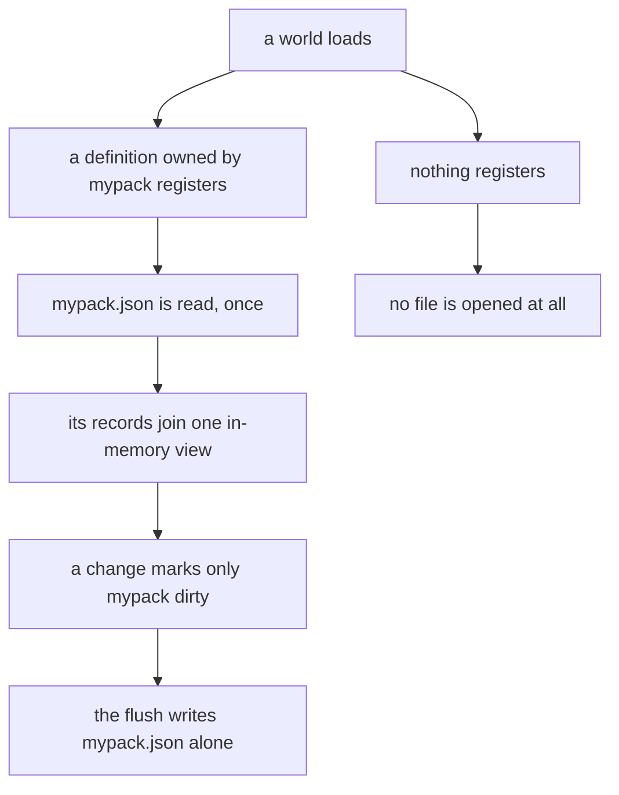

## What you can do after this page

- Find the one file your mod's saved state lives in, and read it yourself
- Save and read your own values through `PalForge.pack("mypack").store`
- See a value the store cannot save refused at your own call line, not ten minutes later
- Know what happens to a structure's state when the structure, or your mod, goes away
- Tell a player exactly what uninstalling your mod does to their Palworld save

## Where it lives

Everything PalForge saves is inside PalForge's own mod folder, in one directory per Palworld
save and one file per mod id:

```text
<UE4SS Mods>/PalForge/
└── state/
    ├── README.txt                                  written once, on the first write
    ├── entities_w_1DF0E44B….json                   from an older PalForge; read by nothing now
    └── w_1DF0E44B4FDDD6196E30819A899C9009/         one directory per SAVE
        ├── _save.json                              which save this is, and which mods it holds
        ├── _unowned.json                           records no mod can be attributed to yet
        ├── logi.json                               one file per MOD ID
        ├── logi.json.bak                           the previous good copy of it
        ├── mypack.json
        └── _quarantine/
            └── 2026-08-02T14-03-11Z_logi.json      a file that would not parse, moved aside
```

The directory name comes from `core/spatial`, which reads the selected save off the live
`PalGameInstance`: the save **directory** name first, then the world's display name, sanitised
and prefixed `w_`, and the shared bucket `world` when neither answers. Measured in a real save
on 2026-08-02, it answers `w_1DF0E44B4FDDD6196E30819A899C9009`.

That fallback is never remembered. A probe taken before the game will answer — during startup, or
before a save is chosen — gives `world` for that one call, and the next call asks again. It is
worth stating because the opposite behaviour was measured happening on 2026-08-02: one early probe
was cached and a whole session wrote into the shared bucket while a real save was loaded. Only a
successful answer is kept now.

The file name is your mod id — the same string you pass to `PalForge.pack("mypack")` and the
same one that becomes the `mypack` half of every `mypack:Thing` you define. There is no second
identity to declare. It is letters, digits and underscores, because it is now also a file name.

Three of those names belong to PalForge itself, so `api.pack` refuses them where you typed them:

```text
PalForge: api.pack("_save"): "_save" is RESERVED — a pack id is also the file name its saved state lives under (state/<save>/_save.json), and PalForge already owns _save, _unowned and _quarantine in that directory. Pick another id
```

<Callout type="info">
None of this is inside Palworld's own `.sav`. PalForge writes JSON beside its own scripts and
never opens a save file — there is no `SaveGame`, `RequestSave` or `WriteSave` call anywhere in
`Scripts/palforge`. Delete `<UE4SS Mods>/PalForge/` and the world still loads; what is lost is
the state mods kept, not the save. `state/README.txt` says the same thing next to the files, for
a player who finds the folder before finding this page.
</Callout>

Nothing is created until something is actually saved. A mod that registers a building definition
and stores nothing produces no file and no directory, and asking for its store handle opens
nothing either.

## Your mod's file

One JSON document, sorted keys, written whole. This is a real file — one structure with a state
table, two saved values — printed exactly as it lands:

```json
{"buildings":{"mypack_Smelter@-3432,2651,42":{"buildId":"mypack_Smelter","def":"mypack:Smelter","pos":[-343157,265120,4210],"state":{"oreBurned":10}}},"data":{"launches":1,"tutorialSeen":true},"orphans":{},"palforge":{"buildings":1,"forge":"0.3.0","format":3,"mod":"mypack","save":"w_1DF0E44B4FDDD6196E30819A899C9009","wrote":1785646408}}
```

| Section | What is in it |
| --- | --- |
| `palforge` | the header: `format` (3), `mod`, `save`, `forge` (the PalForge version that wrote it), `wrote` and the record count. `packVer` when the mod declared one |
| `buildings` | one record per placed structure of yours: `buildId`, `def`, `pos` and your `state` |
| `orphans` | records held aside rather than deleted, each with `orphanedAt` and `why` |
| `data` | whatever you put there with `store.set` — omitted entirely while it is empty |
| `ledger` | the pack-owned ids this mod asked the **game** to write into its own save |

The record key is the resolved build id and a quantised cell, `<buildId>@<qx>,<qy>,<qz>` —
[Neighbours and the spatial index](/docs/concepts/spatial-index) has the grid it comes from.
Positions are integer centimetres: the only reader of a saved position feeds it back to the same
quantiser, and the fourteen digits a double prints describe a structure that moves further than
that between two scans anyway.

Two fields the file does not carry: the owning mod, which is the file name, and a per-record
version, which is the header's `format`. A `format` a build does not know is left alone rather
than guessed at, so an older PalForge cannot truncate a newer file.

## The store on your pack

`PalForge.pack("mypack").store` is your mod's slice, and the mod id is baked into the handle —
there is no way to reach another mod's store through it.

```lua
local db = PalForge.pack("mypack", { version = "1.0.0" }).store

db.get(key)                --> value | nil      no disk access after the first read
db.set(key, value)         --> true | false, reason      checked NOW, at this line
db.delete(key)             --> boolean
db.keys()                  --> string[]         sorted
db.data()                  --> table            the live table; mutate it, then save()
db.save()                  --> true | false, err        write THIS mod's file now

db.building(instOrKey)     --> table | nil      that structure's state table
db.buildings()             --> { { key, buildId, def, pos, state, orphanedAt, why }, ... }

db.ledger()                --> { item = {...}, tech = {...}, passive = {...}, pal = {...} }
db.reclaim()               --> a report naming what removing this mod cannot undo

db.saveId()                --> "w_1DF0E44B4FDDD6196E30819A899C9009"
db.path()                  --> the absolute path of this mod's file
db.stats()                 --> { path, bytes, buildings, orphans, data, ledger, dirty, health, ... }
db.diagnose()              --> one English paragraph about this mod's state
```

`db.data()` hands back the live table, because your own key/value data is yours. `db.buildings()`
hands back **copies**, because a structure record is also the building runtime's: mutating the
result changes nothing, and `db.building(inst)` is the supported way in — the table it returns is
the same one the live instance's `self.state` is.

<Callout>
`opts.version` is written into the header as `packVer`, so a state file records which build of
your mod last wrote it. A file written before you declared a version simply has no `packVer`, and
the declared value wins over whatever the file remembered — the declaration describes the build
that is about to write, the header describes the build that wrote last.
</Callout>

### A worked example

```lua title="Scripts/content/smelter.lua"
local mine = PalForge.pack("mypack", { version = "1.0.0" })

mine.Building{
    id    = "mypack:Smelter",
    state = { oreBurned = 0 },
    events = {
        onLoad = function(self, ctx)
            print(("%s has burned %d ore"):format(self.key, self.state.oreBurned))
        end,
        onTick = function(self)
            self.state.oreBurned = self.state.oreBurned + 1
            self:setDirty()                    -- batched; on disk within ten seconds
        end,
        onRightClick = function(self)
            local ok, err = self:save()        -- durable now, and it says if it was not
            if not ok then print("save failed: " .. err) end
        end,
    },
}

local db = mine.store
db.set("tutorialSeen", true)
db.data().launches = (db.data().launches or 0) + 1
db.save()
```

After ten ticks and one launch, `state/w_1DF0E44B…/mypack.json` is the 338-byte file printed
above. The next session, `onLoad` fires with `self.state.oreBurned == 10` and
`db.get("launches")` answers `1`.

### Per-structure state

A structure's `state` table and your mod's `data` table are different things, saved into the same
file. `self.state` belongs to one placed structure and is keyed by where it stands; `db.data()`
belongs to the mod and there is one of it per save.

```lua
onRightClick = function(self, ctx)
    self.state.uses = (self.state.uses or 0) + 1   -- this structure only
    self:setDirty()                                 -- cheap: mark, do not write

    local db = PalForge.pack("mypack").store
    db.data().totalUses = (db.data().totalUses or 0) + 1   -- the whole mod, this save
    db.save()                                              -- writes mypack.json now
end,
```

`setDirty()` in a hot loop and `save()` when the change matters. A `save()` on every tick writes
the file on every heartbeat, and `setDirty()` costs a table write.

## What belongs in it

Facts your own code produced and cannot recompute: how many times this structure ran, what the
player chose, where your machine is in its cycle, what your mod handed out. Plain strings,
numbers, booleans and tables of those.

### What the store refuses, at your call line

`db.set` walks the value once and returns `false` plus a sentence naming your mod, your key and
the field inside it. These are real messages:

```text
mypack:store.set("slots"): field slots mixes array entries with named fields; the array entries come back as the string keys "1", "2", … and ipairs stops seeing them. Use one or the other.
mypack:store.set("onDone"): field onDone.onDone is a function. Only strings, numbers, booleans, nil and tables of those can be saved.
mypack:store.set("rate"): field rate.rate is not a finite number (nan).
mypack:store.set("k"): field k.a.b points back at the value itself. Saved state must be a tree.
```

Also refused: a key that is neither a string nor an integer, an array with a hole in it, and the
three bounds — deeper than 16, more than 4096 fields, or more than 64 KiB once encoded. Every one
of them is something that would otherwise be written as `null`, or silently dropped, inside a
flush you never see. The same check runs over each structure's `state` on the way out, and a
record it refuses is skipped **by name** while the rest of the file is written normally.

### What not to keep in it

- **Anything the game already owns.** The player's inventory, a pal's level, nickname, skills or
  ownership. PalForge cannot watch those change, so a copy of one goes stale the first time the
  player uses a chest or a Palbox — and a mirror that cannot be invalidated is worse than no
  mirror at all. Ask the game when you need the answer.
- **A pal's state, keyed on anything.** There is no per-pal store yet, and deliberately so: a pal
  walks, so the positional trick that works for buildings is exactly wrong for it, and every
  other handle PalForge can read for a pal is fresh per session. A store keyed on one of those
  would attach one pal's data to another.
- **Anything you can recompute at load.** A cache is not state.
- **Rotation and scale of a structure.** PalForge does not read them, so it cannot save them.

## When a file is opened

Reading is driven by registration, and it happens once per mod per world:

| Moment | Files opened |
| --- | --- |
| game start | none |
| world load, before any definition registers | none |
| the first definition owned by mod **P** is seen | `P.json` |
| any building definition at all is seen | `_unowned.json` as well |
| a mod is installed and registers nothing | none, until it touches its own store |
| **a mod is not installed** | none, ever |



`_unowned.json` is read whenever any building definition exists, and that asymmetry is a
measurement rather than a preference: records written before a mod could be attributed carry no
owner, so on the first load after an upgrade they all live there. It drains by itself — each
record is attributed the first time a scan binds it, and the next write files it under its owner.

Measured on this machine (WSL2, `lua5.4`, this tree's own codec, 20 iterations, 500 records with
a four-field state spread over three mods):

| | bytes | decode | encode |
| --- | --- | --- | --- |
| one shared file, every mod in it | 116,077 | 19.4 ms | 8.6 ms |
| one mod's own file | 27,893 | 4.9 ms | 2.1 ms |
| all three mods' files | 85,520 | ~15 ms | — |

So a world load with one mod installed reads 4.9 ms where a shared file read 19.4 ms, with three
it is about 15 ms, and with none it is nothing at all. Those record counts are a stress figure:
Palworld enforces its own build limit per world, and the largest set this tree has ever produced
is 18 records.

### The write side

Writing is per mod and batched. A change marks that one mod's document dirty; a pump writes every
dirty document every ten seconds, and `self:save()` or `db.save()` writes that one immediately.
Leaving the world writes everything still dirty and then drops the caches.

The same split bounds the damage of a write: one structure changing one number rewrites its own
mod's file and touches nobody else's — 2.1 ms and 28 KB in the table above, where one shared file
was 8.6 ms and 116 KB.

Each write is a rotation, not an overwrite: the new bytes go to `<mod>.json.tmp`, the current file
becomes `<mod>.json.bak`, and the temporary file is renamed into place. A read looks for
`<mod>.json`, then `.tmp`, then `.bak`, so at every instant at least one complete copy exists.
`.bak` is never deleted.

## When something is wrong

Every refusal keeps the bytes and says so. Nothing here deletes a file.

| What happened | What the store does |
| --- | --- |
| the file will not parse | it is moved verbatim into `_quarantine/<timestamp>_<mod>.json` on the next write, never overwritten; the mod starts empty and the log says where its bytes went |
| the header says a `format` this build does not know | the file is neither read nor written this session; that mod has no records rather than a truncated file |
| the header names a different save than the folder | the same refusal, naming both ids — a copied or renamed world is detectable instead of silently adopted. `PalForge.core.state.rebind()` adopts it on purpose |
| a write fails (disk full, read-only folder, a file held open) | the mod stays dirty and the write is retried on the next flush; the records are still in memory and the log names the mod and the reason |
| one record's `state` cannot be encoded | that record is skipped by name and the rest of the file is written |

<Callout type="info">
**That table was checked against a real filesystem, not only reasoned from `os.rename`.** On
2026-08-02, `pf_hook store-save-roundtrip` wrote a pack's state through the public surface into a
real save's store — 370 bytes on disk, read back field for field — and `pf_hook
store-crash-recovery` then planted a torn write and an unreadable file and confirmed **all four
rows above on NTFS**, ending with `<mod>.json` beside `<mod>.json.bak` and no `.tmp` left over.

The first of those runs found a defect that 553 headless checks could not: `ensureDir` asked
`io.open` whether a *directory* existed, and Windows answers no even for one `mkdir` has just
made, while Linux answers yes — so the suite was green while the game wrote nothing. Loading a real
base with seven structures and no registered definitions cost **0 bytes and 0.00 ms**, because a
mod that declares nothing is never read. The half that is still owed is the second trip: reading
back what a *previous session* wrote, which needs one more world load.
</Callout>

`db.diagnose()` is the one call to make when something looks wrong. It answers a paragraph:

```text
Pack 'logi', save w_1DF0E44B4FDDD6196E30819A899C9009: 18 structures and 0 saved values, in state/w_1DF0E44B4FDDD6196E30819A899C9009/logi.json (2.4 KB). Last written just now. 1 record is quarantined: logi_PipeSatellite@-7086,5450,142 has been kept since 2026-07-14 because no loaded definition claims the build id "logi_PipeSatellite"; it will come back by itself if that structure or that definition returns. 1 id is recorded in the ledger — those are names this pack asked the GAME to write into its own save. Nothing has failed. The Palworld save itself is untouched — PalForge has never written to it.
```

`PalForge.core.state.audit()` answers the same numbers for every mod this save knows about, and
lists a mod whose file exists without reading it.

## A structure that stops being there

A record is never deleted because something is absent. Both absences move it into `orphans` with
a reason, and both reverse themselves:

- `why = "unclaimed"` — no registered definition claims that build id this session. A player who
  disabled your mod for one evening must not lose their structures' state, so the record waits.
- `why = "missing"` — the world scan stopped reporting the actor for six consecutive scans, about
  three seconds. That scan enumerates in-memory objects only, and everything readable off the
  shipping binary says Palworld spawns and disposes map objects by proximity, so "not in this
  scan" is not the same statement as "gone". Walk back to the structure and the next scan takes
  its record back out of quarantine with its `state` table intact.

`onRemove` still fires with `reason = "missing"`, so nothing your code does has to change.

The one thing that does destroy a record is the quarantine cap, 4096 entries **per mod file**,
past which that mod's oldest quarantined records are dropped oldest-first, with a log line saying
how many and for which mod. One mod hitting the cap cannot evict another's.

## Coming from an older PalForge

An older PalForge wrote every mod's records into one file per save,
`state/entities_<saveId>.json`. That file is never written to again, never renamed and never
deleted, so reverting to an older PalForge is doing nothing.

Moving those records into the new layout happens **by itself**, once per world, and you do not
have to call anything. PalForge runs it at the moment the world becomes ready — and, more
precisely, at the last moment before the first scan binds an actor, which is the whole of its
correctness: the migration adds what is missing and never replaces what is already there, so a
scan that went first would have bound every standing structure to a fresh empty record and every
saved `state` would have been skipped over in favour of that blank.

The same call is public, if you want to run it yourself or see what it did:

```lua
local report = PalForge.core.state.migrate()
--> { records = 7, added = 7, unowned = 7, packs = { _unowned = 7 }, from = "entities_w_1DF0….json" }
```

It reads the old file, attributes each record — by its recorded owner, then by its definition,
then by the one registered definition claiming its build id — and writes the shards. Records it
cannot attribute go to `_unowned.json` with everything intact and are adopted later, as the scan
binds them. A second call is a no-op: `_save.json` remembers a fingerprint of the file it read,
and if a player restores a backup over it, only the records that are **missing** are added.

Because the attribution runs before any definition of yours has necessarily registered, a
migrating player's records usually land in `_unowned.json` first and drain into the owning mod's
file over the next session or two, as each structure is bound. Nothing is lost in between; the
records are read from `_unowned` exactly as they would be from your own file. The old bytes stay
where they were, still readable, still never written to.

## Removing a mod

This is the question the layout exists to answer, and it has two halves. The first is
straightforward:

- Everything PalForge saves is under `<UE4SS Mods>/PalForge/`. Delete that folder and Palworld's
  own save is untouched and still loads.
- Removing one mod is one file. `PalForge.core.state.uninstall("mypack")` deletes
  `state/<save>/mypack.json`, or a player deletes it by name. A mod that is merely absent costs
  zero reads and cannot be evicted by another mod's growth.

The second half is the one that is actually real. Three calls ask the **game** to write something,
and what the game writes is inside the player's save:

| Call | What lands in Palworld's save |
| --- | --- |
| `Item.get("mypack:Potion"):give(1)` | the row name `mypack_Potion` in an inventory container |
| `Building.get("mypack:Bench"):unlock()` | that name in the player's unlocked-technology list |
| `Skill.get("mypack:Legend"):teach(pal)` | that name on a character's passive-skill list |

Those rows exist only because your pack's PalSchema JSON injected them. Remove the pack and the
save holds a name with no row behind it. PalForge records every one of those calls — only for
namespaced ids, only when the call succeeded — in your file's `ledger` section, so the list can be
produced id by id:

```lua
local rep = PalForge.pack("mypack").store.reclaim()
print(rep.text)
--> 'mypack' made the game record 2 thing(s) in save w_1DF0E44B…: item mypack_Potion x5
--> (reclaimable), tech mypack_Smelter x1 (CANNOT be undone). A technology unlock can NEVER be
--> undone — the cheat manager declares four unlocks and no lock — so an uninstall leaves those
--> names in the save with no DataTable row behind them.
```

An item can be taken back from the local player's own bag; one in a chest cannot be reached. A
passive can be removed from a character you can hold. A technology unlock cannot be reversed at
all — `UPalCheatManager` declares four unlock entries and no lock, and no lock, remove, reset or
forget entry exists anywhere in the header dump. `Item.get("Wood"):give(1)` records nothing: a
game row cannot stop existing.

<Callout type="warn">
What a Palworld save does when it meets a name whose row is gone has not been watched happen.
Everything readable off the binary says the shape is a **missing lookup** rather than a broken
file — the save stores plain `FName`s and resolves rows through accessors built to fail, and the
save-error enum has no "unknown content" member — but the load path is unreflected C++, so this
is well-founded rather than proven. `test/hooks/save-survives-pack-removal` is the measurement
that would settle it. Say that to a player in those words rather than promising either outcome.
</Callout>

## Summary

- One directory per Palworld save, one JSON file per mod id, under `<UE4SS Mods>/PalForge/state/`.
- The mod id is the one you already pass to `PalForge.pack`. `_save`, `_unowned` and `_quarantine`
  are refused, because they are file names PalForge owns.
- `PalForge.pack("mypack").store` is your slice and cannot name anyone else's. `db.set` refuses a
  value that would not survive the round trip, at your line, with the field named.
- A file is read the first time a definition of that mod registers. A mod that is not installed
  costs nothing, ever, and a mod that saves nothing creates no file.
- Writes are per mod, batched every ten seconds, and rotated through `.tmp` and `.bak` so a
  complete copy always exists.
- Nothing is deleted for being absent: an unclaimed or unseen record is quarantined with a reason
  and comes back by itself. The only destructive rule is the per-mod cap of 4096.
- Migrating off the old single file happens by itself at the first world ready, before anything
  is bound; `PalForge.core.state.migrate()` is the same run, exposed. The old file is never
  touched either way.
- None of this is inside Palworld's save. What is inside it is what your mod asked the game to
  write, and the `ledger` names those ids so an uninstall can be described instead of guessed at.

<Cards>
  <Card title="Building" href="/docs/api/building">The domain whose instances have per-structure state</Card>
  <Card title="Identity and ownership" href="/docs/concepts/identity-and-ownership">Where a mod id comes from and what else it decides</Card>
  <Card title="Neighbours and the spatial index" href="/docs/concepts/spatial-index">The grid the record key is quantised on</Card>
</Cards>
