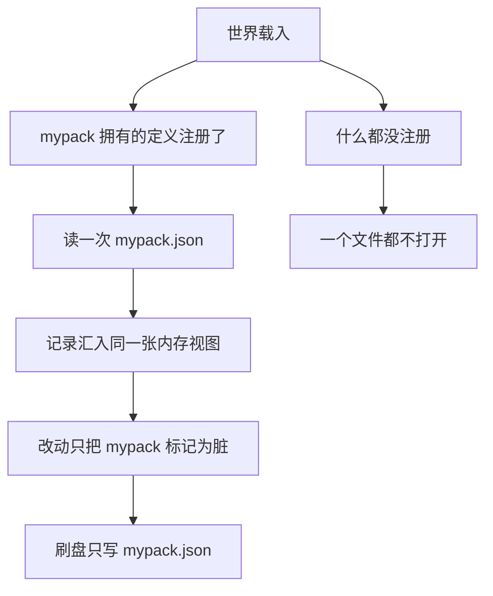

## 读完本页你可以做到

- 找到自己模组状态所在的那一个文件，并亲手读它
- 通过 `PalForge.pack("mypack").store` 保存和读取自己的值
- 让存不下的值在你写的那一行被拒绝，而不是十分钟后在某次写盘里悄悄消失
- 知道结构或模组消失时，那个结构的状态会怎么样
- 准确地告诉玩家：卸载你的模组会对他们的 Palworld 存档做什么

## 它住在哪里

PalForge 保存的一切都在 PalForge 自己的模组文件夹里：每个 Palworld 存档一个目录，每个模组 ID
一个文件。

```text
<UE4SS Mods>/PalForge/
└── state/
    ├── README.txt                                  第一次写盘时创建一次
    ├── entities_w_1DF0E44B….json                   老版本 PalForge 留下的，现在没人读它
    └── w_1DF0E44B4FDDD6196E30819A899C9009/         每个存档一个目录
        ├── _save.json                              这是哪个存档，里面有哪些模组
        ├── _unowned.json                           暂时归不到任何模组名下的记录
        ├── logi.json                               每个模组 ID 一个文件
        ├── logi.json.bak                           它上一份正常的副本
        ├── mypack.json
        └── _quarantine/
            └── 2026-08-02T14-03-11Z_logi.json      解析不了的文件，被原样搬到这里
```

目录名来自 `core/spatial`：它从活着的 `PalGameInstance` 上读当前选中的存档，先取存档**目录**名，
再取世界的显示名，清掉非法字符后加上 `w_` 前缀；两者都读不到时退回共享的 `world`。2026-08-02 在
真实存档里测到的答案是 `w_1DF0E44B4FDDD6196E30819A899C9009`。

这个退路不会被记住。如果读得太早 —— 启动过程中，或者还没选存档 —— 那一次会得到 `world`，下一次调用
会重新去问。之所以要写明，是因为相反的行为在 2026-08-02 被实测到过：一次过早的读取被缓存了下来，结果
在真实存档已经加载的情况下，整个会话都往共享桶里写。现在只有成功的答案才会被留下。

文件名就是你的模组 ID——你传给 `PalForge.pack("mypack")` 的那个字符串，也就是你定义的每个
`mypack:Thing` 里 `mypack` 那一半。不需要再声明第二个身份。它只能是字母、数字和下划线，因为它现在
同时也是文件名。

其中三个名字属于 PalForge 自己，所以 `api.pack` 会在你写下它的地方拒绝：

```text
PalForge: api.pack("_save"): "_save" is RESERVED — a pack id is also the file name its saved state lives under (state/<save>/_save.json), and PalForge already owns _save, _unowned and _quarantine in that directory. Pick another id
```

<Callout type="info">
这些东西没有一样在 Palworld 自己的 `.sav` 里。PalForge 只在自己的脚本旁边写 JSON，从不打开存档
文件——`Scripts/palforge` 里没有任何 `SaveGame`、`RequestSave` 或 `WriteSave` 调用。删掉
`<UE4SS Mods>/PalForge/`，世界照样能载入；丢的是模组保存的状态，不是存档。`state/README.txt` 就在
文件旁边写着同样的话，给那些先找到文件夹、后找到本页的玩家看。
</Callout>

在真的有东西要保存之前，什么都不会被创建。一个注册了建筑定义但什么都不保存的模组，既不会产生文件
也不会产生目录；只是取一下它的 store 句柄，同样不会打开任何东西。

## 你的模组自己的文件

一个 JSON 文档，键已排序，整体写入。下面是一份真实的文件——一个带 state 表的结构，两个保存的值，
按落盘的样子原样贴出：

```json
{"buildings":{"mypack_Smelter@-3432,2651,42":{"buildId":"mypack_Smelter","def":"mypack:Smelter","pos":[-343157,265120,4210],"state":{"oreBurned":10}}},"data":{"launches":1,"tutorialSeen":true},"orphans":{},"palforge":{"buildings":1,"forge":"0.3.0","format":3,"mod":"mypack","save":"w_1DF0E44B4FDDD6196E30819A899C9009","wrote":1785646408}}
```

| 区段 | 里面是什么 |
| --- | --- |
| `palforge` | 头部：`format`（3）、`mod`、`save`、`forge`（写它的 PalForge 版本）、`wrote` 和记录条数。模组声明了版本时还有 `packVer` |
| `buildings` | 你每个已放置结构一条记录：`buildId`、`def`、`pos`，以及你的 `state` |
| `orphans` | 被留置而不是删除的记录，每条都带 `orphanedAt` 和 `why` |
| `data` | 你用 `store.set` 放进去的东西——为空时整段省略 |
| `ledger` | 这个模组让**游戏**写进它自己存档里的、属于包的那些 ID |

记录的键是解析后的 build id 加一个量化格子，即 `<buildId>@<qx>,<qy>,<qz>`；那个网格在
[邻居与空间索引](/docs/concepts/spatial-index) 里。位置是整数厘米：读取已保存位置的唯一一处会把它
再喂回同一个量化器，而 double 打印出来的十四位数字，描述的是一个在两次扫描之间就会动得更多的结构。

文件里少了两个字段：所属模组就是文件名，逐条记录的版本号就是头部的 `format`。这个版本读不懂的
`format` 会被原样留下而不是猜着读，所以老版本 PalForge 不会把新文件截断。

## 长在包上的 store

`PalForge.pack("mypack").store` 就是你模组的那一份，而模组 ID 是焊死在句柄里的——没有任何办法通过
它去够到别人的 store。

```lua
local db = PalForge.pack("mypack", { version = "1.0.0" }).store

db.get(key)                --> value | nil      首次读取之后不再碰磁盘
db.set(key, value)         --> true | false, reason      就在这一行检查
db.delete(key)             --> boolean
db.keys()                  --> string[]         已排序
db.data()                  --> table            活表；改完它，再 save()
db.save()                  --> true | false, err        立刻写这个模组的文件

db.building(instOrKey)     --> table | nil      那个结构的 state 表
db.buildings()             --> { { key, buildId, def, pos, state, orphanedAt, why }, ... }

db.ledger()                --> { item = {...}, tech = {...}, passive = {...}, pal = {...} }
db.reclaim()               --> 一份点名说明「删掉这个模组之后收不回什么」的报告

db.saveId()                --> "w_1DF0E44B4FDDD6196E30819A899C9009"
db.path()                  --> 这个模组文件的绝对路径
db.stats()                 --> { path, bytes, buildings, orphans, data, ledger, dirty, health, ... }
db.diagnose()              --> 一段说明这个模组状态的英文
```

`db.data()` 交回的是活表，因为你自己的键值数据是你的。`db.buildings()` 交回的是**副本**，因为结构
记录同时也是建筑运行时的：改返回值什么都不会变，而正规的入口是 `db.building(inst)`，它返回的表和
活实例的 `self.state` 是同一张表。

<Callout>
`opts.version` 会作为 `packVer` 写进文件头，因此状态文件会记录下最后写它的是你 MOD 的哪个版本。
在你声明版本之前写出的文件就是没有 `packVer`。声明的值优先于文件里记住的值——声明描述的是接下来
要写的那个版本，而文件头描述的是上次写的那个版本。
</Callout>

### 一个完整的例子

```lua title="Scripts/content/smelter.lua"
local mine = PalForge.pack("mypack", { version = "1.0.0" })

mine.Building{
    id    = "mypack:Smelter",
    state = { oreBurned = 0 },
    events = {
        onLoad = function(self, ctx)
            print(("%s has burned %d ore"):format(self.key, self.state.oreBurned))
        end,
        onTick = function(self)
            self.state.oreBurned = self.state.oreBurned + 1
            self:setDirty()                    -- 攒着写；十秒内落盘
        end,
        onRightClick = function(self)
            local ok, err = self:save()        -- 现在就落盘，没落成也会告诉你
            if not ok then print("save failed: " .. err) end
        end,
    },
}

local db = mine.store
db.set("tutorialSeen", true)
db.data().launches = (db.data().launches or 0) + 1
db.save()
```

十次 tick 加一次启动之后，`state/w_1DF0E44B…/mypack.json` 就是上面那份 338 字节的文件。下一次进
游戏，`onLoad` 触发时 `self.state.oreBurned == 10`，而 `db.get("launches")` 回答 `1`。

### 每个结构自己的 state

结构的 `state` 表和模组的 `data` 表是两回事，只是存进同一个文件。`self.state` 属于某一个放置好的
结构，键由它站的位置决定；`db.data()` 属于模组，每个存档只有一份。

```lua
onRightClick = function(self, ctx)
    self.state.uses = (self.state.uses or 0) + 1   -- 只属于这个结构
    self:setDirty()                                 -- 便宜：只做标记，不写盘

    local db = PalForge.pack("mypack").store
    db.data().totalUses = (db.data().totalUses or 0) + 1   -- 整个模组，这个存档
    db.save()                                              -- 立刻写 mypack.json
end,
```

热循环里用 `setDirty()`，改动重要时用 `save()`。每个 tick 都 `save()` 等于每次心跳都写文件，而
`setDirty()` 只是往表里写一下。

## 什么该放进去

放你自己的代码产出、又算不回来的事实：这个结构跑了多少次、玩家选了什么、你的机器走到循环的哪一步、
你的模组发出去过什么。字符串、数字、布尔值，以及由它们组成的表。

### store 会当场拒绝什么

`db.set` 会把值走一遍，然后返回 `false` 和一句点名你的模组、你的键、以及键里那个字段的话。下面都是
真实的消息：

```text
mypack:store.set("slots"): field slots mixes array entries with named fields; the array entries come back as the string keys "1", "2", … and ipairs stops seeing them. Use one or the other.
mypack:store.set("onDone"): field onDone.onDone is a function. Only strings, numbers, booleans, nil and tables of those can be saved.
mypack:store.set("rate"): field rate.rate is not a finite number (nan).
mypack:store.set("k"): field k.a.b points back at the value itself. Saved state must be a tree.
```

同样被拒绝的还有：既不是字符串也不是整数的键、中间有洞的数组，以及三条上限——深度超过 16、字段数
超过 4096、编码后超过 64 KiB。这些东西如果不拦，就会被写成 `null`，或者在你根本看不到的那次写盘里
悄悄丢掉。写出去时同一套检查也会走一遍每个结构的 `state`，被拒绝的记录会**被点名**跳过，文件的其余
部分照常写完。

### 什么不该放进去

- **游戏已经拥有的东西。** 玩家的背包、帕鲁的等级、昵称、技能、归属。PalForge 看不到这些的变化，
  所以副本从玩家用箱子或帕鲁球的那一刻起就是旧的——一面无法作废的镜子比没有镜子更糟。需要答案时
  去问游戏。
- **以任何东西为键的帕鲁状态。** 目前没有按帕鲁保存的 store，而且是刻意没有：帕鲁会走，所以对建筑
  有效的位置这一手，对它恰好是错的；而 PalForge 能读到的其他帕鲁句柄，每次会话都会重新生成。用其中
  任何一个当键的 store，都会把一只帕鲁的数据挂到另一只身上。
- **载入时能重算出来的东西。** 缓存不是状态。
- **结构的旋转和缩放。** PalForge 没有读过它们，所以也保存不了。

## 什么时候会打开文件

读取由注册驱动，每个世界、每个模组只发生一次：

| 时机 | 打开的文件 |
| --- | --- |
| 游戏启动 | 无 |
| 世界载入，还没有任何定义注册时 | 无 |
| 第一次看到模组 **P** 拥有的定义 | `P.json` |
| 看到任何一个建筑定义 | 再加上 `_unowned.json` |
| 装了模组但它什么都不注册 | 无，直到它自己碰 store |
| **模组没有安装** | 永远是零 |



只要存在任何建筑定义，`_unowned.json` 就会被读。这个不对称来自测量而不是偏好：在还认不出模组之前
写下的记录不带归属，所以升级后的第一次载入，它们全都落在那里。之后它会自己排空——每条记录在扫描
第一次绑定它时被标上归属，下一次写盘就把它分到所属模组的文件里。

在这台机器上的测量（WSL2、`lua5.4`、本仓库自己的编解码器、重复 20 次、500 条带四个字段 state 的
记录分散在三个模组上）：

| | 字节 | 解码 | 编码 |
| --- | --- | --- | --- |
| 装着所有模组的一个共享文件 | 116,077 | 19.4 ms | 8.6 ms |
| 一个模组自己的文件 | 27,893 | 4.9 ms | 2.1 ms |
| 三个模组的文件合计 | 85,520 | 约 15 ms | — |

也就是说，装了一个模组的世界载入，共享文件要读 19.4 ms，现在是 4.9 ms；装三个约 15 ms；一个都没装
就什么都不读。这里的记录条数是压力值：Palworld 自己对每个世界有建筑上限，而本仓库迄今产生过的最大
记录集是 18 条。

### 写的那一侧

写是按模组来的，并且攒着写。一次改动只把那一个模组的文档标脏；一个泵每十秒写掉所有标脏的文档，而
`self:save()` 或 `db.save()` 会立刻写那一个。离开世界时会把还脏着的全部写完，然后丢掉缓存。

同一个切分也限住了一次写的波及面：一个结构改了一个数字，重写的只有它所属模组的文件，别人一个字节都
不动——按上表就是 2.1 ms、28 KB，而一个共享文件是 8.6 ms、116 KB。

每次写都是轮换而不是覆盖：新字节先写到 `<mod>.json.tmp`，当前文件变成 `<mod>.json.bak`，然后把临时
文件改名就位。读取按 `<mod>.json`、`.tmp`、`.bak` 的顺序找，所以任何一瞬间都至少存在一份完整副本。
`.bak` 永远不会被删。

## 出问题的时候

每一次拒绝都保住字节，并且说出来。这里没有任何一条规则会删掉文件。

| 发生了什么 | store 会怎么做 |
| --- | --- |
| 文件解析不了 | 下一次写盘时原样搬进 `_quarantine/<timestamp>_<mod>.json`，绝不覆盖；该模组从空开始，日志会说它的字节去了哪 |
| 头部写着这个版本不认识的 `format` | 本次会话既不读也不写它；那个模组这一次没有记录，而不是被截断的文件 |
| 头部写的存档和所在文件夹对不上 | 同样拒绝，并且把两个 ID 都点出来——被复制或改名的世界会被发现，而不是被悄悄收编。如果复制是故意的，`PalForge.core.state.rebind()` 会收编它 |
| 写失败（磁盘满、只读文件夹、文件被别人占着） | 该模组保持脏状态，下一次刷盘重试；记录还在内存里，日志会点名是哪个模组、原因是什么 |
| 某条记录的 `state` 编不出来 | 只跳过这一条并点名，文件其余部分照写 |

<Callout type="info">
**上面这张表是拿真实文件系统核对过的，不只是从 `os.rename` 推出来的。** 2026-08-02，
`pf_hook store-save-roundtrip` 通过公开接口把一个包的状态写进了一个真实存档的 store —— 磁盘上
370 字节，逐字段读了回来 —— 随后 `pf_hook store-crash-recovery` 种下一个写到一半的文件和一个读
不了的文件，确认**上表四行在 NTFS 上全部成立**，收尾时 `<mod>.json` 和 `<mod>.json.bak` 并排躺
着，没有留下任何 `.tmp`。

其中第一次运行抓出了 553 项无头检查抓不到的一个缺陷：`ensureDir` 拿 `io.open` 去问一个*目录*在不
在，而 Windows 即使对 `mkdir` 刚建好的目录也答「不在」，Linux 却答「在」 —— 于是套件一片绿，游戏里
却什么都没写出去。加载一个有七个结构、但没有注册任何定义的真实基地，代价是 **0 字节、0.00 ms**，
因为一个什么都没声明的模组根本不会被读。还欠着的那一半是第二趟：把*上一次会话*写下的东西读回来，
那需要再来一次世界加载。
</Callout>

觉得哪里不对时该叫的是 `db.diagnose()`。它用一段话回答：

```text
Pack 'logi', save w_1DF0E44B4FDDD6196E30819A899C9009: 18 structures and 0 saved values, in state/w_1DF0E44B4FDDD6196E30819A899C9009/logi.json (2.4 KB). Last written just now. 1 record is quarantined: logi_PipeSatellite@-7086,5450,142 has been kept since 2026-07-14 because no loaded definition claims the build id "logi_PipeSatellite"; it will come back by itself if that structure or that definition returns. 1 id is recorded in the ledger — those are names this pack asked the GAME to write into its own save. Nothing has failed. The Palworld save itself is untouched — PalForge has never written to it.
```

`PalForge.core.state.audit()` 会对这个存档知道的每个模组给出同样的数字，并且会把「有文件但没被读过」
的模组也列出来——列的时候仍然不读它。

## 结构不见了的时候

记录不会因为「某个东西不在」而被删掉。两种不在都只是带着理由把它挪进 `orphans`，而且两种都会自己
反转回来：

- `why = "unclaimed"` —— 本次会话没有任何已注册定义认领那个 build id。玩家只是把模组关了一晚上，
  不该因此丢掉结构的状态，所以记录会等着。
- `why = "missing"` —— 世界扫描连续六次没有报告那个 Actor，大约三秒。那次扫描只枚举内存里的对象，
  而从出货二进制里能读到的一切都指向 Palworld 按距离生成和销毁地图对象。所以「这一遍扫描里没有」
  和「已经没了」不是同一句话。走回那个结构旁边，下一次扫描就会把记录连同 `state` 表一起从隔离里
  取回来。

`onRemove` 依然会以 `reason = "missing"` 触发，所以你的代码一行都不用改。

真正会销毁记录的只有隔离上限，而且是**按模组文件**算的 4096 条；超过之后从该模组最旧的隔离记录开始
丢，日志会说丢了多少条、属于哪个模组。一个模组撑到上限，也吃不掉另一个模组的份额。

## 从老版本 PalForge 迁移过来

老版本 PalForge 把所有模组的记录写进每个存档一个的文件 `state/entities_<saveId>.json`。那个文件不会
再被写入，不会被改名，也不会被删除——所以退回老版本 PalForge 就等于什么都不做。

把那些记录搬进新布局是**自动**发生的，每个世界一次，你不需要调用任何东西。PalForge 在世界 ready
的那一刻运行它——更准确地说，是在第一次扫描绑定到某个角色之前的最后一刻。这个顺序就是它正确性的
全部：迁移只补上缺失的东西，绝不替换已经存在的东西。如果扫描先跑了，每个立着的结构都会被绑定到一条
崭新的空记录上，而所有保存下来的 `state` 都会因为那份空白而被跳过。

同一个调用是公开的，你想自己跑一次、或者想看看它做了什么的时候可以用：

```lua
local report = PalForge.core.state.migrate()
--> { records = 7, added = 7, unowned = 7, packs = { _unowned = 7 }, from = "entities_w_1DF0….json" }
```

它读旧文件，按「记录里写的归属 → 定义 → 唯一认领该 build id 的已注册定义」的顺序判定每条记录的
主人，然后写出拆分后的文件。判不出来的记录原封不动进 `_unowned.json`，等以后扫描绑定到它时再被
认领。第二次调用什么都不做：`_save.json` 记着它读过的那个文件的指纹；如果玩家后来把备份覆盖回去，
只有**缺失**的那些记录会被补上。

由于这次判定发生时，你的定义未必已经注册完毕，迁移过来的玩家的记录通常会先落在 `_unowned.json`
里，然后在接下来的一两次游戏里，随着每个结构被绑定，逐步流入所属模组自己的文件。这中间不会丢任何
东西：从 `_unowned` 读出来的记录，和从你自己的文件读出来的完全一样。旧的字节还在原处，仍然能读，
也依旧不会被写入。

## 卸载一个模组

这就是这套布局存在的理由，而答案分成两半。第一半很直接：

- PalForge 保存的一切都在 `<UE4SS Mods>/PalForge/` 下面。删掉那个文件夹，Palworld 自己的存档毫发无损，
  照样能载入。
- 卸一个模组就是一个文件。`PalForge.core.state.uninstall("mypack")` 删掉
  `state/<save>/mypack.json`，玩家自己按名字删也一样。一个只是没装的模组，读取开销为零，也不会被
  别的模组撑大之后挤掉。

第二半才是真实存在的那一半。有三个调用会让**游戏**写点什么，而游戏写下的东西就在玩家的存档里：

| 调用 | 落进 Palworld 存档的东西 |
| --- | --- |
| `Item.get("mypack:Potion"):give(1)` | 某个背包容器里的行名 `mypack_Potion` |
| `Building.get("mypack:Bench"):unlock()` | 玩家已解锁科技列表里的那个名字 |
| `Skill.get("mypack:Legend"):teach(pal)` | 某个角色被动技能列表里的那个名字 |

这些行之所以存在，全靠你的包用 PalSchema JSON 注入。把包移走，存档里就留着一个背后没有行的名字。
PalForge 会把这类调用记进你文件的 `ledger` 区段——只记带命名空间的 ID，只记调用成功的那些——所以这份
清单可以逐个 ID 列出来：

```lua
local rep = PalForge.pack("mypack").store.reclaim()
print(rep.text)
--> 'mypack' made the game record 2 thing(s) in save w_1DF0E44B…: item mypack_Potion x5
--> (reclaimable), tech mypack_Smelter x1 (CANNOT be undone). A technology unlock can NEVER be
--> undone — the cheat manager declares four unlocks and no lock — so an uninstall leaves those
--> names in the save with no DataTable row behind them.
```

道具可以从本地玩家自己的背包里拿回来，进了箱子的就够不着。被动技能可以从你能握在手里的角色身上摘
掉。科技解锁则完全无法逆转：`UPalCheatManager` 声明了四个解锁入口，一个上锁入口都没有，头文件转储里
也找不到任何 lock、remove、reset 或 forget 之类的东西。`Item.get("Wood"):give(1)` 什么都不记：游戏
自己的行不可能不存在。

<Callout type="warn">
Palworld 的存档遇到一个「行已经没了」的名字时会怎样，还没有人亲眼看过。从二进制里能读到的一切都说明
那是一次**查不到的查找**，而不是一个坏掉的文件——存档保存的是普通的 `FName`，行的解析走的是被设计成
可以失败的访问器，而存档错误枚举里根本没有「未知内容」这一项。但载入路径是没有反射信息的 C++，所以
这只是有依据，不是被证明。能了结它的只有 `test/hooks/save-survives-pack-removal` 这次测量。对玩家就
按这些字说，不要许诺任何一种结果。
</Callout>

## 小结

- 每个 Palworld 存档一个目录，每个模组 ID 一个 JSON 文件，都在 `<UE4SS Mods>/PalForge/state/` 下面。
- 模组 ID 就是你已经在传给 `PalForge.pack` 的那个。`_save`、`_unowned`、`_quarantine` 会被拒绝，因为那是 PalForge 自己占着的文件名。
- `PalForge.pack("mypack").store` 是你的那一份，也够不到别人的。`db.set` 会在你的那一行、点着字段名拒绝一个存不下的值。
- 文件是在该模组的定义第一次注册时才被读的。没装的模组永远是零开销，什么都不保存的模组不会产生文件。
- 写是按模组来的，每十秒攒着写一次，并且经由 `.tmp` 和 `.bak` 轮换，所以完整副本始终存在。
- 没有任何东西会因为「不在」而被删：认领不到的记录和看不见的记录都会带着理由被隔离，并且自己回来。唯一的破坏性规则是每个模组 4096 条的上限。
- 从旧的单文件迁移过来是自动发生的：在第一次世界 ready 时、任何东西被绑定之前就已经跑完；`PalForge.core.state.migrate()` 是同一个过程的公开入口。无论哪种情况，旧文件一个字节都不会被动。
- 这些东西都不在 Palworld 的存档里。在存档里的是你的模组让游戏写下的东西，而 `ledger` 会点出那些 ID，所以卸载的后果可以被说明，而不是靠猜。

<Cards>
  <Card title="Building" href="/docs/api/building">实例带有每个结构自己状态的那个域</Card>
  <Card title="身份与归属" href="/docs/concepts/identity-and-ownership">模组 ID 从哪来，它还决定了什么</Card>
  <Card title="邻居与空间索引" href="/docs/concepts/spatial-index">记录键量化所用的网格</Card>
</Cards>
