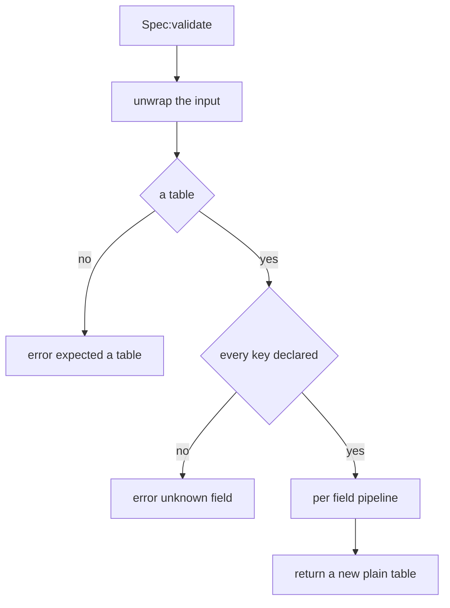
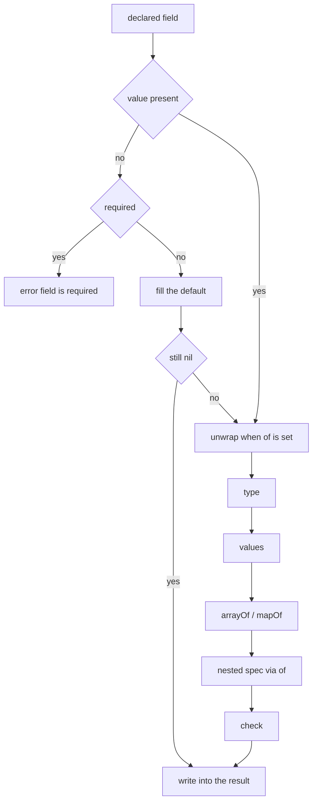
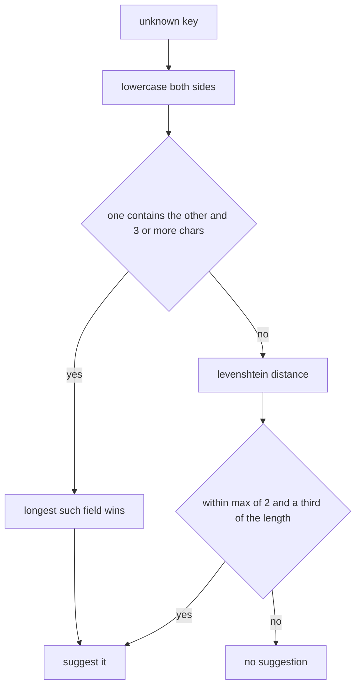

PalForge のすべての `X{ ... }` 呼び出しは、何かが登録される前に宣言済みの形へ照合されます。
その仕組みは `Scripts/palforge/core/schema.lua` の一枚だけです。このファイル自身は型定義を
一切持たず、各 api モジュールが自分の形を宣言し、この仕組みがその宣言を「検証し、デフォルトを
埋め、自分自身を説明する」ものに変えます。

検証は厳格です。問題があれば必ずハードエラーになり、`error(msg, 0)` で送出されるためファイル名と
行番号の接頭辞は付きません。メッセージはドメイン名・フィールド名・理由を名指しし、UE4SS のログに
そのままの文面で出ます。define 呼び出しが中途半端に成功することはありません。

## 形を宣言する

`schema.define(name, fields, opts)` がスペックを組み立てます。`fields` はマップではなく
ディスクリプタの**配列**です。宣言順がそのまま保存され、その順序が `:help()` と生成される
エディタ用型定義を駆動します。

以下は `Scripts/palforge/api/mesh.lua` にある実際の宣言で、`type` / `values` / `default` /
`required` / `check` / `doc` が一箇所に出てくる形です。

```lua title="Scripts/palforge/api/mesh.lua"
local schema = require("palforge.core.schema")

local Spec = schema.define("Mesh.Spec", {
    { "id",        type = "string", check = schema.nonEmpty,
                   doc = "mesh id, e.g. \"pack:name\" (required when defined directly; omit when inline)" },
    { "kind",      type = "string", values = { "procedural", "static", "skeletal", "obj" },
                   default = "skeletal", doc = "which core.mesh backend renders it" },
    { "model",     type = "string", required = true, doc = "USkeletalMesh / UStaticMesh asset path" },
    { "animClass", type = "string", doc = "ABP_*_C animation blueprint path (skeletal only)" },
    { "scale",     type = "number", doc = "uniform scale applied to the attached mesh" },
    { "offset",    type = "table",  doc = "{ x, y, z } offset from the pawn's origin" },
    { "texture",   type = "string", doc = "absolute path to a png applied to the mesh" },
    { "color",     type = "table",  doc = "tint { r, g, b, a } in 0..1" },
    { "material",  type = "string", doc = "base material asset path to instance from" },
    { "params",    type = "table",  doc = "extra material parameters passed through" },
}, { handle = "Mesh.Handle" })
```

フィールド名はディスクリプタの**第 1 位置要素**です。それ以外はすべて同じテーブル上の名前付き
キーになります。

`schema.define` が返すスペックオブジェクトの表面は次のとおりです。

```lua
Spec:validate(t, context)   -- a validated COPY with defaults filled; raises on any problem
Spec:help()                 -- the printable field list, one line per field
Spec:field("model")         -- one field descriptor by name, or nil
Spec.fields                 -- the ordered array of descriptors
Spec.name                   -- "Mesh.Spec"
Spec.handle                 -- "Mesh.Handle", or nil
```

api モジュールは define 関数の最初の文で `:validate` を呼び、返ってきたコピーから定義クラスを
組み立てます。

```lua title="Scripts/palforge/api/pal.lua"
local function define(spec)
    spec = Spec:validate(spec, "Pal")
    -- spec is now a fresh plain table: unknown keys are impossible, defaults are filled
    ...
end
```

第 2 引数は、すべてのエラーメッセージの先頭に付く context 文字列です。`"Pal"` を渡しているから
こそ `PalForge: Pal.Spec: ...` ではなく `PalForge: Pal: ...` と読めます。省略した場合はスペック
自身の名前が使われます。

<Callout type="info">
名前はレジストリ全体で一意です。`"Pal.Spec"` を二度宣言すると
`PalForge: schema.define: "Pal.Spec" is already declared` が送出されるため、2 つのモジュールが
同じ形の名前を主張することはできません。
</Callout>

## フィールドディスクリプタのキー

ディスクリプタに現れうるのは 11 個です。位置指定の名前と、以下の 10 キー。これ以外はありません。

<TypeTable
  type={{
    type: {
      description: 'string / number / boolean / table / function、あるいは table|function のようにパイプで書いたユニオン。省略すると何でも受け付ける。',
      type: 'string',
    },
    required: {
      description: 'フィールドが無いときに送出する。default より先に判定される。',
      type: 'boolean',
      default: 'false',
    },
    default: {
      description: 'フィールドが無いときに使う値。関数を渡すと呼び出されて新しい値を作る。',
      type: 'any',
    },
    values: {
      description: '値はこのいずれかと == で等しくなければならない。',
      type: 'any[]',
    },
    of: {
      description: 'ネストしたスペックで値を検証する。検証結果が入力を置き換える。',
      type: 'Spec',
    },
    arrayOf: {
      description: '配列部の全要素がこの型表記を満たさなければならない。',
      type: 'string',
    },
    mapOf: {
      description: 'テーブル内の全ての値がこの型表記を満たさなければならない。',
      type: 'string',
    },
    doc: {
      description: '1 行の説明。:help() と生成される型定義に流れる。',
      type: 'string',
    },
    sig: {
      description: '関数フィールドの LuaLS シグネチャ。検証は完全に無視する。',
      type: 'string',
    },
    check: {
      description: '追加の述語。false と理由文字列を返すと拒否する。最後に走る。',
      type: 'fun(v): boolean, string?',
    },
  }}
/>

### type

表記はただの文字列です。ユニオンはパイプで書き、いずれか 1 つに一致すれば満たされます。

```lua
{ "maxStack", type = "number" }                    -- Item.Spec
{ "state",    type = "table|function" }            -- Building.Spec
{ "icon" }                                         -- no type: anything is accepted
```

`"function"` が期待される場所では、**呼び出し可能なテーブルが関数の代わりになります**。
`__call` メタメソッドを持つテーブルはイベントハンドラとして通ります。

```lua
local counter = setmetatable({ n = 0 }, {
    __call = function(self, pal, ctx) self.n = self.n + 1 end,
})

Pal{ id = "example:Boss", events = { onSpawned = counter } }   -- accepted
```

### required

判定は値が `nil` のときだけ、しかも `default` を参照する前に行われます。したがって実質的に、
required と default が同時に効くフィールドは存在しません。

```lua
{ "model", type = "string", required = true, doc = "USkeletalMesh / UStaticMesh asset path" }
```

`id` はすべてのドメインスペックで `required = true` です。`Mesh.Spec` だけが例外で、他の定義の
中にインラインで書かれたメッシュには名付けるものが無いためです。直接定義されたメッシュについては
`api/mesh` が検証後に手作業で再チェックするので、結局 id が必要になります。

### default

デフォルトは欠けているフィールドを埋め、埋まった値は自分で書いた値とまったく同じ type / `values`
/ `arrayOf`・`mapOf` / `of` / `check` の各段を通ります。

```lua
{ "kind",         type = "string", default = "skeletal" }   -- Mesh.Spec
{ "tickInterval", type = "number", default = 1 }            -- Building.Spec
{ "stackable",    type = "boolean", default = false }       -- Effect.Spec
```

関数のデフォルトは**呼び出されて**新しい値を作ります。可変なデフォルトを定義間で共有しないための
書き方です。

```lua
{ "tags", type = "table", default = function() return {} end }
```

現時点でツリー内に関数デフォルトを使うスペックはありません。`Spec:help()` もそれを飛ばし、
関数以外の値のときだけ `default=` を印字します。

### values

`==` で各要素と順に比較されます。

```lua
{ "kind",     type = "string", values = { "procedural", "static", "skeletal", "obj" } }  -- Mesh.Spec
{ "category", type = "string",
              values = { "material", "consumable", "equipment", "ammo", "ingredient", "other" } }  -- Item.Spec
{ "kind",     type = "string", values = { "active", "passive" } }                        -- Skill.Spec
{ "kind",     type = "string", values = { "se", "bgm" } }                                -- Audio.Spec
```

### of

値は別のスペックで検証され、**検証済みのコピーが出力側でそれを置き換えます**。エラーの context は
内側の形の名前まで伸びるので、ネストしたテーブル内のフィールドについての苦情でも、どの形を読みに
行けばよいかが分かります。

```lua
{ "mesh",   type = "table", of = Mesh,   doc = "the mesh attached to a spawned pawn" }
{ "events", type = "table", of = Events, doc = "lifecycle handlers (grouped)" }
{ "recipe", type = "table", of = Recipe, doc = "the recipe that produces THIS item" }
```

### arrayOf

**配列部**の全要素が `ipairs` で型検査され、添字が報告されるフィールド名の一部になります。

```lua
{ "skills",   type = "table", arrayOf = "string" }   -- Pal.Spec
{ "buildIds", type = "table", arrayOf = "string" }   -- Building.Spec
```

```lua
Pal{ id = "example:Boss", skills = { "example:Fire", "example:Gust" } }   -- fine
```

`ipairs` で走査するため、`arrayOf` のテーブル内に置かれた文字列キーは訪問されません。連続した
配列部だけが検査されます。

### mapOf

テーブル内の全ての値が `pairs` で型検査され、キーが報告されるフィールド名の一部になります。配列部も
訪問されるので、`materials = { "Wood" }` は `materials.1` として報告されます。

```lua
{ "materials", type = "table", mapOf = "number", required = true,
               doc = "{ <itemId> = <count> } consumed by one craft" }   -- Item.Spec.Recipe
```

```lua
Item{
    id     = "example:Torch",
    recipe = { materials = { Wood = 3, Stone = 1 }, count = 2, station = "Workbench" },
}
```

### doc

1 行の説明で、`Spec:help()` に表示され、生成される `---@field` 注釈の末尾コメントとして出力され
ます。検証がこれを読むのは 1 箇所だけで、「is required」エラーが括弧内に引用します。`check` の
失敗が引用するのは check 自身が返した理由であって、`doc` ではありません。

### sig

関数フィールドの LuaLS シグネチャです。**検証はこれを完全に無視します**。読むのは
`tools/gen-types.lua` だけで、`types.lua` により良い型を書き込むためだけに使われます。

```lua
{ "onSpawned", type = "function", sig = "fun(self: Pal.Handle, ctx: table)",
               doc = "LIVE (candidate hook) - finished spawning into the world" }
```

### check

ネストした `of` の検証も含め、**すべての後に**走る述語です。受理するなら `true`、拒否するなら
`false` と理由文字列を返し、その理由がエラー文にそのまま引用されます。

ツリー内で共有されている唯一の check が `schema.nonEmpty` で、全ドメインの `id` フィールドが
使っています。

```lua title="Scripts/palforge/core/schema.lua"
function M.nonEmpty(v)
    if type(v) == "string" and #v > 0 then return true end
    return false, "must be a non-empty string"
end
```

自作の check も同じ契約に従います。

```lua
{ "packId", type = "string", check = function(v)
      if v:find(":", 1, true) then return true end
      return false, "must be namespaced as pack:name"
  end },
```

## スペックのオプション

`schema.define` の第 3 引数が受け取るキーは、現時点で 1 つだけです。

<TypeTable
  type={{
    handle: {
      description: '__spec メタフィールドを通じてこの形を同じく満たすハンドル型。型定義専用で、検証は既にハンドルを受け付けており、これはそれをエディタに伝えるためのもの。',
      type: 'string',
    },
  }}
/>

```lua
}, { handle = "Mesh.Handle" })
```

スペック側で一度宣言しておけば、`of` でそのスペックを指すすべてのフィールドが、書き直すことなく
生成型でユニオンを得ます。`Pal.Spec.mesh` は `Mesh.Spec|Mesh.Handle` になります。派生スペックは
ベースの `handle` を引き継ぐため、`Building.Spec.Mesh` も `Mesh.Handle` を報告します。

## 検証の流れ

`Spec:validate(t, context)` は `t` を決して変更しません。返すのは**新しいプレーンなテーブル**で、
下流からは構築された値と手書きの値を区別できません。



入力が `nil` の場合は空テーブルとして扱われるので、必須フィールドは依然として失敗します。どの
フィールドを調べるより先に全キーが拒否されるため、定義の他の部分も壊れているときでもタイプミスが
報告されます。文字列でないキーは、宣言済みの名前と照合するより前に、その場で拒否されます。

宣言された各フィールドは、次の順序でまったく同じパイプラインを通ります。



覚えておく価値のある帰結が 2 つあります。

- `of` のための unwrap は type 検査**より前**に走ります。したがって table が宣言された場所に
  ハンドルを渡した場合、`type` が検査される時点で既にプレーンなテーブルになっています。
- `check` はネストの**後**の値を見ます。`of` を持つフィールドの check が受け取るのは生の入力では
  なく検証済みのコピーです。

コピーは 1 段だけです。ネストした `of` の形は新しいテーブルへ再検証されますが、`data` や `color`
や `offset` のような素の `table` フィールドは参照のまま持ち越されます。あなたが書いたテーブルが、
そのまま定義の保持するテーブルです。

```lua
local payload = { charges = 3 }
local pal = Pal{ id = "example:Boss", data = payload }
payload.charges = 5   -- the definition sees 5: `data` is not deep-copied
```

## 失敗モード

以下のメッセージはすべて、現在のソースが実際に送出する文面そのものです。

### テーブルでない

```lua
Pal("example:Boss")
```

```text
PalForge: Pal: expected a table, got string. Fields: id, name, description, skills, mesh, material, color, texture, icon, events, data
```

### 文字列でないキー

```lua
Pal{ id = "example:Boss", [1] = "x" }
```

```text
PalForge: Pal: keys must be strings, got a number key
```

### 未知のフィールド、もしかして提案付き

```lua
Pal{ id = "example:Boss", meshSpec = { model = "/Game/X" } }
```

```text
PalForge: Pal: unknown field "meshSpec" (did you mean "mesh"?). Valid fields: id, name, description, skills, mesh, material, color, texture, icon, events, data
```

```lua
Building{ id = "example:Bench", tickInverval = 4 }
```

```text
PalForge: Building: unknown field "tickInverval" (did you mean "tickInterval"?). Valid fields: id, name, description, gridCm, buildIds, tickInterval, mesh, material, color, texture, icon, state, events, data
```

### 未知のフィールド、十分に近い候補が無い

```lua
Pal{ id = "example:Boss", zzzzzzzzzz = 1 }
```

```text
PalForge: Pal: unknown field "zzzzzzzzzz". Valid fields: id, name, description, skills, mesh, material, color, texture, icon, events, data
```

### 必須フィールドの欠落

```lua
Pal{ name = "Boss" }
```

```text
PalForge: Pal: field "id" is required (pal id: a game CharacterID ("ChickenPal") or "pack:name")
```

括弧内はそのフィールドの `doc` です。`doc` が無ければ `type`、それも無ければ `any` が使われます。

### 型が違う

```lua
Pal{ id = "example:Boss", name = 42 }
```

```text
PalForge: Pal: field "name" expects string, got number
```

ユニオンはそのままの表記で報告されます。

```lua
Building{ id = "example:Bench", state = "uses" }
```

```text
PalForge: Building: field "state" expects table|function, got string
```

### `values` の外の値

```lua
Mesh{ id = "example:body", model = "/Game/X", kind = "rigid" }
```

```text
PalForge: Mesh: field "kind" must be one of { "procedural", "static", "skeletal", "obj" }, got "rigid"
```

```lua
Skill{ id = "example:Fire", kind = "ultimate" }
```

```text
PalForge: Skill: field "kind" must be one of { "active", "passive" }, got "ultimate"
```

### `arrayOf` の要素が不正

添字はフィールド名に畳み込まれるので、経路全体が 1 組の引用符の内側に収まります。

```lua
Pal{ id = "example:Boss", skills = { "example:Fire", 3 } }
```

```text
PalForge: Pal: field "skills[2]" expects string, got number
```

### `mapOf` の値が不正

```lua
Item{ id = "example:Torch", recipe = { materials = { Wood = "three" } } }
```

```text
PalForge: Item: field "recipe" (Item.Spec.Recipe): field "materials.Wood" expects number, got string
```

`mapOf` のテーブルに入った配列要素は数値キーで報告されます。

```lua
Item{ id = "example:Torch", recipe = { materials = { "Wood" } } }
```

```text
PalForge: Item: field "recipe" (Item.Spec.Recipe): field "materials.1" expects number, got string
```

### `check` の失敗

```lua
Pal{ id = "" }
```

```text
PalForge: Pal: field "id" is invalid: must be a non-empty string
```

コロンの後ろは check の第 2 戻り値です。check が `false` だけを返した場合、メッセージは
`failed check` で終わります。

### ネストしたスペックのエラーは内側の形を名指しする

context は積み上がります。外側のドメイン、外側のフィールド、内側のスペック名、そして内側の苦情の順です。

```lua
Pal{ id = "example:Boss", mesh = { kind = "skeletal" } }
```

```text
PalForge: Pal: field "mesh" (Mesh.Spec): field "model" is required (USkeletalMesh / UStaticMesh asset path)
```

```lua
Building{ id = "example:Bench", mesh = { model = "/Game/X", colour = { 1, 0, 0, 1 } } }
```

```text
PalForge: Building: field "mesh" (Building.Spec.Mesh): unknown field "colour" (did you mean "color"?). Valid fields: id, kind, model, animClass, scale, offset, texture, color, material, params
```

`events` グループも他と同じネストしたスペックなので、扱いは同じです。ハンドラ名の綴り間違いは
エラーであり、黙って無視されることはありません。

```lua
Pal{ id = "example:Boss", events = { onSpawn = function(pal, ctx) end } }
```

```text
PalForge: Pal: field "events" (Pal.Spec.Events): unknown field "onSpawn" (did you mean "onSpawned"?). Valid fields: onSpawned, onDamaged, onDeath, onCaptured, onTick
```

```lua
Building{ id = "example:Bench", events = { onPlace = "hello" } }
```

```text
PalForge: Building: field "events" (Building.Spec.Events): field "onPlace" expects function, got string
```

## もしかして提案の仕組み

黙って無視されるタイプミスこそ、この層が防ぐために存在する失敗です。そのため未知のフィールドは
必ず、あなたが意図したフィールドを名指ししようとします。



**包含が編集距離に勝ちます**。この順序こそが要点です。最もよくある間違いは装飾された名前、つまり
`mesh` に対する `meshSpec`、`icon` に対する `iconPath` で、人間には自明に読めるのに実際の
フィールドからは編集距離が数手離れています。包含は双方向に判定されるので、接頭辞も接尾辞も複数形も
一致します。参加するのは 3 文字以上の宣言済み名だけで、`id` のような 2 文字のフィールドが包含に
よって宣言の半分を飲み込むことはありません。

どちらも他方を含まないときは Levenshtein 距離が決めます。しかも本当に近いものしか受理せず、
しきい値は `max(2, floor(#name / 3))` です。

どちらの段も小文字化して比較するため、大文字小文字の取り違えも拾えます。

| 書いたもの | 提案 | 理由 |
| --- | --- | --- |
| `meshSpec` | `mesh` | `mesh` を含む |
| `iconPath` | `icon` | `icon` を含む |
| `displayName` | `name` | `name` を含む |
| `textures` | `texture` | `texture` を含む |
| `durationSeconds` | `duration` | `duration` を含む |
| `Description` | `description` | 小文字化すれば `description` を含む |
| `nam` | `name` | `name` が `nam` を含む（包含は双方向） |
| `tickInverval` | `tickInterval` | 距離 1 |
| `sound` | `soundPath` | `sound` を含む |
| `zzzzzzzzzz` | なし | 距離のしきい値内に何も無い |

<Callout type="warn">
非常に短い未知のキーではしきい値が一律 2 になるため、提案が洞察ではなく偶然になることがあります。
`Pal{ xy = 1 }` は `"id"` を提案します。2 文字や 3 文字のキーに対する提案は、答えではなくヒントと
して扱ってください。
</Callout>

## 定義をネストする

ネストした形は、インラインで書くことも、define 呼び出しが返したオブジェクトをそのまま渡すことも
できます。

```lua
-- inline
Pal{ id = "example:Boss", mesh = { model = "/Game/Pal/Model/Character/Monster/ChickenPal/SK_ChickenPal" } }

-- as a named definition
local body = Mesh{
    id      = "example:body",
    model   = "/Game/Pal/Model/Character/Monster/ChickenPal/SK_ChickenPal",
    texture = "C:/mods/example/body.png",
}

Pal{ id = "example:Boss", mesh = body }
Pal{ id = "example:Add",  mesh = Mesh.get("example:body") }
```

どちらも同じようにネストしたスペックへ届きます。理由はメタフィールド 1 つです。メタテーブルが
`__spec` を持つハンドルは、検証の前にそれが表すテーブルへ置き換えられます。

```lua title="Scripts/palforge/core/schema.lua"
local function unwrap(v)
    if type(v) ~= "table" then return v end
    local mt = getmetatable(v)
    local tospec = mt and rawget(mt, "__spec")
    if type(tospec) == "function" then return tospec(v) end
    return v
end
```

```lua title="Scripts/palforge/api/mesh.lua"
Handle.__spec = function(self) return self._cls:source() end
```

スキーマはハンドルについて何も知らず、知っているのは `__spec` だけです。unwrap は 2 箇所で走ります。
`validate` の冒頭で入力全体に対して、そして `of` が設定されたフィールドごとに。したがって
`mesh = someHandle` と同様に `Spec:validate(someHandle)` も動きます。

ネストした値はその後で再検証されるため、結果は**コピー**です。呼び出し側が、メッシュを身に着けた
パル経由でメッシュ定義に手を伸ばすことはできません。

```lua
local body = Mesh{ id = "example:body", model = "/Game/X/SK_X" }
local pal  = Pal{ id = "example:Boss", mesh = body }

pal:mesh().scale = 4     -- mutates the pal's copy, not the "example:body" definition
```

<Callout type="warn">
現時点で `__spec` を持つハンドルはツリー中 `Mesh.Handle` だけです。pal / item / building /
skill / effect / audio / UI のハンドルは持たないため、それらを別の定義に渡すと素のテーブルとして
検証され、未知のキーで失敗します。
</Callout>

<Callout type="warn">
デフォルトが埋めるのは**欠けている**フィールドだけです。`Mesh{ ... }` は既に
`kind = "skeletal"` を埋めているので、そのハンドルを building にネストしても
`Building.Spec.Mesh` の `kind` デフォルトが `"static"` であるにもかかわらず `skeletal` のまま
です。building 側のポリシーが欲しいときは、メッシュに `kind = "static"` を書くか、building の
mesh をインラインで宣言してください。
</Callout>

## 形を派生させる

`schema.derive(name, base, overrides)` は、別のスペックのコピーとしてフィールド単位のポリシーだけ
差し替えた新しいスペックを宣言します。各ディスクリプタが丸ごとコピーされ、その上に対応する
override テーブルがマージされます。

ツリー内で唯一の利用箇所が building のメッシュです。

```lua title="Scripts/palforge/api/building.lua"
local Mesh = schema.derive("Building.Spec.Mesh", schema.get("Mesh.Spec"), {
    kind   = { default = "static" },
    model  = { doc = "UStaticMesh asset path, or an OBJ path for the procedural backend" },
    offset = { doc = "{ x, y, z } offset from the actor's origin" },
})
```

パルが skeletal メッシュであるのに対して建造物は static メッシュです。それは形そのものではなく
消費側のポリシーなので、変わるのはそこだけです。10 個のフィールド、その型、`model` が required で
あること、`Mesh.Handle` オプションはすべてそのまま引き継がれ、後から `Mesh.Spec` にフィールドを
足せば、誰かがコピーを思い出さなくても building に届きます。

違いは 2 つの help 出力に現れます。

```text
Mesh.Spec {
  kind          string     (default=skeletal, one of { "procedural", "static", "skeletal", "obj" }) which core.mesh backend renders it
  model         string     (required) USkeletalMesh / UStaticMesh asset path
  ...
}

Building.Spec.Mesh {
  kind          string     (default=static, one of { "procedural", "static", "skeletal", "obj" }) which core.mesh backend renders it
  model         string     (required) UStaticMesh asset path, or an OBJ path for the procedural backend
  ...
}
```

上書きできるのは `default` だけではありません。マージは override テーブルが持つキーを何でもコピー
します。ベースが宣言していないフィールドを指す override はその場で捕まります。

```lua
schema.derive("Test.Spec", schema.get("Mesh.Spec"), { kindd = { default = "x" } })
```

```text
schema.derive(Test.Spec): "kindd" is not a field of Mesh.Spec
```

<Callout type="info">
`derive` は `define` を経由するので、新しい名前は未使用でなければなりません。同じ名前を二度取ると
`PalForge: schema.define: "Test.Spec" is already declared` が、検証の失敗と同じ
`error(msg, 0)` で送出され、ファイル名も行番号も付きません。残る 2 つの検査はプログラマのエラーで、
代わりに `assert` を使います。ベースは `schema.define` で作られたスペックであること、override は
ベースが宣言しているフィールドを指すこと、の 2 つです。この 2 つには `core/schema.lua` 自身の
ファイル名と行番号が前置されるので、上のテキストはメッセージの末尾部分であって 1 行全体ではありません。
</Callout>

## スキーマレジストリ

すべてのスペックは宣言された時点で記録されます。これがあるからこそ api モジュールは自分の形を
プライベートに保てます。ツーリングが見つけるためにモジュールテーブルへぶら下げる必要はありません。

```lua
local schema = require("palforge.core.schema")

schema.get("Pal.Spec")          -- the spec object, or nil
schema.get("Pal.Spec").fields   -- the ordered descriptors, for tooling
schema.help("Pal.Spec")         -- the printable field list
schema.all()                    -- every declared spec, in declaration order
```

`schema.help(name)` は宣言済みの名前について `Spec:help()` を返します。「ここに何を渡せるのか」への
実行時の答えです。

```lua
print(schema.help("Pal.Spec"))
```

```text
Pal.Spec {
  id            string     (required) pal id: a game CharacterID ("ChickenPal") or "pack:name"
  name          string     shown in UI (defaults to id)
  description   string     one-line description, for UI and tooling
  skills        table      (string[]) skill ids this pal owns (see Skill)
  mesh          table      (Mesh.Spec) the mesh attached to a spawned pawn (inline, or a Mesh{ ... } handle)
  material      table      (Pal.Spec.Material) material override applied to that mesh
  color         table      base tint { r, g, b, a } (shorthand for material.color)
  texture       string     png path applied to the mesh (shorthand for material.texture)
  icon          any        fallback icon used when the DataTable lookup misses
  events        table      (Pal.Spec.Events) lifecycle handlers (grouped)
  data          table      free-form payload of your own, carried onto the definition
}
```

括弧内の印は固定の順序で組み立てられます。`required`、次に関数以外のデフォルトについて
`default=<値>`、次に `one of { ... }`、次にネストしたスペック名、次に `arrayOf` の `<型>[]`、
最後に `mapOf` の `map of <型>`。印が 1 つも無いフィールドは名前・型・doc だけを印字します。

未知の名前を渡しても `schema.help` は送出**しません**。宣言済みの全名称をソートして並べた文字列を
返します。

```lua
print(schema.help("Pal.Specc"))
```

```text
PalForge: no spec named "Pal.Specc". Declared: Audio.Spec, Building.Spec, Building.Spec.Events, Building.Spec.Material, Building.Spec.Mesh, Coord, Effect.Spec, Effect.Spec.Events, Item.Spec, Item.Spec.Events, Item.Spec.Recipe, Mesh.Spec, Pal.Spec, Pal.Spec.Events, Pal.Spec.Material, Skill.Spec, Skill.Spec.Events, UI.Spec
```

`schema.all()` は新しいリストを**宣言順**で返します。ソートはされません。ネストした形は常にそれを
参照するスペックより先に宣言されており、これが型ジェネレータに「使われる前に各クラスを出力する」
ことを可能にしています。

```lua
for _, spec in ipairs(schema.all()) do
    print(spec.name, spec.handle)
end
```

```text
Mesh.Spec            Mesh.Handle
Pal.Spec.Material    nil
Pal.Spec.Events      nil
Pal.Spec             nil
Item.Spec.Recipe     nil
Item.Spec.Events     nil
Item.Spec            nil
Building.Spec.Mesh   Mesh.Handle
Building.Spec.Material nil
Building.Spec.Events nil
Building.Spec        nil
Skill.Spec.Events    nil
Skill.Spec           nil
Effect.Spec.Events   nil
Effect.Spec          nil
Audio.Spec           nil
UI.Spec              nil
Coord                nil
```

ドメイン接頭辞を持たない唯一の形が `Coord` です。`Player.coordinate()` が生み、
`Pal.Handle:spawn` が消費する世界座標で、型定義と `schema.help("Coord")` のために
`api/player.lua` で宣言されています。何かを束縛しているわけではありません。

## スペックがモジュール private である理由

api モジュールは自分の形をローカルに保ち、決して公開しません。

```lua title="Scripts/palforge/api/pal.lua"
local Spec = schema.define("Pal.Spec", { ... })   -- a local, not Pal.Spec
```

モジュールテーブルに `Pal.Spec` も `Pal.Events` も存在しません。ドメインは**呼ぶ**ものであって、
のぞいて回る名前空間ではありません。モジュールの表面は `Pal{ ... }` と `Pal.get`、`Pal.get_all`、
`Pal.Class` がすべてです。宣言が必要なものはレジストリ経由で到達します。パックにとっても、コンソール
にとっても、型ジェネレータにとっても入口が 1 本に保たれます。

だからこそ `tools/gen-types.lua` は `require("palforge.api")` だけで済みます。api モジュールを
require することがその形をレジストリに入れる行為であり、ジェネレータが歩くのはそのレジストリです。
モジュール一覧は `api/init.lua` の一箇所だけにあり、同期を取るべき第 2 のコピーは存在しません。

## sig と handle と生成される型定義

`Scripts/palforge/types.lua` は `tools/gen-types.lua` がレジストリから生成します。

```bash
lua5.4 tools/gen-types.lua
```

これは注釈のみのファイルで、実行時に require するものはありません。`Pal{ ... }` が各フィールドを
doc 付きで補完するには、LuaLS がワークスペース内でこのファイルを見えていればそれで十分です。

各ディスクリプタは、最初に当てはまる規則で LuaLS の型に写されます。

| ディスクリプタ | 出力される型 |
| --- | --- |
| `of = Inner` | `Inner.Spec`。内側のスペックが `handle` を宣言していれば `\|Inner.Handle` が付く |
| `values = { ... }` | スペック名とフィールド名から作られたエイリアス、例 `Mesh.Spec.Kind` |
| `sig = "fun(...)"` | シグネチャをそのまま |
| `arrayOf = "string"` | `string[]` |
| `mapOf = "number"` | `table<string, number>` |
| `type` 無し | `any` |
| それ以外 | 書かれたままの `type` 文字列 |

`required` は `?` を付けるかどうかを決め、関数以外の `default` は doc コメントに追記されます。
`Pal.Spec` の結果は次のとおりです。

```lua title="Scripts/palforge/types.lua"
---@class Pal.Spec
---@field id string # pal id: a game CharacterID ("ChickenPal") or "pack:name"
---@field name? string # shown in UI (defaults to id)
---@field description? string # one-line description, for UI and tooling
---@field skills? string[] # skill ids this pal owns (see Skill)
---@field mesh? Mesh.Spec|Mesh.Handle # the mesh attached to a spawned pawn (inline, or a Mesh{ ... } handle)
---@field material? Pal.Spec.Material # material override applied to that mesh
---@field color? table # base tint { r, g, b, a } (shorthand for material.color)
---@field texture? string # png path applied to the mesh (shorthand for material.texture)
---@field icon? any # fallback icon used when the DataTable lookup misses
---@field events? Pal.Spec.Events # lifecycle handlers (grouped)
---@field data? table # free-form payload of your own, carried onto the definition
```

`mesh` フィールドに `|Mesh.Handle` が付くのは `handle` オプションのおかげで、`Mesh.Spec.Kind` は
そのスペックの `values` 一覧から生成されたエイリアスです。

```lua title="Scripts/palforge/types.lua"
---@alias Mesh.Spec.Kind "procedural"|"static"|"skeletal"|"obj"
```

スペックを変更したらジェネレータを再実行してください。注釈は宣言から導出されるので、define 呼び出しが
実際に受け付けるものから乖離することはありません。

## レシピ

### ゲーム実行中に任意の形を印字する

```lua title="content/dev.lua"
local schema = require("palforge.core.schema")
local log    = require("palforge.utils.log").scope("dev")

-- one shape
log.info(schema.help("Building.Spec"))

-- the shapes a building definition can reach
for _, name in ipairs({ "Building.Spec", "Building.Spec.Mesh",
                        "Building.Spec.Material", "Building.Spec.Events" }) do
    log.info(schema.help(name))
end
```

### 宣言済みの全形を UE4SS のログへ吐く

```lua title="content/dev.lua"
local schema = require("palforge.core.schema")
local log    = require("palforge.utils.log").scope("schema")

for _, spec in ipairs(schema.all()) do
    log.info(spec:help())
end
```

### ディスクリプタから自前のリファレンス表を組む

```lua title="content/dev.lua"
local schema = require("palforge.core.schema")

local function describe(specName)
    local spec = schema.get(specName)
    if not spec then return print(schema.help(specName)) end

    print(spec.name)
    for _, f in ipairs(spec.fields) do
        local flags = {}
        if f.required then flags[#flags + 1] = "required" end
        if f.default ~= nil then flags[#flags + 1] = "default=" .. tostring(f.default) end
        if f.values then flags[#flags + 1] = "enum" end
        if f.of then flags[#flags + 1] = f.of.name end
        if f.check then flags[#flags + 1] = "checked" end
        print(string.format("  %-13s %-14s %-22s %s",
            f.name, f.type or "any", table.concat(flags, ","), f.doc or ""))
    end
end

describe("Item.Spec")
describe("Item.Spec.Recipe")
```

### 自分のパックの設定を同じ仕組みで検証する

`schema.define` は api モジュール専用ではありません。パック自身の形を宣言すれば、同じ厳格さ、同じ
もしかして提案、同じ `:help()` がそのまま手に入ります。他のスペックが使っていない名前を選んで
ください。

```lua title="content/config.lua"
local schema = require("palforge.core.schema")

local Config = schema.define("ExamplePack.Config", {
    { "reward",     type = "string", required = true, check = schema.nonEmpty,
                    doc = "item id handed out when the boss dies" },
    { "rewardCount", type = "number", default = 5, doc = "how many of it" },
    { "biome",      type = "string", values = { "forest", "desert", "volcano" },
                    default = "forest", doc = "where the boss appears" },
    { "spawnAt",    type = "table", of = schema.get("Coord"),
                    doc = "fixed spawn point; omit to spawn near the player" },
})

---@param opts table
local function setup(opts)
    local cfg = Config:validate(opts, "ExamplePack")

    Pal{
        id     = "example:Boss",
        name   = "Example Boss",
        events = {
            onDeath = function(pal, ctx)
                Item.get(cfg.reward):give(cfg.rewardCount)
            end,
        },
    }
end

setup{ reward = "Wood", rewardCount = 10, biome = "volcano" }
```

タイプミスの挙動は `Pal{ ... }` 呼び出しのときとまったく同じです。

```lua
setup{ reward = "Wood", rewardCounts = 10 }
```

```text
PalForge: ExamplePack: unknown field "rewardCounts" (did you mean "rewardCount"?). Valid fields: reward, rewardCount, biome, spawnAt
```

### 実行時に黙って壊れるのではなく、ロード時に大きく失敗させる

define 呼び出しは送出するので、コンテンツファイル全体をトップレベルの `pcall` 1 つで包んでメッセージ
をログに出します。パックの残りは読み込まれ続け、理由はログに文面のまま残ります。

```lua title="content/pals.lua"
local log = require("palforge.utils.log").scope("example")

local ok, err = pcall(function()
    Pal{
        id          = "ChickenPal",
        name        = "Reskinned Chicken",
        description = "vanilla chicken with a new coat",
        mesh        = Mesh{
            id      = "example:chicken",
            model   = "/Game/Pal/Model/Character/Monster/ChickenPal/SK_ChickenPal",
            texture = "C:/mods/example/chicken.png",
        },
        events = {
            onSpawned = function(pal, ctx) pal:renderOn(ctx.actor) end,
        },
    }
end)

if not ok then log.err(tostring(err)) end
```

<Cards>
  <Card title="Pal" href="/docs/api/pal">パルのドメインとそのスペック</Card>
  <Card title="Mesh" href="/docs/api/mesh">メッシュと、他の定義にネストできるハンドル</Card>
  <Card title="Building" href="/docs/api/building">派生したメッシュの形とライブインスタンス</Card>
  <Card title="ライフサイクル" href="/docs/concepts/lifecycle">events グループのどのフックが実際に発火するか</Card>
</Cards>
