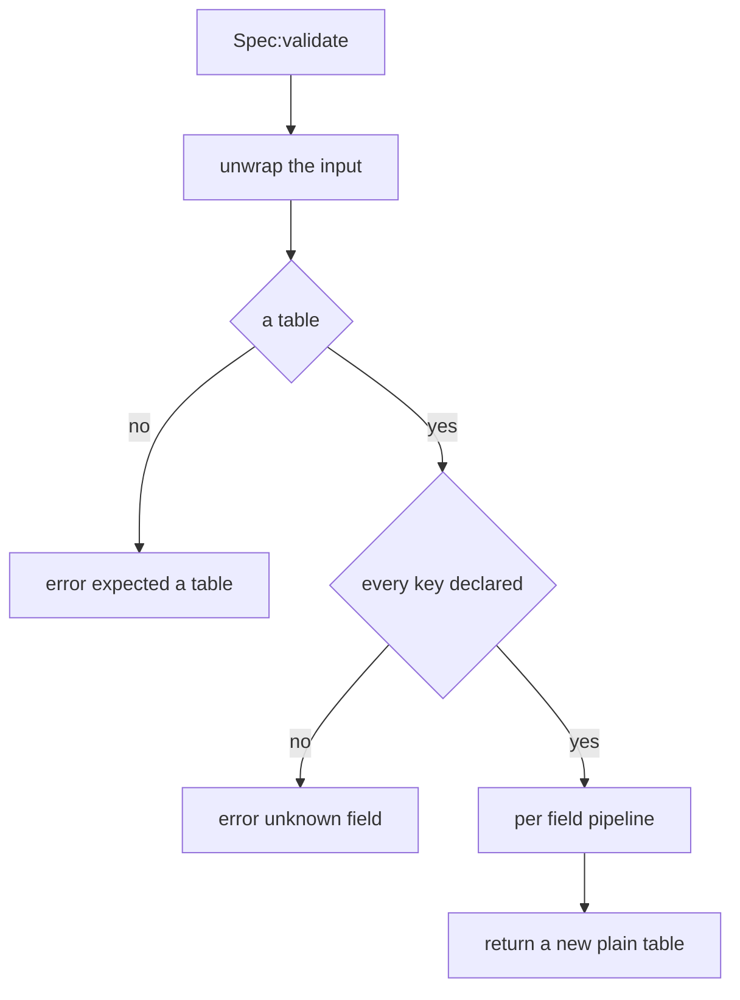
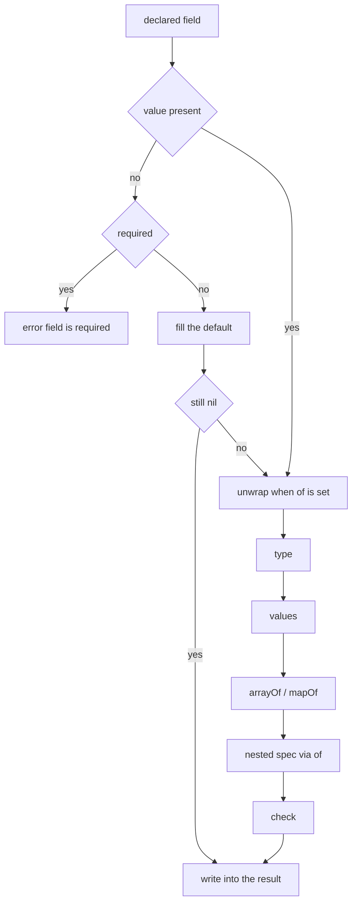
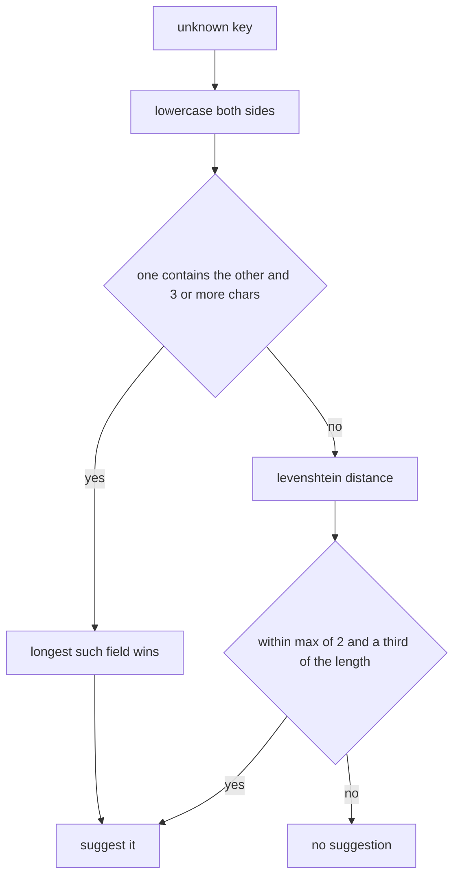

## このページでできるようになること

- パル・アイテム・建物の定義を、一発でゲームに受け付けてもらう
- 定義が間違っているときに出るメッセージを読んで、名指しされた行をそのまま直す
- ゲームを動かしたまま、パルや建物にどのフィールドが書けるかを調べる
- 同じモデルを、書き直さずに複数のパルで使い回す
- 登録せずに定義だけを組み立て、id の所有パックを記録する
- 自分のパックの設定も同じ方法で確認して、書き間違いを遊ぶ前に止める

`Pal{ ... }` や `Item{ ... }`、`Building{ ... }` といった `X{ ... }` の呼び出しは、ゲームに
何かが届く前に「書いてよいフィールドの一覧」と照合されます。すべて合っていれば定義が返ってきます。
合わなければ呼び出しはそこで止まり、ドメイン（何を定義しようとしていたか）とフィールド名と理由を
名指ししたメッセージが出ます。定義が中途半端に成功することはありません。全部登録されるか、何も
登録されないかのどちらかです。

メッセージの前にファイル名や行番号は付きません。UE4SS のログ（MOD ローダーがゲーム実行中に
書き出すテキストファイル）に、そのまま検索できる 1 行として出ます。

## フィールド一覧はこう書かれている

各ドメインは、受け付けるフィールドをただのデータとして一度だけ書き出しています。以下はメッシュ
（パルや建物に付ける 3D モデル）の実際の一覧です。フィールドに付けられるキーが一箇所に出てきます。

```lua title="Scripts/palforge/api/mesh.lua"
local schema = require("palforge.core.schema")

local Spec = schema.define("Mesh.Spec", {
    { "id",        type = "string", check = schema.nonEmpty,
                   doc = "mesh id, e.g. \"pack:name\" (required when defined directly; omit when inline)" },
    { "kind",      type = "string", values = { "procedural", "static", "skeletal", "obj" },
                   default = "skeletal", doc = "which core.mesh backend renders it" },
    { "model",     type = "string", required = true,
                   doc = "a /Game/... USkeletalMesh or UStaticMesh path (see Mesh.assets); for procedural / obj, an .obj file path - absolute, or relative to the .lua file that declares it" },
    { "animClass", type = "string",
                   doc = "a /Game/... ABP path, with or without the _C tail (see Mesh.assets.ABP); skeletal only" },
    { "scale",     type = "number", doc = "uniform scale applied to the attached mesh" },
    { "offset",    type = "table",  doc = "{ x, y, z } offset from the mesh's normal position, in cm" },
    { "texture",   type = "string",
                   doc = "a /Game/... UTexture2D path (see Mesh.assets.T), or a png of your own - absolute, or relative to the .lua file that declares it" },
    { "color",     type = "table",  doc = "tint { r, g, b, a } in 0..1" },
    { "material",  type = "string", doc = "base material asset path to instance from" },
    { "params",    type = "table",
                   doc = "extra material parameters: { vector = { name = {r,g,b,a} }, scalar = { name = n }, texture = { name = \"/Game/... or <abs png>\" } }" },
}, { handle = "Mesh.Handle" })
```

フィールド名は各行の**第 1 要素**です。それ以外はすべて同じ行の名前付きキーになります。

`fields` はマップではなく配列なので、書いた順がそのまま返ってきます。この順序が `:help()` の出力と
エディタの補完の並びになります。

`schema.define(name, fields, opts)` が返すスペックオブジェクトの表面は次のとおりです。

```lua
Spec:validate(t, context)   -- a validated COPY with defaults filled; raises on any problem
Spec:help()                 -- the printable field list, one line per field
Spec:field("model")         -- one field descriptor by name, or nil
Spec.fields                 -- the ordered array of descriptors
Spec.name                   -- "Mesh.Spec"
Spec.handle                 -- "Mesh.Handle", or nil
```

`X{ ... }` の呼び出しは、まず自分の一覧を通し、返ってきたコピーから定義を組み立てます。

```lua title="Scripts/palforge/api/pal.lua"
local function define(spec)
    spec = Spec:validate(spec, "Pal")
    -- spec is now a fresh plain table: unknown keys are impossible, defaults are filled
    ...
end
```

第 2 引数は、その呼び出しのメッセージの先頭に出る名前です。`"Pal"` を渡しているので
`PalForge: Pal.Spec: ...` ではなく `PalForge: Pal: ...` と読めます。省略すると、その形自身の名前が
使われます。

<Callout type="info">
形の名前は全体で一意です。`"Pal.Spec"` を二度宣言すると
`PalForge: schema.define: "Pal.Spec" is already declared` が出ます。自分で形を宣言するときは、
他が使っていない名前を選んでください。
</Callout>

## フィールドに書けるもの

1 つのフィールドには、名前に加えて最大 10 個のキーを書けます。書けるのはこれだけです。

<TypeTable
  type={{
    type: {
      description: 'string / number / boolean / table / function、あるいは table|function のようにパイプで書いたユニオン。省略すると何でも受け付ける。',
      type: 'string',
    },
    required: {
      description: 'フィールドが無いときに送出する。default より先に判定される。',
      type: 'boolean',
      default: 'false',
    },
    default: {
      description: 'フィールドが無いときに使う値。関数を渡すと呼び出されて新しい値を作る。',
      type: 'any',
    },
    values: {
      description: '値はこのいずれかと == で等しくなければならない。',
      type: 'any[]',
    },
    of: {
      description: 'ネストしたスペックで値を検証する。検証結果が入力を置き換える。',
      type: 'Spec',
    },
    arrayOf: {
      description: '配列部の全要素がこの型表記を満たさなければならない。',
      type: 'string',
    },
    mapOf: {
      description: 'テーブル内の全ての値がこの型表記を満たさなければならない。',
      type: 'string',
    },
    doc: {
      description: '1 行の説明。:help() と生成される型定義に流れる。',
      type: 'string',
    },
    sig: {
      description: '関数フィールドの LuaLS シグネチャ。検証は完全に無視する。',
      type: 'string',
    },
    check: {
      description: '追加の述語。false と理由文字列を返すと拒否する。最後に走る。',
      type: 'fun(v): boolean, string?',
    },
  }}
/>

### type

表記はただの文字列です。ユニオンはパイプで書き、どれか 1 つに一致すれば通ります。

```lua
{ "maxStack", type = "number" }                    -- Item.Spec
{ "state",    type = "table|function" }            -- Building.Spec
{ "icon" }                                         -- no type: anything is accepted
```

`"function"` が期待される場所では、**呼び出せるテーブルが関数の代わりになります**。`__call`
メタメソッドを持つテーブルはイベントハンドラとして通ります。

```lua
local counter = setmetatable({ n = 0 }, {
    __call = function(self, pal, ctx) self.n = self.n + 1 end,
})

Pal{ id = "example:Boss", events = { onSpawned = counter } }   -- accepted
```

### required

判定はフィールドを書かなかったときだけ、しかも `default` を見る前に行われます。そのため required と
default が同時に効くフィールドはありません。

```lua
{ "model", type = "string", required = true,
           doc = "a /Game/... USkeletalMesh or UStaticMesh path (see Mesh.assets); ..." }
```

`id` はどのドメインでも必須です。唯一 `Mesh.Spec` だけが任意で、パルや建物の中にインラインで書いた
メッシュには名付けるものが無いからです。`Mesh{ ... }` を単独で書く場合はやはり id が必要で、
一覧を通した直後に `api/mesh` が別途チェックします。

### default

デフォルトは書かなかったフィールドを埋めます。埋まった値は、自分で書いた値とまったく同じ type /
`values` / `arrayOf`・`mapOf` / `of` / `check` の各段を通ります。

```lua
{ "kind",         type = "string", default = "skeletal" }   -- Mesh.Spec
{ "tickInterval", type = "number", default = 1 }            -- Building.Spec
{ "stackable",    type = "boolean", default = false }       -- Effect.Spec
```

関数のデフォルトは**呼び出される**ので、1 つのテーブルを共有せず、定義ごとに新しい値が作られます。

```lua
{ "tags", type = "table", default = function() return {} end }
```

PalForge 自身のフィールド一覧に関数デフォルトを使うものは今のところありませんが、自分の形では
使えます。`Spec:help()` は素の値のときだけ `default=` を印字し、関数のときはその表示を省きます。

### values

値は列挙のいずれかと等しくなければなりません。`==` で先頭から順に比較されます。

```lua
{ "kind",     type = "string", values = { "procedural", "static", "skeletal", "obj" } }  -- Mesh.Spec
{ "category", type = "string",
              values = { "material", "consumable", "equipment", "ammo", "ingredient", "other" } }  -- Item.Spec
{ "kind",     type = "string", values = { "active", "passive" } }                        -- Skill.Spec
{ "kind",     type = "string", values = { "se", "bgm" } }                                -- Audio.Spec
```

### of

値は別の形で検証され、**検証済みのコピーが結果側でそれを置き換えます**。メッセージには内側の形の
名前まで伸びるので、ネストしたテーブル内のフィールドの話でも、どの一覧を読みに行けばよいか分かります。

```lua
{ "mesh",   type = "table", of = Mesh,   doc = "the mesh worn by a spawned pawn ..." }
{ "events", type = "table", of = Events, doc = "lifecycle handlers (grouped)" }
{ "recipe", type = "table", of = Recipe, doc = "the recipe that produces THIS item ..." }
```

### arrayOf

**配列部**の全要素が `ipairs` で型検査され、添字がメッセージ中のフィールド名の一部になります。

```lua
{ "skills",   type = "table", arrayOf = "string" }   -- Pal.Spec
{ "buildIds", type = "table", arrayOf = "string" }   -- Building.Spec
```

```lua
Pal{ id = "example:Boss", skills = { "example:Fire", "example:Gust" } }   -- fine
```

`ipairs` で走査するため、`arrayOf` のテーブルに置かれた文字列キーは見られません。番号の付いた
連続部分だけが検査されます。

### mapOf

テーブル内の全ての値が `pairs` で型検査され、キーがメッセージ中のフィールド名の一部になります。
配列部も見られるので、`materials = { "Wood" }` は `materials.1` として報告されます。

```lua
{ "materials", type = "table", mapOf = "number", required = true,
               doc = "{ <itemId> = <count> } consumed by one craft" }   -- Item.Spec.Recipe
```

```lua
Item{
    id     = "example:Torch",
    recipe = { materials = { Wood = 3, Stone = 1 }, count = 2, station = "Workbench" },
}
```

### doc

1 行の説明です。`Spec:help()` に表示され、エディタが読む `---@field` 行の末尾コメントとしても
出力されます。検証がこれを使うのは 1 箇所だけで、「is required」のメッセージが括弧内に引用します。
`check` の失敗が引用するのは check 自身が返した理由で、`doc` ではありません。

### sig

関数フィールドについて LuaLS（エディタの補完を支える Lua 言語サーバ）が表示するシグネチャです。
**検証はこれを完全に無視します。** 読むのは `tools/gen-types.lua` だけで、`types.lua` により良い型を
書き込むためだけに使われます。

```lua
{ "onSpawned", type = "function", sig = "fun(self: Pal.Handle, ctx: table)",
               doc = "LIVE - a pal finished initialising (ctx.actor); may repeat per pawn, keep it idempotent" }
```

### check

ネストした `of` も含めて、**すべての後に**走る自前の判定です。受理するなら `true`、拒否するなら
`false` と理由の文字列を返します。その理由がメッセージにそのまま引用されます。

`core/schema.lua` が公開している共有 check は 2 つです。`schema.nonEmpty` は弱いほうで、
空でない文字列かどうかしか見ません。

```lua title="Scripts/palforge/core/schema.lua"
function M.nonEmpty(v)
    if type(v) == "string" and #v > 0 then return true end
    return false, "must be a non-empty string"
end
```

強いほうが `schema.validId` で、これが**定義時の id 検証そのもの**です。コロンを含まない id は
ゲーム側のそのままの id なので、空でなければ通ります。コロンを含む id は名前空間付きなので、
前後どちらの半分も `^[%w_]+$` でなければなりません。`core/object_manager.resolve` が要求する形
そのもので、`pack:name` に対して PalSchema が書き込む行の綴りが `pack_name` だからです。
`schema.validId` は `om.validId` に委譲していて、パターンの写しをここに持ちません。5 つの
ドメインはこれをフィールドに付けています。

```lua title="Scripts/palforge/api/pal.lua"
{ "id",  type = "string", required = true, check = schema.validId,
         doc = "pal id: a game CharacterID (\"ChickenPal\") or \"pack:name\"" },
```

`Item.Spec`・`Skill.Spec`・`Effect.Spec`・`Audio.Spec` の `id` も同じ書き方です。残る 3 つ、
`Mesh`・`Building`・`UI` は自分の `define` の中で `om.validId` を直接呼びます。理由の前に置く
文言をそれぞれ変えたいからです。拒否する id は 8 ドメインとも同じです。

```text
PalForge: Pal: field "id" is invalid: invalid pack id 'my-pack' in 'my-pack:Boss' (letters/digits/_ only)
PalForge: Building: field "id" is invalid: invalid pack id 'my-pack' in 'my-pack:Bench' (letters/digits/_ only)
PalForge: Mesh: id "my-pack:body" is not a valid PalForge id: invalid pack id 'my-pack' in 'my-pack:body' (letters/digits/_ only)
```

引っかかるのはパック名側のハイフンです。`Building{ id = "my-pack:Bench" }` は登録自体はきれいに
通り、そのあとゲーム側の境界すべてで死にます。アイコン参照もテクノロジー解放もビルド ID の照合も
外れ、ログには何も出ません。この check があると、それが定義を書いているその場で読める 1 行に
変わります。

自作の check も同じ約束に従います。

```lua
{ "packId", type = "string", check = function(v)
      if v:find(":", 1, true) then return true end
      return false, "must be namespaced as pack:name"
  end },
```

## もう 1 つのオプション handle

`schema.define` の第 3 引数が受け取るキーは、現時点で 1 つだけです。

<TypeTable
  type={{
    handle: {
      description: '__spec メタフィールドを通じてこの形を同じく満たすハンドル型。型定義専用で、検証は既にハンドルを受け付けており、これはそれをエディタに伝えるためのもの。',
      type: 'string',
    },
  }}
/>

```lua
}, { handle = "Mesh.Handle" })
```

形の側で一度宣言しておけば、`of` でその形を指すすべてのフィールドが、書き直さなくてもエディタ上で
ユニオンになります。`Pal.Spec.mesh` は `Mesh.Spec|Mesh.Handle` です。派生した形はベースの
`handle` を引き継ぐので、`Building.Spec.Mesh` も `Mesh.Handle` を報告します。

## 定義の第 2 引数

`X{ ... }` は `X(spec, opts)` を引数 1 つで呼んだ形です。8 つのドメインのコンストラクタはすべて
この第 2 引数を受け取ります。省略可能で、制御するのは**登録だけ**です。定義そのものには何も影響
しません。返ってくるハンドルはどちらでも同じものです。

```lua
Item{ id = "example:Torch", maxStack = 20 }                             -- define and register

local h = Item({ id = "example:Torch", maxStack = 20 },
               { register = false })                                    -- build the handle, register nothing

Item({ id = "example:Torch", maxStack = 20 }, { pack = "mypack" })      -- register with an owner
```

<TypeTable
  type={{
    register: {
      description: 'false ならハンドルを組み立てて返すだけで、id をレジストリに入れない。それ以外なら登録する。',
      type: 'boolean',
      default: 'true',
    },
    pack: {
      description: '登録の所有者として記録されるパック id。id の衝突がどのパックのものか特定できるのはこれによる。',
      type: 'string',
    },
  }}
/>

`register = false` は、**読み取り**が書き込みになってしまうのを防ぐためのものです。ネイティブ
カタログは必要になった時点で定義をでっち上げます（`native.buildings.Foundation` は内部的には
`Building{ id = ... }` です）。そして建物にとって登録は無害ではありません。`core/event` の再構成
スキャンが新しい定義を拾い、その時点で世界に立っているすべての一致アクターが追跡対象のインスタンス
になり、セーブに永続化されます。つまりツールチップで建物 id を 1 つ読むだけで、拠点の土台すべての
レコードを書き始めていました。カタログ側は `{ register = false }` を渡すので、参照はふたたび
ただの参照です。

`pack` はスコープ付きの表面が代わりに埋めてくれます。`PalForge.pack("mypack").Item` は、
`{ pack = "mypack" }` をあらかじめ付けた同じコンストラクタです。

`Pal`・`Item`・`Skill`・`Effect`・`Audio` はこの引数を `schema.defineOpts` に通します。書き間違いを
弾くのもそこです。黙って無視されるオプションこそ、この層が防ぐために存在する失敗そのものだからです。

```lua
Item({ id = "example:Torch" }, { registr = false })
Item({ id = "example:Torch" }, { register = "no" })
Item({ id = "example:Torch" }, "nope")
```

```text
PalForge: Item: unknown define option "registr". Valid options: register, pack
PalForge: Item: define option "register" expects boolean, got string
PalForge: Item: the second argument is the options table { register = false, pack = "packid" }, got string
```

`Mesh`・`Building`・`UI` は `schema.defineOpts` を呼ばず、自分の `define` の中で同じ 2 つのキーを
読みます。`register` と `pack` の扱いは同じですが、3 つ目のキーを書いてもエラーにはなりません。

## 定義を呼んだときに起きること

`Spec:validate(t, context)` は渡したテーブルを決して変更しません。返すのは**新しい素のテーブル**で、
後続からは組み立てられた値と手書きの値を区別できません。



入力が `nil` なら空テーブル扱いなので、必須フィールドはやはり失敗します。どのフィールドを調べるより
先に全キーが検査されるため、定義の他の部分も壊れているときでも書き間違いが報告されます。文字列で
ないキーは、宣言済みの名前と照合するより前にその場で拒否されます。

宣言された各フィールドは、次の順序でまったく同じ段を通ります。



この順序から 2 つのことが言えます。

- `of` のための unwrap は type 検査**より前**に走ります。table が宣言された場所にハンドルを渡した
  場合、`type` が検査される時点で既に素のテーブルになっています。
- `check` はネストの**後**の値を見ます。`of` を持つフィールドの check が受け取るのは、生の入力では
  なく検証済みのコピーです。

コピーは 1 段だけです。ネストした `of` の形は新しいテーブルへ検証し直されますが、`data` や `color`
や `offset` のような素の `table` フィールドは参照のまま持ち越されます。あなたが書いたテーブルが、
そのまま定義の持つテーブルです。

```lua
local payload = { charges = 3 }
local pal = Pal{ id = "example:Boss", data = payload }
payload.charges = 5   -- the definition sees 5: `data` is not deep-copied
```

## 間違えたときに出るもの

定義から出るメッセージと、それを出すコードと、直し方をすべて並べます。テキストの部分はゲームが
実際に印字する文面そのままなので、その一部をコピーしてログ検索に使えます。

### テーブルでない

```lua
Pal("example:Boss")
```

```text
PalForge: Pal: expected a table, got string. Fields: id, name, description, skills, mesh, material, color, texture, icon, events, data
```

直し方: テーブルを渡します。丸括弧ではなく波括弧で `Pal{ id = "example:Boss" }` と書きます。

### 文字列でないキー

```lua
Pal{ id = "example:Boss", [1] = "x" }
```

```text
PalForge: Pal: keys must be strings, got a number key
```

直し方: すべての要素に名前を付けます。波括弧の中に値だけを書くと、それは要素 `1` になります。

### 未知のフィールド、もしかして提案付き

```lua
Pal{ id = "example:Boss", meshSpec = { model = "/Game/X" } }
```

```text
PalForge: Pal: unknown field "meshSpec" (did you mean "mesh"?). Valid fields: id, name, description, skills, mesh, material, color, texture, icon, events, data
```

```lua
Building{ id = "example:Bench", tickInverval = 4 }
```

```text
PalForge: Building: unknown field "tickInverval" (did you mean "tickInterval"?). Valid fields: id, name, description, gridCm, buildIds, tickInterval, mesh, material, color, texture, icon, state, events, data
```

直し方: 提案された名前に書き換えます。

### 未知のフィールド、十分に近い候補が無い

```lua
Pal{ id = "example:Boss", zzzzzzzzzz = 1 }
```

```text
PalForge: Pal: unknown field "zzzzzzzzzz". Valid fields: id, name, description, skills, mesh, material, color, texture, icon, events, data
```

直し方: 受け付ける名前は `Valid fields:` の後ろに並んでいます。その中から選びます。

### 必須フィールドの欠落

```lua
Pal{ name = "Boss" }
```

```text
PalForge: Pal: field "id" is required (pal id: a game CharacterID ("ChickenPal") or "pack:name")
```

直し方: そのフィールドを足します。括弧内はそのフィールドの `doc` で、何を書けばよいかが分かります。
ここではゲームの id か `"pack:name"` です。`doc` が無いフィールドでは代わりに `type`、それも
無ければ `any` が出ます。

### 型が違う

```lua
Pal{ id = "example:Boss", name = 42 }
```

```text
PalForge: Pal: field "name" expects string, got number
```

ユニオンはそのままの表記で報告されます。

```lua
Building{ id = "example:Bench", state = "uses" }
```

```text
PalForge: Building: field "state" expects table|function, got string
```

直し方: 表示された型のどれかに合う値を渡します。`state = { uses = 0 }` か
`state = function() return { uses = 0 } end` です。

### `values` の外の値

```lua
Mesh{ id = "example:body", model = "/Game/X", kind = "rigid" }
```

```text
PalForge: Mesh: field "kind" must be one of { "procedural", "static", "skeletal", "obj" }, got "rigid"
```

```lua
Skill{ id = "example:Fire", kind = "ultimate" }
```

```text
PalForge: Skill: field "kind" must be one of { "active", "passive" }, got "ultimate"
```

直し方: 波括弧に並んだ値のどれかを使います。受け付けるのはそれだけです。

### `arrayOf` の要素が不正

添字はフィールド名に畳み込まれるので、経路全体が 1 組の引用符に収まります。

```lua
Pal{ id = "example:Boss", skills = { "example:Fire", 3 } }
```

```text
PalForge: Pal: field "skills[2]" expects string, got number
```

直し方: `skills[2]` はリストの 2 番目の要素です。そこを直します。

### `mapOf` の値が不正

```lua
Item{ id = "example:Torch", recipe = { materials = { Wood = "three" } } }
```

```text
PalForge: Item: field "recipe" (Item.Spec.Recipe): field "materials.Wood" expects number, got string
```

`mapOf` のテーブルに入った配列要素は数値キーで報告されます。

```lua
Item{ id = "example:Torch", recipe = { materials = { "Wood" } } }
```

```text
PalForge: Item: field "recipe" (Item.Spec.Recipe): field "materials.1" expects number, got string
```

直し方: `materials` は `{ <itemId> = <count> }` の形です。`materials = { Wood = 3 }` と書きます。

### `check` の失敗

```lua
Pal{ id = "" }
```

```text
PalForge: Pal: field "id" is invalid: must be a non-empty string
```

直し方: コロンの後ろが check の返した理由です。check が `false` だけを返した場合、メッセージは
`failed check` で終わります。

### ネストした形のエラーは内側の名前を出す

メッセージは順に積み上がります。外側のドメイン、外側のフィールド、内側の形の名前、そして内側の
指摘です。右から読んでください。最後の部分が直す場所です。

```lua
Pal{ id = "example:Boss", mesh = { kind = "skeletal" } }
```

```text
PalForge: Pal: field "mesh" (Mesh.Spec): field "model" is required (a /Game/... USkeletalMesh or UStaticMesh path (see Mesh.assets); for procedural / obj, an .obj file path - absolute, or relative to the .lua file that declares it)
```

```lua
Building{ id = "example:Bench", mesh = { model = "/Game/X", colour = { 1, 0, 0, 1 } } }
```

```text
PalForge: Building: field "mesh" (Building.Spec.Mesh): unknown field "colour" (did you mean "color"?). Valid fields: id, kind, model, animClass, scale, offset, texture, color, material, params
```

`events` グループも他と同じネストした形なので、ハンドラ名を書き間違えるとエラーになります。黙って
発火しないハンドラになることはありません。

```lua
Pal{ id = "example:Boss", events = { onSpawn = function(pal, ctx) end } }
```

```text
PalForge: Pal: field "events" (Pal.Spec.Events): unknown field "onSpawn" (did you mean "onSpawned"?). Valid fields: onSpawned, onDamaged, onDeath, onCaptured, onTick
```

```lua
Building{ id = "example:Bench", events = { onPlace = "hello" } }
```

```text
PalForge: Building: field "events" (Building.Spec.Events): field "onPlace" expects function, got string
```

直し方: `(...)` の中の名前が `schema.help` で調べられる内側の形で、書ける名前は行末に並んでいます。

## 提案はどう選ばれるか

未知のフィールドは必ず、あなたが意図したフィールドを名指ししようとします。書き間違いはパックを
読み込んだ時点で見つかります。



**実在のフィールド名を含んでいる名前が、単に綴りが近いだけの名前に勝ちます。** 最も多い間違いは
飾りの付いた名前、つまり `mesh` に対する `meshSpec`、`icon` に対する `iconPath` です。人間には
自明に見えても、実際のフィールドからは編集距離が数手離れています。包含は双方向に判定されるので、
接頭辞も接尾辞も複数形も一致します。参加するのは 3 文字以上の宣言済み名だけなので、`id` のような
2 文字のフィールドが包含で宣言の半分を飲み込むことはありません。

どちらも他方を含まないときは Levenshtein 距離が決めます。2 つの名前が 1 文字ずつの編集で何手離れて
いるかです。本当に近いものしか受理せず、上限は `max(2, floor(#name / 3))` です。

どちらの段も小文字化して比較するので、大文字小文字の取り違えも拾えます。

| 書いたもの | 提案 | 理由 |
| --- | --- | --- |
| `meshSpec` | `mesh` | `mesh` を含む |
| `iconPath` | `icon` | `icon` を含む |
| `displayName` | `name` | `name` を含む |
| `textures` | `texture` | `texture` を含む |
| `durationSeconds` | `duration` | `duration` を含む |
| `Description` | `description` | 小文字化すれば `description` を含む |
| `nam` | `name` | `name` が `nam` を含む（包含は双方向） |
| `tickInverval` | `tickInterval` | 距離 1 |
| `sound` | `soundPath` | `sound` を含む |
| `zzzzzzzzzz` | なし | 距離の上限内に何も無い |

<Callout type="warn">
とても短い未知のキーでは上限が一律 2 になるため、提案が洞察ではなく偶然になることがあります。
`Pal{ xy = 1 }` は `"id"` を提案します。2 文字や 3 文字のキーへの提案は、答えではなくヒントとして
扱ってください。
</Callout>

## 定義を別の定義の中に入れる

ネストする形は、インラインで書くことも、define 呼び出しが返したオブジェクトをそのまま渡すことも
できます。

```lua
-- inline
Pal{ id = "example:Boss", mesh = { model = "/Game/Pal/Model/Character/Monster/ChickenPal/SK_ChickenPal" } }

-- as a named definition
local body = Mesh{
    id      = "example:body",
    model   = "/Game/Pal/Model/Character/Monster/ChickenPal/SK_ChickenPal",
    texture = "art/body.png",
}

Pal{ id = "example:Boss", mesh = body }
Pal{ id = "example:Add",  mesh = Mesh.get("example:body") }
```

どちらも同じ経路で内側の形に届きます。メタテーブルに `__spec` を持つハンドルは、検査が始まる前に、
それが表すテーブルへ差し替えられます。

```lua title="Scripts/palforge/core/schema.lua"
local function unwrap(v)
    if type(v) ~= "table" then return v end
    local mt = getmetatable(v)
    local tospec = mt and rawget(mt, "__spec")
    if type(tospec) == "function" then return tospec(v) end
    return v
end
```

```lua title="Scripts/palforge/api/mesh.lua"
Handle.__spec = function(self) return self._cls:source() end
```

差し替えは 2 箇所で走ります。`validate` の冒頭で入力全体に対して、そして `of` が設定された
フィールドごとに。したがって `mesh = someHandle` と同じく `Spec:validate(someHandle)` も動きます。

ネストした値はその後で検査し直されるため、外側の定義が持つのは**コピー**です。メッシュを着ている
パル経由で、そのメッシュ定義に手を伸ばすことはできません。

```lua
local body = Mesh{ id = "example:body", model = "/Game/X/SK_X" }
local pal  = Pal{ id = "example:Boss", mesh = body }

pal:mesh().scale = 4     -- mutates the pal's copy, not the "example:body" definition
```

<Callout type="warn">
現時点で `__spec` を持つハンドルは `Mesh.Handle` だけです。pal / item / building / skill /
effect / audio / UI のハンドルは持たないため、それらを別の定義に渡すと素のテーブルとして検査され、
未知のキーで失敗します。その場合はネストする部分をインラインで書いてください。
</Callout>

<Callout type="warn">
デフォルトが埋めるのは**書かなかった**フィールドだけです。`Mesh{ ... }` は既に
`kind = "skeletal"` を埋めているので、そのハンドルを建物にネストしても、`Building.Spec.Mesh` の
`kind` デフォルトが `"static"` であるにもかかわらず `skeletal` のままです。建物側の方針が欲しい
ときは、メッシュに `kind = "static"` を書くか、建物の mesh をインラインで宣言してください。
</Callout>

## デフォルトだけ変えて一覧を使い回す

`schema.derive(name, base, overrides)` は、別の形のコピーとしてフィールド単位の方針だけを差し替えた
新しい形を宣言します。各フィールドが丸ごとコピーされ、その上に対応する override テーブルが
マージされます。

建物はこれをメッシュで使っています。

```lua title="Scripts/palforge/api/building.lua"
local Mesh = schema.derive("Building.Spec.Mesh", schema.get("Mesh.Spec"), {
    kind   = { default = "static" },
    model  = { doc = "UStaticMesh asset path, or an OBJ path for the procedural backend" },
    offset = { doc = "{ x, y, z } offset from the actor's origin" },
})
```

パルが skeletal メッシュなのに対して建物は static メッシュなので、変わるのはそのデフォルトだけです。
10 個のフィールドも、その型も、`model` が required であることも、`Mesh.Handle` オプションも
そのまま引き継がれ、後から `Mesh.Spec` にフィールドを足せば建物側にも届きます。

違いは 2 つの help 出力に現れます。

```text
Mesh.Spec {
  kind          string     (default=skeletal, one of { "procedural", "static", "skeletal", "obj" }) which core.mesh backend renders it
  model         string     (required) a /Game/... USkeletalMesh or UStaticMesh path (see Mesh.assets); for procedural / obj, an .obj file path - absolute, or relative to the .lua file that declares it
  offset        table      { x, y, z } offset from the mesh's normal position, in cm
  ...
}

Building.Spec.Mesh {
  kind          string     (default=static, one of { "procedural", "static", "skeletal", "obj" }) which core.mesh backend renders it
  model         string     (required) UStaticMesh asset path, or an OBJ path for the procedural backend
  offset        table      { x, y, z } offset from the actor's origin
  ...
}
```

上書きできるのは `default` だけではありません。マージは override テーブルが持つキーを何でもコピー
します。ベースが宣言していないフィールドを指す override はその場で捕まります。

```lua
schema.derive("Test.Spec", schema.get("Mesh.Spec"), { kindd = { default = "x" } })
```

```text
schema.derive(Test.Spec): "kindd" is not a field of Mesh.Spec
```

<Callout type="info">
`derive` は `define` を経由するので、新しい名前は未使用でなければなりません。同じ名前を二度取ると
`PalForge: schema.define: "Test.Spec" is already declared` が、ファイル名も行番号も無しで出ます。
残る 2 つの検査は `assert` です。ベースは `schema.define` で作られたスペックであること、override は
ベースが宣言しているフィールドを指すこと。この 2 つには `core/schema.lua` 自身のファイル名と行番号が
前に付くので、上のテキストはメッセージの末尾部分であって 1 行全体ではありません。
</Callout>

## 形に何が書けるかをゲームに聞く

すべての形は宣言された時点でその名前とともに記録され、ゲームを動かしたまま読み出せます。

```lua
local schema = require("palforge.core.schema")

schema.get("Pal.Spec")          -- the spec object, or nil
schema.get("Pal.Spec").fields   -- the ordered descriptors, for tooling
schema.help("Pal.Spec")         -- the printable field list
schema.all()                    -- every declared spec, in declaration order
```

`schema.help(name)` が「ここに何を渡せるのか」への実行時の答えです。

```lua
print(schema.help("Pal.Spec"))
```

```text
Pal.Spec {
  id            string     (required) pal id: a game CharacterID ("ChickenPal") or "pack:name"
  name          string     shown in UI (defaults to id)
  description   string     one-line description, for UI and tooling
  skills        table      (string[]) skill ids this pal owns (see Skill)
  mesh          table      (Mesh.Spec) the mesh worn by a spawned pawn (inline, or a Mesh{ ... } handle); attached automatically on pal.spawned
  material      table      (Pal.Spec.Material) material override applied to that mesh
  color         table      base tint { r, g, b, a } (shorthand for material.color)
  texture       string     png path applied to the mesh (shorthand for material.texture)
  icon          string     /Game/... texture path used when the icon DataTable has no row for this id
  events        table      (Pal.Spec.Events) lifecycle handlers (grouped)
  data          table      free-form payload of your own, carried onto the definition
}
```

括弧内の印は固定の順で並びます。`required`、次に素の値のときの `default=<値>`、次に
`one of { ... }`、次にネストした形の名前、次に `arrayOf` の `<型>[]`、最後に `mapOf` の
`map of <型>`。印が 1 つも無いフィールドは、名前と型と doc だけを印字します。

宣言されていない名前を渡しても送出は**されません**。宣言済みの全名称をソートした文字列が返ります。
正確な綴りを思い出せないときに便利です。

```lua
print(schema.help("Pal.Specc"))
```

```text
PalForge: no spec named "Pal.Specc". Declared: Audio.Spec, Building.Spec, Building.Spec.Events, Building.Spec.Material, Building.Spec.Mesh, Coord, Effect.Spec, Effect.Spec.Events, Item.Spec, Item.Spec.Events, Item.Spec.Recipe, Mesh.Spec, Pal.Spec, Pal.Spec.Events, Pal.Spec.Material, Skill.Spec, Skill.Spec.Events, UI.Node.Border, UI.Node.Button, UI.Node.Frame, UI.Node.GameWidget, UI.Node.HBox, UI.Node.Label, UI.Node.Overlay, UI.Node.ScrollBox, UI.Node.SizeBox, UI.Node.Sprite, UI.Node.VBox, UI.Spec, UI.Spec.Host
```

`schema.all()` は新しいリストを**宣言順**で返します。ソートはされません。ネストした形は常にそれを
参照する形より先に宣言されており、これが型ジェネレータに「使われる前に各クラスを出力する」ことを
可能にしています。

```lua
for _, spec in ipairs(schema.all()) do
    print(spec.name, spec.handle)
end
```

```text
Mesh.Spec              Mesh.Handle
Pal.Spec.Material      nil
Pal.Spec.Events        nil
Pal.Spec               nil
Item.Spec.Recipe       nil
Item.Spec.Events       nil
Item.Spec              nil
Building.Spec.Mesh     Mesh.Handle
Building.Spec.Material nil
Building.Spec.Events   nil
Building.Spec          nil
Skill.Spec.Events      nil
Skill.Spec             nil
Effect.Spec.Events     nil
Effect.Spec            nil
Audio.Spec             nil
UI.Node.VBox           nil
UI.Node.HBox           nil
UI.Node.Overlay        nil
UI.Node.ScrollBox      nil
UI.Node.Border         nil
UI.Node.SizeBox        nil
UI.Node.Label          nil
UI.Node.Frame          nil
UI.Node.Button         nil
UI.Node.Sprite         nil
UI.Node.GameWidget     nil
UI.Spec.Host           nil
UI.Spec                nil
Coord                  nil
```

形は全部で 30 個あり、そのうち 11 個は `UI.Node.*` — `UI.VBox`・`UI.Label`・`UI.Button` などの
ノードコンストラクタが受け取る形が 1 つずつ — で、さらに `UI.Spec.Host`（パネルの `host` を
テーブルで書いたときの形）が加わります。いずれも `api/ui.lua` が他のスペックと同じように宣言して
いるので、`schema.help("UI.Node.Button")` は `schema.help("Pal.Spec")` と同じように答えます。

名前にドメインが付かない唯一の形が `Coord` です。`Player.coordinate()` が返し、
`Pal.Handle:spawn` が受け取る世界座標で、`schema.help("Coord")` とエディタの両方がフィールドを
知れるように `api/player.lua` で宣言されています。

## エディタで見るフィールド一覧

`Scripts/palforge/types.lua` は、宣言された形から `tools/gen-types.lua` が生成します。

```bash
lua5.4 tools/gen-types.lua
```

これは注釈だけのファイルで、実行時に require するものはありません。`Pal{ ... }` が各フィールドを
doc 付きで補完するには、LuaLS がワークスペース内でこのファイルを見えていれば十分です。

各フィールドは、最初に当てはまる規則でエディタの型に写されます。

| ディスクリプタ | 出力される型 |
| --- | --- |
| `of = Inner` | `Inner.Spec`。内側のスペックが `handle` を宣言していれば `\|Inner.Handle` が付く |
| `values = { ... }` | スペック名とフィールド名から作られたエイリアス、例 `Mesh.Spec.Kind` |
| `sig = "fun(...)"` | シグネチャをそのまま |
| `arrayOf = "string"` | `string[]` |
| `mapOf = "number"` | `table<string, number>` |
| `type` 無し | `any` |
| それ以外 | 書かれたままの `type` 文字列 |

`required` は `?` を付けるかどうかを決め、素の `default` は doc コメントに追記されます。
`Pal.Spec` の結果は次のとおりです。

```lua title="Scripts/palforge/types.lua"
---@class Pal.Spec
---@field id string # pal id: a game CharacterID ("ChickenPal") or "pack:name"
---@field name? string # shown in UI (defaults to id)
---@field description? string # one-line description, for UI and tooling
---@field skills? string[] # skill ids this pal owns (see Skill)
---@field mesh? Mesh.Spec|Mesh.Handle # the mesh worn by a spawned pawn (inline, or a Mesh{ ... } handle); attached automatically on pal.spawned
---@field material? Pal.Spec.Material # material override applied to that mesh
---@field color? table # base tint { r, g, b, a } (shorthand for material.color)
---@field texture? string # png path applied to the mesh (shorthand for material.texture)
---@field icon? string # /Game/... texture path used when the icon DataTable has no row for this id
---@field events? Pal.Spec.Events # lifecycle handlers (grouped)
---@field data? table # free-form payload of your own, carried onto the definition
```

`mesh` フィールドに `|Mesh.Handle` が付くのは `handle` オプションのおかげで、`Mesh.Spec.Kind` は
その形の `values` 一覧から生成されたエイリアスです。

```lua title="Scripts/palforge/types.lua"
---@alias Mesh.Spec.Kind "procedural"|"static"|"skeletal"|"obj"
```

形を変えたらジェネレータを再実行してください。エディタが出すものと、定義が実際に受け付けるものが
同じに保たれます。

## レシピ

### ゲーム実行中に任意の形を印字する

```lua title="content/dev.lua"
local schema = require("palforge.core.schema")
local log    = require("palforge.utils.log").scope("dev")

-- one shape
log.info(schema.help("Building.Spec"))

-- the shapes a building definition can reach
for _, name in ipairs({ "Building.Spec", "Building.Spec.Mesh",
                        "Building.Spec.Material", "Building.Spec.Events" }) do
    log.info(schema.help(name))
end
```

### 宣言済みの全形を UE4SS のログへ吐く

```lua title="content/dev.lua"
local schema = require("palforge.core.schema")
local log    = require("palforge.utils.log").scope("schema")

for _, spec in ipairs(schema.all()) do
    log.info(spec:help())
end
```

### ディスクリプタから自前のリファレンス表を組む

```lua title="content/dev.lua"
local schema = require("palforge.core.schema")

local function describe(specName)
    local spec = schema.get(specName)
    if not spec then return print(schema.help(specName)) end

    print(spec.name)
    for _, f in ipairs(spec.fields) do
        local flags = {}
        if f.required then flags[#flags + 1] = "required" end
        if f.default ~= nil then flags[#flags + 1] = "default=" .. tostring(f.default) end
        if f.values then flags[#flags + 1] = "enum" end
        if f.of then flags[#flags + 1] = f.of.name end
        if f.check then flags[#flags + 1] = "checked" end
        print(string.format("  %-13s %-14s %-22s %s",
            f.name, f.type or "any", table.concat(flags, ","), f.doc or ""))
    end
end

describe("Item.Spec")
describe("Item.Spec.Recipe")
```

### 自分のパックの設定も同じ方法で検証する

`schema.define` は PalForge のドメイン専用ではありません。パック自身の形を宣言すれば、設定の
書き間違いが同じメッセージと同じもしかして提案で、読み込み時に止まります。他の形が使っていない
名前を選んでください。

```lua title="content/config.lua"
local schema = require("palforge.core.schema")

local Config = schema.define("ExamplePack.Config", {
    { "reward",     type = "string", required = true, check = schema.nonEmpty,
                    doc = "item id handed out when the boss dies" },
    { "rewardCount", type = "number", default = 5, doc = "how many of it" },
    { "biome",      type = "string", values = { "forest", "desert", "volcano" },
                    default = "forest", doc = "where the boss appears" },
    { "spawnAt",    type = "table", of = schema.get("Coord"),
                    doc = "fixed spawn point; omit to spawn near the player" },
})

---@param opts table
local function setup(opts)
    local cfg = Config:validate(opts, "ExamplePack")

    Pal{
        id     = "example:Boss",
        name   = "Example Boss",
        events = {
            onDeath = function(pal, ctx)
                Item.get(cfg.reward):give(cfg.rewardCount)
            end,
        },
    }
end

setup{ reward = "Wood", rewardCount = 10, biome = "volcano" }
```

書き間違いの挙動は `Pal{ ... }` 呼び出しのときとまったく同じです。

```lua
setup{ reward = "Wood", rewardCounts = 10 }
```

```text
PalForge: ExamplePack: unknown field "rewardCounts" (did you mean "rewardCount"?). Valid fields: reward, rewardCount, biome, spawnAt
```

### ゲーム中に黙って壊れるのではなく、読み込み時に大きく失敗させる

定義の失敗は送出なので、そのファイルの読み込みはそこで止まります。コンテンツファイルをトップレベルの
`pcall` 1 つで包んでメッセージをログに出せば、パックの残りは読み込まれ、理由はログに文面のまま
残ります。

```lua title="content/pals.lua"
local log = require("palforge.utils.log").scope("example")

local ok, err = pcall(function()
    Pal{
        id          = "ChickenPal",
        name        = "Reskinned Chicken",
        description = "vanilla chicken with a new coat",
        mesh        = Mesh{
            id      = "example:chicken",
            model   = "/Game/Pal/Model/Character/Monster/ChickenPal/SK_ChickenPal",
            texture = "art/chicken.png",
        },
        events = {
            onSpawned = function(pal, ctx) log.info("chicken spawned") end,
        },
    }
end)

if not ok then log.err(tostring(err)) end
```

## まとめ

- `X{ ... }` の呼び出しは、何かが登録される前に検査されます。丸ごと成功するか、送出して何も登録
  しないかのどちらかです。
- `id` はどのドメインでも必須で、その形は書いている最中に検査されます。コロンを含む id の前後
  どちらかに英数字と `_` 以外が入っていれば、ゲームが決して届かないものを登録する代わりに送出
  します。
- `X{ ... }` は `X(spec, opts)` を引数 1 つで呼んだ形です。省略可能な第 2 引数が制御するのは登録
  だけで、`{ register = false }` はハンドルを組み立てて何も登録せず、`{ pack = "mypack" }` は
  所有者を記録します。
- 書かなかったフィールドは、任意かデフォルトで埋まるかのどちらかです。
- フィールド名の書き間違いはエラーになり、多くの場合メッセージが意図したフィールドを名指しします。
- メッセージは `PalForge: ` で始まり、ドメイン、フィールド、理由の順に続きます。`(...)` に形の
  名前が出たら、それが調べるべき内側の一覧です。
- `print(schema.help("Pal.Spec"))` はゲーム実行中に形の全フィールドを印字します。名前が違っても
  送出せず、宣言済みの名前一覧を返します。
- `Mesh{ ... }` のハンドルはパルや建物にネストでき、外側の定義はそのコピーを持ちます。

次は [ライフサイクル](/docs/concepts/lifecycle) を読むと、`events` に書けるハンドラのうち、
実際にゲームで走るものが分かります。

<Cards>
  <Card title="Pal" href="/docs/api/pal">パルに書けるフィールド</Card>
  <Card title="Mesh" href="/docs/api/mesh">モデルと、他の定義にネストできるハンドル</Card>
  <Card title="Building" href="/docs/api/building">建物のメッシュと、ハンドラが受け取るライブインスタンス</Card>
  <Card title="ライフサイクル" href="/docs/concepts/lifecycle">events グループのどのフックが実際に発火するか</Card>
</Cards>
