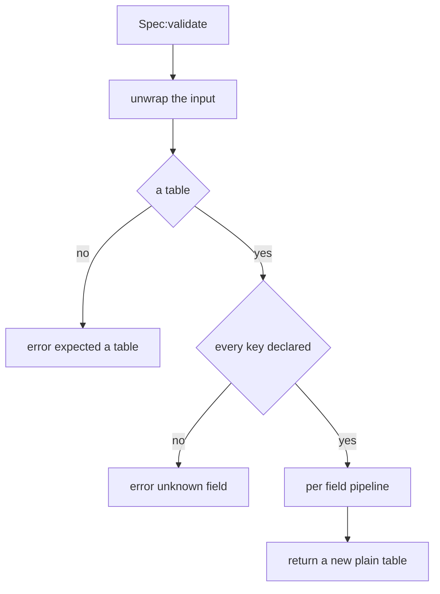
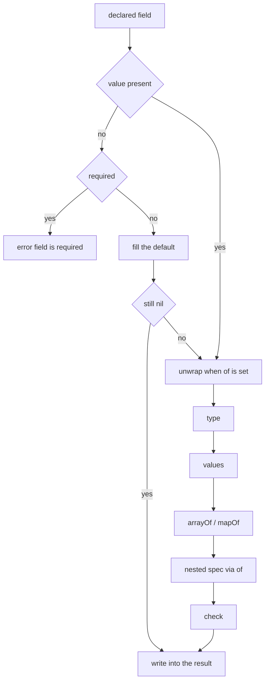
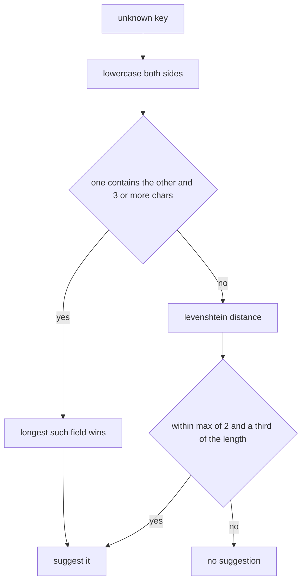

## What you can do after this page

- Write a pal, an item or a building and have the game accept it the first time
- Read the message PalForge prints when a definition is wrong, and change the exact line it names
- Ask the game, while it is running, which fields a pal or a building takes
- Reuse one model across several pals instead of writing it out again
- Check your own pack's settings the same way, so a typo stops at load instead of mid-game

Every `X{ ... }` call — `Pal{ ... }`, `Item{ ... }`, `Building{ ... }` and the rest — is
checked against a list of allowed fields before anything reaches the game. When everything
fits, you get your definition back. When it does not, the call stops and raises a message
that names the domain (the kind of thing you were defining), the field, and the reason.
A definition never half-succeeds: either all of it is registered or none of it is.

The message carries no file name or line number in front of it. It lands in the UE4SS log —
the text file the mod loader writes while the game runs — as one line you can search for.

## What a field list looks like

Each domain writes down the fields it accepts, once, as plain data. Here is the real list
for a mesh (the 3D model attached to a pal or a building). It shows every key you can put
on a field in one place.

```lua title="Scripts/palforge/api/mesh.lua"
local schema = require("palforge.core.schema")

local Spec = schema.define("Mesh.Spec", {
    { "id",        type = "string", check = schema.nonEmpty,
                   doc = "mesh id, e.g. \"pack:name\" (required when defined directly; omit when inline)" },
    { "kind",      type = "string", values = { "procedural", "static", "skeletal", "obj" },
                   default = "skeletal", doc = "which core.mesh backend renders it" },
    { "model",     type = "string", required = true, doc = "USkeletalMesh / UStaticMesh asset path" },
    { "animClass", type = "string", doc = "ABP_*_C animation blueprint path (skeletal only)" },
    { "scale",     type = "number", doc = "uniform scale applied to the attached mesh" },
    { "offset",    type = "table",  doc = "{ x, y, z } offset from the pawn's origin" },
    { "texture",   type = "string", doc = "absolute path to a png applied to the mesh" },
    { "color",     type = "table",  doc = "tint { r, g, b, a } in 0..1" },
    { "material",  type = "string", doc = "base material asset path to instance from" },
    { "params",    type = "table",  doc = "extra material parameters passed through" },
}, { handle = "Mesh.Handle" })
```

The field name is the **first item** in each row. Everything else is a named key on that
same row.

`fields` is an array, not a map, so the order you write is the order you get back — it
drives `:help()` and the completions your editor shows.

`schema.define(name, fields, opts)` hands back a spec object with this surface:

```lua
Spec:validate(t, context)   -- a validated COPY with defaults filled; raises on any problem
Spec:help()                 -- the printable field list, one line per field
Spec:field("model")         -- one field descriptor by name, or nil
Spec.fields                 -- the ordered array of descriptors
Spec.name                   -- "Mesh.Spec"
Spec.handle                 -- "Mesh.Handle", or nil
```

Every `X{ ... }` call runs its own list first, then builds the definition out of the copy
it gets back:

```lua title="Scripts/palforge/api/pal.lua"
local function define(spec)
    spec = Spec:validate(spec, "Pal")
    -- spec is now a fresh plain table: unknown keys are impossible, defaults are filled
    ...
end
```

The second argument is the name printed at the front of every message from that call.
Passing `"Pal"` is why you read `PalForge: Pal: ...` and not `PalForge: Pal.Spec: ...`.
Leave it out and the shape's own name is used.

<Callout type="info">
Shape names are unique across everything declared. Asking for `"Pal.Spec"` a second time
raises `PalForge: schema.define: "Pal.Spec" is already declared`, so pick a name nothing
else uses when you declare a shape of your own.
</Callout>

## What you can put on a field

A field row holds its name plus up to ten keys. These are all of them.

<TypeTable
  type={{
    type: {
      description: 'string, number, boolean, table or function — or a union written with a pipe, such as table|function. Omit to accept anything.',
      type: 'string',
    },
    required: {
      description: 'Raise when the field is absent. Checked before the default is applied.',
      type: 'boolean',
      default: 'false',
    },
    default: {
      description: 'Value used when the field is absent. A function default is called to build a fresh value.',
      type: 'any',
    },
    values: {
      description: 'The value must be equal to one of these, compared with ==.',
      type: 'any[]',
    },
    of: {
      description: 'Validate the value against a nested spec. The nested result replaces the input.',
      type: 'Spec',
    },
    arrayOf: {
      description: 'Every element in the array part must satisfy this type notation.',
      type: 'string',
    },
    mapOf: {
      description: 'Every value in the table must satisfy this type notation.',
      type: 'string',
    },
    doc: {
      description: 'One-line description. Feeds :help() and the generated type definitions.',
      type: 'string',
    },
    sig: {
      description: 'LuaLS signature for a function field. Validation ignores it entirely.',
      type: 'string',
    },
    check: {
      description: 'Extra predicate. Return false plus a reason string to reject. Runs last.',
      type: 'fun(v): boolean, string?',
    },
  }}
/>

### type

The notation is a plain string. Write a union with a pipe, and the value passes when it
matches any one alternative.

```lua
{ "maxStack", type = "number" }                    -- Item.Spec
{ "state",    type = "table|function" }            -- Building.Spec
{ "icon" }                                         -- no type: anything is accepted
```

A **table you can call stands in for a function** wherever `"function"` is expected, so a
table with a `__call` metamethod passes as an event handler:

```lua
local counter = setmetatable({ n = 0 }, {
    __call = function(self, pal, ctx) self.n = self.n + 1 end,
})

Pal{ id = "example:Boss", events = { onSpawned = counter } }   -- accepted
```

### required

Checked only when you left the field out, and before `default` is looked at, so a field is
never both required and defaulted.

```lua
{ "model", type = "string", required = true, doc = "USkeletalMesh / UStaticMesh asset path" }
```

`id` is required on every domain. `Mesh.Spec` is the one place it is optional, because a
mesh written inline inside a pal or a building has nothing to name. Write `Mesh{ ... }` on
its own and you still need an id: `api/mesh` checks for it separately, right after the
field list runs.

### default

A default fills a field you left out. The filled value then goes through the same type,
`values`, `arrayOf`/`mapOf`, `of` and `check` steps as a value you wrote yourself.

```lua
{ "kind",         type = "string", default = "skeletal" }   -- Mesh.Spec
{ "tickInterval", type = "number", default = 1 }            -- Building.Spec
{ "stackable",    type = "boolean", default = false }       -- Effect.Spec
```

A function default is **called**, so each definition gets a fresh value of its own instead
of sharing one table:

```lua
{ "tags", type = "table", default = function() return {} end }
```

None of PalForge's own field lists use a function default today, but yours can.
`Spec:help()` prints `default=` only for a plain value, and skips the line for a function.

### values

The value has to equal one of the entries. They are compared with `==`, in order.

```lua
{ "kind",     type = "string", values = { "procedural", "static", "skeletal", "obj" } }  -- Mesh.Spec
{ "category", type = "string",
              values = { "material", "consumable", "equipment", "ammo", "ingredient", "other" } }  -- Item.Spec
{ "kind",     type = "string", values = { "active", "passive" } }                        -- Skill.Spec
{ "kind",     type = "string", values = { "se", "bgm" } }                                -- Audio.Spec
```

### of

The value is checked against another shape, and the **checked copy replaces it** in the
result. The message grows to name the inner shape, so a complaint about a field inside a
nested table tells you which list to go and read.

```lua
{ "mesh",   type = "table", of = Mesh,   doc = "the mesh attached to a spawned pawn" }
{ "events", type = "table", of = Events, doc = "lifecycle handlers (grouped)" }
{ "recipe", type = "table", of = Recipe, doc = "the recipe that produces THIS item" }
```

### arrayOf

Every element of the **array part** is type-checked with `ipairs`, and the index becomes
part of the field name in the message.

```lua
{ "skills",   type = "table", arrayOf = "string" }   -- Pal.Spec
{ "buildIds", type = "table", arrayOf = "string" }   -- Building.Spec
```

```lua
Pal{ id = "example:Boss", skills = { "example:Fire", "example:Gust" } }   -- fine
```

Because it walks `ipairs`, a string key sitting inside an `arrayOf` table is never visited.
Only the run of numbered entries is checked.

### mapOf

Every value in the table is type-checked with `pairs`, and the key becomes part of the
field name in the message. The array part is visited too, so `materials = { "Wood" }`
reports `materials.1`.

```lua
{ "materials", type = "table", mapOf = "number", required = true,
               doc = "{ <itemId> = <count> } consumed by one craft" }   -- Item.Spec.Recipe
```

```lua
Item{
    id     = "example:Torch",
    recipe = { materials = { Wood = 3, Stone = 1 }, count = 2, station = "Workbench" },
}
```

### doc

One line, shown by `Spec:help()` and written as the trailing comment on the generated
`---@field` line your editor reads. Validation uses it in exactly one place: the "is
required" message quotes it in parentheses. A failing `check` quotes the check's own
reason instead, never the doc.

### sig

The signature LuaLS — the Lua language server behind editor completion — shows for a
function field. **Validation ignores it completely.** Only `tools/gen-types.lua` reads it,
and only to write a better type into `types.lua`.

```lua
{ "onSpawned", type = "function", sig = "fun(self: Pal.Handle, ctx: table)",
               doc = "LIVE (candidate hook) - finished spawning into the world" }
```

### check

A test of your own that runs **after** everything else, including nested `of`. Return
`true` to accept. Return `false` plus a reason string to reject, and that reason is quoted
back in the message.

`schema.nonEmpty` is the shared one, used by the `id` field of every domain:

```lua title="Scripts/palforge/core/schema.lua"
function M.nonEmpty(v)
    if type(v) == "string" and #v > 0 then return true end
    return false, "must be a non-empty string"
end
```

Your own check follows the same contract:

```lua
{ "packId", type = "string", check = function(v)
      if v:find(":", 1, true) then return true end
      return false, "must be namespaced as pack:name"
  end },
```

## One more option: handle

The third argument to `schema.define` takes one key today.

<TypeTable
  type={{
    handle: {
      description: 'The handle type that also satisfies this shape, through the __spec metafield. Types-only: validation already accepts a handle, this is what tells the editor so.',
      type: 'string',
    },
  }}
/>

```lua
}, { handle = "Mesh.Handle" })
```

Declare it once on the shape and every field pointing at that shape through `of` shows the
union in your editor without restating it — `Pal.Spec.mesh` becomes
`Mesh.Spec|Mesh.Handle`. A derived shape inherits the base's `handle`, so
`Building.Spec.Mesh` reports `Mesh.Handle` too.

## What happens when you call a definition

`Spec:validate(t, context)` never changes the table you passed in. It returns a **new plain
table**, so nothing downstream can tell a built value from a hand-written one.



A `nil` input counts as an empty table, so required fields still fail. Every key is checked
before any field is examined, which is why a typo is reported even when the rest of the
definition is broken too. A key that is not a string is rejected on sight, before the walk
tries to match it against a declared name.

Each declared field then runs the same steps, in this exact order:



Two things follow from that order:

- The unwrap for `of` happens **before** the type check, so a handle passed where a table
  is declared is already a plain table by the time `type` is tested.
- `check` sees the value **after** nesting, so a check on a field with `of` receives the
  validated copy, not the raw input.

The copy is one level deep. A nested `of` shape is re-checked into a fresh table, but a
plain `table` field such as `data`, `color` or `offset` is carried across by reference —
the table you wrote is the table the definition holds.

```lua
local payload = { charges = 3 }
local pal = Pal{ id = "example:Boss", data = payload }
payload.charges = 5   -- the definition sees 5: `data` is not deep-copied
```

## What you will see when you get it wrong

Here is every message a definition can raise, the code that causes it, and what to change.
Each block of plain text is exactly what the game prints, so you can copy a phrase out of it
straight into a log search.

### Not a table

```lua
Pal("example:Boss")
```

```text
PalForge: Pal: expected a table, got string. Fields: id, name, description, skills, mesh, material, color, texture, icon, events, data
```

Fix: pass a table. Write `Pal{ id = "example:Boss" }` with braces, not parentheses.

### A non-string key

```lua
Pal{ id = "example:Boss", [1] = "x" }
```

```text
PalForge: Pal: keys must be strings, got a number key
```

Fix: give every entry a name. A bare value inside the braces becomes entry `1`.

### Unknown field, with a did-you-mean

```lua
Pal{ id = "example:Boss", meshSpec = { model = "/Game/X" } }
```

```text
PalForge: Pal: unknown field "meshSpec" (did you mean "mesh"?). Valid fields: id, name, description, skills, mesh, material, color, texture, icon, events, data
```

```lua
Building{ id = "example:Bench", tickInverval = 4 }
```

```text
PalForge: Building: unknown field "tickInverval" (did you mean "tickInterval"?). Valid fields: id, name, description, gridCm, buildIds, tickInterval, mesh, material, color, texture, icon, state, events, data
```

Fix: rename the field to the suggestion.

### Unknown field, no candidate close enough

```lua
Pal{ id = "example:Boss", zzzzzzzzzz = 1 }
```

```text
PalForge: Pal: unknown field "zzzzzzzzzz". Valid fields: id, name, description, skills, mesh, material, color, texture, icon, events, data
```

Fix: the accepted names are listed after `Valid fields:`. Pick the one you meant.

### Missing required field

```lua
Pal{ name = "Boss" }
```

```text
PalForge: Pal: field "id" is required (pal id: a game CharacterID ("ChickenPal") or "pack:name")
```

Fix: add the field. The text in parentheses is that field's `doc`, and it tells you what
belongs there — here, either a game id or `"pack:name"`. When a field has no `doc`, its
`type` is printed instead, then `any`.

### Wrong type

```lua
Pal{ id = "example:Boss", name = 42 }
```

```text
PalForge: Pal: field "name" expects string, got number
```

A union is reported verbatim:

```lua
Building{ id = "example:Bench", state = "uses" }
```

```text
PalForge: Building: field "state" expects table|function, got string
```

Fix: give the field a value of a type it lists. `state = { uses = 0 }` or
`state = function() return { uses = 0 } end`.

### Value outside `values`

```lua
Mesh{ id = "example:body", model = "/Game/X", kind = "rigid" }
```

```text
PalForge: Mesh: field "kind" must be one of { "procedural", "static", "skeletal", "obj" }, got "rigid"
```

```lua
Skill{ id = "example:Fire", kind = "ultimate" }
```

```text
PalForge: Skill: field "kind" must be one of { "active", "passive" }, got "ultimate"
```

Fix: use one of the values in the braces. They are the only ones accepted.

### Bad `arrayOf` element

The index is folded into the field name, so the whole path sits inside one pair of quotes.

```lua
Pal{ id = "example:Boss", skills = { "example:Fire", 3 } }
```

```text
PalForge: Pal: field "skills[2]" expects string, got number
```

Fix: `skills[2]` is the second entry in the list. Correct that entry.

### Bad `mapOf` value

```lua
Item{ id = "example:Torch", recipe = { materials = { Wood = "three" } } }
```

```text
PalForge: Item: field "recipe" (Item.Spec.Recipe): field "materials.Wood" expects number, got string
```

An array element in a `mapOf` table is reported by its numeric key:

```lua
Item{ id = "example:Torch", recipe = { materials = { "Wood" } } }
```

```text
PalForge: Item: field "recipe" (Item.Spec.Recipe): field "materials.1" expects number, got string
```

Fix: `materials` is `{ <itemId> = <count> }`, so write `materials = { Wood = 3 }`.

### Failing `check`

```lua
Pal{ id = "" }
```

```text
PalForge: Pal: field "id" is invalid: must be a non-empty string
```

Fix: the text after the colon is the reason the check returned. When a check returns
`false` on its own, the message ends in `failed check` instead.

### Nested spec errors name the inner shape

The message builds up in order: the outer domain, the outer field, the inner shape's name,
then the inner complaint. Read it from the right — the last part is what to change.

```lua
Pal{ id = "example:Boss", mesh = { kind = "skeletal" } }
```

```text
PalForge: Pal: field "mesh" (Mesh.Spec): field "model" is required (USkeletalMesh / UStaticMesh asset path)
```

```lua
Building{ id = "example:Bench", mesh = { model = "/Game/X", colour = { 1, 0, 0, 1 } } }
```

```text
PalForge: Building: field "mesh" (Building.Spec.Mesh): unknown field "colour" (did you mean "color"?). Valid fields: id, kind, model, animClass, scale, offset, texture, color, material, params
```

The `events` group is a nested shape like any other, so a misspelled handler name is an
error rather than a handler that silently never runs:

```lua
Pal{ id = "example:Boss", events = { onSpawn = function(pal, ctx) end } }
```

```text
PalForge: Pal: field "events" (Pal.Spec.Events): unknown field "onSpawn" (did you mean "onSpawned"?). Valid fields: onSpawned, onDamaged, onDeath, onCaptured, onTick
```

```lua
Building{ id = "example:Bench", events = { onPlace = "hello" } }
```

```text
PalForge: Building: field "events" (Building.Spec.Events): field "onPlace" expects function, got string
```

Fix: the name in `(...)` is the shape to look up with `schema.help`, and the valid names
are listed at the end of the line.

## How the suggestion is picked

An unknown field always tries to name the field you meant, so a misspelling is caught the
moment you load the pack.



**A name that contains a real field name wins over one that is merely spelled close.** The
most common slip is a decorated name — `meshSpec` for `mesh`, `iconPath` for `icon` —
which reads as obvious to you but is several edits away from the real field. Containment is
tested in both directions, so a prefix, a suffix and a plural all match. Only declared
names of three characters or more take part, so a two-letter field like `id` cannot swallow
half the declaration.

When nothing contains anything, the Levenshtein distance decides — how many single-letter
edits apart the two names are. Only a genuinely close match is accepted: the limit is
`max(2, floor(#name / 3))`.

Both stages compare in lowercase, so a capitalisation slip is caught too.

| You wrote | Suggested | Why |
| --- | --- | --- |
| `meshSpec` | `mesh` | contains `mesh` |
| `iconPath` | `icon` | contains `icon` |
| `displayName` | `name` | contains `name` |
| `textures` | `texture` | contains `texture` |
| `durationSeconds` | `duration` | contains `duration` |
| `Description` | `description` | contains `description` once lowercased |
| `nam` | `name` | `name` contains `nam` — containment runs both ways |
| `tickInverval` | `tickInterval` | distance 1 |
| `sound` | `soundPath` | contains `sound` |
| `zzzzzzzzzz` | none | nothing within the distance threshold |

<Callout type="warn">
For a very short unknown key the limit is a flat 2, so the suggestion can be a coincidence
rather than an insight — `Pal{ xy = 1 }` suggests `"id"`. Treat a suggestion on a two- or
three-character key as a hint, not an answer.
</Callout>

## Putting one definition inside another

A nested shape can be written inline, or passed as the object a define call returned:

```lua
-- inline
Pal{ id = "example:Boss", mesh = { model = "/Game/Pal/Model/Character/Monster/ChickenPal/SK_ChickenPal" } }

-- as a named definition
local body = Mesh{
    id      = "example:body",
    model   = "/Game/Pal/Model/Character/Monster/ChickenPal/SK_ChickenPal",
    texture = "C:/mods/example/body.png",
}

Pal{ id = "example:Boss", mesh = body }
Pal{ id = "example:Add",  mesh = Mesh.get("example:body") }
```

Both reach the nested shape the same way. A handle whose metatable carries `__spec` is
swapped for the table it stands for before anything is checked:

```lua title="Scripts/palforge/core/schema.lua"
local function unwrap(v)
    if type(v) ~= "table" then return v end
    local mt = getmetatable(v)
    local tospec = mt and rawget(mt, "__spec")
    if type(tospec) == "function" then return tospec(v) end
    return v
end
```

```lua title="Scripts/palforge/api/mesh.lua"
Handle.__spec = function(self) return self._cls:source() end
```

The swap happens at two points — on the whole input at the top of `validate`, and per field
whenever `of` is set — so `Spec:validate(someHandle)` works as well as `mesh = someHandle`.

Because the nested value is then checked again, what the outer definition holds is a
**copy**. You cannot reach the mesh definition through the pal wearing it:

```lua
local body = Mesh{ id = "example:body", model = "/Game/X/SK_X" }
local pal  = Pal{ id = "example:Boss", mesh = body }

pal:mesh().scale = 4     -- mutates the pal's copy, not the "example:body" definition
```

<Callout type="warn">
`Mesh.Handle` is the only handle that carries `__spec` today. Pal, item, building, skill,
effect, audio and UI handles do not, so passing one of those into another definition is
checked as a raw table and fails on its unknown keys. Write the nested part inline instead.
</Callout>

<Callout type="warn">
A default only fills an **absent** field. `Mesh{ ... }` has already filled
`kind = "skeletal"`, so nesting that handle into a building keeps `skeletal` even though
`Building.Spec.Mesh` defaults `kind` to `"static"`. Write `kind = "static"` on the mesh, or
declare the building's mesh inline, when you want the building policy.
</Callout>

## Reusing a field list with different defaults

`schema.derive(name, base, overrides)` declares a new shape as a copy of another with
per-field policy replaced. Each field is copied whole, then the matching override table is
merged over it.

Buildings do this with the mesh:

```lua title="Scripts/palforge/api/building.lua"
local Mesh = schema.derive("Building.Spec.Mesh", schema.get("Mesh.Spec"), {
    kind   = { default = "static" },
    model  = { doc = "UStaticMesh asset path, or an OBJ path for the procedural backend" },
    offset = { doc = "{ x, y, z } offset from the actor's origin" },
})
```

A building is a static mesh where a pal is a skeletal one, so only that default changes.
The ten fields, their types, `model` being required and the `Mesh.Handle` option all come
across untouched, and a field added to `Mesh.Spec` later reaches buildings as well.

The difference shows in the two help dumps:

```text
Mesh.Spec {
  kind          string     (default=skeletal, one of { "procedural", "static", "skeletal", "obj" }) which core.mesh backend renders it
  model         string     (required) USkeletalMesh / UStaticMesh asset path
  ...
}

Building.Spec.Mesh {
  kind          string     (default=static, one of { "procedural", "static", "skeletal", "obj" }) which core.mesh backend renders it
  model         string     (required) UStaticMesh asset path, or an OBJ path for the procedural backend
  ...
}
```

Any key can be overridden, not only `default` — the merge copies whatever keys the override
table holds. An override naming a field the base does not declare is caught immediately:

```lua
schema.derive("Test.Spec", schema.get("Mesh.Spec"), { kindd = { default = "x" } })
```

```text
schema.derive(Test.Spec): "kindd" is not a field of Mesh.Spec
```

<Callout type="info">
`derive` goes through `define`, so the new name must still be free — taking one twice
raises `PalForge: schema.define: "Test.Spec" is already declared` with no file and line.
Two other checks use `assert`: the base must be a spec built by `schema.define`, and an
override must name a field the base declares. Those two arrive prefixed with
`core/schema.lua`'s own file and line, so the text above is the tail of the message, not
the whole line.
</Callout>

## Asking the game what a shape takes

Every shape is recorded under its name as it is declared, and you can read it back while
the game is running.

```lua
local schema = require("palforge.core.schema")

schema.get("Pal.Spec")          -- the spec object, or nil
schema.get("Pal.Spec").fields   -- the ordered descriptors, for tooling
schema.help("Pal.Spec")         -- the printable field list
schema.all()                    -- every declared spec, in declaration order
```

`schema.help(name)` is the runtime answer to "what can I pass here?":

```lua
print(schema.help("Pal.Spec"))
```

```text
Pal.Spec {
  id            string     (required) pal id: a game CharacterID ("ChickenPal") or "pack:name"
  name          string     shown in UI (defaults to id)
  description   string     one-line description, for UI and tooling
  skills        table      (string[]) skill ids this pal owns (see Skill)
  mesh          table      (Mesh.Spec) the mesh attached to a spawned pawn (inline, or a Mesh{ ... } handle)
  material      table      (Pal.Spec.Material) material override applied to that mesh
  color         table      base tint { r, g, b, a } (shorthand for material.color)
  texture       string     png path applied to the mesh (shorthand for material.texture)
  icon          any        fallback icon used when the DataTable lookup misses
  events        table      (Pal.Spec.Events) lifecycle handlers (grouped)
  data          table      free-form payload of your own, carried onto the definition
}
```

The marks in parentheses come in a fixed order: `required`, then `default=<value>` for a
plain default, then `one of { ... }`, then the nested shape's name, then `<type>[]` for
`arrayOf`, then `map of <type>` for `mapOf`. A field with no marks prints just its name,
type and doc.

A name that is not declared does **not** raise. You get back a string listing every
declared name, sorted — useful when you cannot remember the exact spelling:

```lua
print(schema.help("Pal.Specc"))
```

```text
PalForge: no spec named "Pal.Specc". Declared: Audio.Spec, Building.Spec, Building.Spec.Events, Building.Spec.Material, Building.Spec.Mesh, Coord, Effect.Spec, Effect.Spec.Events, Item.Spec, Item.Spec.Events, Item.Spec.Recipe, Mesh.Spec, Pal.Spec, Pal.Spec.Events, Pal.Spec.Material, Skill.Spec, Skill.Spec.Events, UI.Spec
```

`schema.all()` returns a fresh list in **declaration order**, not sorted. A nested shape is
always declared before the shape that references it, which is what lets the type generator
emit each class before it is used:

```lua
for _, spec in ipairs(schema.all()) do
    print(spec.name, spec.handle)
end
```

```text
Mesh.Spec            Mesh.Handle
Pal.Spec.Material    nil
Pal.Spec.Events      nil
Pal.Spec             nil
Item.Spec.Recipe     nil
Item.Spec.Events     nil
Item.Spec            nil
Building.Spec.Mesh   Mesh.Handle
Building.Spec.Material nil
Building.Spec.Events nil
Building.Spec        nil
Skill.Spec.Events    nil
Skill.Spec           nil
Effect.Spec.Events   nil
Effect.Spec          nil
Audio.Spec           nil
UI.Spec              nil
Coord                nil
```

`Coord` is the one shape with no domain in front of its name. It is the world coordinate
`Player.coordinate()` gives you and `Pal.Handle:spawn` takes, declared in `api/player.lua`
so that `schema.help("Coord")` and your editor both know its fields.

## Field lists in your editor

`Scripts/palforge/types.lua` is generated from the declared shapes by `tools/gen-types.lua`:

```bash
lua5.4 tools/gen-types.lua
```

It is annotations only — nothing requires it at runtime. LuaLS just has to see it in the
workspace for `Pal{ ... }` to complete every field with its doc.

Each field maps to an editor type by the first rule that applies:

| Descriptor | Emitted type |
| --- | --- |
| `of = Inner` | `Inner.Spec`, plus `\|Inner.Handle` when the inner spec declared a `handle` |
| `values = { ... }` | an alias named after the spec and field, e.g. `Mesh.Spec.Kind` |
| `sig = "fun(...)"` | the signature verbatim |
| `arrayOf = "string"` | `string[]` |
| `mapOf = "number"` | `table<string, number>` |
| no `type` | `any` |
| otherwise | the `type` string as written |

`required` decides whether the field gets a `?`, and a plain `default` is appended to the
doc comment. The result for `Pal.Spec`:

```lua title="Scripts/palforge/types.lua"
---@class Pal.Spec
---@field id string # pal id: a game CharacterID ("ChickenPal") or "pack:name"
---@field name? string # shown in UI (defaults to id)
---@field description? string # one-line description, for UI and tooling
---@field skills? string[] # skill ids this pal owns (see Skill)
---@field mesh? Mesh.Spec|Mesh.Handle # the mesh attached to a spawned pawn (inline, or a Mesh{ ... } handle)
---@field material? Pal.Spec.Material # material override applied to that mesh
---@field color? table # base tint { r, g, b, a } (shorthand for material.color)
---@field texture? string # png path applied to the mesh (shorthand for material.texture)
---@field icon? any # fallback icon used when the DataTable lookup misses
---@field events? Pal.Spec.Events # lifecycle handlers (grouped)
---@field data? table # free-form payload of your own, carried onto the definition
```

The `handle` option is what puts `|Mesh.Handle` on the `mesh` field, and `Mesh.Spec.Kind`
is the alias generated from that shape's `values` list:

```lua title="Scripts/palforge/types.lua"
---@alias Mesh.Spec.Kind "procedural"|"static"|"skeletal"|"obj"
```

Re-run the generator whenever a shape changes, and what your editor offers stays the same
as what a definition actually accepts.

## Recipes

### Print any shape while the game is running

```lua title="content/dev.lua"
local schema = require("palforge.core.schema")
local log    = require("palforge.utils.log").scope("dev")

-- one shape
log.info(schema.help("Building.Spec"))

-- the shapes a building definition can reach
for _, name in ipairs({ "Building.Spec", "Building.Spec.Mesh",
                        "Building.Spec.Material", "Building.Spec.Events" }) do
    log.info(schema.help(name))
end
```

### Dump every declared shape to the UE4SS log

```lua title="content/dev.lua"
local schema = require("palforge.core.schema")
local log    = require("palforge.utils.log").scope("schema")

for _, spec in ipairs(schema.all()) do
    log.info(spec:help())
end
```

### Build your own reference table from the descriptors

```lua title="content/dev.lua"
local schema = require("palforge.core.schema")

local function describe(specName)
    local spec = schema.get(specName)
    if not spec then return print(schema.help(specName)) end

    print(spec.name)
    for _, f in ipairs(spec.fields) do
        local flags = {}
        if f.required then flags[#flags + 1] = "required" end
        if f.default ~= nil then flags[#flags + 1] = "default=" .. tostring(f.default) end
        if f.values then flags[#flags + 1] = "enum" end
        if f.of then flags[#flags + 1] = f.of.name end
        if f.check then flags[#flags + 1] = "checked" end
        print(string.format("  %-13s %-14s %-22s %s",
            f.name, f.type or "any", table.concat(flags, ","), f.doc or ""))
    end
end

describe("Item.Spec")
describe("Item.Spec.Recipe")
```

### Validate your own pack's config the same way

`schema.define` is not reserved for PalForge's own domains. Declare your pack's own shape
and a typo in your settings stops at load, with the same message and the same
did-you-mean. Pick a name no other shape uses.

```lua title="content/config.lua"
local schema = require("palforge.core.schema")

local Config = schema.define("ExamplePack.Config", {
    { "reward",     type = "string", required = true, check = schema.nonEmpty,
                    doc = "item id handed out when the boss dies" },
    { "rewardCount", type = "number", default = 5, doc = "how many of it" },
    { "biome",      type = "string", values = { "forest", "desert", "volcano" },
                    default = "forest", doc = "where the boss appears" },
    { "spawnAt",    type = "table", of = schema.get("Coord"),
                    doc = "fixed spawn point; omit to spawn near the player" },
})

---@param opts table
local function setup(opts)
    local cfg = Config:validate(opts, "ExamplePack")

    Pal{
        id     = "example:Boss",
        name   = "Example Boss",
        events = {
            onDeath = function(pal, ctx)
                Item.get(cfg.reward):give(cfg.rewardCount)
            end,
        },
    }
end

setup{ reward = "Wood", rewardCount = 10, biome = "volcano" }
```

A typo then behaves exactly like a typo in a `Pal{ ... }` call:

```lua
setup{ reward = "Wood", rewardCounts = 10 }
```

```text
PalForge: ExamplePack: unknown field "rewardCounts" (did you mean "rewardCount"?). Valid fields: reward, rewardCount, biome, spawnAt
```

### Fail loudly at load, not silently in game

A bad definition raises, which stops the file it is in. Wrap a content file in one `pcall`
at the top level and log the message: the rest of your pack still loads, and the reason is
in the log word for word.

```lua title="content/pals.lua"
local log = require("palforge.utils.log").scope("example")

local ok, err = pcall(function()
    Pal{
        id          = "ChickenPal",
        name        = "Reskinned Chicken",
        description = "vanilla chicken with a new coat",
        mesh        = Mesh{
            id      = "example:chicken",
            model   = "/Game/Pal/Model/Character/Monster/ChickenPal/SK_ChickenPal",
            texture = "C:/mods/example/chicken.png",
        },
        events = {
            onSpawned = function(pal, ctx) pal:renderOn(ctx.actor) end,
        },
    }
end)

if not ok then log.err(tostring(err)) end
```

## Summary

- Every `X{ ... }` call is checked before anything is registered. It either succeeds whole
  or raises and registers nothing.
- `id` is required on every domain. A field you leave out is either optional or filled by
  its default.
- A misspelled field name is an error, and the message usually names the field you meant.
- Every message starts with `PalForge: `, then the domain, then the field, then the reason.
  When a shape name appears in `(...)`, that is the inner list to look up.
- `print(schema.help("Pal.Spec"))` prints every field of a shape while the game runs, and a
  wrong name prints the list of names instead of raising.
- A `Mesh{ ... }` handle can be nested into a pal or a building, and the outer definition
  keeps a copy of it.

Next, [Lifecycle](/docs/concepts/lifecycle) shows which of the handlers you can write in
`events` actually run in the game.

<Cards>
  <Card title="Pal" href="/docs/api/pal">Every field a pal takes</Card>
  <Card title="Mesh" href="/docs/api/mesh">Models, and the handle you can nest into other definitions</Card>
  <Card title="Building" href="/docs/api/building">The building mesh, and the live instance your handlers get</Card>
  <Card title="Lifecycle" href="/docs/concepts/lifecycle">Which hooks in the events group actually fire</Card>
</Cards>
