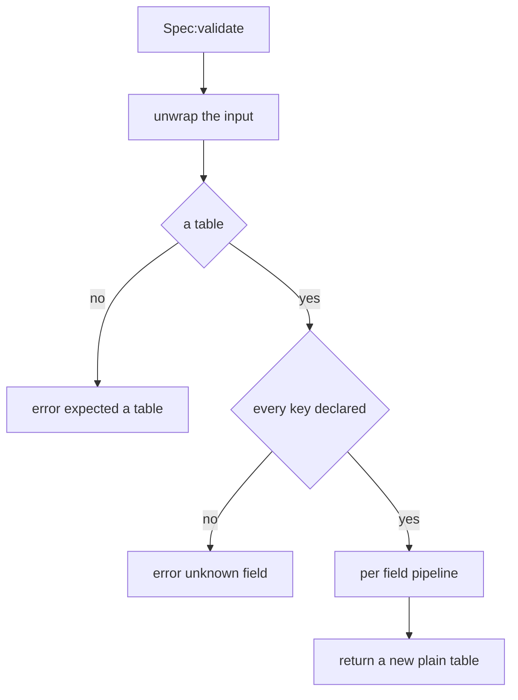
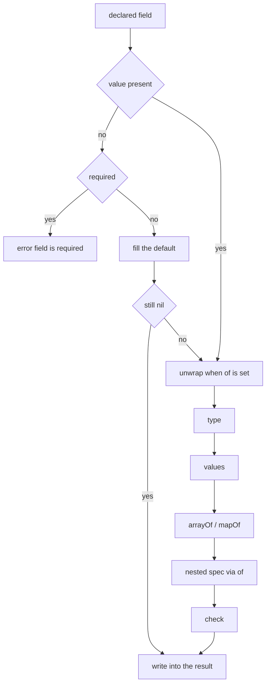
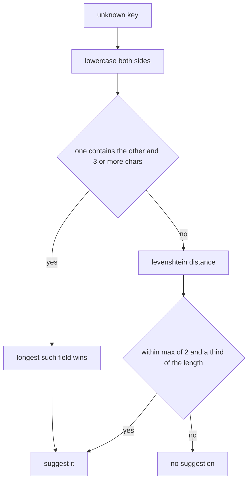

Every `X{ ... }` call in PalForge is checked against a declared shape before anything is
registered. The mechanism is one file, `Scripts/palforge/core/schema.lua`. It holds no
type definitions of its own: each api module declares its own shapes, and this file turns
a declaration into something that validates, fills defaults and documents itself.

Validation is strict. Any problem is a hard error raised with `error(msg, 0)`, so the
message carries no file and line prefix — it names the domain, the field and the reason,
and it appears in the UE4SS log exactly as written. A define call never half-succeeds.

## Declaring a shape

`schema.define(name, fields, opts)` builds a spec. `fields` is an **array** of field
descriptors, not a map, so declaration order is preserved — that order drives `:help()`
and the generated editor types.

This is the real declaration from `Scripts/palforge/api/mesh.lua`, which puts `type`,
`values`, `default`, `required`, `check` and `doc` in one place:

```lua title="Scripts/palforge/api/mesh.lua"
local schema = require("palforge.core.schema")

local Spec = schema.define("Mesh.Spec", {
    { "id",        type = "string", check = schema.nonEmpty,
                   doc = "mesh id, e.g. \"pack:name\" (required when defined directly; omit when inline)" },
    { "kind",      type = "string", values = { "procedural", "static", "skeletal", "obj" },
                   default = "skeletal", doc = "which core.mesh backend renders it" },
    { "model",     type = "string", required = true, doc = "USkeletalMesh / UStaticMesh asset path" },
    { "animClass", type = "string", doc = "ABP_*_C animation blueprint path (skeletal only)" },
    { "scale",     type = "number", doc = "uniform scale applied to the attached mesh" },
    { "offset",    type = "table",  doc = "{ x, y, z } offset from the pawn's origin" },
    { "texture",   type = "string", doc = "absolute path to a png applied to the mesh" },
    { "color",     type = "table",  doc = "tint { r, g, b, a } in 0..1" },
    { "material",  type = "string", doc = "base material asset path to instance from" },
    { "params",    type = "table",  doc = "extra material parameters passed through" },
}, { handle = "Mesh.Handle" })
```

The field name is the descriptor's **first positional element**. Everything else is a
named key on the same table.

`schema.define` returns a spec object with this surface:

```lua
Spec:validate(t, context)   -- a validated COPY with defaults filled; raises on any problem
Spec:help()                 -- the printable field list, one line per field
Spec:field("model")         -- one field descriptor by name, or nil
Spec.fields                 -- the ordered array of descriptors
Spec.name                   -- "Mesh.Spec"
Spec.handle                 -- "Mesh.Handle", or nil
```

An api module calls `:validate` as the first statement of its define function, then builds
its definition class out of the returned copy:

```lua title="Scripts/palforge/api/pal.lua"
local function define(spec)
    spec = Spec:validate(spec, "Pal")
    -- spec is now a fresh plain table: unknown keys are impossible, defaults are filled
    ...
end
```

The second argument is the context string prepended to every error message. Passing
`"Pal"` is why you read `PalForge: Pal: ...` and not `PalForge: Pal.Spec: ...`. When you
omit it, the spec's own name is used.

<Callout type="info">
Names are globally unique across the whole registry. Declaring `"Pal.Spec"` twice raises
`PalForge: schema.define: "Pal.Spec" is already declared`, so two modules can never claim
the same shape name.
</Callout>

## Field descriptor keys

Eleven things can appear in a descriptor: the positional name, plus these ten keys. There
are no others.

<TypeTable
  type={{
    type: {
      description: 'string, number, boolean, table or function — or a union written with a pipe, such as table|function. Omit to accept anything.',
      type: 'string',
    },
    required: {
      description: 'Raise when the field is absent. Checked before the default is applied.',
      type: 'boolean',
      default: 'false',
    },
    default: {
      description: 'Value used when the field is absent. A function default is called to build a fresh value.',
      type: 'any',
    },
    values: {
      description: 'The value must be equal to one of these, compared with ==.',
      type: 'any[]',
    },
    of: {
      description: 'Validate the value against a nested spec. The nested result replaces the input.',
      type: 'Spec',
    },
    arrayOf: {
      description: 'Every element in the array part must satisfy this type notation.',
      type: 'string',
    },
    mapOf: {
      description: 'Every value in the table must satisfy this type notation.',
      type: 'string',
    },
    doc: {
      description: 'One-line description. Feeds :help() and the generated type definitions.',
      type: 'string',
    },
    sig: {
      description: 'LuaLS signature for a function field. Validation ignores it entirely.',
      type: 'string',
    },
    check: {
      description: 'Extra predicate. Return false plus a reason string to reject. Runs last.',
      type: 'fun(v): boolean, string?',
    },
  }}
/>

### type

The notation is a plain string. A union is written with a pipe and is satisfied when the
value matches any one alternative.

```lua
{ "maxStack", type = "number" }                    -- Item.Spec
{ "state",    type = "table|function" }            -- Building.Spec
{ "icon" }                                         -- no type: anything is accepted
```

A **callable table stands in for a function** wherever `"function"` is expected, so a
table with a `__call` metamethod passes as an event handler:

```lua
local counter = setmetatable({ n = 0 }, {
    __call = function(self, pal, ctx) self.n = self.n + 1 end,
})

Pal{ id = "example:Boss", events = { onSpawned = counter } }   -- accepted
```

### required

The check happens only when the value is `nil`, and before `default` is consulted, so a
field can never be both required and defaulted in practice.

```lua
{ "model", type = "string", required = true, doc = "USkeletalMesh / UStaticMesh asset path" }
```

`id` is `required = true` on every domain spec. It is optional on `Mesh.Spec` alone,
because a mesh written inline inside another definition has nothing to name — and
`api/mesh` re-checks it by hand after validation, so a directly defined mesh still needs
one.

### default

The default fills an absent field, and the filled value then goes through the same type,
`values`, `arrayOf`/`mapOf`, `of` and `check` steps as a value you wrote yourself.

```lua
{ "kind",         type = "string", default = "skeletal" }   -- Mesh.Spec
{ "tickInterval", type = "number", default = 1 }            -- Building.Spec
{ "stackable",    type = "boolean", default = false }       -- Effect.Spec
```

A function default is **called** to build a fresh value, which is how a mutable default
would avoid being shared between definitions:

```lua
{ "tags", type = "table", default = function() return {} end }
```

No spec in the tree uses a function default today. `Spec:help()` also skips them — it
prints `default=` only for a non-function value.

### values

Membership is tested with `==` against each entry, in order.

```lua
{ "kind",     type = "string", values = { "procedural", "static", "skeletal", "obj" } }  -- Mesh.Spec
{ "category", type = "string",
              values = { "material", "consumable", "equipment", "ammo", "ingredient", "other" } }  -- Item.Spec
{ "kind",     type = "string", values = { "active", "passive" } }                        -- Skill.Spec
{ "kind",     type = "string", values = { "se", "bgm" } }                                -- Audio.Spec
```

### of

The value is validated against another spec, and the **validated copy replaces it** in the
output. The error context grows to name the inner shape, so a complaint about a field
inside a nested table tells you which shape to go and read.

```lua
{ "mesh",   type = "table", of = Mesh,   doc = "the mesh attached to a spawned pawn" }
{ "events", type = "table", of = Events, doc = "lifecycle handlers (grouped)" }
{ "recipe", type = "table", of = Recipe, doc = "the recipe that produces THIS item" }
```

### arrayOf

Every element of the **array part** is type-checked with `ipairs`, and the index becomes
part of the reported field name.

```lua
{ "skills",   type = "table", arrayOf = "string" }   -- Pal.Spec
{ "buildIds", type = "table", arrayOf = "string" }   -- Building.Spec
```

```lua
Pal{ id = "example:Boss", skills = { "example:Fire", "example:Gust" } }   -- fine
```

Because it walks `ipairs`, a string key sitting inside an `arrayOf` table is not visited.
Only the contiguous array part is checked.

### mapOf

Every value in the table is type-checked with `pairs`, and the key becomes part of the
reported field name. The array part is visited too, so `materials = { "Wood" }` reports
`materials.1`.

```lua
{ "materials", type = "table", mapOf = "number", required = true,
               doc = "{ <itemId> = <count> } consumed by one craft" }   -- Item.Spec.Recipe
```

```lua
Item{
    id     = "example:Torch",
    recipe = { materials = { Wood = 3, Stone = 1 }, count = 2, station = "Workbench" },
}
```

### doc

One line, shown by `Spec:help()` and emitted as the trailing comment on the generated
`---@field` annotation. Validation reads it in exactly one place: the "is required"
error quotes it in parentheses. A failing `check` quotes the check's own reason instead,
never the doc.

### sig

The LuaLS signature of a function field. **Validation ignores it completely** — only
`tools/gen-types.lua` reads it, and only to write a better type into `types.lua`.

```lua
{ "onSpawned", type = "function", sig = "fun(self: Pal.Handle, ctx: table)",
               doc = "LIVE (candidate hook) - finished spawning into the world" }
```

### check

A predicate that runs **after** everything else, including nested `of` validation. Return
`true` to accept; return `false` plus a reason string to reject, and the reason is quoted
back in the error.

`schema.nonEmpty` is the one shared check in the tree, used by the `id` field of every
domain:

```lua title="Scripts/palforge/core/schema.lua"
function M.nonEmpty(v)
    if type(v) == "string" and #v > 0 then return true end
    return false, "must be a non-empty string"
end
```

Your own check follows the same contract:

```lua
{ "packId", type = "string", check = function(v)
      if v:find(":", 1, true) then return true end
      return false, "must be namespaced as pack:name"
  end },
```

## Spec options

The third argument to `schema.define` takes exactly one key today.

<TypeTable
  type={{
    handle: {
      description: 'The handle type that also satisfies this shape, through the __spec metafield. Types-only: validation already accepts a handle, this is what tells the editor so.',
      type: 'string',
    },
  }}
/>

```lua
}, { handle = "Mesh.Handle" })
```

Declaring it once at the spec means every field that points at that spec through `of`
gets the union in the generated types without restating it — `Pal.Spec.mesh` becomes
`Mesh.Spec|Mesh.Handle`. A derived spec inherits the base's `handle`, so
`Building.Spec.Mesh` also reports `Mesh.Handle`.

## How validation runs

`Spec:validate(t, context)` never mutates `t`. It returns a **new plain table**, so
nothing downstream can tell a constructed value from a hand-written one.



A `nil` input is treated as an empty table, so required fields still fail. Every key is
rejected before any field is examined, which is why a typo is reported even when the rest
of the definition is also broken. A non-string key is rejected on sight, before the walk
tries to match it against a declared name.

Each declared field then runs the same pipeline, in this exact order:



Two consequences worth holding on to:

- The unwrap for `of` happens **before** the type check, so a handle passed where a table
  is declared is already a plain table by the time `type` is tested.
- `check` sees the value **after** nesting, so a check on a field with `of` receives the
  validated copy, not the raw input.

The copy is one level deep. A nested `of` shape is re-validated into a fresh table, but a
plain `table` field such as `data`, `color` or `offset` is carried across by reference —
the table you wrote is the table the definition holds.

```lua
local payload = { charges = 3 }
local pal = Pal{ id = "example:Boss", data = payload }
payload.charges = 5   -- the definition sees 5: `data` is not deep-copied
```

## Failure modes

Every message below is the literal text raised by the current source.

### Not a table

```lua
Pal("example:Boss")
```

```text
PalForge: Pal: expected a table, got string. Fields: id, name, description, skills, mesh, material, color, texture, icon, events, data
```

### A non-string key

```lua
Pal{ id = "example:Boss", [1] = "x" }
```

```text
PalForge: Pal: keys must be strings, got a number key
```

### Unknown field, with a did-you-mean

```lua
Pal{ id = "example:Boss", meshSpec = { model = "/Game/X" } }
```

```text
PalForge: Pal: unknown field "meshSpec" (did you mean "mesh"?). Valid fields: id, name, description, skills, mesh, material, color, texture, icon, events, data
```

```lua
Building{ id = "example:Bench", tickInverval = 4 }
```

```text
PalForge: Building: unknown field "tickInverval" (did you mean "tickInterval"?). Valid fields: id, name, description, gridCm, buildIds, tickInterval, mesh, material, color, texture, icon, state, events, data
```

### Unknown field, no candidate close enough

```lua
Pal{ id = "example:Boss", zzzzzzzzzz = 1 }
```

```text
PalForge: Pal: unknown field "zzzzzzzzzz". Valid fields: id, name, description, skills, mesh, material, color, texture, icon, events, data
```

### Missing required field

```lua
Pal{ name = "Boss" }
```

```text
PalForge: Pal: field "id" is required (pal id: a game CharacterID ("ChickenPal") or "pack:name")
```

The parenthesised text is the field's `doc`, falling back to its `type` and then to
`any` when there is none.

### Wrong type

```lua
Pal{ id = "example:Boss", name = 42 }
```

```text
PalForge: Pal: field "name" expects string, got number
```

A union is reported verbatim:

```lua
Building{ id = "example:Bench", state = "uses" }
```

```text
PalForge: Building: field "state" expects table|function, got string
```

### Value outside `values`

```lua
Mesh{ id = "example:body", model = "/Game/X", kind = "rigid" }
```

```text
PalForge: Mesh: field "kind" must be one of { "procedural", "static", "skeletal", "obj" }, got "rigid"
```

```lua
Skill{ id = "example:Fire", kind = "ultimate" }
```

```text
PalForge: Skill: field "kind" must be one of { "active", "passive" }, got "ultimate"
```

### Bad `arrayOf` element

The index is folded into the field name, so the whole path sits inside one pair of quotes.

```lua
Pal{ id = "example:Boss", skills = { "example:Fire", 3 } }
```

```text
PalForge: Pal: field "skills[2]" expects string, got number
```

### Bad `mapOf` value

```lua
Item{ id = "example:Torch", recipe = { materials = { Wood = "three" } } }
```

```text
PalForge: Item: field "recipe" (Item.Spec.Recipe): field "materials.Wood" expects number, got string
```

An array element in a `mapOf` table is reported by its numeric key:

```lua
Item{ id = "example:Torch", recipe = { materials = { "Wood" } } }
```

```text
PalForge: Item: field "recipe" (Item.Spec.Recipe): field "materials.1" expects number, got string
```

### Failing `check`

```lua
Pal{ id = "" }
```

```text
PalForge: Pal: field "id" is invalid: must be a non-empty string
```

The text after the colon is the second return value of the check. When a check returns
`false` alone, the message ends in `failed check`.

### Nested spec errors name the inner shape

The context accumulates: the outer domain, the outer field, the inner spec's name, then
the inner complaint.

```lua
Pal{ id = "example:Boss", mesh = { kind = "skeletal" } }
```

```text
PalForge: Pal: field "mesh" (Mesh.Spec): field "model" is required (USkeletalMesh / UStaticMesh asset path)
```

```lua
Building{ id = "example:Bench", mesh = { model = "/Game/X", colour = { 1, 0, 0, 1 } } }
```

```text
PalForge: Building: field "mesh" (Building.Spec.Mesh): unknown field "colour" (did you mean "color"?). Valid fields: id, kind, model, animClass, scale, offset, texture, color, material, params
```

The same applies to the `events` group, which is a nested spec like any other — a
misspelled hook is an error, never a silent no-op:

```lua
Pal{ id = "example:Boss", events = { onSpawn = function(pal, ctx) end } }
```

```text
PalForge: Pal: field "events" (Pal.Spec.Events): unknown field "onSpawn" (did you mean "onSpawned"?). Valid fields: onSpawned, onDamaged, onDeath, onCaptured, onTick
```

```lua
Building{ id = "example:Bench", events = { onPlace = "hello" } }
```

```text
PalForge: Building: field "events" (Building.Spec.Events): field "onPlace" expects function, got string
```

## The did-you-mean suggester

A silently ignored typo is the exact failure this layer exists to prevent, so an unknown
field always tries to name the field you meant.



**Containment beats edit distance**, and that ordering is the whole point. The most common
mistake is a decorated name — `meshSpec` for `mesh`, `iconPath` for `icon` — which reads
as obvious to a human but is several edits away from the real field. Containment is tested
in both directions, so a prefix, a suffix and a plural all match. Only declared names of
three characters or more take part, so a two-letter field like `id` cannot swallow half
the declaration through containment.

When nothing contains anything, the Levenshtein distance decides, and it only accepts a
genuinely close match: the threshold is `max(2, floor(#name / 3))`.

Both stages compare lowercased, so a capitalisation slip is caught too.

| You wrote | Suggested | Why |
| --- | --- | --- |
| `meshSpec` | `mesh` | contains `mesh` |
| `iconPath` | `icon` | contains `icon` |
| `displayName` | `name` | contains `name` |
| `textures` | `texture` | contains `texture` |
| `durationSeconds` | `duration` | contains `duration` |
| `Description` | `description` | contains `description` once lowercased |
| `nam` | `name` | `name` contains `nam` — containment runs both ways |
| `tickInverval` | `tickInterval` | distance 1 |
| `sound` | `soundPath` | contains `sound` |
| `zzzzzzzzzz` | none | nothing within the distance threshold |

<Callout type="warn">
For a very short unknown key the threshold is a flat 2, so the suggestion can be a
coincidence rather than an insight — `Pal{ xy = 1 }` suggests `"id"`. Treat a suggestion
on a two- or three-character key as a hint, not an answer.
</Callout>

## Nesting a definition

A nested shape can be written inline, or passed as the object a define call returned:

```lua
-- inline
Pal{ id = "example:Boss", mesh = { model = "/Game/Pal/Model/Character/Monster/ChickenPal/SK_ChickenPal" } }

-- as a named definition
local body = Mesh{
    id      = "example:body",
    model   = "/Game/Pal/Model/Character/Monster/ChickenPal/SK_ChickenPal",
    texture = "C:/mods/example/body.png",
}

Pal{ id = "example:Boss", mesh = body }
Pal{ id = "example:Add",  mesh = Mesh.get("example:body") }
```

Both reach the nested spec identically, because of one metafield. A handle whose metatable
carries `__spec` is replaced by the table it stands for before validation:

```lua title="Scripts/palforge/core/schema.lua"
local function unwrap(v)
    if type(v) ~= "table" then return v end
    local mt = getmetatable(v)
    local tospec = mt and rawget(mt, "__spec")
    if type(tospec) == "function" then return tospec(v) end
    return v
end
```

```lua title="Scripts/palforge/api/mesh.lua"
Handle.__spec = function(self) return self._cls:source() end
```

The schema knows nothing about handles; it only knows about `__spec`. Unwrapping runs at
two points — on the whole input at the top of `validate`, and per field whenever `of` is
set — so `Spec:validate(someHandle)` works as well as `mesh = someHandle`.

Because the nested value is then re-validated, the result is a **copy**. The caller cannot
reach the mesh definition through the pal that wears it:

```lua
local body = Mesh{ id = "example:body", model = "/Game/X/SK_X" }
local pal  = Pal{ id = "example:Boss", mesh = body }

pal:mesh().scale = 4     -- mutates the pal's copy, not the "example:body" definition
```

<Callout type="warn">
`Mesh.Handle` is the only handle in the tree that carries `__spec` today. Pals, items,
buildings, skills, effects, audio and UI handles do not, so passing one of those into
another definition would be validated as a raw table and fail on its unknown keys.
</Callout>

<Callout type="warn">
A default only fills an **absent** field. `Mesh{ ... }` has already filled
`kind = "skeletal"`, so nesting that handle into a building keeps `skeletal` even though
`Building.Spec.Mesh` defaults `kind` to `"static"`. Write `kind = "static"` on the mesh,
or declare the building's mesh inline, when you want the building policy.
</Callout>

## Deriving a shape

`schema.derive(name, base, overrides)` declares a new spec as a copy of another with
per-field policy replaced. Each descriptor is copied whole, then the matching override
table is merged over it.

The one use in the tree is the building mesh:

```lua title="Scripts/palforge/api/building.lua"
local Mesh = schema.derive("Building.Spec.Mesh", schema.get("Mesh.Spec"), {
    kind   = { default = "static" },
    model  = { doc = "UStaticMesh asset path, or an OBJ path for the procedural backend" },
    offset = { doc = "{ x, y, z } offset from the actor's origin" },
})
```

A structure is a static mesh where a pal is a skeletal one — that is the consumer's
policy, not the shape's, so it is the only thing that changes. The ten fields, their
types, `model` being required and the `Mesh.Handle` option all come across untouched, and
a field added to `Mesh.Spec` later reaches buildings without anyone remembering to copy
it.

The difference is visible in the two help dumps:

```text
Mesh.Spec {
  kind          string     (default=skeletal, one of { "procedural", "static", "skeletal", "obj" }) which core.mesh backend renders it
  model         string     (required) USkeletalMesh / UStaticMesh asset path
  ...
}

Building.Spec.Mesh {
  kind          string     (default=static, one of { "procedural", "static", "skeletal", "obj" }) which core.mesh backend renders it
  model         string     (required) UStaticMesh asset path, or an OBJ path for the procedural backend
  ...
}
```

Any descriptor key can be overridden, not only `default` — the merge copies whatever keys
the override table holds. An override naming a field the base does not declare is caught
immediately:

```lua
schema.derive("Test.Spec", schema.get("Mesh.Spec"), { kindd = { default = "x" } })
```

```text
schema.derive(Test.Spec): "kindd" is not a field of Mesh.Spec
```

<Callout type="info">
`derive` goes through `define`, so the new name must still be free — taking one twice
raises `PalForge: schema.define: "Test.Spec" is already declared` through the same
`error(msg, 0)` as a validation failure, with no file and line. The other two checks are
programmer errors and use `assert` instead: the base must be a spec built by
`schema.define`, and an override must name a field the base declares. Those two arrive
prefixed with `core/schema.lua`'s own file and line, so the text above is the tail of the
message, not the whole line.
</Callout>

## The schema registry

Every spec is recorded as it is declared, which is what lets an api module keep its shapes
private. Nothing has to be hung off a module table for tooling to find it.

```lua
local schema = require("palforge.core.schema")

schema.get("Pal.Spec")          -- the spec object, or nil
schema.get("Pal.Spec").fields   -- the ordered descriptors, for tooling
schema.help("Pal.Spec")         -- the printable field list
schema.all()                    -- every declared spec, in declaration order
```

`schema.help(name)` returns `Spec:help()` for a declared name. It is the runtime answer to
"what can I pass here?":

```lua
print(schema.help("Pal.Spec"))
```

```text
Pal.Spec {
  id            string     (required) pal id: a game CharacterID ("ChickenPal") or "pack:name"
  name          string     shown in UI (defaults to id)
  description   string     one-line description, for UI and tooling
  skills        table      (string[]) skill ids this pal owns (see Skill)
  mesh          table      (Mesh.Spec) the mesh attached to a spawned pawn (inline, or a Mesh{ ... } handle)
  material      table      (Pal.Spec.Material) material override applied to that mesh
  color         table      base tint { r, g, b, a } (shorthand for material.color)
  texture       string     png path applied to the mesh (shorthand for material.texture)
  icon          any        fallback icon used when the DataTable lookup misses
  events        table      (Pal.Spec.Events) lifecycle handlers (grouped)
  data          table      free-form payload of your own, carried onto the definition
}
```

The parenthesised marks are assembled in a fixed order: `required`, then
`default=<value>` for a non-function default, then `one of { ... }`, then the nested
spec's name, then `<type>[]` for `arrayOf`, then `map of <type>` for `mapOf`. A field with
no marks prints just its name, type and doc.

`schema.help` on an unknown name does **not** raise. It returns a string listing every
declared name, sorted:

```lua
print(schema.help("Pal.Specc"))
```

```text
PalForge: no spec named "Pal.Specc". Declared: Audio.Spec, Building.Spec, Building.Spec.Events, Building.Spec.Material, Building.Spec.Mesh, Coord, Effect.Spec, Effect.Spec.Events, Item.Spec, Item.Spec.Events, Item.Spec.Recipe, Mesh.Spec, Pal.Spec, Pal.Spec.Events, Pal.Spec.Material, Skill.Spec, Skill.Spec.Events, UI.Spec
```

`schema.all()` returns a fresh list in **declaration order**, not sorted. A nested shape is
always declared before the spec that references it, which is what lets the type generator
emit each class before it is used:

```lua
for _, spec in ipairs(schema.all()) do
    print(spec.name, spec.handle)
end
```

```text
Mesh.Spec            Mesh.Handle
Pal.Spec.Material    nil
Pal.Spec.Events      nil
Pal.Spec             nil
Item.Spec.Recipe     nil
Item.Spec.Events     nil
Item.Spec            nil
Building.Spec.Mesh   Mesh.Handle
Building.Spec.Material nil
Building.Spec.Events nil
Building.Spec        nil
Skill.Spec.Events    nil
Skill.Spec           nil
Effect.Spec.Events   nil
Effect.Spec          nil
Audio.Spec           nil
UI.Spec              nil
Coord                nil
```

`Coord` is the one shape with no domain prefix — it is the world coordinate
`Player.coordinate()` produces and `Pal.Handle:spawn` consumes, declared in
`api/player.lua` for the type definitions and for `schema.help("Coord")`. Nothing binds
it.

## Why specs are private

An api module keeps its shape as a local and never publishes it:

```lua title="Scripts/palforge/api/pal.lua"
local Spec = schema.define("Pal.Spec", { ... })   -- a local, not Pal.Spec
```

There is no `Pal.Spec` and no `Pal.Events` on the module table. A domain is a thing you
**call**, not a namespace to browse — the module's whole surface is `Pal{ ... }`,
`Pal.get`, `Pal.get_all` and `Pal.Class`. Everything that needs the declarations reaches
them through the registry instead, which keeps one path in for packs, for the console and
for the type generator.

That is why `tools/gen-types.lua` only needs to `require("palforge.api")`: requiring the
api modules is what puts their shapes into the registry, and the registry is what the
generator walks. The module list lives in `api/init.lua` alone, with no second copy to
keep in step.

## sig, handle and the generated types

`Scripts/palforge/types.lua` is generated from the registry by `tools/gen-types.lua`:

```bash
lua5.4 tools/gen-types.lua
```

It is annotations only — nothing requires it at runtime. LuaLS just has to see it in the
workspace for `Pal{ ... }` to complete every field with its doc.

Each descriptor maps to a LuaLS type by the first rule that applies:

| Descriptor | Emitted type |
| --- | --- |
| `of = Inner` | `Inner.Spec`, plus `\|Inner.Handle` when the inner spec declared a `handle` |
| `values = { ... }` | an alias named after the spec and field, e.g. `Mesh.Spec.Kind` |
| `sig = "fun(...)"` | the signature verbatim |
| `arrayOf = "string"` | `string[]` |
| `mapOf = "number"` | `table<string, number>` |
| no `type` | `any` |
| otherwise | the `type` string as written |

`required` decides whether the field gets a `?`, and a non-function `default` is appended
to the doc comment. The result for `Pal.Spec`:

```lua title="Scripts/palforge/types.lua"
---@class Pal.Spec
---@field id string # pal id: a game CharacterID ("ChickenPal") or "pack:name"
---@field name? string # shown in UI (defaults to id)
---@field description? string # one-line description, for UI and tooling
---@field skills? string[] # skill ids this pal owns (see Skill)
---@field mesh? Mesh.Spec|Mesh.Handle # the mesh attached to a spawned pawn (inline, or a Mesh{ ... } handle)
---@field material? Pal.Spec.Material # material override applied to that mesh
---@field color? table # base tint { r, g, b, a } (shorthand for material.color)
---@field texture? string # png path applied to the mesh (shorthand for material.texture)
---@field icon? any # fallback icon used when the DataTable lookup misses
---@field events? Pal.Spec.Events # lifecycle handlers (grouped)
---@field data? table # free-form payload of your own, carried onto the definition
```

The `handle` option is what puts `|Mesh.Handle` on the `mesh` field, and `Mesh.Spec.Kind`
is the alias generated from that spec's `values` list:

```lua title="Scripts/palforge/types.lua"
---@alias Mesh.Spec.Kind "procedural"|"static"|"skeletal"|"obj"
```

Re-run the generator whenever a spec changes. The annotations are derived from the
declarations, so they cannot drift from what a define call actually accepts.

## Recipes

### Print any shape while the game is running

```lua title="content/dev.lua"
local schema = require("palforge.core.schema")
local log    = require("palforge.utils.log").scope("dev")

-- one shape
log.info(schema.help("Building.Spec"))

-- the shapes a building definition can reach
for _, name in ipairs({ "Building.Spec", "Building.Spec.Mesh",
                        "Building.Spec.Material", "Building.Spec.Events" }) do
    log.info(schema.help(name))
end
```

### Dump every declared shape to the UE4SS log

```lua title="content/dev.lua"
local schema = require("palforge.core.schema")
local log    = require("palforge.utils.log").scope("schema")

for _, spec in ipairs(schema.all()) do
    log.info(spec:help())
end
```

### Build your own reference table from the descriptors

```lua title="content/dev.lua"
local schema = require("palforge.core.schema")

local function describe(specName)
    local spec = schema.get(specName)
    if not spec then return print(schema.help(specName)) end

    print(spec.name)
    for _, f in ipairs(spec.fields) do
        local flags = {}
        if f.required then flags[#flags + 1] = "required" end
        if f.default ~= nil then flags[#flags + 1] = "default=" .. tostring(f.default) end
        if f.values then flags[#flags + 1] = "enum" end
        if f.of then flags[#flags + 1] = f.of.name end
        if f.check then flags[#flags + 1] = "checked" end
        print(string.format("  %-13s %-14s %-22s %s",
            f.name, f.type or "any", table.concat(flags, ","), f.doc or ""))
    end
end

describe("Item.Spec")
describe("Item.Spec.Recipe")
```

### Validate your own pack's config with the same mechanism

`schema.define` is not reserved for api modules. Declare your pack's own shape and get the
same strictness, the same did-you-mean and the same `:help()` for free. Pick a name no
other spec uses.

```lua title="content/config.lua"
local schema = require("palforge.core.schema")

local Config = schema.define("ExamplePack.Config", {
    { "reward",     type = "string", required = true, check = schema.nonEmpty,
                    doc = "item id handed out when the boss dies" },
    { "rewardCount", type = "number", default = 5, doc = "how many of it" },
    { "biome",      type = "string", values = { "forest", "desert", "volcano" },
                    default = "forest", doc = "where the boss appears" },
    { "spawnAt",    type = "table", of = schema.get("Coord"),
                    doc = "fixed spawn point; omit to spawn near the player" },
})

---@param opts table
local function setup(opts)
    local cfg = Config:validate(opts, "ExamplePack")

    Pal{
        id     = "example:Boss",
        name   = "Example Boss",
        events = {
            onDeath = function(pal, ctx)
                Item.get(cfg.reward):give(cfg.rewardCount)
            end,
        },
    }
end

setup{ reward = "Wood", rewardCount = 10, biome = "volcano" }
```

A typo now behaves exactly like a typo in a `Pal{ ... }` call:

```lua
setup{ reward = "Wood", rewardCounts = 10 }
```

```text
PalForge: ExamplePack: unknown field "rewardCounts" (did you mean "rewardCount"?). Valid fields: reward, rewardCount, biome, spawnAt
```

### Fail loudly at load, not silently at runtime

Because a define call raises, wrap a whole content file in one `pcall` at the top level
and log the message. The rest of the pack then still loads, and the reason is in the log
verbatim:

```lua title="content/pals.lua"
local log = require("palforge.utils.log").scope("example")

local ok, err = pcall(function()
    Pal{
        id          = "ChickenPal",
        name        = "Reskinned Chicken",
        description = "vanilla chicken with a new coat",
        mesh        = Mesh{
            id      = "example:chicken",
            model   = "/Game/Pal/Model/Character/Monster/ChickenPal/SK_ChickenPal",
            texture = "C:/mods/example/chicken.png",
        },
        events = {
            onSpawned = function(pal, ctx) pal:renderOn(ctx.actor) end,
        },
    }
end)

if not ok then log.err(tostring(err)) end
```

<Cards>
  <Card title="Pal" href="/docs/api/pal">The pal domain and its spec</Card>
  <Card title="Mesh" href="/docs/api/mesh">Meshes, and the handle that nests into other definitions</Card>
  <Card title="Building" href="/docs/api/building">The derived mesh shape and the live instance</Card>
  <Card title="Lifecycle" href="/docs/concepts/lifecycle">Which hooks the events group actually fires</Card>
</Cards>
