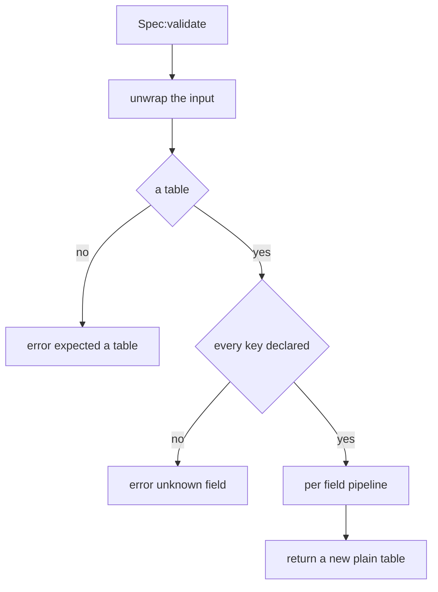
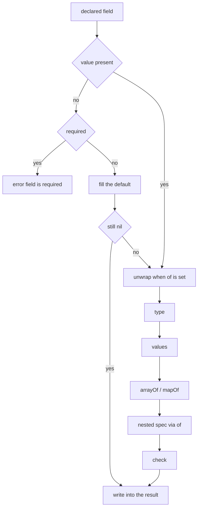
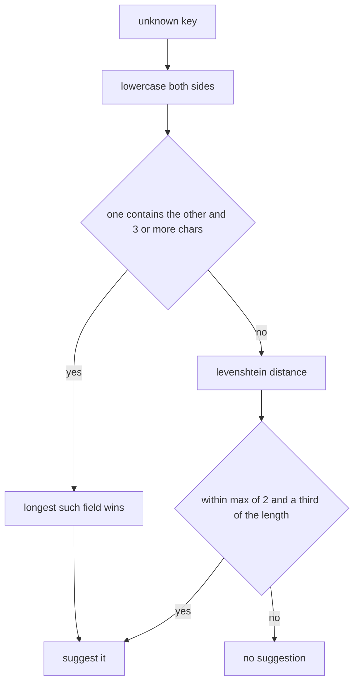

## 读完本页你可以做到

- 写出帕鲁、道具或建筑物的定义，让游戏第一次就接受它
- 读懂定义写错时 PalForge 打印的消息，直接改它点名的那一行
- 在游戏运行中查出帕鲁或建筑物能写哪些字段
- 让同一个模型在多个帕鲁之间复用，不用再写一遍
- 只组装定义而不注册它，并记录 id 归哪个内容包所有
- 用同样的方式检查自己内容包的设置，让笔误停在加载时，而不是玩到一半才出问题

`Pal{ ... }`、`Item{ ... }`、`Building{ ... }` 这些 `X{ ... }` 调用，在任何东西到达游戏之前，
都会先和一份“允许写的字段列表”对照。全都对得上，你就拿回自己的定义。对不上，调用就在这里停下，
并抛出一条消息，点名领域（你正要定义的是哪一类东西）、字段名和原因。定义不会做到一半：
要么全部注册，要么什么都不注册。

消息前面不带文件名和行号。它落在 UE4SS 日志里（模组加载器在游戏运行时写出的文本文件），
是可以直接搜索的一行。

## 字段列表长什么样

每个领域都把自己接受的字段当作普通数据，只写一次。下面是网格（挂在帕鲁或建筑物上的 3D 模型）的
真实列表。字段上能写的每个键，都集中出现在这一处。

```lua title="Scripts/palforge/api/mesh.lua"
local schema = require("palforge.core.schema")

local Spec = schema.define("Mesh.Spec", {
    { "id",        type = "string", check = schema.nonEmpty,
                   doc = "mesh id, e.g. \"pack:name\" (required when defined directly; omit when inline)" },
    { "kind",      type = "string", values = { "procedural", "static", "skeletal", "obj" },
                   default = "skeletal", doc = "which core.mesh backend renders it" },
    { "model",     type = "string", required = true,
                   doc = "a /Game/... USkeletalMesh or UStaticMesh path (see Mesh.assets); for procedural / obj, an .obj file path - absolute, or relative to the .lua file that declares it" },
    { "animClass", type = "string",
                   doc = "a /Game/... ABP path, with or without the _C tail (see Mesh.assets.ABP); skeletal only" },
    { "scale",     type = "number", doc = "uniform scale applied to the attached mesh" },
    { "offset",    type = "table",  doc = "{ x, y, z } offset from the mesh's normal position, in cm" },
    { "texture",   type = "string",
                   doc = "a /Game/... UTexture2D path (see Mesh.assets.T), or a png of your own - absolute, or relative to the .lua file that declares it" },
    { "color",     type = "table",  doc = "tint { r, g, b, a } in 0..1" },
    { "material",  type = "string", doc = "base material asset path to instance from" },
    { "params",    type = "table",
                   doc = "extra material parameters: { vector = { name = {r,g,b,a} }, scalar = { name = n }, texture = { name = \"/Game/... or <abs png>\" } }" },
}, { handle = "Mesh.Handle" })
```

字段名是每一行的**第一个元素**。其余的都是同一行上的具名键。

`fields` 是数组，不是映射，所以你写的顺序就是拿回来的顺序。这个顺序决定 `:help()` 的输出，
也决定编辑器补全的排列。

`schema.define(name, fields, opts)` 返回的结构对象，对外提供这些东西：

```lua
Spec:validate(t, context)   -- a validated COPY with defaults filled; raises on any problem
Spec:help()                 -- the printable field list, one line per field
Spec:field("model")         -- one field descriptor by name, or nil
Spec.fields                 -- the ordered array of descriptors
Spec.name                   -- "Mesh.Spec"
Spec.handle                 -- "Mesh.Handle", or nil
```

每个 `X{ ... }` 调用都先跑自己的列表，再用拿回的副本组装定义：

```lua title="Scripts/palforge/api/pal.lua"
local function define(spec)
    spec = Spec:validate(spec, "Pal")
    -- spec is now a fresh plain table: unknown keys are impossible, defaults are filled
    ...
end
```

第二个参数是这个调用的每条消息开头打印的名字。因为传的是 `"Pal"`，你读到的才是
`PalForge: Pal: ...` 而不是 `PalForge: Pal.Spec: ...`。省略它，就用结构自己的名字。

<Callout type="info">
结构名在所有声明中唯一。第二次申请 `"Pal.Spec"` 会抛出
`PalForge: schema.define: "Pal.Spec" is already declared`，所以自己声明结构时，
挑一个别处没用过的名字。
</Callout>

## 一个字段上能写什么

一行字段除了名字，最多还能写十个键。能写的就是这些。

<TypeTable
  type={{
    type: {
      description: 'string / number / boolean / table / function，或者用竖线写的联合类型，比如 table|function。省略则接受任何值。',
      type: 'string',
    },
    required: {
      description: '字段不存在时抛出。判断在填入 default 之前。',
      type: 'boolean',
      default: 'false',
    },
    default: {
      description: '字段不存在时使用的值。传函数则会调用它，造出一个新值。',
      type: 'any',
    },
    values: {
      description: '值必须用 == 等于其中一项。',
      type: 'any[]',
    },
    of: {
      description: '用嵌套的结构校验这个值。校验结果取代输入。',
      type: 'Spec',
    },
    arrayOf: {
      description: '数组部分的每个元素都要满足这个类型写法。',
      type: 'string',
    },
    mapOf: {
      description: '表里的每个值都要满足这个类型写法。',
      type: 'string',
    },
    doc: {
      description: '一行说明。会流向 :help() 和生成的类型定义。',
      type: 'string',
    },
    sig: {
      description: '函数字段的 LuaLS 签名。校验完全忽略它。',
      type: 'string',
    },
    check: {
      description: '额外的判断。返回 false 加一个原因字符串表示拒绝。最后运行。',
      type: 'fun(v): boolean, string?',
    },
  }}
/>

### type

写法就是一个普通字符串。联合类型用竖线写，值匹配其中任意一项就通过。

```lua
{ "maxStack", type = "number" }                    -- Item.Spec
{ "state",    type = "table|function" }            -- Building.Spec
{ "icon" }                                         -- no type: anything is accepted
```

在期望 `"function"` 的地方，**可以调用的表可以顶替函数**，所以带 `__call` 元方法的表能当作
事件处理函数通过：

```lua
local counter = setmetatable({ n = 0 }, {
    __call = function(self, pal, ctx) self.n = self.n + 1 end,
})

Pal{ id = "example:Boss", events = { onSpawned = counter } }   -- accepted
```

### required

只在你没写这个字段时判断，而且在看 `default` 之前判断，所以一个字段不会既必填又有默认值。

```lua
{ "model", type = "string", required = true,
           doc = "a /Game/... USkeletalMesh or UStaticMesh path (see Mesh.assets); ..." }
```

`id` 在每个领域都是必填。只有 `Mesh.Spec` 里它是可选的，因为写在帕鲁或建筑物内部的内联网格
没有需要命名的东西。单独写 `Mesh{ ... }` 时还是需要 id：字段列表跑完之后，`api/mesh` 会
另外检查一次。

### default

默认值填补你没写的字段。填进去的值同样要走 type、`values`、`arrayOf`/`mapOf`、`of`、`check`
这几步，和你自己写的值一模一样。

```lua
{ "kind",         type = "string", default = "skeletal" }   -- Mesh.Spec
{ "tickInterval", type = "number", default = 1 }            -- Building.Spec
{ "stackable",    type = "boolean", default = false }       -- Effect.Spec
```

函数形式的默认值会**被调用**，所以每个定义都拿到属于自己的新值，而不是共用同一张表：

```lua
{ "tags", type = "table", default = function() return {} end }
```

PalForge 自己的字段列表目前没有用函数默认值的，但你的可以用。`Spec:help()` 只对普通值打印
`default=`，是函数就跳过这一段。

### values

值必须等于其中一项。按顺序用 `==` 比较。

```lua
{ "kind",     type = "string", values = { "procedural", "static", "skeletal", "obj" } }  -- Mesh.Spec
{ "category", type = "string",
              values = { "material", "consumable", "equipment", "ammo", "ingredient", "other" } }  -- Item.Spec
{ "kind",     type = "string", values = { "active", "passive" } }                        -- Skill.Spec
{ "kind",     type = "string", values = { "se", "bgm" } }                                -- Audio.Spec
```

### of

值用另一个结构来检查，而且**检查后的副本会在结果里取代它**。消息会一直延伸到内层结构的名字，
所以就算问题出在嵌套表里的字段，你也知道该去读哪一份列表。

```lua
{ "mesh",   type = "table", of = Mesh,   doc = "the mesh worn by a spawned pawn ..." }
{ "events", type = "table", of = Events, doc = "lifecycle handlers (grouped)" }
{ "recipe", type = "table", of = Recipe, doc = "the recipe that produces THIS item ..." }
```

### arrayOf

**数组部分**的每个元素都用 `ipairs` 做类型检查，下标会成为消息里字段名的一部分。

```lua
{ "skills",   type = "table", arrayOf = "string" }   -- Pal.Spec
{ "buildIds", type = "table", arrayOf = "string" }   -- Building.Spec
```

```lua
Pal{ id = "example:Boss", skills = { "example:Fire", "example:Gust" } }   -- fine
```

因为它按 `ipairs` 走，放在 `arrayOf` 表里的字符串键永远不会被看到。只有连续编号的那一段会被检查。

### mapOf

表里的每个值都用 `pairs` 做类型检查，键会成为消息里字段名的一部分。数组部分也会被看到，
所以 `materials = { "Wood" }` 报告成 `materials.1`。

```lua
{ "materials", type = "table", mapOf = "number", required = true,
               doc = "{ <itemId> = <count> } consumed by one craft" }   -- Item.Spec.Recipe
```

```lua
Item{
    id     = "example:Torch",
    recipe = { materials = { Wood = 3, Stone = 1 }, count = 2, station = "Workbench" },
}
```

### doc

一行说明。`Spec:help()` 会显示它，它也会写成编辑器读取的 `---@field` 行末尾注释。校验只在
一个地方用到它：“is required”的消息在括号里引用它。`check` 失败时引用的是 check 自己返回的
原因，绝不是 doc。

### sig

函数字段在 LuaLS（编辑器补全背后的 Lua 语言服务器）里显示的签名。**校验完全忽略它。**
只有 `tools/gen-types.lua` 会读它，而且只用来往 `types.lua` 里写一个更好的类型。

```lua
{ "onSpawned", type = "function", sig = "fun(self: Pal.Handle, ctx: table)",
               doc = "LIVE - a pal finished initialising (ctx.actor); may repeat per pawn, keep it idempotent" }
```

### check

你自己写的判断，在**其他所有步骤之后**运行，包括嵌套的 `of`。接受就返回 `true`。拒绝就返回
`false` 加一个原因字符串，这个原因会原样引用到消息里。

`core/schema.lua` 公开了两个公用 check。`schema.nonEmpty` 是弱的那个，只看是不是非空字符串：

```lua title="Scripts/palforge/core/schema.lua"
function M.nonEmpty(v)
    if type(v) == "string" and #v > 0 then return true end
    return false, "must be a non-empty string"
end
```

强的那个是 `schema.validId`，**定义期的 id 校验就是靠它表达的**。不带冒号的 id 是游戏自己的
字面 id，只要非空就通过。带冒号的 id 是带命名空间的，前后两半都必须匹配 `^[%w_]+$` ——
正是 `core/object_manager.resolve` 要求的形状，因为 PalSchema 为 `pack:name` 写进表里的行名
拼作 `pack_name`。`schema.validId` 委托给 `om.validId`，这里不留第二份模式的副本。五个领域
把它挂在字段上：

```lua title="Scripts/palforge/api/pal.lua"
{ "id",  type = "string", required = true, check = schema.validId,
         doc = "pal id: a game CharacterID (\"ChickenPal\") or \"pack:name\"" },
```

`Item.Spec`、`Skill.Spec`、`Effect.Spec`、`Audio.Spec` 的 `id` 也是同样的写法。剩下三个 ——
`Mesh`、`Building`、`UI` —— 在各自的 `define` 里直接调用 `om.validId`，因为它们想在原因前面
放不一样的句子。八个领域拒绝的是同一批 id：

```text
PalForge: Pal: field "id" is invalid: invalid pack id 'my-pack' in 'my-pack:Boss' (letters/digits/_ only)
PalForge: Building: field "id" is invalid: invalid pack id 'my-pack' in 'my-pack:Bench' (letters/digits/_ only)
PalForge: Mesh: id "my-pack:body" is not a valid PalForge id: invalid pack id 'my-pack' in 'my-pack:body' (letters/digits/_ only)
```

被抓住的典型情况是包名那半里的连字符。`Building{ id = "my-pack:Bench" }` 注册得干干净净，
然后在每一个引擎边界上都是死的：图标查找、科技解锁、建造 id 匹配全都落空，日志里什么都没有。
有了这个 check，它就变成你写定义时当场能读到的一行字。

你自己写的 check 遵循同样的约定：

```lua
{ "packId", type = "string", check = function(v)
      if v:find(":", 1, true) then return true end
      return false, "must be namespaced as pack:name"
  end },
```

## 还有一个选项 handle

`schema.define` 的第三个参数，目前只接受一个键。

<TypeTable
  type={{
    handle: {
      description: '通过 __spec 元字段同样满足这个结构的句柄类型。只用于类型：校验本来就接受句柄，这个键是把这件事告诉编辑器。',
      type: 'string',
    },
  }}
/>

```lua
}, { handle = "Mesh.Handle" })
```

在结构上声明一次，所有通过 `of` 指向这个结构的字段，不用重写就能在编辑器里显示联合类型。
`Pal.Spec.mesh` 变成 `Mesh.Spec|Mesh.Handle`。派生出来的结构会继承基础结构的 `handle`，
所以 `Building.Spec.Mesh` 报告的也是 `Mesh.Handle`。

## 定义的第二个参数

`X{ ... }` 是 `X(spec, opts)` 只写一个参数的写法。八个领域的构造器都接受这第二个参数，它是可选
的，而且只控制**注册**，从不影响定义本身。两种写法拿回来的句柄完全一样。

```lua
Item{ id = "example:Torch", maxStack = 20 }                             -- define and register

local h = Item({ id = "example:Torch", maxStack = 20 },
               { register = false })                                    -- build the handle, register nothing

Item({ id = "example:Torch", maxStack = 20 }, { pack = "mypack" })      -- register with an owner
```

<TypeTable
  type={{
    register: {
      description: 'false 表示只构建并返回句柄，不把 id 放进注册表。其他情况都会注册。',
      type: 'boolean',
      default: 'true',
    },
    pack: {
      description: '记为这次注册所有者的内容包 id，id 撞车时能追查到具体是哪个包靠的就是它。',
      type: 'string',
    },
  }}
/>

`register = false` 是让**读取**不会变成写入的那把闸。原生目录会在需要时现场伪造一份定义
（`native.buildings.Foundation` 底下就是 `Building{ id = ... }`），而对建筑物来说注册并不是
无副作用的：`core/event` 的重建扫描会捡到这份新定义，世界里已经立着的每一个匹配 actor 都会变成
被追踪的实例，并持久化进存档。于是在一个提示框里读一个建筑物 id，就开始为基地里的每一块地基
写记录。目录那边传的是 `{ register = false }`，所以查询重新只是查询。

`pack` 由带作用域的接口替你填好：`PalForge.pack("mypack").Item` 就是预先带上
`{ pack = "mypack" }` 的同一个构造器。

`Pal`、`Item`、`Skill`、`Effect`、`Audio` 把这个参数交给 `schema.defineOpts`，写错也在那里被挡下
—— 一个被悄悄忽略的选项，正是这一整层存在要防的那种失败：

```lua
Item({ id = "example:Torch" }, { registr = false })
Item({ id = "example:Torch" }, { register = "no" })
Item({ id = "example:Torch" }, "nope")
```

```text
PalForge: Item: unknown define option "registr". Valid options: register, pack
PalForge: Item: define option "register" expects boolean, got string
PalForge: Item: the second argument is the options table { register = false, pack = "packid" }, got string
```

`Mesh`、`Building`、`UI` 不调用 `schema.defineOpts`，而是在各自的 `define` 里读同样这两个键：
`register` 和 `pack` 的行为一致，但多写第三个键不会报错。

## 调用定义时会发生什么

`Spec:validate(t, context)` 绝不修改你传进去的表。它返回一张**新的普通表**，所以后面的代码
分不出这个值是组装出来的还是手写的。



输入是 `nil` 就当作空表，所以必填字段照样失败。所有键都在检查任何字段之前先查一遍，所以哪怕
定义的其他部分也坏了，笔误还是会被报出来。不是字符串的键会被当场拒绝，还轮不到和已声明的
名字比对。

接着，每个已声明的字段都按这个确切顺序走同样的步骤：



这个顺序带来两件事：

- `of` 的解包发生在类型检查**之前**，所以在声明为 table 的位置传入句柄时，轮到检查 `type`
  的时候它已经是普通表了。
- `check` 看到的是嵌套**之后**的值，所以带 `of` 的字段上的 check 收到的是校验过的副本，
  不是原始输入。

副本只有一层深。嵌套的 `of` 结构会被重新检查成一张新表，但像 `data`、`color`、`offset`
这样的普通 `table` 字段是按引用带过去的。你写的那张表，就是定义持有的那张表。

```lua
local payload = { charges = 3 }
local pal = Pal{ id = "example:Boss", data = payload }
payload.charges = 5   -- the definition sees 5: `data` is not deep-copied
```

## 写错时会看到什么

下面是定义能抛出的每一条消息、导致它的代码，以及该改什么。每一段纯文本都是游戏实际打印的
内容，可以直接从里面复制一句话去搜日志。

### 不是表

```lua
Pal("example:Boss")
```

```text
PalForge: Pal: expected a table, got string. Fields: id, name, description, skills, mesh, material, color, texture, icon, events, data
```

改法：传一张表。用花括号写 `Pal{ id = "example:Boss" }`，不是圆括号。

### 键不是字符串

```lua
Pal{ id = "example:Boss", [1] = "x" }
```

```text
PalForge: Pal: keys must be strings, got a number key
```

改法：给每一项都起个名字。花括号里只写一个值，它就变成第 `1` 项。

### 未知字段，带拼写建议

```lua
Pal{ id = "example:Boss", meshSpec = { model = "/Game/X" } }
```

```text
PalForge: Pal: unknown field "meshSpec" (did you mean "mesh"?). Valid fields: id, name, description, skills, mesh, material, color, texture, icon, events, data
```

```lua
Building{ id = "example:Bench", tickInverval = 4 }
```

```text
PalForge: Building: unknown field "tickInverval" (did you mean "tickInterval"?). Valid fields: id, name, description, gridCm, buildIds, tickInterval, mesh, material, color, texture, icon, state, events, data
```

改法：把字段名改成建议的那个。

### 未知字段，没有足够接近的候选

```lua
Pal{ id = "example:Boss", zzzzzzzzzz = 1 }
```

```text
PalForge: Pal: unknown field "zzzzzzzzzz". Valid fields: id, name, description, skills, mesh, material, color, texture, icon, events, data
```

改法：接受的名字都列在 `Valid fields:` 后面。挑你本来想写的那个。

### 缺少必填字段

```lua
Pal{ name = "Boss" }
```

```text
PalForge: Pal: field "id" is required (pal id: a game CharacterID ("ChickenPal") or "pack:name")
```

改法：把字段补上。括号里的文字是这个字段的 `doc`，它告诉你该写什么。这里要么是游戏里的 id，
要么是 `"pack:name"`。字段没有 `doc` 时打印它的 `type`，再没有就打印 `any`。

### 类型不对

```lua
Pal{ id = "example:Boss", name = 42 }
```

```text
PalForge: Pal: field "name" expects string, got number
```

联合类型原样报告：

```lua
Building{ id = "example:Bench", state = "uses" }
```

```text
PalForge: Building: field "state" expects table|function, got string
```

改法：给这个字段一个它列出的类型的值。`state = { uses = 0 }` 或者
`state = function() return { uses = 0 } end`。

### 值不在 `values` 里

```lua
Mesh{ id = "example:body", model = "/Game/X", kind = "rigid" }
```

```text
PalForge: Mesh: field "kind" must be one of { "procedural", "static", "skeletal", "obj" }, got "rigid"
```

```lua
Skill{ id = "example:Fire", kind = "ultimate" }
```

```text
PalForge: Skill: field "kind" must be one of { "active", "passive" }, got "ultimate"
```

改法：用花括号里列出的值之一。接受的只有这些。

### `arrayOf` 的元素不对

下标会折进字段名，所以整条路径都在同一对引号里。

```lua
Pal{ id = "example:Boss", skills = { "example:Fire", 3 } }
```

```text
PalForge: Pal: field "skills[2]" expects string, got number
```

改法：`skills[2]` 是列表里的第二项。改那一项。

### `mapOf` 的值不对

```lua
Item{ id = "example:Torch", recipe = { materials = { Wood = "three" } } }
```

```text
PalForge: Item: field "recipe" (Item.Spec.Recipe): field "materials.Wood" expects number, got string
```

`mapOf` 表里的数组元素按数字键报告：

```lua
Item{ id = "example:Torch", recipe = { materials = { "Wood" } } }
```

```text
PalForge: Item: field "recipe" (Item.Spec.Recipe): field "materials.1" expects number, got string
```

改法：`materials` 的形式是 `{ <itemId> = <count> }`，所以写 `materials = { Wood = 3 }`。

### `check` 失败

```lua
Pal{ id = "" }
```

```text
PalForge: Pal: field "id" is invalid: must be a non-empty string
```

改法：冒号后面就是 check 返回的原因。check 只返回 `false` 时，消息以 `failed check` 结尾。

### 嵌套结构的错误会点名内层结构

消息按顺序累积：外层的领域、外层的字段、内层结构的名字，然后是内层的问题。从右往左读，
最后那一段才是要改的地方。

```lua
Pal{ id = "example:Boss", mesh = { kind = "skeletal" } }
```

```text
PalForge: Pal: field "mesh" (Mesh.Spec): field "model" is required (a /Game/... USkeletalMesh or UStaticMesh path (see Mesh.assets); for procedural / obj, an .obj file path - absolute, or relative to the .lua file that declares it)
```

```lua
Building{ id = "example:Bench", mesh = { model = "/Game/X", colour = { 1, 0, 0, 1 } } }
```

```text
PalForge: Building: field "mesh" (Building.Spec.Mesh): unknown field "colour" (did you mean "color"?). Valid fields: id, kind, model, animClass, scale, offset, texture, color, material, params
```

`events` 组和别的嵌套结构没有区别，所以处理函数名写错会报错，而不是变成一个默默永远不运行的
处理函数：

```lua
Pal{ id = "example:Boss", events = { onSpawn = function(pal, ctx) end } }
```

```text
PalForge: Pal: field "events" (Pal.Spec.Events): unknown field "onSpawn" (did you mean "onSpawned"?). Valid fields: onSpawned, onDamaged, onDeath, onCaptured, onTick
```

```lua
Building{ id = "example:Bench", events = { onPlace = "hello" } }
```

```text
PalForge: Building: field "events" (Building.Spec.Events): field "onPlace" expects function, got string
```

改法：`(...)` 里的名字就是可以用 `schema.help` 查的内层结构，能写的名字列在行尾。

## 建议是怎么选出来的

未知字段总会试着点名你本来想写的那个字段，所以拼写错误在加载内容包的那一刻就被抓住。



**包含了真实字段名的名字，胜过只是拼写接近的名字。** 最常见的失误是加了修饰的名字，
比如用 `meshSpec` 代替 `mesh`、用 `iconPath` 代替 `icon`。在你看来一目了然，但离真实字段
隔着好几次编辑。包含关系双向判断，所以前缀、后缀和复数都能匹配。只有三个字符及以上的已声明
名字参与，所以像 `id` 这种两个字母的字段不会吞掉半份声明。

谁也不包含谁的时候，由 Levenshtein 距离决定，也就是两个名字相差多少次单字符编辑。只接受
真正接近的匹配：上限是 `max(2, floor(#name / 3))`。

两个阶段都转成小写比较，所以大小写写错也能抓到。

| 你写的 | 建议 | 原因 |
| --- | --- | --- |
| `meshSpec` | `mesh` | 包含 `mesh` |
| `iconPath` | `icon` | 包含 `icon` |
| `displayName` | `name` | 包含 `name` |
| `textures` | `texture` | 包含 `texture` |
| `durationSeconds` | `duration` | 包含 `duration` |
| `Description` | `description` | 转成小写后包含 `description` |
| `nam` | `name` | `name` 包含 `nam`，包含关系是双向的 |
| `tickInverval` | `tickInterval` | 距离为 1 |
| `sound` | `soundPath` | 包含 `sound` |
| `zzzzzzzzzz` | 无 | 距离阈值内没有任何候选 |

<Callout type="warn">
对很短的未知键，上限固定是 2，所以给出的建议可能只是巧合，而不是真的看穿了你的意图。
`Pal{ xy = 1 }` 会建议 `"id"`。两三个字符的键上的建议，当提示看，别当答案。
</Callout>

## 把一个定义放进另一个定义里

嵌套的结构可以内联写，也可以把 define 调用返回的对象直接传进去：

```lua
-- inline
Pal{ id = "example:Boss", mesh = { model = "/Game/Pal/Model/Character/Monster/ChickenPal/SK_ChickenPal" } }

-- as a named definition
local body = Mesh{
    id      = "example:body",
    model   = "/Game/Pal/Model/Character/Monster/ChickenPal/SK_ChickenPal",
    texture = "art/body.png",
}

Pal{ id = "example:Boss", mesh = body }
Pal{ id = "example:Add",  mesh = Mesh.get("example:body") }
```

两种写法到达内层结构的路径一样。元表上带 `__spec` 的句柄，会在任何检查开始之前，被换成它
所代表的那张表：

```lua title="Scripts/palforge/core/schema.lua"
local function unwrap(v)
    if type(v) ~= "table" then return v end
    local mt = getmetatable(v)
    local tospec = mt and rawget(mt, "__spec")
    if type(tospec) == "function" then return tospec(v) end
    return v
end
```

```lua title="Scripts/palforge/api/mesh.lua"
Handle.__spec = function(self) return self._cls:source() end
```

替换发生在两个地方：`validate` 开头对整个输入换一次，以及每个设置了 `of` 的字段各换一次。
所以 `Spec:validate(someHandle)` 和 `mesh = someHandle` 一样可用。

因为嵌套的值随后又被检查了一遍，外层定义持有的是一份**副本**。你没办法通过穿着这个网格的
帕鲁去改到网格定义：

```lua
local body = Mesh{ id = "example:body", model = "/Game/X/SK_X" }
local pal  = Pal{ id = "example:Boss", mesh = body }

pal:mesh().scale = 4     -- mutates the pal's copy, not the "example:body" definition
```

<Callout type="warn">
目前只有 `Mesh.Handle` 带 `__spec`。帕鲁、道具、建筑物、技能、效果、音频和界面的句柄都没有，
所以把它们传进另一个定义，会被当成普通表检查，并因为未知的键而失败。这种时候把嵌套的部分
内联写。
</Callout>

<Callout type="warn">
默认值只填**你没写**的字段。`Mesh{ ... }` 已经填好了 `kind = "skeletal"`，所以把这个句柄嵌进
建筑物时，即使 `Building.Spec.Mesh` 把 `kind` 的默认值定成 `"static"`，它仍然是 `skeletal`。
想要建筑物那一套时，在网格上写 `kind = "static"`，或者把建筑物的 mesh 内联声明。
</Callout>

## 用不同的默认值复用一份字段列表

`schema.derive(name, base, overrides)` 把另一个结构整份复制成新结构，只替换逐字段的策略。
每个字段先整体复制，再把对应的 override 表合并上去。

建筑物就是这样处理网格的：

```lua title="Scripts/palforge/api/building.lua"
local Mesh = schema.derive("Building.Spec.Mesh", schema.get("Mesh.Spec"), {
    kind   = { default = "static" },
    model  = { doc = "UStaticMesh asset path, or an OBJ path for the procedural backend" },
    offset = { doc = "{ x, y, z } offset from the actor's origin" },
})
```

帕鲁用的是 skeletal 网格，建筑物用的是 static 网格，所以只有那个默认值变了。十个字段、
它们的类型、`model` 的必填，以及 `Mesh.Handle` 选项，都原封不动地继承过来，以后往
`Mesh.Spec` 加的字段也会传到建筑物。

差别体现在两份 help 输出上：

```text
Mesh.Spec {
  kind          string     (default=skeletal, one of { "procedural", "static", "skeletal", "obj" }) which core.mesh backend renders it
  model         string     (required) a /Game/... USkeletalMesh or UStaticMesh path (see Mesh.assets); for procedural / obj, an .obj file path - absolute, or relative to the .lua file that declares it
  offset        table      { x, y, z } offset from the mesh's normal position, in cm
  ...
}

Building.Spec.Mesh {
  kind          string     (default=static, one of { "procedural", "static", "skeletal", "obj" }) which core.mesh backend renders it
  model         string     (required) UStaticMesh asset path, or an OBJ path for the procedural backend
  offset        table      { x, y, z } offset from the actor's origin
  ...
}
```

能覆盖的不只是 `default`，合并会复制 override 表里的任何键。override 指向基础结构没有声明的
字段时，会当场被抓住：

```lua
schema.derive("Test.Spec", schema.get("Mesh.Spec"), { kindd = { default = "x" } })
```

```text
schema.derive(Test.Spec): "kindd" is not a field of Mesh.Spec
```

<Callout type="info">
`derive` 要经过 `define`，所以新名字仍然必须没被占用。同一个名字取两次会抛出
`PalForge: schema.define: "Test.Spec" is already declared`，不带文件名和行号。另外两处检查
用的是 `assert`：基础必须是 `schema.define` 造出来的结构，override 必须指向基础声明过的
字段。这两条前面会带上 `core/schema.lua` 自己的文件名和行号，所以上面那段文字是消息的
末尾部分，不是整行。
</Callout>

## 问游戏某个结构能写什么

每个结构在声明时就以自己的名字被记录下来，游戏运行中可以读回来。

```lua
local schema = require("palforge.core.schema")

schema.get("Pal.Spec")          -- the spec object, or nil
schema.get("Pal.Spec").fields   -- the ordered descriptors, for tooling
schema.help("Pal.Spec")         -- the printable field list
schema.all()                    -- every declared spec, in declaration order
```

“这里能传什么”的运行时答案就是 `schema.help(name)`：

```lua
print(schema.help("Pal.Spec"))
```

```text
Pal.Spec {
  id            string     (required) pal id: a game CharacterID ("ChickenPal") or "pack:name"
  name          string     shown in UI (defaults to id)
  description   string     one-line description, for UI and tooling
  skills        table      (string[]) skill ids this pal owns (see Skill)
  mesh          table      (Mesh.Spec) the mesh worn by a spawned pawn (inline, or a Mesh{ ... } handle); attached automatically on pal.spawned
  material      table      (Pal.Spec.Material) material override applied to that mesh
  color         table      base tint { r, g, b, a } (shorthand for material.color)
  texture       string     png path applied to the mesh (shorthand for material.texture)
  icon          string     /Game/... texture path used when the icon DataTable has no row for this id
  events        table      (Pal.Spec.Events) lifecycle handlers (grouped)
  data          table      free-form payload of your own, carried onto the definition
}
```

括号里的标记按固定顺序出现：先 `required`，然后是普通默认值的 `default=<值>`，然后是
`one of { ... }`，然后是嵌套结构的名字，然后是 `arrayOf` 的 `<类型>[]`，最后是 `mapOf` 的
`map of <类型>`。一个标记都没有的字段，只打印名字、类型和 doc。

传一个没有声明过的名字**不会**抛出。你会拿回一个字符串，里面按字母排序列出所有已声明的名字。
记不清确切拼写时很有用：

```lua
print(schema.help("Pal.Specc"))
```

```text
PalForge: no spec named "Pal.Specc". Declared: Audio.Spec, Building.Spec, Building.Spec.Events, Building.Spec.Material, Building.Spec.Mesh, Coord, Effect.Spec, Effect.Spec.Events, Item.Spec, Item.Spec.Events, Item.Spec.Recipe, Mesh.Spec, Pal.Spec, Pal.Spec.Events, Pal.Spec.Material, Skill.Spec, Skill.Spec.Events, UI.Node.Border, UI.Node.Button, UI.Node.Frame, UI.Node.GameWidget, UI.Node.HBox, UI.Node.Label, UI.Node.Overlay, UI.Node.ScrollBox, UI.Node.SizeBox, UI.Node.Sprite, UI.Node.VBox, UI.Spec, UI.Spec.Host
```

`schema.all()` 返回一份新的列表，按**声明顺序**排，不排序。嵌套结构总是在引用它的结构之前
声明，这正是类型生成器能在每个类被用到之前先输出它的原因：

```lua
for _, spec in ipairs(schema.all()) do
    print(spec.name, spec.handle)
end
```

```text
Mesh.Spec              Mesh.Handle
Pal.Spec.Material      nil
Pal.Spec.Events        nil
Pal.Spec               nil
Item.Spec.Recipe       nil
Item.Spec.Events       nil
Item.Spec              nil
Building.Spec.Mesh     Mesh.Handle
Building.Spec.Material nil
Building.Spec.Events   nil
Building.Spec          nil
Skill.Spec.Events      nil
Skill.Spec             nil
Effect.Spec.Events     nil
Effect.Spec            nil
Audio.Spec             nil
UI.Node.VBox           nil
UI.Node.HBox           nil
UI.Node.Overlay        nil
UI.Node.ScrollBox      nil
UI.Node.Border         nil
UI.Node.SizeBox        nil
UI.Node.Label          nil
UI.Node.Frame          nil
UI.Node.Button         nil
UI.Node.Sprite         nil
UI.Node.GameWidget     nil
UI.Spec.Host           nil
UI.Spec                nil
Coord                  nil
```

一共 30 个结构，其中 11 个是 `UI.Node.*` —— `UI.VBox`、`UI.Label`、`UI.Button` 等节点构造器
各自接受的那份结构 —— 再加上 `UI.Spec.Host`，也就是面板 `host` 写成表时的形状。它们都由
`api/ui.lua` 像别的 spec 一样声明，所以 `schema.help("UI.Node.Button")` 的回答方式和
`schema.help("Pal.Spec")` 完全一样。

`Coord` 是唯一一个名字前面不带领域的结构。它是 `Player.coordinate()` 给你、
`Pal.Handle:spawn` 接受的世界坐标，声明在 `api/player.lua` 里，好让 `schema.help("Coord")`
和你的编辑器都知道它有哪些字段。

## 编辑器里的字段列表

`Scripts/palforge/types.lua` 由 `tools/gen-types.lua` 从已声明的结构生成：

```bash
lua5.4 tools/gen-types.lua
```

它只有注解，运行时没有任何东西 require 它。只要 LuaLS 能在工作区里看到它，`Pal{ ... }`
就能补全每个字段，还带上 doc。

每个字段按第一条适用的规则，映射成编辑器里的类型：

| 描述符 | 输出的类型 |
| --- | --- |
| `of = Inner` | `Inner.Spec`；内层结构声明了 `handle` 时再加 `\|Inner.Handle` |
| `values = { ... }` | 用结构名和字段名组成的别名，例如 `Mesh.Spec.Kind` |
| `sig = "fun(...)"` | 签名原样输出 |
| `arrayOf = "string"` | `string[]` |
| `mapOf = "number"` | `table<string, number>` |
| 没有 `type` | `any` |
| 其他情况 | 写的那个 `type` 字符串 |

`required` 决定字段带不带 `?`，普通的 `default` 会追加到 doc 注释里。`Pal.Spec` 的结果是：

```lua title="Scripts/palforge/types.lua"
---@class Pal.Spec
---@field id string # pal id: a game CharacterID ("ChickenPal") or "pack:name"
---@field name? string # shown in UI (defaults to id)
---@field description? string # one-line description, for UI and tooling
---@field skills? string[] # skill ids this pal owns (see Skill)
---@field mesh? Mesh.Spec|Mesh.Handle # the mesh worn by a spawned pawn (inline, or a Mesh{ ... } handle); attached automatically on pal.spawned
---@field material? Pal.Spec.Material # material override applied to that mesh
---@field color? table # base tint { r, g, b, a } (shorthand for material.color)
---@field texture? string # png path applied to the mesh (shorthand for material.texture)
---@field icon? string # /Game/... texture path used when the icon DataTable has no row for this id
---@field events? Pal.Spec.Events # lifecycle handlers (grouped)
---@field data? table # free-form payload of your own, carried onto the definition
```

`mesh` 字段上的 `|Mesh.Handle` 来自 `handle` 选项，`Mesh.Spec.Kind` 则是从那个结构的
`values` 列表生成的别名：

```lua title="Scripts/palforge/types.lua"
---@alias Mesh.Spec.Kind "procedural"|"static"|"skeletal"|"obj"
```

结构一变就重新跑一次生成器，编辑器提示的东西就和定义实际接受的东西保持一致。

## 实用示例

### 在游戏运行中打印任意结构

```lua title="content/dev.lua"
local schema = require("palforge.core.schema")
local log    = require("palforge.utils.log").scope("dev")

-- one shape
log.info(schema.help("Building.Spec"))

-- the shapes a building definition can reach
for _, name in ipairs({ "Building.Spec", "Building.Spec.Mesh",
                        "Building.Spec.Material", "Building.Spec.Events" }) do
    log.info(schema.help(name))
end
```

### 把所有已声明的结构输出到 UE4SS 日志

```lua title="content/dev.lua"
local schema = require("palforge.core.schema")
local log    = require("palforge.utils.log").scope("schema")

for _, spec in ipairs(schema.all()) do
    log.info(spec:help())
end
```

### 用描述符搭一张自己的参考表

```lua title="content/dev.lua"
local schema = require("palforge.core.schema")

local function describe(specName)
    local spec = schema.get(specName)
    if not spec then return print(schema.help(specName)) end

    print(spec.name)
    for _, f in ipairs(spec.fields) do
        local flags = {}
        if f.required then flags[#flags + 1] = "required" end
        if f.default ~= nil then flags[#flags + 1] = "default=" .. tostring(f.default) end
        if f.values then flags[#flags + 1] = "enum" end
        if f.of then flags[#flags + 1] = f.of.name end
        if f.check then flags[#flags + 1] = "checked" end
        print(string.format("  %-13s %-14s %-22s %s",
            f.name, f.type or "any", table.concat(flags, ","), f.doc or ""))
    end
end

describe("Item.Spec")
describe("Item.Spec.Recipe")
```

### 用同样的方式校验自己内容包的配置

`schema.define` 不是 PalForge 自家领域的专利。声明你自己内容包的结构，设置里的笔误就会在加载时
停下，消息和拼写建议都和内置的一模一样。挑一个别的结构没用过的名字。

```lua title="content/config.lua"
local schema = require("palforge.core.schema")

local Config = schema.define("ExamplePack.Config", {
    { "reward",     type = "string", required = true, check = schema.nonEmpty,
                    doc = "item id handed out when the boss dies" },
    { "rewardCount", type = "number", default = 5, doc = "how many of it" },
    { "biome",      type = "string", values = { "forest", "desert", "volcano" },
                    default = "forest", doc = "where the boss appears" },
    { "spawnAt",    type = "table", of = schema.get("Coord"),
                    doc = "fixed spawn point; omit to spawn near the player" },
})

---@param opts table
local function setup(opts)
    local cfg = Config:validate(opts, "ExamplePack")

    Pal{
        id     = "example:Boss",
        name   = "Example Boss",
        events = {
            onDeath = function(pal, ctx)
                Item.get(cfg.reward):give(cfg.rewardCount)
            end,
        },
    }
end

setup{ reward = "Wood", rewardCount = 10, biome = "volcano" }
```

这时候笔误的表现，和 `Pal{ ... }` 调用里的笔误完全一样：

```lua
setup{ reward = "Wood", rewardCounts = 10 }
```

```text
PalForge: ExamplePack: unknown field "rewardCounts" (did you mean "rewardCount"?). Valid fields: reward, rewardCount, biome, spawnAt
```

### 在加载时大声失败，而不是在游戏里默默出错

定义出错会抛出，所在的文件就此停下。把一个内容文件在最外层用一个 `pcall` 包起来，再把消息
记进日志：内容包的其余部分照样加载，原因也一字不差地留在日志里。

```lua title="content/pals.lua"
local log = require("palforge.utils.log").scope("example")

local ok, err = pcall(function()
    Pal{
        id          = "ChickenPal",
        name        = "Reskinned Chicken",
        description = "vanilla chicken with a new coat",
        mesh        = Mesh{
            id      = "example:chicken",
            model   = "/Game/Pal/Model/Character/Monster/ChickenPal/SK_ChickenPal",
            texture = "art/chicken.png",
        },
        events = {
            onSpawned = function(pal, ctx) log.info("chicken spawned") end,
        },
    }
end)

if not ok then log.err(tostring(err)) end
```

## 小结

- 每个 `X{ ... }` 调用都在注册任何东西之前先检查。要么整体成功，要么抛出并且什么都不注册。
- `id` 在每个领域都是必填，而且它的形状在你写的时候就会被检查：带冒号的 id，任一半里出现
  字母、数字和 `_` 以外的字符，就会抛出，而不是注册一个游戏永远够不着的东西。
- `X{ ... }` 是 `X(spec, opts)` 只写一个参数的写法。可选的第二个参数只控制注册：
  `{ register = false }` 组装句柄但什么都不注册，`{ pack = "mypack" }` 记录所有者。
- 你没写的字段，要么是可选的，要么由默认值填上。
- 字段名写错会报错，消息通常会点名你本来想写的那个字段。
- 每条消息都以 `PalForge: ` 开头，接着是领域、字段、原因。`(...)` 里出现结构名时，那就是要去
  查的内层列表。
- `print(schema.help("Pal.Spec"))` 在游戏运行中打印一个结构的所有字段，名字写错时打印名字
  列表，不会抛出。
- `Mesh{ ... }` 句柄可以嵌进帕鲁或建筑物，外层定义会保留它的一份副本。

接下来，[生命周期](/docs/concepts/lifecycle) 会告诉你 `events` 里能写的处理函数中，
哪些真的会在游戏里运行。

<Cards>
  <Card title="Pal" href="/docs/api/pal">帕鲁能写的每个字段</Card>
  <Card title="Mesh" href="/docs/api/mesh">模型，以及可以嵌进其他定义的句柄</Card>
  <Card title="Building" href="/docs/api/building">建筑物的网格，以及处理函数拿到的活实例</Card>
  <Card title="生命周期" href="/docs/concepts/lifecycle">events 组里哪些钩子真的会触发</Card>
</Cards>
