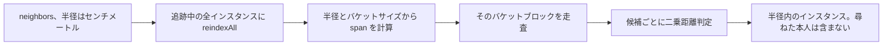

## このページでできるようになること

- 生きている構造物に、自分のフックの中から「近くに何が立っているか」を尋ねる
- 空の答えを正しく読む（理由が 4 通りあるため）
- 建物ランタイムが管理していないインスタンスについてインデックスを直接引く
- 自分でインデックスに入れたインスタンスを、正しく維持し続ける

## 生きているインスタンスの neighbors

`Building.Instance:neighbors(radiusCm)` は、`radiusCm` 以内にある**自分以外の**生きた構造物を
インスタンスとして返します。同じ定義のものだけではなく、あらゆる建物定義が対象です。

```lua
Building{
    id     = "mypack:Pipe",
    events = {
        onTick = function(self)
            for _, n in ipairs(self:neighbors(350)) do    -- 3.5 m 以内のすべて
                if n.buildId == "mypack_Pipe" then self.connected = (self.connected or 0) + 1 end
            end
        end,
    },
}
```

単位はセンチメートルなので `350` は 3.5 m です。フレームワークの他の部分と同じ単位で、
`Player.coordinate()` が答える単位でもあります。各要素は生きたインスタンステーブルで、少なくとも
`pos`（センチメートルの `x, y, z`）、`buildId`（**解決後**のゲーム build id なので `"WorkBench"` や
`"mypack_Bench"`）、`actor` を持ちます。

尋ねた本人が結果に入ることはありません。自分で書くフィルタではなく、`neighbors` が `self` を除外
対象として渡しています。

## 空を返すとき

空のリストは正常な戻り値で、理由は 4 通りあります。うち 3 つは拒否で、テストスイートが固定しています。

| 呼び出し | 答え | 理由 |
| --- | --- | --- |
| **定義**に対する `cls:neighbors(350)` | `{}` | 定義に `pos` はない。持つのは設置済みの構造物だけ |
| `inst:neighbors(0)` / `(-1)` | `{}` | 半径 0 を点クエリと解釈せず拒否する |
| `inst:neighbors("350")` | `{}` | 文字列の半径は比較せず拒否する |
| `inst:neighbors()` | `{}` | 半径の指定がない |
| 近くに何もない `inst:neighbors(350)` | `{}` | 本当の答え |

`nil` を返すことはないので、戻り値はそのまま `ipairs` に渡せます。

## 下にあるグリッド

`core.spatial` はインスタンスを粗いセルにバケット分けします。そのため近傍クエリの費用は、拠点内の
全建物ではなく近傍の数に比例します。

```lua
local spatial = require("palforge.core.spatial")

spatial.BUCKET_CM   -- 200: 固定の粗いバケットサイズ（センチメートル）
spatial.GRID_CM     -- 100: 永続キー用の既定量子化セル（これは別の概念）
```

クエリは `(2 * span + 1)^3` 個のバケットブロックを走査します。`span = ceil(radiusCm / BUCKET_CM)`
です。これは「だいたい十分」ではなく証明できる十分性です。`radiusCm` 離れた 2 点は、どの軸でも
バケット添字が最大 `ceil(radiusCm / BUCKET_CM)` しか違わないので、バケット境界で半径内のペアを
取りこぼしません。半径がバケットより大きい場合（350 なら span は 2）も含みます。走査ブロックの中では
候補ごとに実際の二乗距離判定が行われるので、結果は厳密で、グリッドはどの候補を見るかを決めるだけです。



インデックスは建物ランタイムのインスタンスレジストリと同じく `_G` にあります。生きているインスタンス
はどれも、その中のバケットを指す `_bucket` 文字列を持っています。F9 リロード後に空のテーブルを作って
しまうと、すべての刻印が存在しないバケットを指し、構造物だらけの拠点でも `neighbors` が `{}` を返す
ことになります。`indexReset` が**その場で**中身を消すのも同じ理由です。リロード前のモジュールが
そのテーブル自体を持ち続けているからです。

## 自分でインデックスを駆動する

インデックスが保持するのはインスタンステーブル、つまり `pos = { x, y, z }` を持つものです。ゲームを
読むことはなく、強参照で保持するので、`indexRemove` せずに捨てられたインスタンスは `indexReset` まで
ここで生き残ります。

建物ランタイムが管理する構造物については、以下はすべてすでに駆動されています。

| タイミング | 呼び出し | 呼ぶ主体 |
| --- | --- | --- |
| 設置 / ロード時 | `spatial.indexAdd(inst)` | 建物ランタイムの `addInstance` |
| 撤去時 | `spatial.indexRemove(inst)` | その `removeInstance` |
| ワールドを離れたとき | `spatial.indexReset()` | その `dropAllInstances` |
| 移動後 | `spatial.indexUpdate(inst)` | スキャンの高速経路 |
| 問い合わせ | `spatial.neighbors(pos, radiusCm, exclude)` | あなた |

つまり設置済みの建物はすでにインデックスに入っており、問い合わせに必要なのは位置だけです。

```lua
local spatial = require("palforge.core.spatial")
local event   = require("palforge.core.event")

for _, inst in ipairs(event.instances("mypack_Pipe")) do
    local near = spatial.neighbors(inst.pos, 350, inst)
    print(#near .. " structure(s) within 3.5 m")
end
```

`Building.Instance:neighbors` はこの 2 つの呼び出しを包んだもので、加えて 1 ステップあります。先に
`spatial.reindexAll(event.instances())` を走らせます。このパスは実際にセルが変わったエントリだけを
バケットし直し、エンジン呼び出しのない純 Lua で追跡中の構造物数に比例するだけで、ランタイムが
カバーできないケース、つまりパックが自分でインデックスしたインスタンス（駆動役が誰もいない）を
救います。渡したコレクションに含まれないエントリの削除は行いません。インスタンスを外すのは今も
`indexRemove` の仕事です。

<Callout type="info">
建物スキャンの高速経路は、位置が変わった追跡中の構造物をバケットし直します。この呼び出しに到達
できるようになったのは、その上にあるアクター単位の検索キーを UE4SS のハンドルではなくアクターの
フルネームに変えてからです。ハンドルは検索のたびに新しく作られるため、高速経路は初回以降のスイープで
毎回外れ、位置の更新もバケットのやり直しも一度も走っていませんでした。
</Callout>

## まとめ

- 建物フックの中の `self:neighbors(radiusCm)` が、周囲の生きた構造物をセンチメートル単位で返します。
- `nil` は返らず、定義・数値でない半径・0 以下の半径はいずれも拒否されます。
- グリッドは 200 cm でバケットし、十分性が証明できるブロックを走査してから候補を厳密に測ります。
- インデックスは `_G` にあり、その場で消去されるので F9 リロードを無傷で越えます。
- 設置済み建物については `indexAdd` / `indexRemove` / `indexUpdate` / `indexReset` がすでに駆動されています。
- 自分でインデックスするインスタンスは同じように駆動するか、まとめて問い合わせる前に `reindexAll` を呼んでください。

<Cards>
  <Card title="Building" href="/docs/api/building">ハンドラが生きたインスタンスを受け取るドメイン</Card>
  <Card title="Player" href="/docs/api/player">同じ単位の座標がどこから来るか</Card>
  <Card title="リロード・ポール・autorun" href="/docs/guides/dev-tooling">インデックスが _G にある理由</Card>
</Cards>
