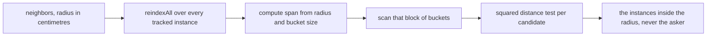

## What you can do after this page

- Ask a live structure what else is standing near it, from inside any of its own hooks
- Read an empty answer correctly, because there are four different reasons for one
- Query the index directly for instances the building runtime does not own
- Keep your own instances in the index when you put them there yourself

## neighbors on a live instance

`Building.Instance:neighbors(radiusCm)` gives you every **other** live structure within
`radiusCm` — any building definition, not just this one's — as instances.

```lua
Building{
    id     = "mypack:Pipe",
    events = {
        onTick = function(self)
            for _, n in ipairs(self:neighbors(350)) do    -- everything within 3.5 m
                if n.buildId == "mypack_Pipe" then self.connected = (self.connected or 0) + 1 end
            end
        end,
    },
}
```

Units are centimetres, so `350` is 3.5 m — the same unit the rest of the framework uses, and the
same one `Player.coordinate()` answers in. Each entry is a live instance table, carrying at least
`pos` (an `x, y, z` in centimetres), `buildId` (the **resolved** game build id, so `"WorkBench"` or
`"mypack_Bench"`) and `actor`.

The asker is never in its own result. That is not a filter you have to write: `neighbors` passes
`self` as the exclusion.

## When it answers nothing

An empty list is a normal return, and there are four different reasons for one. Three of them are
refusals, and they are pinned by the test suite:

| Call | Answer | Why |
| --- | --- | --- |
| `cls:neighbors(350)` on a **definition** | `{}` | a definition has no `pos`; only a placed structure does |
| `inst:neighbors(0)` or `(-1)` | `{}` | a zero radius is refused rather than treated as a point query |
| `inst:neighbors("350")` | `{}` | a string radius is refused rather than compared |
| `inst:neighbors()` | `{}` | no radius at all |
| `inst:neighbors(350)` with nothing near | `{}` | the real answer |

It never returns `nil`, so the result always goes straight into `ipairs`.

## The grid underneath

`core.spatial` buckets instances by a coarse cell, so a neighbour query costs the neighbours
rather than every building in the base.

```lua
local spatial = require("palforge.core.spatial")

spatial.BUCKET_CM   -- 200: the fixed coarse bucket size, in centimetres
spatial.GRID_CM     -- 100: the default quantization cell for a persistence key (a different idea)
```

A query scans a `(2 * span + 1)^3` block of buckets, where `span = ceil(radiusCm / BUCKET_CM)`.
That is provably enough rather than approximately enough: two points `radiusCm` apart differ by at
most `ceil(radiusCm / BUCKET_CM)` bucket indices on any axis, so no in-radius pair is missed at a
bucket boundary — including a radius larger than one bucket, where 350 gives span 2. Inside the
scanned block, each candidate still gets a real squared-distance test, so the result is exact and
the grid only decides which candidates are looked at.



The index lives on `_G`, like the building runtime's own instance registry. Every live instance
carries a `_bucket` string naming a bucket in it, so a fresh empty table after an F9 reload would
leave every stamp pointing at a bucket that is not in it, and `neighbors` answering `{}` for a
base full of structures. `indexReset` clears it **in place** for the same reason — the pre-reload
module still holds the table itself.

## Driving the index yourself

The index stores instance tables — anything carrying `pos = { x, y, z }`. It never reads the game
and it holds strong references, so an instance dropped without `indexRemove` stays alive in there
until `indexReset`.

For structures the building runtime owns, all of this is already driven for you:

| Moment | Call | Who makes it |
| --- | --- | --- |
| on place / load | `spatial.indexAdd(inst)` | the building runtime's `addInstance` |
| on remove | `spatial.indexRemove(inst)` | its `removeInstance` |
| on leaving a world | `spatial.indexReset()` | its `dropAllInstances` |
| after a move | `spatial.indexUpdate(inst)` | the scan's fast path |
| to query | `spatial.neighbors(pos, radiusCm, exclude)` | you |

So placed buildings are already in the index and querying needs nothing but a position:

```lua
local spatial = require("palforge.core.spatial")
local event   = require("palforge.core.event")

for _, inst in ipairs(event.instances("mypack_Pipe")) do
    local near = spatial.neighbors(inst.pos, 350, inst)
    print(#near .. " structure(s) within 3.5 m")
end
```

`Building.Instance:neighbors` is the same two calls wrapped, plus one extra step: it runs
`spatial.reindexAll(event.instances())` first. That pass re-buckets only the entries whose cell
actually changed, is O(tracked structures) of pure Lua with no engine call, and covers the case the
runtime cannot — instances a pack indexes itself have no driver at all. It does **not** remove
entries that are absent from the collection you hand it; dropping an instance is still
`indexRemove`'s job.

<Callout type="info">
The building scan's fast path re-buckets a tracked structure whose position changed. That call was
only reached once the per-actor lookup above it was keyed on the actor's full name instead of on
the UE4SS handle — a handle is minted fresh per lookup, so the fast path missed on every sweep
after the first and neither the position refresh nor the re-bucket ever ran.
</Callout>

## Summary

- `self:neighbors(radiusCm)` inside any building hook gives the other live structures around it, in centimetres.
- It never returns `nil`, and it refuses a definition, a non-number radius and a radius of zero or less.
- The grid buckets at 200 cm and scans a provably sufficient block, then measures each candidate exactly.
- The index lives on `_G` and is cleared in place, so it survives an F9 reload intact.
- `indexAdd` / `indexRemove` / `indexUpdate` / `indexReset` are already driven for placed buildings.
- For instances you index yourself, drive them the same way, or call `reindexAll` before a batch of queries.

<Cards>
  <Card title="Building" href="/docs/api/building">The domain whose handlers get a live instance</Card>
  <Card title="Player" href="/docs/api/player">Where a coordinate comes from, in the same units</Card>
  <Card title="Reload, poll and autorun" href="/docs/guides/dev-tooling">Why the index has to live on _G</Card>
</Cards>
