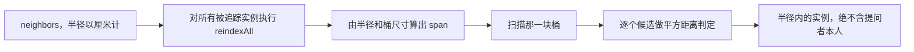

## 读完本页你可以做到

- 在建筑自己的任意钩子里，问它旁边还立着什么
- 正确读懂一个空结果，因为造成空结果的原因有四种
- 对建筑运行时并不管理的实例，直接查询索引
- 自己往索引里放实例时，把它维护对

## 活实例上的 neighbors

`Building.Instance:neighbors(radiusCm)` 返回 `radiusCm` 之内**除自己以外**的每一个活着的建筑实例
——任何建筑定义都算，不只是同一个定义的。

```lua
Building{
    id     = "mypack:Pipe",
    events = {
        onTick = function(self)
            for _, n in ipairs(self:neighbors(350)) do    -- 3.5 m 以内的所有东西
                if n.buildId == "mypack_Pipe" then self.connected = (self.connected or 0) + 1 end
            end
        end,
    },
}
```

单位是厘米，所以 `350` 就是 3.5 m——和框架其余部分用的单位一致，也是 `Player.coordinate()` 回答的
单位。每一项都是活着的实例表，至少带有 `pos`（厘米制的 `x, y, z`）、`buildId`（**解析后**的游戏
build id，比如 `"WorkBench"` 或 `"mypack_Bench"`）和 `actor`。

提问者永远不会出现在自己的结果里。这不需要你自己写过滤：`neighbors` 会把 `self` 作为排除项传下去。

## 什么时候会返回空

空列表是正常返回，而造成空的原因有四种。其中三种是拒绝，并且由测试套件钉住：

| 调用 | 结果 | 原因 |
| --- | --- | --- |
| 对**定义**调用 `cls:neighbors(350)` | `{}` | 定义没有 `pos`，只有放置好的结构才有 |
| `inst:neighbors(0)` 或 `(-1)` | `{}` | 半径为零会被拒绝，而不是当成点查询 |
| `inst:neighbors("350")` | `{}` | 字符串半径会被拒绝，而不是拿去比较 |
| `inst:neighbors()` | `{}` | 根本没给半径 |
| 附近什么都没有的 `inst:neighbors(350)` | `{}` | 这就是真实答案 |

它从不返回 `nil`，所以结果可以直接丢给 `ipairs`。

## 底下的网格

`core.spatial` 按粗粒度的格子把实例分桶，于是一次邻居查询的开销取决于邻居数量，而不是基地里建筑的
总数。

```lua
local spatial = require("palforge.core.spatial")

spatial.BUCKET_CM   -- 200：固定的粗粒度桶尺寸，单位厘米
spatial.GRID_CM     -- 100：持久化键使用的默认量化格（这是另一个概念）
```

一次查询会扫描 `(2 * span + 1)^3` 个桶组成的方块，其中 `span = ceil(radiusCm / BUCKET_CM)`。这是可
证明的足够，而不是大致足够：相距 `radiusCm` 的两点在任一轴上的桶下标至多相差
`ceil(radiusCm / BUCKET_CM)`，所以不会在桶边界漏掉半径内的配对——包括半径大于一个桶的情况，350 对应
span 为 2。在被扫描的方块内部，每个候选仍然要过一次真实的平方距离判定，所以结果是精确的，网格只决定
看哪些候选。



索引和建筑运行时自己的实例注册表一样放在 `_G` 上。每个活实例都带着一个 `_bucket` 字符串，指向索引
里的某个桶；F9 重载之后如果换成一张新的空表，所有戳记都会指向不复存在的桶，于是在满是建筑的基地里
`neighbors` 也只会返回 `{}`。`indexReset` **原地**清空也是同一个理由：重载前的模块仍然握着那张表
本身。

## 自己驱动索引

索引保存的是实例表——任何带 `pos = { x, y, z }` 的东西。它从不读游戏，并且持有强引用，所以一个没走
`indexRemove` 就被丢掉的实例会一直活在里面，直到 `indexReset`。

对于建筑运行时管理的结构，下面这些都已经替你驱动好了：

| 时机 | 调用 | 由谁发起 |
| --- | --- | --- |
| 放置 / 载入时 | `spatial.indexAdd(inst)` | 建筑运行时的 `addInstance` |
| 移除时 | `spatial.indexRemove(inst)` | 它的 `removeInstance` |
| 离开世界时 | `spatial.indexReset()` | 它的 `dropAllInstances` |
| 移动之后 | `spatial.indexUpdate(inst)` | 扫描的快路径 |
| 查询 | `spatial.neighbors(pos, radiusCm, exclude)` | 你 |

所以已放置的建筑本来就在索引里，查询只需要一个位置：

```lua
local spatial = require("palforge.core.spatial")
local event   = require("palforge.core.event")

for _, inst in ipairs(event.instances("mypack_Pipe")) do
    local near = spatial.neighbors(inst.pos, 350, inst)
    print(#near .. " structure(s) within 3.5 m")
end
```

`Building.Instance:neighbors` 就是把这两次调用包了一层，另外多做一步：它先跑
`spatial.reindexAll(event.instances())`。这一遍只会重新分桶那些格子确实变了的条目，是纯 Lua、开销
与被追踪结构数成正比、不含任何引擎调用，并且覆盖了运行时覆盖不到的情况——包自己索引进去的实例根本
没有驱动者。它**不会**删除你交给它的集合里没有的条目；把实例摘掉仍然是 `indexRemove` 的活。

<Callout type="info">
建筑扫描的快路径会给位置变了的被追踪结构重新分桶。这个调用之所以能被走到，是因为它上面那次按 Actor
的查找改成了以 Actor 全名为键，而不是以 UE4SS 句柄为键——句柄每次查找都是新造的，所以快路径在第一
遍之后每次扫描都落空，位置刷新和重新分桶从来没有真正跑过。
</Callout>

## 小结

- 建筑钩子里的 `self:neighbors(radiusCm)` 给出周围活着的结构，单位是厘米。
- 它从不返回 `nil`，并且会拒绝定义、非数字半径，以及小于等于零的半径。
- 网格以 200 cm 分桶，扫描一块可证明足够的区域，再对候选做精确测量。
- 索引放在 `_G` 上并原地清空，所以能完整地熬过一次 F9 重载。
- 对已放置的建筑，`indexAdd` / `indexRemove` / `indexUpdate` / `indexReset` 都已经被驱动。
- 自己索引的实例请照同样的方式驱动，或者在成批查询前调用 `reindexAll`。

<Cards>
  <Card title="Building" href="/docs/api/building">处理器能拿到活实例的那个域</Card>
  <Card title="Player" href="/docs/api/player">同样单位的坐标从哪里来</Card>
  <Card title="重载、轮询与 autorun" href="/docs/guides/dev-tooling">索引为什么必须住在 _G 上</Card>
</Cards>
