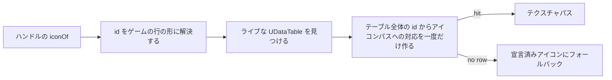

## このページでできるようになること

- Palworld 自身の状態異常をエフェクトに指定し、その全一覧を把握する
- ネイティブの状態異常を自分のコードから付与・解除・読み戻しする
- 状態異常の呼び出しが返す `false` が何を意味し、何を意味しないかを理解する
- どのドメインがどのアイコンテーブルのどの列を読み、値がなぜ文字列で届くのかを知る
- id の大文字小文字を最初から正しく書く（両方向とも）

## 状態異常の語彙

`core.status` は Palworld 自身の状態異常システムを名前で扱います。すべてのキャラクターがそれを
コンポーネントとして持っており、`/Script/Pal.PalCharacter` が `StatusComponent` プロパティを公開し、
その実体クラス `UPalStatusComponent` に `AddStatus`、`RemoveStatus`、`GetExecutionStatus` が
あります。3 つとも引数は `EPalStatusID` 1 つ、つまり整数で、構造体も `FName` も渡しません。

語彙は `EPalStatusID` で、C++ ヘッダダンプから読み出したものです。名前は 38 個、実際の整数値つき。

```text
AttackUp (26)      Burn (19)              CollectItem (28)    Coma (8)
ControlSP (1)      Darkness (25)          DefenseUp (27)      Drown (14)
DrownCheck (4)     Dying (15)             Electrical (22)     FallDamage (17)
FishingSpotElectrical (37)                Freeze (21)         GainHP (2)
HPLock (38)        Happiness (11)         IvyCling (24)       LavaDamage (18)
LifeSteal (29)     Moratorium (13)        MorphChange (32)    Muddy (23)
Overwork (10)      PalEnhancement (33)    PalEnhancement2 (34)
PalEnhancement3 (35)                      PartBreak (36)      Poison (5)
RaidBossStatusChange (30)                 RarePalEffect (31)  Resistance (12)
ShieldRecovery (16)                       Sleep (9)           StepCooldown (3)
Stun (7)           UNKOTimer (6)          Wetness (20)
```

`None`（0）と末尾の番兵 `EPalStatusID_MAX` は除いてあります。どちらも誰かが付与できる状態異常では
ありません。`UNKOTimer` や `Moratorium` のように奇妙に読める名前があるのは、それがプレイヤーに見える
状態異常ではなく内部タイマーだからです。除外すると未対応に見えてしまうので、奇妙なまま載せています。
パックがよく使うのは `Poison`、`Stun`、`Sleep`、`Burn`、`Freeze`、`Electrical`、`Darkness`、
`Wetness`、`AttackUp`、`DefenseUp` あたりです。

`core.status.names()` はこの一覧をソートして返し、`Effect.Spec` は `nativeStatus` を**定義時**に
その一覧と照合します。名前のタイプミスは定義を書いているその一度だけの間違いで、実際の語彙を添えて
その場で伝えるのが役に立つ瞬間です。

## 付与する、そして false の意味

```lua
Effect{ id = "mypack:Venom", name = "Venom", nativeStatus = "Poison" }

-- あるいは直接、任意の PalCharacter に（プレイヤーのポーンもパルも該当します）
local status = require("palforge.core.status")
status.add(me, "Poison")        -- ゲームが受け付ければ true
status.isActive(me, "poison")   -- 大文字小文字を区別しない。true / false / 尋ねられなければ nil
status.remove(me, "Poison")
```

呼び出しはすべて `core.signature` を通ります。ライブクラスがその関数を宣言していない限り呼び出しを
拒否し、どの証拠に基づいて発火したかをログに残します。

```text
[PalForge.status][info] status.add AttackUp (EPalStatusID 26) [declared]
```

これは 2026-07-26 にロード済みセーブで観測された動作です。add と remove の間で
`GetExecutionStatus` が状態異常を「あり」と読み戻し、remove 後は「なし」と読み戻しました。そこへ
たどり着くために 1 点だけ直す必要がありました。これらの引数は `ByteProperty` ではなく
`EnumProperty` として宣言されています。レガシーな `enum` ではなく `enum class` だからで、この
ツリーの `EPal*` 引数はすべて同じ形です。

<Callout type="warn">
`add` や `remove` が返す `false` は、**呼び出しが発火しなかった**という意味です。対象が耐性を持って
いたという意味には決してなりません。`isActive` は、そもそも質問できなかったとき（そのアクターに
コンポーネントがない、このビルドでアクセサが宣言されていない）は `false` ではなく `nil` を返します。
</Callout>

## アイコンの出どころ

`core.icons` は各ドメインの `iconOf()` が通る唯一の経路です。アイコンテーブル記述子とコンテンツ id
を渡すと、ライブな `UDataTable` を見つけ、その id をキーにした行を読み、行が持つテクスチャ参照を
返します。

```lua
local icons = require("palforge.core.icons")
local tex   = icons.resolve(icons.TABLES.item, "Wood")   -- テクスチャパス、または nil
```

`icons.TABLES` は 4 ドメイン、7 テーブルを指します。うち 3 つは Palworld 自身の慣習である `_Common`
の兄弟テーブルを持ち、パートナースキルのテーブルだけは単独です。

| ドメイン | テーブル | 行数 |
| --- | --- | --- |
| `item` | `DT_ItemIconDataTable`, `..._Common` | 1207 |
| `pal` | `DT_PalCharacterIconDataTable`, `..._Common` | 674 |
| `building` | `DT_BuildObjectIconDataTable`, `..._Common` | 571 |
| `skill` | `DT_partnerSkillIconDataTable` | 311 |

スキルのテーブルはスキル id ではなく**パル** id をキーにしています（行は `Alpaca`、`Anubis`、
`Bastet` など）。したがってヒットしうるのはパル由来のパートナースキルだけです。パッシブスキルには
アイコン行がなく、設計どおり宣言済みの `icon` にフォールバックします。

テーブルの探索は安全で安いものから順です。まず `FindObject("DataTable", name)` の直接指定、次に
レート制限つきの全テーブルスイープ、最後に実測済みパッケージパスへの `LoadAsset` です。スイープが
最後なのは、ロード済みテーブルすべてに触れるからで、そこで無効ポインタを踏むと Lua の `pcall` では
捕まえられないアクセス違反になります。



最初のステップに注目してください。DataTable の行 FName は**解決後**の形なので、`"mypack:Potion"`
は検索前に `"mypack_Potion"` になっている必要があります。`resolve(id)` 単独ではなく
`resolve(id) or id` を使うので、不正な id でもゲームに聞ける唯一の質問はできます。

```lua
function Class:iconOf()
    local id = om.resolve(self.id) or self.id
    local ok, tex = pcall(function() return icons.resolve(icons.TABLES.building, id) end)
    if ok and tex ~= nil then return tex end
    return self.icon
end
```

## 各テーブルが持つ列

各アイコンテーブルのアイコン列は推測ではなく実測です。実セッションでロードされていた 391 個の
DataTable すべてに対してプロパティを歩き、それぞれの列一覧を出力しました。

| テーブル | 列 |
| --- | --- |
| `DT_ItemIconDataTable[_Common]` | `Icon` |
| `DT_PalCharacterIconDataTable[_Common]` | `Icon` |
| `DT_BuildObjectIconDataTable[_Common]` | `SoftIcon` |
| `DT_partnerSkillIconDataTable` | `TextureID_8_2B2F889C43EB586246BDB981B6462ACA` |

アイテム、パル、建物の各テーブルは列をちょうど 1 つだけ持ち、それが行の全部です。パートナースキルの
行構造体は Blueprint の `UserDefinedStruct` なので、そのプロパティには UE がそうした構造体の全
フィールドに付けるエディタ GUID の接尾辞が付きます。この装飾された綴りこそがリフレクション上の
プロパティ名であり、インデックスに使わなければならない名前です。

C++ ダンプは同じ 3 つの名前を出荷バイナリ側から裏づけ、さらに型も示します。アイテムとパルの行は
`TSoftObjectPtr<UTexture2D> Icon`、建物の行は `TSoftObjectPtr<UTexture2D> SoftIcon` です。3 つとも
フィールドは 1 つで、それはソフトオブジェクトポインタ、つまりライブオブジェクトではなくアセットの
**パス**です。呼び出し側が `LoadAsset` に渡したいものそのものです。

## 値を文字列として読む理由

UE4SS は `UDataTable` 自身に行リーダーをバインドしています（`FindRow`、`GetRowNames`、
`GetRowMap`、`GetAllRows`、`ForEachRow`）。リフレクションのスイープがこれらを見逃してきたのは
そのためです。C++ ダンプ上の `UDataTable` はプロパティ 5 つ、関数**ゼロ**です。

`FindRow` は動きますし、返ってくる行に実測どおりの列も乗っています。しかしその列から出てくる値は
`TSoftObjectPtr` の userdata で、この UE4SS ビルドでは何一つ応答しません。ソフトポインタが公開して
いそうな 19 個の名前をすべて試しました。`Get`、`LoadSynchronous`、`ToString`、`ToSoftObjectPath`、
`GetPathName`、`GetAssetName`、`GetLongPackageName`、`GetAssetPathName`、`GetAssetPathString`、
`IsValid`、`IsNull`、`IsPending`、`ObjectID`、`AssetPath`、`AssetPathName`、`SubPathString`、
`PackageName`、`AssetName`、`WeakPtr` ——どれも読めません。Lua 向けのドキュメント化された面もありま
せん。つまりこの構造体は Lua から開けず、メンバ名をさらに推測しても状況は変わりません。

読めるのは同じ列をテキストとして描画したもので、それを返す唯一のアクセサが
`GetDataTableColumnAsString(const UDataTable*, FName PropertyName)` です。1 行につき 1 要素、RowMap
の順で返ります。そして UE4SS 自身のバインディングである `GetRowNames` も同じ RowMap を同じ順で
歩きます。2 つを zip すれば、構造体を 1 つも Lua に渡さずに 2 回の呼び出しでテーブル全体の
「id からアイコンパスへ」が得られます。両者は長さが一致したときだけ対応づけられます。合わないまま
組めば自信満々に間違ったアイコンを配ることになり、それは `nil` より悪い唯一の結果です。

この経路は要素を `RemoteUnrealParam`（UE4SS の任意型ラッパー）で包んで渡し、実際の値は `:get()` の
後ろにあります。これは C++ のシグネチャからは推測できない一点で、見落とすと配列は正しい**長さ**の
まま中身が空になります。「1207 行中 0 行がアイコンを持つ」という、もっともらしい嘘の正体がこれでした。

```text
[PalForge.icons][info] icons: DT_PalCharacterIconDataTable column Icon read - 674 of 674 rows carry an icon [declared]
[PalForge.icons][info] icons: DT_ItemIconDataTable column Icon read - 1183 of 1207 rows carry an icon [declared]
[PalForge.icons][info] icons: DT_BuildObjectIconDataTable column SoftIcon read - 567 of 571 rows carry an icon [declared]
[PalForge.icons][info] icons: DT_partnerSkillIconDataTable column TextureID_8_... read - 311 of 311 rows carry an icon [declared]
```

これは 2026-07-26 のライブ読み取りで、全アイコンテーブルを一度に読んだ結果です。アイテムテーブルの
24 行の空欄は、本当にアイコンを持たない行です。ほかのテーブルが 100% かそれに近いことが、読み取りが
成功しているということの意味です。この `N of M` の行は、`nil` の理由を「読み取りが発火しなかった」
と「そんな行はない」に分ける材料でもあります。

## 大文字小文字と、それを決める層

大文字小文字を決めるのは、どの層にいるかではなく **id が何を指しているか**です。ツリー全体で 2 つの
規則が一貫しています。

- **エンジンの列挙型**を指す id は大文字小文字を区別しません。`core.status` は自分の名前を小文字化
  したマップを持つので、`nativeStatus = "poison"` は `"Poison"` と同じく `EPalStatusID` 5 を見つけ
  ます。`core.character` も 309 個の `EPalWazaID` 名に対して同じことをします。
- **DataTable の行**やレジストリキーを指す id は大文字小文字を区別します。アイコンマップはテーブルが
  持つ文字列そのものでインデックスされ、`om.get` は素のテーブル参照です。

したがって `"Sheepball"` は当たり、`"SheepBall"` は当たりません。しかもどちらの綴りも実在します。
1 体のクリーチャーのブループリント id と DataTable の行 id が実際に違うからです。両方を持ち歩くのは
ネイティブカタログの仕事であり、`core.icons` はその 2 つの間で推測しません。推測が別の行に当たれば、
自信満々に間違ったアイコンを返すことになるからです。

## まとめ

- `Effect{ nativeStatus = "Poison" }` はゲーム自身の 38 個の状態異常の 1 つを写し、定義時に照合されます。
- `status.add` / `remove` / `isActive` は任意の `PalCharacter` に効き、`false` は呼び出しが発火しなかったという意味です。
- `iconOf()` はまず id をゲームの行の形に解決し、それからライブなアイコン DataTable を読みます。
- 各アイコンテーブルの列は実測済みです。`Icon`、`Icon`、`SoftIcon`、そしてパートナーテーブルの GUID 付きの名前。
- 列の値は Lua から開けない `TSoftObjectPtr` なので、列を文字列として読み、行名と zip します。
- 列挙型の名前は大文字小文字を吸収し、DataTable の行とレジストリキーは吸収しません。

<Cards>
  <Card title="Effect" href="/docs/api/effect">nativeStatus の宣言場所と、エフェクト面の残り</Card>
  <Card title="識別子と所有" href="/docs/concepts/identity-and-ownership">行の検索前に id を解決しなければならない理由</Card>
  <Card title="Item" href="/docs/api/item">最大のアイコンテーブルを持つドメインの iconOf</Card>
</Cards>
