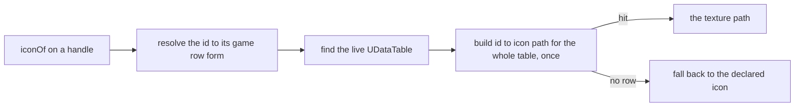

## What you can do after this page

- Name one of Palworld's own ailments on an effect, and know the whole list
- Apply, clear and read back a native status from your own code
- Understand what a `false` from a status call does and does not mean
- Know which icon table a domain reads, which column it uses, and why the value arrives as a string
- Get the case of an id right the first time, in both directions

## The ailment vocabulary

`core.status` addresses Palworld's own ailment system by name. Every character carries it on a
component: `/Script/Pal.PalCharacter` exposes a `StatusComponent`, and the class behind it,
`UPalStatusComponent`, is where `AddStatus`, `RemoveStatus` and `GetExecutionStatus` live. All
three take one `EPalStatusID` argument — an integer, no struct and no `FName`.

The vocabulary is `EPalStatusID`, read out of the C++ header dump. Thirty-eight names, with their
real integer values:

```text
AttackUp (26)      Burn (19)              CollectItem (28)    Coma (8)
ControlSP (1)      Darkness (25)          DefenseUp (27)      Drown (14)
DrownCheck (4)     Dying (15)             Electrical (22)     FallDamage (17)
FishingSpotElectrical (37)                Freeze (21)         GainHP (2)
HPLock (38)        Happiness (11)         IvyCling (24)       LavaDamage (18)
LifeSteal (29)     Moratorium (13)        MorphChange (32)    Muddy (23)
Overwork (10)      PalEnhancement (33)    PalEnhancement2 (34)
PalEnhancement3 (35)                      PartBreak (36)      Poison (5)
RaidBossStatusChange (30)                 RarePalEffect (31)  Resistance (12)
ShieldRecovery (16)                       Sleep (9)           StepCooldown (3)
Stun (7)           UNKOTimer (6)          Wetness (20)
```

`None` (0) and the trailing `EPalStatusID_MAX` sentinel are left out: neither is an ailment anyone
can apply. A few of the names read oddly — `UNKOTimer`, `Moratorium` — because they are internal
timers rather than player-facing ailments. They are listed because leaving one out would make it
look unsupported when it is only strange. The ones a pack usually wants are `Poison`, `Stun`,
`Sleep`, `Burn`, `Freeze`, `Electrical`, `Darkness`, `Wetness`, `AttackUp` and `DefenseUp`.

`core.status.names()` prints that list sorted, and `Effect.Spec` checks `nativeStatus` against it
**at definition time** — a typo is a mistake you make once, while writing the definition, and the
useful moment to hear about it is right then, with the real vocabulary in the message.

## Applying one, and what a false means

```lua
Effect{ id = "mypack:Venom", name = "Venom", nativeStatus = "Poison" }

-- or directly, on any PalCharacter (the player pawn and a pal both qualify)
local status = require("palforge.core.status")
status.add(me, "Poison")        -- true when the game accepted it
status.isActive(me, "poison")   -- case-insensitive; true, false, or nil for "cannot ask"
status.remove(me, "Poison")
```

Every call goes through `core.signature`, which refuses to make one unless the live class declares
it and logs which evidence it fired on:

```text
[PalForge.status][info] status.add AttackUp (EPalStatusID 26) [declared]
```

That was observed working on 2026-07-26 in a loaded save, with `GetExecutionStatus` reading the
ailment back as present between an add and a remove and absent after. One detail had to change to
get there: these parameters are declared `EnumProperty`, not `ByteProperty` — an `enum class`
rather than a legacy `enum` — and every `EPal*` argument in this tree is the same shape.

<Callout type="warn">
A `false` from `add` or `remove` means **the call did not fire**. It never means the target was
immune. `isActive` returns `nil` rather than `false` when the question could not be asked at all —
no component on that actor, or the accessor is not declared on this build.
</Callout>

## Where an icon comes from

`core.icons` is the single route behind every domain's `iconOf()`. Given an icon-table descriptor
and a content id, it finds the live `UDataTable`, reads the row keyed by that id, and hands back
the texture reference the row carries.

```lua
local icons = require("palforge.core.icons")
local tex   = icons.resolve(icons.TABLES.item, "Wood")   -- a texture path, or nil
```

`icons.TABLES` names four domains and seven tables. Three of them have a `_Common` sibling —
Palworld's own convention — and the partner-skill table stands alone:

| Domain | Tables | Rows |
| --- | --- | --- |
| `item` | `DT_ItemIconDataTable`, `..._Common` | 1207 |
| `pal` | `DT_PalCharacterIconDataTable`, `..._Common` | 674 |
| `building` | `DT_BuildObjectIconDataTable`, `..._Common` | 571 |
| `skill` | `DT_partnerSkillIconDataTable` | 311 |

The skill table is keyed by **pal** id, not by skill id — its rows are `Alpaca`, `Anubis`,
`Bastet` and so on — so only pal-derived partner skills can ever hit it. A passive skill has no
icon row and falls back to the declared `icon` by design.

A table is found by the cheapest safe route first: a targeted `FindObject("DataTable", name)`,
then a rate-limited sweep of every loaded table, then a `LoadAsset` on the measured package path.
The sweep is last because it touches every loaded table, and a stale pointer there raises an
access violation Lua's `pcall` cannot catch.



Note the first step. A DataTable row FName is the **resolved** form, so `"mypack:Potion"` has to
become `"mypack_Potion"` before the lookup — `resolve(id) or id`, never `resolve(id)` alone, so a
malformed id still asks the game the only question it can:

```lua
function Class:iconOf()
    local id = om.resolve(self.id) or self.id
    local ok, tex = pcall(function() return icons.resolve(icons.TABLES.building, id) end)
    if ok and tex ~= nil then return tex end
    return self.icon
end
```

## The column each table carries

The icon column of each table is measured, not inferred — a property walk over all 391 DataTables
loaded in a real session printed the column list of every one:

| Table | Column |
| --- | --- |
| `DT_ItemIconDataTable[_Common]` | `Icon` |
| `DT_PalCharacterIconDataTable[_Common]` | `Icon` |
| `DT_BuildObjectIconDataTable[_Common]` | `SoftIcon` |
| `DT_partnerSkillIconDataTable` | `TextureID_8_2B2F889C43EB586246BDB981B6462ACA` |

Item, pal and building tables each have exactly one column, and it is the whole row. The
partner-skill row struct is a Blueprint `UserDefinedStruct`, so its properties carry the editor
GUID suffix UE appends to every field of one — that decorated spelling **is** the reflected
property name and is what an index has to use.

The C++ dump confirms the same three names from the shipping binary, and gives the type:
`TSoftObjectPtr<UTexture2D> Icon` on the item and pal rows, `TSoftObjectPtr<UTexture2D> SoftIcon`
on the building row. All three carry one field and it is a soft object pointer — an asset **path**
rather than a live object, which is exactly what a caller wants to hand to `LoadAsset`.

## Why the value is read as a string

UE4SS binds a row reader onto `UDataTable` itself — `FindRow`, `GetRowNames`, `GetRowMap`,
`GetAllRows`, `ForEachRow` — which is why every reflection sweep missed them: the C++ dump shows
`UDataTable` declaring five properties and **zero** functions.

`FindRow` works, and the measured column really is on the row it returns. What comes back from
that column is a `TSoftObjectPtr` userdata, and on this UE4SS build it answers nothing at all. A
probe asked it for all nineteen names a soft pointer could plausibly expose — `Get`,
`LoadSynchronous`, `ToString`, `ToSoftObjectPath`, `GetPathName`, `GetAssetName`,
`GetLongPackageName`, `GetAssetPathName`, `GetAssetPathString`, `IsValid`, `IsNull`, `IsPending`,
`ObjectID`, `AssetPath`, `AssetPathName`, `SubPathString`, `PackageName`, `AssetName`, `WeakPtr` —
and not one of them is readable. There is no documented Lua surface for it either. So the struct
cannot be opened from Lua, and no further guessing at member names changes that.

What can be read is the same column rendered as text, by the one accessor that returns plain
strings: `GetDataTableColumnAsString(const UDataTable*, FName PropertyName)`. One entry per row, in
RowMap order — and `GetRowNames`, UE4SS's own binding, walks the same RowMap in the same order.
Zipping the two gives id to icon path for a whole table in two calls, with no struct ever crossing
into Lua. The two lists are only paired when their lengths match: pairing them anyway would hand
out confidently wrong icons, which is the one outcome worse than `nil`.

That route delivers its elements wrapped in `RemoteUnrealParam`, UE4SS's dynamic wrapper for any
type, with the real value behind `:get()`. That is the detail that is not guessable from the C++
signature, and missing it is what made the array read the right **length** with nothing in it — an
honest-looking "0 of 1207 rows carry an icon".

```text
[PalForge.icons][info] icons: DT_PalCharacterIconDataTable column Icon read - 674 of 674 rows carry an icon [declared]
[PalForge.icons][info] icons: DT_ItemIconDataTable column Icon read - 1183 of 1207 rows carry an icon [declared]
[PalForge.icons][info] icons: DT_BuildObjectIconDataTable column SoftIcon read - 567 of 571 rows carry an icon [declared]
[PalForge.icons][info] icons: DT_partnerSkillIconDataTable column TextureID_8_... read - 311 of 311 rows carry an icon [declared]
```

That is a live read from 2026-07-26, every icon table at once. The item table's 24 blanks are rows
that genuinely carry no icon: the other tables are at or near 100%, which is what a working read
looks like. The `N of M` line is also what tells a `nil` apart — "the read did not fire" against
"there is no such row".

## Case sensitivity, and which layer decides it

Case is decided by **what an id names**, not by which layer you are in. Both rules are consistent
across the tree:

- An id naming an **engine enum** is case-insensitive. `core.status` builds a lowered map of its
  own names, so `nativeStatus = "poison"` finds `EPalStatusID` 5 exactly as `"Poison"` does.
  `core.character` does the same for the 309 `EPalWazaID` names.
- An id naming a **DataTable row** or a registry key is case-sensitive. The icon map is indexed by
  the exact string the table carries, and `om.get` is a raw table index.

So `"Sheepball"` hits and `"SheepBall"` does not — and both spellings are real, because one
creature's blueprint id and its DataTable row id genuinely differ. Carrying both is the native
catalogs' job; `core.icons` will not guess between them, because a guess that hits the wrong row
hands back a confidently wrong icon.

## Summary

- `Effect{ nativeStatus = "Poison" }` mirrors one of the game's own 38 ailments, checked at define time.
- `status.add` / `remove` / `isActive` work on any `PalCharacter`; a `false` means the call did not fire.
- `iconOf()` resolves the id to its game row form first, then reads the live icon DataTable.
- Each icon table's column is measured: `Icon`, `Icon`, `SoftIcon`, and the partner table's GUID-suffixed name.
- The column value is a `TSoftObjectPtr` that Lua cannot open, so the column is read as strings and zipped against the row names.
- Enum names fold case; DataTable rows and registry keys do not.

<Cards>
  <Card title="Effect" href="/docs/api/effect">Where nativeStatus is declared, and the rest of the effect surface</Card>
  <Card title="Identity and ownership" href="/docs/concepts/identity-and-ownership">Why an id has to be resolved before a row lookup</Card>
  <Card title="Item" href="/docs/api/item">iconOf on the domain with the largest icon table</Card>
</Cards>
