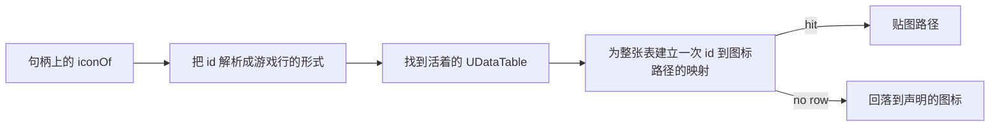

## 读完本页你可以做到

- 在效果上指定幻兽帕鲁自己的状态异常，并掌握完整名单
- 在自己的代码里施加、清除并回读一个原生状态
- 明白状态调用返回 `false` 意味着什么、不意味着什么
- 知道每个域读哪张图标表的哪一列，以及值为什么以字符串到手
- 一次就把 id 的大小写写对，两个方向都对

## 状态词表

`core.status` 用名字来操作幻兽帕鲁自己的状态异常系统。每个角色都把它挂在一个组件上：
`/Script/Pal.PalCharacter` 暴露了 `StatusComponent` 属性，其背后的类 `UPalStatusComponent` 里就是
`AddStatus`、`RemoveStatus` 和 `GetExecutionStatus`。三者都只接受一个 `EPalStatusID` 参数——一个整数，
没有结构体，也没有 `FName`。

词表就是 `EPalStatusID`，从 C++ 头文件转储中读出。三十八个名字，附带各自真实的整数值：

```text
AttackUp (26)      Burn (19)              CollectItem (28)    Coma (8)
ControlSP (1)      Darkness (25)          DefenseUp (27)      Drown (14)
DrownCheck (4)     Dying (15)             Electrical (22)     FallDamage (17)
FishingSpotElectrical (37)                Freeze (21)         GainHP (2)
HPLock (38)        Happiness (11)         IvyCling (24)       LavaDamage (18)
LifeSteal (29)     Moratorium (13)        MorphChange (32)    Muddy (23)
Overwork (10)      PalEnhancement (33)    PalEnhancement2 (34)
PalEnhancement3 (35)                      PartBreak (36)      Poison (5)
RaidBossStatusChange (30)                 RarePalEffect (31)  Resistance (12)
ShieldRecovery (16)                       Sleep (9)           StepCooldown (3)
Stun (7)           UNKOTimer (6)          Wetness (20)
```

`None`（0）和末尾的哨兵 `EPalStatusID_MAX` 没有列入：两者都不是谁能施加的状态。有几个名字读起来
很怪——`UNKOTimer`、`Moratorium`——因为它们是内部计时器而不是面向玩家的状态；把它们留着，是因为漏
掉一个会让人以为不支持，其实只是名字奇怪。包通常想要的是 `Poison`、`Stun`、`Sleep`、`Burn`、
`Freeze`、`Electrical`、`Darkness`、`Wetness`、`AttackUp` 和 `DefenseUp`。

`core.status.names()` 会把这份名单排序打印，而 `Effect.Spec` 在**定义时**就拿 `nativeStatus` 对照
它。名字拼错是写定义时才会犯一次的错误，把真实词表带在消息里当场告诉你，才是有用的时机。

## 施加，以及 false 的含义

```lua
Effect{ id = "mypack:Venom", name = "Venom", nativeStatus = "Poison" }

-- 或者直接作用在任何 PalCharacter 上（玩家 Pawn 和帕鲁都算）
local status = require("palforge.core.status")
status.add(me, "Poison")        -- 游戏接受时返回 true
status.isActive(me, "poison")   -- 不区分大小写；true、false，或者问不到时返回 nil
status.remove(me, "Poison")
```

所有调用都经过 `core.signature`：除非活着的类确实声明了该函数，否则它拒绝发起调用，并把这次是凭
哪一份证据发火的写进日志：

```text
[PalForge.status][info] status.add AttackUp (EPalStatusID 26) [declared]
```

这是 2026-07-26 在一个已加载存档里观测到的：add 与 remove 之间 `GetExecutionStatus` 把状态读回为
「有」，remove 之后读回为「无」。为此只需要改一处：这些参数声明为 `EnumProperty` 而不是
`ByteProperty`——是 `enum class` 而非旧式 `enum`——本仓库里每一个 `EPal*` 参数都是这个形状。

<Callout type="warn">
`add` 或 `remove` 返回 `false` 表示**这次调用没有发火**，绝不表示目标免疫。当问题根本问不出口时
（那个 Actor 上没有该组件，或者这次构建没有声明该访问器），`isActive` 返回的是 `nil` 而不是
`false`。
</Callout>

## 图标从哪里来

`core.icons` 是每个域的 `iconOf()` 共用的唯一路径。给它一个图标表描述符和一个内容 id，它会找到活着
的 `UDataTable`，读出以该 id 为键的行，并把行里携带的贴图引用交回来。

```lua
local icons = require("palforge.core.icons")
local tex   = icons.resolve(icons.TABLES.item, "Wood")   -- 一条贴图路径，或者 nil
```

`icons.TABLES` 涉及四个域、七张表。其中三个有 `_Common` 兄弟表——这是幻兽帕鲁自己的约定——而伙伴
技能那张表是独立的：

| 域 | 表 | 行数 |
| --- | --- | --- |
| `item` | `DT_ItemIconDataTable`、`..._Common` | 1207 |
| `pal` | `DT_PalCharacterIconDataTable`、`..._Common` | 674 |
| `building` | `DT_BuildObjectIconDataTable`、`..._Common` | 571 |
| `skill` | `DT_partnerSkillIconDataTable` | 311 |

技能表是以**帕鲁** id 而不是技能 id 为键的——它的行是 `Alpaca`、`Anubis`、`Bastet` 之类——所以只有
源自帕鲁的伙伴技能才可能命中。被动技能没有图标行，按设计回落到声明的 `icon`。

查表按又便宜又安全的顺序来：先是定点的 `FindObject("DataTable", name)`，然后是带频率限制的全表扫描，
最后才是对实测包路径做 `LoadAsset`。扫描放在最后，是因为它会碰到每一张已加载的表，而在那里踩到失效
指针会引发 Lua 的 `pcall` 抓不住的访问违规。



注意第一步。DataTable 的行 FName 是**解析后**的形式，所以 `"mypack:Potion"` 必须先变成
`"mypack_Potion"` 才能查——用的是 `resolve(id) or id` 而不是单独的 `resolve(id)`，这样即使 id 写坏
了，也仍然能向游戏提出它唯一能提的问题：

```lua
function Class:iconOf()
    local id = om.resolve(self.id) or self.id
    local ok, tex = pcall(function() return icons.resolve(icons.TABLES.building, id) end)
    if ok and tex ~= nil then return tex end
    return self.icon
end
```

## 每张表用哪一列

每张图标表的图标列是实测出来的，不是推断的：一次属性遍历走过了真实会话中已加载的全部 391 张
DataTable，并打印出每一张的列清单。

| 表 | 列 |
| --- | --- |
| `DT_ItemIconDataTable[_Common]` | `Icon` |
| `DT_PalCharacterIconDataTable[_Common]` | `Icon` |
| `DT_BuildObjectIconDataTable[_Common]` | `SoftIcon` |
| `DT_partnerSkillIconDataTable` | `TextureID_8_2B2F889C43EB586246BDB981B6462ACA` |

道具、帕鲁和建筑三张表各自只有一列，那一列就是整行。伙伴技能的行结构体是蓝图的
`UserDefinedStruct`，所以它的属性带着 UE 给这类结构体每个字段加的编辑器 GUID 后缀——那个带装饰的
拼写**就是**反射出来的属性名，也是索引时必须使用的名字。

C++ 转储从出货二进制这一侧印证了同样的三个名字，并给出类型：道具行和帕鲁行是
`TSoftObjectPtr<UTexture2D> Icon`，建筑行是 `TSoftObjectPtr<UTexture2D> SoftIcon`。三者都只有一个
字段，而且是软对象指针——是资源**路径**而不是活对象，恰好就是调用方想交给 `LoadAsset` 的东西。

## 为什么把值当字符串读

UE4SS 自己把一套行读取器绑在了 `UDataTable` 上——`FindRow`、`GetRowNames`、`GetRowMap`、
`GetAllRows`、`ForEachRow`——这也是历次反射扫描都漏掉它们的原因：C++ 转储里的 `UDataTable` 声明了
五个属性、**零**个函数。

`FindRow` 是好用的，实测到的那一列确实在它返回的行上。但那一列取出来的值是一个 `TSoftObjectPtr`
userdata，在这次 UE4SS 构建上它什么都不回答。一个探针把软指针可能暴露的十九个名字全试了一遍——
`Get`、`LoadSynchronous`、`ToString`、`ToSoftObjectPath`、`GetPathName`、`GetAssetName`、
`GetLongPackageName`、`GetAssetPathName`、`GetAssetPathString`、`IsValid`、`IsNull`、`IsPending`、
`ObjectID`、`AssetPath`、`AssetPathName`、`SubPathString`、`PackageName`、`AssetName`、`WeakPtr`——
一个都读不出来，也没有任何面向 Lua 的文档化接口。所以这个结构体在 Lua 里打不开，再怎么猜成员名也
改变不了这一点。

能读的是同一列被渲染成文本的版本，唯一返回纯字符串的访问器是
`GetDataTableColumnAsString(const UDataTable*, FName PropertyName)`。每行一个元素，按 RowMap 顺序
返回——而 UE4SS 自带的 `GetRowNames` 也按同样的顺序走同一个 RowMap。把两者拉链拼起来，两次调用就
能得到整张表的「id 到图标路径」，全程没有任何结构体进入 Lua。只有当两个列表长度一致时才会配对：长度
不一致还硬配，就会自信满满地发出错误的图标，那是比 `nil` 更糟的唯一结局。

这条路线交回来的元素被包在 `RemoteUnrealParam` 里——那是 UE4SS 面向任意类型的动态包装——真正的值
藏在 `:get()` 后面。这正是从 C++ 签名里猜不出来的一点；漏掉它，数组的**长度**完全正确而内容全空，
也就是那句看起来很像真话的「1207 行里 0 行带图标」。

```text
[PalForge.icons][info] icons: DT_PalCharacterIconDataTable column Icon read - 674 of 674 rows carry an icon [declared]
[PalForge.icons][info] icons: DT_ItemIconDataTable column Icon read - 1183 of 1207 rows carry an icon [declared]
[PalForge.icons][info] icons: DT_BuildObjectIconDataTable column SoftIcon read - 567 of 571 rows carry an icon [declared]
[PalForge.icons][info] icons: DT_partnerSkillIconDataTable column TextureID_8_... read - 311 of 311 rows carry an icon [declared]
```

这是 2026-07-26 的一次实机读取，一口气读完全部图标表。道具表里那 24 行空白是真的没有图标的行：其余
几张表都在 100% 或接近 100%，那就是一次成功读取应有的样子。这行 `N of M` 也是把 `nil` 拆开的依据
——是「读取没有发火」还是「根本没有这一行」。

## 大小写，以及由谁决定

大小写由 **id 指的是什么**决定，而不是由你身处哪一层决定。两条规则在整个仓库里是一致的：

- 指向**引擎枚举**的 id 不区分大小写。`core.status` 为自己的名字建了一张小写映射，所以
  `nativeStatus = "poison"` 和 `"Poison"` 一样能找到 `EPalStatusID` 5。`core.character` 对 309 个
  `EPalWazaID` 名做同样的事。
- 指向 **DataTable 行**或注册表键的 id 区分大小写。图标映射按表里携带的确切字符串建索引，而
  `om.get` 就是一次原始的表下标。

于是 `"Sheepball"` 命中而 `"SheepBall"` 不命中——而且两种拼写都真实存在，因为同一只生物的蓝图 id 和
DataTable 行 id 确实不同。同时带上两者是原生目录的职责；`core.icons` 不会在两者之间猜，因为猜错行会
交回一张自信满满但错误的图标。

## 小结

- `Effect{ nativeStatus = "Poison" }` 映射游戏自己的 38 个状态之一，并在定义时校验。
- `status.add` / `remove` / `isActive` 作用于任意 `PalCharacter`；`false` 表示调用没有发火。
- `iconOf()` 先把 id 解析成游戏行的形式，再去读活着的图标 DataTable。
- 每张图标表的列都是实测的：`Icon`、`Icon`、`SoftIcon`，以及伙伴表那个带 GUID 后缀的名字。
- 列里的值是 Lua 打不开的 `TSoftObjectPtr`，所以按字符串读整列，再和行名拉链配对。
- 枚举名会吸收大小写差异，DataTable 行和注册表键不会。

<Cards>
  <Card title="Effect" href="/docs/api/effect">nativeStatus 的声明位置，以及效果域的其余部分</Card>
  <Card title="标识与归属" href="/docs/concepts/identity-and-ownership">为什么查行之前必须先解析 id</Card>
  <Card title="Item" href="/docs/api/item">图标表最大的那个域上的 iconOf</Card>
</Cards>
