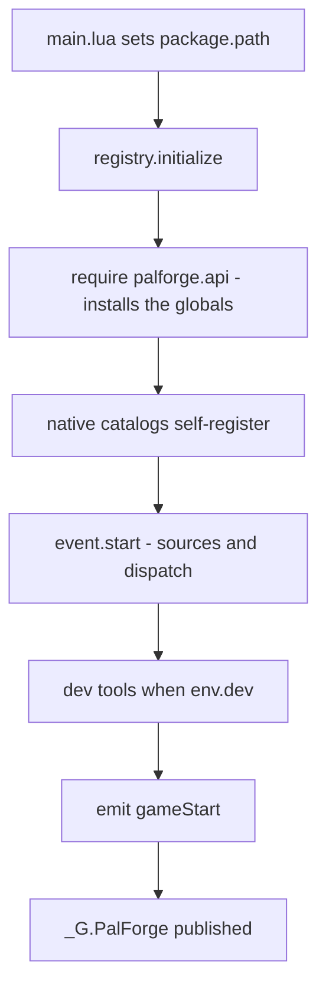
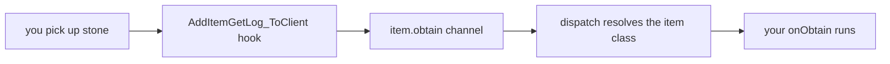
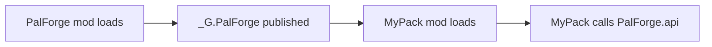

PalForge を使うと、自分で作った建物・アイテム・パル・スキル・音・エフェクト・メニューを Palworld に
追加できます。短い Lua ファイルに「こういうものが欲しい」と書くと、それがゲームに出てきます。

このページでは、導入して、動いていることを確かめて、最初の定義がゲーム内の操作に反応するところまで
進めます。

## このページでできるようになること

- 自分の Palworld で PalForge を動かす
- ゲームのログを見るだけで、起動したかどうかが分かる
- 自分のアイテムを追加して、拾ったときにメッセージを出す
- 開けた回数を数えるチェストを追加して、次に遊ぶときも回数が残るようにする
- 何かが出てこないとき、自分で原因を突き止める

## インストール

<Steps>

<Step>

### ファイルを配置する

PalForge は UE4SS 上で動きます。UE4SS は、Palworld で Lua 製の Mod を動かすためのローダーです。ほかの
Palworld の Lua Mod がすでに動いているなら、UE4SS は入っています。

`ue4ss/Mods/` の下に `PalForge` というフォルダを作り、次のように配置してください。`palforge/` は
`main.lua` と同じ階層に置きます。`main.lua` は自分のフォルダを基準に PalForge の残りを探すため、配置が
違うとすべて動かなくなります。

```text
ue4ss/
└── Mods/
    └── PalForge/
        ├── enabled.txt
        └── Scripts/
            ├── main.lua
            └── palforge/
                ├── env.lua
                ├── types.lua
                ├── api/
                ├── core/
                ├── native/
                ├── tests/
                └── utils/
```

`Scripts/palforge/types.lua` は型注釈だけのファイルで、ゲームの実行中はどこからも読み込まれません。
入力中にエディタが定義のフィールドを補完できるようにするためのものです。
[エディタ設定](/docs/concepts/editor-setup) を参照してください。

</Step>

<Step>

### Mod を有効にする

UE4SS で Lua Mod を有効にする方法は 2 つあります。Mod フォルダの中に空の `enabled.txt` を置くか、
`ue4ss/Mods/mods.txt` に 1 行追加します。

```text title="ue4ss/Mods/mods.txt"
CheatManagerEnablerMod : 1
ConsoleEnablerMod : 1
PalForge : 1
```

`CheatManagerEnablerMod` は、ゲーム本体の管理オブジェクト `UPalCheatManager` を PalForge に
使わせるための Mod です。有効なままにしてください。パルをワールドに出す処理はこのオブジェクトを
通るので、無いと `Pal.Handle:spawn` はゲームに届く前に断られ、次の行を出して諦めます。

```text
[PalForge.spawn][warn] spawn.pal: no PalCheatManager (CheatManagerEnabler mod missing this session?)
```

</Step>

<Step>

### ゲームを起動してログを読む

UE4SS は Mod の出力を自分のコンソールウィンドウに表示し、同じ内容を `UE4SS.log` というファイルにも
書き出します。PalForge のメッセージはすべて `utils/log` を通り、`[PalForge.<scope>][<level>] <msg>` の
形式になります。ゲームのロード中にこれを見てください。確認すべき行は次の 2 つの節にあります。

</Step>

</Steps>

## ゲーム起動時に何が起きるか

UE4SS が実行するのは `main.lua` 1 ファイルだけです。順に次を行います。

1. Lua の `package.path` を自分のフォルダに向けます
   （`thisDir .. "?.lua;" .. thisDir .. "?\\init.lua;"`）。これで `require("palforge.api")` が隣にある
   モジュールを見つけられます。
2. `palforge.env` を読み込み、バージョンと dev フラグを出力します。
3. `registry.initialize()` を `pcall` の中で呼び、失敗したら `initialize failed: <err>`、成功したら
   `ready` を出力します。
4. `_G.PalForge` を公開し、ほかの Mod が動作中の PalForge をそのまま使えるようにします。

```lua title="Scripts/main.lua (excerpt)"
local thisDir = debug.getinfo(1, "S").source:match("@?(.*[\\/])") or ""
package.path = thisDir .. "?.lua;" .. thisDir .. "?\\init.lua;" .. package.path

local env      = require("palforge.env")
local registry = require("palforge.core.registry")
local log      = require("palforge.utils.log").scope("main")

log.info("PalForge v" .. tostring(env.version) .. " starting (dev=" .. tostring(env.dev) .. ")")
```

すべてが立ち上がるのは `registry.initialize()` の中です。5 つのステップを実行します。



カタログのロード順は `buildings`、`items`、`pals`、`skills`、`effects`、`audio`、`ui` です。カタログを
読み込むことがそのまま登録になります。定義の呼び出しが、実行されたときに自分自身を
`core/object_manager` に書き込むからです。それらのファイルに並んでいる長い ID のリストは、`get(id)` で
要求されるまで単なるデータのままなので、起動時に何千もの行 ID が一度に登録されることはありません。

`_G.PalForge` には、ほかの Mod が必要とするものが一式載っています。

```lua
_G.PalForge = {
    env = env,
    api = require("palforge.api"),
    utils = { log = ..., json = ..., file = ..., items = ... },
    core = {
        registry = ..., event = ..., object_manager = ..., spawn = ..., mesh = ...,
        sound = ..., player = ..., spatial = ..., icons = ...,
    },
    native = require("palforge.native"),
}
```

## 正常な起動ログ

同梱の既定値は `env.dev = true` です。この状態での正常な起動は次のようになります。

```text
[PalForge.main][info] PalForge v0.3.0 starting (dev=true)
[PalForge.event][info] tick source live
[PalForge.event][info] event wired: bus + sources (tick/world/building/pal/item live; onBuild + onSpawned arm at world.ready; craft+discard have no native source) + dispatch
[PalForge.keyboard][info] bound F4
[PalForge.keyboard][info] keybinds loaded (1 function file(s): F4)
[PalForge.registry][info] dev console command registered: ps_catalog (DataTable dumper, opt-in)
[PalForge.unittests][info] tests: 8 passed, 0 failed, 0 skipped (8 total)
[PalForge.keyboard][info] bound F1
[PalForge.registry][info] initialized (dev=true, 19 class(es) registered)
[PalForge.main][info] ready
```

クラス数は、登録された定義の数そのものです。同梱カタログが宣言しているものに、自分の定義が加わります。
PalForge が起動したことを示す行は `[PalForge.main][info] ready` です。

もう 2 行はワールドのゲートに対応します。PalForge はセーブデータのロードが終わるまでワールド内の
オブジェクトに触れません。1 行目はセーブの準備ができたとき、2 行目はそのワールドを離れたときに出ます。

```text
[PalForge.event][info] world ready - building dispatch enabled
[PalForge.event][info] world left - building dispatch paused
```

<Callout type="info">
world ソースは 1000 ms ごとに `FindFirstOf("PalPlayerCharacter")` を確認し、有効な結果が 5 回連続で
得られてから `world.ready` を発行します。それまで building / pal / item の各ソースは早期リターンするので、
タイトル画面にいる間は自分のハンドラは動きません。Mod のロード直後から動くソースは tick の
ハートビートだけです。確認ループ自体を設置できなかった場合はログに
`ready-watch unavailable (...) - dispatch always on` が出て、そのまま全部動きます。
</Callout>

## dev トグル

`Scripts/palforge/env.lua` には、PalForge が実行時に読む設定が入っています。`require()` にキャッシュ
されるため、どのモジュールも同じテーブルを見ます。

```lua title="Scripts/palforge/env.lua"
return {
    dev     = true,        -- THE dev/release switch (dev tools load only when true)
    name    = "PalForge",
    version = "0.3.0",
}
```

`dev` が true のとき、`registry.initialize()` は追加で次を行います。

- `core/keyboard/` のキーバインドファイルを読み込みます。これにより **F4** が
  `utils.items.unlockAllTech` になり、押すとカスタムの建物やチェストがビルドメニューに出ます。
- `ps_catalog` コンソールコマンドを登録します。これは手動で実行する DataTable ダンパーで、自動では
  決して動きません。
- `palforge.tests` のヘッドレステスト一式を実行します。`tests: ...` の行はこれによるものです。
- ゲーム内テストスイート `palforge.test` を読み込み、**F1** に割り当てます。キーを押すまで何も実行され
  ません。これらのテストは動いているワールドに触れるからです。

コンテンツカタログだけを登録する静かなリリースビルドにするには `dev = false` にします。

```lua title="Scripts/palforge/env.lua"
return {
    dev     = false,
    name    = "PalForge",
    version = "0.3.0",
}
```

どのモジュールからも同じテーブルを読めます。

```lua
local env = require("palforge.env")
local log = require("palforge.utils.log").scope("mypack")

if env.dev then
    log.info("dev build " .. tostring(env.version))
end
```

<Callout type="warn">
dev ゲートは `registry.initialize()` の内部で読まれます。そのあとに `require("palforge.env").dev` を
書き換えても、自分のコードから見える値が変わるだけで、dev ツールのロード状態は変わりません。確実に
切り替えるには `env.lua` を編集してください。
</Callout>

## 最初の定義

自分のコードは `main.lua` と同じ階層に、独立したファイルとして置きます。`package.path` はそのフォルダを
すでに含んでいるので、素の `require` で読み込めます。

```lua title="ue4ss/Mods/PalForge/Scripts/mypack.lua"
local api = require("palforge.api")
local log = require("palforge.utils.log").scope("mypack")

api.Item{
    id       = "Stone",
    name     = "Stone",
    category = "material",
    maxStack = 9999,
    events   = {
        onObtain = function(item, ctx)
            log.info("picked up " .. tostring(ctx.count) .. " stone")
        end,
    },
}
```

PalForge 本体が立ち上がったあと、`main.lua` の末尾から読み込みます。

```lua title="ue4ss/Mods/PalForge/Scripts/main.lua"
_G.PalForge = {
    -- ... unchanged ...
}

local ok, err = pcall(require, "mypack")
if not ok then print("[mypack] load failed: " .. tostring(err) .. "\n") end

return _G.PalForge
```

<Callout type="warn">
自分のファイルは `registry.initialize()` が走った**あと**に require してください。それより前では
グローバルがインストールされておらず、native カタログもロードされていません。`pcall` も重要です。
定義のフィールドを間違えるとハードエラーになり、保護しないと `main.lua` の残りが止まります。
</Callout>

`Item{ id = "Stone" }` は、ゲームにすでにある ID に自分の振る舞いとメタデータを結び付けます。Lua だけで
ゲームのアイテム・パル・建物のテーブルに新しい行を追加することはできません。これらはゲームの DataTable
で、そこに新しい行を書くのは PalSchema の仕事です。ですから、すでにある ID の上に作ります。例が
バニラの ID を使っているのはそのためです。コロンを含まない ID はゲームの実 ID（`Stone`、`Wood`、
`PalBoxV2`）を指し、`"pack:name"` は自分の名前空間付き ID で、行名 `pack_name` に対応します。

次は、何かを覚えておく定義です。建築のインスタンスは `self.actor`、`self.pos`、`self.state`、
`self:save()` を持ちます。

```lua title="ue4ss/Mods/PalForge/Scripts/mypack.lua"
local api = require("palforge.api")
local log = require("palforge.utils.log").scope("mypack")

api.Building{
    id     = "ItemChest",
    name   = "Counted Chest",
    gridCm = 100,
    state  = { uses = 0 },
    events = {
        onLoad = function(self, ctx)
            log.info("chest tracked at " .. string.format("%.0f,%.0f,%.0f", self.pos.x, self.pos.y, self.pos.z))
        end,
        onRightClick = function(self, ctx)
            self.state.uses = self.state.uses + 1
            self:save()
            log.info("chest opened " .. tostring(self.state.uses) .. " time(s)")
        end,
    },
}
```

1 つの ID が持てる定義は 1 つだけです。`object_manager` は種類と ID をキーにしているため、PalForge が
すでに定義を同梱している ID を定義すると、そちらを置き換えます。`native/buildings` は `WorkBench` と
`PalBoxV2`、`native/items` は `Wood` / `Berries` / `Arrow`、`native/pals` は `ChickenPal` と `SheepBall`
を同梱しています。置き換えたい場合を除いて、別の ID を選んでください。

パルの例では、ハンドラではなくアクションを見てみます。スポーンには数秒の猶予をあげてください。
クリーチャーが現れるのは呼び出しから 4〜8 秒後で、宣言したメッシュとハンドラを持って出てきます。

```lua
local api = require("palforge.api")

-- Pal.get works for any game CharacterID, defined or not.
api.Pal.get("ChickenPal"):spawn(api.Player.coordinate())   -- the pal arrives a few seconds later

-- Defining the same id attaches your own mesh and handlers to it. This replaces
-- native/pals' curated ChickenPal demo definition.
local chicken = api.Pal{
    id   = "ChickenPal",
    name = "Chicken Pal",
    mesh = api.Mesh{
        id        = "mypack:chicken_body",
        kind      = "skeletal",
        model     = "/Game/Pal/Model/Character/Monster/ChickenPal/SK_ChickenPal.SK_ChickenPal",
        animClass = "/Game/Pal/Blueprint/Character/Monster/PalActorBP/ChickenPal/ABP_ChickenPal.ABP_ChickenPal_C",
    },
    events = {
        onSpawned = function(pal, ctx)
            pal:renderOn(ctx.actor)
        end,
    },
}

chicken:spawn(api.Player.coordinateOffset(300, 0, 0))     -- 3 m away, a few seconds later
```

## ゲーム内で確認する

セーブデータをロードして、ログを見ます。

<Steps>

<Step>

### ワールドのゲートが開いたか確認する

```text
[PalForge.event][info] world ready - building dispatch enabled
```

この行が出るまで、building / pal / item の各ソースは早期リターンします。動いているのは tick の
ハートビートだけです。

</Step>

<Step>

### 同梱デモを動かす

PalForge が同梱している定義にはすでにライブのハンドラが付いているので、自分で何も書かなくても配線が
動いていることを確認できます。

```text
[PalForge.native.items][info] Wood onObtain: count=1
[PalForge.native.items][info] Berries onUse: target=...
[PalForge.native.pals][info] ChickenPal onDamaged: ...
```

1 つ目は木を伐る、2 つ目はベリーを食べる、3 つ目は野生の Chicken を攻撃すると出ます。

</Step>

<Step>

### 自分のハンドラを動かす

岩を採掘すると自分のハンドラが走ります。

```text
[PalForge.mypack][info] picked up 3 stone
```

ゲームから自分の関数までの経路は次のとおりです。



`ctx.itemId` と `ctx.count` はゲーム自身の取得ログ構造体から取り出され、その ID が `object_manager` で
引かれます。自分が定義していないバニラ ID は何にも一致せず、その場合は静かに何も起きません。

</Step>

<Step>

### 何が登録されたか調べる

```lua
local registry = require("palforge.core.registry")
local log      = require("palforge.utils.log").scope("mypack")

for id in pairs(registry.registered().item) do
    log.info("item: " .. id)
end
```

`registry.registered()` は種類 → ID のスナップショットを返します。種類は `item`、`pal`、`building`、
`skill`、`effect`、`audio`、`mesh`、`ui` です。

</Step>

</Steps>

`env.dev = true` なら、**F1**（ゲーム内テストスイートの実行）と **F4**（すべてのテクノロジーを解放）が
そのまま動作確認に使えます。

## API へのアクセス方法

`require("palforge.api")` は同時に 2 つのことをします。すべてが載ったテーブルを返し、さらにそのまま
使えるグローバル名も作ります。どちらも指している実体は同じです。

<Tabs items={['名前空間', 'グローバル', 'コンパニオン Mod']}>

<Tab value="名前空間">

```lua
local api = require("palforge.api")

api.Item.get("Wood"):give(10)
api.Pal.get("ChickenPal"):spawn(api.Player.coordinate())   -- the pal arrives a few seconds later
```

</Tab>

<Tab value="グローバル">

```lua
require("palforge.api")   -- installing the globals is the side effect

Item.get("Wood"):give(10)
Pal.get("ChickenPal"):spawn(Player.coordinate())
```

グローバルは `Pal`、`Item`、`Building`、`Skill`、`Effect`、`Audio`、`Mesh`、`UI`、`Player` です。UE4SS は
Lua Mod ごとに独立した Lua state を与えるため、これらの名前は自分の Mod だけのもので、ゲームや他の Mod と
衝突しません。

</Tab>

<Tab value="コンパニオン Mod">

```lua
local api = _G.PalForge.api

api.Item.get("Wood"):give(10)
api.Pal.get("ChickenPal"):spawn(api.Player.coordinate())
```

自分の `package.path` が PalForge の `Scripts/` フォルダを指しておらず、`require("palforge.*")` が
使えない場合はこの形にします。

</Tab>

</Tabs>

どの種類のコンテンツも同じ形なので、1 つ覚えれば残りも同じです。

```lua
local pal = Pal{ id = "example:Boss", name = "Boss" }   -- make one
Pal.get("ChickenPal")                                   -- find one by id
Pal.get_all()                                           -- list every one
```

## 自分のパックを独立した Mod にする

`main.lua` が `_G.PalForge` を公開しているので、別の Mod は PalForge をもう 1 つ読み込む代わりに、すでに
動いているものを使えます。



```text
ue4ss/Mods/MyPack/
├── enabled.txt
└── Scripts/
    └── main.lua
```

```lua title="ue4ss/Mods/MyPack/Scripts/main.lua"
local PF = _G.PalForge
if not PF then
    print("[mypack] PalForge is not loaded - check the mod load order\n")
    return
end

local api = PF.api
local log = PF.utils.log.scope("mypack")

api.Item{
    id       = "Stone",
    name     = "Stone",
    category = "material",
    maxStack = 9999,
    events   = {
        onObtain = function(item, ctx)
            log.info("picked up " .. tostring(ctx.count) .. " stone")
        end,
    },
}

log.info("mypack loaded")
```

`ue4ss/Mods/mods.txt` では PalForge を自分のパックより上に書き、自分の定義が走る前に PalForge の起動が
終わっているようにします。

<Callout type="warn">
UE4SS は Lua Mod ごとに独立した Lua state を与えます。`_G.PalForge` は PalForge の `main.lua` が走った
state にロードされたコードから参照できますが、別の Mod フォルダがその state を共有するかどうかは UE4SS の
ビルドとロード構成に依存します。`if not PF then ... return end` のガードは必ず残し、これに引っかかる場合は
「最初の定義」の節のように、PalForge 自身の `Scripts/` フォルダからファイルを読み込んでください。
</Callout>

公開テーブルには `api` のほかに、ツールボックスとエンジンも入っています。

```lua
local PF = _G.PalForge

PF.utils.log.scope("mypack").info("hello")
PF.utils.items.unlockAllTech()
PF.native.items.get("Arrow_Fire")
PF.native.buildings.WorkBench:unlock()

PF.core.event.on("tick", function(ctx)
    if ctx.count % 120 == 0 then PF.utils.log.scope("mypack").info("one minute") end
end)
```

起動後に定義しても問題ありません。あとから定義した建築は次のスキャンで拾われ、パルとアイテムの
イベントは発生した時点で ID から解決されるため、`gameStart` の 1 分後に登録した定義でもイベントを
受け取れます。

## トラブルシューティング

### `[PalForge.*]` の行がまったく出ない

Mod がロードされていません。次の順に確認します。

- `Scripts/main.lua` が `ue4ss/Mods/PalForge/` の直下にあり、`palforge/` がその隣にあるか。`main.lua` は
  自分のファイルの位置から `package.path` を割り出すため、フォルダが動くとすべての `require` が壊れます。
- Mod が有効か。Mod フォルダ内の空の `enabled.txt`、または `ue4ss/Mods/mods.txt` の `PalForge : 1`。
- そもそも UE4SS が Lua Mod をロードしているか（他の Lua Mod が自分の行を出力しているか）。

### `initialize failed: ...`

```text
[PalForge.main][err] initialize failed: ...
```

`registry.initialize()` からエラーが抜けました。`main.lua` が捕捉するのでゲームは動き続けますが、ソースも
ディスパッチもカタログも何一つライブになりません。コロンより後ろが実際のエラーです。1 つのカタログだけが
失敗した場合は、`native catalog 'palforge.native.items' load error: ...` として別の行に出ます。

### 未知のフィールド

```text
PalForge: Pal: unknown field "meshSpec" (did you mean "mesh"?). Valid fields: id, name, description, skills, mesh, material, color, texture, icon, events, data
```

定義に存在しないフィールドは、修正候補付きのハードエラーになります。名前を打ち間違えても黙って無視される
ことはありません。同じチェックは `events` を含むネストしたテーブルにも走ります。

```text
PalForge: Pal: field "events" (Pal.Spec.Events): unknown field "onSpawn" (did you mean "onSpawned"?). Valid fields: onSpawned, onDamaged, onDeath, onCaptured, onTick
```

呼び出しが何を受け付けるかは、自分のコードから問い合わせることもできます。

```lua
local schema = require("palforge.core.schema")

print(schema.help("Pal.Spec"))          -- every field, type, default and meaning
print(schema.help("Pal.Spec.Events"))   -- the handler list
schema.get("Pal.Spec").fields           -- the same as a table, for tooling
```

### id がない

```text
PalForge: Item: field "id" is required (item id: a game ItemId ("Wood") or "pack:name")
```

`id` はどの種類のコンテンツでも必須です。括弧内はそのフィールド自身のドキュメントなので、どういう値を
渡すべきかがメッセージから分かります。

### 値や型が不正

```text
PalForge: Item: field "category" must be one of { "material", "consumable", "equipment", "ammo", "ingredient", "other" }, got "food"
PalForge: Item: field "maxStack" expects number, got string
PalForge: Building: field "mesh" (Building.Spec.Mesh): field "model" is required (UStaticMesh asset path, or an OBJ path for the procedural backend)
```

呼び出しが中途半端に成功することはありません。チェックが落ちた時点で、何も登録される前にエラーになります。

### ハンドラが呼ばれない

- そのフックを呼ぶものがあるか確認します。アイテムの `onCraft` と `onDiscard`、建築の `onLeftClick` と
  `onBreak` は書けますが、まだ何も発行しません。代わりに `onUse` / `onObtain`、`onRightClick` /
  `onRemove` を使ってください。ライブなものは [ライフサイクル](/docs/concepts/lifecycle) にまとまっています。
- ワールドのゲートを確認します。`world ready - building dispatch enabled` より前は何も動きません。
- ゲーム側の都合で設置できなかったフックがないか確認します。

  ```text
  [PalForge.event][warn] hook unavailable (feature disabled): /Script/Pal.PalBuildObject:OnBeginInteractBuilding -> ...
  ```

- ID を確認します。アイテムは `ctx.itemId` で、パルはブループリントのクラス名（`BP_<Id>_C`、そのパルの
  アクターに対するゲーム内部の名前）で照合されます。`object_manager` にない ID は静かに何もしません。
  エラーにはなりません。

### ハンドラは呼ばれるが、中で何かが壊れている

ハンドラは `pcall` の中で走るので、間違いがあってもゲームは落ちません。エラーは、発生したチャンネルと
フックの名前付きでログに書かれます。

```text
[PalForge.event][err] item.use -> onUse handler failed: ...
```

建築の `onTick` は、失敗が続くと停止されます。壊れたハンドラ 1 つがハートビートを永久に消費しないように
するためです。

```text
[PalForge.event][err] onTick 'WorkBench@1204,-431,84' failed: ...
[PalForge.event][warn] onTick 'WorkBench@1204,-431,84' disabled after 5 failures
```

開発中は危険な処理を自分で包み、出るメッセージを自分で決めておくと楽です。

```lua
events = {
    onRightClick = function(self, ctx)
        local ok, err = pcall(function()
            -- your work here
        end)
        if not ok then log.err("onRightClick: " .. tostring(err)) end
    end,
}
```

### スポーンしても何も起きない

まずはもう数秒待ってください。パルが現れるのは `:spawn` が返ってから 4〜8 秒後で、いつ現れたかは
ログに出ます（[Pal](/docs/api/pal) を参照）。それだけ待っても何も出てこない場合は、次の行を探して
ください。

```text
[PalForge.spawn][warn] spawn.pal: no PalCheatManager (CheatManagerEnabler mod missing this session?)
```

これは、呼び出しがゲームに届く前に拒否されたという意味です。ワールドへのスポーンには
`UPalCheatManager` が必要なので、`mods.txt` で `CheatManagerEnablerMod` を有効にしてください。

## 次に読むもの

<Cards>
  <Card title="定義" href="/docs/concepts/definitions">
    作り方、探し方、一覧の取り方、そして返ってくるもの。
  </Card>
  <Card title="スキーマ" href="/docs/concepts/schema">
    各コンテンツが受け付けるフィールドと、実行時の読み出し方。
  </Card>
  <Card title="ライフサイクル" href="/docs/concepts/lifecycle">
    どのハンドラが、いつ呼ばれ、`ctx` に何が入るのか。
  </Card>
  <Card title="最初のコンテンツパック" href="/docs/guides/first-content-pack">
    あらゆる種類のコンテンツを通しで組み上げた完全なパック。
  </Card>
</Cards>

## まとめ

- PalForge は `ue4ss/Mods/PalForge/Scripts/` に置き、`palforge/` を `main.lua` の隣に置きます。
  配置が違うと動きません。
- `[PalForge.main][info] ready` は PalForge が起動した合図、
  `world ready - building dispatch enabled` は自分のハンドラが動き出せる合図です。
- 自分のコンテンツは `main.lua` と同じ階層の自分のファイルに書き、`registry.initialize()` のあと、
  `main.lua` の末尾から `require` します。
- `Item{ ... }`、`Building{ ... }`、`Pal{ ... }` はどれも同じ形です。テーブルを渡して呼べば作れて、
  `get(id)` で探せて、`get_all()` で一覧できます。
- コロンを含まない ID はゲームのもの、`"pack:name"` は自分のものです。
- フィールド名を間違えると、その名前と正しい候補を並べたメッセージで呼び出しが止まります。推測せずに
  メッセージを読んでください。

次は [定義](/docs/concepts/definitions) を読むと、定義の呼び出しが何を返し、それで何ができるのかが
分かります。
