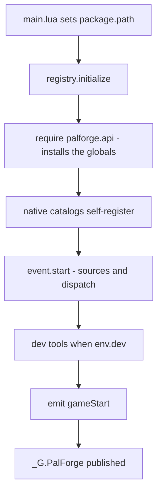
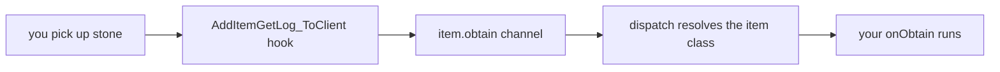
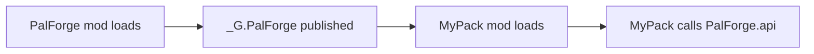

PalForge は UE4SS の Lua Mod として動作します。`Scripts/main.lua` と `Scripts/palforge/` のモジュールツリーを
所定の場所に配置し、Mod を有効化して、UE4SS のログでカーネルが起動したことを確認します。そのあとは、
`Pal{ ... }` / `Item{ ... }` / `Building{ ... }` などを呼ぶ Lua コードがコンテンツパックになります。

## インストール

<Steps>

<Step>

### ファイルを配置する

`main.lua` は自分自身のディレクトリから `package.path` を組み立てるため、配置は固定です。`palforge/` は
`main.lua` と同じ階層に置いてください。

```text
ue4ss/
└── Mods/
    └── PalForge/
        ├── enabled.txt
        └── Scripts/
            ├── main.lua
            └── palforge/
                ├── env.lua
                ├── types.lua
                ├── api/
                ├── core/
                ├── native/
                ├── tests/
                └── utils/
```

`Scripts/palforge/types.lua` は型注釈だけのファイルで、実行時にはどこからも require されません。LuaLS が
定義のフィールドを補完するために存在します。[エディタ設定](/docs/concepts/editor-setup) を参照してください。

</Step>

<Step>

### Mod を有効化する

UE4SS で Lua Mod を有効にする方法は 2 つあります。Mod フォルダ内に空の `enabled.txt` を置くか、
`ue4ss/Mods/mods.txt` に行を追加します。

```text title="ue4ss/Mods/mods.txt"
CheatManagerEnablerMod : 1
ConsoleEnablerMod : 1
PalForge : 1
```

`Pal.Handle:spawn` は `UPalCheatManager` を経由するため、パルをスポーンさせるなら
`CheatManagerEnablerMod` を有効なままにしてください。無効な場合、`core/spawn` は
`spawn.pal: no PalCheatManager (CheatManagerEnabler mod missing this session?)` と記録して `false` を返します。

</Step>

<Step>

### ゲームを起動してログを読む

PalForge のメッセージはすべて `utils/log` を通り、既定のシンクが
`[PalForge.<scope>][<level>] <msg>` の形式で出力します。ゲームのロード中に UE4SS のコンソール
（および `UE4SS.log`）を確認してください。期待される行は次の節にあります。

</Step>

</Steps>

## ロード時に main.lua が行うこと

`main.lua` は薄いエントリポイントです。順に次を行います。

1. 自分自身のディレクトリを `package.path` の先頭に追加します
   （`thisDir .. "?.lua;" .. thisDir .. "?\\init.lua;"`）。これにより `require("palforge.api")` が
   その `Scripts/` フォルダを基準に解決されます。
2. `palforge.env` を require し、バージョンと dev フラグを出力します。
3. `registry.initialize()` を `pcall` の中で呼び、失敗時は `initialize failed: <err>`、成功時は `ready` を
   出力します。
4. コンパニオン Mod のために `_G.PalForge` を公開します。

```lua title="Scripts/main.lua (excerpt)"
local thisDir = debug.getinfo(1, "S").source:match("@?(.*[\\/])") or ""
package.path = thisDir .. "?.lua;" .. thisDir .. "?\\init.lua;" .. package.path

local env      = require("palforge.env")
local registry = require("palforge.core.registry")
local log      = require("palforge.utils.log").scope("main")

log.info("PalForge v" .. tostring(env.version) .. " starting (dev=" .. tostring(env.dev) .. ")")
```

`registry.initialize()` はカーネルのエントリポイントで、5 つのステップを実行します。



カタログのロード順は `buildings`、`items`、`pals`、`skills`、`effects`、`audio`、`ui` です。登録は独立した
ステップではありません。定義の呼び出し自体が `core/object_manager` に書き込むため、カタログモジュールを
require することがそのままコンテンツの登録になります。巨大なカタログ配列は単なるデータのまま残り、各
モジュールの `get(id)` が遅延的に実体化します。だからこそ起動時に数千件の行 ID が登録されることはありません。

`_G.PalForge` には下流向けのサーフェスがすべて載ります。

```lua
_G.PalForge = {
    env = env,
    api = require("palforge.api"),
    utils = { log = ..., json = ..., file = ..., items = ... },
    core = {
        registry = ..., event = ..., object_manager = ..., spawn = ..., mesh = ...,
        sound = ..., player = ..., spatial = ..., icons = ...,
    },
    native = require("palforge.native"),
}
```

## 正常な起動ログ

`env.dev = true`（同梱の既定値）の場合、正常な起動は次のようになります。

```text
[PalForge.main][info] PalForge v0.3.0 starting (dev=true)
[PalForge.event][info] tick source live
[PalForge.event][info] event wired: bus + sources (tick/world/building live; pal/item TODO(dump)) + dispatch
[PalForge.keyboard][info] bound F1
[PalForge.keyboard][info] bound F4
[PalForge.keyboard][info] keybinds loaded (2 function file(s): F1,F4)
[PalForge.registry][info] dev console command registered: ps_catalog (DataTable dumper, opt-in)
[PalForge.unittests][info] tests: 8 passed, 0 failed (8 total)
[PalForge.registry][info] initialized (dev=true, 19 class(es) registered)
[PalForge.main][info] ready
```

クラス数は登録された数そのものです。19 は同梱の native カタログが宣言しているキュレーション済み定義の
数で、自分の定義を追加すればその分増えます。

次の 2 行はワールドのゲートに対応します。1 行目はセーブデータのロードが完了したとき、2 行目はその
ワールドを離れたときに出ます。

```text
[PalForge.event][info] world ready - building dispatch enabled
[PalForge.event][info] world left - building dispatch paused
```

<Callout type="info">
world ソースは 1000 ms ごとに `FindFirstOf("PalPlayerCharacter")` をポーリングし、有効な結果が 5 回連続で
得られてから `world.ready` を発行します。それまで building / pal / item の各ソースは早期リターンするため、
タイトル画面にいる間はこれらは何もディスパッチしません。Mod のロード直後から動くソースは tick の
ハートビートだけです。ポーリングループ自体を設置できなかった場合はログに
`ready-watch unavailable (...) - dispatch always on` が出て、ランタイムはフェイルオープンします。
</Callout>

## dev トグル

`Scripts/palforge/env.lua` は共有のランタイム設定です。`require()` にキャッシュされるため、このテーブルは
プロセス全体で 1 つのシングルトンになります。

```lua title="Scripts/palforge/env.lua"
return {
    dev     = true,        -- THE dev/release switch (dev tools load only when true)
    name    = "PalForge",
    version = "0.3.0",
}
```

`dev` が true のとき、`registry.initialize()` は追加で次を行います。

- キーバインドの動作ファイル（`core/keyboard/`）をロードします。**F1** は
  `Pal.get(id):spawn{ at = ... }` を通してプレイヤーの約 6 m 前方にレベル 5 の `ChickenPal` をスポーンし、
  着地位置をアナウンスします。**F4** は `utils.items.unlockAllTech` を呼んでカスタムの建築物やチェストを
  ビルドメニューに出します。
- `ps_catalog` コンソールコマンドを登録します。これはオプトインの DataTable ダンパーで、自動実行は決してしません。
- `palforge.tests` を require して登録済みスイートをすべて実行します。`tests: ...` の行はこれによるものです。

コンテンツカタログだけを登録する静かなリリースビルドにするには `dev = false` にします。

```lua title="Scripts/palforge/env.lua"
return {
    dev     = false,
    name    = "PalForge",
    version = "0.3.0",
}
```

どのモジュールからも同じテーブルを読めます。

```lua
local env = require("palforge.env")
local log = require("palforge.utils.log").scope("mypack")

if env.dev then
    log.info("dev build " .. tostring(env.version))
end
```

<Callout type="warn">
dev ゲートは `registry.initialize()` の内部で読まれます。初期化後に
`require("palforge.env").dev` を書き換えても、自分のコードから見える値が変わるだけで、dev ツールの
ロード状態は変わりません。確実に切り替えるには `env.lua` を編集してください。
</Callout>

## 最初の定義

自分のコードは `main.lua` と同じ階層に、独立したファイルとして置きます。`package.path` はそのディレクトリを
すでに含んでいるので、素の `require` で読み込めます。

```lua title="ue4ss/Mods/PalForge/Scripts/mypack.lua"
local api = require("palforge.api")
local log = require("palforge.utils.log").scope("mypack")

api.Item{
    id       = "Stone",
    name     = "Stone",
    category = "material",
    maxStack = 9999,
    events   = {
        onObtain = function(item, ctx)
            log.info("picked up " .. tostring(ctx.count) .. " stone")
        end,
    },
}
```

カーネルが起動したあと、`main.lua` の末尾から読み込みます。

```lua title="ue4ss/Mods/PalForge/Scripts/main.lua"
_G.PalForge = {
    -- ... unchanged ...
}

local ok, err = pcall(require, "mypack")
if not ok then print("[mypack] load failed: " .. tostring(err) .. "\n") end

return _G.PalForge
```

<Callout type="warn">
自分のファイルは `registry.initialize()` の実行**後**に require してください。それより前ではグローバルが
インストールされておらず、native カタログもロードされていません。`pcall` も重要です。スペックのエラーは
ハードエラーであり、保護しないと `main.lua` の残りが中断されます。
</Callout>

`Item{ id = "Stone" }` は、ゲームに既に存在する ID に振る舞いとメタデータを与えます。まったく新しい
DataTable の行を発行することは Lua だけでは不可能で、それは PalSchema の仕事です。例がバニラのアイテム ID を
使っているのはそのためです。コロンを含まない ID はゲームの実 ID を指し、`"pack:name"` は行 FName
`pack_name` に解決される名前空間付き ID です。

2 つ目は状態を持つ定義です。建築インスタンスは `self.actor`、`self.pos`、`self.state`、`self:save()` を持ちます。

```lua title="ue4ss/Mods/PalForge/Scripts/mypack.lua"
local api = require("palforge.api")
local log = require("palforge.utils.log").scope("mypack")

api.Building{
    id     = "ItemChest",
    name   = "Counted Chest",
    gridCm = 100,
    state  = { uses = 0 },
    events = {
        onLoad = function(self, ctx)
            log.info("chest tracked at " .. string.format("%.0f,%.0f,%.0f", self.pos.x, self.pos.y, self.pos.z))
        end,
        onRightClick = function(self, ctx)
            self.state.uses = self.state.uses + 1
            self:save()
            log.info("chest opened " .. tostring(self.state.uses) .. " time(s)")
        end,
    },
}
```

native カタログがキュレーションしている ID を定義し直すと、その登録を置き換えます。`object_manager` の
エントリは `(type, id)` をキーにしているためです。`native/buildings` は `WorkBench` と `PalBoxV2`、
`native/items` は `Wood` / `Berries` / `Arrow`、`native/pals` は `ChickenPal` と `SheepBall` を
キュレーションしているので、置き換えたい場合を除いて別の ID を選んでください。

パルの例では、ハンドラではなくアクションを見てみます。

```lua
local api = require("palforge.api")

-- Pal.get works for any game CharacterID, defined or not.
api.Pal.get("ChickenPal"):spawn(api.Player.coordinate())

-- Defining the same id attaches your own mesh and handlers to it. This replaces
-- native/pals' curated ChickenPal demo definition.
local chicken = api.Pal{
    id   = "ChickenPal",
    name = "Chicken Pal",
    mesh = api.Mesh{
        id        = "mypack:chicken_body",
        kind      = "skeletal",
        model     = "/Game/Pal/Model/Character/Monster/ChickenPal/SK_ChickenPal.SK_ChickenPal",
        animClass = "/Game/Pal/Blueprint/Character/Monster/PalActorBP/ChickenPal/ABP_ChickenPal.ABP_ChickenPal_C",
    },
    events = {
        onSpawned = function(pal, ctx)
            pal:renderOn(ctx.actor)
        end,
    },
}

chicken:spawn(api.Player.coordinateOffset(300, 0, 0))
```

## ゲーム内で確認する

セーブデータをロードして、ログを見ます。

<Steps>

<Step>

### ワールドのゲートが開いたか確認する

```text
[PalForge.event][info] world ready - building dispatch enabled
```

この行が出るまで、building / pal / item の各ソースは早期リターンします。動いているのは tick の
ハートビートだけです。

</Step>

<Step>

### 同梱デモを動かす

native カタログにはすでにライブのハンドラが入っているので、自分でコードを書かなくてもディスパッチを確認できます。

```text
[PalForge.native.items][info] Wood onObtain: count=1
[PalForge.native.items][info] Berries onUse: target=...
[PalForge.native.pals][info] ChickenPal onDamaged: ...
```

1 つ目は木を伐る、2 つ目はベリーを食べる、3 つ目は野生の Chicken を攻撃すると出ます。

</Step>

<Step>

### 自分のハンドラを動かす

岩を採掘すると自分のハンドラが走ります。

```text
[PalForge.mypack][info] picked up 3 stone
```

ゲームから自分の関数までの経路は次のとおりです。



`ctx.itemId` と `ctx.count` はゲーム自身の取得ログ構造体から取り出され、ディスパッチはその ID を
`object_manager` で引きます。定義していないバニラ ID は何にも解決されず、ディスパッチは何もしません。

</Step>

<Step>

### 何が登録されたか調べる

```lua
local registry = require("palforge.core.registry")
local log      = require("palforge.utils.log").scope("mypack")

for id in pairs(registry.registered().item) do
    log.info("item: " .. id)
end
```

`registry.registered()` はオブジェクト型 → ID のスナップショットを返します。型は `item`、`pal`、
`building`、`skill`、`effect`、`audio`、`mesh`、`ui` です。

</Step>

</Steps>

`env.dev = true` なら、F1（前方に `ChickenPal` をスポーン）と F4（すべてのテクノロジーを解放）が
そのままスモークテストになります。

## API へのアクセス方法

`palforge.api` を require すると、素のグローバルがインストールされ、**同時に**同じテーブルが名前空間付きで
返ります。どちらのスタイルでも実体は同じオブジェクトです。

<Tabs items={['名前空間', 'グローバル', 'コンパニオン Mod']}>

<Tab value="名前空間">

```lua
local api = require("palforge.api")

api.Item.get("Wood"):give(10)
api.Pal.get("ChickenPal"):spawn(api.Player.coordinate())
```

</Tab>

<Tab value="グローバル">

```lua
require("palforge.api")   -- installing the globals is the side effect

Item.get("Wood"):give(10)
Pal.get("ChickenPal"):spawn(Player.coordinate())
```

グローバルは `Pal`、`Item`、`Building`、`Skill`、`Effect`、`Audio`、`Mesh`、`UI`、`Player` です。UE4SS は
Lua Mod ごとに独立した state を与えるため、これらは Mod ローカルであり、ゲームや他の Mod と衝突しません。

</Tab>

<Tab value="コンパニオン Mod">

```lua
local api = _G.PalForge.api

api.Item.get("Wood"):give(10)
api.Pal.get("ChickenPal"):spawn(api.Player.coordinate())
```

自分の `package.path` が PalForge の `Scripts/` を指しておらず、`require("palforge.*")` が使えない場合は
この形にします。

</Tab>

</Tabs>

すべてのドメインモジュールは同じ 3 つのエントリポイントを持つので、1 つ覚えれば残りも同じです。

```lua
local pal = Pal{ id = "example:Boss", name = "Boss" }   -- CALL the module to define
Pal.get("ChickenPal")                                   -- an existing one, by id
Pal.get_all()                                           -- every registered one
```

## コンテンツパックを独立した UE4SS Mod にする

`main.lua` が `_G.PalForge` を公開しているので、別の Mod はフレームワークをもう 1 つ読み込む代わりに、
動作中のものを再利用できます。



```text
ue4ss/Mods/MyPack/
├── enabled.txt
└── Scripts/
    └── main.lua
```

```lua title="ue4ss/Mods/MyPack/Scripts/main.lua"
local PF = _G.PalForge
if not PF then
    print("[mypack] PalForge is not loaded - check the mod load order\n")
    return
end

local api = PF.api
local log = PF.utils.log.scope("mypack")

api.Item{
    id       = "Stone",
    name     = "Stone",
    category = "material",
    maxStack = 9999,
    events   = {
        onObtain = function(item, ctx)
            log.info("picked up " .. tostring(ctx.count) .. " stone")
        end,
    },
}

log.info("mypack loaded")
```

`ue4ss/Mods/mods.txt` では PalForge を自分のパックより上に書き、定義が走る前にカーネルが初期化される
ようにします。

<Callout type="warn">
UE4SS は Lua Mod ごとに独立した Lua state を与えます。`_G.PalForge` は PalForge の `main.lua` が走った
state にロードされたコードから参照できますが、別の Mod フォルダがその state を共有するかどうかは UE4SS の
ビルドとロード構成に依存します。`if not PF then ... return end` のガードは必ず残し、これに引っかかる場合は
「最初の定義」の節のように、PalForge 自身の `Scripts/` ディレクトリからファイルを読み込んでください。
</Callout>

公開テーブルには `api` のほかにツールボックスとエンジンも入っています。

```lua
local PF = _G.PalForge

PF.utils.log.scope("mypack").info("hello")
PF.utils.items.unlockAllTech()
PF.native.items.get("Arrow_Fire")
PF.native.buildings.WorkBench:unlock()

PF.core.event.on("tick", function(ctx)
    if ctx.count % 120 == 0 then PF.utils.log.scope("mypack").info("one minute") end
end)
```

起動後に定義しても問題ありません。あとから定義した建築は次の再構築スキャンで拾われ、パルとアイテムの
ディスパッチは発行時に ID で解決するため、`gameStart` の 1 分後に登録した定義でもイベントを受け取れます。

## トラブルシューティング

### `[PalForge.*]` の行がまったく出ない

Mod がロードされていません。次の順に確認します。

- `Scripts/main.lua` が `ue4ss/Mods/PalForge/` の直下にあり、`palforge/` がその隣にあるか。`main.lua` は
  自身のファイル位置から `package.path` を導出するため、ツリーがずれるとすべての `require` が壊れます。
- Mod が有効か。Mod フォルダ内の空の `enabled.txt`、または `ue4ss/Mods/mods.txt` の `PalForge : 1`。
- UE4SS 自体が Lua Mod をロードしているか（他の Lua Mod が自分の行を出力しているか）。

### `initialize failed: ...`

```text
[PalForge.main][err] initialize failed: ...
```

`registry.initialize()` からエラーが抜けました。`main.lua` が捕捉するのでゲームは動き続けますが、ソース・
ディスパッチ・カタログのいずれもライブになりません。コロンより後ろが実際のエラーです。カタログ単位の失敗は
`native catalog 'palforge.native.items' load error: ...` として別に記録されます。

### 未知のフィールド

```text
PalForge: Pal: unknown field "meshSpec" (did you mean "mesh"?). Valid fields: id, name, description, skills, mesh, material, color, texture, icon, events, data
```

バリデーションは厳格です。スペックに宣言されていないものはすべて did-you-mean 付きのハードエラーになるため、
装飾された名前が黙って無視されることはありません。同じチェックは `events` テーブルを含むネストした形にも走ります。

```text
PalForge: Pal: field "events" (Pal.Spec.Events): unknown field "onSpawn" (did you mean "onSpawned"?). Valid fields: onSpawned, onDamaged, onDeath, onCaptured, onTick
```

呼び出しが何を受け付けるかはレジストリに問い合わせられます。

```lua
local schema = require("palforge.core.schema")

print(schema.help("Pal.Spec"))          -- every field, type, default and meaning
print(schema.help("Pal.Spec.Events"))   -- the handler list
schema.get("Pal.Spec").fields           -- the same as a table, for tooling
```

### id がない

```text
PalForge: Item: field "id" is required (item id: a game ItemId ("Wood") or "pack:name")
```

`id` はどのドメインでも必須です。括弧内はそのフィールド自身のドキュメントなので、どういう値を渡すべきかが
メッセージから分かります。

### 値や型が不正

```text
PalForge: Item: field "category" must be one of { "material", "consumable", "equipment", "ammo", "ingredient", "other" }, got "food"
PalForge: Item: field "maxStack" expects number, got string
PalForge: Building: field "mesh" (Building.Spec.Mesh): field "model" is required (UStaticMesh asset path, or an OBJ path for the procedural backend)
```

呼び出しが中途半端に成功することはありません。バリデーションが落ちた時点で、何も登録される前にエラーになります。

### ハンドラが呼ばれない

- そのフックにネイティブソースが存在するか確認します。アイテムの `onCraft` と `onDiscard`、パルの `onTick`、
  建築の `onBuild` / `onLeftClick` / `onBreak` は宣言できますが、まだ何も発行しません。ライブなものは
  [ライフサイクル](/docs/concepts/lifecycle) にまとまっています。
- ワールドのゲートを確認します。`world ready - building dispatch enabled` より前にソースは動きません。
- 無効化されたフックがないか確認します。

  ```text
  [PalForge.event][warn] hook unavailable (feature disabled): /Script/Pal.PalBuildObject:OnBeginInteractBuilding -> ...
  ```

- ID を確認します。ディスパッチはアイテムを `ctx.itemId` で、パルを BP クラス名（`BP_<Id>_C`）で解決します。
  `object_manager` にない ID は、エラーではなく静かな no-op になります。

### ハンドラは呼ばれるが何も起きない

ディスパッチはフックを `pcall` の中で呼び、失敗をログに出しません。つまりハンドラ内の実行時エラーは
握りつぶされます。唯一の例外は建築の `onTick` です。

```text
[PalForge.event][err] onTick 'WorkBench@1204,-431,84' failed: ...
[PalForge.event][warn] onTick 'WorkBench@1204,-431,84' disabled after 5 failures
```

開発中は危険な処理を自分で包んでください。

```lua
events = {
    onRightClick = function(self, ctx)
        local ok, err = pcall(function()
            -- your work here
        end)
        if not ok then log.err("onRightClick: " .. tostring(err)) end
    end,
}
```

### スポーンしても何も起きない

```text
[PalForge.spawn][warn] spawn.pal: no PalCheatManager (CheatManagerEnabler mod missing this session?)
```

`:spawn` は `UPalCheatManager` を経由します。`mods.txt` で `CheatManagerEnablerMod` を有効にしてください。

## 次に読むもの

<Cards>
  <Card title="定義" href="/docs/concepts/definitions">
    共通のモジュール形状。呼び出して定義する、get、get_all、そして返ってくる Handle。
  </Card>
  <Card title="スキーマ" href="/docs/concepts/schema">
    スペックの宣言方法、バリデーション、実行時の読み出し方。
  </Card>
  <Card title="ライフサイクル" href="/docs/concepts/lifecycle">
    チャンネル、ネイティブソース、ディスパッチ、そしてどのフックがライブなのか。
  </Card>
  <Card title="最初のコンテンツパック" href="/docs/guides/first-content-pack">
    各ドメインを通しで組み上げた完全なパック。
  </Card>
</Cards>
