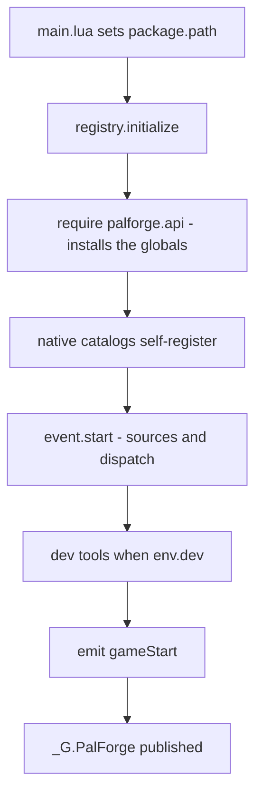
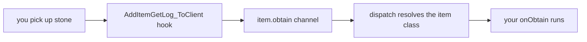
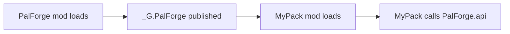

PalForge を使うと、自分で作った建物・アイテム・パル・スキル・音・エフェクト・メニューを Palworld に
追加できます。短い Lua ファイルに「こういうものが欲しい」と書くと、それがゲームに出てきます。

このページでは、導入して、動いていることを確かめて、最初の定義がゲーム内の操作に反応するところまで
進めます。

## このページでできるようになること

- 自分の Palworld で PalForge を動かす
- ゲームのログを見るだけで、起動したかどうかが分かる
- 自分のアイテムを追加して、拾ったときにメッセージを出す
- 開けた回数を数えるチェストを追加して、次に遊ぶときも回数が残るようにする
- 何かが出てこないとき、自分で原因を突き止める

## インストール

<Steps>

<Step>

### ファイルを配置する

PalForge は UE4SS 上で動きます。UE4SS は、Palworld で Lua 製の Mod を動かすためのローダーです。ほかの
Palworld の Lua Mod がすでに動いているなら、UE4SS は入っています。

`ue4ss/Mods/` の下に `PalForge` というフォルダを作り、次のように配置してください。`palforge/` は
`main.lua` と同じ階層に置きます。`main.lua` は自分のフォルダを基準に PalForge の残りを探すため、配置が
違うとすべて動かなくなります。

```text
ue4ss/
└── Mods/
    └── PalForge/
        ├── enabled.txt          <- 空ファイル。これがあるときだけ UE4SS は Mod を起動する
        └── Scripts/
            ├── main.lua
            └── palforge/
                ├── env.lua      <- dev/release スイッチと、計測対象のゲームビルド
                ├── types.lua    <- エディタ用の注釈のみ。実行時には読み込まれない
                ├── autorun.txt  <- キー不要の dev キュー（core/autorun.lua がここを読む）
                ├── api/         <- パックが書く相手になる公開サーフェス
                ├── core/        <- エンジン本体。カーネル、イベント系、Palworld ブリッジ
                ├── native/      <- Palworld 自身のコンテンツをデータカタログにしたもの
                ├── test/        <- ゲーム内 API スイート（単数形。下を参照）
                ├── tests/       <- ヘッドレスのユニットバンドル。dev では起動時に走る
                └── utils/       <- log, json, file, items
```

これは `tools/deploy.sh` がコピーする一覧そのものです。`Scripts/main.lua` と
`Scripts/palforge/` 全体から、参照専用で実行時には不要な `deprecated/` と `tmp/` を除いたものに
なります。

抜けやすいエントリが 2 つあり、どちらも別の症状に化けます。

- **`palforge/test/`（単数形）**。`core/registry.lua` は `palforge.test` を require しており、
  **F1** を割り当てているのはこのモジュールです。このディレクトリが無いインストールでは、dev
  モードでもテストスイートも F1 キーも存在せず、その理由を説明する行はログのどこにも出ません。
  （`palforge/tests/`（*複数形*）は別物で、dev では起動時にカーネルが走らせるヘッドレスの
  ユニットバンドルであり、`ps_catalog` コンソールコマンドの中身でもあります。こちらも同梱
  されます。`core/registry.lua` が起動時に require していることが分かった時点で、これを隠して
  いた `.gitignore` の行は削除されたので、クローンにも入っています。それでも無い場合は、
  カーネルが「dev tooling NOT loaded」の行に名前付きで挙げます。）
- **`palforge/autorun.txt`**。`core/autorun.lua` が `palforge/` の隣からこれを読み、ワールド
  ロード時に名前付きのアクションを実行します。キーもコンソールも効かないマシンで何かを走らせる
  唯一の方法です。このプロジェクトでは入力経路が 3 つ続けて死んでいます。

`Scripts/palforge/types.lua` は型注釈だけのファイルで、ゲームの実行中はどこからも読み込まれません。
入力中にエディタが定義のフィールドを補完できるようにするためのものです。
[エディタ設定](/docs/concepts/editor-setup) を参照してください。

</Step>

<Step>

### Mod を有効にする

UE4SS で Lua Mod を有効にする方法は 2 つあります。Mod フォルダの中に空の `enabled.txt` を置くか、
`ue4ss/Mods/mods.txt` に 1 行追加します。

```text title="ue4ss/Mods/mods.txt"
CheatManagerEnablerMod : 1
PalForge : 1
```

`CheatManagerEnablerMod` は、ゲーム本体の管理オブジェクト `UPalCheatManager` を PalForge に
渡す Mod です。ワールドへのスポーンはこのオブジェクトを通ります。ただし必須ではなく、あくまで
利便性のためのものです。`core/spawn.lua` の `cheatManager()` はまず生きているものを探し、次に
コントローラ自身の `CheatManager` を見て、どちらも無ければ
`StaticConstructObject(pc.CheatClass, pc)` で自分で 1 つ作ります。作れないのはプレイヤー
コントローラが無いときだけで、その状況を報告するのが次の行です。

```text
[PalForge.spawn][warn] spawn.pal: no PalCheatManager and none could be constructed (no player controller yet?)
```

</Step>

<Step>

### ゲームを起動してログを読む

UE4SS は Mod の出力を自分のコンソールウィンドウに表示し、同じ内容を `UE4SS.log` というファイルにも
書き出します。PalForge のメッセージはすべて `utils/log` を通り、`[PalForge.<scope>][<level>] <msg>` の
形式になります。ゲームのロード中にこれを見てください。確認すべき行は次の 2 つの節にあります。

</Step>

</Steps>

## ゲーム起動時に何が起きるか

UE4SS が実行するのは `main.lua` 1 ファイルだけです。順に次を行います。

1. Lua の `package.path` を自分のフォルダに向けます
   （`thisDir .. "?.lua;" .. thisDir .. "?\\init.lua;"`）。これで `require("palforge.api")` が隣にある
   モジュールを見つけられます。
2. 省略可能なモジュール `palforge_dev`（`Scripts/palforge_dev.lua`）を require し、3 つのうち
   どれが起きたかを記録します。`loaded`、`absent (release copy)`、`FAILED TO LOAD` です。この
   1 ファイルが dev スイッチのすべてで、3 つ目だけは別途 warn を出します。構文エラーで読めない
   dev オーバーレイと、フラグを無視するフレームワークは、外から見ると見分けがつかないからです。
3. 動いているゲームに `UKismetSystemLibrary` の CDO 経由でビルド文字列を尋ね、答えを
   `env.gameBuildLive` に入れます。この時点で何も答えないのは普通のことです（Lua Mod は早い段階で
   起動します）。そのため最初の `world.ready` で 1 度だけ読み直します。
4. 起動バナーを出力します。バージョン、宣言されたゲームビルドとライブのゲームビルド、`dev` と
   `debug`、dev オーバーレイの有無です。続けてシングルプレイヤー宣言を全文で出します。
5. `registry.initialize()` を `pcall` の中で呼び、失敗したら `initialize failed: <err>`、成功したら
   `ready` を出力します。
6. `_G.PalForge` を公開し、ほかの Mod が動作中の PalForge をそのまま使えるようにします。

```lua title="Scripts/main.lua (excerpt)"
local thisDir = debug.getinfo(1, "S").source:match("@?(.*[\\/])") or ""
package.path = thisDir .. "?.lua;" .. thisDir .. "?\\init.lua;" .. package.path

local env      = require("palforge.env")
local registry = require("palforge.core.registry")
local log      = require("palforge.utils.log").scope("main")

log.info(string.format(
    "PalForge v%s starting | game build: declared %s, live %s | dev=%s debug=%s | dev overlay: %s",
    tostring(env.version),
    tostring(env.gameBuild),
    liveBuild and (liveBuild .. " (" .. buildSource .. ")") or ("unknown (" .. buildSource .. ")"),
    tostring(env.dev), tostring(env.debug), devOverlay))
```

すべてが立ち上がるのは `registry.initialize()` の中です。5 つのステップを実行します。



カタログのロード順は `buildings`、`items`、`pals`、`skills`、`effects`、`audio`、`ui` です。1 つを
require すると、そのカタログが持つ手書きの定義呼び出しが走り、定義の呼び出しは実行時に自分自身を
`core/object_manager` に書き込みます。ファイルに並んでいる長い ID のリストは単なるデータのままで、
遅延評価の `get(id)` はハンドルを `{ register = false }` で作ってそこで止まります。つまり起動時も、
1 回のルックアップも、行を登録しません。登録するのは opt-in の `<catalog>.publish(id)` だけです。
`native/buildings` は何も登録しません。手書きの `WorkBench` と `PalBoxV2` にも
`{ register = false }` が付いています。建築の登録は無害ではなく、`core/event` のスキャンが、すでに
ワールドに建っている該当構造物をすべて追跡して永続化し始めるからです。

`_G.PalForge` には、ほかの Mod が必要とするものが一式載っています。

```lua
_G.PalForge = {
    env  = env,
    api  = api,
    pack = api.pack,       -- PalForge.pack("mypack").Item{ ... } は所有パックを記録する
    utils = { log = ..., json = ..., file = ..., items = ... },
    core = {
        registry = ..., event = ..., object_manager = ..., spawn = ..., mesh = ...,
        sound = ..., player = ..., spatial = ..., icons = ...,
        uobject = ..., assetpath = ...,
    },
    native = require("palforge.native"),
}
```

## 正常な起動ログ

dev ツールはすべて既定でオフなので、プレイヤーが見るログは短いほうです。リリース状態での正常な
起動は次のようになります。

```text
[PalForge.main][info] PalForge v0.3.0 starting | game build: declared v1.0.2.101103, live unknown (UKismetSystemLibrary CDO did not resolve) | dev=false debug=false | dev overlay: absent (release copy)
[PalForge.main][info] PalForge targets SINGLE-PLAYER Palworld. Dedicated servers and co-op guests are not supported and are not tested: there is no replication layer, and the item, spawn and event routes are all client-authoritative. A pack may appear to work for the host and do nothing for anyone else.
[PalForge.event][info] tick source live
[PalForge.event][info] event wired: bus + sources (tick/world/building/pal/item/skill; onBuild, the three onSpawned candidates and the three passive ones arm at world.ready; skill.activate has three sources and skill.hit two, and the log says which one carried it; building.leftclick and building.break have no native source and never will) + dispatch
[PalForge.registry][info] dev tooling NOT loaded (env.dev = false, the shipped default): no dev keybinds — including F4, unlock all technologies — no F1 API suite, no F9 reload, no ps_catalog dumper, no headless unit bundle and no test hooks. ...
[PalForge.registry][info] initialized (dev=false, debug=false, 17 class(es) registered)
[PalForge.main][info] ready
```

`live` は、ビルド文字列を尋ねたときに動いているゲームが答えた内容です。UE4SS は Lua Mod を早い
段階で起動するため、この時点の `unknown` は失敗ではなく普通のことです。読み取りは最初のワールド
ロードで 1 度だけやり直され、その答えがそこに記録されます。PalForge は推測を書くくらいなら
`unknown` と書きます。宣言されたビルドとライブのビルドが食い違ったときは、両方を挙げて 1 度だけ
warn を出します。

クラス数は登録済みの定義の数です。17 は同梱カタログだけで出る数（audio 6、item 3、effect 3、
pal 2、ui 2、skill 1、building 0）で、自分の定義はここに加算されます。PalForge が起動したことを
示す行は `[PalForge.main][info] ready` です。

dev デプロイではツール類の行が加わります。各バインドは、そのキーにゲーム自身のキーコンフィグが
何を持っていたかを、バインドと同じ行で報告します。

```text
[PalForge.main][info] PalForge v0.3.0 starting | game build: ... | dev=true debug=true | dev overlay: loaded
[PalForge.keyboard][info] bound F4 [keymap: unknown — the game's key config has not been read yet (the config source needs a loaded world), so nothing is claimed either way; run pf_keys inside a save]
[PalForge.keyboard][info] keybinds loaded (1 function file(s): F4)
[PalForge.registry][info] dev console command registered: ps_catalog (DataTable dumper, opt-in)
[PalForge.keyboard][info] bound F9 [keymap: ...]
[PalForge.unittests][info] tests: 8 passed, 0 failed, 0 skipped (8 total)
[PalForge.keyboard][info] bound F1 [keymap: ...]
[PalForge.test][info] keyboard: F1                   unknown  tests: all suites                        game: the game's key config has not been read
[PalForge.registry][info] dev tooling loaded: dev keybinds incl. F4 unlock-all-technologies, ps_catalog console command, F9 reload, headless unit bundle (palforge.tests), in-game API suite on F1 (palforge.test), game-required test hooks (palforge.test.hooks)
[PalForge.registry][info] initialized (dev=true, debug=true, 17 class(es) registered)
[PalForge.main][info] ready
```

`tests: 8 passed ...` はヘッドレスのユニットバンドル `palforge/tests/`（複数形）です。リポジトリ
に入っているので、これが通常の行です。このディレクトリを落としたインストールでは、代わりに
カーネルが `dev tooling NOT loaded` の行に名前付きで挙げます。この行は両方のモードで出力され、
ロードされなかったものとその理由をすべて
名前で列挙します。バインドされなかったキーと、バインドされたのに届かなかったキーは外から見ると
同じに見えるので、両者を区別できるのはこの行だけです。

もう 2 行はワールドのゲートに対応します。PalForge はセーブデータのロードが終わるまでワールド内の
オブジェクトに触れません。1 行目はセーブの準備ができたとき、2 行目はそのワールドを離れたときに出ます。

```text
[PalForge.event][info] world ready - building dispatch enabled
[PalForge.event][info] world left - building dispatch paused
```

<Callout type="info">
world ソースは 1000 ms ごとに `FindFirstOf("PalPlayerCharacter")` を確認し、有効な結果が 5 回連続で
得られてから `world.ready` を発行します。それまで building / pal / item の各ソースは早期リターンするので、
タイトル画面にいる間は自分のハンドラは動きません。Mod のロード直後から動くソースは tick の
ハートビートだけです。確認ループ自体を設置できなかった場合はログに
`ready-watch unavailable (...) - dispatch always on` が出て、そのまま全部動きます。
</Callout>

## dev スイッチ

`Scripts/palforge/env.lua` には、PalForge が実行時に読む設定が入っています。`require()` にキャッシュ
されるため、どのモジュールも同じテーブルを見ます。そして、ここにあるスイッチはすべて**オフ**で
出荷されます。

```lua title="Scripts/palforge/env.lua"
return {
    dev        = false,       -- THE dev/release switch (dev tools load only when true)
    debug      = false,       -- game-required test hooks (test/hooks); needs dev too
    debugHooks = {},          -- per-hook opt-in for the hooks that WRITE
    name       = "PalForge",
    version    = "0.3.0",
    gameBuild     = "v1.0.2.101103",
    gameBuildLive = nil,
    multiplayer   = false,
}
```

フレームワークの中に `dev` をオンにするものはありません。オンにするのは省略可能な 1 ファイル、
`Scripts/palforge_dev.lua` だけです。`main.lua` は `registry.initialize()` の直前にこれを require
し、無ければ黙って無視します。

```lua title="Scripts/palforge_dev.lua"
local env = require("palforge.env")
env.dev   = true
env.debug = true
-- env.debugHooks["pal-skills-equip"] = true   -- 書き込むフックごとの opt-in
```

このファイルは gitignore されているのでリポジトリ経由でプレイヤーに届くことはなく、
`tools/deploy.sh` が代わりに書き出します。スクリプトはデプロイ先の `Scripts/` を丸ごと差し替え
（先にステージングし、リネーム 2 回で入れ替えるので、ゲームが中途半端なツリーを見ることはありま
せん）、コピーにビルドのタイムスタンプを刻み、`env.lua` は決して書き換えません。

```bash
tools/deploy.sh                        # 既定のインストール先へ dev デプロイ。オーバーレイを書く
tools/deploy.sh "/path/to/Palworld"    # 別の場所へ dev デプロイ
tools/deploy.sh --release              # オーバーレイ無し。古いコピーは名前を挙げて削除する
```

つまりループはこうなります。**ファイルを編集 → `tools/deploy.sh` → ゲーム内で F9（新規デプロイの
初回だけは再起動）→ F1**。Lua は Mod ロード時に読まれるので、デプロイしただけでは動作中のゲームは
何も変わりません。ビルドのタイムスタンプは、古い実行結果を 1 時間かけて調べる代わりにログ上で
一目で分かるようにするためのものです。

### `dev` が有効にするもの: 9 個のキー

`registry.initialize()` は `core/keyboard/` 以下のキーバインドファイル、F9 のリロード、
`ps_catalog` DataTable ダンパー、ヘッドレスのユニットバンドル、そして `palforge.test` を読み込み
ます。F1 を割り当て、各 discovery プローブにキーを 1 つずつ与えているのは最後のモジュールです。
合計 9 個です。

| キー | 何をするか | 画面に何が必要か |
| --- | --- | --- |
| **F1** | ゲーム内 API スイートの実行。14 スイート、481 チェック | どこでも動くが、セーブをロードしていないと 28 チェックが skip |
| **F2** | プローブ `title` — ゲーム自身のタイトルメニューボタン | タイトル画面 |
| **F3** | プローブ `uislot` — そのボタンの内側スロットをワールドから読む | ロード済みのセーブ |
| **F4** | **ロード中のセーブのテクノロジーをすべて解放する** | ロード済みのセーブ |
| **F5** | プローブ `reflect` — クラス、関数、引数、DataTable の行 | ロード済みのセーブ |
| **F6** | プローブ `pal` — パルのメッシュコンポーネント、アニメクラス、マテリアル | 近くに立っているパル |
| **F8** | プローブ `watch` — ネイティブフックを仕掛け、操作中に何が発火したかを記録 | ロード済みのセーブと、クラフト／ドロップ／スポーン |
| **F9** | `palforge.*` の全モジュールをリロード | — |
| **F10** | プローブ `uievents` — UI 再構築フック 4 つの発火数を数える | ロード済みのセーブと、タイトルへ戻って再ロード |

9 個のうち 7 個は読んで出力するだけです。**何かを変えるのは 2 個だけです。**

- **F4** はロード中のセーブに書き込みます。1 回押すだけ、確認も無く、全テクノロジーが解放されます。
- **F8** はネイティブフックを登録します。UE4SS にはフックを外す手段が無いため、仕掛けたものは
  ゲームを終了するまで残り続けます。目の前に ChickenPal を 1 体スポーンさせ、その後およそ 60 秒間
  は F9 を拒否します。長い非同期チェーンが 2 本まだ残っており、その最中のリロードはエンジンの
  tick フックごと道連れにするからです。

F7 が入っていないのは意図的です。Palworld 自身の音量キーであり、バインドは成功し、ログにも
成功と出て、押しても一度も届きません。すべてのアクションにはコンソールコマンドも用意されており
（`pf_tests`、`pf_watch`、`pf_hooks`、プローブごとに 1 つ、フックごとに 1 つ）、
`core/autorun.lua` は `palforge/autorun.txt` に書かれた名前付きアクションをワールドロード時に
実行します。入口が 3 通りあるのは、このプロジェクトで入力経路が 3 つ続けて死んだからです。

`env.debug` は 2 つ目の、より狭いスイッチです。ゲームが動いていないと計測できない 19 件の測定を
まとめた `palforge/test/hooks/` を読み込みます。これらは実行されるのではなく宣言されるだけで、
`pf_hook <id>` で名前を指定して呼び出します。`pf_hooks` は宣言済みのフックと、それぞれが skip
する理由を一覧します。セーブに書き込むものは、さらに `env.debugHooks[id] = true` が必要です。

どのモジュールからも同じテーブルを読めます。

```lua
local env = require("palforge.env")
local log = require("palforge.utils.log").scope("mypack")

if env.dev then
    log.info("dev build " .. tostring(env.version))
end
```

<Callout type="warn">
dev ゲートは `registry.initialize()` の内部で読まれます。そのあとに `require("palforge.env").dev` を
書き換えても、自分のコードから見える値が変わるだけで、dev ツールのロード状態は変わりません。
オーバーレイのファイルが効くのは、`main.lua` が `initialize()` の *前* にそれを require している
からです。
</Callout>

## 最初の定義

自分のコードは `main.lua` と同じ階層に、独立したファイルとして置きます。`package.path` はそのフォルダを
すでに含んでいるので、素の `require` で読み込めます。

```lua title="ue4ss/Mods/PalForge/Scripts/mypack.lua"
local api = require("palforge.api")
local log = require("palforge.utils.log").scope("mypack")

api.Item{
    id       = "Stone",
    name     = "Stone",
    category = "material",
    maxStack = 9999,
    events   = {
        onObtain = function(item, ctx)
            log.info("picked up " .. tostring(ctx.count) .. " stone")
        end,
    },
}
```

PalForge 本体が立ち上がったあと、`main.lua` の末尾から読み込みます。

```lua title="ue4ss/Mods/PalForge/Scripts/main.lua"
_G.PalForge = {
    -- ... unchanged ...
}

local ok, err = pcall(require, "mypack")
if not ok then print("[mypack] load failed: " .. tostring(err) .. "\n") end

return _G.PalForge
```

<Callout type="warn">
自分のファイルは `registry.initialize()` が走った**あと**に require してください。それより前では
グローバルがインストールされておらず、native カタログもロードされていません。`pcall` も重要です。
定義のフィールドを間違えるとハードエラーになり、保護しないと `main.lua` の残りが止まります。
</Callout>

`Item{ id = "Stone" }` は、ゲームにすでにある ID に自分の振る舞いとメタデータを結び付けます。Lua だけで
ゲームのアイテム・パル・建物のテーブルに新しい行を追加することはできません。これらはゲームの DataTable
で、そこに新しい行を書くのは PalSchema の仕事です。ですから、すでにある ID の上に作ります。例が
バニラの ID を使っているのはそのためです。コロンを含まない ID はゲームの実 ID（`Stone`、`Wood`、
`PalBoxV2`）を指し、`"pack:name"` は自分の名前空間付き ID で、行名 `pack_name` に対応します。

次は、何かを覚えておく定義です。建築のインスタンスは `self.actor`、`self.pos`、`self.state`、
`self:save()` を持ちます。

```lua title="ue4ss/Mods/PalForge/Scripts/mypack.lua"
local api = require("palforge.api")
local log = require("palforge.utils.log").scope("mypack")

api.Building{
    id     = "ItemChest",
    name   = "Counted Chest",
    gridCm = 100,
    state  = { uses = 0 },
    events = {
        onLoad = function(self, ctx)
            log.info("chest tracked at " .. string.format("%.0f,%.0f,%.0f", self.pos.x, self.pos.y, self.pos.z))
        end,
        onRightClick = function(self, ctx)
            self.state.uses = self.state.uses + 1
            self:save()
            log.info("chest opened " .. tostring(self.state.uses) .. " time(s)")
        end,
    },
}
```

1 つの ID が持てる定義は 1 つだけです。`object_manager` は種類と ID をキーにしているため、PalForge が
すでに登録済みの ID を定義すると、そちらを置き換えます。同梱カタログが実際に登録するのは、起動行に
出る 17 クラスです。`native/items` の `Wood` / `Berries` / `Arrow`、`native/pals` の `ChickenPal` と
`SheepBall`、それに audio・effect・skill・UI のものです。`native/buildings` は**何も登録しません**。
`WorkBench` と `PalBoxV2` は `{ register = false }` で作られ、要求に応じて
`native.buildings.publish(id)` が渡します。したがって上の `ItemChest` は何とも衝突せず、パックを
またぐ衝突は黙って上書きされる代わりに、名前付きで warn が出ます。

パルの例では、ハンドラではなくアクションを見てみます。スポーンには数秒の猶予をあげてください。
`SpawnMonster` は非同期で、実際に計測できた唯一の到着は 5.9 秒後でした。`core/spawn` は最大 12 秒
ワールドを監視し、到着を見つけたらログに書きます。`:spawn` が返す真偽値は呼び出しについてのもので
あって、目の前にパルが立っていることを意味しません。

```lua
local api = require("palforge.api")
local log = require("palforge.utils.log").scope("mypack")

-- Pal.get works for any game CharacterID, defined or not.
api.Pal.get("ChickenPal"):spawn(api.Player.coordinate())   -- the pal arrives a few seconds later

-- Defining the same id attaches your own mesh and handlers to it. This replaces
-- native/pals' curated ChickenPal demo definition.
local chicken = api.Pal{
    id   = "ChickenPal",
    name = "Chicken Pal",
    mesh = api.Mesh{
        id        = "mypack:chicken_body",
        kind      = "skeletal",
        model     = "/Game/Pal/Model/Character/Monster/ChickenPal/SK_ChickenPal.SK_ChickenPal",
        animClass = "/Game/Pal/Blueprint/Character/Monster/PalActorBP/ChickenPal/ABP_ChickenPal.ABP_ChickenPal_C",
    },
    events = {
        -- The mesh declared above is attached FOR YOU on pal.spawned; nothing here calls
        -- renderOn. Your own handler runs after that attach, and may fire more than once.
        onSpawned = function(pal, ctx)
            log.info("chicken spawned: " .. tostring(ctx.actor))
        end,
    },
}

chicken:spawn(api.Player.coordinateOffset(300, 0, 0))     -- 3 m away, a few seconds later
```

## ゲーム内で確認する

セーブデータをロードして、ログを見ます。

<Steps>

<Step>

### ワールドのゲートが開いたか確認する

```text
[PalForge.event][info] world ready - building dispatch enabled
```

この行が出るまで、building / pal / item の各ソースは早期リターンします。動いているのは tick の
ハートビートだけです。

</Step>

<Step>

### 同梱デモを動かす

PalForge が同梱している定義にはすでにライブのハンドラが付いているので、自分で何も書かなくても配線が
動いていることを確認できます。

```text
[PalForge.native.items][info] Wood onObtain: count=1
[PalForge.native.items][info] Berries onUse: target=...
[PalForge.native.pals][info] ChickenPal onDamaged: ...
```

1 つ目は木を伐る、2 つ目はベリーを食べる、3 つ目は野生の Chicken を攻撃すると出ます。

</Step>

<Step>

### 自分のハンドラを動かす

岩を採掘すると自分のハンドラが走ります。

```text
[PalForge.mypack][info] picked up 3 stone
```

ゲームから自分の関数までの経路は次のとおりです。



`ctx.itemId` と `ctx.count` はゲーム自身の取得ログ構造体から取り出され、その ID が `object_manager` で
引かれます。自分が定義していないバニラ ID は何にも一致せず、その場合は静かに何も起きません。

</Step>

<Step>

### 何が登録されたか調べる

```lua
local registry = require("palforge.core.registry")
local log      = require("palforge.utils.log").scope("mypack")

for id in pairs(registry.registered().item) do
    log.info("item: " .. id)
end
```

`registry.registered()` は種類 → ID のスナップショットを返します。種類は `item`、`pal`、`building`、
`skill`、`effect`、`audio`、`mesh`、`ui` です。

</Step>

</Steps>

`object_manager.owner(type, id)` は、その登録がどのパックのものかを答えます。`entry` と
`byResolved` は同じ問いに別の方向から答えます。dev デプロイなら、いちばん手早い動作確認は **F1**
です。14 スイートすべてを実行し、答えを出せなかったチェックが何件で、どちら方向なのかをサマリが
書きます。

## API へのアクセス方法

`require("palforge.api")` は同時に 2 つのことをします。すべてが載ったテーブルを返し、さらにそのまま
使えるグローバル名も作ります。どちらも指している実体は同じです。

<Tabs items={['名前空間', 'グローバル', 'コンパニオン Mod']}>

<Tab value="名前空間">

```lua
local api = require("palforge.api")

api.Item.get("Wood"):give(10)
api.Pal.get("ChickenPal"):spawn(api.Player.coordinate())   -- the pal arrives a few seconds later
```

</Tab>

<Tab value="グローバル">

```lua
require("palforge.api")   -- installing the globals is the side effect

Item.get("Wood"):give(10)
Pal.get("ChickenPal"):spawn(Player.coordinate())
```

グローバルは `Pal`、`Item`、`Building`、`Skill`、`Effect`、`Audio`、`Mesh`、`UI`、`Player` です。UE4SS は
Lua Mod ごとに独立した Lua state を与えるため、これらの名前は自分の Mod だけのもので、ゲームや他の Mod と
衝突しません。

</Tab>

<Tab value="コンパニオン Mod">

```lua
local api = _G.PalForge.api

api.Item.get("Wood"):give(10)
api.Pal.get("ChickenPal"):spawn(api.Player.coordinate())
```

自分の `package.path` が PalForge の `Scripts/` フォルダを指しておらず、`require("palforge.*")` が
使えない場合はこの形にします。

</Tab>

</Tabs>

どの種類のコンテンツも同じ形なので、1 つ覚えれば残りも同じです。

```lua
local pal = Pal{ id = "example:Boss", name = "Boss" }   -- make one
Pal.get("ChickenPal")                                   -- find one by id
Pal.get_all()                                           -- list every one
```

## 自分のパックを独立した Mod にする

`main.lua` が `_G.PalForge` を公開しているので、別の Mod は PalForge をもう 1 つ読み込む代わりに、すでに
動いているものを使えます。



```text
ue4ss/Mods/MyPack/
├── enabled.txt
└── Scripts/
    └── main.lua
```

```lua title="ue4ss/Mods/MyPack/Scripts/main.lua"
local PF = _G.PalForge
if not PF then
    print("[mypack] PalForge is not loaded - check the mod load order\n")
    return
end

local api = PF.api
local log = PF.utils.log.scope("mypack")

api.Item{
    id       = "Stone",
    name     = "Stone",
    category = "material",
    maxStack = 9999,
    events   = {
        onObtain = function(item, ctx)
            log.info("picked up " .. tostring(ctx.count) .. " stone")
        end,
    },
}

log.info("mypack loaded")
```

`ue4ss/Mods/mods.txt` では PalForge を自分のパックより上に書き、自分の定義が走る前に PalForge の起動が
終わっているようにします。

<Callout type="warn">
UE4SS は Lua Mod ごとに独立した Lua state を与えます。`_G.PalForge` は PalForge の `main.lua` が走った
state にロードされたコードから参照できますが、別の Mod フォルダがその state を共有するかどうかは UE4SS の
ビルドとロード構成に依存します。`if not PF then ... return end` のガードは必ず残し、これに引っかかる場合は
「最初の定義」の節のように、PalForge 自身の `Scripts/` フォルダからファイルを読み込んでください。
</Callout>

公開テーブルには `api` のほかに、ツールボックスとエンジンも入っています。

```lua
local PF = _G.PalForge

PF.utils.log.scope("mypack").info("hello")
PF.utils.items.unlockAllTech()
PF.native.items.get("Arrow_Fire")
PF.native.buildings.WorkBench:unlock()

PF.core.event.on("tick", function(ctx)
    if ctx.count % 120 == 0 then PF.utils.log.scope("mypack").info("one minute") end
end)
```

起動後に定義しても問題ありません。あとから定義した建築は次のスキャンで拾われ、パルとアイテムの
イベントは発生した時点で ID から解決されるため、`gameStart` の 1 分後に登録した定義でもイベントを
受け取れます。

## トラブルシューティング

### `[PalForge.*]` の行がまったく出ない

Mod がロードされていません。次の順に確認します。

- `Scripts/main.lua` が `ue4ss/Mods/PalForge/` の直下にあり、`palforge/` がその隣にあるか。`main.lua` は
  自分のファイルの位置から `package.path` を割り出すため、フォルダが動くとすべての `require` が壊れます。
- Mod が有効か。Mod フォルダ内の空の `enabled.txt`、または `ue4ss/Mods/mods.txt` の `PalForge : 1`。
- そもそも UE4SS が Lua Mod をロードしているか（他の Lua Mod が自分の行を出力しているか）。

### `initialize failed: ...`

```text
[PalForge.main][err] initialize failed: ...
```

`registry.initialize()` からエラーが抜けました。`main.lua` が捕捉するのでゲームは動き続けますが、ソースも
ディスパッチもカタログも何一つライブになりません。コロンより後ろが実際のエラーです。1 つのカタログだけが
失敗した場合は、`native catalog 'palforge.native.items' load error: ...` として別の行に出ます。

### 未知のフィールド

```text
PalForge: Pal: unknown field "meshSpec" (did you mean "mesh"?). Valid fields: id, name, description, skills, mesh, material, color, texture, icon, events, data
```

定義に存在しないフィールドは、修正候補付きのハードエラーになります。名前を打ち間違えても黙って無視される
ことはありません。同じチェックは `events` を含むネストしたテーブルにも走ります。

```text
PalForge: Pal: field "events" (Pal.Spec.Events): unknown field "onSpawn" (did you mean "onSpawned"?). Valid fields: onSpawned, onDamaged, onDeath, onCaptured, onTick
```

呼び出しが何を受け付けるかは、自分のコードから問い合わせることもできます。

```lua
local schema = require("palforge.core.schema")

print(schema.help("Pal.Spec"))          -- every field, type, default and meaning
print(schema.help("Pal.Spec.Events"))   -- the handler list
schema.get("Pal.Spec").fields           -- the same as a table, for tooling
```

### id がない

```text
PalForge: Item: field "id" is required (item id: a game ItemId ("Wood") or "pack:name")
```

`id` はどの種類のコンテンツでも必須です。括弧内はそのフィールド自身のドキュメントなので、どういう値を
渡すべきかがメッセージから分かります。

### 値や型が不正

```text
PalForge: Item: field "category" must be one of { "material", "consumable", "equipment", "ammo", "ingredient", "other" }, got "food"
PalForge: Item: field "maxStack" expects number, got string
PalForge: Building: field "mesh" (Building.Spec.Mesh): field "model" is required (UStaticMesh asset path, or an OBJ path for the procedural backend)
```

呼び出しが中途半端に成功することはありません。チェックが落ちた時点で、何も登録される前にエラーになります。

### ハンドラが呼ばれない

- そのフックを呼ぶものがあるか確認します。アイテムのイベントは 4 つとも発火します。`onObtain` と
  `onUse` はインベントリと使用の経路から、`onCraft` は 2 つのマップオブジェクトモデルの
  `OnFinishWorkInServer` から、`onDiscard` は `RequestDrop_ToServer` / `RequestDispose_ToServer`
  からです。決して発火しないのは建築の `onLeftClick` と `onBreak` の 2 つで、これは候補になり得る
  クラスの関数一覧を全部読んだ結果として否定側で決着しています。代わりに `onRightClick` を、消失に
  ついては `reason = "missing"` で届く `onRemove` を使ってください。3 つ目はスキルの `onHit` で、
  こちらはまだ未解決です。ライブなものは [ライフサイクル](/docs/concepts/lifecycle) にまとまっています。
- ワールドのゲートを確認します。`world ready - building dispatch enabled` より前は何も動きません。
  `onBuild`、`onSpawned`、パッシブスキルのソースは Mod ロード時ではなく `world.ready` の時点で
  仕掛けられるため、ワールドのロードが最後まで終わらないセッションでは沈黙したままになります。
- ソースの名前を挙げる行がログにあるか確認します。チャンネルが最初に何かを運んだとき、必ずその旨が
  出ます。`channel item.craft carried its first event this session — the native source is LIVE,
  whether or not any definition handled it`。この行が無ければ、ゲームが一度も呼んでいません。
- ゲーム側の都合で設置できなかったフックがないか確認します。

  ```text
  [PalForge.event][warn] hook unavailable (feature disabled): /Script/Pal.PalBuildObject:OnBeginInteractBuilding -> ...
  ```

- ID を確認します。アイテムは `ctx.itemId` で、パルはブループリントのクラス名（`BP_<Id>_C`、そのパルの
  アクターに対するゲーム内部の名前）で照合されます。`object_manager` にない ID は静かに何もしません。
  エラーにはなりません。

### ハンドラは呼ばれるが、中で何かが壊れている

ハンドラは `pcall` の中で走るので、間違いがあってもゲームは落ちません。エラーは、発生したチャンネルと
フックの名前付きでログに書かれます。

```text
[PalForge.event][err] item.use -> onUse handler failed: ...
```

建築の `onTick` は、失敗が続くと停止されます。壊れたハンドラ 1 つがハートビートを永久に消費しないように
するためです。

```text
[PalForge.event][err] onTick 'WorkBench@1204,-431,84' failed: ...
[PalForge.event][warn] onTick 'WorkBench@1204,-431,84' disabled after 5 failures
```

開発中は危険な処理を自分で包み、出るメッセージを自分で決めておくと楽です。

```lua
events = {
    onRightClick = function(self, ctx)
        local ok, err = pcall(function()
            -- your work here
        end)
        if not ok then log.err("onRightClick: " .. tostring(err)) end
    end,
}
```

### スポーンしても何も起きない

まずはもう数秒待ってください。`:spawn` が `true` を返すのは「ネイティブ呼び出しが発行された」と
いう意味であって、パルが存在するという意味ではありません。座標を指定する形は、およそ 5.9 秒後に
到着するのが実測されています。`core/spawn` はワールドを監視し、到着を専用の行でログに出します
（[Pal](/docs/api/pal) を参照）。それだけ待っても何も出てこない場合は、次のどちらかを探してください。

```text
[PalForge.spawn][warn] spawn.pal: no PalCheatManager and none could be constructed (no player controller yet?)
[PalForge.spawn][err] spawn.pal: SpawnMonster did not execute for ChickenPal [evidence ...]
```

前者は、チートマネージャを作る相手のプレイヤーコントローラが無かった、つまりまだワールドに入って
いないという意味です。後者は、ライブのクラスがヘッダダンプどおりに `SpawnMonster` を宣言していな
かったため `core/signature` が呼び出しを拒否したという意味で、どの引数個数を期待したかはすでに
ログに出ています。

## 次に読むもの

<Cards>
  <Card title="定義" href="/docs/concepts/definitions">
    作り方、探し方、一覧の取り方、そして返ってくるもの。
  </Card>
  <Card title="スキーマ" href="/docs/concepts/schema">
    各コンテンツが受け付けるフィールドと、実行時の読み出し方。
  </Card>
  <Card title="ライフサイクル" href="/docs/concepts/lifecycle">
    どのハンドラが、いつ呼ばれ、`ctx` に何が入るのか。
  </Card>
  <Card title="最初のコンテンツパック" href="/docs/guides/first-content-pack">
    あらゆる種類のコンテンツを通しで組み上げた完全なパック。
  </Card>
</Cards>

## まとめ

- PalForge は `ue4ss/Mods/PalForge/Scripts/` に置き、`palforge/` を `main.lua` の隣に置きます。
  配置が違うと動きません。`palforge/test/` と `palforge/autorun.txt` も一緒にコピーしてください。
  前者が無いと F1 が存在せず、後者が無いとキー無しで入る手段が無くなります。
- dev ツールはすべてオフで出荷されます。9 個のキーを有効にするのは `Scripts/palforge_dev.lua` で、
  これは `tools/deploy.sh` が書き出し、gitignore されており、プレイヤーの手元のコピーには決して
  入りません。F4 はロード中のセーブの全テクノロジーを解放します。
- `[PalForge.main][info] ready` は PalForge が起動した合図、
  `world ready - building dispatch enabled` は自分のハンドラが動き出せる合図です。
- 自分のコンテンツは `main.lua` と同じ階層の自分のファイルに書き、`registry.initialize()` のあと、
  `main.lua` の末尾から `require` します。
- `Item{ ... }`、`Building{ ... }`、`Pal{ ... }` はどれも同じ形です。テーブルを渡して呼べば作れて、
  `get(id)` で探せて、`get_all()` で一覧できます。
- コロンを含まない ID はゲームのもの、`"pack:name"` は自分のものです。
- フィールド名を間違えると、その名前と正しい候補を並べたメッセージで呼び出しが止まります。推測せずに
  メッセージを読んでください。

次は [定義](/docs/concepts/definitions) を読むと、定義の呼び出しが何を返し、それで何ができるのかが
分かります。
