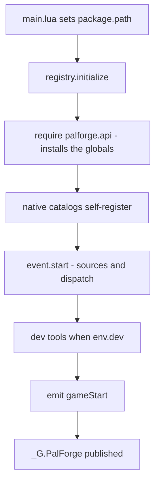
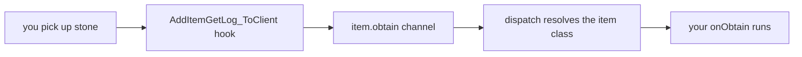
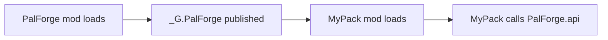

PalForge lets you add your own buildings, items, pals, skills, sounds, effects and menus to
Palworld. You describe what you want in a short Lua file, and it shows up in your game.

This page gets it installed, proves it is running, and gets your first definition reacting to
something you do in game.

## What you can do after this page

- Have PalForge running in your copy of Palworld
- Tell at a glance whether it started, from the game's own log
- Add your own item and see a message when you pick it up
- Add a chest that counts how many times you opened it, and still remembers next time you play
- Work out why something did not appear, without asking anyone

## Install

<Steps>

<Step>

### Copy the files

PalForge runs on UE4SS, the loader that lets Palworld run mods written in Lua. If you already
have other Palworld Lua mods working, you have it.

Make a folder called `PalForge` under `ue4ss/Mods/` and lay the files out like this. `palforge/`
has to sit next to `main.lua`: `main.lua` looks for the rest of PalForge in its own folder, so a
different layout breaks every part of it.

```text
ue4ss/
└── Mods/
    └── PalForge/
        ├── enabled.txt          <- empty file; UE4SS starts a mod only when this exists
        └── Scripts/
            ├── main.lua
            └── palforge/
                ├── env.lua      <- the dev/release switches and the declared game build
                ├── types.lua    <- editor annotations only; nothing loads it at runtime
                ├── autorun.txt  <- the keyless dev queue (core/autorun.lua reads it here)
                ├── api/         <- the public surface a pack writes against
                ├── core/        <- the engine: kernel, event system, Palworld bridges
                ├── native/      <- Palworld's own content as data catalogs
                ├── test/        <- the in-game API suite (SINGULAR - see below)
                ├── tests/       <- the headless unit bundle, run at startup in dev
                └── utils/       <- log, json, file, items
```

That is the same list `tools/deploy.sh` copies: `Scripts/main.lua` plus all of
`Scripts/palforge/`, minus `deprecated/` and `tmp/`, which are reference-only and are not needed
at runtime.

Two entries are easy to leave out, and both have consequences that look like something else:

- **`palforge/test/`, singular.** `core/registry.lua` requires `palforge.test`, and that module
  is what binds **F1**. An install without this directory has no test suite and no F1 key in dev
  mode, with nothing else in the log to explain it. (`palforge/tests/`, *plural*, is a different
  thing — the headless unit bundle the kernel runs at startup in dev, and the module behind the
  `ps_catalog` console command. It ships too: the `.gitignore` line that used to hide it was
  removed once it turned out `core/registry.lua` requires it at boot, so a clone carries it. If
  it is missing anyway, the kernel names it in its "dev tooling NOT loaded" line.)
- **`palforge/autorun.txt`.** `core/autorun.lua` reads it from beside `palforge/` and runs named
  actions on world load. It is how anything gets run on a machine where no key and no console
  works — three input routes have failed in turn on this project.

`Scripts/palforge/types.lua` is annotations only — nothing loads it while the game is running. It
is there so your editor can complete every field of a definition as you type. See
[Editor setup](/docs/concepts/editor-setup).

</Step>

<Step>

### Turn the mod on

UE4SS switches a Lua mod on in one of two ways: an empty file called `enabled.txt` inside the mod
folder, or a line in `ue4ss/Mods/mods.txt`.

```text title="ue4ss/Mods/mods.txt"
CheatManagerEnablerMod : 1
PalForge : 1
```

`CheatManagerEnablerMod` gives PalForge the game's own admin object, `UPalCheatManager`, which is
what a world spawn goes through. It is a convenience rather than a hard requirement:
`core/spawn.lua`'s `cheatManager()` looks for a live one, then for the controller's own
`CheatManager`, and if the session has neither it builds one itself with
`StaticConstructObject(pc.CheatClass, pc)`. What it cannot do is build one with no player
controller to hang it on, and that is the case this line reports:

```text
[PalForge.spawn][warn] spawn.pal: no PalCheatManager and none could be constructed (no player controller yet?)
```

</Step>

<Step>

### Start the game and read the log

UE4SS prints what mods say to its console window, and writes the same text to a file called
`UE4SS.log`. Every PalForge message goes through `utils/log`, which formats it as
`[PalForge.<scope>][<level>] <msg>`. Watch that while the game loads — the exact lines to look
for are in the next two sections.

</Step>

</Steps>

## What happens when the game starts

`main.lua` is the single file UE4SS runs. In order, it:

1. Points Lua's `package.path` at its own folder
   (`thisDir .. "?.lua;" .. thisDir .. "?\\init.lua;"`), so `require("palforge.api")` finds the
   modules sitting next to it.
2. Requires the optional module `palforge_dev` — `Scripts/palforge_dev.lua` — and records which
   of three things happened: `loaded`, `absent (release copy)`, or `FAILED TO LOAD`. That one
   file is the whole dev switch, and the third case is warned about separately, because a dev
   overlay with a syntax error and a framework ignoring the flag look identical otherwise.
3. Asks the running game for its build string through the `UKismetSystemLibrary` CDO and stores
   the answer in `env.gameBuildLive`. Nothing answering is normal at that point — a Lua mod
   starts early — so the read is retried once at the first `world.ready`.
4. Prints the startup banner: version, declared and live game build, `dev` and `debug`, and
   whether the dev overlay was there. Then the single-player statement, in full.
5. Calls `registry.initialize()` inside a `pcall`, printing `initialize failed: <err>` if that
   raises and `ready` if it does not.
6. Publishes `_G.PalForge` so other mods can use the same running copy.

```lua title="Scripts/main.lua (excerpt)"
local thisDir = debug.getinfo(1, "S").source:match("@?(.*[\\/])") or ""
package.path = thisDir .. "?.lua;" .. thisDir .. "?\\init.lua;" .. package.path

local env      = require("palforge.env")
local registry = require("palforge.core.registry")
local log      = require("palforge.utils.log").scope("main")

log.info(string.format(
    "PalForge v%s starting | game build: declared %s, live %s | dev=%s debug=%s | dev overlay: %s",
    tostring(env.version),
    tostring(env.gameBuild),
    liveBuild and (liveBuild .. " (" .. buildSource .. ")") or ("unknown (" .. buildSource .. ")"),
    tostring(env.dev), tostring(env.debug), devOverlay))
```

`registry.initialize()` is where everything comes up. It runs five steps:



The catalogs load in this order: `buildings`, `items`, `pals`, `skills`, `effects`, `audio`,
`ui`. Requiring one runs its curated definition calls, and a definition call writes itself into
`core/object_manager` as it runs. The long id lists inside those files stay plain data, and a
lazy `get(id)` builds its handle with `{ register = false }` and stops there — so neither startup
nor a single lookup registers a row. `<catalog>.publish(id)` is the opt-in that does.
`native/buildings` registers nothing at all: its curated `WorkBench` and `PalBoxV2` carry
`{ register = false }` too, because registering a building is not inert — `core/event`'s scan
then tracks and persists every matching structure already standing in your world.

`_G.PalForge` carries everything another mod might want:

```lua
_G.PalForge = {
    env  = env,
    api  = api,
    pack = api.pack,       -- PalForge.pack("mypack").Item{ ... } records the owning pack
    utils = { log = ..., json = ..., file = ..., items = ... },
    core = {
        registry = ..., event = ..., object_manager = ..., spawn = ..., mesh = ...,
        sound = ..., player = ..., spatial = ..., icons = ...,
        uobject = ..., assetpath = ...,
    },
    native = require("palforge.native"),
}
```

## A healthy startup log

Every dev tool ships off, so the log a player sees is the shorter one. A clean release start:

```text
[PalForge.main][info] PalForge v0.3.0 starting | game build: declared v1.0.2.101103, live unknown (UKismetSystemLibrary CDO did not resolve) | dev=false debug=false | dev overlay: absent (release copy)
[PalForge.main][info] PalForge targets SINGLE-PLAYER Palworld. Dedicated servers and co-op guests are not supported and are not tested: there is no replication layer, and the item, spawn and event routes are all client-authoritative. A pack may appear to work for the host and do nothing for anyone else.
[PalForge.event][info] tick source live
[PalForge.event][info] event wired: bus + sources (tick/world/building/pal/item/skill; onBuild, the three onSpawned candidates and the three passive ones arm at world.ready; skill.activate has three sources and skill.hit two, and the log says which one carried it; building.leftclick and building.break have no native source and never will) + dispatch
[PalForge.registry][info] dev tooling NOT loaded (env.dev = false, the shipped default): no dev keybinds — including F4, unlock all technologies — no F1 API suite, no F9 reload, no ps_catalog dumper, no headless unit bundle and no test hooks. ...
[PalForge.registry][info] initialized (dev=false, debug=false, 17 class(es) registered)
[PalForge.main][info] ready
```

`live` is whatever the running game answered when asked for its build string. UE4SS starts a Lua
mod early, so `unknown` at that moment is ordinary rather than a failure — the read is retried
once at the first world load and the answer logged there. PalForge prints `unknown` rather than a
guess, and when the declared and live builds disagree it warns once, naming both.

The class count is how many definitions are registered. 17 is what the shipped catalogs alone
produce (6 audio, 3 item, 3 effect, 2 pal, 2 ui, 1 skill, and 0 building), and your own
definitions add to it. `[PalForge.main][info] ready` is the line that means PalForge started.

A dev deploy adds the tooling lines. Each bind reports what the game's own key config had on that
key, on the same line as the bind:

```text
[PalForge.main][info] PalForge v0.3.0 starting | game build: ... | dev=true debug=true | dev overlay: loaded
[PalForge.keyboard][info] bound F4 [keymap: unknown — the game's key config has not been read yet (the config source needs a loaded world), so nothing is claimed either way; run pf_keys inside a save]
[PalForge.keyboard][info] keybinds loaded (1 function file(s): F4)
[PalForge.registry][info] dev console command registered: ps_catalog (DataTable dumper, opt-in)
[PalForge.keyboard][info] bound F9 [keymap: ...]
[PalForge.unittests][info] tests: 8 passed, 0 failed, 0 skipped (8 total)
[PalForge.keyboard][info] bound F1 [keymap: ...]
[PalForge.test][info] keyboard: F1                   unknown  tests: all suites                        game: the game's key config has not been read
[PalForge.registry][info] dev tooling loaded: dev keybinds incl. F4 unlock-all-technologies, ps_catalog console command, F9 reload, headless unit bundle (palforge.tests), in-game API suite on F1 (palforge.test), game-required test hooks (palforge.test.hooks)
[PalForge.registry][info] initialized (dev=true, debug=true, 17 class(es) registered)
[PalForge.main][info] ready
```

`tests: 8 passed ...` is the headless unit bundle, `palforge/tests/` — plural, and part of the
repository, so this is the normal line. An install that dropped the directory gets it listed by
name on a `dev tooling NOT loaded` line instead. That line is printed in both modes and names
every piece that did not load, and why: a
key that was never bound and a key that was bound and never arrived look identical from outside,
and it is what tells them apart.

Two more lines belong to the world gate. PalForge waits for a save to finish loading before it
touches anything in the world; the first line appears when the save is ready, the second when you
leave that world again:

```text
[PalForge.event][info] world ready - building dispatch enabled
[PalForge.event][info] world left - building dispatch paused
```

<Callout type="info">
The world source checks for `FindFirstOf("PalPlayerCharacter")` every 1000 ms and wants five
valid checks in a row before it emits `world.ready`. Until then the building, pal and item sources
all return early, so nothing of yours fires while you are still on the title screen. The tick
heartbeat is the one source that runs from mod load. If the check loop cannot be installed at all,
the log says `ready-watch unavailable (...) - dispatch always on` and everything runs anyway.
</Callout>

## The dev switch

`Scripts/palforge/env.lua` holds the settings PalForge reads at runtime. `require()` caches it, so
every module sees the same table — and every switch in it ships **off**:

```lua title="Scripts/palforge/env.lua"
return {
    dev        = false,       -- THE dev/release switch (dev tools load only when true)
    debug      = false,       -- game-required test hooks (test/hooks); needs dev too
    debugHooks = {},          -- per-hook opt-in for the hooks that WRITE
    name       = "PalForge",
    version    = "0.3.0",
    gameBuild     = "v1.0.2.101103",
    gameBuildLive = nil,
    multiplayer   = false,
}
```

Nothing in the framework turns `dev` on. One optional file does: `Scripts/palforge_dev.lua`,
which `main.lua` requires immediately before `registry.initialize()` and ignores when it is
absent.

```lua title="Scripts/palforge_dev.lua"
local env = require("palforge.env")
env.dev   = true
env.debug = true
-- env.debugHooks["pal-skills-equip"] = true   -- per-hook opt-in for the hooks that WRITE
```

That file is gitignored, so it cannot reach a player through the repository, and `tools/deploy.sh`
writes it for you. The script replaces the deployed `Scripts/` wholesale — staged first, then two
renames, so the game never sees a half-populated tree — stamps the copy with a build timestamp,
and never edits `env.lua`:

```bash
tools/deploy.sh                        # dev deploy into the default install; writes the overlay
tools/deploy.sh "/path/to/Palworld"    # dev deploy somewhere else
tools/deploy.sh --release              # no overlay, and any stale copy is deleted by name
```

So the loop is: **edit a file → `tools/deploy.sh` → press F9 in game (or restart, the first time
after a fresh deploy) → press F1**. Lua is read at mod load, so a deployed file changes nothing in
a running game until the reload; the build stamp is what makes a stale run visible in the log
instead of diagnosed for an hour.

### What `dev` arms: nine keys

`registry.initialize()` loads the keybind files under `core/keyboard/`, the F9 reload, the
`ps_catalog` DataTable dumper, the headless unit bundle, and `palforge.test` — which is what binds
F1 and gives each discovery probe its own key. Nine keys in total:

| Key | What it does | What it needs on screen |
| --- | --- | --- |
| **F1** | run the in-game API suite: 14 suites, 481 checks | works anywhere, but 28 checks skip without a loaded save |
| **F2** | probe `title` — the game's own title menu button, so yours can match it | the title screen |
| **F3** | probe `uislot` — that button's inner slot, read from a world | a loaded save |
| **F4** | **unlock every technology in the loaded save** | a loaded save |
| **F5** | probe `reflect` — classes, functions, parameters, DataTable rows | a loaded save |
| **F6** | probe `pal` — a pal's mesh component, anim class and materials | a pal standing near you |
| **F8** | probe `watch` — arms native hooks and logs what fires while you act | a loaded save, then craft / drop / spawn |
| **F9** | reload every `palforge.*` module | — |
| **F10** | probe `uievents` — counts the four UI-rebuild hooks | a loaded save, then a quit to title and a reload |

Seven of the nine only read and print. **Two change something:**

- **F4** writes into the loaded save. One press, no confirmation, every technology unlocked.
- **F8** registers native hooks, and UE4SS has no way to unregister one — everything it arms
  stays armed until you quit the game. It also spawns one ChickenPal in front of you, and it
  refuses F9 for about 60 seconds afterwards, because its two long asynchronous chains are still
  outstanding and a reload inside that window takes the engine-tick hook down with them.

F7 is deliberately not among them: it is Palworld's own volume control, and a bind there succeeds,
logs happily, and never once arrives. Every action also has a console command (`pf_tests`,
`pf_watch`, `pf_hooks`, one per probe and one per hook), and `core/autorun.lua` runs named actions
from `palforge/autorun.txt` on world load — three separate ways in, because three input routes
have failed in turn on this project.

`env.debug` is the second, narrower switch: it loads `palforge/test/hooks/`, the 13 measurements
that cannot run without a running game. They are declared rather than run — ask for one by name
with `pf_hook <id>`, and `pf_hooks` lists every hook with the reason each would skip. The ones
that write into a save need `env.debugHooks[id] = true` on top of that.

Any module can read the same table:

```lua
local env = require("palforge.env")
local log = require("palforge.utils.log").scope("mypack")

if env.dev then
    log.info("dev build " .. tostring(env.version))
end
```

<Callout type="warn">
The dev gate is read inside `registry.initialize()`. Changing `require("palforge.env").dev` after
that changes what your own code sees, but it will not load or unload the dev tooling. The overlay
file works because `main.lua` requires it *before* `initialize()` runs.
</Callout>

## Your first definition

Put your own code in its own file next to `main.lua`. `package.path` already covers that folder,
so a plain `require` finds it.

```lua title="ue4ss/Mods/PalForge/Scripts/mypack.lua"
local api = require("palforge.api")
local log = require("palforge.utils.log").scope("mypack")

api.Item{
    id       = "Stone",
    name     = "Stone",
    category = "material",
    maxStack = 9999,
    events   = {
        onObtain = function(item, ctx)
            log.info("picked up " .. tostring(ctx.count) .. " stone")
        end,
    },
}
```

Load it from the bottom of `main.lua`, once PalForge itself is up:

```lua title="ue4ss/Mods/PalForge/Scripts/main.lua"
_G.PalForge = {
    -- ... unchanged ...
}

local ok, err = pcall(require, "mypack")
if not ok then print("[mypack] load failed: " .. tostring(err) .. "\n") end

return _G.PalForge
```

<Callout type="warn">
Require your file **after** `registry.initialize()` has run. Before that the bare globals are not
installed and the native catalogs have not loaded. The `pcall` matters too: a bad field in a
definition raises a hard error, and an unguarded one stops the rest of `main.lua`.
</Callout>

`Item{ id = "Stone" }` hangs your behaviour and metadata on an id the game already has. Lua on its
own cannot add a brand-new row to the game's item, pal or building tables — those are the game's
DataTables, and writing new rows into them is PalSchema's job. So build on an id that already
exists, which is why the example uses a vanilla one. An id with no colon is a literal game id
(`Stone`, `Wood`, `PalBoxV2`); `"pack:name"` is your own namespaced id, and it matches the row
name `pack_name`.

Next, a definition that remembers something. A building instance carries `self.actor`, `self.pos`,
`self.state` and `self:save()`:

```lua title="ue4ss/Mods/PalForge/Scripts/mypack.lua"
local api = require("palforge.api")
local log = require("palforge.utils.log").scope("mypack")

api.Building{
    id     = "ItemChest",
    name   = "Counted Chest",
    gridCm = 100,
    state  = { uses = 0 },
    events = {
        onLoad = function(self, ctx)
            log.info("chest tracked at " .. string.format("%.0f,%.0f,%.0f", self.pos.x, self.pos.y, self.pos.z))
        end,
        onRightClick = function(self, ctx)
            self.state.uses = self.state.uses + 1
            self:save()
            log.info("chest opened " .. tostring(self.state.uses) .. " time(s)")
        end,
    },
}
```

One id holds one definition, keyed by kind and id in `object_manager`, so defining an id PalForge
has already registered replaces that one. What the shipped catalogs actually register is the 17
classes in the startup line: `Wood`, `Berries` and `Arrow` from `native/items`, `ChickenPal` and
`SheepBall` from `native/pals`, plus the audio, effect, skill and UI ones. `native/buildings`
registers **nothing** — its `WorkBench` and `PalBoxV2` are built with `{ register = false }` and
handed out by `native.buildings.publish(id)` on request — so `ItemChest` above collides with
nothing, and a cross-pack collision is now warned about by name rather than silently overwritten.

And a pal, to see an action rather than a handler. Give the spawn a few seconds: `SpawnMonster`
is asynchronous, the one arrival anyone has timed took 5.9 seconds, and `core/spawn` watches the
world for up to 12 and logs the arrival when it sees it. The boolean `:spawn` returns is about
the call, not about a pal standing in front of you.

```lua
local api = require("palforge.api")
local log = require("palforge.utils.log").scope("mypack")

-- Pal.get works for any game CharacterID, defined or not.
api.Pal.get("ChickenPal"):spawn(api.Player.coordinate())   -- the pal arrives a few seconds later

-- Defining the same id attaches your own mesh and handlers to it. This replaces
-- native/pals' curated ChickenPal demo definition.
local chicken = api.Pal{
    id   = "ChickenPal",
    name = "Chicken Pal",
    mesh = api.Mesh{
        id        = "mypack:chicken_body",
        kind      = "skeletal",
        model     = "/Game/Pal/Model/Character/Monster/ChickenPal/SK_ChickenPal.SK_ChickenPal",
        animClass = "/Game/Pal/Blueprint/Character/Monster/PalActorBP/ChickenPal/ABP_ChickenPal.ABP_ChickenPal_C",
    },
    events = {
        -- The mesh declared above is attached FOR YOU on pal.spawned; nothing here calls
        -- renderOn. Your own handler runs after that attach, and may fire more than once.
        onSpawned = function(pal, ctx)
            log.info("chicken spawned: " .. tostring(ctx.actor))
        end,
    },
}

chicken:spawn(api.Player.coordinateOffset(300, 0, 0))     -- 3 m away, a few seconds later
```

## Check it in game

Load a save and watch the log.

<Steps>

<Step>

### Confirm the world gate opened

```text
[PalForge.event][info] world ready - building dispatch enabled
```

Until that line appears, the building, pal and item sources all return early; only the tick
heartbeat is running.

</Step>

<Step>

### Trigger the shipped demos

The definitions PalForge ships already have live handlers on them, so you can prove the wiring
works without writing anything:

```text
[PalForge.native.items][info] Wood onObtain: count=1
[PalForge.native.items][info] Berries onUse: target=...
[PalForge.native.pals][info] ChickenPal onDamaged: ...
```

Chop a tree for the first, eat berries for the second, hit a wild Chicken for the third.

</Step>

<Step>

### Trigger your own

Mine a rock and your handler runs:

```text
[PalForge.mypack][info] picked up 3 stone
```

The path from the game to your function:



`ctx.itemId` and `ctx.count` come off the game's own get-log struct, and the id is looked up in
`object_manager`. A vanilla id you never defined matches nothing, and the whole thing quietly does
nothing.

</Step>

<Step>

### Inspect what registered

```lua
local registry = require("palforge.core.registry")
local log      = require("palforge.utils.log").scope("mypack")

for id in pairs(registry.registered().item) do
    log.info("item: " .. id)
end
```

`registry.registered()` returns a snapshot keyed by kind and then id — `item`, `pal`, `building`,
`skill`, `effect`, `audio`, `mesh`, `ui`.

</Step>

</Steps>

`object_manager.owner(type, id)` names the pack a registration belongs to, and `entry` and
`byResolved` answer the same question from the other two directions. With a dev deploy, **F1** is
the quickest smoke test there is: it runs all 14 suites, and the summary says how many checks
could not be answered and in which direction.

## Reaching the API

`require("palforge.api")` does two things at once: it hands back a table with everything on it,
and it also creates plain global names you can use directly. Both point at the same objects.

<Tabs items={['Namespaced', 'Globals', 'Companion mod']}>

<Tab value="Namespaced">

```lua
local api = require("palforge.api")

api.Item.get("Wood"):give(10)
api.Pal.get("ChickenPal"):spawn(api.Player.coordinate())   -- the pal arrives a few seconds later
```

</Tab>

<Tab value="Globals">

```lua
require("palforge.api")   -- installing the globals is the side effect

Item.get("Wood"):give(10)
Pal.get("ChickenPal"):spawn(Player.coordinate())
```

The globals are `Pal`, `Item`, `Building`, `Skill`, `Effect`, `Audio`, `Mesh`, `UI` and `Player`.
UE4SS gives each Lua mod its own Lua state, so these names belong to your mod alone and cannot
clash with the game or another mod.

</Tab>

<Tab value="Companion mod">

```lua
local api = _G.PalForge.api

api.Item.get("Wood"):give(10)
api.Pal.get("ChickenPal"):spawn(api.Player.coordinate())
```

Use this when your code cannot `require("palforge.*")` because your own `package.path` does not
point at PalForge's `Scripts/` folder.

</Tab>

</Tabs>

Every kind of content works the same way, so once you know one you know all of them:

```lua
local pal = Pal{ id = "example:Boss", name = "Boss" }   -- make one
Pal.get("ChickenPal")                                   -- find one by id
Pal.get_all()                                           -- list every one
```

## Ship your pack as its own mod

`main.lua` publishes `_G.PalForge`, so a separate mod can use the copy that is already running
instead of loading a second one.



```text
ue4ss/Mods/MyPack/
├── enabled.txt
└── Scripts/
    └── main.lua
```

```lua title="ue4ss/Mods/MyPack/Scripts/main.lua"
local PF = _G.PalForge
if not PF then
    print("[mypack] PalForge is not loaded - check the mod load order\n")
    return
end

local api = PF.api
local log = PF.utils.log.scope("mypack")

api.Item{
    id       = "Stone",
    name     = "Stone",
    category = "material",
    maxStack = 9999,
    events   = {
        onObtain = function(item, ctx)
            log.info("picked up " .. tostring(ctx.count) .. " stone")
        end,
    },
}

log.info("mypack loaded")
```

List PalForge above your pack in `ue4ss/Mods/mods.txt`, so it has finished starting before your
definitions run.

<Callout type="warn">
UE4SS gives each Lua mod its own Lua state. `_G.PalForge` is reachable from code loaded into the
state PalForge's `main.lua` ran in; whether a separate mod folder shares that state depends on
your UE4SS build and load configuration. Keep the `if not PF then ... return end` guard, and if it
trips, load your file from PalForge's own `Scripts/` folder as shown in
[Your first definition](#your-first-definition).
</Callout>

Beyond `api`, the published table gives you the toolbox and the engine:

```lua
local PF = _G.PalForge

PF.utils.log.scope("mypack").info("hello")
PF.utils.items.unlockAllTech()
PF.native.items.get("Arrow_Fire")
PF.native.buildings.WorkBench:unlock()

PF.core.event.on("tick", function(ctx)
    if ctx.count % 120 == 0 then PF.utils.log.scope("mypack").info("one minute") end
end)
```

Defining things after startup is fine. A building defined later is picked up by the next scan, and
pal and item events resolve by id at the moment they fire, so a definition registered a minute
after `gameStart` still gets its events.

## Troubleshooting

### No `[PalForge.*]` lines at all

The mod never loaded. Check, in order:

- `Scripts/main.lua` sits directly under `ue4ss/Mods/PalForge/`, and `palforge/` is next to it.
  `main.lua` works out `package.path` from where its own file is, so a moved folder breaks every
  `require`.
- The mod is on: an empty `enabled.txt` in the mod folder, or `PalForge : 1` in
  `ue4ss/Mods/mods.txt`.
- UE4SS itself is loading Lua mods at all (other Lua mods print their own lines).

### `initialize failed: ...`

```text
[PalForge.main][err] initialize failed: ...
```

An error escaped `registry.initialize()`. `main.lua` catches it, so the game keeps running, but
nothing is live — no sources, no dispatch, no catalogs. The text after the colon is the real
error. A single catalog that failed is reported on its own line, as
`native catalog 'palforge.native.items' load error: ...`.

### Unknown field

```text
PalForge: Pal: unknown field "meshSpec" (did you mean "mesh"?). Valid fields: id, name, description, skills, mesh, material, color, texture, icon, events, data
```

A field that is not part of the definition is a hard error with a suggested correction, so a
misspelled name can never be silently ignored. The same check runs on nested tables, including
`events`:

```text
PalForge: Pal: field "events" (Pal.Spec.Events): unknown field "onSpawn" (did you mean "onSpawned"?). Valid fields: onSpawned, onDamaged, onDeath, onCaptured, onTick
```

You can also ask what a call accepts, from your own code:

```lua
local schema = require("palforge.core.schema")

print(schema.help("Pal.Spec"))          -- every field, type, default and meaning
print(schema.help("Pal.Spec.Events"))   -- the handler list
schema.get("Pal.Spec").fields           -- the same as a table, for tooling
```

### Missing id

```text
PalForge: Item: field "id" is required (item id: a game ItemId ("Wood") or "pack:name")
```

`id` is required for every kind of content. The text in parentheses is that field's own
documentation, so the message tells you what shape the value should have.

### Wrong value or wrong type

```text
PalForge: Item: field "category" must be one of { "material", "consumable", "equipment", "ammo", "ingredient", "other" }, got "food"
PalForge: Item: field "maxStack" expects number, got string
PalForge: Building: field "mesh" (Building.Spec.Mesh): field "model" is required (UStaticMesh asset path, or an OBJ path for the procedural backend)
```

The call never half-succeeds: a failing check raises before anything is registered.

### A handler never fires

- Check that the hook has something to fire it. All four item events fire: `onObtain` and `onUse`
  from the inventory and use paths, `onCraft` from `OnFinishWorkInServer` on the two map-object
  models, `onDiscard` from `RequestDrop_ToServer` / `RequestDispose_ToServer`. The two that never
  fire are building `onLeftClick` and `onBreak`, settled negatively by reading the complete
  function lists of every class that could own one — use `onRightClick`, and `onRemove`, which
  covers disappearance as `reason = "missing"`. Skill `onHit` is the third, and it is still open.
  [Lifecycle](/docs/concepts/lifecycle) lists what is live.
- Check the world gate: nothing runs before `world ready - building dispatch enabled`. The
  `onBuild`, `onSpawned` and passive-skill sources are armed *at* `world.ready` rather than at mod
  load, so they also stay silent in a session where the world never finishes loading.
- Check the log for the line that names the source. The first time a channel carries anything,
  it says so: `channel item.craft carried its first event this session — the native source is
  LIVE, whether or not any definition handled it`. No such line means the game never called it.
- Check for a hook the game would not let PalForge install:

  ```text
  [PalForge.event][warn] hook unavailable (feature disabled): /Script/Pal.PalBuildObject:OnBeginInteractBuilding -> ...
  ```

- Check the id. Items are matched by `ctx.itemId` and pals by their blueprint class name
  (`BP_<Id>_C`), which is the game's internal name for that pal's actor. An id that matches nothing
  in `object_manager` quietly does nothing — it is not an error.

### A handler fires but something inside it breaks

Your handler runs inside a `pcall`, so a mistake in it cannot crash the game. The error is written
to the log with the channel and the hook that raised it:

```text
[PalForge.event][err] item.use -> onUse handler failed: ...
```

A building `onTick` that keeps failing is switched off, so one bad handler cannot burn the
heartbeat forever:

```text
[PalForge.event][err] onTick 'WorkBench@1204,-431,84' failed: ...
[PalForge.event][warn] onTick 'WorkBench@1204,-431,84' disabled after 5 failures
```

Wrap risky work yourself while developing, so you decide what the message says:

```lua
events = {
    onRightClick = function(self, ctx)
        local ok, err = pcall(function()
            -- your work here
        end)
        if not ok then log.err("onRightClick: " .. tostring(err)) end
    end,
}
```

### Spawning does nothing

Wait a few more seconds first. `:spawn` returning `true` means the native call was issued, not
that a pal exists: the coordinate form was measured arriving about 5.9 seconds later, and
`core/spawn` watches the world for it and logs the arrival on its own line — see
[Pal](/docs/api/pal). If nothing has turned up after that, look for one of these:

```text
[PalForge.spawn][warn] spawn.pal: no PalCheatManager and none could be constructed (no player controller yet?)
[PalForge.spawn][err] spawn.pal: SpawnMonster did not execute for ChickenPal [evidence ...]
```

The first means there was no player controller to build a cheat manager on — you are not in a
world yet. The second means `core/signature` refused the call because the live class does not
declare `SpawnMonster` the way the header dump does, and it has already logged which arity it
wanted.

## Where to go next

<Cards>
  <Card title="Definitions" href="/docs/concepts/definitions">
    How to make one, find one, list them all, and what you get back.
  </Card>
  <Card title="Schema" href="/docs/concepts/schema">
    The fields each kind of content accepts, and how to read them at runtime.
  </Card>
  <Card title="Lifecycle" href="/docs/concepts/lifecycle">
    Which handlers fire, when, and what lands in `ctx`.
  </Card>
  <Card title="First content pack" href="/docs/guides/first-content-pack">
    A complete pack built from every kind of content, end to end.
  </Card>
</Cards>

## Summary

- PalForge lives at `ue4ss/Mods/PalForge/Scripts/`, with `palforge/` next to `main.lua`. Any other
  layout breaks it. Copy `palforge/test/` and `palforge/autorun.txt` with the rest: without the
  first there is no F1, without the second there is no keyless way in.
- Every dev tool ships off. `Scripts/palforge_dev.lua` — written by `tools/deploy.sh`, gitignored,
  never in a player's copy — is what arms the nine keys, and F4 unlocks every technology in the
  loaded save.
- `[PalForge.main][info] ready` means PalForge started;
  `world ready - building dispatch enabled` means your handlers can now fire.
- Put your content in your own file next to `main.lua` and `require` it at the bottom of
  `main.lua`, after `registry.initialize()`.
- `Item{ ... }`, `Building{ ... }` and `Pal{ ... }` all work the same way: call with a table to
  make one, `get(id)` to find one, `get_all()` to list them.
- An id with no colon is one of the game's own; `"pack:name"` is yours.
- A wrong field name stops the call with a message naming the field and listing the valid ones, so
  read it rather than guessing.

Next, read [Definitions](/docs/concepts/definitions) to see what a definition hands back and what
you can do with it.
