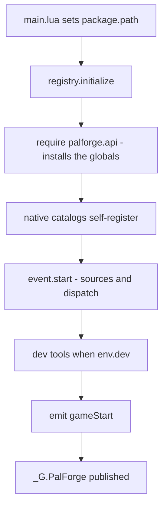
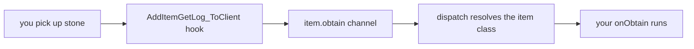
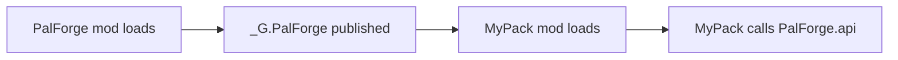

PalForge runs as a UE4SS Lua mod. You copy two things into place — `Scripts/main.lua` and the
`Scripts/palforge/` module tree — enable the mod, and read the UE4SS log to confirm the kernel
came up. After that, a content pack is Lua that calls `Pal{ ... }`, `Item{ ... }`,
`Building{ ... }` and friends.

## Install

<Steps>

<Step>

### Copy the files

The layout is fixed, because `main.lua` bootstraps `package.path` from its own directory:
`palforge/` must sit next to `main.lua`.

```text
ue4ss/
└── Mods/
    └── PalForge/
        ├── enabled.txt
        └── Scripts/
            ├── main.lua
            └── palforge/
                ├── env.lua
                ├── types.lua
                ├── api/
                ├── core/
                ├── native/
                ├── tests/
                └── utils/
```

`Scripts/palforge/types.lua` is annotations only — nothing requires it at runtime. It exists so
LuaLS can complete every field of a definition. See [Editor setup](/docs/concepts/editor-setup).

</Step>

<Step>

### Enable the mod

UE4SS enables a Lua mod either by an empty `enabled.txt` inside the mod folder, or by a line in
`ue4ss/Mods/mods.txt`:

```text title="ue4ss/Mods/mods.txt"
CheatManagerEnablerMod : 1
ConsoleEnablerMod : 1
PalForge : 1
```

`Pal.Handle:spawn` goes through `UPalCheatManager`, so keep `CheatManagerEnablerMod` enabled if
you intend to spawn pals. Without it, `core/spawn` logs
`spawn.pal: no PalCheatManager (CheatManagerEnabler mod missing this session?)` and returns
`false`.

</Step>

<Step>

### Start the game and read the log

Every PalForge message goes through `utils/log`, whose default sink prints
`[PalForge.<scope>][<level>] <msg>`. Watch the UE4SS console (and `UE4SS.log`) while the game
loads — the exact lines to expect are below.

</Step>

</Steps>

## What main.lua does at load

`main.lua` is a thin entry point. In order, it:

1. Prepends its own directory to `package.path`
   (`thisDir .. "?.lua;" .. thisDir .. "?\\init.lua;"`), so `require("palforge.api")` resolves
   relative to that `Scripts/` folder.
2. Requires `palforge.env` and logs the version and the dev flag.
3. Calls `registry.initialize()` inside a `pcall`, logging `initialize failed: <err>` on failure
   and `ready` on success.
4. Publishes `_G.PalForge` for companion mods.

```lua title="Scripts/main.lua (excerpt)"
local thisDir = debug.getinfo(1, "S").source:match("@?(.*[\\/])") or ""
package.path = thisDir .. "?.lua;" .. thisDir .. "?\\init.lua;" .. package.path

local env      = require("palforge.env")
local registry = require("palforge.core.registry")
local log      = require("palforge.utils.log").scope("main")

log.info("PalForge v" .. tostring(env.version) .. " starting (dev=" .. tostring(env.dev) .. ")")
```

`registry.initialize()` is the kernel entry point and runs five steps:



The catalogs load in this order: `buildings`, `items`, `pals`, `skills`, `effects`, `audio`,
`ui`. Registration is not a separate step — a definition call writes itself into
`core/object_manager`, so requiring a catalog module is what registers its content. The big
catalog lists stay plain data and are materialized lazily by each module's `get(id)`, which is why
startup never registers the thousands of row ids.

`_G.PalForge` carries the whole downstream surface:

```lua
_G.PalForge = {
    env = env,
    api = require("palforge.api"),
    utils = { log = ..., json = ..., file = ..., items = ... },
    core = {
        registry = ..., event = ..., object_manager = ..., spawn = ..., mesh = ...,
        sound = ..., player = ..., spatial = ..., icons = ...,
    },
    native = require("palforge.native"),
}
```

## A healthy startup log

With `env.dev = true` (the shipped default), a clean start looks like this:

```text
[PalForge.main][info] PalForge v0.3.0 starting (dev=true)
[PalForge.event][info] tick source live
[PalForge.event][info] event wired: bus + sources (tick/world/building live; pal/item TODO(dump)) + dispatch
[PalForge.keyboard][info] bound F1
[PalForge.keyboard][info] bound F4
[PalForge.keyboard][info] keybinds loaded (2 function file(s): F1,F4)
[PalForge.registry][info] dev console command registered: ps_catalog (DataTable dumper, opt-in)
[PalForge.unittests][info] tests: 8 passed, 0 failed (8 total)
[PalForge.registry][info] initialized (dev=true, 19 class(es) registered)
[PalForge.main][info] ready
```

The class count is whatever registered: 19 comes from the curated native definitions the shipped
catalogs declare. Your own definitions add to it.

Two more lines belong to the world gate — the first when a save has finished loading, the
second when you leave that world again:

```text
[PalForge.event][info] world ready - building dispatch enabled
[PalForge.event][info] world left - building dispatch paused
```

<Callout type="info">
The world source polls `FindFirstOf("PalPlayerCharacter")` every 1000 ms and needs five
consecutive valid polls before it emits `world.ready`. The building, pal and item sources all
return early until then, so none of them dispatch while you are still on the title screen; the
tick heartbeat is the one source that runs from mod load. If the poll loop itself cannot be
installed, the log says `ready-watch unavailable (...) - dispatch always on` and the runtime
fails open.
</Callout>

## The dev toggle

`Scripts/palforge/env.lua` is the shared runtime config, cached by `require()`, so the table is a
process-wide singleton:

```lua title="Scripts/palforge/env.lua"
return {
    dev     = true,        -- THE dev/release switch (dev tools load only when true)
    name    = "PalForge",
    version = "0.3.0",
}
```

When `dev` is true, `registry.initialize()` additionally:

- loads the keybind behaviour files (`core/keyboard/`): **F1** spawns a level 5 `ChickenPal`
  about 6 m in front of the player through `Pal.get(id):spawn{ at = ... }`, then announces where
  it landed; **F4** calls `utils.items.unlockAllTech` so custom buildings and chests appear in
  the build menu;
- registers the `ps_catalog` console command, an opt-in DataTable dumper that is never auto-run;
- requires `palforge.tests` and runs every registered suite, which produces the `tests: ...` line.

Set `dev = false` to ship a quiet release build with only the content catalogs registered:

```lua title="Scripts/palforge/env.lua"
return {
    dev     = false,
    name    = "PalForge",
    version = "0.3.0",
}
```

Any module can read the same table:

```lua
local env = require("palforge.env")
local log = require("palforge.utils.log").scope("mypack")

if env.dev then
    log.info("dev build " .. tostring(env.version))
end
```

<Callout type="warn">
The dev gate is read inside `registry.initialize()`. Mutating `require("palforge.env").dev` after
initialization changes what your own code sees, but it will not load or unload the dev tooling.
Editing `env.lua` is the reliable switch.
</Callout>

## Your first definition

Put your own code in its own file next to `main.lua`. `package.path` already covers that
directory, so a plain `require` finds it.

```lua title="ue4ss/Mods/PalForge/Scripts/mypack.lua"
local api = require("palforge.api")
local log = require("palforge.utils.log").scope("mypack")

api.Item{
    id       = "Stone",
    name     = "Stone",
    category = "material",
    maxStack = 9999,
    events   = {
        onObtain = function(item, ctx)
            log.info("picked up " .. tostring(ctx.count) .. " stone")
        end,
    },
}
```

Load it from the bottom of `main.lua`, after the kernel is up:

```lua title="ue4ss/Mods/PalForge/Scripts/main.lua"
_G.PalForge = {
    -- ... unchanged ...
}

local ok, err = pcall(require, "mypack")
if not ok then print("[mypack] load failed: " .. tostring(err) .. "\n") end

return _G.PalForge
```

<Callout type="warn">
Require your file **after** `registry.initialize()` has run. Before that, the bare globals are not
installed and the native catalogs have not loaded. The `pcall` matters too: a spec error is a hard
error, and an unguarded one aborts the rest of `main.lua`.
</Callout>

`Item{ id = "Stone" }` gives behaviour and metadata to an id that already exists in the game.
Publishing a brand-new DataTable row is not possible from Lua alone — that is PalSchema's job —
which is why the example keys onto a vanilla item id. Ids without a colon are literal game ids;
`"pack:name"` is a namespaced id that resolves to the row FName `pack_name`.

A second definition, this time stateful. A building instance carries `self.actor`, `self.pos`,
`self.state` and `self:save()`:

```lua title="ue4ss/Mods/PalForge/Scripts/mypack.lua"
local api = require("palforge.api")
local log = require("palforge.utils.log").scope("mypack")

api.Building{
    id     = "ItemChest",
    name   = "Counted Chest",
    gridCm = 100,
    state  = { uses = 0 },
    events = {
        onLoad = function(self, ctx)
            log.info("chest tracked at " .. string.format("%.0f,%.0f,%.0f", self.pos.x, self.pos.y, self.pos.z))
        end,
        onRightClick = function(self, ctx)
            self.state.uses = self.state.uses + 1
            self:save()
            log.info("chest opened " .. tostring(self.state.uses) .. " time(s)")
        end,
    },
}
```

Defining an id that a native catalog already curates replaces that registration — the entry in
`object_manager` is keyed by `(type, id)`. `native/buildings` curates `WorkBench` and `PalBoxV2`,
`native/items` curates `Wood`, `Berries` and `Arrow`, and `native/pals` curates `ChickenPal` and
`SheepBall`, so pick another id unless replacing one is what you want.

And a pal, to see an action rather than a handler:

```lua
local api = require("palforge.api")

-- Pal.get works for any game CharacterID, defined or not.
api.Pal.get("ChickenPal"):spawn(api.Player.coordinate())

-- Defining the same id attaches your own mesh and handlers to it. This replaces
-- native/pals' curated ChickenPal demo definition.
local chicken = api.Pal{
    id   = "ChickenPal",
    name = "Chicken Pal",
    mesh = api.Mesh{
        id        = "mypack:chicken_body",
        kind      = "skeletal",
        model     = "/Game/Pal/Model/Character/Monster/ChickenPal/SK_ChickenPal.SK_ChickenPal",
        animClass = "/Game/Pal/Blueprint/Character/Monster/PalActorBP/ChickenPal/ABP_ChickenPal.ABP_ChickenPal_C",
    },
    events = {
        onSpawned = function(pal, ctx)
            pal:renderOn(ctx.actor)
        end,
    },
}

chicken:spawn(api.Player.coordinateOffset(300, 0, 0))
```

## Verify it in game

Load a save and watch the log.

<Steps>

<Step>

### Confirm the world gate opened

```text
[PalForge.event][info] world ready - building dispatch enabled
```

Until that line appears, the building, pal and item sources all return early; only the tick
heartbeat is running.

</Step>

<Step>

### Trigger the shipped demos

The native catalogs already carry live handlers, so you can prove dispatch without writing
anything:

```text
[PalForge.native.items][info] Wood onObtain: count=1
[PalForge.native.items][info] Berries onUse: target=...
[PalForge.native.pals][info] ChickenPal onDamaged: ...
```

Chop a tree for the first, eat berries for the second, hit a wild Chicken for the third.

</Step>

<Step>

### Trigger your own

Mine a rock and your handler runs:

```text
[PalForge.mypack][info] picked up 3 stone
```

The path from the game to your function:



`ctx.itemId` and `ctx.count` come off the game's own get-log struct, and dispatch looks the id up
in `object_manager`. A vanilla id you never defined resolves to nothing and the dispatch no-ops.

</Step>

<Step>

### Inspect what registered

```lua
local registry = require("palforge.core.registry")
local log      = require("palforge.utils.log").scope("mypack")

for id in pairs(registry.registered().item) do
    log.info("item: " .. id)
end
```

`registry.registered()` returns a snapshot keyed by object type then id — `item`, `pal`,
`building`, `skill`, `effect`, `audio`, `mesh`, `ui`.

</Step>

</Steps>

With `env.dev = true` you also have F1 (spawn a `ChickenPal` in front of you) and F4 (unlock all
technology) as immediate smoke tests.

## Reaching the API

Requiring `palforge.api` installs the bare globals **and** returns the same table namespaced.
Both styles are the same objects.

<Tabs items={['Namespaced', 'Globals', 'Companion mod']}>

<Tab value="Namespaced">

```lua
local api = require("palforge.api")

api.Item.get("Wood"):give(10)
api.Pal.get("ChickenPal"):spawn(api.Player.coordinate())
```

</Tab>

<Tab value="Globals">

```lua
require("palforge.api")   -- installing the globals is the side effect

Item.get("Wood"):give(10)
Pal.get("ChickenPal"):spawn(Player.coordinate())
```

The globals are `Pal`, `Item`, `Building`, `Skill`, `Effect`, `Audio`, `Mesh`, `UI` and `Player`.
UE4SS gives each Lua mod its own state, so they are mod-local and cannot clash with the game or
another mod.

</Tab>

<Tab value="Companion mod">

```lua
local api = _G.PalForge.api

api.Item.get("Wood"):give(10)
api.Pal.get("ChickenPal"):spawn(api.Player.coordinate())
```

Use this when your code cannot `require("palforge.*")` because your own `package.path` does not
point at PalForge's `Scripts/` directory.

</Tab>

</Tabs>

Every domain module has the same three entry points, so once you know one you know all of them:

```lua
local pal = Pal{ id = "example:Boss", name = "Boss" }   -- CALL the module to define
Pal.get("ChickenPal")                                   -- an existing one, by id
Pal.get_all()                                           -- every registered one
```

## A pack as its own UE4SS mod

`main.lua` publishes `_G.PalForge` so a separate mod can reuse the running framework instead of
loading a second copy of it.



```text
ue4ss/Mods/MyPack/
├── enabled.txt
└── Scripts/
    └── main.lua
```

```lua title="ue4ss/Mods/MyPack/Scripts/main.lua"
local PF = _G.PalForge
if not PF then
    print("[mypack] PalForge is not loaded - check the mod load order\n")
    return
end

local api = PF.api
local log = PF.utils.log.scope("mypack")

api.Item{
    id       = "Stone",
    name     = "Stone",
    category = "material",
    maxStack = 9999,
    events   = {
        onObtain = function(item, ctx)
            log.info("picked up " .. tostring(ctx.count) .. " stone")
        end,
    },
}

log.info("mypack loaded")
```

List PalForge above your pack in `ue4ss/Mods/mods.txt` so the kernel is initialized before your
definitions run.

<Callout type="warn">
UE4SS gives each Lua mod its own Lua state. `_G.PalForge` is reachable from code loaded into the
state PalForge's `main.lua` ran in; whether a separate mod folder shares that state depends on
your UE4SS build and load configuration. Keep the `if not PF then ... return end` guard, and if it
trips, load your file from PalForge's own `Scripts/` directory as shown in
[Your first definition](#your-first-definition).
</Callout>

Beyond `api`, the published table gives you the toolbox and the engine:

```lua
local PF = _G.PalForge

PF.utils.log.scope("mypack").info("hello")
PF.utils.items.unlockAllTech()
PF.native.items.get("Arrow_Fire")
PF.native.buildings.WorkBench:unlock()

PF.core.event.on("tick", function(ctx)
    if ctx.count % 120 == 0 then PF.utils.log.scope("mypack").info("one minute") end
end)
```

Defining after startup is fine. A building defined later is picked up by the next reconstruction
scan, and pal/item dispatch resolves by id at emit time, so a definition registered a minute after
`gameStart` still receives events.

## Troubleshooting

### No `[PalForge.*]` lines at all

The mod never loaded. Check, in order:

- `Scripts/main.lua` sits directly under `ue4ss/Mods/PalForge/`, and `palforge/` is next to it.
  `main.lua` derives `package.path` from its own file location, so a shifted tree breaks every
  `require`.
- The mod is enabled: an empty `enabled.txt` in the mod folder, or `PalForge : 1` in
  `ue4ss/Mods/mods.txt`.
- UE4SS itself is loading Lua mods (other Lua mods print their own lines).

### `initialize failed: ...`

```text
[PalForge.main][err] initialize failed: ...
```

An error escaped `registry.initialize()`. `main.lua` catches it, so the game keeps running, but no
sources, dispatch or catalogs are live. The message after the colon is the real error; the
per-catalog failures are logged separately as
`native catalog 'palforge.native.items' load error: ...`.

### Unknown field

```text
PalForge: Pal: unknown field "meshSpec" (did you mean "mesh"?). Valid fields: id, name, description, skills, mesh, material, color, texture, icon, events, data
```

Validation is strict: anything not declared in the spec is a hard error with a did-you-mean, so a
decorated name can never be silently ignored. The same check runs on nested shapes, including the
`events` table:

```text
PalForge: Pal: field "events" (Pal.Spec.Events): unknown field "onSpawn" (did you mean "onSpawned"?). Valid fields: onSpawned, onDamaged, onDeath, onCaptured, onTick
```

Ask the registry what a call accepts:

```lua
local schema = require("palforge.core.schema")

print(schema.help("Pal.Spec"))          -- every field, type, default and meaning
print(schema.help("Pal.Spec.Events"))   -- the handler list
schema.get("Pal.Spec").fields           -- the same as a table, for tooling
```

### Missing id

```text
PalForge: Item: field "id" is required (item id: a game ItemId ("Wood") or "pack:name")
```

`id` is required in every domain. The text in parentheses is the field's own documentation, so the
message tells you what shape the value should have.

### Wrong value or wrong type

```text
PalForge: Item: field "category" must be one of { "material", "consumable", "equipment", "ammo", "ingredient", "other" }, got "food"
PalForge: Item: field "maxStack" expects number, got string
PalForge: Building: field "mesh" (Building.Spec.Mesh): field "model" is required (UStaticMesh asset path, or an OBJ path for the procedural backend)
```

The call never half-succeeds: a failing validation raises before anything is registered.

### A handler never fires

- Check the hook actually has a native source. `onCraft` and `onDiscard` on items, `onTick` on
  pals, and `onBuild` / `onLeftClick` / `onBreak` on buildings are declarable but nothing emits
  them yet. [Lifecycle](/docs/concepts/lifecycle) lists what is live.
- Check the world gate: no source runs before `world ready - building dispatch enabled`.
- Check for a disabled hook:

  ```text
  [PalForge.event][warn] hook unavailable (feature disabled): /Script/Pal.PalBuildObject:OnBeginInteractBuilding -> ...
  ```

- Check the id. Dispatch resolves items by `ctx.itemId` and pals by their BP class name
  (`BP_<Id>_C`); an id that matches nothing in `object_manager` is a silent no-op, not an error.

### A handler fires but nothing happens

Dispatch calls your hook inside a `pcall` and does not log the failure, so a runtime error in a
handler is swallowed. The one exception is a building `onTick`:

```text
[PalForge.event][err] onTick 'WorkBench@1204,-431,84' failed: ...
[PalForge.event][warn] onTick 'WorkBench@1204,-431,84' disabled after 5 failures
```

Wrap risky work yourself while developing:

```lua
events = {
    onRightClick = function(self, ctx)
        local ok, err = pcall(function()
            -- your work here
        end)
        if not ok then log.err("onRightClick: " .. tostring(err)) end
    end,
}
```

### Spawning does nothing

```text
[PalForge.spawn][warn] spawn.pal: no PalCheatManager (CheatManagerEnabler mod missing this session?)
```

`:spawn` goes through `UPalCheatManager`. Enable `CheatManagerEnablerMod` in `mods.txt`.

## Where to go next

<Cards>
  <Card title="Definitions" href="/docs/concepts/definitions">
    The uniform module shape: call to define, get, get_all, and the Handle you get back.
  </Card>
  <Card title="Schema" href="/docs/concepts/schema">
    How specs are declared, validated and read back at runtime.
  </Card>
  <Card title="Lifecycle" href="/docs/concepts/lifecycle">
    Channels, native sources, dispatch, and exactly which hooks are live.
  </Card>
  <Card title="First content pack" href="/docs/guides/first-content-pack">
    A complete pack built from the domains end to end.
  </Card>
</Cards>
