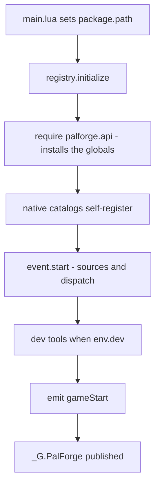
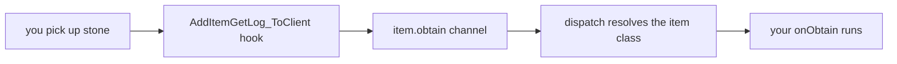
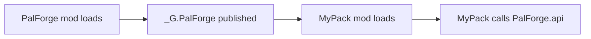

PalForge lets you add your own buildings, items, pals, skills, sounds, effects and menus to
Palworld. You describe what you want in a short Lua file, and it shows up in your game.

This page gets it installed, proves it is running, and gets your first definition reacting to
something you do in game.

## What you can do after this page

- Have PalForge running in your copy of Palworld
- Tell at a glance whether it started, from the game's own log
- Add your own item and see a message when you pick it up
- Add a chest that counts how many times you opened it, and still remembers next time you play
- Work out why something did not appear, without asking anyone

## Install

<Steps>

<Step>

### Copy the files

PalForge runs on UE4SS, the loader that lets Palworld run mods written in Lua. If you already
have other Palworld Lua mods working, you have it.

Make a folder called `PalForge` under `ue4ss/Mods/` and lay the files out like this. `palforge/`
has to sit next to `main.lua`: `main.lua` looks for the rest of PalForge in its own folder, so a
different layout breaks every part of it.

```text
ue4ss/
└── Mods/
    └── PalForge/
        ├── enabled.txt
        └── Scripts/
            ├── main.lua
            └── palforge/
                ├── env.lua
                ├── types.lua
                ├── api/
                ├── core/
                ├── native/
                ├── tests/
                └── utils/
```

`Scripts/palforge/types.lua` is annotations only — nothing loads it while the game is running. It
is there so your editor can complete every field of a definition as you type. See
[Editor setup](/docs/concepts/editor-setup).

</Step>

<Step>

### Turn the mod on

UE4SS switches a Lua mod on in one of two ways: an empty file called `enabled.txt` inside the mod
folder, or a line in `ue4ss/Mods/mods.txt`.

```text title="ue4ss/Mods/mods.txt"
CheatManagerEnablerMod : 1
ConsoleEnablerMod : 1
PalForge : 1
```

`CheatManagerEnablerMod` is what gives PalForge the game's own admin object, `UPalCheatManager`.
Keep it on: `Item.Handle:give`, `Item.Handle:take` and `Pal.Handle:spawn` all go through it, and
without it each of them is refused before it reaches the game and answers `false` — the spawn
route writes this line and gives up:

```text
[PalForge.spawn][warn] spawn.pal: no PalCheatManager (CheatManagerEnabler mod missing this session?)
```

</Step>

<Step>

### Start the game and read the log

UE4SS prints what mods say to its console window, and writes the same text to a file called
`UE4SS.log`. Every PalForge message goes through `utils/log`, which formats it as
`[PalForge.<scope>][<level>] <msg>`. Watch that while the game loads — the exact lines to look
for are in the next two sections.

</Step>

</Steps>

## What happens when the game starts

`main.lua` is the single file UE4SS runs. In order, it:

1. Points Lua's `package.path` at its own folder
   (`thisDir .. "?.lua;" .. thisDir .. "?\\init.lua;"`), so `require("palforge.api")` finds the
   modules sitting next to it.
2. Loads `palforge.env` and prints the version and the dev flag.
3. Calls `registry.initialize()` inside a `pcall`, printing `initialize failed: <err>` if that
   raises and `ready` if it does not.
4. Publishes `_G.PalForge` so other mods can use the same running copy.

```lua title="Scripts/main.lua (excerpt)"
local thisDir = debug.getinfo(1, "S").source:match("@?(.*[\\/])") or ""
package.path = thisDir .. "?.lua;" .. thisDir .. "?\\init.lua;" .. package.path

local env      = require("palforge.env")
local registry = require("palforge.core.registry")
local log      = require("palforge.utils.log").scope("main")

log.info("PalForge v" .. tostring(env.version) .. " starting (dev=" .. tostring(env.dev) .. ")")
```

`registry.initialize()` is where everything comes up. It runs five steps:



The catalogs load in this order: `buildings`, `items`, `pals`, `skills`, `effects`, `audio`,
`ui`. Loading one is what registers its content — a definition call writes itself into
`core/object_manager` as it runs. The long id lists inside those files stay plain data until
something asks for one by `get(id)`, so startup never registers the thousands of row ids at once.

`_G.PalForge` carries everything another mod might want:

```lua
_G.PalForge = {
    env = env,
    api = require("palforge.api"),
    utils = { log = ..., json = ..., file = ..., items = ... },
    core = {
        registry = ..., event = ..., object_manager = ..., spawn = ..., mesh = ...,
        sound = ..., player = ..., spatial = ..., icons = ...,
    },
    native = require("palforge.native"),
}
```

## A healthy startup log

`env.dev = true` is the shipped default. With it, a clean start looks like this:

```text
[PalForge.main][info] PalForge v0.3.0 starting (dev=true)
[PalForge.event][info] tick source live
[PalForge.event][info] event wired: bus + sources (tick/world/building/pal/item live; onBuild + onSpawned arm at world.ready; craft+discard have no native source) + dispatch
[PalForge.keyboard][info] bound F4
[PalForge.keyboard][info] keybinds loaded (1 function file(s): F4)
[PalForge.registry][info] dev console command registered: ps_catalog (DataTable dumper, opt-in)
[PalForge.unittests][info] tests: 8 passed, 0 failed, 0 skipped (8 total)
[PalForge.keyboard][info] bound F1
[PalForge.registry][info] initialized (dev=true, 19 class(es) registered)
[PalForge.main][info] ready
```

The class count is simply how many definitions registered: the ones the shipped catalogs declare,
plus your own. `[PalForge.main][info] ready` is the line that means PalForge started.

Two more lines belong to the world gate. PalForge waits for a save to finish loading before it
touches anything in the world; the first line appears when the save is ready, the second when you
leave that world again:

```text
[PalForge.event][info] world ready - building dispatch enabled
[PalForge.event][info] world left - building dispatch paused
```

<Callout type="info">
The world source checks for `FindFirstOf("PalPlayerCharacter")` every 1000 ms and wants five
valid checks in a row before it emits `world.ready`. Until then the building, pal and item sources
all return early, so nothing of yours fires while you are still on the title screen. The tick
heartbeat is the one source that runs from mod load. If the check loop cannot be installed at all,
the log says `ready-watch unavailable (...) - dispatch always on` and everything runs anyway.
</Callout>

## The dev toggle

`Scripts/palforge/env.lua` holds the settings PalForge reads at runtime. `require()` caches it, so
every module sees the same table:

```lua title="Scripts/palforge/env.lua"
return {
    dev     = true,        -- THE dev/release switch (dev tools load only when true)
    name    = "PalForge",
    version = "0.3.0",
}
```

When `dev` is true, `registry.initialize()` also:

- loads the keybind files under `core/keyboard/`, which put **F4** on `utils.items.unlockAllTech`
  — press it and your custom buildings and chests appear in the build menu;
- registers the `ps_catalog` console command, a DataTable dumper you run by hand and that never
  starts on its own;
- runs the headless test bundle in `palforge.tests`, which is where the `tests: ...` line comes
  from;
- loads `palforge.test`, the in-game test suite, and puts it on **F1**. Nothing there runs until
  you press the key, because those tests touch the live world.

Set `dev = false` for a quiet release build with only the content catalogs registered:

```lua title="Scripts/palforge/env.lua"
return {
    dev     = false,
    name    = "PalForge",
    version = "0.3.0",
}
```

Any module can read the same table:

```lua
local env = require("palforge.env")
local log = require("palforge.utils.log").scope("mypack")

if env.dev then
    log.info("dev build " .. tostring(env.version))
end
```

<Callout type="warn">
The dev gate is read inside `registry.initialize()`. Changing `require("palforge.env").dev` after
that changes what your own code sees, but it will not load or unload the dev tooling. Edit
`env.lua` to switch it for real.
</Callout>

## Your first definition

Put your own code in its own file next to `main.lua`. `package.path` already covers that folder,
so a plain `require` finds it.

```lua title="ue4ss/Mods/PalForge/Scripts/mypack.lua"
local api = require("palforge.api")
local log = require("palforge.utils.log").scope("mypack")

api.Item{
    id       = "Stone",
    name     = "Stone",
    category = "material",
    maxStack = 9999,
    events   = {
        onObtain = function(item, ctx)
            log.info("picked up " .. tostring(ctx.count) .. " stone")
        end,
    },
}
```

Load it from the bottom of `main.lua`, once PalForge itself is up:

```lua title="ue4ss/Mods/PalForge/Scripts/main.lua"
_G.PalForge = {
    -- ... unchanged ...
}

local ok, err = pcall(require, "mypack")
if not ok then print("[mypack] load failed: " .. tostring(err) .. "\n") end

return _G.PalForge
```

<Callout type="warn">
Require your file **after** `registry.initialize()` has run. Before that the bare globals are not
installed and the native catalogs have not loaded. The `pcall` matters too: a bad field in a
definition raises a hard error, and an unguarded one stops the rest of `main.lua`.
</Callout>

`Item{ id = "Stone" }` hangs your behaviour and metadata on an id the game already has. Lua on its
own cannot add a brand-new row to the game's item, pal or building tables — those are the game's
DataTables, and writing new rows into them is PalSchema's job. So build on an id that already
exists, which is why the example uses a vanilla one. An id with no colon is a literal game id
(`Stone`, `Wood`, `PalBoxV2`); `"pack:name"` is your own namespaced id, and it matches the row
name `pack_name`.

Next, a definition that remembers something. A building instance carries `self.actor`, `self.pos`,
`self.state` and `self:save()`:

```lua title="ue4ss/Mods/PalForge/Scripts/mypack.lua"
local api = require("palforge.api")
local log = require("palforge.utils.log").scope("mypack")

api.Building{
    id     = "ItemChest",
    name   = "Counted Chest",
    gridCm = 100,
    state  = { uses = 0 },
    events = {
        onLoad = function(self, ctx)
            log.info("chest tracked at " .. string.format("%.0f,%.0f,%.0f", self.pos.x, self.pos.y, self.pos.z))
        end,
        onRightClick = function(self, ctx)
            self.state.uses = self.state.uses + 1
            self:save()
            log.info("chest opened " .. tostring(self.state.uses) .. " time(s)")
        end,
    },
}
```

One id holds one definition, keyed by kind and id in `object_manager`, so defining an id PalForge
already ships a definition for replaces that one. `native/buildings` ships `WorkBench` and
`PalBoxV2`, `native/items` ships `Wood`, `Berries` and `Arrow`, and `native/pals` ships
`ChickenPal` and `SheepBall`. Pick another id unless replacing one is what you want.

And a pal, to see an action rather than a handler. `:spawn` places nothing in this version — the
lines below answer `false` — so what you can watch is the definition itself: the game's own
chickens now carry your mesh and your handlers.

```lua
local api = require("palforge.api")

-- Pal.get works for any game CharacterID, defined or not.
api.Pal.get("ChickenPal"):spawn(api.Player.coordinate())   -- false: no creature appears

-- Defining the same id attaches your own mesh and handlers to it. This replaces
-- native/pals' curated ChickenPal demo definition.
local chicken = api.Pal{
    id   = "ChickenPal",
    name = "Chicken Pal",
    mesh = api.Mesh{
        id        = "mypack:chicken_body",
        kind      = "skeletal",
        model     = "/Game/Pal/Model/Character/Monster/ChickenPal/SK_ChickenPal.SK_ChickenPal",
        animClass = "/Game/Pal/Blueprint/Character/Monster/PalActorBP/ChickenPal/ABP_ChickenPal.ABP_ChickenPal_C",
    },
    events = {
        onSpawned = function(pal, ctx)
            pal:renderOn(ctx.actor)
        end,
    },
}

chicken:spawn(api.Player.coordinateOffset(300, 0, 0))     -- false: no creature appears
```

## Check it in game

Load a save and watch the log.

<Steps>

<Step>

### Confirm the world gate opened

```text
[PalForge.event][info] world ready - building dispatch enabled
```

Until that line appears, the building, pal and item sources all return early; only the tick
heartbeat is running.

</Step>

<Step>

### Trigger the shipped demos

The definitions PalForge ships already have live handlers on them, so you can prove the wiring
works without writing anything:

```text
[PalForge.native.items][info] Wood onObtain: count=1
[PalForge.native.items][info] Berries onUse: target=...
[PalForge.native.pals][info] ChickenPal onDamaged: ...
```

Chop a tree for the first, eat berries for the second, hit a wild Chicken for the third.

</Step>

<Step>

### Trigger your own

Mine a rock and your handler runs:

```text
[PalForge.mypack][info] picked up 3 stone
```

The path from the game to your function:



`ctx.itemId` and `ctx.count` come off the game's own get-log struct, and the id is looked up in
`object_manager`. A vanilla id you never defined matches nothing, and the whole thing quietly does
nothing.

</Step>

<Step>

### Inspect what registered

```lua
local registry = require("palforge.core.registry")
local log      = require("palforge.utils.log").scope("mypack")

for id in pairs(registry.registered().item) do
    log.info("item: " .. id)
end
```

`registry.registered()` returns a snapshot keyed by kind and then id — `item`, `pal`, `building`,
`skill`, `effect`, `audio`, `mesh`, `ui`.

</Step>

</Steps>

With `env.dev = true` you also have **F1** (run the in-game test suite) and **F4** (unlock all
technology) as quick smoke tests.

## Reaching the API

`require("palforge.api")` does two things at once: it hands back a table with everything on it,
and it also creates plain global names you can use directly. Both point at the same objects.

<Tabs items={['Namespaced', 'Globals', 'Companion mod']}>

<Tab value="Namespaced">

```lua
local api = require("palforge.api")

api.Item.get("Wood"):give(10)
api.Pal.get("ChickenPal"):spawn(api.Player.coordinate())   -- :spawn places nothing in this version
```

</Tab>

<Tab value="Globals">

```lua
require("palforge.api")   -- installing the globals is the side effect

Item.get("Wood"):give(10)
Pal.get("ChickenPal"):spawn(Player.coordinate())
```

The globals are `Pal`, `Item`, `Building`, `Skill`, `Effect`, `Audio`, `Mesh`, `UI` and `Player`.
UE4SS gives each Lua mod its own Lua state, so these names belong to your mod alone and cannot
clash with the game or another mod.

</Tab>

<Tab value="Companion mod">

```lua
local api = _G.PalForge.api

api.Item.get("Wood"):give(10)
api.Pal.get("ChickenPal"):spawn(api.Player.coordinate())
```

Use this when your code cannot `require("palforge.*")` because your own `package.path` does not
point at PalForge's `Scripts/` folder.

</Tab>

</Tabs>

Every kind of content works the same way, so once you know one you know all of them:

```lua
local pal = Pal{ id = "example:Boss", name = "Boss" }   -- make one
Pal.get("ChickenPal")                                   -- find one by id
Pal.get_all()                                           -- list every one
```

## Ship your pack as its own mod

`main.lua` publishes `_G.PalForge`, so a separate mod can use the copy that is already running
instead of loading a second one.



```text
ue4ss/Mods/MyPack/
├── enabled.txt
└── Scripts/
    └── main.lua
```

```lua title="ue4ss/Mods/MyPack/Scripts/main.lua"
local PF = _G.PalForge
if not PF then
    print("[mypack] PalForge is not loaded - check the mod load order\n")
    return
end

local api = PF.api
local log = PF.utils.log.scope("mypack")

api.Item{
    id       = "Stone",
    name     = "Stone",
    category = "material",
    maxStack = 9999,
    events   = {
        onObtain = function(item, ctx)
            log.info("picked up " .. tostring(ctx.count) .. " stone")
        end,
    },
}

log.info("mypack loaded")
```

List PalForge above your pack in `ue4ss/Mods/mods.txt`, so it has finished starting before your
definitions run.

<Callout type="warn">
UE4SS gives each Lua mod its own Lua state. `_G.PalForge` is reachable from code loaded into the
state PalForge's `main.lua` ran in; whether a separate mod folder shares that state depends on
your UE4SS build and load configuration. Keep the `if not PF then ... return end` guard, and if it
trips, load your file from PalForge's own `Scripts/` folder as shown in
[Your first definition](#your-first-definition).
</Callout>

Beyond `api`, the published table gives you the toolbox and the engine:

```lua
local PF = _G.PalForge

PF.utils.log.scope("mypack").info("hello")
PF.utils.items.unlockAllTech()
PF.native.items.get("Arrow_Fire")
PF.native.buildings.WorkBench:unlock()

PF.core.event.on("tick", function(ctx)
    if ctx.count % 120 == 0 then PF.utils.log.scope("mypack").info("one minute") end
end)
```

Defining things after startup is fine. A building defined later is picked up by the next scan, and
pal and item events resolve by id at the moment they fire, so a definition registered a minute
after `gameStart` still gets its events.

## Troubleshooting

### No `[PalForge.*]` lines at all

The mod never loaded. Check, in order:

- `Scripts/main.lua` sits directly under `ue4ss/Mods/PalForge/`, and `palforge/` is next to it.
  `main.lua` works out `package.path` from where its own file is, so a moved folder breaks every
  `require`.
- The mod is on: an empty `enabled.txt` in the mod folder, or `PalForge : 1` in
  `ue4ss/Mods/mods.txt`.
- UE4SS itself is loading Lua mods at all (other Lua mods print their own lines).

### `initialize failed: ...`

```text
[PalForge.main][err] initialize failed: ...
```

An error escaped `registry.initialize()`. `main.lua` catches it, so the game keeps running, but
nothing is live — no sources, no dispatch, no catalogs. The text after the colon is the real
error. A single catalog that failed is reported on its own line, as
`native catalog 'palforge.native.items' load error: ...`.

### Unknown field

```text
PalForge: Pal: unknown field "meshSpec" (did you mean "mesh"?). Valid fields: id, name, description, skills, mesh, material, color, texture, icon, events, data
```

A field that is not part of the definition is a hard error with a suggested correction, so a
misspelled name can never be silently ignored. The same check runs on nested tables, including
`events`:

```text
PalForge: Pal: field "events" (Pal.Spec.Events): unknown field "onSpawn" (did you mean "onSpawned"?). Valid fields: onSpawned, onDamaged, onDeath, onCaptured, onTick
```

You can also ask what a call accepts, from your own code:

```lua
local schema = require("palforge.core.schema")

print(schema.help("Pal.Spec"))          -- every field, type, default and meaning
print(schema.help("Pal.Spec.Events"))   -- the handler list
schema.get("Pal.Spec").fields           -- the same as a table, for tooling
```

### Missing id

```text
PalForge: Item: field "id" is required (item id: a game ItemId ("Wood") or "pack:name")
```

`id` is required for every kind of content. The text in parentheses is that field's own
documentation, so the message tells you what shape the value should have.

### Wrong value or wrong type

```text
PalForge: Item: field "category" must be one of { "material", "consumable", "equipment", "ammo", "ingredient", "other" }, got "food"
PalForge: Item: field "maxStack" expects number, got string
PalForge: Building: field "mesh" (Building.Spec.Mesh): field "model" is required (UStaticMesh asset path, or an OBJ path for the procedural backend)
```

The call never half-succeeds: a failing check raises before anything is registered.

### A handler never fires

- Check that the hook has something to fire it. `onCraft` and `onDiscard` on items, and
  `onLeftClick` and `onBreak` on buildings, can be written but nothing emits them yet — use
  `onUse` / `onObtain` and `onRightClick` / `onRemove` instead.
  [Lifecycle](/docs/concepts/lifecycle) lists what is live.
- Check the world gate: nothing runs before `world ready - building dispatch enabled`.
- Check for a hook the game would not let PalForge install:

  ```text
  [PalForge.event][warn] hook unavailable (feature disabled): /Script/Pal.PalBuildObject:OnBeginInteractBuilding -> ...
  ```

- Check the id. Items are matched by `ctx.itemId` and pals by their blueprint class name
  (`BP_<Id>_C`), which is the game's internal name for that pal's actor. An id that matches nothing
  in `object_manager` quietly does nothing — it is not an error.

### A handler fires but something inside it breaks

Your handler runs inside a `pcall`, so a mistake in it cannot crash the game. The error is written
to the log with the channel and the hook that raised it:

```text
[PalForge.event][err] item.use -> onUse handler failed: ...
```

A building `onTick` that keeps failing is switched off, so one bad handler cannot burn the
heartbeat forever:

```text
[PalForge.event][err] onTick 'WorkBench@1204,-431,84' failed: ...
[PalForge.event][warn] onTick 'WorkBench@1204,-431,84' disabled after 5 failures
```

Wrap risky work yourself while developing, so you decide what the message says:

```lua
events = {
    onRightClick = function(self, ctx)
        local ok, err = pcall(function()
            -- your work here
        end)
        if not ok then log.err("onRightClick: " .. tostring(err)) end
    end,
}
```

### Spawning does nothing

No creature appears from `:spawn` in this version, whatever you pass it — see
[Pal](/docs/api/pal), which also covers what a pal definition still does for you. This warning is
a separate, earlier problem, and worth fixing anyway:

```text
[PalForge.spawn][warn] spawn.pal: no PalCheatManager (CheatManagerEnabler mod missing this session?)
```

It means the call was refused before it reached the game. `:spawn` needs `UPalCheatManager`, so
turn on `CheatManagerEnablerMod` in `mods.txt`.

## Where to go next

<Cards>
  <Card title="Definitions" href="/docs/concepts/definitions">
    How to make one, find one, list them all, and what you get back.
  </Card>
  <Card title="Schema" href="/docs/concepts/schema">
    The fields each kind of content accepts, and how to read them at runtime.
  </Card>
  <Card title="Lifecycle" href="/docs/concepts/lifecycle">
    Which handlers fire, when, and what lands in `ctx`.
  </Card>
  <Card title="First content pack" href="/docs/guides/first-content-pack">
    A complete pack built from every kind of content, end to end.
  </Card>
</Cards>

## Summary

- PalForge lives at `ue4ss/Mods/PalForge/Scripts/`, with `palforge/` next to `main.lua`. Any other
  layout breaks it.
- `[PalForge.main][info] ready` means PalForge started;
  `world ready - building dispatch enabled` means your handlers can now fire.
- Put your content in your own file next to `main.lua` and `require` it at the bottom of
  `main.lua`, after `registry.initialize()`.
- `Item{ ... }`, `Building{ ... }` and `Pal{ ... }` all work the same way: call with a table to
  make one, `get(id)` to find one, `get_all()` to list them.
- An id with no colon is one of the game's own; `"pack:name"` is yours.
- A wrong field name stops the call with a message naming the field and listing the valid ones, so
  read it rather than guessing.

Next, read [Definitions](/docs/concepts/definitions) to see what a definition hands back and what
you can do with it.
