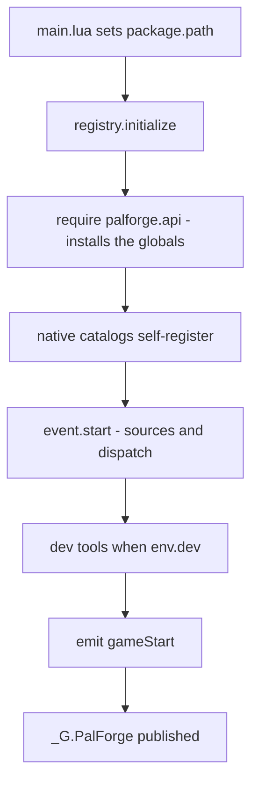
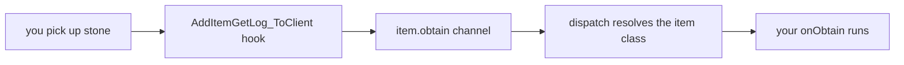
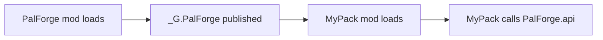

PalForge 让你把自己做的建筑物、道具、帕鲁、技能、声音、效果和菜单加进 Palworld。你在一个简短的
Lua 文件里写下想要的东西，它就会出现在你的游戏里。

本页会把它装好、确认它在运行，并让你的第一个定义对游戏里的操作作出反应。

## 读完本页你可以做到

- 在自己的 Palworld 里跑起 PalForge
- 只看游戏自己的日志，就知道它有没有启动
- 加入自己的道具，捡起它时输出一条消息
- 加入一个会数自己被打开过几次的箱子，下次再玩时次数还在
- 自己查出某个东西为什么没出现，不用问别人

## 安装

<Steps>

<Step>

### 复制文件

PalForge 跑在 UE4SS 上，UE4SS 是让 Palworld 能运行 Lua 模组的加载器。如果你已经有别的 Palworld
Lua 模组能用，那你就已经装了它。

在 `ue4ss/Mods/` 下建一个叫 `PalForge` 的文件夹，按下面的样子放文件。`palforge/` 必须和
`main.lua` 放在同一层：`main.lua` 会在自己所在的文件夹里找 PalForge 的其余部分，布局不一样就会
让每一个部分都失效。

```text
ue4ss/
└── Mods/
    └── PalForge/
        ├── enabled.txt          <- 空文件；只有它存在时 UE4SS 才会启动这个模组
        └── Scripts/
            ├── main.lua
            └── palforge/
                ├── env.lua      <- dev/release 开关，以及声明的游戏版本号
                ├── types.lua    <- 只有编辑器注解；运行时不会被加载
                ├── autorun.txt  <- 不需要按键的 dev 队列（core/autorun.lua 在这里读它）
                ├── api/         <- 内容包要面对的公开接口
                ├── core/        <- 引擎本体：内核、事件系统、Palworld 桥接
                ├── native/      <- 把 Palworld 自己的内容做成的数据目录
                ├── test/        <- 游戏内 API 测试套件（单数形式，见下）
                ├── tests/       <- 无界面的单元测试包，dev 下启动时就会跑
                └── utils/       <- log, json, file, items
```

这和 `tools/deploy.sh` 复制的清单是同一份：`Scripts/main.lua` 加上整个 `Scripts/palforge/`，减去
`deprecated/` 和 `tmp/` —— 这两个只作参考，运行时用不到。

有两项很容易漏掉，而且漏掉之后都会表现成别的毛病：

- **`palforge/test/`，单数。** `core/registry.lua` 会 require `palforge.test`，绑定 **F1** 的正是
  这个模块。少了这个目录的安装，在 dev 模式下既没有测试套件也没有 F1 键，而日志里没有任何别的行
  能解释这件事。（`palforge/tests/`，*复数*，是另一样东西：dev 下内核在启动时跑的无界面单元测试
  包，也是 `ps_catalog` 控制台命令的本体。它同样随仓库发布 —— 发现 `core/registry.lua` 启动时就
  require 它之后，那条把它藏起来的 `.gitignore` 行已经删掉了，所以克隆里也有。真要是缺了，内核
  会在 “dev tooling NOT loaded” 那一行里把它点名。）
- **`palforge/autorun.txt`。** `core/autorun.lua` 从 `palforge/` 旁边读它，并在世界加载时运行其中
  具名的动作。在按键和控制台都失效的机器上，它是唯一能跑起东西的路子 —— 这个项目已经接连有三条
  输入通路失效过。

`Scripts/palforge/types.lua` 只有类型注解，游戏运行时不会有任何地方加载它。它的作用是让你输入时
编辑器能补全定义的每一个字段。参见[编辑器设置](/docs/concepts/editor-setup)。

</Step>

<Step>

### 打开这个模组

UE4SS 打开一个 Lua 模组有两种方式：在模组文件夹里放一个空的 `enabled.txt` 文件，或者在
`ue4ss/Mods/mods.txt` 里加一行。

```text title="ue4ss/Mods/mods.txt"
CheatManagerEnablerMod : 1
PalForge : 1
```

`CheatManagerEnablerMod` 的作用，是把游戏自己的管理对象 `UPalCheatManager` 交给 PalForge，把帕鲁
放进世界要走这个对象。但它是便利，不是硬性要求：`core/spawn.lua` 的 `cheatManager()` 先找一个活着
的，再看控制器自己的 `CheatManager`，两者都没有时就用
`StaticConstructObject(pc.CheatClass, pc)` 自己造一个。它造不出来的唯一情况，是根本没有玩家控制器
可以挂，而下面这行报告的正是这种情况：

```text
[PalForge.spawn][warn] spawn.pal: no PalCheatManager and none could be constructed (no player controller yet?)
```

</Step>

<Step>

### 启动游戏并读日志

UE4SS 会把模组说的话打印到它的控制台窗口，并把同样的文本写进一个叫 `UE4SS.log` 的文件。PalForge
的每条消息都经过 `utils/log`，格式是 `[PalForge.<scope>][<level>] <msg>`。游戏加载时盯着它看，
具体要找哪几行在接下来的两节里。

</Step>

</Steps>

## 游戏启动时发生了什么

`main.lua` 是 UE4SS 唯一运行的文件。它按顺序做这些事：

1. 把 Lua 的 `package.path` 指向自己所在的文件夹
   （`thisDir .. "?.lua;" .. thisDir .. "?\\init.lua;"`），这样 `require("palforge.api")` 就能找到
   放在旁边的模块。
2. require 可选模块 `palforge_dev`（`Scripts/palforge_dev.lua`），并记下发生的是三件事中的哪一
   件：`loaded`、`absent (release copy)` 还是 `FAILED TO LOAD`。这一个文件就是整个 dev 开关；第三
   种情况会另外发一条 warn，因为“dev 覆盖文件有语法错误”和“框架忽略了这个标志”从外面看一模一样。
3. 通过 `UKismetSystemLibrary` 的 CDO 向正在运行的游戏要它的版本字符串，把答案存进
   `env.gameBuildLive`。那一刻问不出结果是正常的 —— Lua 模组启动得很早 —— 所以这次读取会在第一次
   `world.ready` 时重试一次。
4. 打印启动横幅：版本号、声明的和实时读到的游戏版本、`dev` 与 `debug`，以及 dev 覆盖文件在不在。
   紧接着是完整的单人游戏声明。
5. 在 `pcall` 里调用 `registry.initialize()`，失败就打印 `initialize failed: <err>`，成功就打印
   `ready`。
6. 发布 `_G.PalForge`，让别的模组能用同一份正在运行的副本。

```lua title="Scripts/main.lua (excerpt)"
local thisDir = debug.getinfo(1, "S").source:match("@?(.*[\\/])") or ""
package.path = thisDir .. "?.lua;" .. thisDir .. "?\\init.lua;" .. package.path

local env      = require("palforge.env")
local registry = require("palforge.core.registry")
local log      = require("palforge.utils.log").scope("main")

log.info(string.format(
    "PalForge v%s starting | game build: declared %s, live %s | dev=%s debug=%s | dev overlay: %s",
    tostring(env.version),
    tostring(env.gameBuild),
    liveBuild and (liveBuild .. " (" .. buildSource .. ")") or ("unknown (" .. buildSource .. ")"),
    tostring(env.dev), tostring(env.debug), devOverlay))
```

一切启动起来的地方是 `registry.initialize()`。它跑五个步骤：



内容目录的加载顺序是：`buildings`、`items`、`pals`、`skills`、`effects`、`audio`、`ui`。require
其中一个，会运行它里面手写的定义调用，而定义调用在运行时会把自己写进 `core/object_manager`。那些
文件里长长的 id 列表始终只是普通数据：惰性的 `get(id)` 用 `{ register = false }` 造出句柄就到此为
止，所以启动时不会注册，单次查询也不会注册。真正注册的是需要显式调用的
`<catalog>.publish(id)`。`native/buildings` **什么都不注册**：它手写的 `WorkBench` 和 `PalBoxV2`
同样带着 `{ register = false }`，因为注册一个建筑物不是无害的 —— `core/event` 的扫描会随即开始
追踪并持久化你世界里已经立着的每一个同类建筑。

`_G.PalForge` 带着别的模组可能想要的一切：

```lua
_G.PalForge = {
    env  = env,
    api  = api,
    pack = api.pack,       -- PalForge.pack("mypack").Item{ ... } 会记下所属内容包
    utils = { log = ..., json = ..., file = ..., items = ... },
    core = {
        registry = ..., event = ..., object_manager = ..., spawn = ..., mesh = ...,
        sound = ..., player = ..., spatial = ..., icons = ...,
        uobject = ..., assetpath = ...,
    },
    native = require("palforge.native"),
}
```

## 正常的启动日志

所有 dev 工具都默认关闭，所以玩家看到的是较短的那份日志。一次干净的发布版启动是这样的：

```text
[PalForge.main][info] PalForge v0.3.0 starting | game build: declared v1.0.2.101103, live unknown (UKismetSystemLibrary CDO did not resolve) | dev=false debug=false | dev overlay: absent (release copy)
[PalForge.main][info] PalForge targets SINGLE-PLAYER Palworld. Dedicated servers and co-op guests are not supported and are not tested: there is no replication layer, and the item, spawn and event routes are all client-authoritative. A pack may appear to work for the host and do nothing for anyone else.
[PalForge.event][info] tick source live
[PalForge.event][info] event wired: bus + sources (tick/world/building/pal/item/skill; onBuild, the three onSpawned candidates and the three passive ones arm at world.ready; skill.activate has three sources and skill.hit two, and the log says which one carried it; building.leftclick and building.break have no native source and never will) + dispatch
[PalForge.registry][info] dev tooling NOT loaded (env.dev = false, the shipped default): no dev keybinds — including F4, unlock all technologies — no F1 API suite, no F9 reload, no ps_catalog dumper, no headless unit bundle and no test hooks. ...
[PalForge.registry][info] initialized (dev=false, debug=false, 17 class(es) registered)
[PalForge.main][info] ready
```

`live` 是正在运行的游戏被问到版本字符串时给出的回答。UE4SS 启动 Lua 模组很早，所以那一刻是
`unknown` 属于正常而不是失败 —— 这次读取会在第一次世界加载时重试一次，并把答案记在那里。PalForge
宁可写 `unknown` 也不猜。声明的版本和实时读到的版本对不上时，它会点名两者，warn 一次。

class 的数量就是注册了多少个定义。17 是只有随包目录时的数字（audio 6、item 3、effect 3、pal 2、
ui 2、skill 1、building 0），你自己的定义会加在上面。表示 PalForge 已经启动的那一行是
`[PalForge.main][info] ready`。

dev 部署会多出工具相关的行。每次绑定都会在同一行里报告，游戏自己的按键配置在那个键上放了什么：

```text
[PalForge.main][info] PalForge v0.3.0 starting | game build: ... | dev=true debug=true | dev overlay: loaded
[PalForge.keyboard][info] bound F4 [keymap: unknown — the game's key config has not been read yet (the config source needs a loaded world), so nothing is claimed either way; run pf_keys inside a save]
[PalForge.keyboard][info] keybinds loaded (1 function file(s): F4)
[PalForge.registry][info] dev console command registered: ps_catalog (DataTable dumper, opt-in)
[PalForge.keyboard][info] bound F9 [keymap: ...]
[PalForge.unittests][info] tests: 8 passed, 0 failed, 0 skipped (8 total)
[PalForge.keyboard][info] bound F1 [keymap: ...]
[PalForge.test][info] keyboard: F1                   unknown  tests: all suites                        game: the game's key config has not been read
[PalForge.registry][info] dev tooling loaded: dev keybinds incl. F4 unlock-all-technologies, ps_catalog console command, F9 reload, headless unit bundle (palforge.tests), in-game API suite on F1 (palforge.test), game-required test hooks (palforge.test.hooks)
[PalForge.registry][info] initialized (dev=true, debug=true, 17 class(es) registered)
[PalForge.main][info] ready
```

`tests: 8 passed ...` 来自无界面的单元测试包 `palforge/tests/`（复数）。它在仓库里，所以这是正常
的一行。要是哪份安装把这个目录漏掉了，内核就会把它点名写进 `dev tooling NOT loaded` 那一行。
这一行两种模式下都会打印，逐项列出
没有加载的东西和原因：一个从未被绑定的键，和一个绑定了却从来收不到按键的键，从外面看是一样的，
能区分它们的只有这一行。

另外两行属于世界闸门。PalForge 会等存档加载完成，才去碰世界里的东西；第一行在存档准备好时出现，
第二行在你离开那个世界时出现：

```text
[PalForge.event][info] world ready - building dispatch enabled
[PalForge.event][info] world left - building dispatch paused
```

<Callout type="info">
world 源每 1000 毫秒检查一次 `FindFirstOf("PalPlayerCharacter")`，要连续五次检查有效才会发出
`world.ready`。在那之前，building、pal 和 item 这几个源都会直接返回，所以你还在标题界面时，你写的
东西都不会触发。tick 心跳是唯一从模组加载起就在跑的源。如果那个检查循环根本装不上，日志会写
`ready-watch unavailable (...) - dispatch always on`，然后所有东西照常运行。
</Callout>

## dev 开关

`Scripts/palforge/env.lua` 放着 PalForge 运行时读的设置。`require()` 会缓存它，所以每个模块看到的
是同一张表 —— 而且里面每个开关出厂时都是**关**的：

```lua title="Scripts/palforge/env.lua"
return {
    dev        = false,       -- THE dev/release switch (dev tools load only when true)
    debug      = false,       -- game-required test hooks (test/hooks); needs dev too
    debugHooks = {},          -- per-hook opt-in for the hooks that WRITE
    name       = "PalForge",
    version    = "0.3.0",
    gameBuild     = "v1.0.2.101103",
    gameBuildLive = nil,
    multiplayer   = false,
}
```

框架里没有任何东西会把 `dev` 打开。打开它的只有一个可选文件：`Scripts/palforge_dev.lua`。
`main.lua` 会在 `registry.initialize()` 之前立刻 require 它，文件不在就直接忽略。

```lua title="Scripts/palforge_dev.lua"
local env = require("palforge.env")
env.dev   = true
env.debug = true
-- env.debugHooks["pal-skills-equip"] = true   -- 会写入存档的钩子，需要逐个开启
```

这个文件被 gitignore 了，所以它没法通过仓库到玩家手里；`tools/deploy.sh` 会替你写出它。脚本会整个
替换部署目录下的 `Scripts/`（先放到暂存目录，再用两次改名换过去，游戏永远看不到一棵只填了一半的
目录树），给这份副本打上构建时间戳，并且**从不**改 `env.lua`：

```bash
tools/deploy.sh                        # 向默认安装目录做 dev 部署；写出覆盖文件
tools/deploy.sh "/path/to/Palworld"    # 部署到别的地方
tools/deploy.sh --release              # 不写覆盖文件，并按名字删掉任何残留的旧副本
```

所以整个循环是：**改文件 → `tools/deploy.sh` → 在游戏里按 F9（全新部署后的第一次要重启）→ 按
F1**。Lua 是在模组加载时读的，所以部署过去的文件在重新加载之前不会改变正在运行的游戏；构建时间戳
的作用，是让一次过时的运行在日志里一眼可见，而不是花一小时去查。

### `dev` 会武装什么：九个键

`registry.initialize()` 会加载 `core/keyboard/` 下的按键绑定文件、F9 重新加载、`ps_catalog`
DataTable 导出工具、无界面单元测试包，以及 `palforge.test` —— 绑定 F1、并给每个探针各分一个键的，
正是最后这个模块。一共九个键：

| 键 | 做什么 | 屏幕上需要什么 |
| --- | --- | --- |
| **F1** | 运行游戏内 API 测试套件：14 个套件，481 项检查 | 哪里都能跑，但没有加载存档时会跳过 28 项 |
| **F2** | 探针 `title` —— 游戏自己的标题菜单按钮 | 标题界面 |
| **F3** | 探针 `uislot` —— 那个按钮的内层 slot，从世界里读 | 一个加载好的存档 |
| **F4** | **解锁当前存档里的全部科技** | 一个加载好的存档 |
| **F5** | 探针 `reflect` —— 类、函数、参数、DataTable 行 | 一个加载好的存档 |
| **F6** | 探针 `pal` —— 帕鲁的网格组件、动画类和材质 | 身边站着一只帕鲁 |
| **F8** | 探针 `watch` —— 装上原生钩子，记录你操作时触发了什么 | 加载好的存档，然后制作／丢弃／生成 |
| **F9** | 重新加载所有 `palforge.*` 模块 | —— |
| **F10** | 探针 `uievents` —— 数四个 UI 重建钩子的触发次数 | 加载好的存档，然后退回标题再重新进入 |

九个里有七个只读取和打印。**真正会改变什么的只有两个：**

- **F4** 会写进当前加载的存档。按一下，没有确认，全部科技解锁。
- **F8** 会注册原生钩子，而 UE4SS 没有取消注册的办法 —— 它装上的东西会一直留到你退出游戏。它还会
  在你面前生成一只 ChickenPal，并在之后大约 60 秒内拒绝 F9：它那两条最长的异步链还没结束，在这个
  窗口里重新加载会把引擎的 tick 钩子一起带走。

F7 被刻意排除在外：那是 Palworld 自己的音量键，绑定会成功，日志也会说成功，然后按下去一次都到不
了。每个动作同时都有控制台命令（`pf_tests`、`pf_watch`、`pf_hooks`，每个探针一个、每个钩子一个），
而 `core/autorun.lua` 会在世界加载时运行 `palforge/autorun.txt` 里具名的动作 —— 三条不同的入口，
因为这个项目已经接连有三条输入通路失效过。

`env.debug` 是第二个、也更窄的开关：它加载 `palforge/test/hooks/`，也就是那 19 项没有游戏在跑就
测不了的测量。它们是被声明而不是被运行的 —— 用 `pf_hook <id>` 按名字调用，`pf_hooks` 会列出每个
钩子以及它会跳过的原因。会写进存档的那些，还需要额外的 `env.debugHooks[id] = true`。

任何模块都能读同一张表：

```lua
local env = require("palforge.env")
local log = require("palforge.utils.log").scope("mypack")

if env.dev then
    log.info("dev build " .. tostring(env.version))
end
```

<Callout type="warn">
dev 开关是在 `registry.initialize()` 内部读的。在那之后再改 `require("palforge.env").dev`，只会改变
你自己的代码看到的值，并不会加载或卸载 dev 工具。覆盖文件之所以有效，是因为 `main.lua` 在
`initialize()` *之前* 就 require 了它。
</Callout>

## 你的第一个定义

把你自己的代码放进 `main.lua` 旁边一个独立的文件里。`package.path` 已经覆盖了那个文件夹，所以一句
普通的 `require` 就能找到它。

```lua title="ue4ss/Mods/PalForge/Scripts/mypack.lua"
local api = require("palforge.api")
local log = require("palforge.utils.log").scope("mypack")

api.Item{
    id       = "Stone",
    name     = "Stone",
    category = "material",
    maxStack = 9999,
    events   = {
        onObtain = function(item, ctx)
            log.info("picked up " .. tostring(ctx.count) .. " stone")
        end,
    },
}
```

等 PalForge 本体起来之后，在 `main.lua` 的末尾加载它：

```lua title="ue4ss/Mods/PalForge/Scripts/main.lua"
_G.PalForge = {
    -- ... unchanged ...
}

local ok, err = pcall(require, "mypack")
if not ok then print("[mypack] load failed: " .. tostring(err) .. "\n") end

return _G.PalForge
```

<Callout type="warn">
一定要在 `registry.initialize()` 跑完**之后**再 require 你的文件。在那之前，裸的全局名还没装上，
native 目录也还没加载。`pcall` 同样重要：定义里写错一个字段会抛出硬错误，不加保护的话，`main.lua`
剩下的部分就停了。
</Callout>

`Item{ id = "Stone" }` 是把你的行为和元数据挂在一个游戏里已经有的 id 上。光靠 Lua 没法往游戏的
道具、帕鲁、建筑物表里加一个全新的行，那些是游戏的 DataTable，往里面写新行是 PalSchema 的活。所以
要在已经存在的 id 上做，这也是例子里用原版 id 的原因。不带冒号的 id 就是游戏里真实的 id（`Stone`、
`Wood`、`PalBoxV2`）；`"pack:name"` 是你自己的带命名空间的 id，它对应行名 `pack_name`。

接下来是一个会记住东西的定义。建筑物实例带着 `self.actor`、`self.pos`、`self.state` 和
`self:save()`：

```lua title="ue4ss/Mods/PalForge/Scripts/mypack.lua"
local api = require("palforge.api")
local log = require("palforge.utils.log").scope("mypack")

api.Building{
    id     = "ItemChest",
    name   = "Counted Chest",
    gridCm = 100,
    state  = { uses = 0 },
    events = {
        onLoad = function(self, ctx)
            log.info("chest tracked at " .. string.format("%.0f,%.0f,%.0f", self.pos.x, self.pos.y, self.pos.z))
        end,
        onRightClick = function(self, ctx)
            self.state.uses = self.state.uses + 1
            self:save()
            log.info("chest opened " .. tostring(self.state.uses) .. " time(s)")
        end,
    },
}
```

一个 id 只保存一个定义，`object_manager` 用种类加 id 作为键，所以给一个 PalForge 已经注册过的 id
再定义一次，就会替换掉那一个。随包目录真正注册的，就是启动行里的那 17 个类：`native/items` 的
`Wood`、`Berries` 和 `Arrow`，`native/pals` 的 `ChickenPal` 和 `SheepBall`，再加上 audio、effect、
skill 和 UI 的那几个。`native/buildings` **什么都不注册** —— 它的 `WorkBench` 和 `PalBoxV2` 是用
`{ register = false }` 造的，由 `native.buildings.publish(id)` 按需交出。所以上面的 `ItemChest`
不会和任何东西冲突；而跨内容包的冲突现在会点名告警，而不是被悄悄覆盖。

再来一个帕鲁的例子，看的是一个动作而不是处理函数。给生成留几秒钟：`SpawnMonster` 是异步的，唯一
被计时过的一次到达用了 5.9 秒，`core/spawn` 会盯着世界最多 12 秒，看到它到了就写进日志。`:spawn`
返回的布尔值说的是那次调用，不是说帕鲁已经站在你面前。

```lua
local api = require("palforge.api")
local log = require("palforge.utils.log").scope("mypack")

-- Pal.get works for any game CharacterID, defined or not.
api.Pal.get("ChickenPal"):spawn(api.Player.coordinate())   -- the pal arrives a few seconds later

-- Defining the same id attaches your own mesh and handlers to it. This replaces
-- native/pals' curated ChickenPal demo definition.
local chicken = api.Pal{
    id   = "ChickenPal",
    name = "Chicken Pal",
    mesh = api.Mesh{
        id        = "mypack:chicken_body",
        kind      = "skeletal",
        model     = "/Game/Pal/Model/Character/Monster/ChickenPal/SK_ChickenPal.SK_ChickenPal",
        animClass = "/Game/Pal/Blueprint/Character/Monster/PalActorBP/ChickenPal/ABP_ChickenPal.ABP_ChickenPal_C",
    },
    events = {
        -- The mesh declared above is attached FOR YOU on pal.spawned; nothing here calls
        -- renderOn. Your own handler runs after that attach, and may fire more than once.
        onSpawned = function(pal, ctx)
            log.info("chicken spawned: " .. tostring(ctx.actor))
        end,
    },
}

chicken:spawn(api.Player.coordinateOffset(300, 0, 0))     -- 3 m away, a few seconds later
```

## 在游戏里确认

读取一个存档，盯着日志看。

<Steps>

<Step>

### 确认世界闸门开了

```text
[PalForge.event][info] world ready - building dispatch enabled
```

这一行出现之前，building、pal 和 item 这几个源都会直接返回，只有 tick 心跳在跑。

</Step>

<Step>

### 触发随包的演示

PalForge 自带的定义上已经挂好了能用的处理函数，所以你什么都不写也能证明整条线路是通的：

```text
[PalForge.native.items][info] Wood onObtain: count=1
[PalForge.native.items][info] Berries onUse: target=...
[PalForge.native.pals][info] ChickenPal onDamaged: ...
```

第一条砍一棵树，第二条吃浆果，第三条打一只野生的 Chicken。

</Step>

<Step>

### 触发你自己的

挖一块石头，你的处理函数就会跑：

```text
[PalForge.mypack][info] picked up 3 stone
```

从游戏到你的函数的路径：



`ctx.itemId` 和 `ctx.count` 取自游戏自己的获取日志结构体，这个 id 会拿到 `object_manager` 里查。
一个你从没定义过的原版 id 什么都匹配不上，整件事就安静地什么也不做。

</Step>

<Step>

### 查看注册了什么

```lua
local registry = require("palforge.core.registry")
local log      = require("palforge.utils.log").scope("mypack")

for id in pairs(registry.registered().item) do
    log.info("item: " .. id)
end
```

`registry.registered()` 返回一份快照，先按种类再按 id 组织，种类有 `item`、`pal`、`building`、
`skill`、`effect`、`audio`、`mesh`、`ui`。

</Step>

</Steps>

`object_manager.owner(type, id)` 会说出某个注册属于哪个内容包，`entry` 和 `byResolved` 从另外两个
方向回答同一个问题。做了 dev 部署的话，最快的冒烟测试就是 **F1**：它会跑完 14 个套件，而摘要会写
明有多少项检查没能被回答、以及是哪个方向没能回答。

## 访问 API

`require("palforge.api")` 一次做两件事：它返回一张带着所有东西的表，同时还创建了可以直接用的普通
全局名。两边指向的是同一批对象。

<Tabs items={['命名空间', '全局名', '配套模组']}>

<Tab value="命名空间">

```lua
local api = require("palforge.api")

api.Item.get("Wood"):give(10)
api.Pal.get("ChickenPal"):spawn(api.Player.coordinate())   -- the pal arrives a few seconds later
```

</Tab>

<Tab value="全局名">

```lua
require("palforge.api")   -- installing the globals is the side effect

Item.get("Wood"):give(10)
Pal.get("ChickenPal"):spawn(Player.coordinate())
```

全局名是 `Pal`、`Item`、`Building`、`Skill`、`Effect`、`Audio`、`Mesh`、`UI` 和 `Player`。UE4SS 给
每个 Lua 模组各自独立的 Lua state，所以这些名字只属于你的模组，不会和游戏或别的模组撞车。

</Tab>

<Tab value="配套模组">

```lua
local api = _G.PalForge.api

api.Item.get("Wood"):give(10)
api.Pal.get("ChickenPal"):spawn(api.Player.coordinate())
```

当你自己的 `package.path` 没有指向 PalForge 的 `Scripts/` 文件夹、因而没法 `require("palforge.*")`
时，用这个写法。

</Tab>

</Tabs>

每一种内容的用法都一样，所以学会一种就等于学会全部：

```lua
local pal = Pal{ id = "example:Boss", name = "Boss" }   -- make one
Pal.get("ChickenPal")                                   -- find one by id
Pal.get_all()                                           -- list every one
```

## 把你的包做成独立模组

`main.lua` 发布了 `_G.PalForge`，所以另一个模组可以用已经在跑的那一份，而不用再加载一份。



```text
ue4ss/Mods/MyPack/
├── enabled.txt
└── Scripts/
    └── main.lua
```

```lua title="ue4ss/Mods/MyPack/Scripts/main.lua"
local PF = _G.PalForge
if not PF then
    print("[mypack] PalForge is not loaded - check the mod load order\n")
    return
end

local api = PF.api
local log = PF.utils.log.scope("mypack")

api.Item{
    id       = "Stone",
    name     = "Stone",
    category = "material",
    maxStack = 9999,
    events   = {
        onObtain = function(item, ctx)
            log.info("picked up " .. tostring(ctx.count) .. " stone")
        end,
    },
}

log.info("mypack loaded")
```

在 `ue4ss/Mods/mods.txt` 里把 PalForge 写在你的包上面，这样你的定义运行之前，它已经启动完毕。

<Callout type="warn">
UE4SS 给每个 Lua 模组各自独立的 Lua state。`_G.PalForge` 能被加载进 PalForge 的 `main.lua` 所在
state 的代码访问到；另一个模组文件夹是否共享那个 state，取决于你的 UE4SS 版本和加载配置。请留着
`if not PF then ... return end` 这道防线，如果它真的触发了，就照“你的第一个定义”一节里的做法，从
PalForge 自己的 `Scripts/` 文件夹加载你的文件。
</Callout>

除了 `api`，公开出来的这张表还给你工具箱和引擎：

```lua
local PF = _G.PalForge

PF.utils.log.scope("mypack").info("hello")
PF.utils.items.unlockAllTech()
PF.native.items.get("Arrow_Fire")
PF.native.buildings.WorkBench:unlock()

PF.core.event.on("tick", function(ctx)
    if ctx.count % 120 == 0 then PF.utils.log.scope("mypack").info("one minute") end
end)
```

启动之后再定义也没问题。之后定义的建筑物会被下一次扫描拾到，帕鲁和道具的事件在触发的那一刻按 id
解析，所以在 `gameStart` 一分钟之后才注册的定义照样能收到自己的事件。

## 排查问题

### 一行 `[PalForge.*]` 都没有

模组根本没加载。按顺序检查：

- `Scripts/main.lua` 就在 `ue4ss/Mods/PalForge/` 下面，`palforge/` 在它旁边。`main.lua` 是根据自己
  文件的位置算出 `package.path` 的，文件夹一挪，每个 `require` 都会坏。
- 模组是开着的：模组文件夹里有个空的 `enabled.txt`，或者 `ue4ss/Mods/mods.txt` 里有
  `PalForge : 1`。
- UE4SS 本身确实在加载 Lua 模组（别的 Lua 模组会打印它们自己的行）。

### `initialize failed: ...`

```text
[PalForge.main][err] initialize failed: ...
```

有一个错误从 `registry.initialize()` 里跑了出来。`main.lua` 把它接住了，所以游戏还能跑，但什么都
没起来，没有源，没有分发，没有目录。冒号后面的文字才是真正的错误。只有某一个目录失败时，会单独出
一行 `native catalog 'palforge.native.items' load error: ...`。

### 未知字段

```text
PalForge: Pal: unknown field "meshSpec" (did you mean "mesh"?). Valid fields: id, name, description, skills, mesh, material, color, texture, icon, events, data
```

不属于定义的字段会直接报硬错误，并附上修改建议，所以名字拼错绝不会被悄悄忽略。同样的检查也会跑在
嵌套的表上，包括 `events`：

```text
PalForge: Pal: field "events" (Pal.Spec.Events): unknown field "onSpawn" (did you mean "onSpawned"?). Valid fields: onSpawned, onDamaged, onDeath, onCaptured, onTick
```

一个调用接受什么，你也可以从自己的代码里问：

```lua
local schema = require("palforge.core.schema")

print(schema.help("Pal.Spec"))          -- every field, type, default and meaning
print(schema.help("Pal.Spec.Events"))   -- the handler list
schema.get("Pal.Spec").fields           -- the same as a table, for tooling
```

### 缺少 id

```text
PalForge: Item: field "id" is required (item id: a game ItemId ("Wood") or "pack:name")
```

每一种内容都必须有 `id`。括号里的文字是这个字段自己的文档，所以这条消息会告诉你该给一个什么样的值。

### 值不对或类型不对

```text
PalForge: Item: field "category" must be one of { "material", "consumable", "equipment", "ammo", "ingredient", "other" }, got "food"
PalForge: Item: field "maxStack" expects number, got string
PalForge: Building: field "mesh" (Building.Spec.Mesh): field "model" is required (UStaticMesh asset path, or an OBJ path for the procedural backend)
```

调用不会做到一半就算成功：检查一旦不通过，在注册任何东西之前就先报错。

### 处理函数一直不触发

- 检查有没有东西能触发那个钩子。道具的四个事件全都会触发：`onObtain` 和 `onUse` 来自背包与使用
  路径，`onCraft` 来自两个地图对象模型的 `OnFinishWorkInServer`，`onDiscard` 来自
  `RequestDrop_ToServer` / `RequestDispose_ToServer`。真正永远不触发的是建筑物的 `onLeftClick` 和
  `onBreak`：把所有可能拥有它们的类的完整函数列表读完之后，这件事是以否定的方式定下来的。请改用
  `onRightClick`，消失则用 `onRemove`（会带着 `reason = "missing"`）。第三个是技能的 `onHit`，它
  仍然没有解决。[生命周期](/docs/concepts/lifecycle)列出了哪些是能用的。
- 检查世界闸门：`world ready - building dispatch enabled` 之前什么都不会跑。`onBuild`、`onSpawned`
  和被动技能的来源都是在 `world.ready` 那一刻才装上的，不是在模组加载时，所以在世界始终没加载完
  的那一局里它们也会一直沉默。
- 检查日志里有没有点名来源的那一行。一个通道第一次运来东西时一定会说：`channel item.craft carried
  its first event this session — the native source is LIVE, whether or not any definition handled
  it`。没有这一行，就说明游戏一次都没调用过它。
- 检查有没有游戏不让 PalForge 装上的钩子：

  ```text
  [PalForge.event][warn] hook unavailable (feature disabled): /Script/Pal.PalBuildObject:OnBeginInteractBuilding -> ...
  ```

- 检查 id。道具按 `ctx.itemId` 匹配，帕鲁按蓝图类名（`BP_<Id>_C`）匹配，那是游戏内部给这只帕鲁的
  actor 起的名字。在 `object_manager` 里匹配不到的 id 会安静地什么都不做，这不算错误。

### 处理函数触发了，但里面出了问题

你的处理函数跑在 `pcall` 里，所以里面写错也不会让游戏崩溃。错误会写进日志，带上出问题的通道和钩子：

```text
[PalForge.event][err] item.use -> onUse handler failed: ...
```

建筑物的 `onTick` 如果一直失败就会被关掉，这样一个坏掉的处理函数不会永远烧着心跳：

```text
[PalForge.event][err] onTick 'WorkBench@1204,-431,84' failed: ...
[PalForge.event][warn] onTick 'WorkBench@1204,-431,84' disabled after 5 failures
```

开发时自己把有风险的活包起来，消息说什么由你决定：

```lua
events = {
    onRightClick = function(self, ctx)
        local ok, err = pcall(function()
            -- your work here
        end)
        if not ok then log.err("onRightClick: " .. tostring(err)) end
    end,
}
```

### 生成帕鲁没有反应

先再等几秒。`:spawn` 返回 `true` 的意思是原生调用已经发出去了，不是帕鲁已经存在：带坐标的那种形式
实测是在约 5.9 秒后到达的，`core/spawn` 会盯着世界等它，并单独用一行把到达记进日志 —— 见
[Pal](/docs/api/pal)。等过这段时间还是什么都没出现，就去找下面两行之一：

```text
[PalForge.spawn][warn] spawn.pal: no PalCheatManager and none could be constructed (no player controller yet?)
[PalForge.spawn][err] spawn.pal: SpawnMonster did not execute for ChickenPal [evidence ...]
```

前一行表示当时没有玩家控制器可以用来造一个作弊管理器，也就是你还没进世界。后一行表示
`core/signature` 拒绝了这次调用，因为活的类声明 `SpawnMonster` 的方式和头文件导出的不一样，而它
已经把自己期望的参数个数写进日志了。

## 接下来读什么

<Cards>
  <Card title="定义" href="/docs/concepts/definitions">
    怎么做一个、怎么找一个、怎么列出全部，以及你拿回来的是什么。
  </Card>
  <Card title="Schema" href="/docs/concepts/schema">
    每一种内容接受哪些字段，以及运行时怎么读它们。
  </Card>
  <Card title="生命周期" href="/docs/concepts/lifecycle">
    哪些处理函数会触发、什么时候触发、`ctx` 里有什么。
  </Card>
  <Card title="第一个内容包" href="/docs/guides/first-content-pack">
    用每一种内容从头到尾搭出来的一个完整的包。
  </Card>
</Cards>

## 小结

- PalForge 放在 `ue4ss/Mods/PalForge/Scripts/`，`palforge/` 和 `main.lua` 并排。换成别的布局就
  不能用。`palforge/test/` 和 `palforge/autorun.txt` 也要一起复制：少了前者就没有 F1，少了后者就
  没有不靠按键的入口。
- 所有 dev 工具都以关闭状态出厂。武装那九个键的是 `Scripts/palforge_dev.lua` —— 由
  `tools/deploy.sh` 写出、被 gitignore、绝不会出现在玩家的副本里 —— 而 F4 会解锁当前存档的全部
  科技。
- `[PalForge.main][info] ready` 表示 PalForge 启动了；
  `world ready - building dispatch enabled` 表示你的处理函数现在可以触发了。
- 把你的内容写进 `main.lua` 旁边你自己的文件里，并在 `main.lua` 末尾、`registry.initialize()`
  之后 `require` 它。
- `Item{ ... }`、`Building{ ... }` 和 `Pal{ ... }` 的用法完全一样：传一张表调用就是做一个，
  `get(id)` 是找一个，`get_all()` 是列出全部。
- 不带冒号的 id 是游戏自己的；`"pack:name"` 是你的。
- 字段名写错会让调用停下，消息里会点出那个字段并列出有效的字段，读它，别猜。

接着读[定义](/docs/concepts/definitions)，看看一个定义会返回什么、你能拿它做什么。
