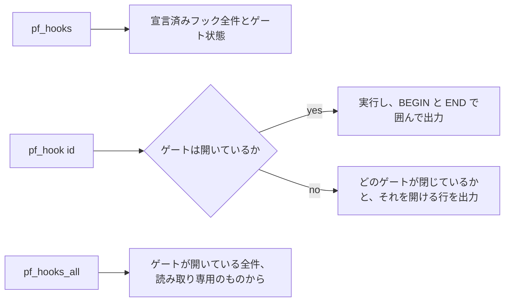

## このページでできるようになること

- 空いているキーを探し回らずに PalForge の計測を実行する
- どのコマンドがワールド、パル、タイトル画面を必要とするかを押す前に把握する
- UE4SS のコンソールを有効にし、「存在しない窓に登録された」状態を見分ける
- コンソールもキーもないときに、同じコマンドをテキストファイルから実行する

## コマンドの出どころ

すべてのコマンドは `palforge.test` の `ACTIONS` テーブルのエントリです。`installCommands` が
エントリごとにコンソールコマンドを 1 つ登録し、そのあと起動のたびに一覧をソートして出力します。
つまりこのログ行は、それが説明しているテーブルから生成されているので、内容がずれようがありません。

```text
console commands: pf_hook  pf_hook_audio_custom_file_loader  pf_hook_audio_setvolume_audible ...
```

ここから 3 つのことが従います。

- このページの名前は、執筆時点でテーブルが持っていたものです。**権威はログ行のほうです。**
  `UE4SS.log` を `console commands:` で検索してください。
- コマンドとキーは同じ関数への 2 つの入口です。`pf_reflect` と F5 は同じプローブを走らせます。
- `env.dev` が true でなければ何も存在しません。`palforge.test` モジュール全体が dev ゲートの下で
  しか require されないので、リリース配置には `pf_*` コマンドも F1 もプローブキーもありません。

コマンドの本体は `ExecuteInGameThread` でゲームスレッドにキューされます。触れる対象がすべてライブ
の UObject だからです。さらに `pcall` で包まれています。例外を投げるコマンドは、そうしないと
UE4SS のコンソールハンドラごと道連れにします。

## コンソールを有効にする

UE4SS はコンソールを無効にした状態で出荷されており、**コマンドを登録できることと、コマンドを打てる
ことは別です**。ハンドラは存在しない窓に対しても問題なく登録され、置き場所がないのにログは
`console commands: ...` と表示します。

```ini title="ue4ss/UE4SS-settings.ini"
ConsoleEnabled = 1
GuiConsoleEnabled = 1
GuiConsoleVisible = 1
```

編集後はゲームを再起動してください。PalForge からこのファイルは読めないので、これは検査ではなく
注記です。

## 一覧

37 のアクションを 4 グループに分けて示します。常時ある 18 個に加えて、`env.debug` が on のとき
宣言済みフック 1 つにつき 1 個が増えます。

| コマンド | 内容 |
| --- | --- |
| `pf_tests` | このモジュールが持つ全スイートを実行し、サマリーを画面に告知する |
| `pf_keys` | Palworld のライブなキー設定全体と、バインド可能な名前ごとの free/game/palforge 状態を出力する |
| `pf_native` | 各ネイティブカタログから名前でハンドルを取り、ゲームにアイコンを尋ねる |
| `pf_spawn` | パルを隣にスポーンさせ、10 秒後に実際に近くにいるものを報告する |
| `pf_teach` | 最も近いパルにパッシブスキルを与える |
| `pf_mesh` | カタログのアセットパスを全部解決し、同梱の木箱を目の前に 30 秒吊るす |
| `pf_uidecl` | 宣言したパネルをゲーム自身の UI ルートにマウントし、クリックを数える |
| `pf_uiroute` | Palworld 自身が UI・入力モード・Esc をどう扱うかを読み取り、実際の挙動を監視する |
| `pf_uiz` | パネル 3 枚同時: z 順、キールーティング、マウス側、レイヤー経路 |
| `pf_reflect` `pf_pal` `pf_watch` `pf_title` `pf_uislot` `pf_uievents` | 6 つの調査プローブ、キー 1 つずつ |
| `pf_hooks` `pf_hook <id>` `pf_hooks_all` | ゲームが必要なテストフック（後述） |
| `pf_hook_<id>` | 宣言済みフック 1 つにつき 1 つ生成される名前、全 19 件 |

どこかに貼ることを前提とした出力はブラケットで囲まれ、ログからそのまま抜き出せます。

```text
#### BEGIN keymap
... プローブが出力した全行 ...
#### END keymap
```

## 各コマンドが画面上に必要とするもの

必要なものが見つからないコマンドは、そう言って停止します。半分だけ黙って実行することはありません。

| コマンド | 必要なもの |
| --- | --- |
| `pf_tests` | なし。ただし全緑にするには 2 回必要（セーブ内で 1 回、タイトル画面で 1 回） |
| `pf_keys` | ロード済みのワールド。キー設定はワールドサブシステム上にあります |
| `pf_native` | ロード済みのワールド（アイコン DataTable の読み出しのため） |
| `pf_spawn` | ロード済みのワールド。パルの到着は 4〜8 秒後です |
| `pf_teach` | 近くに立っているパル。先に `pf_spawn` を走らせて待ってください |
| `pf_mesh` | プレイヤーのポーン。自前のコンポーネントを付け、30 秒後に破棄します |
| `pf_uidecl` `pf_uiz` | ロード済みのワールドと、ボタンをクリックする人 |
| `pf_uiroute` | ロード済みのワールド。そのあとインベントリを開き、Esc を 2 回押す |
| `pf_reflect` `pf_uislot` | ロード済みのセーブ |
| `pf_pal` | 近くに立っているパル |
| `pf_watch` | ロード済みのセーブ。そのあとクラフト、ドロップ、スポーンのいずれかを行う |
| `pf_title` | タイトル画面 |
| `pf_uievents` | ロード済みのセーブ。そのあとタイトルへ戻り、もう一度ロードする |

<Callout type="warn">
`pf_uiroute` と `pf_uievents` はネイティブフックを armし、UE4SS はフックを解除できません。以後
セッションが終わるまで残ります。arm されるハンドラはいずれもカウンタと保護付きの文字列読み取り
1 回だけで、サンプル数も数十件で打ち止めになります。
</Callout>

このうちいくつかはコマンドが戻ったあとも `core/poll` で監視を続けます。`pf_mesh` は 30 秒、
`pf_uidecl` は 75 秒、`pf_uiz` は 110 秒です。その間は **F9 のリロードが拒否され**、待っている
ポーラーの名前が出ます。これは非同期ガードが仕事をしている状態です。詳細は
[リロード・ポール・autorun](/docs/guides/dev-tooling) を参照してください。

## ゲームが必要なテストフック

19 の計測はゲームを起動しないと取れません。それぞれが `test/hooks/` 配下の宣言済みフックで、画面上
に何が必要か、セーブに書き込むか、どの未解決項目を閉じるかを自分で名乗ります。ロードされるのは
`env.debug` が true のときだけです。

```lua title="Scripts/palforge_dev.lua"
local env = require("palforge.env")
env.dev   = true
env.debug = true                              -- test/hooks をロードし、アクションを生成する
env.debugHooks["mesh-color-change"] = true    -- これは書き込むので、専用スイッチが要る
```

ゲートは 3 つあり、閉じているゲートは黙って飛ばされずに出力されます。

1. `env.debug` — これがないとフックファイルは 1 つもロードされません。
2. `needs = { world, player, pal, title }` — 動作中のゲームで成立している必要がある条件。
3. `writes = true` — 加えて `env.debugHooks[<id>] = true` が必要です。セーブを書き換えるものに
   対して、セッション全体のスイッチは粒度が合いません。



まず `pf_hooks` を走らせてください。全フックと、そのゲートが開いているか、閉じている場合それを
開ける正確な一文が並びます。必要なのはロード済みのワールドだけです。

## コンソールなしで実行する

実機では 3 つの入力経路が順に失敗しており、そのたびに作業自体は正しく、入口だけが欠けていました。
Palworld 自身の音量キー（F7）に置いたプローブはバインドに成功してキーが届かず、次のキーはすでに
使われており、コンソールは無効で出荷されていました。

`Scripts/palforge/autorun.txt` はそのどちらも要らない経路です。`world.ready` で、ワールドのロード
ごとに 1 回実行されます。

```text title="Scripts/palforge/autorun.txt"
# コメントと空行は無視される
pf_native            # ワールドが準備でき次第すぐ実行
8 pf_keys            # ワールド準備の 8 秒後に実行
40 pf_hook_pal_skills_equip
```

1 行は `[delay] name` であり、**引数を運びません**。だから `pf_hook <id>` はコンソール専用の綴りで
あり、代わりに宣言済みフックごとに `pf_hook_<id>` という名前が生成されます。ディスク上のテキスト
ファイルがゲームに言えることを 1 つ減らすためです。

遅延は見た目以上に重要です。パルの到着には 4〜8 秒かかるので、近くにパルが必要なアクションを、その
パルを作るスポーンと同時に走らせることはできません。

このファイルが持つのは**名前だけで、コードではありません**。各行は
`require("palforge.test").ACTIONS` で引かれ、存在しない名前は報告のうえスキップされます。

```lua
-- autorun が各行に対してすることを 1 式で書くと
local run = require("palforge.test").ACTIONS[name]
if not run then log.warn(name .. ": no action of that name") end
```

したがって、迷い込んだファイルがキー操作でできない何かを実行することはありませんし、書き込むフック
にはその上でさらに専用ゲートがあります。

## まとめ

- すべての計測は `palforge.test` の `ACTIONS` のエントリで、起動時のログ行が正式な一覧です。
- `env.dev` なしでは何も存在せず、ゲームが必要な 19 のフックにはさらに `env.debug` が要ります。
- UE4SS のコンソールは既定で無効です。設定 3 つと再起動が必要です。
- 各コマンドは画面上に必要なものを述べ、半端に実行するのではなく停止します。
- フックの前にまず `pf_hooks`。全ゲートと、閉じたゲートを開ける一文が出ます。
- `autorun.txt` は同じ名前をキーもコンソールもなしで実行します。1 行 1 つの `[delay] name` です。

<Cards>
  <Card title="リロード・ポール・autorun" href="/docs/guides/dev-tooling">F9、共有ハートビート、リロードが拒否される理由</Card>
  <Card title="テスト" href="/docs/guides/testing">pf_tests の背後にあるスイートと、スキップの意味</Card>
  <Card title="バニラアセット" href="/docs/guides/vanilla-assets">pf_mesh が何かを付ける前に解決するもの</Card>
</Cards>
