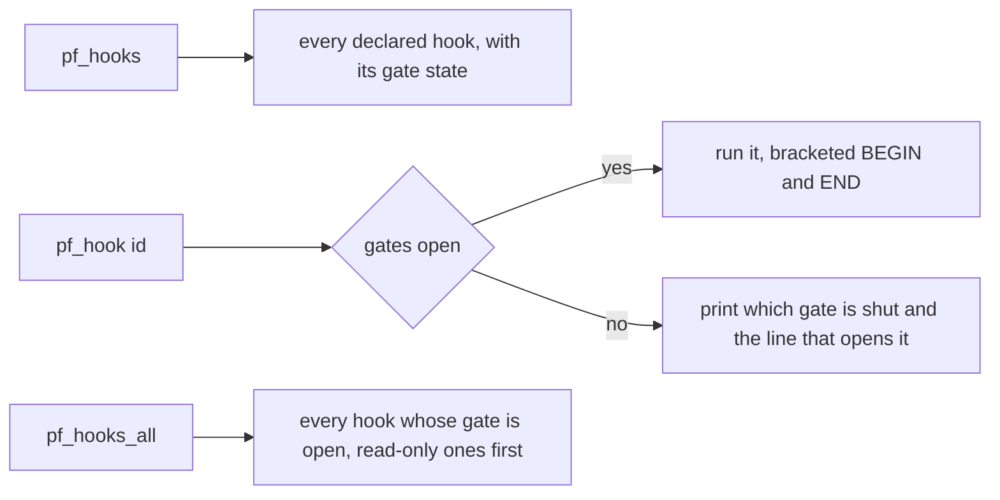

## What you can do after this page

- Run any PalForge measurement without hunting for a free key
- Find out which command needs a world, a pal, or the title screen before you press anything
- Turn UE4SS's console on, and recognise the case where it registered into a window that is not there
- Run the same commands from a text file when there is no console and no key

## Where the commands come from

Every command is an entry in `palforge.test`'s `ACTIONS` table. `installCommands` registers one
console command per entry and then prints the list, sorted, at every startup — so the log line is
generated from the table it describes and cannot drift from it.

```text
console commands: pf_hook  pf_hook_audio_custom_file_loader  pf_hook_audio_setvolume_audible ...
```

Three things follow from that:

- The names in this page are what the table held when it was written. **The log line is the
  authority.** Grep `UE4SS.log` for `console commands:`.
- A command and a key are two ways into the same function. `pf_reflect` and F5 run the same probe.
- Nothing here exists unless `env.dev` is true. The whole `palforge.test` module is only required
  under the dev gate, so a release deploy has no `pf_*` commands, no F1 and no probe keys.

The body of a command is queued onto the game thread through `ExecuteInGameThread`, because
everything it touches is a live UObject, and it is wrapped in a `pcall` — a command that raises
would otherwise take UE4SS's whole console handler down with it.

## Turning the console on

UE4SS ships with its console switched off, and **registering a command is not the same as being
able to type one**. The handler registers perfectly well into a window that does not exist, and
the log says `console commands: ...` while there is nowhere to put them.

```ini title="ue4ss/UE4SS-settings.ini"
ConsoleEnabled = 1
GuiConsoleEnabled = 1
GuiConsoleVisible = 1
```

Restart the game after editing it. PalForge cannot read that file, so it says this as a note
rather than checking it.

## The list

Thirty-one actions, in four groups.

| Command | What it does |
| --- | --- |
| `pf_tests` | run every suite the module owns, and announce the summary on screen |
| `pf_keys` | print Palworld's whole live key config, plus a free/game/palforge status per bindable name |
| `pf_native` | read a named handle out of each native catalog and ask the game for its icon |
| `pf_spawn` | spawn a pal beside you, then report 10 s later what is actually nearby |
| `pf_teach` | give the nearest pal a passive skill |
| `pf_mesh` | resolve every catalogued asset path, then hang a shipped chest in front of you for 30 s |
| `pf_uidecl` | mount a declared panel into the game's own UI root and count clicks on it |
| `pf_uiroute` | read what Palworld itself does with UI, input mode and Esc, then watch it happen |
| `pf_uiz` | three panels at once: z-order, key routing, the mouse half and the layer route |
| `pf_reflect` `pf_pal` `pf_watch` `pf_title` `pf_uislot` `pf_uievents` | the six discovery probes, one per key |
| `pf_hooks` `pf_hook <id>` `pf_hooks_all` | the game-required test hooks (see below) |
| `pf_hook_<id>` | one generated name per declared hook, thirteen of them |

Output that is meant to be pasted somewhere is bracketed, so it can be lifted straight out of the
log:

```text
#### BEGIN keymap
... every line the probe printed ...
#### END keymap
```

## What each one needs on screen

A command that needs something it cannot find says so and stops. It never runs half of itself
quietly.

| Command | Needs |
| --- | --- |
| `pf_tests` | nothing, but a green run is two runs — once in a save and once at the title screen |
| `pf_keys` | a loaded world: the key config lives on a world subsystem |
| `pf_native` | a loaded world, for the icon DataTable reads |
| `pf_spawn` | a loaded world; the pal arrives four to eight seconds later |
| `pf_teach` | a pal standing near you — run `pf_spawn` first and wait |
| `pf_mesh` | a player pawn; it attaches a component of its own and destroys it again at 30 s |
| `pf_uidecl` `pf_uiz` | a loaded world, and someone to click the button |
| `pf_uiroute` | a loaded world, then open the inventory and press Esc twice |
| `pf_reflect` `pf_uislot` | a loaded save |
| `pf_pal` | a pal standing near you |
| `pf_watch` | a loaded save, then craft, drop or spawn something |
| `pf_title` | the title screen |
| `pf_uievents` | a loaded save, then a quit to title and a reload |

<Callout type="warn">
`pf_uiroute` and `pf_uievents` arm native hooks, and UE4SS cannot unregister one. They stay for
the rest of the session. Every handler they arm is a counter plus one guarded string read, capped
at the first few dozen samples.
</Callout>

Several of these keep watching after the command returns, through `core/poll` — `pf_mesh` for
30 s, `pf_uidecl` for 75 s, `pf_uiz` for 110 s. While one is running, **F9 refuses to reload** and
names the poller it is waiting for. That is the async guard doing its job; see
[Reload, poll and autorun](/docs/guides/dev-tooling).

## The game-required hooks

Thirteen measurements cannot be taken with the game switched off. Each is a declared hook under
`test/hooks/`, naming what it needs on screen, whether it writes into a save, and which open item
it closes. They load only when `env.debug` is true.

```lua title="Scripts/palforge_dev.lua"
local env = require("palforge.env")
env.dev   = true
env.debug = true                              -- loads test/hooks and generates its actions
env.debugHooks["mesh-color-change"] = true    -- and this one WRITES, so it needs its own switch
```

Three gates, and a closed one is printed rather than skipped:

1. `env.debug` — without it no hook file is loaded at all.
2. `needs = { world, player, pal, title }` — what has to be true in the running game.
3. `writes = true` — additionally needs `env.debugHooks[<id>] = true`, because a session-wide
   switch is the wrong granularity for something that mutates a save.



Run `pf_hooks` first, always: it lists every hook, whether its gate is open, and the exact
sentence that opens a shut one. It needs nothing but a loaded world.

## Running one with no console at all

Three input routes have failed in turn on a real machine, and each time the work was fine and only
the way in was missing: a probe on Palworld's own volume key (F7) bound successfully and the key
never arrived; a second key was already taken; and the console ships switched off.

`Scripts/palforge/autorun.txt` is the route that needs neither. It runs once per world load, on
`world.ready`.

```text title="Scripts/palforge/autorun.txt"
# comments and blank lines are ignored
pf_native            # run as soon as the world is ready
8 pf_keys            # run 8 seconds after the world is ready
40 pf_hook_pal_skills_equip
```

A line is `[delay] name` and **carries no argument**. That is why `pf_hook <id>` is a console-only
spelling and why one `pf_hook_<id>` name is generated per declared hook instead — one less thing a
text file on disk can say to the game.

The delay matters more than it looks. A pal takes four to eight seconds to arrive, so an action
that needs one nearby cannot run in the same breath as the spawn that makes it.

The file holds **names, never code**. Each one is looked up in `require("palforge.test").ACTIONS`,
and a name that is not there is reported and skipped:

```lua
-- what autorun does with every line, in one expression
local run = require("palforge.test").ACTIONS[name]
if not run then log.warn(name .. ": no action of that name") end
```

So a stray file cannot execute anything a keypress could not, and a hook that writes still has its
own second gate on top.

## Summary

- Every measurement is an entry in `palforge.test`'s `ACTIONS`; the startup log line is the authoritative list.
- Nothing exists without `env.dev`, and the thirteen game-required hooks also need `env.debug`.
- UE4SS's console is off by default — three settings and a restart.
- Each command says what it needs on screen and stops rather than half-running.
- `pf_hooks` before any hook: it prints every gate and the sentence that opens a shut one.
- `autorun.txt` runs the same names with no key and no console, one `[delay] name` per line.

<Cards>
  <Card title="Reload, poll and autorun" href="/docs/guides/dev-tooling">F9, the shared heartbeat, and why a reload gets refused</Card>
  <Card title="Testing" href="/docs/guides/testing">The suites behind pf_tests and what a skip means</Card>
  <Card title="Vanilla assets" href="/docs/guides/vanilla-assets">What pf_mesh resolves before it attaches anything</Card>
</Cards>
