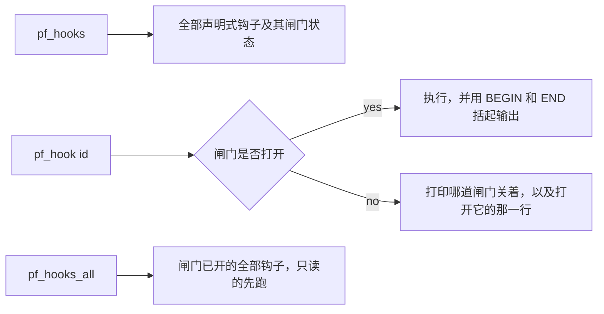

## 读完本页你可以做到

- 不用到处找空闲按键就能跑 PalForge 的任一项测量
- 在按下去之前就知道哪条命令需要世界、需要帕鲁，或者需要标题界面
- 打开 UE4SS 的控制台，并认出「注册进了一个并不存在的窗口」这种情况
- 在既没有控制台也没有按键时，用一个文本文件跑同样的命令

## 命令从哪里来

每条命令都是 `palforge.test` 的 `ACTIONS` 表里的一项。`installCommands` 为每一项注册一条控制台
命令，然后在每次启动时把这份清单排序打印出来——这行日志由它所描述的那张表生成，因此不可能与之
脱节。

```text
console commands: pf_hook  pf_hook_audio_custom_file_loader  pf_hook_audio_setvolume_audible ...
```

由此可以得出三点：

- 本页列出的名字是写作时表里的内容。**权威是那行日志。**在 `UE4SS.log` 里搜
  `console commands:`。
- 命令和按键是通往同一个函数的两个入口。`pf_reflect` 和 F5 跑的是同一个探针。
- `env.dev` 为 false 时这些都不存在。整个 `palforge.test` 模块只在 dev 闸门之下才被 require，所以
  发布版部署既没有 `pf_*` 命令，也没有 F1 和探针按键。

命令主体通过 `ExecuteInGameThread` 排进游戏线程，因为它触碰的全是活的 UObject；外面还包了一层
`pcall`——一条会抛异常的命令，否则会把 UE4SS 的整个控制台处理器一起带走。

## 打开控制台

UE4SS 出货时控制台是关的，而且**能注册命令和能敲命令是两回事**。处理器会顺利注册进一个并不存在
的窗口，日志照样打印 `console commands: ...`，只是没有地方输入。

```ini title="ue4ss/UE4SS-settings.ini"
ConsoleEnabled = 1
GuiConsoleEnabled = 1
GuiConsoleVisible = 1
```

改完之后重启游戏。PalForge 读不到这个文件，所以这只是一条说明，不是一次检查。

## 清单

三十一个动作，分四组。

| 命令 | 作用 |
| --- | --- |
| `pf_tests` | 跑该模块拥有的全部测试套件，并把汇总播报到屏幕上 |
| `pf_keys` | 打印幻兽帕鲁完整的实时按键配置，以及每个可绑定名字的 free/game/palforge 状态 |
| `pf_native` | 从每份原生目录里按名字取出句柄，并向游戏索要它的图标 |
| `pf_spawn` | 在你身边生成一只帕鲁，10 秒后报告身边实际有什么 |
| `pf_teach` | 给最近的帕鲁一个被动技能 |
| `pf_mesh` | 解析目录里所有资源路径，然后在你面前挂一个游戏自带的木箱，持续 30 秒 |
| `pf_uidecl` | 把声明式面板挂进游戏自己的 UI 根节点，并统计点击 |
| `pf_uiroute` | 读出幻兽帕鲁自己怎么处理 UI、输入模式和 Esc，然后盯着它发生 |
| `pf_uiz` | 同时三个面板：z 序、按键路由、鼠标那一半，以及图层路线 |
| `pf_reflect` `pf_pal` `pf_watch` `pf_title` `pf_uislot` `pf_uievents` | 六个探查探针，各占一个按键 |
| `pf_hooks` `pf_hook <id>` `pf_hooks_all` | 需要游戏在跑的测试钩子（见下文） |
| `pf_hook_<id>` | 每个声明式钩子生成一个名字，共十三个 |

准备贴到别处的输出会用标记括起来，可以直接从日志里整段拿走：

```text
#### BEGIN keymap
... 探针打印的每一行 ...
#### END keymap
```

## 每条命令在屏幕上需要什么

找不到所需条件的命令会说明并停下，绝不会安静地只跑一半。

| 命令 | 需要 |
| --- | --- |
| `pf_tests` | 无。但要全绿需要跑两次——存档里一次，标题界面一次 |
| `pf_keys` | 已加载的世界：按键配置挂在世界子系统上 |
| `pf_native` | 已加载的世界，用于图标 DataTable 读取 |
| `pf_spawn` | 已加载的世界；帕鲁在四到八秒后到达 |
| `pf_teach` | 身边站着一只帕鲁——先跑 `pf_spawn` 并等待 |
| `pf_mesh` | 玩家 Pawn；它会挂上自己的组件，并在 30 秒时销毁 |
| `pf_uidecl` `pf_uiz` | 已加载的世界，以及一个愿意点按钮的人 |
| `pf_uiroute` | 已加载的世界，然后打开背包、按两次 Esc |
| `pf_reflect` `pf_uislot` | 已加载的存档 |
| `pf_pal` | 身边站着一只帕鲁 |
| `pf_watch` | 已加载的存档，然后制作、丢弃或生成点什么 |
| `pf_title` | 标题界面 |
| `pf_uievents` | 已加载的存档，然后退回标题再重新读取 |

<Callout type="warn">
`pf_uiroute` 和 `pf_uievents` 会挂上原生钩子，而 UE4SS 无法解除钩子，它们会留到本次会话结束。它们
挂的每个处理器都只是一个计数器加一次受保护的字符串读取，并且在最初几十个样本之后就不再采样。
</Callout>

其中好几条在命令返回之后仍通过 `core/poll` 继续观察：`pf_mesh` 30 秒，`pf_uidecl` 75 秒，`pf_uiz`
110 秒。在这期间 **F9 会拒绝重载**，并点名它在等的那个轮询器。这是异步守卫在正常工作，详见
[重载、轮询与 autorun](/docs/guides/dev-tooling)。

## 需要游戏在跑的钩子

有十三项测量在游戏关着的时候取不到。每一项都是 `test/hooks/` 下的声明式钩子，自己写明屏幕上需要
什么、是否会写入存档、以及它关闭的是哪个未决项。它们只在 `env.debug` 为 true 时加载。

```lua title="Scripts/palforge_dev.lua"
local env = require("palforge.env")
env.dev   = true
env.debug = true                              -- 加载 test/hooks 并生成对应动作
env.debugHooks["mesh-color-change"] = true    -- 这一个会写入，所以需要它自己的开关
```

三道闸门，关着的那道会被打印出来而不是悄悄跳过：

1. `env.debug` —— 没有它，一个钩子文件都不会被加载。
2. `needs = { world, player, pal, title }` —— 运行中的游戏里必须成立的条件。
3. `writes = true` —— 还需要 `env.debugHooks[<id>] = true`，因为对于会改动存档的东西，会话级开关
   的粒度不对。



任何时候先跑 `pf_hooks`：它会列出每个钩子、闸门是否打开，以及打开一道关着的闸门所需的确切那句话。
它只需要一个已加载的世界。

## 完全没有控制台时怎么跑

在真实机器上，三条输入路径先后失败，而每一次工作本身都没问题，缺的只是入口：挂在幻兽帕鲁自己音量
键（F7）上的探针绑定成功却收不到按键；换的第二个键已经被占用；控制台则是出货即关闭。

`Scripts/palforge/autorun.txt` 是两者都不需要的那条路。它在 `world.ready` 时运行，每次载入世界跑
一遍。

```text title="Scripts/palforge/autorun.txt"
# 注释行和空行会被忽略
pf_native            # 世界就绪后立刻执行
8 pf_keys            # 世界就绪 8 秒后执行
40 pf_hook_pal_skills_equip
```

一行的格式是 `[delay] name`，而且**不携带参数**。这正是 `pf_hook <id>` 只存在于控制台的原因，也是
每个声明式钩子改为生成一个 `pf_hook_<id>` 名字的原因——让磁盘上的文本文件能对游戏说的话少一句。

延迟比看上去更要紧。一只帕鲁要四到八秒才到位，所以需要身边有帕鲁的动作，不能和生成它的那次 spawn
挤在同一口气里。

这个文件里装的是**名字，不是代码**。每一行都在 `require("palforge.test").ACTIONS` 里查表，查不到
的名字会被报告并跳过：

```lua
-- autorun 对每一行做的事，写成一个表达式
local run = require("palforge.test").ACTIONS[name]
if not run then log.warn(name .. ": no action of that name") end
```

所以一个乱入的文件不可能执行按键做不到的事，而会写入的钩子在此之上还有自己的第二道闸门。

## 小结

- 每一项测量都是 `palforge.test` 的 `ACTIONS` 里的一项；启动日志那一行才是权威清单。
- 没有 `env.dev` 就什么都不存在；十三个需要游戏的钩子还额外需要 `env.debug`。
- UE4SS 的控制台默认关闭——改三项设置并重启。
- 每条命令都会说明屏幕上需要什么，然后停下，而不是跑一半。
- 跑任何钩子之前先 `pf_hooks`：它打印每道闸门，以及打开关着那道所需的一句话。
- `autorun.txt` 不用按键也不用控制台就能跑同样的名字，一行一个 `[delay] name`。

<Cards>
  <Card title="重载、轮询与 autorun" href="/docs/guides/dev-tooling">F9、共享心跳，以及重载为什么会被拒绝</Card>
  <Card title="测试" href="/docs/guides/testing">pf_tests 背后的套件，以及一次跳过意味着什么</Card>
  <Card title="原版资源" href="/docs/guides/vanilla-assets">pf_mesh 在挂任何东西之前先解析什么</Card>
</Cards>
