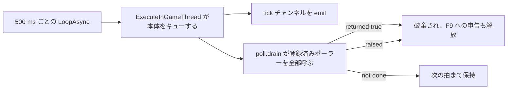

## このページでできるようになること

- Lua ファイルを編集し、動作中のゲームに 1 秒ほどで反映させる
- F9 で拾えない編集を把握し、押し続ける代わりに再起動を選ぶ
- F9 が拒否したときの理由を読み、自然に解けない場合に手で解除する
- 自前のタイマーをエンジンに要求せずに繰り返し処理を登録する
- キーもコンソールもなしで、ワールドのロードごとに名前付きアクションの列を実行する

## dev ゲート

ここに書いてあるものは `env.dev` が true でないと 1 つもロードされず、既定値は **false** です。
dev セッションでは、`tools/deploy.sh` が既定モードで配置先ツリーに書き込み `--release` では削除
する任意ファイルで有効化します。このファイルは gitignore されているので、リポジトリ経由で他人に
届くことはありません。

```lua title="Scripts/palforge_dev.lua"
local env = require("palforge.env")
env.dev   = true    -- dev キーバインド（F4 の全テクノロジー解放を含む）、F1、F9、プローブ群
env.debug = true    -- さらに test/hooks 配下の、ゲームが必要な 25 のテストフック
```

`env.dev` が off のとき、起動ログはその旨と、ロードされなかったものすべてを名指しします。これが
重要なのは、そもそもバインドされなかったキーと、バインドされたのに届かなかったキーが、外からは
まったく同じに見えるからです。

ゲートの下では 9 つのキーがバインドされます。F1（テストスイート）、F2 / F3 / F5 / F6 / F8 / F10
（6 つの調査プローブ）、F4（ロード中のセーブの全テクノロジーを確認なしで解放）、そして F9
（このページ）です。

## F9 が置き換えるもの

F9 は `package.loaded` からすべての `palforge.*` モジュールを落とし、カーネルを再実行します。api
モジュール、コンテンツパック、テストケース、プローブへの変更が 1 秒ほどで反映されます。

```text
[PalForge.reload][info] reloading N module(s)
[PalForge.reload][info] reloaded N module(s) - engine hooks kept from the first load
[PalForge.reload][warn] reload does NOT re-arm native hooks: a change inside an event source
                        needs a game RESTART to take effect. Everything else is live now.
```

`N` はキーを押した時点でロードされていた `palforge.*` モジュールの数で、そのセッションが何に触れて
きたかによって変わります。

ワイプをまたいで意図的に保持されるモジュールは 4 つです。`palforge.env`（リロードが反転させては
ならない dev トグルを持つ）、`palforge.utils.log`（リロード自体を報告する）、
`palforge.core.reload`（今まさに実行中のモジュール）、そして `palforge.core.object_manager` ——
登録済み定義をすべて保持しているレジストリです。最後の 1 つを残していることが、**パックのコンテンツ
が F9 を生き延びる**理由です。コンテンツパックは自分の require 名前空間を持つ別の UE4SS MOD なので
再 require されず、その定義呼び出しは二度と走りません。

リロードは素のグローバル（`Pal`、`Item`、`Building`、`Skill`、`Effect`、`Audio`、`Mesh`、`UI`、
`Player`）も消してから `registry.initialize()` を呼びます。api から消えたモジュールが古いグローバル
として残らないようにするためです。失敗した場合は古いモジュールが落ちたまま新しいモジュールが途中まで
ロードされた状態になり、それを大きな声で報告します。ファイルを直してもう一度押してください。

## リロードを生き延びるもの、リロードで取り消せないもの

UE4SS には、いったん存在した次の 3 つを取り消す手段がありません。素朴なリロードは押すたびに 2 つ目
を積み上げてしまいます。

| 呼び出し | 再 arm するとどうなるか |
| --- | --- |
| `RegisterHook` | すべてのハンドラが 2 回、次は 3 回走る |
| `LoopAsync` | 2 つ目のハートビートがすべてのティックを二重にする |
| `RegisterKeyBind` | エンジンは既存のバインドを保持したままになる |

そこでエンジンに面した層はセッションごとにちょうど 1 回だけ arm され、そのことが
`_G.__PalForgeArmed` に記録され、リロードはそこに手を出しません。キーバインドレジストリは、バインド
済みキーの関数を再バインドではなく**その場で差し替え**ます。だからリロードをまたいでキーが動き続け、
しかも新しいコードを指すのです。

同じ理由で 4 つの状態が `_G` に置かれています。新しい空テーブルを作ると、リロード前の片割れが誰とも
話していない状態になるからです。

```lua
_G.__PalForgeBus                -- ネイティブフックがすでに push しているイベントバス
_G.__PalForgeBuildingRegistry   -- 生きている建物インスタンスと、そこで発火するフック
_G.__PalForgeSpatialIndex       -- 各インスタンスの `_bucket` が指す近傍バケット
_G.__PalForgePollers            -- 唯一のハートビートが回す繰り返し処理
```

<Callout type="warn">
リロードはネイティブフックを arm し直しません。イベントソースの本体、つまり `core/event` 自身の
フックコールバックを編集しても、arm 済みフックの挙動は変わりません。`RegisterHook` は解除できず、
フックは作られたときのクロージャを走らせ続けるからです。これだけはゲームの再起動が必要です。
ハンドラ、定義、ディスパッチ、その他の通常モジュールは問題なくリロードされます。
</Callout>

リロードで取り消せないものがあと 2 つあります。生きている建物インスタンスは作成時のハンドラテーブル
を保持し続けるので、押す前に設置された構造物は再発見されるまで古い `onTick` を走らせます。そして
ポーラーは登録時のクロージャを走らせ続けます。これは消さずに報告されます。ポーラーは誰かが頼んだ
監視であり、黙って捨てればその答えが失われるからです。

## F9 が拒否するとき、そして解除のしかた

繰り返しコールバックが未完了のままリロードすると、UE4SS が保持している Lua レジストリ参照が関数と
して解決できなくなることがあり、UE4SS の反応はスキップではありません。

```text
[UE4SS.EngineTick.LuaModImpl] Hook threw exception:
  "[Lua::Registry::get_function_ref] Ref was not function", removing hook!
```

**エンジンティックフック**が外されます。この MOD のキーバインドはすべて本体を
`ExecuteInGameThread` の中で実行し、そのキューを回しているのがティックです。つまりゲームは何事も
なく動き続けたままキーだけが死にます。キーバインドの問題には見えず、再起動を要します。

そこで繰り返しコールバックをスケジュールするものは自分を申告し、未完了があるあいだ F9 は拒否します。
そのとき何をどれだけ待っているかを名指しします。

```text
[PalForge.reload][warn] reload REFUSED: 1 async chain(s) still outstanding: ui input dead-man
  (armed 41 s ago). Wait for them to print and press the key again. ...
[PalForge.reload][warn] no key clears this - asyncReset is bound to nothing. If it never clears
  by itself (it self-expires after 180 s), the Lua console line is:
  require('palforge.core.reload').asyncReset()
```

申告するものは 2 種類です。`test/probes/watch.lua` の 2 本の生チェーン（12 秒の設置読み戻しと
60 秒のウィンドウ集計）と、`core/poll` 経由で登録されたすべてのポーラーです。ポーラーの大半は数秒
です。ただし 1 つだけ違います。UI 入力デッドマンは PalForge のパネルがプレイヤーの入力を握っている
あいだ生き続けるので、パネルを開いたまま押した F9 は拒否され、そのポーラー名が出ます。

抜け道は 3 つあり、それがこの取引を受け入れられるものにしています。処理が自然に終わる、申告が
180 秒で自動失効する、あるいは Lua コンソールに `asyncReset()` を貼る、です。これにキーはなく、
作ることもできません。キーボード層が呼ぶのは `RegisterKeyBind(code, callback)` という修飾キー配列の
ない 2 引数形式なので、コードの構造上コード（和音）バインドに到達できません。

## core/poll: すべての監視が乗る 1 つのハートビート

このツリーではどの監視もタイマーを作りません。`core/event` がセッション全体で `LoopAsync` を
ちょうど 1 本、500 ms で arm して止めないので、ワールドを繰り返し見る必要があるものはすべて、その
ティックに呼んでもらう関数を登録します。



本体が `ExecuteInGameThread` でキューされるのは、ライブな UObject に触れるものにはゲームスレッドが
必要だと UE4SS が定めているからです。

```lua
local poll = require("palforge.core.poll")

poll.every("spawn arrival", function(elapsed, ticks)
    if found() then return true end   -- true は完了の意味: 自分を外す
    return elapsed >= 12              -- 諦める判断は時計で。ティック数では決してしない
end)
```

<Callout type="warn">
判定は `ticks` ではなく `elapsed` で行ってください。本体はキューされるので、ゲームスレッドが忙しい
と溜まってから一気に流れます。`ticks` は時間の進みではなくキューのはけ具合で進みます。実際の走行で
20 ティックの予算が 1 秒で尽き、まだ到着する時間のなかったスポーンを「いない」と報告しました。
</Callout>

すでに 16 本のポーラーが走っているとき、`poll.every` は false を返してログを残します。例外を投げた
ポーラーは、毎ティック例外を投げ続けさせる代わりに破棄して報告します。どちらの破棄経路でもリロード
ガードへの申告は解放され、`poll.clear()` でも同じです。

登録はそのポーラーの名前でガードを主張することでもあります。これは副作用ではなく意図した挙動です。
true を返さないポーラーがあるあいだ F9 は拒否し続け、拒否メッセージがどれなのかを言います。

## core/autorun: ファイルから名前を読む

`Scripts/palforge/autorun.txt` はキーもコンソールもなしで名前付きアクションを実行します。読まれるの
はワールドごとに 1 回、`world.ready` のときです。ワールドが存在し、プレイヤーのポーンが存在し、
キーボードにはまだ何も頼んでいない唯一の瞬間です。

```text title="Scripts/palforge/autorun.txt"
# コメントと空行は無視される
pf_native            # ワールドが準備でき次第すぐ実行
12 pf_teach          # ワールド準備の 12 秒後に実行
```

遅延は同じハートビートに乗ります。このファイルは自前のタイマーを作りません。1 行は
`[delay] name` で引数を運ばないので、フックランナー側は、このパーサに語を渡す機能を足す代わりに
フック 1 つにつきアクション名を 1 つ生成しています。

このファイルが持つのは**名前の一覧であり、コードではありません**。`core/autorun.lua` は `test/`
配下の名前を 1 つも書きません。`test/init.lua` の `install()` が
`autorun.setActions(M.ACTIONS)` でテーブルを渡し、各行は渡されたテーブルを引くだけで、一致しない
名前は報告のうえスキップされます。

```text
[PalForge.autorun][warn] autorun.txt: no action named "pf_typo" - the names are the pf_* commands
```

したがって、テスト面のどこかに登録されたコマンドは、存在した瞬間からここで実行可能になります。
`core/autorun.lua` の変更は不要です。そして `--release` が配置するようなテストツリーの無いコピーでは
テーブル自体が存在しないので、このキューは何のコストもない no-op になります。迷い込んだファイルが、
この MOD がキー操作でできないことを実行することもありません。セーブに書き込むフックには、その上でさらに専用ゲート
（`env.debugHooks[id]`）があり、この経路はそれを知りもしなければ迂回もできません。

ファイルの場所は、作業ディレクトリではなくモジュール自身のディスク上の位置
（`debug.getinfo(1, "S").source`）から求めます。UE4SS の作業ディレクトリは当てにできるものでは
ありません。ファイルがないのは通常の状態で、何も言いません。

## まとめ

- `env.dev` の既定は false で、有効化するのは `Scripts/palforge_dev.lua` です。
- F9 はすべての `palforge.*` モジュールを置き換え、4 つを保持します。レジストリを含むので自分のコンテンツは生き延びます。
- ネイティブフック、唯一の `LoopAsync`、バインド済みキーはセッションに 1 回 arm されます。イベントソース内部の変更には再起動が必要です。
- 繰り返し処理が未完了のあいだ F9 は拒否し、対象を名指しし、180 秒で自動失効するかコンソールから解除できます。
- 繰り返し処理は `poll.every(name, fn)` で書きます。判定は経過秒、`true` で終了、同時 16 本まで。
- `autorun.txt` は 1 行 `[delay] name` で、`test/init.lua` が `core/autorun` に渡した `ACTIONS` に照合され、ワールドのロードごとに 1 回走ります。

<Cards>
  <Card title="コンソールコマンド" href="/docs/guides/console-commands">pf_* の全名称と、画面上に必要なもの</Card>
  <Card title="テスト" href="/docs/guides/testing">F1 が何を走らせ、スキップが何を意味するか</Card>
  <Card title="ライフサイクル" href="/docs/concepts/lifecycle">ハートビートが駆動するチャンネル</Card>
</Cards>
