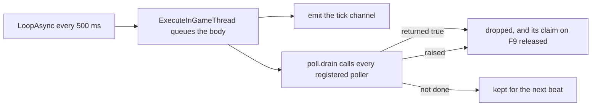

## What you can do after this page

- Edit a Lua file and see the change in a running game in about a second
- Know which of your edits F9 cannot pick up, so you stop pressing it and restart instead
- Read the refusal when F9 declines, and clear it when it does not clear itself
- Register repeated work without asking the engine for a timer of your own
- Run a queue of named actions on every world load with neither a key nor a console

## The dev gate

None of this loads unless `env.dev` is true, and it defaults to **false**. A dev session turns it
on through an optional file that `tools/deploy.sh` writes into the deployed tree in its default
mode and deletes under `--release`. It is gitignored, so it cannot travel through the repository.

```lua title="Scripts/palforge_dev.lua"
local env = require("palforge.env")
env.dev   = true    -- dev keybinds (including F4, unlock all technologies), F1, F9, the probes
env.debug = true    -- additionally: the nineteen game-required test hooks under test/hooks
```

With `env.dev` off the startup log says so in as many words, and names everything that did not
load. That matters because a key that was never bound and a key that was bound and never arrived
look identical from outside.

Under the gate, nine keys get bound: F1 (the test suites), F2 / F3 / F5 / F6 / F8 / F10 (the six
discovery probes), F4 (unlock every technology in the loaded save, no confirmation) and F9 (this
page).

## F9: what a reload replaces

F9 drops every `palforge.*` module from `package.loaded` and runs the kernel again. A change to an
api module, a content pack, a test case or a probe is live in about a second.

```text
[PalForge.reload][info] reloading N module(s)
[PalForge.reload][info] reloaded N module(s) - engine hooks kept from the first load
[PalForge.reload][warn] reload does NOT re-arm native hooks: a change inside an event source
                        needs a game RESTART to take effect. Everything else is live now.
```

`N` is however many `palforge.*` modules were loaded at the moment you pressed the key, which
depends on what your session has touched.

Four modules are deliberately kept across the wipe: `palforge.env` (it holds the dev toggle a
reload must not flip), `palforge.utils.log` (it is what reports the reload), `palforge.core.reload`
(it is the module currently running) and `palforge.core.object_manager` — the registry holding
every registered definition. Keeping that last one is what makes **a pack's content survive F9**:
a content pack is a separate UE4SS mod in its own require namespace, so it is never re-required and
its define calls never run again.

The reload also clears the bare globals (`Pal`, `Item`, `Building`, `Skill`, `Effect`, `Audio`,
`Mesh`, `UI`, `Player`) so a module that disappeared from the api cannot linger as a stale global,
then calls `registry.initialize()`. A failure leaves the old modules unloaded and the new ones
partly loaded, and says so loudly: fix the file and press the key again.

## What survives a reload, and what a reload cannot undo

UE4SS gives no way to take back three things once they exist, so a naive reload would stack a
second copy of each on every press:

| Call | If it were re-armed |
| --- | --- |
| `RegisterHook` | every handler would run twice, then three times |
| `LoopAsync` | a second heartbeat would double every tick |
| `RegisterKeyBind` | the engine keeps the binding it already has |

So the engine-facing layer is armed exactly once per session, recorded on `_G.__PalForgeArmed`,
and the reload leaves it alone. The keybind registry swaps a bound key's function **in place**
rather than binding again, which is what keeps the keys working across a reload while pointing at
the new code.

Four pieces of state live on `_G` for the same reason — a fresh empty table would leave the
pre-reload half of each pair talking to nobody:

```lua
_G.__PalForgeBus                -- the event bus a native hook already pushes into
_G.__PalForgeBuildingRegistry   -- live building instances, and the hooks that fire on them
_G.__PalForgeSpatialIndex       -- the neighbour buckets each instance's `_bucket` names
_G.__PalForgePollers            -- repeated work the one heartbeat drains
```

<Callout type="warn">
A reload does not re-arm native hooks. Editing the body of an event source — `core/event`'s own
hook callbacks — changes nothing about what the armed hook does, because a `RegisterHook` cannot be
unregistered and the hook keeps running the closure it was created with. That one needs a game
restart. Handlers, definitions, dispatch and every ordinary module reload fine.
</Callout>

Two more things a reload does not undo. A live building instance keeps the handler table it was
created with, so a structure placed before the press runs the old `onTick` until it is
rediscovered. And a poller keeps running the closure it was registered with — which the reload
reports rather than clears, because a poller is a watch somebody asked for and dropping it silently
would lose the answer.

## When F9 refuses, and how to clear it

Reloading while a repeating callback is outstanding can leave UE4SS holding a Lua registry
reference that no longer resolves to a function, and its response is not to skip it:

```text
[UE4SS.EngineTick.LuaModImpl] Hook threw exception:
  "[Lua::Registry::get_function_ref] Ref was not function", removing hook!
```

It removes the **engine tick hook**. Every keybind in this mod runs its body inside
`ExecuteInGameThread`, and that queue is drained by the tick — so the keys go dead while the game
carries on perfectly well, which does not look like a keybind problem and costs a restart.

So anything that schedules a repeating callback declares itself, and F9 refuses while any are
outstanding, naming each one and how long it has been waiting:

```text
[PalForge.reload][warn] reload REFUSED: 1 async chain(s) still outstanding: ui input dead-man
  (armed 41 s ago). Wait for them to print and press the key again. ...
[PalForge.reload][warn] no key clears this - asyncReset is bound to nothing. If it never clears
  by itself (it self-expires after 180 s), the Lua console line is:
  require('palforge.core.reload').asyncReset()
```

Two kinds of thing declare themselves: `test/probes/watch.lua`'s two raw chains (a 12 s placement
readback and a 60 s window summary), and every poller registered through `core/poll`. Most pollers
are seconds long. One is not — the UI input dead-man runs for as long as a PalForge panel holds the
player's input — so an F9 pressed with a panel open is refused and names it.

There are three ways out, which is what makes the trade acceptable: the work finishes on its own,
the claim self-expires after 180 s, or you paste `asyncReset()` into the Lua console. There is no
key for it and there cannot be one: the keyboard layer calls `RegisterKeyBind(code, callback)`,
the two-argument form with no modifier array, so a chord is unreachable by construction rather than
merely unbound.

## core/poll: one heartbeat for every watch

No watch in this tree creates a timer. `core/event` arms exactly one `LoopAsync` for the whole
session at 500 ms and never stops it, and everything that needs to look at the world repeatedly
registers a function for that tick to call.



The body is queued through `ExecuteInGameThread` because UE4SS requires the game thread for
anything that touches a live UObject.

```lua
local poll = require("palforge.core.poll")

poll.every("spawn arrival", function(elapsed, ticks)
    if found() then return true end   -- true means DONE: drop me
    return elapsed >= 12              -- give up on the CLOCK, never on a tick count
end)
```

<Callout type="warn">
Bound on `elapsed`, not on `ticks`. Because the bodies are queued, they pile up when the game
thread is busy and then drain in a burst: `ticks` advances as fast as the queue empties, not as
fast as time passes. A live run spent a twenty-tick budget in one second and reported a spawn
missing that had not had time to arrive.
</Callout>

`poll.every` returns false and logs when 16 pollers are already running. A poller that raises is
dropped and reported rather than left to raise once per tick forever. Both drop paths release the
poller's claim on the reload guard, and so does `poll.clear()`.

Registering also claims that guard in the poller's name, which is the intended behaviour rather
than a side effect: a poller that never returns true keeps F9 refusing, and the refusal says which
one.

## core/autorun: names from a file

`Scripts/palforge/autorun.txt` runs named actions with no key and no console. It is read once per
world, on `world.ready`, which is the one moment the world exists, the player pawn exists and
nothing has been asked of the keyboard.

```text title="Scripts/palforge/autorun.txt"
# comments and blank lines are ignored
pf_native            # run as soon as the world is ready
12 pf_teach          # run 12 seconds after the world is ready
```

The delay rides the same heartbeat; this file creates no timer of its own. A line is
`[delay] name` and carries no argument, which is why the hook runner generates one action name per
hook instead of teaching this parser to pass words through.

The file holds **a list of names, never code**. Each is looked up in
`require("palforge.test").ACTIONS`, and a name with no match is reported and skipped:

```text
[PalForge.autorun][warn] autorun.txt: no action named "pf_typo" - the names are the pf_* commands
```

So a command registered anywhere in the test surface is runnable from here the moment it exists,
with no change in `core/autorun.lua` — and a stray file cannot execute anything the mod does not
already do on a keypress. A hook that writes into a save still carries its own second gate
(`env.debugHooks[id]`), which this route neither knows about nor can bypass.

The file is found from the module's own location on disk (`debug.getinfo(1, "S").source`), not from
the working directory, which is not something to rely on under UE4SS. A missing file is the normal
case and says nothing.

## Summary

- `env.dev` is false by default; `Scripts/palforge_dev.lua` is what turns the tooling on.
- F9 replaces every `palforge.*` module and keeps four, including the registry — so your content survives it.
- Native hooks, the one `LoopAsync` and bound keys are armed once per session; a change inside an event source needs a restart.
- F9 refuses while repeated work is outstanding, names it, and self-clears after 180 s or from the console.
- `poll.every(name, fn)` is how repeated work is written: bound on elapsed seconds, `true` to retire, 16 at once.
- `autorun.txt` is `[delay] name` per line, resolved against `palforge.test`'s `ACTIONS`, once per world load.

<Cards>
  <Card title="Console commands" href="/docs/guides/console-commands">Every pf_* name and what it needs on screen</Card>
  <Card title="Testing" href="/docs/guides/testing">What F1 runs and what a skip means</Card>
  <Card title="Lifecycle" href="/docs/concepts/lifecycle">The channels the heartbeat drives</Card>
</Cards>
