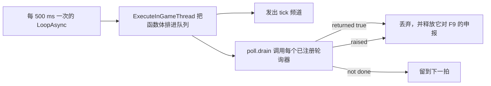

## 读完本页你可以做到

- 改一个 Lua 文件，大约一秒后就在运行中的游戏里看到效果
- 知道哪些改动 F9 拿不到，从而不再反复按键而是直接重启
- 读懂 F9 拒绝时给出的理由，并在它自己解不开时手动清掉
- 注册重复执行的工作，而不必向引擎再要一个定时器
- 在每次载入世界时跑一串具名动作，既不用按键也不用控制台

## dev 闸门

这里写的一切，只有在 `env.dev` 为 true 时才会加载，而它默认是 **false**。开发会话通过一个可选文件
打开它：`tools/deploy.sh` 在默认模式下把该文件写进部署目录，加 `--release` 时删除它。这个文件被
gitignore，所以不可能顺着仓库传给别人。

```lua title="Scripts/palforge_dev.lua"
local env = require("palforge.env")
env.dev   = true    -- dev 按键（含 F4：解锁全部科技）、F1、F9、各个探针
env.debug = true    -- 另外加载 test/hooks 下那十三个需要游戏在跑的测试钩子
```

`env.dev` 关闭时，启动日志会明确这么说，并点名所有没有加载的东西。这一点很重要：从外面看，一个从
未被绑定的按键和一个绑定了却收不到的按键完全一样。

在闸门之下会绑定九个键：F1（测试套件）、F2 / F3 / F5 / F6 / F8 / F10（六个探查探针）、F4（无确认地
解锁当前存档的全部科技），以及 F9（本页主题）。

## F9 会替换掉什么

F9 把所有 `palforge.*` 模块从 `package.loaded` 里丢掉，然后重新跑一遍内核。对 api 模块、内容包、
测试用例或探针的修改，大约一秒后就生效。

```text
[PalForge.reload][info] reloading N module(s)
[PalForge.reload][info] reloaded N module(s) - engine hooks kept from the first load
[PalForge.reload][warn] reload does NOT re-arm native hooks: a change inside an event source
                        needs a game RESTART to take effect. Everything else is live now.
```

`N` 是你按下按键那一刻已加载的 `palforge.*` 模块数量，取决于这次会话碰过些什么。

有四个模块会被有意保留：`palforge.env`（它拿着重载不得翻动的 dev 开关）、`palforge.utils.log`
（它负责报告这次重载）、`palforge.core.reload`（它就是当前正在运行的模块），以及
`palforge.core.object_manager`——保存着全部已注册定义的注册表。保留最后这一个，正是**包里的内容能
熬过 F9** 的原因：内容包是拥有自己 require 命名空间的另一个 UE4SS mod，不会被重新 require，它的
定义调用也不会再跑一遍。

重载还会清掉那些裸全局（`Pal`、`Item`、`Building`、`Skill`、`Effect`、`Audio`、`Mesh`、`UI`、
`Player`），免得某个已从 api 消失的模块留下一个过期全局，然后调用 `registry.initialize()`。失败时
旧模块已卸载、新模块只加载了一半，它会大声说出来：改好文件，再按一次。

## 什么能熬过重载，什么重载撤不掉

UE4SS 没有办法收回下面三样东西，所以一次朴素的重载每按一次就会叠一份：

| 调用 | 若重新挂一次 |
| --- | --- |
| `RegisterHook` | 每个处理器会跑两遍，再按就三遍 |
| `LoopAsync` | 第二条心跳会让每个 tick 翻倍 |
| `RegisterKeyBind` | 引擎保留它已有的绑定 |

因此面向引擎的那一层每个会话只挂一次，用 `_G.__PalForgeArmed` 记下来，重载不去碰它。按键注册表会
**原地替换**已绑定按键的函数，而不是再绑一次——这正是按键能跨越重载继续工作、同时指向新代码的原因。

出于同样的理由，有四份状态放在 `_G` 上；换成一张新的空表，会让重载前的那一半对着空气说话：

```lua
_G.__PalForgeBus                -- 原生钩子已经在往里推的事件总线
_G.__PalForgeBuildingRegistry   -- 活着的建筑实例，以及在它们身上触发的钩子
_G.__PalForgeSpatialIndex       -- 每个实例的 `_bucket` 所指向的邻居桶
_G.__PalForgePollers            -- 那唯一一条心跳负责排空的重复工作
```

<Callout type="warn">
重载不会重新挂原生钩子。改动事件源的函数体——也就是 `core/event` 自己的钩子回调——不会改变已挂钩子
的行为，因为 `RegisterHook` 无法解除，钩子会一直跑它被创建时的那个闭包。这一类改动需要重启游戏。
处理器、定义、分发以及其他普通模块都能正常重载。
</Callout>

还有两件事重载撤不掉。活着的建筑实例保留它创建时拿到的处理器表，所以按键之前放下的建筑会继续跑旧的
`onTick`，直到被重新发现为止。轮询器也会继续跑它注册时的那个闭包——这一点会被报告而不是清除，因为
轮询器是有人要的一次观察，悄悄丢掉就等于丢掉它要给出的答案。

## F9 什么时候拒绝，以及怎么清掉

在还有重复回调未完成时重载，可能让 UE4SS 手里的 Lua 注册表引用解析不出函数，而它的反应不是跳过：

```text
[UE4SS.EngineTick.LuaModImpl] Hook threw exception:
  "[Lua::Registry::get_function_ref] Ref was not function", removing hook!
```

它会摘掉**引擎 tick 钩子**。本 mod 的每个按键都在 `ExecuteInGameThread` 里执行自己的函数体，而那条
队列正是由 tick 排空的——于是游戏一切照常，按键却死了。这看起来完全不像按键的问题，代价是一次重启。

所以任何要排一个重复回调的东西都会先申报自己，只要还有未完成的，F9 就拒绝，并点名每一项以及它已经
等了多久：

```text
[PalForge.reload][warn] reload REFUSED: 1 async chain(s) still outstanding: ui input dead-man
  (armed 41 s ago). Wait for them to print and press the key again. ...
[PalForge.reload][warn] no key clears this - asyncReset is bound to nothing. If it never clears
  by itself (it self-expires after 180 s), the Lua console line is:
  require('palforge.core.reload').asyncReset()
```

会申报的有两类：`test/probes/watch.lua` 的两条原始链（12 秒的放置回读和 60 秒的窗口汇总），以及
每一个通过 `core/poll` 注册的轮询器。大多数轮询器只有几秒，但有一个不是——UI 输入守死器会一直活到
PalForge 面板放开玩家输入为止，所以开着面板按 F9 会被拒绝，并被点名。

出口有三个，这正是这笔交易可以接受的原因：工作自己跑完、申报在 180 秒后自动过期，或者把
`asyncReset()` 粘进 Lua 控制台。它没有按键，也不可能有：键盘层调用的是
`RegisterKeyBind(code, callback)` 这个不带修饰键数组的两参数形式，所以组合键在结构上就到不了，而不
只是没绑。

## core/poll：所有观察共用一条心跳

本仓库里没有任何一次观察会自己建定时器。`core/event` 为整个会话只挂一条 `LoopAsync`，周期 500 ms，
并且永不停止；所有需要反复看世界的东西，都注册一个函数交给这次 tick 去调用。



函数体之所以要经 `ExecuteInGameThread` 排队，是因为 UE4SS 要求凡是碰活 UObject 的事都在游戏线程上做。

```lua
local poll = require("palforge.core.poll")

poll.every("spawn arrival", function(elapsed, ticks)
    if found() then return true end   -- true 表示完成：把我摘掉
    return elapsed >= 12              -- 放弃要看时钟，绝不看 tick 计数
end)
```

<Callout type="warn">
判断依据是 `elapsed` 而不是 `ticks`。因为函数体是排队执行的，游戏线程一忙它们就堆积，然后一口气排
空：`ticks` 的推进速度取决于队列排空多快，而不是时间过了多久。一次实机运行里，二十个 tick 的预算在
一秒内就用光，并报告说一只还没来得及到场的帕鲁不存在。
</Callout>

当已经有 16 个轮询器在跑时，`poll.every` 返回 false 并写日志。抛异常的轮询器会被丢弃并报告，而不是
留着每个 tick 抛一次直到日志被刷爆。两条丢弃路径都会释放该轮询器对重载守卫的申报，`poll.clear()`
也一样。

注册同时也意味着以该轮询器的名义占住守卫，这是有意为之而非副作用：一个永远不返回 true 的轮询器会让
F9 一直拒绝，而拒绝信息会说出是哪一个。

## core/autorun：从文件里读名字

`Scripts/palforge/autorun.txt` 不用按键也不用控制台就能跑具名动作。它在 `world.ready` 时读取，每个
世界读一次——那是世界已存在、玩家 Pawn 已存在、而键盘还没被要求做任何事的唯一时刻。

```text title="Scripts/palforge/autorun.txt"
# 注释行和空行会被忽略
pf_native            # 世界就绪后立刻执行
12 pf_teach          # 世界就绪 12 秒后执行
```

延迟同样搭那条心跳，这个文件不建自己的定时器。一行是 `[delay] name`，不携带参数，这也是钩子运行器
为每个钩子生成一个动作名、而不是让这个解析器学会传词的原因。

文件里装的是**一串名字，不是代码**。每一个都在 `require("palforge.test").ACTIONS` 里查，查不到的会
被报告并跳过：

```text
[PalForge.autorun][warn] autorun.txt: no action named "pf_typo" - the names are the pf_* commands
```

于是测试面里任何地方注册的命令，从它存在的那一刻起就能从这里跑，不需要改 `core/autorun.lua`；而一个
乱入的文件也不可能执行这个 mod 按键做不到的事。会写入存档的钩子在此之上还有自己的第二道闸门
（`env.debugHooks[id]`），这条路径既不知道它，也绕不过它。

文件的位置来自模块自己在磁盘上的位置（`debug.getinfo(1, "S").source`），而不是工作目录——UE4SS 的
工作目录不是可以依赖的东西。文件不存在是正常情况，它什么也不说。

## 小结

- `env.dev` 默认为 false，打开它的是 `Scripts/palforge_dev.lua`。
- F9 替换所有 `palforge.*` 模块并保留四个，其中包括注册表，所以你的内容能活下来。
- 原生钩子、那唯一一条 `LoopAsync` 和已绑定按键每个会话只挂一次；事件源内部的改动需要重启。
- 只要还有重复工作未完成，F9 就拒绝并点名，180 秒后自动过期，也可以从控制台清掉。
- 重复工作用 `poll.every(name, fn)` 写：按经过秒数判断，返回 `true` 退场，同时最多 16 个。
- `autorun.txt` 每行一个 `[delay] name`，对照 `palforge.test` 的 `ACTIONS` 解析，每次载入世界跑一遍。

<Cards>
  <Card title="控制台命令" href="/docs/guides/console-commands">全部 pf_* 名称，以及它们在屏幕上需要什么</Card>
  <Card title="测试" href="/docs/guides/testing">F1 跑的是什么，一次跳过意味着什么</Card>
  <Card title="生命周期" href="/docs/concepts/lifecycle">心跳驱动的那些频道</Card>
</Cards>
