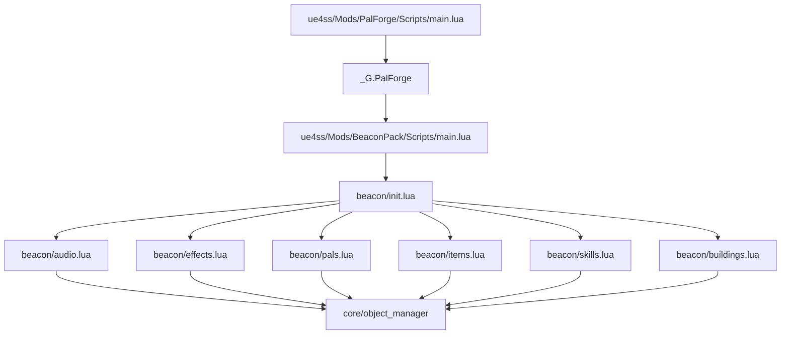
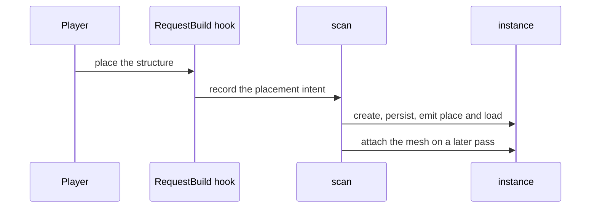
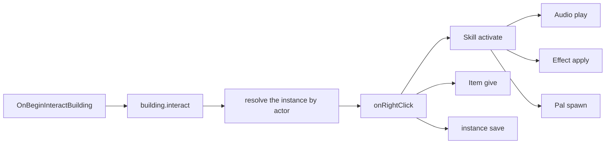

## 作るもの

**BeaconPack** という名前のパックです。ビルドメニューにある構造物をひとつ受け持ち、そこに
振る舞いを与えます。

- ビーコンを調べるとクールダウン 30 秒のスキルが発動し、
- スキルは調べたキャラクターに効果音を鳴らし、
- 12 秒間・最大 3 スタックのエフェクトを付与し、
- ビーコンの位置に守護パルを呼び出します。
- ビーコン自身はアイテムを配り、使用回数を数え、チャージを 1 消費し、その値をワールド
  ファイルに保存します。
- ハートビートのハンドラーが、離れているあいだにチャージを回復させます。

これで Building・Skill・Audio・Effect・Pal・Item のすべてに触れることになります。しかも
パック全体は独立した UE4SS モッドで、同じセッションに読み込まれている PalForge を再利用
します。

始める前の前提です。

- PalForge がインストールされ、読み込まれていること。`ue4ss/Mods/PalForge/Scripts/main.lua`
  が動き、UE4SS コンソールに `[PalForge.main][info] ready` が出ていれば問題ありません。
- `Pal.Handle:spawn` は `UPalCheatManager` を経由するため、パルを呼ぶにはそのセッションで
  チートマネージャーが利用できる必要があります（CheatManagerEnabler モッド）。無い場合は
  警告をログに出して `false` を返すだけで、パックの他の部分はそのまま動きます。
- `Item.Handle:give` にチートマネージャーは不要です。インベントリ自身の
  `AddItem_ServerInternal` を通ります。

<Callout type="info">
Lua だけで新しい DataTable の行を追加することはできません。`Building{ id = "Altar" }` は
**既存の**構造物に振る舞いとメタデータを与えるものであり、新しいビルドオブジェクト・
アイテム・生物の行を publish するのは PalSchema の仕事です。そのため以下のパックは実在の
ゲーム内 id を使います。自分の行に切り替えるときに変わるのは 1 行だけで、それは「応用」の
セクションで示します。
</Callout>

## パックの構成

パックは、PalForge と同じく `Scripts/main.lua` を持つ独立した UE4SS モッドフォルダーです。

```text
ue4ss/Mods/BeaconPack/
    enabled.txt              <- UE4SS's own switch for this mod folder
    Scripts/
        main.lua             <- the entry point UE4SS runs
        beacon/
            init.lua         <- requires every domain module, in dependency order
            audio.lua        <- the sounds
            effects.lua      <- the blessing
            pals.lua         <- the guardian
            items.lua        <- the reward
            skills.lua       <- the signal: sound + blessing + guardian
            buildings.lua    <- the beacon itself
```

モッドフォルダーを有効化するのがフォルダー内の `enabled.txt` なのか `mods.txt` の記述なのか
は UE4SS 側の話で、PalForge は関知しません。ここで重要なのはその下の形、つまり 1 ドメイン
1 ファイルと、それらを require する `init.lua` です。

PalForge の `main.lua` は最後に自分自身を公開します。

```lua
_G.PalForge = {
    env    = env,                       -- { dev, name, version }
    api    = require("palforge.api"),   -- Pal, Item, Building, Skill, Effect, Audio, Mesh, UI, Player
    utils  = { log, json, file, items },
    core   = { registry, event, object_manager, spawn, mesh, sound, player, spatial, icons },
    native = require("palforge.native"),
}
```

パックはこのテーブルを読みます。2 つのモッドのあいだの契約はこれがすべてです。`api` が
コンテンツを書く相手、`utils.log` がロガー、`core.event` がバス、`native` が Palworld 自身の
コンテンツをカタログにしたものです。



登録という別の手順はありません。`X{ ... }` の呼び出しが実行された時点で定義が
`object_manager` に書き込まれるので、**モジュールを require することがコンテンツの登録**
そのものです。

## パックを作る

<Steps>

<Step>

### モッドフォルダーを作る

`ue4ss/Mods/BeaconPack/Scripts/beacon/` を作り、UE4SS の流儀でモッドを有効化します。他に
必要なものはありません。パックにマニフェストもディスクリプターもビルド手順もありません。

</Step>

<Step>

### エントリーポイントを書く

`main.lua` がするのは 3 つだけです。自分の `Scripts` ディレクトリーを `package.path` に
足すこと、PalForge が存在するか確かめること、パックを require することです。中身は薄く
保ちます。コンテンツはモジュール側の仕事です。

```lua title="ue4ss/Mods/BeaconPack/Scripts/main.lua"
-- BeaconPack — a PalForge content pack, running as its own UE4SS Lua mod.
--
-- Install layout (mirrors PalForge's own):
--   ue4ss/Mods/BeaconPack/Scripts/main.lua      <- this file
--   ue4ss/Mods/BeaconPack/Scripts/beacon/*.lua  <- the pack's modules

-- Make require() resolve beacon.* relative to this Scripts dir.
local thisDir = debug.getinfo(1, "S").source:match("@?(.*[\\/])") or ""
package.path = thisDir .. "?.lua;" .. thisDir .. "?\\init.lua;" .. package.path

-- PalForge publishes itself on _G.PalForge at the end of its own main.lua.
local forge = _G.PalForge
if not forge then
    pcall(print, "[BeaconPack] PalForge is not loaded - this pack does nothing this session")
    return
end

local log = forge.utils.log.scope("beacon")
log.info("loading against PalForge v" .. tostring(forge.env.version))

local ok, err = pcall(function() require("beacon") end)
if not ok then
    log.err("load failed: " .. tostring(err))
else
    log.info("loaded")
end
```

`forge.utils.log.scope("beacon")` は `info` / `warn` / `err` を持つテーブルを返し、それぞれ
メッセージを **1 つ**受け取ります。出力される行はすべて `[PalForge.beacon]` とログレベル
（`[PalForge.beacon][info]`、`[PalForge.beacon][warn]`、`[PalForge.beacon][err]`）で始まる
ので、フレームワーク本体と同じやり方でパックのログを絞り込めます。

<Callout type="warn">
`_G.PalForge` は PalForge が動いている Lua ステートのグローバルです。これを読むパックは、
同じステートに、かつ PalForge より後に読み込まれる必要があります。上のガードがエラーに
せずそのまま抜けるのはそのためです。ガードが発動する場合は、2 つのモッドフォルダーの
読み込み順を確認してください。
</Callout>

</Step>

<Step>

### パックのインデックスを書く

1 ドメインにつき 1 つの require を、依存順に並べます。スキルは効果音・エフェクト・守護パルを
使い、建築はスキルと報酬アイテムを使います。

```lua title="Scripts/beacon/init.lua"
-- beacon — the pack's modules, one per domain, required in dependency order.
-- Requiring a module IS registering its content: every X{ ... } call inside runs on
-- require and writes the definition into PalForge's object_manager.
local M = {}

M.audio     = require("beacon.audio")      -- the sound the beacon plays
M.effects   = require("beacon.effects")    -- the blessing it hands out
M.pals      = require("beacon.pals")       -- the guardian it calls
M.items     = require("beacon.items")      -- the reward it pays out
M.skills    = require("beacon.skills")     -- the signal: sound + blessing + guardian
M.buildings = require("beacon.buildings")  -- the structure the player interacts with

return M
```

</Step>

<Step>

### 効果音を宣言する

`Audio` にライフサイクルはありません。鳴らすものです。定義では Wwise の `AkAudioEvent` を
2 通りで指定します。実際に再生されるのは `soundPath`、`soundId` は SoundID 経由の
フォールバックです。

```lua title="Scripts/beacon/audio.lua"
-- beacon.audio — the sounds this pack plays.
local api   = _G.PalForge.api
local log   = _G.PalForge.utils.log.scope("beacon.audio")
local Audio = api.Audio

local M = {}

-- The beacon's activation sound, named by the pack. Both fields point at the SAME event;
-- the pair is copied out of PalForge's AkAudioEvent catalog (native.audio.CATALOG).
M.Signal = Audio.se{
    id          = "beacon:Signal",
    name        = "Beacon Signal",
    description = "Played on the interacting character when the beacon fires.",
    soundId     = "AKE_BuffAura",
    soundPath   = "/Game/Pal/Sound/Events/SE/System/StatusCondition/AKE_BuffAura.AKE_BuffAura",
}

-- The same thing, looked up by name instead of typed out: native.audio.se returns a ready
-- handle for any catalog name, and nil for a name the catalog does not have.
M.Reward = _G.PalForge.native.audio.se("AKE_CampLevelUp")
if not M.Reward then log.warn("AKE_CampLevelUp is not in the AkAudioEvent catalog") end

return M
```

`Audio.se` と `Audio.bgm` は `kind` を固定しただけの同じコンストラクターです。`kind` は説明
用の値で、ネイティブの再生ルートは BGM も SE も同じ呼び出しです。

<Callout type="warn">
このドメインには継ぎ目が 2 つあります。`Handle:setVolume` は未実装で `false` を返します。
`soundFile`（独自の音声ファイル）は解決はされますが何もしません。確認できた `USoundWave`
のローダーが無いためです。`Handle:stop` も音単位ではなく、そのアクターで再生中のものを
すべて止めます。
</Callout>

</Step>

<Step>

### エフェクトを宣言する

エフェクトのスケジュールは本物です。`:apply(target)` は実際の適用を開始し、PalForge が共有
ハートビート（500 ms）で、期限切れか削除まで進行させます。

```lua title="Scripts/beacon/effects.lua"
-- beacon.effects — the blessing the beacon hands out.
local api    = _G.PalForge.api
local log    = _G.PalForge.utils.log.scope("beacon.effects")
local Effect = api.Effect
local Item   = api.Item

local M = {}

-- 12 seconds long, ticking every 3, up to 3 stacks. The timing is owned by PalForge; the
-- gameplay is owned by these handlers.
M.Blessing = Effect{
    id          = "beacon:Blessing",
    name        = "Beacon Blessing",
    description = "A short blessing granted by the beacon.",
    duration    = 12.0,
    interval    = 3.0,
    stackable   = true,
    maxStacks   = 3,
    events = {
        onApply = function(effect, target, ctx)
            -- ctx carries effect and stacks, plus whatever you passed to :apply.
            log.info("blessing applied by " .. tostring(ctx.source))
        end,
        onStack = function(effect, target, ctx)
            log.info("blessing stacked to " .. tostring(ctx.stacks))
        end,
        onTick = function(effect, target, ctx)
            -- One berry per tick, scaled by the stack count. ctx.elapsed is how long this
            -- application has been alive, in seconds.
            Item.get("Berries"):give(ctx.stacks)
            log.info(string.format("blessing tick at %.1fs", ctx.elapsed))
        end,
        onExpire = function(effect, target, ctx)
            -- ctx.reason is "duration", "removed" or "target_gone".
            log.info("blessing ended: " .. tostring(ctx.reason))
        end,
    },
}

return M
```

エフェクトのハンドラーの第 1 引数はこのエフェクトの**ハンドル**なので、`:remove` や
`:timeLeft`、`:stacksOn` がそのまま使えます。`:apply(target, ctx)` に渡した context は
`onApply` と `onStack` から読めます。`onTick` と `onExpire` が受け取るのはランタイム自身の
context だけです（`effect`、`elapsed`、`stacks`、期限切れ時は `reason`）。

<Callout type="warn">
PalForge のエフェクトはゲーム本来の状態異常アイコンを操作しません。`EPalStatusEffectType`
はネイティブの enum で、それを適用する呼び出しは確認できていないため、`nativeStatus` は
メタデータです。エフェクトが実際に「何をするか」はハンドラーに書く必要があります。
</Callout>

</Step>

<Step>

### 守護パルを宣言する

`"Kitsunebi"` は実在のゲーム内 CharacterID なので、この定義は既存の生物に振る舞いを与える
ものです。mesh は宣言していません。パルは自前のモデルを持っており、`mesh` は別のモデルを
着せたいときに使うものだからです。

```lua title="Scripts/beacon/pals.lua"
-- beacon.pals — the guardian the beacon calls.
local api = _G.PalForge.api
local log = _G.PalForge.utils.log.scope("beacon.pals")
local Pal = api.Pal

local M = {}

M.Guardian = Pal{
    id          = "Kitsunebi",
    name        = "Beacon Guardian",
    description = "The creature the beacon calls.",
    -- Ids only. Nothing equips them for you; read them back with :skillsOf().
    skills      = { "beacon:Flare" },
    events = {
        onSpawned = function(pal, ctx)
            log.info("guardian spawned: " .. tostring(ctx.actor))
        end,
        onDamaged = function(pal, ctx)
            log.info("guardian took damage")
        end,
        onCaptured = function(pal, ctx)
            log.info("guardian captured - the beacon lost its keeper")
        end,
        onDeath = function(pal, ctx)
            log.info("guardian died")
        end,
    },
}

return M
```

ディスパッチはスポーンしたポーンのブループリントクラス名からこの定義を見つけます。
`BP_Kitsunebi_C` から `Kitsunebi` を取り出し、レジストリーを引きます。PalForge の定義を
持たないバニラのパルは解決されず、ディスパッチは何もしません。

</Step>

<Step>

### 報酬アイテムを宣言する

```lua title="Scripts/beacon/items.lua"
-- beacon.items — the reward the beacon pays out.
local api  = _G.PalForge.api
local log  = _G.PalForge.utils.log.scope("beacon.items")
local Item = api.Item

local M = {}

-- "Ruby" is a real game ItemId. Defining it attaches metadata and handlers to that id; it
-- does not create a new inventory row.
M.Reward = Item{
    id          = "Ruby",
    name        = "Ruby",
    description = "What the beacon pays out.",
    category    = "material",
    maxStack    = 999,
    -- Metadata: nothing in PalForge publishes a recipe into the game's crafting tables.
    -- Read it back with Item.get("Ruby"):recipeOf().
    recipe = {
        materials = { Stone = 20, Flint = 5 },
        count     = 1,
        work      = 30,
        station   = "Workbench",
    },
    events = {
        onObtain = function(item, ctx)
            log.info("reward obtained x" .. tostring(ctx.count))
        end,
    },
}

return M
```

<Callout type="warn">
`onObtain` を駆動しているのはゲーム自身の「アイテムを入手した」ログ
（`PalPlayerState:AddItemGetLog_ToClient`）で、拾得・戦利品・報酬で発火します。入手ログに
出ないインベントリー追加は対象外なので、自分で呼んだ `:give` が `onObtain` として返って
くると仮定してはいけません。`onCraft` と `onDiscard` は宣言できますが、まだチャンネルに
何も emit していません。
</Callout>

</Step>

<Step>

### シグナル（スキル）を宣言する

スキルにはネイティブのソースがありません。ゲームが勝手に発動させることはありません。動くの
は手動の呼び出しで、`:activate` は Lua 側でクールダウンを守ります。これはビーコンに必要な
ゲートそのものです。

```lua title="Scripts/beacon/skills.lua"
-- beacon.skills — the signal the beacon fires. :activate runs the handler now and refuses
-- while the skill is still cooling down, so the beacon gets its rate limit for free.
local api     = _G.PalForge.api
local log     = _G.PalForge.utils.log.scope("beacon.skills")
local Skill   = api.Skill
local audio   = require("beacon.audio")
local effects = require("beacon.effects")
local pals    = require("beacon.pals")

local M = {}

M.Flare = Skill{
    id          = "beacon:Flare",
    name        = "Beacon Flare",
    description = "Sound, blessing and a called guardian - the beacon's whole payload.",
    kind        = "active",
    element     = "fire",
    cooldown    = 30.0,
    power       = 25,
    events = {
        onActivate = function(skill, owner, ctx)
            audio.Signal:play(owner)                                -- on the interacting character
            effects.Blessing:apply(owner, { source = ctx.beacon })  -- 12s, stacks to 3
            pals.Guardian:spawn{ at = ctx.at, level = 5 }           -- at the beacon
            log.info("flare fired from " .. tostring(ctx.beacon))
        end,
    },
}

return M
```

クールダウンは owner ごと、スキル id ごとに記録されるので、2 人のプレイヤーは互いに干渉せず
クールダウンします。ビーコンごとではありません。ここでの owner は `ctx.player` なので、同じ
プレイヤーが 2 つ目のビーコンを調べても 30 秒が明けるまでは発動しません。

</Step>

<Step>

### ビーコン本体を宣言する

建築は、構造物ごとの実行時インスタンスを持つ唯一のドメインです。以下のハンドラーの `self`
はその**ライブインスタンス**で、`self.actor` が設置されたアクター、`self.pos` がワールド
座標、`self.state` が永続化されるテーブル、`self.key` が安定したレジストリーキー、
`self:save()` が state をワールドファイルに書き出します。

```lua title="Scripts/beacon/buildings.lua"
-- beacon.buildings — the structure the player interacts with.
local api      = _G.PalForge.api
local log      = _G.PalForge.utils.log.scope("beacon.buildings")
local Building = api.Building
local items    = require("beacon.items")
local skills   = require("beacon.skills")

local M = {}

-- "Altar" is a real game BuildObjectId, so the beacon claims a structure that is already in
-- the build menu.
M.Beacon = Building{
    id           = "Altar",
    name         = "Signal Beacon",
    description  = "Interact with it to fire the beacon.",
    gridCm       = 100,
    tickInterval = 4,   -- every 4th heartbeat, so roughly every 2 seconds
    -- A factory, not a plain table: a plain table is handed to every new instance as the
    -- SAME table, and two beacons would then share one counter.
    state = function()
        return { uses = 0, charges = 3 }
    end,
    events = {
        onPlace = function(self, ctx)
            log.info(string.format("beacon placed at %.0f/%.0f/%.0f",
                self.pos.x, self.pos.y, self.pos.z))
            self:save()
        end,
        onLoad = function(self, ctx)
            log.info(string.format("beacon tracked %s: %d use(s), %d charge(s)",
                ctx.reconstructed and "from the save" or "fresh",
                self.state.uses, self.state.charges))
        end,
        onRightClick = function(self, ctx)
            if self.state.charges <= 0 then
                log.info("beacon is empty - wait for it to recharge")
                return
            end
            -- ctx.player is the character that interacted; ctx.actor is the structure.
            local fired = skills.Flare:activate(ctx.player, { beacon = self.key, at = self.pos })
            if not fired then
                log.info(string.format("beacon cooling down: %.0fs left",
                    skills.Flare:cooldownLeft(ctx.player)))
                return
            end
            items.Reward:give(3)
            self.state.uses    = self.state.uses + 1
            self.state.charges = self.state.charges - 1
            self:save()
        end,
        onTick = function(self, ctx)
            if self.state.charges >= 3 then return end
            self.state.charges = self.state.charges + 1
            self:setDirty()   -- mark it; the file is written by the next :save() or on world-left
            if self.state.charges == 3 then
                log.info("beacon fully charged at heartbeat " .. tostring(ctx.count))
                self:save()
            end
        end,
        onRemove = function(self, ctx)
            log.info(string.format("beacon gone [%s] after %d use(s)",
                tostring(ctx.reason), self.state.uses))
        end,
        onWorldLeft = function(self, ctx)
            -- The last look at this instance: it is dropped right after, while its saved
            -- record survives for the next load.
            log.info("beacon going quiet: " .. self.key)
        end,
    },
}

return M
```

見落としやすい点が 2 つあります。

- `onTick` は、実際にそれを宣言した定義でだけ動きます。PalForge は何もしないベースクラスと
  比較し、上書きされていないものは tick 対象に入れません。
- `tickInterval` は秒ではなくハートビート数です。ハートビートは 500 ms なので、`4` は
  およそ 2 秒です。

</Step>

<Step>

### 読み込んでログを見る

両方のモッドを有効にしてゲームを起動し、ワールドに入って Altar を設置し、調べてみます。
UE4SS のコンソールに一部始終が出ます。

```text
[PalForge.main][info] PalForge v0.3.0 starting (dev=true)
[PalForge.registry][info] initialized (dev=true, 12 class(es) registered)
[PalForge.beacon][info] loading against PalForge v0.3.0
[PalForge.beacon][info] loaded
[PalForge.event][info] world ready - building dispatch enabled
[PalForge.beacon.buildings][info] beacon placed at 12345/-6789/420
[PalForge.beacon.buildings][info] beacon tracked fresh: 0 use(s), 3 charge(s)
[PalForge.beacon.effects][info] blessing applied by Altar@123,-68,4
[PalForge.spawn][info] spawn.palAt Kitsunebi (lv 5) @ (12345,-6789,420) via SpawnMonster+teleport
[PalForge.beacon.skills][info] flare fired from Altar@123,-68,4
[PalForge.items][info] give Ruby x3
[PalForge.beacon.effects][info] blessing tick at 3.0s
```

登録クラス数とインスタンスキーはセッション次第で変わりますが、行の順番は変わりません。
`onActivate` は自分のログを出す前に効果音・エフェクト・スポーンを実行するので、先に
エフェクトとスポーンの行が出ます。`give Ruby x3` が出るのは `:activate` が返ってからです。

</Step>

</Steps>

## 実行時に起きること

ビーコンの設置はひとつのイベントではありません。アクターが存在するより前に
`RequestBuild_ToServer` のフックが設置の意図を記録し、同じ 500 ms のハートビートで走る
スキャンが後から本物のアクターを見つけ、インスタンスを作り、永続化し、宣言された mesh を
*その次の*パスで取り付けます。設置されたフレームで取り付けるとゲームがクラッシュするため
です。



設置された構造物に固有の id は無いため、インスタンスはビルド id と量子化されたセルで
キー付けされます。`gridCm = 100` のビーコンなら `Altar@123,-68,4` です。これが `self.key`
で、保存レコードもこのキーで格納されます。

インタラクトは短い経路です。`OnBeginInteractBuilding` のフックが 1 秒間の連打を抑制して
`building.interact` を emit し、ディスパッチがアクターからライブインスタンスを解決して
その `onRightClick` を呼びます。



ビーコンの残りの一生も、同じハートビートとワールドゲートの上で動きます。

- **ワールド準備完了。** 1 秒ごとのポーリングで有効な `PalPlayerCharacter` を 5 回連続で
  見つけるとワールドが ready になり、`world.ready` が emit され、すべてのライブインスタンスの
  `onWorldReady` が呼ばれます。それまで建築スキャンは何もしません。これがロード直後の嵐から
  距離を取る仕組みであり、同時にこの時点ではインスタンスがまだ 1 つも無い理由でもあります。
  つまり `onWorldReady` を受け取るものはありません。
- **Tick。** `LoopAsync(500)` が `tick` を emit します。`onTick` を宣言したクラスのライブ
  インスタンスが、それぞれの `tickInterval` に従って呼ばれます。ハンドラーが 5 回失敗すると
  そのインスタンスの `onTick` は無効化され、警告がログに出ます。他のインスタンスは動き続け
  ます。
- **削除。** スキャンで 6 回連続して見つからなかったインスタンスは `building.remove` を
  emit してから（つまり `onRemove` はまだインスタンスを見られます）破棄され、保存レコードも
  消えます。
- **ワールド退出。** プレイヤーポーンが無効になると `world.left` が emit され、すべての
  ライブインスタンスの `onWorldLeft` が走り、ワールドファイルがフラッシュされ、ライブ
  インスタンスは破棄されます。保存レコードは残り、次回それを `onLoad` が復元します。

state の永続化には入口が 2 つあります。`self:save()` はインスタンスを dirty にして、今すぐ
ワールドファイルを書きます。`self:setDirty()` は印を付けるだけで、1 秒に 2 回走るような
ハンドラーではこちらが適切です。書き込みは次の `save()` かワールド退出時に行われます。

起動後に登録された定義も問題ありません。建築ランタイムはスキャンのたびに、そして設置意図を
記録する前に定義を読み直すので、PalForge の数分後に読み込まれたパックの構造物もきちんと
追跡されます。

## ゲームが駆動するもの、自分で駆動するもの

フックを前提に設計する前に、ここは正直に把握しておいてください。

| ドメイン | 自動で発火するもの | 自分で呼ぶもの |
| --- | --- | --- |
| Building | `onPlace`, `onLoad`, `onRightClick`, `onRemove`, `onTick`, `onWorldLeft` | `:instances()`, `:render()`, `:update()`, `:unlock()` |
| Pal | `onCaptured`, `onDamaged`, `onDeath`, `onSpawned` | `:spawn()`, `:renderOn(actor)` |
| Item | `onObtain`, `onUse` | `:give(n)`, `:take(n)`, `:iconOf()` |
| Effect | `onApply`, `onTick`, `onStack`, `onExpire`（PalForge 自身のスケジュール） | `:apply()`, `:remove()`, `:isActive()`, `:timeLeft()` |
| Skill | なし | `:activate()`, `:hit()`, `:equip()`, `:unequip()`, `:cooldownLeft()` |
| Audio | なし | `:play()`, `:stop()` |

宣言はできるものの、チャンネルに emit するネイティブソースがまだ無く発火しないもの:
`Building.onBuild` / `onLeftClick` / `onBreak`、`Pal.onTick`、`Item.onCraft` / `onDiscard`。
将来ソースが見つかったときにパックを書き換えずに済むよう、宣言だけは通ります。

`Building.onWorldReady` はまた別のケースです。`world.ready` は emit され dispatch もされ
ますが、インスタンスを作るスキャンが同じフラグでゲートされていてまだ走っていないため、
dispatch は空の集合をたどります。処理は `onLoad` に置いてください。セーブから戻ってきた
ことは `ctx.reconstructed` で分かります。`event.on("world.ready", fn)` でチャンネルを直接
購読するのでも構いません。

`Pal.onSpawned` は `BroadcastOnCompleteInitializeParameter` に接続されていますが、これは
確定したフックではなく候補です。ベストエフォートとして扱ってください。

## 応用

### ビーコンに専用の mesh を持たせる

mesh は独立したドメインなので、一度宣言すれば複数の定義から着せられます。モジュールを
追加します。

```lua title="Scripts/beacon/meshes.lua"
-- beacon.meshes — named visuals, so a model is declared once and reused by id.
local api  = _G.PalForge.api
local Mesh = api.Mesh

local M = {}

-- A structure wears a STATIC mesh. Any UStaticMesh path works; this one ships with the game.
M.Beacon = Mesh{
    id    = "beacon:BeaconBody",
    kind  = "static",
    model = "/Game/Pal/Model/Other/PalBox/SM_PalBox.SM_PalBox",
    scale = 1.0,
    color = { r = 1.0, g = 0.6, b = 0.1, a = 1.0 },
}

return M
```

そのうえで `beacon/buildings.lua` の先頭で require し
（`local meshes = require("beacon.meshes")`）、定義の `mesh` にハンドルを渡します
（`gridCm` の隣に `mesh = meshes.Beacon,`）。定義済みの mesh をそのまま入れ子にできるのは、
そのメタテーブルがバリデーターの読む宣言を持っているからです。`mesh = meshes.Beacon` と
インラインの `mesh = { kind = "static", model = "..." }` はまったく同じ検証を通ります。

mesh が取り付けられていれば、`self.color` と `self:update()` でハンドラーから色を塗り直せ
ます。

```lua
onTick = function(self, ctx)
    self.color = (self.state.charges >= 3)
        and { r = 1.0, g = 0.9, b = 0.3, a = 1.0 }
        or  { r = 0.4, g = 0.4, b = 0.5, a = 1.0 }
    self:update()
end,
```

`update()` は PalForge が取り付けた mesh が無いアクターでは安全に何もしないので、mesh を
持たない定義で色を変えても失敗はせず、単に何も起きません。

### 自分の id に移行する

名前空間付きの id `"beacon:Beacon"` は DataTable の行名 `beacon_Beacon` に解決されます。
PalSchema がその行を publish したら、パックの変更は 1 か所だけです。

```lua
M.Beacon = Building{
    id   = "beacon:Beacon",           -- was "Altar"
    name = "Signal Beacon",
    -- ... everything else identical
}
```

MOD で追加した建築のテクノロジーは、解決後の id と同じ名前の `DT_TechnologyRecipeUnlock`
行になります。`Handle:unlock()` はまさにその行を解放し、構造物がビルドメニューに出るように
します。

```lua
_G.PalForge.api.Building.get("beacon:Beacon"):unlock()
```

この呼び出しは `PalCheatManager` を通るので、そのセッションでチートマネージャーが使える
必要があります。

### デバッグ用モジュールを足す

イベントバスは公開されているので、診断用モジュールは数行で書けます。購読のコストは無く、
すべてのチャンネルは emit より前に生成済みなので、購読が先でも取りこぼしません。

```lua title="Scripts/beacon/debug.lua"
-- beacon.debug — diagnostics for the pack. Require it from init.lua while developing.
local forge  = _G.PalForge
local log    = forge.utils.log.scope("beacon.debug")
local event  = forge.core.event
local Effect = forge.api.Effect
local Player = forge.api.Player

local M = {}

-- Raw channel traffic, before dispatch resolves anything.
M.subs = {
    event.on("building.interact", function(ctx)
        log.info("interact: buildId=" .. tostring(ctx.buildId))
    end),
    event.on("pal.captured", function(ctx)
        log.info("captured: " .. tostring(ctx.actor))
    end),
}

-- Every 5 seconds: how many beacons are live, and what is on the player.
M.report = event.every(5000, function()
    local beacons = forge.api.Building.get("Altar"):instances()
    local active  = Effect.activeOn(Player.character())
    log.info(string.format("%d beacon(s) live, %d effect(s) on the player",
        #beacons, #active))
end)

-- Stop everything: for _, s in ipairs(M.subs) do s:unsubscribe() end; M.report:unsubscribe()
return M
```

`event.every(ms, fn)` は 500 ms のハートビートに量子化されます。購読はどれも
`:unsubscribe()` を持つオブジェクトを返します。

## 動かないとき

**定義の呼び出しがエラーになる。** 検証は厳格で、問題はすべてハードエラーです。呼び出しが
中途半端に成功することはありません。フィールド名のタイプミス:

```text
PalForge: Building: unknown field "tickinterval" (did you mean "tickInterval"?). Valid fields: id, name, description, gridCm, buildIds, tickInterval, mesh, material, color, texture, icon, state, events, data
```

`events` の中のタイプミス。入れ子のシェイプ名まで出るので、どの宣言を読めばよいかが分かり
ます:

```text
PalForge: Building: field "events" (Building.Spec.Events): unknown field "onRightclick" (did you mean "onRightClick"?). Valid fields: onPlace, onLoad, onRightClick, onRemove, onTick, onWorldReady, onWorldLeft, onBuild, onLeftClick, onBreak
```

必須フィールドの欠落。そのフィールド自身のドキュメントが説明として付きます:

```text
PalForge: Building: field "id" is required (build id: a game BuildObjectId ("PalBoxV2") or "pack:name")
```

同じ情報は、当てずっぽうに書く代わりに実行時に読めます。

```lua
local schema = require("palforge.core.schema")
print(schema.help("Building.Spec"))        -- every field, type, default and meaning
print(schema.help("Building.Spec.Events"))
```

**調べても何も起きない。** まず `[PalForge.event][info] world ready` を確認します。建築
ランタイムはこれで開きます。次にインスタンスの存在を確認します:
`#Building.get("Altar"):instances()`。空のリストなら、スキャンがアクターと定義を結び付けら
れていません。たいていは `Building{ id = ... }` の id が、そのゲーム内構造物の id と違う
のが原因です。

**パルが出てこない。** チートマネージャーが無い場合、座標指定のスポーンは
`spawn.palAt: no PalCheatManager (CheatManagerEnabler mod missing this session?)` をログに
出して `false` を返します。`at` を渡さない `:spawn()` は同じ内容を `spawn.pal:` として出します。

**スキルが 2 回目から発動しない。** `cooldown` が働いています。`:activate` はクールダウン中
に `false` を返します。passive のスキル、そしてハンドラー自身が例外を投げた場合も `false`
です。

**エフェクトは tick しているのに何も変わらない。** エフェクトが回すのは自分のスケジュール
であって、ゲームの状態異常システムではありません。実際の効果は `onTick` に書きます。

**同じ id の定義が 2 つある。** 同じ `(type, id)` に登録すると先のクラスが置き換わるので、
最後に走った定義が勝ちます。定義はロード時に行い、ハンドラーの中では再定義せず
`X.get(id)` を使ってください。

## 次に読むもの

<Cards>
  <Card title="Building" href="/docs/api/building">
    インスタンス、state、スキャン、そして定義の全フィールド。
  </Card>
  <Card title="Lifecycle" href="/docs/concepts/lifecycle">
    チャンネル・ソース・ディスパッチを端から端まで。
  </Card>
  <Card title="Skill" href="/docs/api/skill">
    手動の発動、クールダウン、そして欠けているネイティブソース。
  </Card>
  <Card title="Effect" href="/docs/api/effect">
    duration・interval・スタックと、ハートビートごとの処理。
  </Card>
  <Card title="Pal" href="/docs/api/pal">
    スポーン、mesh、そしてどのフックが動くか。
  </Card>
  <Card title="Item" href="/docs/api/item">
    give と take、レシピ、動く 2 つのイベント。
  </Card>
  <Card title="Audio" href="/docs/api/audio">
    ネイティブの再生ルート、カタログ、そして継ぎ目。
  </Card>
  <Card title="Mesh" href="/docs/api/mesh">
    名前付きのビジュアル、バックエンド、マテリアル上書き。
  </Card>
  <Card title="Definitions" href="/docs/concepts/definitions">
    なぜ全ドメインが同じ 3 つの入口を持つ呼び出し可能モジュールなのか。
  </Card>
  <Card title="Schema" href="/docs/concepts/schema">
    spec の宣言・検証・読み出し。
  </Card>
  <Card title="Editor setup" href="/docs/concepts/editor-setup">
    spec から生成される、全フィールドの補完。
  </Card>
</Cards>
