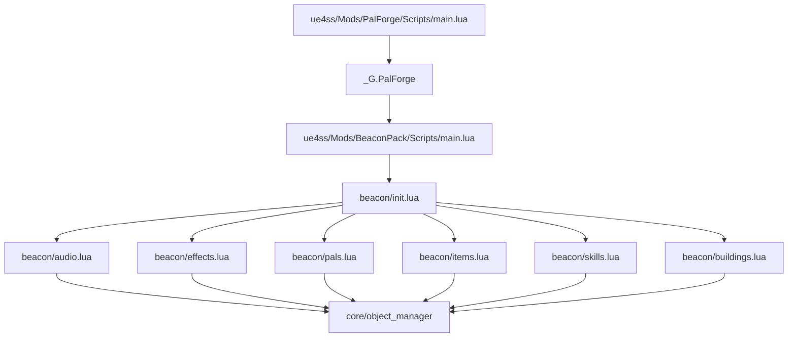
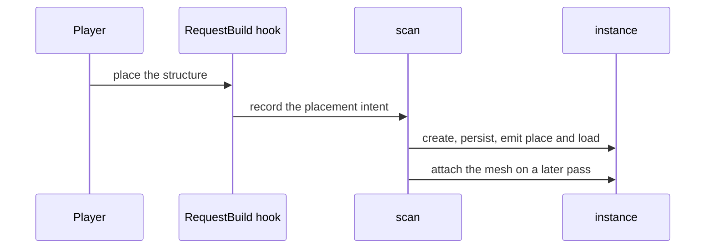
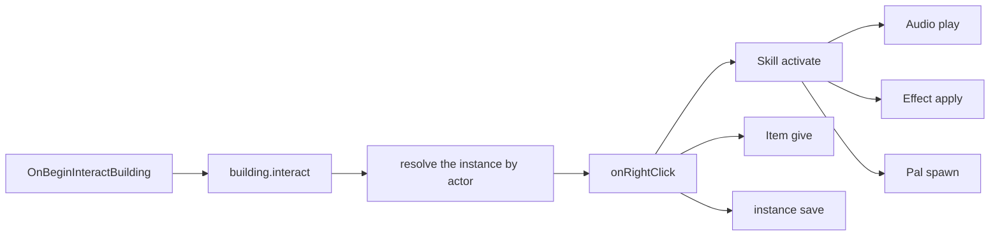

## このページでできるようになること

- 自分のモッドフォルダーを Palworld に置いて、読み込ませる
- ビルドメニューの構造物に、調べたときの動きを付ける
- その 1 回の操作で、音を鳴らし、強化を付け、アイテムを配る
- そのうちどれがこのバージョンで実行でき、それぞれがどう結果を報告するかを把握する
- 置いた構造物ごとにカウンターを持たせ、次に遊ぶときも残す
- 何かが起きなかったとき、ログを読んで理由を突き止める

## 作るもの

**BeaconPack** という名前のパックです。ビルドメニューにある構造物をひとつ受け持ち、そこに
動きを付けます。

- ビーコンを調べるとクールダウン 30 秒のスキルが発動し、
- スキルは調べたキャラクターに効果音を鳴らし、
- 12 秒間・最大 3 回まで重なる強化を付け、
- ビーコンの位置に守護パルを呼び出そうとします。
- ビーコン自身はアイテムを配り、使用回数を数え、チャージを 1 消費し、その値をワールド
  ファイルに保存します。
- 一定間隔で動くハンドラーが、離れているあいだにチャージを回復させます。

効果音・強化・払い出し・クールダウン・カウンター・保存される状態は、いずれもゲーム内で本当に
起こります。このバージョンで実行できないのは守護パルの 1 つだけで、その箇所でもう一度断ります。

これで Building・Skill・Audio・Effect・Pal・Item のすべてに触れます。パック自体は独立した
モッドフォルダーで、同じセッションに読み込まれている PalForge を再利用します。

始める前の前提です。

- PalForge がインストールされ、読み込まれていること。`ue4ss/Mods/PalForge/Scripts/main.lua`
  が動き、UE4SS コンソールに `[PalForge.main][info] ready` が出ていれば問題ありません。
- パルを呼ぶ処理は、ゲーム自身の管理用オブジェクト `UPalCheatManager` を通ります。PalForge
  はそれを探し、無ければプレイヤーコントローラー上に自分で作るので、ワールドに入ってさえ
  いれば呼び出しは発行されます。
- アイテムを配る処理も同じ管理用オブジェクトを通り、実測した結果を返します。
  `Item.Handle:give` は前後でインベントリーを読み、所持数が本当に増えたときだけ `true` です。
- このパックがすることのうち 1 つは、このバージョンでは実行できません。fail-soft です。
  `Pal.Handle:spawn` はワールドにクリーチャーを出しません。`false` を返し、ログに 1 行書き、
  ハンドラーの残りはそのまま進みます。それでもパックに書いておくのは、形が正しいからであり、
  すべての呼び出しの結果を確かめるパックこそ壊れないからです。[Pal](/docs/api/pal) を参照して
  ください。

<Callout type="info">
以下のビーコンは、ゲームにすでにある構造物・アイテム・生物を受け持ちます。Lua は既存の id に
動きとメタデータを足せますが、ゲームのデータテーブルに新しい行そのものを追加することは
できません。新しいビルドオブジェクト・アイテム・生物の行を publish するのは PalSchema の
仕事です。自分の行ができたときに変わるのは 1 行だけで、それは「応用」の
[自分の id に移行する](#自分の-id-に移行する)で示します。
</Callout>

## パックの構成

パックは、PalForge と同じく `Scripts/main.lua` を持つ独立した UE4SS モッドフォルダーです。

```text
ue4ss/Mods/BeaconPack/
    enabled.txt              <- UE4SS's own switch for this mod folder
    Scripts/
        main.lua             <- the entry point UE4SS runs
        beacon/
            init.lua         <- requires every domain module, in dependency order
            audio.lua        <- the sounds
            effects.lua      <- the blessing
            pals.lua         <- the guardian
            items.lua        <- the reward
            skills.lua       <- the signal: sound + blessing + guardian
            buildings.lua    <- the beacon itself
```

モッドフォルダーの有効化は、お使いの UE4SS の流儀で行ってください。フォルダー内の
`enabled.txt` でも、`mods.txt` への 1 行でも構いません。大事なのはその下の形、つまり
コンテンツの種類ごとに 1 ファイルと、それらを require する `init.lua` です。

PalForge は読み込みの最後に、自分自身を `_G.PalForge` というグローバルに置きます。

```lua
_G.PalForge = {
    env    = env,                       -- { dev, name, version }
    api    = require("palforge.api"),   -- Pal, Item, Building, Skill, Effect, Audio, Mesh, UI, Player
    utils  = { log, json, file, items },
    core   = { registry, event, object_manager, spawn, mesh, sound, player, spatial, icons },
    native = require("palforge.native"),
}
```

パックはこのテーブルを読みます。PalForge から必要なものはこれがすべてです。`api` が
コンテンツを書く相手、`utils.log` がゲームのコンソールに出すロガー、`core.event` が
イベントバス、`native` が Palworld 自身のコンテンツを id ごとに並べたカタログです。



モジュールを require すれば、その中身は登録されます。`X{ ... }` の呼び出しはファイルの
読み込み中に実行され、定義を PalForge に書き込むので、**require そのものが登録**です。

## パックを作る

<Steps>

<Step>

### モッドフォルダーを作る

`ue4ss/Mods/BeaconPack/Scripts/beacon/` を作り、UE4SS の流儀でモッドを有効化します。準備は
これだけです。生成するものもビルドするものもありません。

</Step>

<Step>

### エントリーポイントを書く

`main.lua` がするのは 3 つです。`require("beacon.audio")` が自分のファイルを見つけられる
ように `Scripts` ディレクトリーを `package.path` に足すこと、PalForge が読み込まれているか
確かめること、パックを require することです。中身は短く保ちます。コンテンツはモジュール側の
仕事です。

```lua title="ue4ss/Mods/BeaconPack/Scripts/main.lua"
-- BeaconPack — a PalForge content pack, running as its own UE4SS Lua mod.
--
-- Install layout (mirrors PalForge's own):
--   ue4ss/Mods/BeaconPack/Scripts/main.lua      <- this file
--   ue4ss/Mods/BeaconPack/Scripts/beacon/*.lua  <- the pack's modules

-- Make require() resolve beacon.* relative to this Scripts dir.
local thisDir = debug.getinfo(1, "S").source:match("@?(.*[\\/])") or ""
package.path = thisDir .. "?.lua;" .. thisDir .. "?\\init.lua;" .. package.path

-- PalForge publishes itself on _G.PalForge at the end of its own main.lua.
local forge = _G.PalForge
if not forge then
    pcall(print, "[BeaconPack] PalForge is not loaded - this pack does nothing this session")
    return
end

local log = forge.utils.log.scope("beacon")
log.info("loading against PalForge v" .. tostring(forge.env.version))

local ok, err = pcall(function() require("beacon") end)
if not ok then
    log.err("load failed: " .. tostring(err))
else
    log.info("loaded")
end
```

`forge.utils.log.scope("beacon")` は `info` / `warn` / `err` を持つロガーを返します。
それぞれメッセージを 1 つ受け取ります。出力される行はすべて `[PalForge.beacon]` と
ログレベル（`[PalForge.beacon][info]`、`[PalForge.beacon][warn]`、`[PalForge.beacon][err]`）
で始まるので、PalForge 本体と同じやり方でパックのログを絞り込めます。

<Callout type="warn">
`_G.PalForge` は PalForge が読み込まれたあとにだけ、しかも同じ Lua ステートの中にだけ
存在します。パックはその同じステートに、PalForge より後に読み込まれる必要があります。上の
ガードはエラーにせず静かに抜けるので、このメッセージが出たら 2 つのモッドフォルダーの
読み込み順を確認してください。
</Callout>

</Step>

<Step>

### パックのインデックスを書く

コンテンツの種類ごとに 1 つの require を、依存順に並べます。スキルは効果音・強化・守護パルを
使い、建築はスキルと報酬アイテムを使います。

```lua title="Scripts/beacon/init.lua"
-- beacon — the pack's modules, one per domain, required in dependency order.
-- Requiring a module IS registering its content: every X{ ... } call inside runs on
-- require and writes the definition into PalForge's object_manager.
local M = {}

M.audio     = require("beacon.audio")      -- the sound the beacon plays
M.effects   = require("beacon.effects")    -- the blessing it hands out
M.pals      = require("beacon.pals")       -- the guardian it calls
M.items     = require("beacon.items")      -- the reward it pays out
M.skills    = require("beacon.skills")     -- the signal: sound + blessing + guardian
M.buildings = require("beacon.buildings")  -- the structure the player interacts with

return M
```

</Step>

<Step>

### 効果音を宣言する

音は鳴らしたいときに自分で鳴らします。勝手に鳴るものではありません。定義では、ゲーム自身の
サウンドイベント `AkAudioEvent` を 2 通りで指定します。実際に再生されるのはアセットパスの
`soundPath`、`soundId` は名前で引くフォールバックです。

```lua title="Scripts/beacon/audio.lua"
-- beacon.audio — the sounds this pack plays.
local api   = _G.PalForge.api
local log   = _G.PalForge.utils.log.scope("beacon.audio")
local Audio = api.Audio

local M = {}

-- The beacon's activation sound, named by the pack. Both fields point at the SAME event;
-- the pair is copied out of PalForge's AkAudioEvent catalog (native.audio.CATALOG).
M.Signal = Audio.se{
    id          = "beacon:Signal",
    name        = "Beacon Signal",
    description = "Played on the interacting character when the beacon fires.",
    soundId     = "AKE_BuffAura",
    soundPath   = "/Game/Pal/Sound/Events/SE/System/StatusCondition/AKE_BuffAura.AKE_BuffAura",
}

-- The same thing, looked up by name instead of typed out: native.audio.se returns a ready
-- handle for any catalog name, and nil for a name the catalog does not have.
M.Reward = _G.PalForge.native.audio.se("AKE_CampLevelUp")
if not M.Reward then log.warn("AKE_CampLevelUp is not in the AkAudioEvent catalog") end

return M
```

`Audio.se` と `Audio.bgm` は `kind` を代わりに埋めてくれます。`kind` は自分のための目印で、
BGM も効果音も再生の呼び出しは同じです。

<Callout type="warn">
このドメインには、動かないものが 2 つあります。`Handle:setVolume` は `false` を返すだけで何も
変わらず、ゲーム側にもサウンド単位の音量が存在しないので、音量は最初から目的に近いサウンド
イベントを選んで合わせてください。
`soundFile`（独自の音声ファイル）は受け付けられますが何もしないので、カタログにある
`AkAudioEvent` を使ってください。`Handle:stop` も音単位ではなく、そのアクターで再生中のものを
すべて止めます。
</Callout>

</Step>

<Step>

### エフェクトを宣言する

エフェクトは自分のスケジュールを持ちます。`:apply(target)` が適用を開始し、PalForge が
共有の 500 ms ハートビートで、期限切れか削除まで進めます。

```lua title="Scripts/beacon/effects.lua"
-- beacon.effects — the blessing the beacon hands out.
local api    = _G.PalForge.api
local log    = _G.PalForge.utils.log.scope("beacon.effects")
local Effect = api.Effect
local Item   = api.Item

local M = {}

-- 12 seconds long, ticking every 3, up to 3 stacks. The timing is owned by PalForge; the
-- gameplay is owned by these handlers.
M.Blessing = Effect{
    id          = "beacon:Blessing",
    name        = "Beacon Blessing",
    description = "A short blessing granted by the beacon.",
    duration    = 12.0,
    interval    = 3.0,
    stackable   = true,
    maxStacks   = 3,
    events = {
        onApply = function(effect, target, ctx)
            -- ctx carries effect and stacks, plus whatever you passed to :apply.
            log.info("blessing applied by " .. tostring(ctx.source))
        end,
        onStack = function(effect, target, ctx)
            log.info("blessing stacked to " .. tostring(ctx.stacks))
        end,
        onTick = function(effect, target, ctx)
            -- One berry per tick, scaled by the stack count. ctx.elapsed is how long this
            -- application has been alive, in seconds.
            Item.get("Berries"):give(ctx.stacks)
            log.info(string.format("blessing tick at %.1fs", ctx.elapsed))
        end,
        onExpire = function(effect, target, ctx)
            -- ctx.reason is "duration", "removed", "target_gone" or "world_left".
            log.info("blessing ended: " .. tostring(ctx.reason))
        end,
    },
}

return M
```

エフェクトのハンドラーの第 1 引数はこのエフェクトの**ハンドル**なので、`:remove` や
`:timeLeft`、`:stacksOn` がそのまま使えます。`:apply(target, ctx)` に渡したものは
`onApply` と `onStack` から読めます。`onTick` と `onExpire` が受け取るのはランタイム自身の
context です（`effect`、`elapsed`、`stacks`、終了時は `reason`）。

<Callout type="warn">
定義の `nativeStatus` は、エフェクトが動いているあいだゲーム本来の状態異常アイコンを点け、終了
すると消します。ゲームプレイまで一緒に付いてくるわけではないので、エフェクトが実際にすることは
`onTick` に書いてください。アイコンとダメージは別の話です。
</Callout>

</Step>

<Step>

### 守護パルを宣言する

`"Kitsunebi"` はゲームにすでにある生物 id なので、この定義は既存の生物に動きを与えるもの
です。`mesh` は省いてください。パルは自前のモデルを持っているので、`mesh` を書くのは別の
モデルを着せたいときだけです。

```lua title="Scripts/beacon/pals.lua"
-- beacon.pals — the guardian the beacon calls.
local api = _G.PalForge.api
local log = _G.PalForge.utils.log.scope("beacon.pals")
local Pal = api.Pal

local M = {}

M.Guardian = Pal{
    id          = "Kitsunebi",
    name        = "Beacon Guardian",
    description = "The creature the beacon calls.",
    -- Ids only. Nothing equips them for you; read them back with :skillsOf().
    skills      = { "beacon:Flare" },
    events = {
        onSpawned = function(pal, ctx)
            log.info("guardian spawned: " .. tostring(ctx.actor))
        end,
        onDamaged = function(pal, ctx)
            log.info("guardian took damage")
        end,
        onCaptured = function(pal, ctx)
            log.info("guardian captured - the beacon lost its keeper")
        end,
        onDeath = function(pal, ctx)
            log.info("guardian died")
        end,
    },
}

return M
```

PalForge はスポーンした生物のブループリントクラス名からこの定義を見つけます。
`BP_Kitsunebi_C` から `Kitsunebi` を取り出して引きます。自分の定義を持たないバニラのパルは
どれにも一致せず、ハンドラーは呼ばれません。

パルには `onTick` も書けます。PalForge が 3 秒ごとにワールド内の生きたパルを見て回り、
1 体につき 1 回呼びます。`ctx.actor` がその個体、`ctx.count` がハートビート番号、`ctx.now`
が時刻です。同じ id の個体すべてでハンドルは 1 つなので、個体ごとの値は `ctx.actor` を
キーにして自分で持ってください。間隔は
`require("palforge.core.event").PAL_SCAN_MS = 5000` で変えられ、`0` にすると止まります。

</Step>

<Step>

### 報酬アイテムを宣言する

```lua title="Scripts/beacon/items.lua"
-- beacon.items — the reward the beacon pays out.
local api  = _G.PalForge.api
local log  = _G.PalForge.utils.log.scope("beacon.items")
local Item = api.Item

local M = {}

-- "Ruby" is a real game ItemId. Defining it attaches metadata and handlers to that id; it
-- does not create a new inventory row.
M.Reward = Item{
    id          = "Ruby",
    name        = "Ruby",
    description = "What the beacon pays out.",
    category    = "material",
    maxStack    = 999,
    -- Metadata: nothing in PalForge publishes a recipe into the game's crafting tables.
    -- Read it back with Item.get("Ruby"):recipeOf().
    recipe = {
        materials = { Stone = 20, Flint = 5 },
        count     = 1,
        work      = 30,
        station   = "Workbench",
    },
    events = {
        onObtain = function(item, ctx)
            log.info("reward obtained x" .. tostring(ctx.count))
        end,
    },
}

return M
```

<Callout type="warn">
`onObtain` が追いかけているのは、ゲーム自身の「アイテムを入手した」ログ
（`PalPlayerState:AddItemGetLog_ToClient`）で、拾得・戦利品・報酬で発火します。この入手ログに
出ないインベントリー追加は対象外なので、自分で呼んだ `:give` が `onObtain` として返ってくると
思わないでください。記録したいなら `:give` を呼んだ場所で書きます。`onCraft` と `onDiscard` は
書けますが、まだ何も送られてきません。
</Callout>

</Step>

<Step>

### シグナル（スキル）を宣言する

スキルのハンドラーをゲームが呼ぶことはありません。自分で呼びます。`:activate(owner)` は
その場で `onActivate` を走らせ、クールダウン中なら断ります。この「断り」が、ビーコンに必要な
ゲートそのものです。

```lua title="Scripts/beacon/skills.lua"
-- beacon.skills — the signal the beacon fires. :activate runs the handler now and refuses
-- while the skill is still cooling down, so the beacon gets its rate limit for free.
local api     = _G.PalForge.api
local log     = _G.PalForge.utils.log.scope("beacon.skills")
local Skill   = api.Skill
local audio   = require("beacon.audio")
local effects = require("beacon.effects")
local pals    = require("beacon.pals")

local M = {}

M.Flare = Skill{
    id          = "beacon:Flare",
    name        = "Beacon Flare",
    description = "Sound, blessing and a called guardian - the beacon's whole payload.",
    kind        = "active",
    element     = "fire",
    cooldown    = 30.0,
    power       = 25,
    events = {
        onActivate = function(skill, owner, ctx)
            audio.Signal:play(owner)                                -- on the interacting character
            effects.Blessing:apply(owner, { source = ctx.beacon })  -- 12s, stacks to 3
            pals.Guardian:spawn{ at = ctx.at, level = 5 }           -- false: no pal appears
            log.info("flare fired from " .. tostring(ctx.beacon))
        end,
    },
}

return M
```

クールダウンは owner ごと、スキル id ごとに記録されるので、2 人のプレイヤーは互いに干渉せず
クールダウンします。ビーコンごとではありません。ここでの owner は `ctx.player` なので、同じ
プレイヤーが 2 つ目のビーコンを調べても 30 秒が明けるまでは発動しません。

</Step>

<Step>

### ビーコン本体を宣言する

設置した構造物には、1 つずつ専用のライブオブジェクトが付きます。それが以下のハンドラーの
`self` です。`self.actor` が設置されたアクター、`self.pos` がワールド座標、`self.state` が
保存される自分用のテーブル、`self.key` がセーブ内での安定した名前、`self:save()` が state を
ワールドファイルに書き出します。

```lua title="Scripts/beacon/buildings.lua"
-- beacon.buildings — the structure the player interacts with.
local api      = _G.PalForge.api
local log      = _G.PalForge.utils.log.scope("beacon.buildings")
local Building = api.Building
local items    = require("beacon.items")
local skills   = require("beacon.skills")

local M = {}

-- "Altar" is a real game BuildObjectId, so the beacon claims a structure that is already in
-- the build menu.
M.Beacon = Building{
    id           = "Altar",
    name         = "Signal Beacon",
    description  = "Interact with it to fire the beacon.",
    gridCm       = 100,
    tickInterval = 4,   -- every 4th heartbeat, so roughly every 2 seconds
    -- A factory, not a plain table: a plain table is handed to every new instance as the
    -- SAME table, and two beacons would then share one counter.
    state = function()
        return { uses = 0, charges = 3 }
    end,
    events = {
        onPlace = function(self, ctx)
            log.info(string.format("beacon placed at %.0f/%.0f/%.0f",
                self.pos.x, self.pos.y, self.pos.z))
            self:save()
        end,
        onLoad = function(self, ctx)
            log.info(string.format("beacon tracked %s: %d use(s), %d charge(s)",
                ctx.reconstructed and "from the save" or "fresh",
                self.state.uses, self.state.charges))
        end,
        onRightClick = function(self, ctx)
            if self.state.charges <= 0 then
                log.info("beacon is empty - wait for it to recharge")
                return
            end
            -- ctx.player is the character that interacted; ctx.actor is the structure.
            local fired = skills.Flare:activate(ctx.player, { beacon = self.key, at = self.pos })
            if not fired then
                log.info(string.format("beacon cooling down: %.0fs left",
                    skills.Flare:cooldownLeft(ctx.player)))
                return
            end
            items.Reward:give(3)
            self.state.uses    = self.state.uses + 1
            self.state.charges = self.state.charges - 1
            self:save()
        end,
        onTick = function(self, ctx)
            if self.state.charges >= 3 then return end
            self.state.charges = self.state.charges + 1
            self:setDirty()   -- mark it; the file is written by the next :save() or on world-left
            if self.state.charges == 3 then
                log.info("beacon fully charged at heartbeat " .. tostring(ctx.count))
                self:save()
            end
        end,
        onRemove = function(self, ctx)
            log.info(string.format("beacon gone [%s] after %d use(s)",
                tostring(ctx.reason), self.state.uses))
        end,
        onWorldLeft = function(self, ctx)
            -- The last look at this instance: it is dropped right after, while its saved
            -- record survives for the next load.
            log.info("beacon going quiet: " .. self.key)
        end,
    },
}

return M
```

見落としやすい点が 2 つあります。

- `onTick` は、それを書いた定義でだけ動きます。`onTick` の無い建築は tick の対象リストにも
  入りません。
- `tickInterval` は秒ではなくハートビート数です。ハートビートは 500 ms なので、`4` は
  およそ 2 秒です。

</Step>

<Step>

### 読み込んでログを見る

両方のモッドを有効にしてゲームを起動し、ワールドに入って Altar を設置し、調べてみます。
UE4SS のコンソールに一部始終が出ます。

```text
[PalForge.main][info] PalForge v0.3.0 starting (dev=true)
[PalForge.registry][info] initialized (dev=true, 12 class(es) registered)
[PalForge.beacon][info] loading against PalForge v0.3.0
[PalForge.beacon][info] loaded
[PalForge.event][info] world ready - building dispatch enabled
[PalForge.beacon.buildings][info] beacon placed at 12345/-6789/420
[PalForge.beacon.buildings][info] beacon tracked fresh: 0 use(s), 3 charge(s)
[PalForge.beacon.effects][info] blessing applied by Altar@123,-68,4
[PalForge.spawn][warn] spawn.palAt: SpawnMonster(Kitsunebi, lv 5) ran and NOTHING spawned, so there is nothing to move to (12345,-6789,420)
[PalForge.beacon.skills][info] flare fired from Altar@123,-68,4
[PalForge.items][info] give Ruby x3: 0 -> 3 [evidence declared]
[PalForge.beacon.effects][info] blessing tick at 3.0s
```

登録クラス数とインスタンスキーはセッション次第で変わりますが、行の順番は変わりません。
`onActivate` は自分のログを出す前に効果音・エフェクト・スポーン試行を実行するので、先に
エフェクトとスポーンの行が出ます。`give` の行が出るのは `:activate` が返ってからです。

このうち 1 行が、隠されずに報告された「このバージョンで実行できないこと」です。クリーチャーは
配置されませんでした。それ以外の行はパックが動いている証拠で、`give` の行が前後の所持数を出して
いるのは、その `true` がそこから実測されたものだからです。`false` のあとも処理を続けるハンドラー
だからこそ、ログをこう読めます。どの段階が成立しなかったかがそのまま見えます。

</Step>

</Steps>

## 実行時に起きること

ビーコンの設置は 1 つのイベントではありません。ゲームはアクターが存在する前に
`RequestBuild_ToServer` のフックで設置を知らせ、同じ 500 ms のハートビートで走るスキャンが
後から本物のアクターを見つけ、ライブオブジェクトを作り、保存し、宣言された mesh を*その次の*
パスで取り付けます。設置されたフレームで取り付けるとゲームがクラッシュするため、mesh は
待たされます。



設置された構造物には固有の id が無いため、PalForge はビルド id と丸めた座標で名前を付けます。
`gridCm = 100` のビーコンなら `Altar@123,-68,4` です。これが `self.key` で、保存レコードも
この名前で格納されます。

インタラクトは短い経路です。`OnBeginInteractBuilding` のフックが 1 秒以内の連打を無視して
`building.interact` を送り、PalForge がアクターからライブオブジェクトを見つけて、その
`onRightClick` を呼びます。



ビーコンの残りの一生も、同じハートビートと同じワールドゲートの上で動きます。

- **ワールド準備完了。** 1 秒ごとのポーリングで有効な `PalPlayerCharacter` を 5 回連続で
  見つけるとゲートが開き、その後に最初に終わったスキャンが `world.ready` を送って、生きて
  いる構造物すべての `onWorldReady` を呼びます。ゲートが開くまで建築スキャンは何もしません。
  これがロード直後の嵐から距離を取る仕組みです。
- **Tick。** `LoopAsync(500)` が `tick` を送ります。`onTick` を書いた定義の生きている構造物
  が、それぞれの `tickInterval` に従って呼ばれます。ハンドラーが 5 回失敗するとその構造物の
  `onTick` は止められ、警告がログに出ます。他は動き続けます。
- **削除。** スキャンで 6 回連続して見つからなかった構造物は `building.remove` を送って
  （つまり `onRemove` はまだそれを見られます）破棄され、保存レコードも消えます。
- **ワールド退出。** プレイヤーポーンが無効になると `world.left` が送られ、生きている構造物
  すべての `onWorldLeft` が走り、ワールドファイルが書き出され、ライブオブジェクトは破棄され
  ます。保存レコードは残り、次回それを `onLoad` が復元します。

state の保存には 2 つのやり方があります。`self:save()` は変更ありの印を付けて、今すぐワールド
ファイルを書きます。`self:setDirty()` は印を付けるだけで、1 秒に 2 回走るようなハンドラーでは
こちらが適切です。書き込みは次の `save()` かワールド退出時に行われます。

起動後に登録された定義も問題ありません。建築ランタイムはスキャンのたびに、そして設置を
記録する前に定義を読み直すので、PalForge の数分後に読み込まれたパックの構造物もきちんと
追跡されます。

## ゲームが動かすもの、自分で動かすもの

ハンドラーを前提に設計する前に、ここを確認してください。

| ドメイン | ゲームが呼ぶもの | 自分で呼ぶもの |
| --- | --- | --- |
| Building | `onPlace`, `onLoad`, `onRightClick`, `onRemove`, `onTick`, `onBuild`, `onWorldReady`, `onWorldLeft` | `:instances()`, `:render()`, `:update()`, `:unlock()` |
| Pal | `onSpawned`, `onDamaged`, `onDeath`, `onCaptured`, `onTick` | `:spawn()`（このバージョンでは何も配置しません）、`:renderOn(actor)`、`:skillsOf()`、`:teachAll(actor)` |
| Item | `onObtain`, `onUse` | `:count()`、`:give(n)`、`:take(n)`（取り除いた分はプレイヤーの足元に落ちます）、`:iconOf()`、`:recipeOf()` |
| Effect | `onApply`, `onTick`, `onStack`, `onExpire`（PalForge 自身のスケジュール） | `:apply()`, `:remove()`, `:isActive()`, `:stacksOn()`, `:timeLeft()` |
| Skill | なし | `:activate()`, `:hit()`, `:equip()`, `:unequip()`, `:cooldownLeft()`, `:teach(actor)`, `:forget(actor)`, `:skillsOn(actor)` |
| Audio | なし | `:play()`, `:stop()` |

書けるけれどまだ動かないハンドラーが 4 つあります。ゲーム側に知らせる仕組みが無いためです。
`Building.onLeftClick`、`Building.onBreak`、`Item.onCraft`、`Item.onDiscard` です。構造物には
`onRightClick` と `onRemove` を、アイテムには `onObtain` と `onUse` を使ってください。将来
ソースが見つかったときにパックを書き換えずに済むよう、宣言だけは通ります。

`Building.onBuild` は建築が完了したときに走ります。ライブオブジェクトができるまで最大で
スキャン 1 回ぶんの時間があるので、`self` がライブオブジェクトではなく定義になる唯一の建築
ハンドラーです。`self.actor`、`self.pos`、`self.state`、`self:save()` はありません。あるのは
`ctx.buildId` と `ctx.model` です。同じ合図はセーブを開いたときに既存の構造物すべてでも
発火するため、PalForge はワールドの読み込みが終わってから聞き始めます。設置の処理は
`onPlace` が安全です。`onBuild` はまず捨ててよいワールドで試してください。

`Building.onWorldReady` は、構造物ごとではなくワールドロード時の 1 回だけの合図です。
`world.ready` はワールドが開いたあと最初に終わったスキャンが送るので、プレイヤーの近くの
構造物はすでに追跡されていて受け取れますが、後のスキャンで出てくるものは受け取れません。
構造物ごとの初期化は `onLoad` に置いてください。セーブから戻ってきたことは
`ctx.reconstructed` で分かります。`event.on("world.ready", fn)` でチャンネルを直接購読する
のでも構いません。

`Pal.onSpawned` は `BroadcastOnCompleteInitializeParameter` に接続されていますが、これは
確定したフックではなく候補で、PalForge もワールドの読み込み後にだけ有効にします。ベスト
エフォートとして扱い、2 回走っても平気なハンドラーにしてください。

## 応用

### ビーコンに専用の mesh を持たせる

mesh もひとつのコンテンツなので、一度宣言すれば複数の定義から着せられます。モジュールを
追加します。

```lua title="Scripts/beacon/meshes.lua"
-- beacon.meshes — named visuals, so a model is declared once and reused by id.
local api  = _G.PalForge.api
local Mesh = api.Mesh

local M = {}

-- A structure wears a STATIC mesh. Any UStaticMesh path works; this one ships with the game.
M.Beacon = Mesh{
    id    = "beacon:BeaconBody",
    kind  = "static",
    model = "/Game/Pal/Model/Other/PalBox/SM_PalBox.SM_PalBox",
    scale = 1.0,
    color = { r = 1.0, g = 0.6, b = 0.1, a = 1.0 },
}

return M
```

そのうえで `beacon/buildings.lua` の先頭で require し
（`local meshes = require("beacon.meshes")`）、定義の `mesh` にハンドルを渡します
（`gridCm` の隣に `mesh = meshes.Beacon,`）。ハンドルを渡しても、その場に直接書いても
構いません。`mesh = meshes.Beacon` と `mesh = { kind = "static", model = "..." }` は
まったく同じように検証されます。

mesh が取り付けられていれば、`self.color` と `self:update()` でハンドラーから色を塗り直せ
ます。

```lua
onTick = function(self, ctx)
    self.color = (self.state.charges >= 3)
        and { r = 1.0, g = 0.9, b = 0.3, a = 1.0 }
        or  { r = 0.4, g = 0.4, b = 0.5, a = 1.0 }
    self:update()
end,
```

`update()` は PalForge が取り付けた mesh の無いアクターでは安全に何もしないので、mesh を
持たない定義で色を変えても失敗はせず、単に何も起きません。

### 自分の id に移行する

コロンを含む id `"beacon:Beacon"` は、データテーブルの行名 `beacon_Beacon` になります。
PalSchema がその行を publish したら、パックの変更は 1 か所だけです。

```lua
M.Beacon = Building{
    id   = "beacon:Beacon",           -- your own row instead of "Altar"
    name = "Signal Beacon",
    -- ... everything else identical
}
```

MOD で追加した建築のテクノロジーは、解決後の id と同じ名前の `DT_TechnologyRecipeUnlock`
行になります。`Handle:unlock()` はまさにその行を解放し、構造物がビルドメニューに出るように
します。

```lua
_G.PalForge.api.Building.get("beacon:Beacon"):unlock()
```

この呼び出しは `PalCheatManager` がすでにセッションに存在している必要があるので、
CheatManagerEnabler モッドを入れておいてください。

### デバッグ用モジュールを足す

イベントバスは自由に使えるので、診断用モジュールは数行で書けます。購読のコストは無く、
すべてのチャンネルは何かが送られる前に用意されているので、先に購読しても取りこぼしません。

```lua title="Scripts/beacon/debug.lua"
-- beacon.debug — diagnostics for the pack. Require it from init.lua while developing.
local forge  = _G.PalForge
local log    = forge.utils.log.scope("beacon.debug")
local event  = forge.core.event
local Effect = forge.api.Effect
local Player = forge.api.Player

local M = {}

-- Raw channel traffic, before dispatch resolves anything.
M.subs = {
    event.on("building.interact", function(ctx)
        log.info("interact: buildId=" .. tostring(ctx.buildId))
    end),
    event.on("pal.captured", function(ctx)
        log.info("captured: " .. tostring(ctx.actor))
    end),
}

-- Every 5 seconds: how many beacons are live, and what is on the player.
M.report = event.every(5000, function()
    local beacons = forge.api.Building.get("Altar"):instances()
    local active  = Effect.activeOn(Player.character())
    log.info(string.format("%d beacon(s) live, %d effect(s) on the player",
        #beacons, #active))
end)

-- Stop everything: for _, s in ipairs(M.subs) do s:unsubscribe() end; M.report:unsubscribe()
return M
```

`event.every(ms, fn)` は 500 ms のハートビートに丸められます。購読はどれも
`:unsubscribe()` を持つオブジェクトを返します。

## 動かないとき

**定義の呼び出しがエラーになる。** 問題はすべてハードエラーなので、呼び出しが中途半端に
成功することはありません。メッセージを読んでください。たいていそこに答えが全部あります。
フィールド名のタイプミス:

```text
PalForge: Building: unknown field "tickinterval" (did you mean "tickInterval"?). Valid fields: id, name, description, gridCm, buildIds, tickInterval, mesh, material, color, texture, icon, state, events, data
```

`events` の中のタイプミス。入れ子のシェイプ名まで出るので、どの宣言を読めばよいかが分かり
ます:

```text
PalForge: Building: field "events" (Building.Spec.Events): unknown field "onRightclick" (did you mean "onRightClick"?). Valid fields: onPlace, onLoad, onRightClick, onRemove, onTick, onWorldReady, onWorldLeft, onBuild, onLeftClick, onBreak
```

必須フィールドの欠落。そのフィールド自身の説明が付きます:

```text
PalForge: Building: field "id" is required (build id: a game BuildObjectId ("PalBoxV2") or "pack:name")
```

同じ情報は、当てずっぽうに書く代わりに実行時に読めます。

```lua
local schema = require("palforge.core.schema")
print(schema.help("Building.Spec"))        -- every field, type, default and meaning
print(schema.help("Building.Spec.Events"))
```

**調べても何も起きない。** まず `[PalForge.event][info] world ready` を探します。建築ランタイム
はこれを待っています。次に構造物が追跡されているか確認します:
`#Building.get("Altar"):instances()`。空のリストなら、スキャンがアクターと定義を結び付けら
れていません。たいていは `Building{ id = ... }` の id が、そのゲーム内構造物の id と違うのが
原因です。

**パルが出てこない。** このバージョンでは `:spawn` からパルは現れません。設定を間違えたわけでは
なく、これが想定どおりの結果です。詳細は [Pal](/docs/api/pal) にあります。それとは別に、もっと
手前で失敗している可能性も潰しておいてください。スポーンにはセッション内にプレイヤー
コントローラーが必要で、無い場合はゲームに届く前に
`spawn.palAt: no PalCheatManager and none could be constructed (no player controller yet?)`
をログに出します。

**ごほうびが届かない。** `:give` は所持数が増えたのを観測できなかったときに `false` を返し、
どこで止まったかをログ行が教えてくれます。管理用オブジェクトがそもそも無い（`CheatManagerEnablerMod`
を有効にしてください）、ゲームが知らないアイテム ID だった、インベントリーに空きが無かった、の
いずれかです。

**スキルが 2 回目から発動しない。** `cooldown` が働いています。`:activate` はクールダウン中
に `false` を返します。`kind` が `"passive"` のスキル、そしてハンドラー自身が例外を投げた
場合も `false` です。

**エフェクトは tick しているのに何も変わらない。** エフェクトが回すのは自分のスケジュール
であって、ゲームの状態異常システムではありません。実際の効果は `onTick` に書きます。

**同じ id の定義が 2 つある。** 同じ種類のコンテンツで同じ id を 2 回登録すると先のものが
置き換わるので、最後に走った定義が勝ちます。定義はロード時に行い、ハンドラーの中では
再定義せず `X.get(id)` を使ってください。

## 次に読むもの

<Cards>
  <Card title="Building" href="/docs/api/building">
    ライブオブジェクト、state、スキャン、そして定義の全フィールド。
  </Card>
  <Card title="Lifecycle" href="/docs/concepts/lifecycle">
    チャンネル・ソース・ディスパッチを端から端まで。
  </Card>
  <Card title="Skill" href="/docs/api/skill">
    自分でスキルを発動する方法と、クールダウンの持ち方。
  </Card>
  <Card title="Effect" href="/docs/api/effect">
    duration・interval・スタックと、ハートビートごとの処理。
  </Card>
  <Card title="Pal" href="/docs/api/pal">
    スポーン、mesh、そしてパルのハンドラー全部。
  </Card>
  <Card title="Item" href="/docs/api/item">
    give と take、レシピ、動く 2 つのイベント。
  </Card>
  <Card title="Audio" href="/docs/api/audio">
    音が鳴るまでの道筋、カタログ、そして足りないもの。
  </Card>
  <Card title="Mesh" href="/docs/api/mesh">
    名前付きのビジュアル、バックエンド、マテリアル上書き。
  </Card>
  <Card title="Definitions" href="/docs/concepts/definitions">
    どのコンテンツにも共通する 3 つの入口。
  </Card>
  <Card title="Schema" href="/docs/concepts/schema">
    フィールドの形の宣言・検証・読み出し。
  </Card>
  <Card title="Editor setup" href="/docs/concepts/editor-setup">
    spec から生成される、全フィールドの補完。
  </Card>
</Cards>

## まとめ

- パックは `Scripts/main.lua` を持つ独立したモッドフォルダーです。`_G.PalForge` を読み、
  自分のモジュールを require すると、その中の `X{ ... }` が読み込み時にコンテンツを登録します。
- どのコンテンツでも必須フィールドは `id` だけです。コロンを含む id（`"beacon:Flare"`）は
  自分のもの、含まない id（`"Altar"`、`"Ruby"`、`"Kitsunebi"`）はゲームにすでにあるものです。
- 専用のライブオブジェクトを持つのは、設置した建築だけです。`self.state` が自分のテーブルで、
  `self:save()` でワールドファイルに書けば次のセッションにも残ります。
- 建築・パル・アイテムのハンドラーはゲームが呼びます。スキルと音は自分で鳴らし、エフェクトは
  PalForge のスケジュールで動きます。
- `tickInterval` は秒ではなく 500 ms のハートビート数です。
- 定義が間違っていると、フィールド名と正しい候補を示すメッセージで呼び出しが止まります。同じ
  一覧は `schema.help("Building.Spec")` で実行時にも読めます。

次は [Building](/docs/api/building) を読むと、構造物に書ける全フィールドと、ライブオブジェクト
でできることが分かります。
