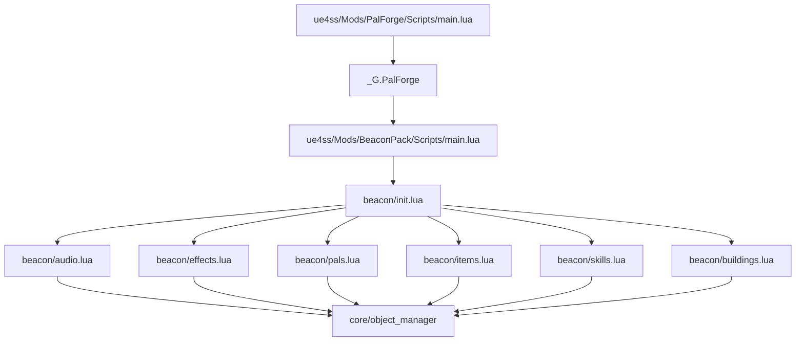
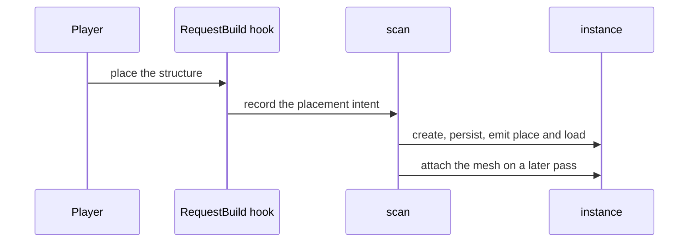
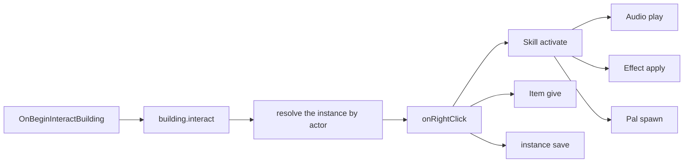

## What you are building

A pack called **BeaconPack**. It claims one structure in the build menu — a beacon — and
gives it behaviour:

- interacting with the beacon fires a skill with a 30 second cooldown,
- the skill plays a sound on the interacting character,
- applies a 12 second stacking effect to them,
- and calls a guardian pal at the beacon's position,
- the beacon itself pays out an item, counts its uses, spends a charge, and saves that
  count into the world file,
- a heartbeat handler recharges it while you are away from it.

That touches Building, Skill, Audio, Effect, Pal and Item, and the whole thing is a
separate UE4SS mod that reuses the PalForge already loaded in the session.

Before you start:

- PalForge is installed and loading — `ue4ss/Mods/PalForge/Scripts/main.lua` runs, and the
  UE4SS console shows `[PalForge.main][info] ready`.
- `Pal.Handle:spawn` goes through `UPalCheatManager`, so calling a pal needs the cheat
  manager to exist this session (the CheatManagerEnabler mod). Without it the spawn logs a
  warning and returns `false`; everything else in the pack still runs.
- `Item.Handle:give` does not need the cheat manager — it goes through the inventory's own
  `AddItem_ServerInternal`.

<Callout type="info">
Lua alone cannot publish a new DataTable row. Defining `Building{ id = "Altar" }` gives an
**existing** structure behaviour and metadata; publishing a brand new build object, item or
creature row is PalSchema's job. The pack below therefore claims real game ids, and the
section on [moving to your own ids](#variations) shows the one line that changes when a row
of your own exists.
</Callout>

## How a pack is laid out

A pack is its own UE4SS mod folder with its own `Scripts/main.lua`, exactly like PalForge:

```text
ue4ss/Mods/BeaconPack/
    enabled.txt              <- UE4SS's own switch for this mod folder
    Scripts/
        main.lua             <- the entry point UE4SS runs
        beacon/
            init.lua         <- requires every domain module, in dependency order
            audio.lua        <- the sounds
            effects.lua      <- the blessing
            pals.lua         <- the guardian
            items.lua        <- the reward
            skills.lua       <- the signal: sound + blessing + guardian
            buildings.lua    <- the beacon itself
```

Whether a mod folder is switched on by an `enabled.txt` inside it or by an entry in
`mods.txt` is UE4SS's business, not PalForge's. What matters here is the shape below it:
one file per domain, plus an `init.lua` that requires them.

PalForge's `main.lua` finishes by publishing itself:

```lua
_G.PalForge = {
    env    = env,                       -- { dev, name, version }
    api    = require("palforge.api"),   -- Pal, Item, Building, Skill, Effect, Audio, Mesh, UI, Player
    utils  = { log, json, file, items },
    core   = { registry, event, object_manager, spawn, mesh, sound, player, spatial, icons },
    native = require("palforge.native"),
}
```

Your pack reads that table. It is the whole contract between the two mods: `api` is what you
write content against, `utils.log` is the logger, `core.event` is the bus, and `native` is
Palworld's own content as catalogs.



There is no registration step. Every `X{ ... }` call writes its definition into
`object_manager` as it runs, so **requiring a module is registering its content**.

## Build the pack

<Steps>

<Step>

### Create the mod folder

Make `ue4ss/Mods/BeaconPack/Scripts/beacon/` and switch the mod on the way your UE4SS
install expects. Nothing else is needed: a pack has no manifest, no descriptor and no
build step.

</Step>

<Step>

### Write the entry point

`main.lua` does three things: put its own `Scripts` directory on `package.path`, check that
PalForge is there, and require the pack. Keep it thin — content belongs in the modules.

```lua title="ue4ss/Mods/BeaconPack/Scripts/main.lua"
-- BeaconPack — a PalForge content pack, running as its own UE4SS Lua mod.
--
-- Install layout (mirrors PalForge's own):
--   ue4ss/Mods/BeaconPack/Scripts/main.lua      <- this file
--   ue4ss/Mods/BeaconPack/Scripts/beacon/*.lua  <- the pack's modules

-- Make require() resolve beacon.* relative to this Scripts dir.
local thisDir = debug.getinfo(1, "S").source:match("@?(.*[\\/])") or ""
package.path = thisDir .. "?.lua;" .. thisDir .. "?\\init.lua;" .. package.path

-- PalForge publishes itself on _G.PalForge at the end of its own main.lua.
local forge = _G.PalForge
if not forge then
    pcall(print, "[BeaconPack] PalForge is not loaded - this pack does nothing this session")
    return
end

local log = forge.utils.log.scope("beacon")
log.info("loading against PalForge v" .. tostring(forge.env.version))

local ok, err = pcall(function() require("beacon") end)
if not ok then
    log.err("load failed: " .. tostring(err))
else
    log.info("loaded")
end
```

`forge.utils.log.scope("beacon")` returns a table with `info` / `warn` / `err`, each taking
**one** message. Every line it prints starts with `[PalForge.beacon]` followed by the level
it was logged at — `[PalForge.beacon][info]`, `[PalForge.beacon][warn]`,
`[PalForge.beacon][err]` — so the pack's output filters the same way the framework's does.

<Callout type="warn">
`_G.PalForge` is a global in the Lua state PalForge runs in. A pack that reads it has to be
loaded into that same state and after PalForge, which is why the guard above bails instead
of erroring. If it does fire, check the load order of the two mod folders.
</Callout>

</Step>

<Step>

### Write the pack index

One require per domain, in dependency order: the skill uses the sound, the blessing and the
guardian, and the building uses the skill and the reward.

```lua title="Scripts/beacon/init.lua"
-- beacon — the pack's modules, one per domain, required in dependency order.
-- Requiring a module IS registering its content: every X{ ... } call inside runs on
-- require and writes the definition into PalForge's object_manager.
local M = {}

M.audio     = require("beacon.audio")      -- the sound the beacon plays
M.effects   = require("beacon.effects")    -- the blessing it hands out
M.pals      = require("beacon.pals")       -- the guardian it calls
M.items     = require("beacon.items")      -- the reward it pays out
M.skills    = require("beacon.skills")     -- the signal: sound + blessing + guardian
M.buildings = require("beacon.buildings")  -- the structure the player interacts with

return M
```

</Step>

<Step>

### Declare the sounds

`Audio` has no lifecycle: you play it. A definition names a Wwise `AkAudioEvent` twice —
`soundPath` is the route that actually plays, `soundId` is the SoundID fallback.

```lua title="Scripts/beacon/audio.lua"
-- beacon.audio — the sounds this pack plays.
local api   = _G.PalForge.api
local log   = _G.PalForge.utils.log.scope("beacon.audio")
local Audio = api.Audio

local M = {}

-- The beacon's activation sound, named by the pack. Both fields point at the SAME event;
-- the pair is copied out of PalForge's AkAudioEvent catalog (native.audio.CATALOG).
M.Signal = Audio.se{
    id          = "beacon:Signal",
    name        = "Beacon Signal",
    description = "Played on the interacting character when the beacon fires.",
    soundId     = "AKE_BuffAura",
    soundPath   = "/Game/Pal/Sound/Events/SE/System/StatusCondition/AKE_BuffAura.AKE_BuffAura",
}

-- The same thing, looked up by name instead of typed out: native.audio.se returns a ready
-- handle for any catalog name, and nil for a name the catalog does not have.
M.Reward = _G.PalForge.native.audio.se("AKE_CampLevelUp")
if not M.Reward then log.warn("AKE_CampLevelUp is not in the AkAudioEvent catalog") end

return M
```

`Audio.se` and `Audio.bgm` are the same constructor with `kind` pinned; `kind` is
descriptive, because the native play route is the same call for music and effects.

<Callout type="warn">
Two seams in this domain: `Handle:setVolume` is not implemented and returns `false`, and a
`soundFile` (your own audio file) resolves but no-ops — no `USoundWave` loader is confirmed.
`Handle:stop` is not per sound either; it stops everything playing on that actor.
</Callout>

</Step>

<Step>

### Declare the effect

An effect's schedule is real. `:apply(target)` starts a live application that PalForge
advances off the shared 500 ms heartbeat until it expires or you remove it.

```lua title="Scripts/beacon/effects.lua"
-- beacon.effects — the blessing the beacon hands out.
local api    = _G.PalForge.api
local log    = _G.PalForge.utils.log.scope("beacon.effects")
local Effect = api.Effect
local Item   = api.Item

local M = {}

-- 12 seconds long, ticking every 3, up to 3 stacks. The timing is owned by PalForge; the
-- gameplay is owned by these handlers.
M.Blessing = Effect{
    id          = "beacon:Blessing",
    name        = "Beacon Blessing",
    description = "A short blessing granted by the beacon.",
    duration    = 12.0,
    interval    = 3.0,
    stackable   = true,
    maxStacks   = 3,
    events = {
        onApply = function(effect, target, ctx)
            -- ctx carries effect and stacks, plus whatever you passed to :apply.
            log.info("blessing applied by " .. tostring(ctx.source))
        end,
        onStack = function(effect, target, ctx)
            log.info("blessing stacked to " .. tostring(ctx.stacks))
        end,
        onTick = function(effect, target, ctx)
            -- One berry per tick, scaled by the stack count. ctx.elapsed is how long this
            -- application has been alive, in seconds.
            Item.get("Berries"):give(ctx.stacks)
            log.info(string.format("blessing tick at %.1fs", ctx.elapsed))
        end,
        onExpire = function(effect, target, ctx)
            -- ctx.reason is "duration", "removed" or "target_gone".
            log.info("blessing ended: " .. tostring(ctx.reason))
        end,
    },
}

return M
```

The first argument of an effect handler is this effect's **handle**, so `:remove`,
`:timeLeft` and `:stacksOn` are right there. The context you pass to `:apply(target, ctx)`
is readable in `onApply` and `onStack`; `onTick` and `onExpire` get the runtime's own
context only (`effect`, `elapsed`, `stacks`, and `reason` on expiry).

<Callout type="warn">
A PalForge effect does not toggle the game's own ailment icons. `EPalStatusEffectType` is a
native enum and no call to apply one is confirmed, so `nativeStatus` is metadata. Whatever
the effect should *do* has to happen in your handlers.
</Callout>

</Step>

<Step>

### Declare the guardian

`"Kitsunebi"` is a real game CharacterID, so this definition attaches behaviour to a
creature that already exists. No mesh is declared: the pal already has its own model, and
`mesh` is what you use to make a pawn wear a different one.

```lua title="Scripts/beacon/pals.lua"
-- beacon.pals — the guardian the beacon calls.
local api = _G.PalForge.api
local log = _G.PalForge.utils.log.scope("beacon.pals")
local Pal = api.Pal

local M = {}

M.Guardian = Pal{
    id          = "Kitsunebi",
    name        = "Beacon Guardian",
    description = "The creature the beacon calls.",
    -- Ids only. Nothing equips them for you; read them back with :skillsOf().
    skills      = { "beacon:Flare" },
    events = {
        onSpawned = function(pal, ctx)
            log.info("guardian spawned: " .. tostring(ctx.actor))
        end,
        onDamaged = function(pal, ctx)
            log.info("guardian took damage")
        end,
        onCaptured = function(pal, ctx)
            log.info("guardian captured - the beacon lost its keeper")
        end,
        onDeath = function(pal, ctx)
            log.info("guardian died")
        end,
    },
}

return M
```

Dispatch finds this definition by the spawned pawn's blueprint class name: `BP_Kitsunebi_C`
becomes `Kitsunebi`, which is looked up in the registry. A vanilla pal with no PalForge
definition resolves to nothing and the dispatch no-ops.

</Step>

<Step>

### Declare the reward

```lua title="Scripts/beacon/items.lua"
-- beacon.items — the reward the beacon pays out.
local api  = _G.PalForge.api
local log  = _G.PalForge.utils.log.scope("beacon.items")
local Item = api.Item

local M = {}

-- "Ruby" is a real game ItemId. Defining it attaches metadata and handlers to that id; it
-- does not create a new inventory row.
M.Reward = Item{
    id          = "Ruby",
    name        = "Ruby",
    description = "What the beacon pays out.",
    category    = "material",
    maxStack    = 999,
    -- Metadata: nothing in PalForge publishes a recipe into the game's crafting tables.
    -- Read it back with Item.get("Ruby"):recipeOf().
    recipe = {
        materials = { Stone = 20, Flint = 5 },
        count     = 1,
        work      = 30,
        station   = "Workbench",
    },
    events = {
        onObtain = function(item, ctx)
            log.info("reward obtained x" .. tostring(ctx.count))
        end,
    },
}

return M
```

<Callout type="warn">
`onObtain` is driven by the game's own "obtained item" log
(`PalPlayerState:AddItemGetLog_ToClient`), which fires on pickups, loot and rewards. An
inventory add that does not surface a get log is not covered, so do not assume your own
`:give` call will come back to you as an `onObtain`. `onCraft` and `onDiscard` are
declarable but nothing emits their channels yet.
</Callout>

</Step>

<Step>

### Declare the signal

There is no native source for skills: nothing in the game fires one for you. What works is
manual invocation, and `:activate` enforces the cooldown in Lua — which is exactly the gate
the beacon needs.

```lua title="Scripts/beacon/skills.lua"
-- beacon.skills — the signal the beacon fires. :activate runs the handler now and refuses
-- while the skill is still cooling down, so the beacon gets its rate limit for free.
local api     = _G.PalForge.api
local log     = _G.PalForge.utils.log.scope("beacon.skills")
local Skill   = api.Skill
local audio   = require("beacon.audio")
local effects = require("beacon.effects")
local pals    = require("beacon.pals")

local M = {}

M.Flare = Skill{
    id          = "beacon:Flare",
    name        = "Beacon Flare",
    description = "Sound, blessing and a called guardian - the beacon's whole payload.",
    kind        = "active",
    element     = "fire",
    cooldown    = 30.0,
    power       = 25,
    events = {
        onActivate = function(skill, owner, ctx)
            audio.Signal:play(owner)                                -- on the interacting character
            effects.Blessing:apply(owner, { source = ctx.beacon })  -- 12s, stacks to 3
            pals.Guardian:spawn{ at = ctx.at, level = 5 }           -- at the beacon
            log.info("flare fired from " .. tostring(ctx.beacon))
        end,
    },
}

return M
```

The cooldown is tracked per owner and per skill id, so two players cool down independently.
It is not per beacon: the owner here is `ctx.player`, so one player's second beacon is still
blocked until the 30 seconds are up.

</Step>

<Step>

### Declare the beacon

Buildings are the one domain with a real per-structure runtime. `self` in every handler
below is the **live instance**: `self.actor` is the placed actor, `self.pos` its world
position, `self.state` your persisted table, `self.key` its stable registry key, and
`self:save()` writes the state to the world file.

```lua title="Scripts/beacon/buildings.lua"
-- beacon.buildings — the structure the player interacts with.
local api      = _G.PalForge.api
local log      = _G.PalForge.utils.log.scope("beacon.buildings")
local Building = api.Building
local items    = require("beacon.items")
local skills   = require("beacon.skills")

local M = {}

-- "Altar" is a real game BuildObjectId, so the beacon claims a structure that is already in
-- the build menu.
M.Beacon = Building{
    id           = "Altar",
    name         = "Signal Beacon",
    description  = "Interact with it to fire the beacon.",
    gridCm       = 100,
    tickInterval = 4,   -- every 4th heartbeat, so roughly every 2 seconds
    -- A factory, not a plain table: a plain table is handed to every new instance as the
    -- SAME table, and two beacons would then share one counter.
    state = function()
        return { uses = 0, charges = 3 }
    end,
    events = {
        onPlace = function(self, ctx)
            log.info(string.format("beacon placed at %.0f/%.0f/%.0f",
                self.pos.x, self.pos.y, self.pos.z))
            self:save()
        end,
        onLoad = function(self, ctx)
            log.info(string.format("beacon tracked %s: %d use(s), %d charge(s)",
                ctx.reconstructed and "from the save" or "fresh",
                self.state.uses, self.state.charges))
        end,
        onRightClick = function(self, ctx)
            if self.state.charges <= 0 then
                log.info("beacon is empty - wait for it to recharge")
                return
            end
            -- ctx.player is the character that interacted; ctx.actor is the structure.
            local fired = skills.Flare:activate(ctx.player, { beacon = self.key, at = self.pos })
            if not fired then
                log.info(string.format("beacon cooling down: %.0fs left",
                    skills.Flare:cooldownLeft(ctx.player)))
                return
            end
            items.Reward:give(3)
            self.state.uses    = self.state.uses + 1
            self.state.charges = self.state.charges - 1
            self:save()
        end,
        onTick = function(self, ctx)
            if self.state.charges >= 3 then return end
            self.state.charges = self.state.charges + 1
            self:setDirty()   -- mark it; the file is written by the next :save() or on world-left
            if self.state.charges == 3 then
                log.info("beacon fully charged at heartbeat " .. tostring(ctx.count))
                self:save()
            end
        end,
        onRemove = function(self, ctx)
            log.info(string.format("beacon gone [%s] after %d use(s)",
                tostring(ctx.reason), self.state.uses))
        end,
        onWorldLeft = function(self, ctx)
            -- The last look at this instance: it is dropped right after, while its saved
            -- record survives for the next load.
            log.info("beacon going quiet: " .. self.key)
        end,
    },
}

return M
```

Two details that are easy to miss:

- `onTick` only runs for a definition that actually declares it. PalForge compares the
  class against the inert base and ticks nothing else.
- `tickInterval` counts heartbeats, not seconds. The heartbeat is 500 ms, so `4` is about
  two seconds.

</Step>

<Step>

### Load it and watch the log

Start the game with both mods enabled, load a world, place an Altar and interact with it.
The UE4SS console tells the whole story:

```text
[PalForge.main][info] PalForge v0.3.0 starting (dev=true)
[PalForge.registry][info] initialized (dev=true, 12 class(es) registered)
[PalForge.beacon][info] loading against PalForge v0.3.0
[PalForge.beacon][info] loaded
[PalForge.event][info] world ready - building dispatch enabled
[PalForge.beacon.buildings][info] beacon placed at 12345/-6789/420
[PalForge.beacon.buildings][info] beacon tracked fresh: 0 use(s), 3 charge(s)
[PalForge.beacon.effects][info] blessing applied by Altar@123,-68,4
[PalForge.spawn][info] spawn.palAt Kitsunebi (lv 5) @ (12345,-6789,420) via SpawnMonster+teleport
[PalForge.beacon.skills][info] flare fired from Altar@123,-68,4
[PalForge.items][info] give Ruby x3
[PalForge.beacon.effects][info] blessing tick at 3.0s
```

The registered-class count and the instance key are whatever your session produces; the
order of the lines is not. `onActivate` runs the sound, the effect and the spawn before it
logs its own line, so the blessing and the spawn are reported first — and `give Ruby x3`
only after `:activate` has returned.

</Step>

</Steps>

## What happens at runtime

Placing the beacon is not one event. A `RequestBuild_ToServer` hook records the intent
before the actor exists, and a scan running on the same 500 ms heartbeat finds the real
actor afterwards, creates the instance, persists it, and attaches any declared mesh on a
*later* pass — attaching one the frame a structure is placed crashes the game.



A placed structure has no stable id of its own, so an instance is keyed by its build id plus
its quantized cell — `Altar@123,-68,4` for a beacon with `gridCm = 100`. That key is
`self.key`, and it is what the saved record is stored under.

Interaction is the short path. An `OnBeginInteractBuilding` hook debounces repeats for one
second, emits `building.interact`, and dispatch resolves the live instance by its actor
before calling `onRightClick` on it.



The rest of the beacon's life runs on the same heartbeat and the world gate:

- **World ready.** Five consecutive one-second polls that find a valid `PalPlayerCharacter`
  set the world ready, emit `world.ready`, and call `onWorldReady` on every live instance.
  Until then the building scan does nothing, which is what keeps it away from the load storm
  — and which is also why the instance set is still empty at that moment, so nothing
  receives `onWorldReady`.
- **Tick.** `LoopAsync(500)` emits `tick`. Every live instance whose class declares `onTick`
  is called, subject to its `tickInterval`. If a handler raises five times, that instance's
  `onTick` is disabled and a warning is logged; the rest keep running.
- **Removal.** An instance the scan misses six times in a row emits `building.remove` — so
  `onRemove` still sees the instance — and is then dropped along with its saved record.
- **World left.** When the player pawn goes invalid, `world.left` is emitted, `onWorldLeft`
  runs on every live instance, the world file is flushed, and the live instances are
  dropped. Saved records survive, which is what `onLoad` reconstructs from next time.

State persistence has two entry points. `self:save()` marks the instance dirty and writes
the world file now. `self:setDirty()` only marks it, which is what you want from a handler
that runs twice a second — the write happens on the next `save()` or at world-left.

Definitions registered after startup are fine. The building runtime refreshes its
definitions before every scan and before recording a placement intent, so a pack that loads
minutes after PalForge still gets its structures tracked.

## What the game drives, and what you drive

Be honest with yourself about this before you design around a hook.

| Domain | Fires by itself | You call it |
| --- | --- | --- |
| Building | `onPlace`, `onLoad`, `onRightClick`, `onRemove`, `onTick`, `onWorldLeft` | `:instances()`, `:render()`, `:update()`, `:unlock()` |
| Pal | `onCaptured`, `onDamaged`, `onDeath`, `onSpawned` | `:spawn()`, `:renderOn(actor)` |
| Item | `onObtain`, `onUse` | `:give(n)`, `:take(n)`, `:iconOf()` |
| Effect | `onApply`, `onTick`, `onStack`, `onExpire`, on PalForge's own schedule | `:apply()`, `:remove()`, `:isActive()`, `:timeLeft()` |
| Skill | nothing | `:activate()`, `:hit()`, `:equip()`, `:unequip()`, `:cooldownLeft()` |
| Audio | nothing | `:play()`, `:stop()` |

Declarable but never fired today, because no native source emits their channels:
`Building.onBuild` / `onLeftClick` / `onBreak`, `Pal.onTick`, `Item.onCraft` / `onDiscard`.
They stay declarable so your pack does not have to change when a source appears.

`Building.onWorldReady` is its own case: `world.ready` is emitted and dispatched, but the
scan that creates instances is gated on the same flag and has not run yet, so the dispatch
walks an empty set. Put the work in `onLoad` instead — `ctx.reconstructed` tells you the
instance came back from the save — or subscribe to the channel yourself with
`event.on("world.ready", fn)`.

`Pal.onSpawned` is wired to `BroadcastOnCompleteInitializeParameter`, which is a candidate
hook rather than a confirmed one. Treat it as best effort.

## Variations

### Give the beacon its own mesh

A mesh is a domain of its own, so you can declare one once and let several definitions wear
it. Add a module:

```lua title="Scripts/beacon/meshes.lua"
-- beacon.meshes — named visuals, so a model is declared once and reused by id.
local api  = _G.PalForge.api
local Mesh = api.Mesh

local M = {}

-- A structure wears a STATIC mesh. Any UStaticMesh path works; this one ships with the game.
M.Beacon = Mesh{
    id    = "beacon:BeaconBody",
    kind  = "static",
    model = "/Game/Pal/Model/Other/PalBox/SM_PalBox.SM_PalBox",
    scale = 1.0,
    color = { r = 1.0, g = 0.6, b = 0.1, a = 1.0 },
}

return M
```

Then in `beacon/buildings.lua`, require it at the top
(`local meshes = require("beacon.meshes")`) and pass the handle as the definition's `mesh`
(`mesh = meshes.Beacon,` next to `gridCm`). A defined mesh nests as itself because its
metatable carries the declaration the validator reads, so `mesh = meshes.Beacon` and an
inline `mesh = { kind = "static", model = "..." }` are validated identically.

Once a mesh is attached, `self.color` and `self:update()` re-tint it from a handler:

```lua
onTick = function(self, ctx)
    self.color = (self.state.charges >= 3)
        and { r = 1.0, g = 0.9, b = 0.3, a = 1.0 }
        or  { r = 0.4, g = 0.4, b = 0.5, a = 1.0 }
    self:update()
end,
```

`update()` is a safe no-op when the actor has no mesh PalForge attached, so a tint on a
mesh-less definition changes nothing rather than failing.

### Move to your own ids

A namespaced id `"beacon:Beacon"` resolves to the DataTable row name `beacon_Beacon`.
Once PalSchema publishes that row, the pack changes in one place:

```lua
M.Beacon = Building{
    id   = "beacon:Beacon",           -- was "Altar"
    name = "Signal Beacon",
    -- ... everything else identical
}
```

Modded building technologies get a `DT_TechnologyRecipeUnlock` row named after the resolved
id, and `Handle:unlock()` unlocks exactly that row so the structure shows up in the build
menu:

```lua
_G.PalForge.api.Building.get("beacon:Beacon"):unlock()
```

That call goes through `PalCheatManager`, so it needs the cheat manager available this
session.

### Add a debug module

The event bus is public, which makes a diagnostics module a few lines. Subscribing costs
nothing and every channel exists before anything emits, so subscribe-before-emit is safe.

```lua title="Scripts/beacon/debug.lua"
-- beacon.debug — diagnostics for the pack. Require it from init.lua while developing.
local forge  = _G.PalForge
local log    = forge.utils.log.scope("beacon.debug")
local event  = forge.core.event
local Effect = forge.api.Effect
local Player = forge.api.Player

local M = {}

-- Raw channel traffic, before dispatch resolves anything.
M.subs = {
    event.on("building.interact", function(ctx)
        log.info("interact: buildId=" .. tostring(ctx.buildId))
    end),
    event.on("pal.captured", function(ctx)
        log.info("captured: " .. tostring(ctx.actor))
    end),
}

-- Every 5 seconds: how many beacons are live, and what is on the player.
M.report = event.every(5000, function()
    local beacons = forge.api.Building.get("Altar"):instances()
    local active  = Effect.activeOn(Player.character())
    log.info(string.format("%d beacon(s) live, %d effect(s) on the player",
        #beacons, #active))
end)

-- Stop everything: for _, s in ipairs(M.subs) do s:unsubscribe() end; M.report:unsubscribe()
return M
```

`event.every(ms, fn)` is quantized to the 500 ms heartbeat, and every subscription returns
an object with `:unsubscribe()`.

## When something does not fire

**A define call errors.** Validation is strict and every problem is a hard error, so the
call never half succeeds. A typo:

```text
PalForge: Building: unknown field "tickinterval" (did you mean "tickInterval"?). Valid fields: id, name, description, gridCm, buildIds, tickInterval, mesh, material, color, texture, icon, state, events, data
```

A typo inside `events`, where the nested shape is named so you know what to go and read:

```text
PalForge: Building: field "events" (Building.Spec.Events): unknown field "onRightclick" (did you mean "onRightClick"?). Valid fields: onPlace, onLoad, onRightClick, onRemove, onTick, onWorldReady, onWorldLeft, onBuild, onLeftClick, onBreak
```

A missing required field, with the field's own documentation as the explanation:

```text
PalForge: Building: field "id" is required (build id: a game BuildObjectId ("PalBoxV2") or "pack:name")
```

You can read the same information at runtime instead of guessing:

```lua
local schema = require("palforge.core.schema")
print(schema.help("Building.Spec"))        -- every field, type, default and meaning
print(schema.help("Building.Spec.Events"))
```

**Nothing happens when you interact.** Check `[PalForge.event][info] world ready` first —
the building runtime is gated on it. Then confirm the instance exists:
`#Building.get("Altar"):instances()`. An empty list means the scan has not matched the actor
to your definition, usually because the id in `Building{ id = ... }` is not the id the game
uses for that structure.

**The pal does not appear.** With no cheat manager the coordinate spawn logs
`spawn.palAt: no PalCheatManager (CheatManagerEnabler mod missing this session?)` and
returns `false`. A `:spawn()` without an `at` reports the same thing as `spawn.pal:`.

**The skill never fires twice.** That is `cooldown` doing its job. `:activate` returns
`false` while cooling down — it also returns `false` for a passive skill, and if your own
handler raised.

**The effect ticks but nothing changes.** Effects run their schedule, not the game's status
system. Whatever should happen belongs in `onTick`.

**Two definitions, one id.** Registering the same `(type, id)` twice replaces the earlier
class, so the last definition to run wins. Define at load, and reach for `X.get(id)` inside
handlers rather than redefining on every event.

## Where to go next

<Cards>
  <Card title="Building" href="/docs/api/building">
    The instance, its state, the scan, and every field of the definition.
  </Card>
  <Card title="Lifecycle" href="/docs/concepts/lifecycle">
    Channels, sources and dispatch, end to end.
  </Card>
  <Card title="Skill" href="/docs/api/skill">
    Manual activation, cooldowns and the missing native source.
  </Card>
  <Card title="Effect" href="/docs/api/effect">
    Duration, interval, stacking, and what the runtime does each heartbeat.
  </Card>
  <Card title="Pal" href="/docs/api/pal">
    Spawning, meshes and which pal hooks are live.
  </Card>
  <Card title="Item" href="/docs/api/item">
    Give, take, recipes and the two live item events.
  </Card>
  <Card title="Audio" href="/docs/api/audio">
    The native play route, the catalog, and the seams.
  </Card>
  <Card title="Mesh" href="/docs/api/mesh">
    Named visuals, backends and material overrides.
  </Card>
  <Card title="Definitions" href="/docs/concepts/definitions">
    Why every domain is one callable module with the same three entry points.
  </Card>
  <Card title="Schema" href="/docs/concepts/schema">
    How specs are declared, validated and read back.
  </Card>
  <Card title="Editor setup" href="/docs/concepts/editor-setup">
    Completion for every field, generated from the specs.
  </Card>
</Cards>
